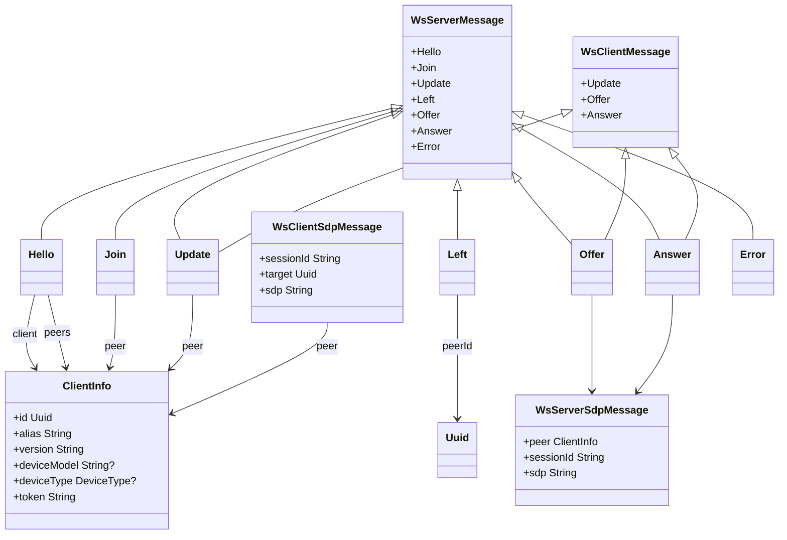
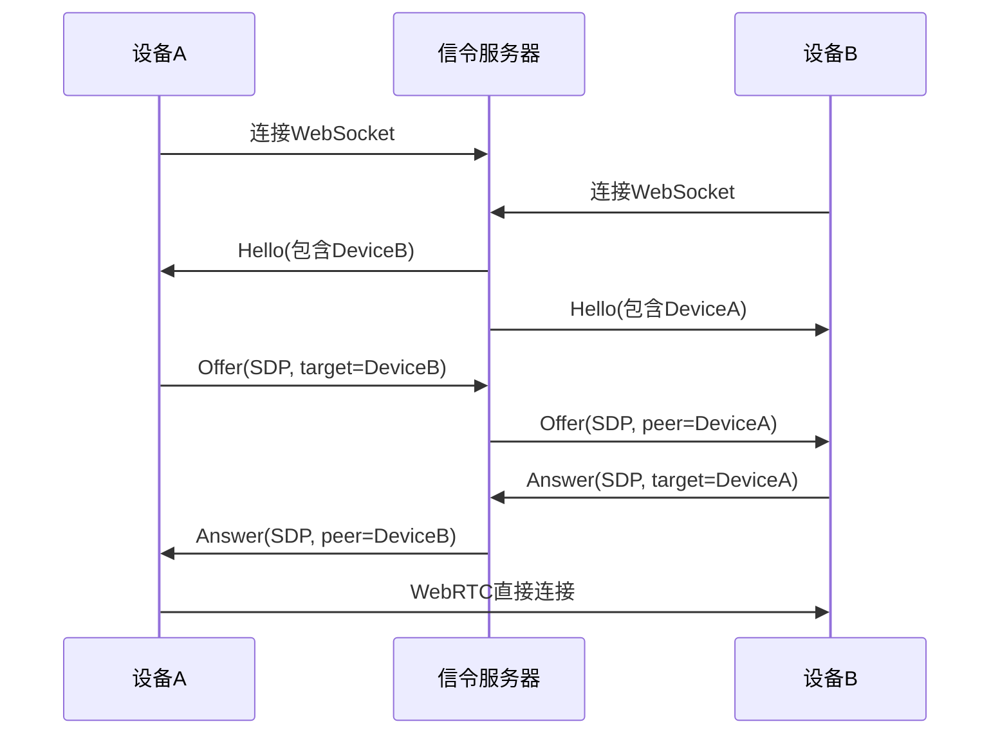

# API参考

<cite>
**本文档中引用的文件**  
- [api_route_builder.dart](file://common/lib/api_route_builder.dart)
- [receive_controller.dart](file://app/lib/provider/network/server/controller/receive_controller.dart)
- [send_controller.dart](file://app/lib/provider/network/server/controller/send_controller.dart)
- [signaling.rs](file://core/src/webrtc/signaling.rs)
- [ws_controller.rs](file://server/src/controller/ws_controller.rs)
- [frb_generated.dart](file://app/lib/rust/frb_generated.dart)
- [info_dto.dart](file://common/lib/model/dto/info_dto.dart)
- [prepare_upload_request_dto.dart](file://common/lib/model/dto/prepare_upload_request_dto.dart)
- [state.rs](file://server/src/config/state.rs)
</cite>

## 目录
1. [介绍](#介绍)
2. [RESTful API](#restful-api)
3. [WebSocket API](#websocket-api)
4. [Flutter-Rust FFI接口](#flutter-rust-ffi接口)
5. [错误处理策略](#错误处理策略)
6. [安全考虑](#安全考虑)
7. [客户端实现指南](#客户端实现指南)
8. [速率限制与版本控制](#速率限制与版本控制)

## 介绍
Localsend项目提供了一套完整的API，用于在设备间安全地传输文件。该API包括RESTful端点用于文件传输操作，WebSocket连接用于实时设备发现和WebRTC信令，以及Flutter-Rust FFI接口用于跨平台功能集成。本API文档详细说明了所有可用的端点、消息格式、认证方法和最佳实践。

**Section sources**
- [api_route_builder.dart](file://common/lib/api_route_builder.dart)

## RESTful API

### HTTP方法与URL模式
Localsend的RESTful API遵循标准的HTTP方法约定，使用基于版本的URL路径。所有API端点都以`/api/localsend/v{version}`为前缀，其中支持v1和v2版本。

| 端点 | HTTP方法 | 描述 |
|------|----------|------|
| `/info` | GET | 获取设备基本信息 |
| `/register` | POST | 注册设备到网络 |
| `/prepare-upload` | POST | 准备文件上传 |
| `/upload` | POST | 执行文件上传 |
| `/cancel` | POST | 取消传输会话 |
| `/show` | POST | 显示接收界面 |

### 认证方法
API使用基于证书的认证机制。每个设备都有一个唯一的指纹（fingerprint）作为身份标识。在v2版本中，还引入了PIN码保护，防止未经授权的设备发起传输请求。请求必须包含正确的fingerprint参数才能被接受。

### 文件传输端点

#### 准备上传
此端点用于初始化文件传输会话。发送方调用此端点来通知接收方即将发送的文件列表。

**请求格式**
```json
{
  "info": {
    "alias": "发送方设备名",
    "version": "协议版本",
    "deviceModel": "设备型号",
    "deviceType": "设备类型",
    "fingerprint": "设备指纹"
  },
  "files": {
    "文件ID": {
      "id": "文件ID",
      "fileName": "文件名",
      "size": 文件大小,
      "fileType": "文件类型"
    }
  }
}
```

**响应格式**
成功响应返回200状态码，并包含会话ID和文件令牌：
```json
{
  "sessionId": "会话ID",
  "files": {
    "文件ID": "文件令牌"
  }
}
```

#### 文件上传
此端点用于实际传输文件内容。发送方通过POST请求发送文件流。

**URL参数**
- `fileId`: 要上传的文件ID
- `token`: 文件令牌（v2）
- `sessionId`: 会话ID（v2）

**请求头**
- `Content-Length`: 文件大小
- `Content-Type`: application/octet-stream

#### 状态查询
通过检查会话状态来查询传输进度。接收方维护一个会话状态对象，包含每个文件的传输状态（队列、发送中、完成、失败）。

**Section sources**
- [receive_controller.dart](file://app/lib/provider/network/server/controller/receive_controller.dart)
- [send_controller.dart](file://app/lib/provider/network/server/controller/send_controller.dart)
- [info_dto.dart](file://common/lib/model/dto/info_dto.dart)
- [prepare_upload_request_dto.dart](file://common/lib/model/dto/prepare_upload_request_dto.dart)

## WebSocket API

### 连接处理
WebSocket连接用于实时设备发现和WebRTC信令。客户端通过`/v1/ws`端点建立WebSocket连接。连接建立时，客户端需要在查询参数中提供base64编码的设备信息。

**连接URL**
```
ws://<server-ip>:<port>/v1/ws?d=<base64-encoded-client-info>
```

### 消息格式
WebSocket API使用JSON格式的消息，包含类型标签和相应数据。所有消息都遵循统一的结构。



**Diagram sources**
- [signaling.rs](file://core/src/webrtc/signaling.rs)

### 事件类型
WebSocket API支持多种事件类型，用于设备间的实时通信：

1. **Hello**: 连接建立时的初始消息，包含连接的客户端信息和IP组内的其他对等方。
2. **Join**: 当新对等方加入IP组时广播。
3. **Update**: 当对等方更新其信息时广播。
4. **Left**: 当对等方离开时广播。
5. **Offer**: WebRTC SDP提供消息。
6. **Answer**: WebRTC SDP应答消息。
7. **Error**: 错误消息，包含错误代码。

### 实时交互模式
设备通过WebSocket连接形成一个IP组内的对等网络。每个设备既是客户端也是服务器，可以发送和接收消息。信令服务器负责在对等方之间路由SDP offer和answer消息，以建立WebRTC连接。



**Diagram sources**
- [ws_controller.rs](file://server/src/controller/ws_controller.rs)
- [signaling.rs](file://core/src/webrtc/signaling.rs)

## Flutter-Rust FFI接口

### 暴露的Rust函数
Flutter-Rust FFI接口通过`flutter_rust_bridge`生成，将Rust功能暴露给Dart层。主要功能包括网络通信、加密操作和系统集成。

```dart
class RustLib {
  static Future<void> init();
  static void initMock();
  static void dispose();
}
```

### 参数类型与返回值
所有FFI调用都使用序列化的数据结构进行通信。复杂对象通过JSON字符串传递，简单值直接映射。

**主要数据类型映射**
- `String` ↔ `String`
- `int` ↔ `i32`
- `bool` ↔ `bool`
- `List<int>` ↔ `Vec<u8>`
- `Map<String, dynamic>` ↔ `serde_json::Value`

### 核心功能
1. **网络通信**: 提供HTTP客户端和WebSocket连接的底层实现。
2. **加密操作**: 实现证书管理、令牌生成和验证。
3. **系统集成**: 访问平台特定功能如文件系统、通知和设备信息。

```mermaid
classDiagram
class RustLib {
+init()
+initMock()
+dispose()
}
class WsServerMessage {
+Hello
+Join
+Update
+Left
+Offer
+Answer
+Error
}
class WsClientMessage {
+Update
+Offer
+Answer
}
RustLib --> WsServerMessage : 序列化/反序列化
RustLib --> WsClientMessage : 序列化/反序列化
note right of RustLib
Flutter-Rust FFI接口
通过flutter_rust_bridge生成
处理Rust与Dart之间的数据转换
end note
```

**Diagram sources**
- [frb_generated.dart](file://app/lib/rust/frb_generated.dart)

## 错误处理策略

### HTTP错误响应
所有API端点返回标准化的JSON错误响应格式：

```json
{
  "message": "错误描述"
}
```

**常见HTTP状态码**
- `400 Bad Request`: 请求体格式错误
- `401 Unauthorized`: PIN码验证失败
- `403 Forbidden`: 无权限访问
- `409 Conflict`: 会话冲突
- `429 Too Many Requests`: 请求过于频繁
- `500 Internal Server Error`: 服务器内部错误

### WebSocket错误处理
WebSocket API使用专门的Error消息类型进行错误通知：

```json
{
  "type": "ERROR",
  "code": 429
}
```

错误代码与HTTP状态码对应，便于客户端统一处理。

### 客户端错误处理
客户端应实现重试机制和用户友好的错误提示。对于临时性错误（如网络中断），应自动重试；对于永久性错误（如权限拒绝），应向用户显示明确的错误信息。

**Section sources**
- [receive_controller.dart](file://app/lib/provider/network/server/controller/receive_controller.dart)
- [ws_controller.rs](file://server/src/controller/ws_controller.rs)

## 安全考虑

### 认证与授权
系统使用多层安全机制：
1. **设备指纹**: 基于证书的唯一设备标识
2. **PIN码保护**: 防止未经授权的传输请求
3. **IP地址验证**: 确保请求来自正确的设备

### 数据加密
所有通信都使用TLS加密。设备间直接传输时，使用WebRTC的SRTP协议加密媒体流。

### 防滥用机制
系统实现了速率限制来防止DDoS攻击：
- 每IP每小时最多1000个请求
- 每IP最多10个WebSocket连接

## 客户端实现指南

### API调用流程
1. 发现设备（通过mDNS或WebSocket）
2. 获取设备信息（调用`/info`端点）
3. 准备上传（调用`/prepare-upload`端点）
4. 上传文件（调用`/upload`端点）
5. 监控进度（查询会话状态）

### 响应状态处理
客户端应正确处理各种响应状态：
- `200 OK`: 操作成功
- `204 No Content`: 无内容（通常用于空文件请求）
- `4xx`: 客户端错误，需要用户干预
- `5xx`: 服务器错误，可尝试重试

## 速率限制与版本控制

### 速率限制
系统对API调用实施速率限制：
- REST API: 每IP每小时1000个请求
- WebSocket: 每IP最多10个并发连接

超过限制的请求将返回429状态码。

### 版本控制
API支持多个版本，通过URL路径区分：
- v1: `/api/localsend/v1/`
- v2: `/api/localsend/v2/`

新功能在v2中引入，v1保持向后兼容。弃用的v1功能将在未来版本中移除。

### 弃用功能迁移
从v1到v2的迁移指南：
1. 将`/send-request`替换为`/prepare-upload`
2. 使用`sessionId`和`token`参数进行更安全的会话管理
3. 实现PIN码验证流程

**Section sources**
- [api_route_builder.dart](file://common/lib/api_route_builder.dart)
- [state.rs](file://server/src/config/state.rs)