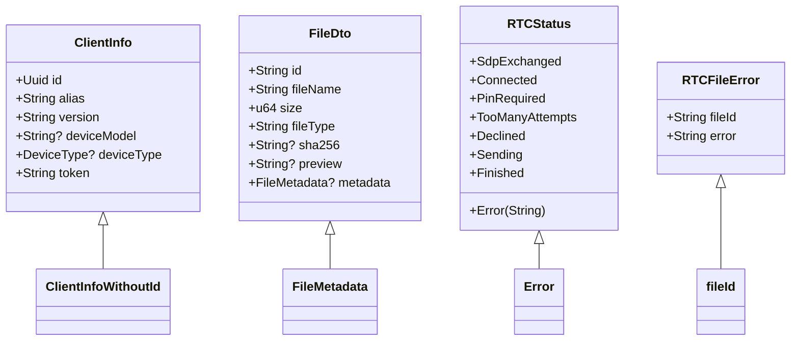

# FFI接口

<cite>
**本文档引用的文件**
- [crypto.rs](file://app/rust/src/api/crypto.rs)
- [webrtc.rs](file://app/rust/src/api/webrtc.rs)
- [model.rs](file://app/rust/src/api/model.rs)
- [frb_generated.rs](file://app/rust/src/frb_generated.rs)
- [flutter_rust_bridge.yaml](file://app/flutter_rust_bridge.yaml)
- [crypto.dart](file://app/lib/rust/api/crypto.dart)
- [webrtc.dart](file://app/lib/rust/api/webrtc.dart)
- [model.dart](file://app/lib/rust/api/model.dart)
- [security_helper.dart](file://app/lib/util/security_helper.dart)
</cite>

## 目录
1. [FFI桥接架构](#ffi桥接架构)
2. [加密相关接口](#加密相关接口)
3. [WebRTC相关接口](#webrtc相关接口)
4. [核心模型转换](#核心模型转换)
5. [Dart侧调用示例](#dart侧调用示例)
6. [性能考虑](#性能考虑)
7. [flutter_rust_bridge配置](#flutter_rust_bridge配置)

## FFI桥接架构

localsend项目使用flutter_rust_bridge作为Flutter与Rust之间的FFI桥接工具，实现了安全高效的跨语言通信。该架构通过自动生成的绑定代码，将Rust的异步函数暴露给Dart层，同时处理复杂的类型转换和内存管理。

桥接架构的核心组件包括：
- **Rust端API**：位于`rust/src/api/`目录下，包含加密、WebRTC和模型相关的功能实现
- **FFI生成器**：基于`flutter_rust_bridge.yaml`配置文件，自动生成Dart和Rust的绑定代码
- **异步调用处理**：通过StreamSink机制处理异步操作，确保非阻塞的通信
- **内存管理**：使用Rust的Arc（原子引用计数）和Dart的Finalizer来管理跨语言对象的生命周期

桥接层使用SSE（Server-Sent Events）编解码器进行数据传输，支持复杂的异步流式通信。对于Rust中的复杂对象（如WebRTC连接控制器），使用RustOpaque类型进行封装，确保对象在跨语言边界时的安全性。

**Section sources**
- [frb_generated.rs](file://app/rust/src/frb_generated.rs)
- [flutter_rust_bridge.yaml](file://app/flutter_rust_bridge.yaml)

## 加密相关接口

加密相关接口主要负责证书验证和密钥对生成，为WebRTC通信提供安全基础。这些接口位于`rust/src/api/crypto.rs`文件中，通过FFI暴露给Dart层。

### verifyCert
验证证书的有效性，确保通信双方的身份可信。

**参数：**
- `cert`：证书的PEM格式字符串
- `publicKey`：公钥字符串

**返回值：** 
- 成功时返回`void`
- 失败时抛出`anyhow::Result`异常

**异常：**
- 证书格式无效
- 公钥不匹配
- 签名验证失败

### generateKeyPair
生成新的密钥对，用于安全通信。

**参数：** 无

**返回值：**
- `KeyPair`对象，包含：
  - `privateKey`：私钥（PEM格式）
  - `publicKey`：公钥

**异常：**
- 密钥生成失败
- 密钥导出失败

在Dart侧，这些接口被封装在`lib/rust/api/crypto.dart`中，提供了类型安全的调用方式。密钥对生成使用Ed25519算法，确保了高安全性和性能。

**Section sources**
- [crypto.rs](file://app/rust/src/api/crypto.rs)
- [crypto.dart](file://app/lib/rust/api/crypto.dart)

## WebRTC相关接口

WebRTC相关接口是localsend项目的核心，负责建立点对点连接、文件传输和状态管理。这些接口位于`rust/src/api/webrtc.rs`文件中，提供了完整的WebRTC信令和数据通道功能。

### connect
建立与信令服务器的WebSocket连接。

**参数：**
- `sink`：StreamSink，用于接收服务器消息
- `uri`：信令服务器的URI
- `info`：客户端信息（别名、版本等）
- `privateKey`：私钥，用于身份验证
- `onConnection`：连接建立后的回调函数

**返回值：** 无（通过StreamSink和回调函数传递结果）

### LsSignalingConnection
信令连接的主要控制器，提供以下方法：

#### sendOffer
发送WebRTC连接提议。

**参数：**
- `stunServers`：STUN服务器列表
- `target`：目标设备的UUID
- `privateKey`：私钥
- `expectingPublicKey`：期望的公钥（可选）
- `pin`：PIN配置（可选）
- `files`：要发送的文件列表

**返回值：** `RTCSendController`对象

#### acceptOffer
接受WebRTC连接提议。

**参数：**
- `stunServers`：STUN服务器列表
- `offer`：收到的SDP提议
- `privateKey`：私钥
- `expectingPublicKey`：期望的公钥（可选）
- `pin`：PIN配置（可选）

**返回值：** `RTCReceiveController`对象

#### updateInfo
更新客户端信息。

**参数：** `info`：新的客户端信息

**返回值：** 无

### RTCSendController
发送方控制器，管理文件发送过程。

**方法：**
- `listenStatus`：监听连接状态变化
- `listenSelectedFiles`：获取接收方选择的文件
- `listenError`：监听错误信息
- `sendPin`：发送PIN码
- `sendFile`：发送文件数据

### RTCReceiveController
接收方控制器，管理文件接收过程。

**方法：**
- `listenStatus`：监听连接状态变化
- `listenFiles`：获取发送的文件列表
- `sendPin`：发送PIN码
- `sendSelection`：发送文件选择
- `decline`：拒绝连接
- `listenError`：监听错误信息
- `listenReceiving`：监听文件接收
- `sendFileStatus`：发送文件传输状态

### RTCFileSender和RTCFileReceiver
文件传输的具体实现，分别用于发送和接收文件数据块。

**Section sources**
- [webrtc.rs](file://app/rust/src/api/webrtc.rs)
- [webrtc.dart](file://app/lib/rust/api/webrtc.dart)

## 核心模型转换

FFI接口中的复杂对象需要在Rust和Dart之间进行序列化和反序列化。flutter_rust_bridge使用自动生成的编解码器来处理这些转换。

### 模型映射
使用`#[frb(mirror(...))]`宏将Rust结构体映射到Dart类：



**Diagram sources**
- [model.rs](file://app/rust/src/api/model.rs)
- [webrtc.rs](file://app/rust/src/api/webrtc.rs)

### 序列化机制
- **SSE编解码器**：用于常规函数调用和返回值
- **Dco编解码器**：用于RustOpaque对象的传递
- **自动类型转换**：基本类型（String、Int、Bool等）自动转换
- **集合类型**：Vec<T>转换为List<T>，HashMap<K,V>转换为Map<K,V>

复杂对象的序列化采用二进制格式，通过DartCObject进行传递，确保了高效的数据传输。

**Section sources**
- [model.rs](file://app/rust/src/api/model.rs)
- [frb_generated.rs](file://app/rust/src/frb_generated.rs)

## Dart侧调用示例

以下是Dart侧调用FFI接口的典型示例，展示了如何正确使用这些接口。

### 加密功能调用
```dart
// 生成密钥对
final keyPair = await generateKeyPair();
print('Private Key: ${keyPair.privateKey}');
print('Public Key: ${keyPair.publicKey}');

// 验证证书
try {
  await verifyCert(
    cert: certificatePem,
    publicKey: publicKeyPem,
  );
  print('证书验证成功');
} on Exception catch (e) {
  print('证书验证失败: $e');
}
```

### WebRTC连接建立
```dart
// 建立信令连接
final connectionStream = connect(
  uri: 'wss://signaling-server.com',
  info: ProposingClientInfo(
    alias: 'My Device',
    version: '1.0.0',
  ),
  privateKey: privateKey,
  onConnection: (connection) async {
    // 连接建立后的处理
    _signalingConnection = connection;
  },
);

// 监听信令消息
connectionStream.listen((message) {
  switch (message) {
    case WsServerMessage.hello():
      print('连接到服务器，当前有${message.peers.length}个设备');
    case WsServerMessage.join():
      print('新设备加入: ${message.peer.alias}');
    case WsServerMessage.offer():
      _handleOffer(message);
  }
});
```

### 文件发送流程
```dart
// 发送文件提议
final sendController = await _signalingConnection.sendOffer(
  stunServers: ['stun:stun.l.google.com:19302'],
  target: targetDeviceId,
  privateKey: privateKey,
  files: filesToSend,
);

// 监听发送状态
sendController.listenStatus().listen((status) {
  switch (status) {
    case RTCStatus.connected():
      print('连接已建立，开始发送文件');
    case RTCStatus.sending():
      print('正在发送文件');
    case RTCStatus.finished():
      print('文件发送完成');
    case RTCStatus.error(:final String field0):
      print('发送错误: $field0');
  }
});

// 发送文件数据
final fileSender = await sendController.sendFile(fileId);
await fileSender.send(fileData);
```

### 文件接收流程
```dart
// 接受连接提议
final receiveController = await _signalingConnection.acceptOffer(
  stunServers: ['stun:stun.l.google.com:19302'],
  offer: offer,
  privateKey: privateKey,
);

// 获取文件列表
final files = await receiveController.listenFiles();
print('收到${files.length}个文件');

// 发送文件选择
await receiveController.sendSelection(selectedFiles.toSet());

// 监听文件接收
receiveController.listenReceiving().listen((fileReceiver) async {
  final fileId = await fileReceiver.getFileId();
  final receiveStream = fileReceiver.receive();
  
  receiveStream.listen((data) {
    // 处理接收到的数据块
    _saveDataChunk(fileId, data);
  }, onDone: () {
    print('文件接收完成: $fileId');
  });
});
```

**Section sources**
- [crypto.dart](file://app/lib/rust/api/crypto.dart)
- [webrtc.dart](file://app/lib/rust/api/webrtc.dart)
- [model.dart](file://app/lib/rust/api/model.dart)

## 性能考虑

为了确保应用的流畅性和响应性，使用FFI接口时需要注意以下性能考虑：

### 异步调用
所有FFI调用都是异步的，避免阻塞Dart的UI线程。使用`async/await`模式进行调用：

```dart
// 正确：异步调用
final result = await someFfiFunction();

// 错误：同步调用会阻塞UI
final result = someFfiFunction(); // 不要这样做
```

### 内存管理
- **RustOpaque对象**：使用Arc进行引用计数，确保对象在不再需要时被正确释放
- **Finalizer**：Dart侧使用Finalizer确保Rust对象的内存被及时回收
- **避免内存泄漏**：及时关闭Stream和释放控制器对象

### 批量操作
对于大量数据的传输，建议使用流式处理而不是一次性传输：

```dart
// 推荐：流式传输大文件
fileReceiver.receive().listen((chunk) {
  // 逐块处理数据
  processChunk(chunk);
});

// 避免：一次性加载大文件
final allData = await loadAllData(); // 可能导致内存问题
```

### 错误处理
实现完善的错误处理机制，避免未捕获的异常导致应用崩溃：

```dart
try {
  final result = await ffiFunction();
  // 处理成功结果
} on AnyhowException catch (e) {
  // 处理Rust端异常
  showError('操作失败: ${e.message}');
} on TimeoutException {
  // 处理超时
  showError('操作超时');
} catch (e) {
  // 处理其他异常
  showError('未知错误: $e');
}
```

**Section sources**
- [frb_generated.dart](file://app/lib/rust/frb_generated.dart)
- [frb_generated.rs](file://app/rust/src/frb_generated.rs)

## flutter_rust_bridge配置

`flutter_rust_bridge.yaml`文件定义了FFI桥接的配置，是整个FFI系统的基础。

### 配置文件内容
```yaml
rust_input: crate::api
rust_root: rust/
dart_output: lib/rust
```

**配置项说明：**
- `rust_input`：指定Rust端的输入模块，这里是`crate::api`，对应`rust/src/api/mod.rs`
- `rust_root`：Rust代码的根目录，相对于项目根目录
- `dart_output`：生成的Dart代码的输出目录

### 添加新的FFI函数
要添加新的FFI函数，需要遵循以下步骤：

1. **在Rust端定义函数**：在`rust/src/api/`目录下的相应文件中定义`pub`函数
```rust
// 在crypto.rs中添加新函数
pub fn new_crypto_function(param: String) -> anyhow::Result<String> {
    // 实现逻辑
    Ok(param.to_uppercase())
}
```

2. **确保函数可被导出**：函数必须是`pub`的，并且参数和返回值类型必须是可序列化的

3. **重新生成绑定代码**：运行`flutter_rust_bridge`生成工具，它会自动扫描`crate::api`模块并生成相应的Dart绑定

4. **在Dart侧使用**：生成的Dart代码会自动包含新函数，可以直接调用

### 最佳实践
- **模块化组织**：将相关功能放在同一个API模块中
- **错误处理**：使用`anyhow::Result<T>`作为返回类型，提供详细的错误信息
- **文档注释**：为每个FFI函数添加清晰的文档注释
- **版本兼容性**：注意Rust和Dart类型之间的兼容性，避免破坏性变更

**Section sources**
- [flutter_rust_bridge.yaml](file://app/flutter_rust_bridge.yaml)
- [lib.rs](file://app/rust/src/lib.rs)