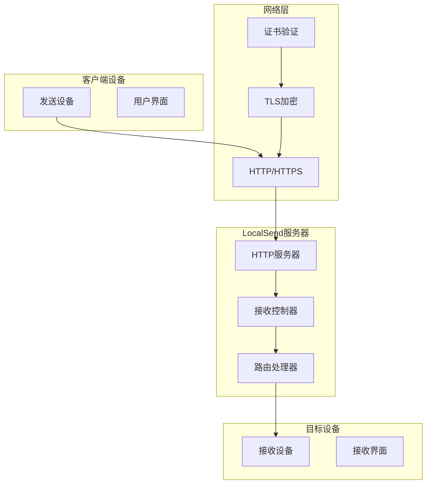
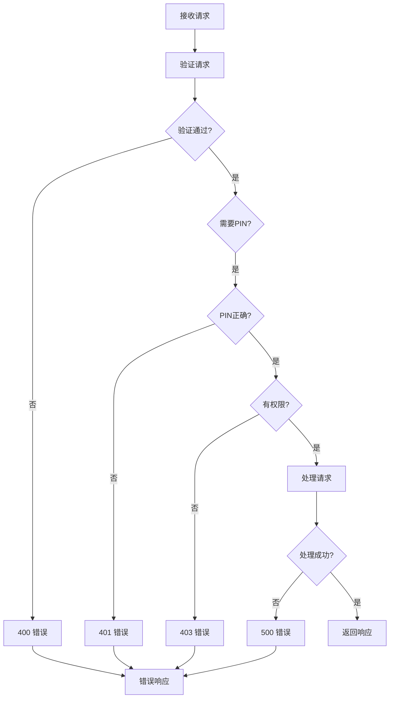
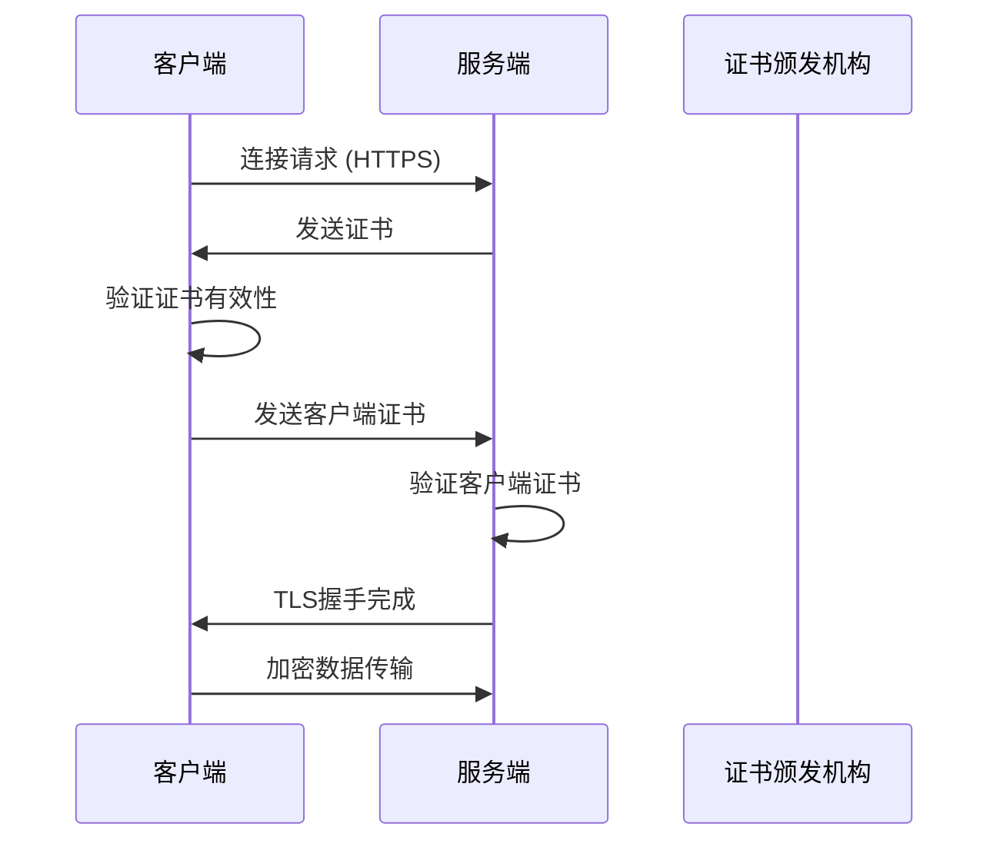
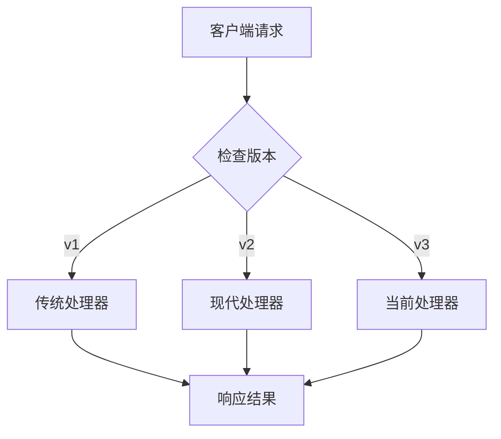

# LocalSend REST API 文档

<cite>
**本文档中引用的文件**
- [api_route_builder.dart](file://common/lib/api_route_builder.dart)
- [receive_controller.dart](file://app/lib/provider/network/server/controller/receive_controller.dart)
- [transfer.rs](file://core/src/model/transfer.rs)
- [prepare_upload_request_dto.dart](file://common/lib/model/dto/prepare_upload_request_dto.dart)
- [prepare_upload_response_dto.dart](file://common/lib/model/dto/prepare_upload_response_dto.dart)
- [file_dto.dart](file://common/lib/model/dto/file_dto.dart)
- [mod.rs](file://core/src/http/client/mod.rs)
- [rhttp.dart](file://app/lib/util/rhttp.dart)
- [common.dart](file://app/lib/provider/network/server/controller/common.dart)
- [error.rs](file://server/src/config/error.rs)
- [client_cert_verifier.rs](file://core/src/http/server/client_cert_verifier.rs)
- [cert.rs](file://core/src/crypto/cert.rs)
</cite>

## 目录
1. [简介](#简介)
2. [API概述](#api概述)
3. [基础架构](#基础架构)
4. [核心端点详解](#核心端点详解)
5. [数据传输对象(DTO)](#数据传输对象dto)
6. [错误处理](#错误处理)
7. [安全机制](#安全机制)
8. [客户端调用示例](#客户端调用示例)
9. [版本控制策略](#版本控制策略)
10. [最佳实践](#最佳实践)

## 简介

LocalSend是一个跨平台的文件传输应用，通过REST API实现设备间的文件共享。该API支持多种协议版本，提供安全的文件传输机制，并采用基于证书的身份验证系统。

## API概述

LocalSend API遵循RESTful设计原则，提供以下主要功能：
- 设备发现与注册
- 文件传输准备
- 文件上传与下载
- 会话管理
- 取消操作

### 协议支持

- **HTTP**: 用于基本通信和设备发现
- **HTTPS**: 用于安全传输，包含证书验证
- **WebSocket**: 用于实时通信（在其他组件中实现）

### 版本策略

API支持多个版本，确保向后兼容性：
- `v1`: 基础版本，主要用于早期设备
- `v2`: 增强版本，添加了更多功能
- `v3`: 当前版本，包含最新特性

## 基础架构



**图表来源**
- [receive_controller.dart](file://app/lib/provider/network/server/controller/receive_controller.dart#L53-L91)
- [api_route_builder.dart](file://common/lib/api_route_builder.dart#L1-L45)

## 核心端点详解

### 1. 设备信息端点

#### GET /api/localsend/{version}/info

获取设备基本信息和能力。

**HTTP方法**: GET  
**URL模式**: `/api/localsend/{version}/info`  
**版本**: v1, v2  

**查询参数**:
- `fingerprint` (可选): 发送设备的指纹标识

**请求头**:
- 无特殊要求

**响应格式**:
```json
{
  "alias": "设备名称",
  "version": "协议版本",
  "deviceModel": "设备型号",
  "deviceType": "设备类型",
  "fingerprint": "设备指纹",
  "download": "是否支持下载"
}
```

**状态码**:
- `200`: 成功返回设备信息
- `412`: 自我发现（设备自身）

### 2. 设备注册端点

#### POST /api/localsend/{version}/register

注册新设备到网络中。

**HTTP方法**: POST  
**URL模式**: `/api/localsend/{version}/register`  
**版本**: v1, v2  

**请求头**:
- `Content-Type: application/json`

**请求体**:
```json
{
  "alias": "设备名称",
  "version": "协议版本",
  "deviceModel": "设备型号",
  "deviceType": "设备类型",
  "fingerprint": "设备指纹"
}
```

**响应格式**:
```json
{
  "alias": "设备名称",
  "version": "协议版本",
  "deviceModel": "设备型号",
  "deviceType": "设备类型",
  "fingerprint": "设备指纹",
  "download": "是否支持下载"
}
```

**状态码**:
- `200`: 注册成功
- `400`: 请求体格式错误
- `412`: 自我发现

### 3. 准备上传端点

#### POST /api/localsend/{version}/prepare-upload

准备文件传输会话。

**HTTP方法**: POST  
**URL模式**: `/api/localsend/{version}/prepare-upload`  
**版本**: v1, v2  

**请求头**:
- `Content-Type: application/json`

**请求体**:
```json
{
  "info": {
    "alias": "发送设备名称",
    "version": "协议版本",
    "deviceModel": "设备型号",
    "deviceType": "设备类型",
    "fingerprint": "发送设备指纹"
  },
  "files": {
    "file-id-1": {
      "id": "file-id-1",
      "fileName": "文件名.ext",
      "size": 1024,
      "fileType": "application/pdf",
      "sha256": "文件哈希值",
      "preview": "预览数据",
      "metadata": {
        "modified": "2024-01-01T00:00:00Z",
        "accessed": "2024-01-01T00:00:00Z"
      }
    }
  }
}
```

**响应格式**:
- **v1版本**: 
```json
{
  "file-id-1": "上传URL"
}
```
- **v2版本**:
```json
{
  "sessionId": "会话ID",
  "files": {
    "file-id-1": "访问令牌"
  }
}
```

**状态码**:
- `200`: 准备成功
- `400`: 请求体格式错误或缺少文件
- `409`: 被另一个会话阻止
- `500`: 服务器处于无效状态

### 4. 文件上传端点

#### POST /api/localsend/{version}/upload

上传文件内容。

**HTTP方法**: POST  
**URL模式**: `/api/localsend/{version}/upload`  
**版本**: v1, v2  

**查询参数**:
- `sessionId` (v2): 会话ID
- `fileId`: 文件唯一标识符
- `token`: 访问令牌

**请求头**:
- `Content-Type: application/octet-stream`
- `Content-Length: 文件大小`

**请求体**:
二进制文件数据流

**响应格式**:
- `200`: 上传成功
- `400`: 缺少参数
- `403`: 无效IP地址或令牌
- `409`: 接收者状态错误
- `500`: 服务器处于无效状态

### 5. 取消操作端点

#### POST /api/localsend/{version}/cancel

取消当前会话或传输。

**HTTP方法**: POST  
**URL模式**: `/api/localsend/{version}/cancel`  
**版本**: v1, v2  

**查询参数**:
- `sessionId` (v2): 会话ID

**响应格式**:
- `200`: 取消成功
- `403`: 无权限
- `409`: 状态不正确

## 数据传输对象(DTO)

### FileDto

文件信息的数据传输对象。

**属性**:
- `id`: 文件唯一标识符（在会话内唯一）
- `fileName`: 文件名称
- `size`: 文件大小（字节）
- `fileType`: MIME类型或文件扩展名
- `sha256`: SHA-256哈希值（可选）
- `preview`: 预览数据（可选）
- `metadata`: 文件元数据（可选）

**元数据结构**:
```json
{
  "modified": "最后修改时间",
  "accessed": "最后访问时间"
}
```

### PrepareUploadRequestDto

准备上传请求的数据传输对象。

**属性**:
- `info`: 发送设备信息
- `files`: 文件列表（键为文件ID，值为FileDto）

### PrepareUploadResponseDto

准备上传响应的数据传输对象。

**属性**:
- `sessionId`: 会话唯一标识符
- `files`: 文件访问信息（键为文件ID，值为访问令牌）

**节来源**
- [transfer.rs](file://core/src/model/transfer.rs#L1-L39)
- [prepare_upload_request_dto.dart](file://common/lib/model/dto/prepare_upload_request_dto.dart#L1-L17)
- [prepare_upload_response_dto.dart](file://common/lib/model/dto/prepare_upload_response_dto.dart#L1-L15)
- [file_dto.dart](file://common/lib/model/dto/file_dto.dart#L30-L50)

## 错误处理

### 错误响应格式

所有错误响应都遵循统一格式：

```json
{
  "message": "错误描述"
}
```

### 状态码说明

| 状态码 | 含义 | 场景 |
|--------|------|------|
| 400 | 请求错误 | 请求体格式错误、缺少必需参数 |
| 401 | 未授权 | PIN码验证失败 |
| 403 | 禁止访问 | IP地址无效、令牌无效、权限不足 |
| 404 | 未找到 | 路由不存在 |
| 409 | 冲突 | 会话冲突、状态不正确 |
| 412 | 预期失败 | 自我发现 |
| 429 | 太多请求 | PIN尝试次数过多 |
| 500 | 服务器内部错误 | 服务器状态无效、处理异常 |

### 错误处理流程



**图表来源**
- [common.dart](file://app/lib/provider/network/server/controller/common.dart#L8-L38)
- [error.rs](file://server/src/config/error.rs#L1-L58)

**节来源**
- [common.dart](file://app/lib/provider/network/server/controller/common.dart#L8-L38)
- [error.rs](file://server/src/config/error.rs#L1-L58)
- [mod.rs](file://core/src/http/client/mod.rs#L240-L266)

## 安全机制

### HTTPS强制

LocalSend强制使用HTTPS进行安全通信：

1. **证书验证**: 每个设备都有唯一的X.509证书
2. **双向认证**: 客户端和服务端互相验证证书
3. **密钥交换**: 使用TLS协议进行安全的密钥交换

### 证书验证流程



**图表来源**
- [client_cert_verifier.rs](file://core/src/http/server/client_cert_verifier.rs#L39-L82)
- [cert.rs](file://core/src/crypto/cert.rs#L80-L131)

### CSRF保护

虽然LocalSend主要在局域网环境中使用，但仍实现了基本的安全措施：

1. **IP地址验证**: 确保请求来自预期的设备
2. **令牌验证**: 每个文件传输使用独立的访问令牌
3. **会话隔离**: 不同会话之间相互隔离

### PIN码保护

对于敏感操作，LocalSend支持PIN码保护：

- 最多允许3次PIN码尝试
- 尝试次数过多时返回429状态码
- 支持动态PIN码验证

**节来源**
- [client_cert_verifier.rs](file://core/src/http/server/client_cert_verifier.rs#L1-L82)
- [cert.rs](file://core/src/crypto/cert.rs#L80-L185)
- [common.dart](file://app/lib/provider/network/server/controller/common.dart#L8-L38)

## 客户端调用示例

### Dart/Flutter 客户端

```dart
import 'package:common/api_route_builder.dart';
import 'package:common/model/dto/prepare_upload_request_dto.dart';
import 'package:common/model/dto/file_dto.dart';
import 'package:common/model/device.dart';

// 创建文件传输请求
final file = FileDto(
  id: 'unique-file-id',
  fileName: 'document.pdf',
  size: 1024000,
  fileType: FileType.pdf,
  hash: 'sha256-hash-value',
  preview: null,
  legacy: false,
  metadata: FileMetadata(
    lastModified: DateTime.now(),
    lastAccessed: DateTime.now(),
  ),
);

final request = PrepareUploadRequestDto(
  info: RegisterDto(
    alias: '我的设备',
    version: '2.0',
    deviceModel: 'iPhone 14',
    deviceType: DeviceType.mobile,
    fingerprint: 'device-fingerprint',
  ),
  files: {'unique-file-id': file},
);

// 发送准备上传请求
final response = await httpClient.post(
  uri: ApiRoute.prepareUpload.target(device),
  json: request.toJson(),
);
```

### Rust 客户端

```rust
use localsend_core::http::client::LsHttpClient;
use localsend_core::model::transfer::PrepareUploadRequestDto;

// 创建HTTP客户端
let client = LsHttpClient::try_new(private_key, cert)?;

// 构建上传请求
let request = PrepareUploadRequestDto {
    info: RegisterDto {
        alias: "我的设备".to_string(),
        version: "2.0".to_string(),
        device_model: "iPhone 14".to_string(),
        device_type: DeviceType::Mobile,
        fingerprint: "device-fingerprint".to_string(),
    },
    files: HashMap::from([(
        "unique-file-id".to_string(),
        FileDto {
            id: "unique-file-id".to_string(),
            file_name: "document.pdf".to_string(),
            size: 1024000,
            file_type: "application/pdf".to_string(),
            sha256: Some("sha256-hash-value".to_string()),
            preview: None,
            metadata: None,
        },
    )]),
};

// 发送请求
let response = client.prepare_upload(
    &ProtocolType::Https,
    "192.168.1.100",
    53317,
    Some("server-public-key".to_string()),
    request,
)?;
```

### HTTP/HTTPS 请求示例

```bash
# 获取设备信息
curl -X GET "http://192.168.1.100:53317/api/localsend/v2/info?fingerprint=my-fingerprint"

# 注册设备
curl -X POST "http://192.168.1.100:53317/api/localsend/v2/register" \
  -H "Content-Type: application/json" \
  -d '{
    "alias": "我的设备",
    "version": "2.0",
    "deviceModel": "iPhone 14",
    "deviceType": "mobile",
    "fingerprint": "device-fingerprint"
  }'

# 准备上传
curl -X POST "http://192.168.1.100:53317/api/localsend/v2/prepare-upload" \
  -H "Content-Type: application/json" \
  -d '{
    "info": {
      "alias": "发送设备",
      "version": "2.0",
      "deviceModel": "Android手机",
      "deviceType": "mobile",
      "fingerprint": "sender-fingerprint"
    },
    "files": {
      "file-1": {
        "id": "file-1",
        "fileName": "photo.jpg",
        "size": 2048000,
        "fileType": "image/jpeg",
        "sha256": "file-hash",
        "metadata": {
          "modified": "2024-01-01T00:00:00Z"
        }
      }
    }
  }'
```

**节来源**
- [receive_controller.dart](file://app/lib/provider/network/server/controller/receive_controller.dart#L53-L91)
- [mod.rs](file://core/src/http/client/mod.rs#L147-L184)
- [rhttp.dart](file://app/lib/util/rhttp.dart#L40-L85)

## 版本控制策略

### API版本演进

LocalSend采用语义化版本控制策略：

| 版本 | 主要特性 | 兼容性 |
|------|----------|--------|
| v1 | 基础文件传输 | 向后兼容 |
| v2 | 增强功能，改进错误处理 | 向后兼容 |
| v3 | 当前版本，完整功能集 | 向后兼容 |

### 版本检测机制



**图表来源**
- [api_route_builder.dart](file://common/lib/api_route_builder.dart#L10-L20)

### 未来兼容性

1. **向后兼容**: 新版本支持旧版本的请求
2. **渐进升级**: 设备可以逐步升级到新版本
3. **功能降级**: 在不支持新功能的设备上优雅降级

**节来源**
- [api_route_builder.dart](file://common/lib/api_route_builder.dart#L10-L20)

## 最佳实践

### 性能优化

1. **连接复用**: 使用持久连接减少握手开销
2. **流式传输**: 对大文件使用流式上传
3. **并发控制**: 限制同时进行的传输数量

### 错误恢复

1. **重试机制**: 实现指数退避重试
2. **断点续传**: 支持大文件的断点续传
3. **状态同步**: 定期同步传输状态

### 安全建议

1. **证书管理**: 定期更新设备证书
2. **网络隔离**: 在可信网络中使用
3. **监控告警**: 监控异常的传输活动

### 开发指南

1. **测试覆盖**: 确保充分的单元测试和集成测试
2. **文档维护**: 保持API文档的及时更新
3. **性能监控**: 监控API的响应时间和吞吐量

LocalSend REST API提供了一个强大而灵活的文件传输解决方案，通过其完善的安全机制和版本控制策略，确保了在各种环境下的可靠性和安全性。