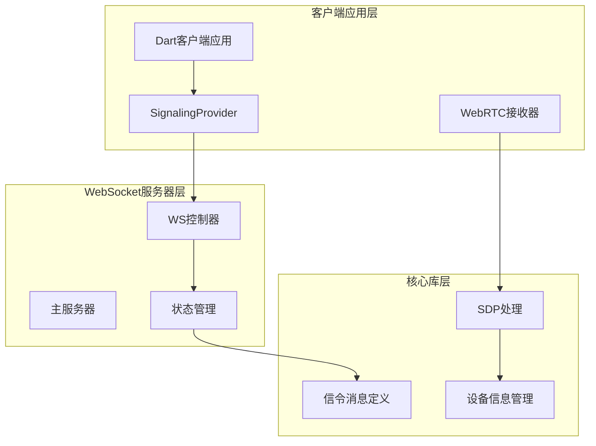
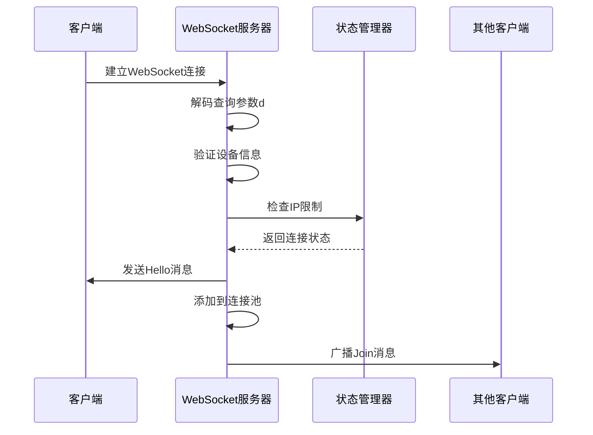
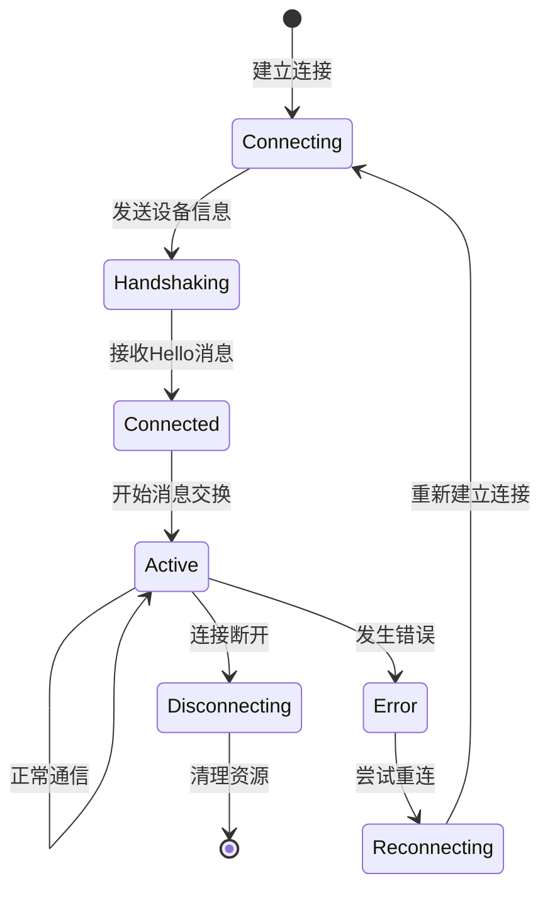
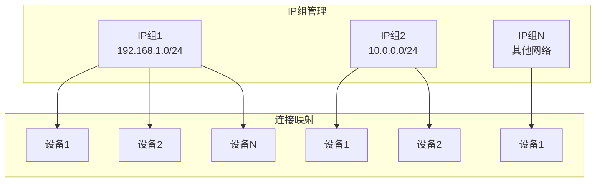
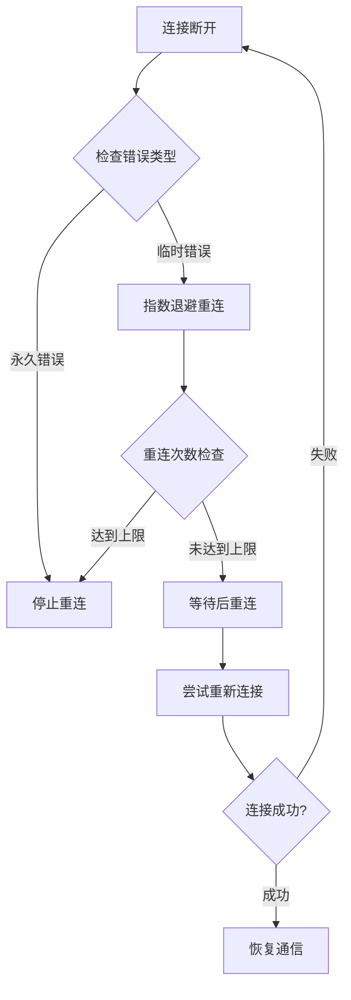
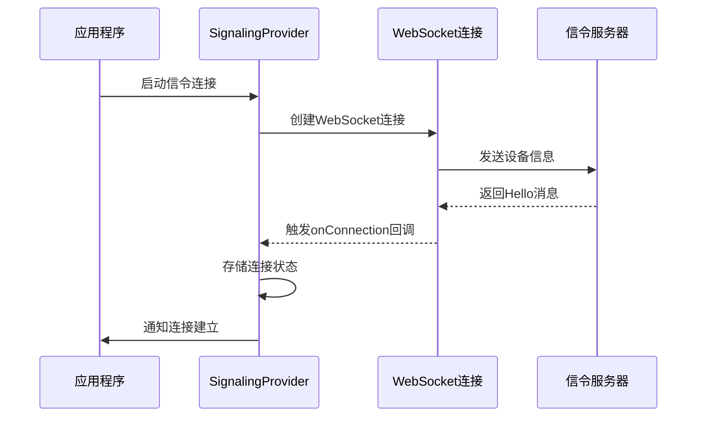
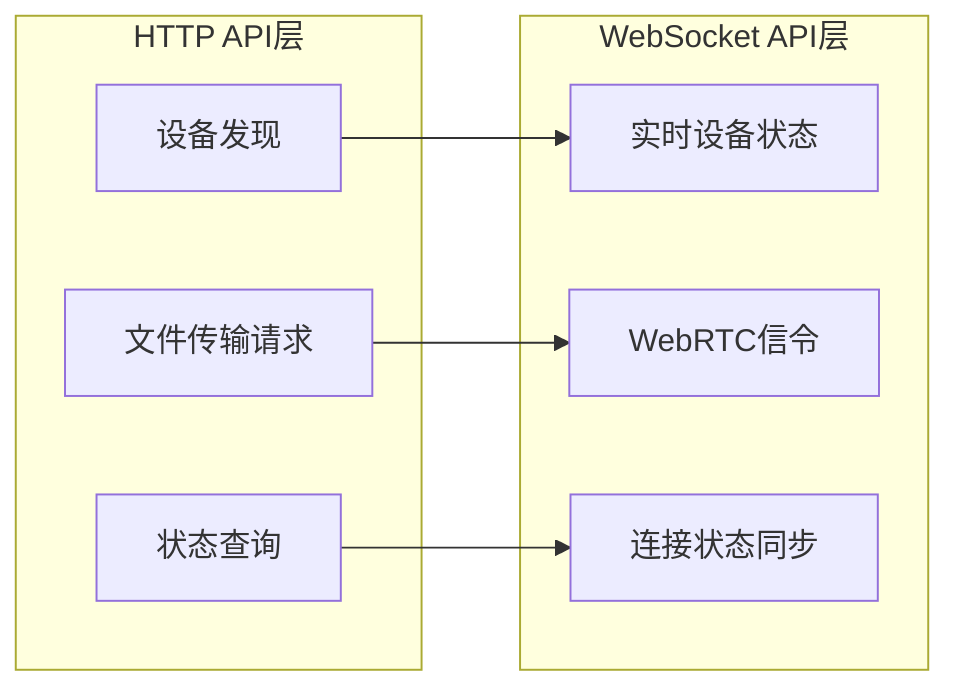

# WebSocket API

<cite>
**本文档中引用的文件**
- [server/src/main.rs](file://server/src/main.rs)
- [server/src/controller/ws_controller.rs](file://server/src/controller/ws_controller.rs)
- [core/src/webrtc/signaling.rs](file://core/src/webrtc/signaling.rs)
- [app/lib/provider/network/webrtc/signaling_provider.dart](file://app/lib/provider/network/webrtc/signaling_provider.dart)
- [server/src/config/state.rs](file://server/src/config/state.rs)
</cite>

## 目录
1. [简介](#简介)
2. [项目架构概览](#项目架构概览)
3. [WebSocket连接机制](#websocket连接机制)
4. [消息类型和格式](#消息类型和格式)
5. [连接生命周期管理](#连接生命周期管理)
6. [错误处理和重试机制](#错误处理和重试机制)
7. [客户端实现指南](#客户端实现指南)
8. [HTTP API集成](#http-api集成)
9. [性能优化和配置](#性能优化和配置)
10. [故障排除指南](#故障排除指南)

## 简介

Localsend的WebSocket API是其WebRTC连接建立的核心组件，负责在设备之间传递信令消息。该系统通过WebSocket协议实现实时通信，支持SDP offer/answer交换、ICE候选者传输和连接状态管理。

WebSocket API的主要功能包括：
- 设备发现和注册
- WebRTC信令消息中继
- 连接状态同步
- 防DDoS保护
- 错误处理和恢复

## 项目架构概览

Localsend的WebSocket系统采用分层架构设计，主要包含以下组件：



**图表来源**
- [server/src/main.rs](file://server/src/main.rs#L1-L34)
- [server/src/controller/ws_controller.rs](file://server/src/controller/ws_controller.rs#L1-L50)

**章节来源**
- [server/src/main.rs](file://server/src/main.rs#L1-L34)
- [server/src/controller/ws_controller.rs](file://server/src/controller/ws_controller.rs#L1-L370)

## WebSocket连接机制

### 连接URL和端点

Localsend使用标准的WebSocket URL格式进行连接：

```
ws://host:port/v1/ws?d=<base64_encoded_data>
```

其中：
- `host:port` 是服务器地址
- `/v1/ws` 是WebSocket端点
- `d` 参数包含经过Base64编码的设备信息

### 连接建立过程

WebSocket连接的建立遵循以下步骤：



**图表来源**
- [server/src/controller/ws_controller.rs](file://server/src/controller/ws_controller.rs#L43-L85)

### 认证方法

连接认证基于以下机制：

1. **设备信息验证**：客户端发送包含设备名称、版本、设备型号等信息的JSON对象
2. **Base64编码**：设备信息被序列化为JSON后进行Base64编码
3. **IP组管理**：相同IP地址的设备被分配到同一IP组
4. **连接限制**：每个IP组最多允许10个并发连接

**章节来源**
- [server/src/controller/ws_controller.rs](file://server/src/controller/ws_controller.rs#L43-L85)
- [core/src/webrtc/signaling.rs](file://core/src/webrtc/signaling.rs#L102-L151)

## 消息类型和格式

### 服务器消息类型

Localsend定义了多种服务器消息类型，每种都有特定的用途：

| 消息类型 | 描述 | JSON结构 |
|---------|------|----------|
| `HELLO` | 初始连接确认消息 | 包含客户端信息和同组设备列表 |
| `JOIN` | 新设备加入通知 | 包含新加入设备的信息 |
| `UPDATE` | 设备信息更新通知 | 包含更新后的设备信息 |
| `LEFT` | 设备离开通知 | 包含离开设备的UUID |
| `OFFER` | SDP offer消息 | 包含发起方信息、会话ID和SDP内容 |
| `ANSWER` | SDP answer消息 | 包含响应方信息、会话ID和SDP内容 |
| `ERROR` | 错误通知 | 包含HTTP状态码 |

### 客户端消息类型

客户端可以发送以下消息类型：

| 消息类型 | 描述 | JSON结构 |
|---------|------|----------|
| `UPDATE` | 更新设备信息 | 包含新的设备信息 |
| `OFFER` | 发送SDP offer | 包含目标UUID、会话ID和SDP |
| `ANSWER` | 发送SDP answer | 包含目标UUID、会话ID和SDP |

### 消息JSON结构示例

#### HELLO消息
```json
{
  "type": "HELLO",
  "client": {
    "id": "123e4567-e89b-12d3-a456-426614174000",
    "alias": "iPhone 13",
    "version": "2.3",
    "deviceModel": "iPhone14,3",
    "deviceType": "mobile",
    "token": "abc123def456"
  },
  "peers": [
    {
      "id": "987fcdeb-51a2-43d7-ba80-2d596f2c65b9",
      "alias": "MacBook Pro",
      "version": "2.3",
      "deviceModel": "MacBookPro18,3",
      "deviceType": "desktop",
      "token": "xyz789uvw012"
    }
  ]
}
```

#### OFFER消息
```json
{
  "type": "OFFER",
  "peer": {
    "id": "123e4567-e89b-12d3-a456-426614174000",
    "alias": "iPhone 13",
    "version": "2.3",
    "deviceModel": "iPhone14,3",
    "deviceType": "mobile",
    "token": "abc123def456"
  },
  "sessionId": "session-12345",
  "sdp": "base64-encoded-sdp-string"
}
```

**章节来源**
- [core/src/webrtc/signaling.rs](file://core/src/webrtc/signaling.rs#L15-L100)
- [core/src/webrtc/signaling.rs](file://core/src/webrtc/signaling.rs#L152-L194)

## 连接生命周期管理

### 连接状态事件

WebSocket连接的生命周期包含以下关键事件：



### 连接池管理

服务器维护一个连接池来管理所有活跃的WebSocket连接：



**图表来源**
- [server/src/config/state.rs](file://server/src/config/state.rs#L1-L34)

### 连接限制和防DDoS

系统实现了多层防护机制：

1. **IP连接限制**：每个IP组最多10个并发连接
2. **请求频率限制**：每小时最多1000次请求
3. **自动清理**：连接断开时自动清理相关资源

**章节来源**
- [server/src/controller/ws_controller.rs](file://server/src/controller/ws_controller.rs#L25-L40)
- [server/src/config/state.rs](file://server/src/config/state.rs#L1-L34)

## 错误处理和重试机制

### 错误类型和处理策略

Localsend定义了以下错误处理策略：

| 错误类型 | HTTP状态码 | 处理策略 |
|---------|-----------|----------|
| 连接限制 | 429 Too Many Requests | 立即断开连接 |
| 请求频率超限 | 429 Too Many Requests | 发送错误消息并断开 |
| 设备信息无效 | 400 Bad Request | 断开连接 |
| 内部服务器错误 | 500 Internal Server Error | 记录日志并断开 |

### 超时设置

WebSocket连接设置了合理的超时参数：

- **发送超时**：120秒
- **接收超时**：无限制（持续监听）
- **连接保持**：定期发送Ping消息检测连接状态

### 重连机制

客户端应实现智能重连机制：



**章节来源**
- [server/src/controller/ws_controller.rs](file://server/src/controller/ws_controller.rs#L165-L194)
- [core/src/webrtc/signaling.rs](file://core/src/webrtc/signaling.rs#L195-L250)

## 客户端实现指南

### Dart客户端实现

客户端使用`signaling_provider.dart`中的逻辑处理WebSocket消息：

#### 连接建立流程



**图表来源**
- [app/lib/provider/network/webrtc/signaling_provider.dart](file://app/lib/provider/network/webrtc/signaling_provider.dart#L70-L120)

#### 消息处理模式

客户端需要处理以下消息类型：

1. **HELLO消息**：初始化设备列表
2. **JOIN消息**：添加新设备到发现列表
3. **UPDATE消息**：更新现有设备信息
4. **LEFT消息**：从发现列表移除设备
5. **OFFER消息**：处理WebRTC offer
6. **ANSWER消息**：处理WebRTC answer

### 关键实现要点

1. **设备信息管理**：维护当前设备的完整信息
2. **连接状态跟踪**：监控连接健康状况
3. **消息队列处理**：确保消息按序处理
4. **异常恢复**：优雅处理连接中断

**章节来源**
- [app/lib/provider/network/webrtc/signaling_provider.dart](file://app/lib/provider/network/webrtc/signaling_provider.dart#L1-L232)

## HTTP API集成

### REST API端点

Localsend的WebSocket API与HTTP API紧密集成：

| 端点 | 方法 | 功能 | 描述 |
|------|------|------|------|
| `/v1/ws` | GET | WebSocket连接 | 建立WebSocket信令连接 |
| `/v1/devices` | GET | 设备发现 | 获取可用设备列表 |
| `/v1/send` | POST | 文件发送 | 发起文件传输请求 |

### 协议转换

WebSocket API作为HTTP API的重要补充，提供了实时通信能力：



**图表来源**
- [server/src/main.rs](file://server/src/main.rs#L28-L32)

**章节来源**
- [server/src/main.rs](file://server/src/main.rs#L28-L32)

## 性能优化和配置

### 环境变量配置

系统支持以下环境变量进行配置：

| 变量名 | 默认值 | 描述 |
|--------|--------|------|
| `SERVER_IP` | 0.0.0.0 | 服务器绑定IP地址 |
| `SERVER_PORT` | 3000 | 服务器监听端口 |
| `MAX_CONNECTIONS_PER_IP` | 10 | 每IP最大连接数 |
| `MAX_REQUESTS_PER_IP_PER_HOUR` | 1000 | 每IP每小时最大请求数 |

### 性能调优建议

1. **连接池优化**：合理设置连接限制避免资源耗尽
2. **消息压缩**：对大型SDP消息启用压缩
3. **心跳机制**：定期发送ping消息保持连接活跃
4. **内存管理**：及时清理断开的连接资源

### 监控指标

关键性能指标包括：
- 活跃连接数
- 消息处理延迟
- 错误率统计
- IP组分布情况

**章节来源**
- [server/src/controller/ws_controller.rs](file://server/src/controller/ws_controller.rs#L25-L40)
- [server/src/main.rs](file://server/src/main.rs#L15-L25)

## 故障排除指南

### 常见问题和解决方案

#### 连接被拒绝
**症状**：客户端收到"Limit reached"消息
**原因**：超过IP连接限制或请求频率限制
**解决方案**：
1. 检查本地防火墙设置
2. 减少短时间内重复连接
3. 使用不同的网络环境

#### 消息丢失
**症状**：设备状态不同步
**原因**：网络不稳定或连接中断
**解决方案**：
1. 实现消息确认机制
2. 增加重连逻辑
3. 监控网络质量

#### 性能问题
**症状**：消息延迟高或服务器负载过高
**解决方案**：
1. 调整连接限制参数
2. 优化消息处理逻辑
3. 增加服务器资源

### 调试工具和技巧

1. **日志分析**：启用详细日志记录
2. **网络抓包**：使用Wireshark分析WebSocket流量
3. **性能监控**：监控CPU和内存使用情况
4. **压力测试**：模拟大量并发连接测试

### 最佳实践

1. **优雅降级**：在网络不可用时提供备用方案
2. **错误边界**：妥善处理各种异常情况
3. **资源清理**：及时释放不再使用的资源
4. **安全考虑**：验证所有输入数据的有效性

**章节来源**
- [server/src/controller/ws_controller.rs](file://server/src/controller/ws_controller.rs#L300-L370)