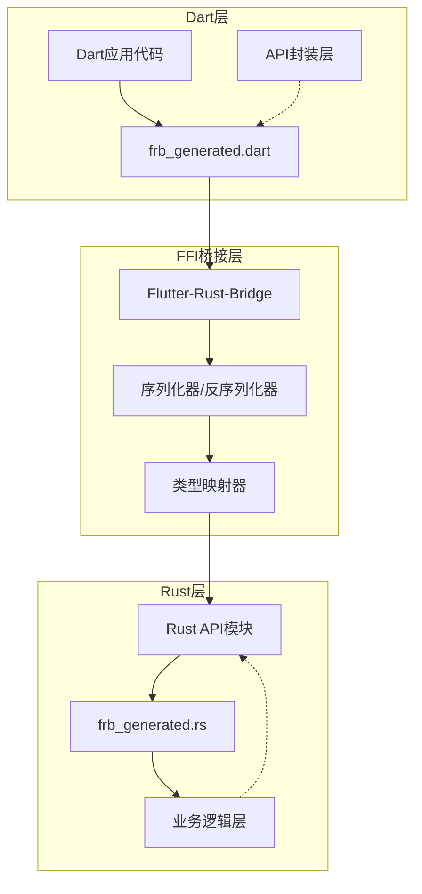
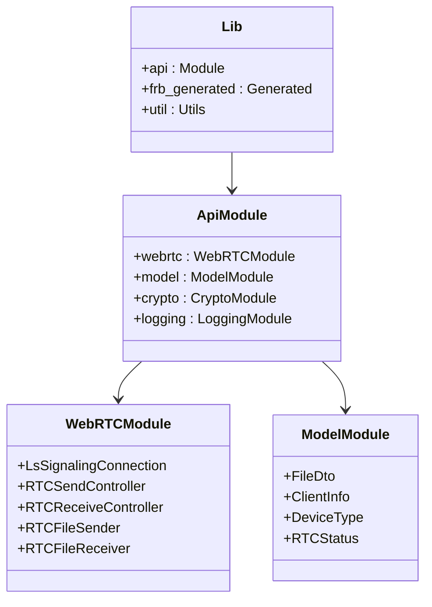
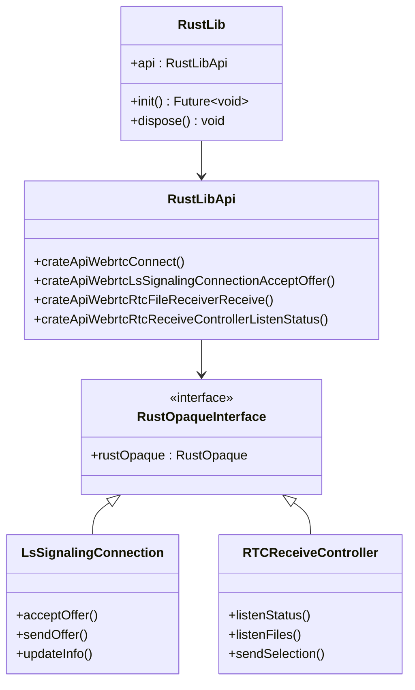
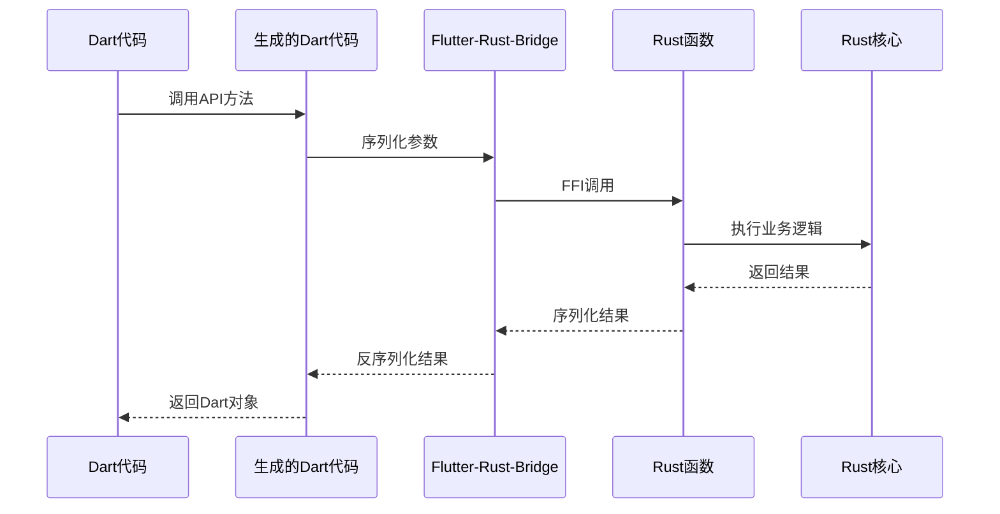
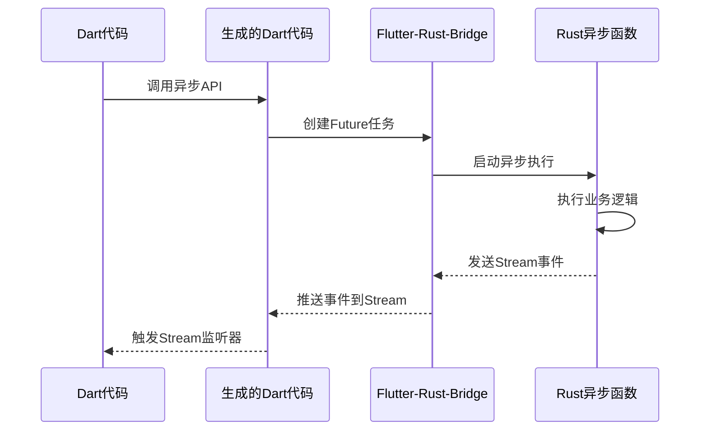
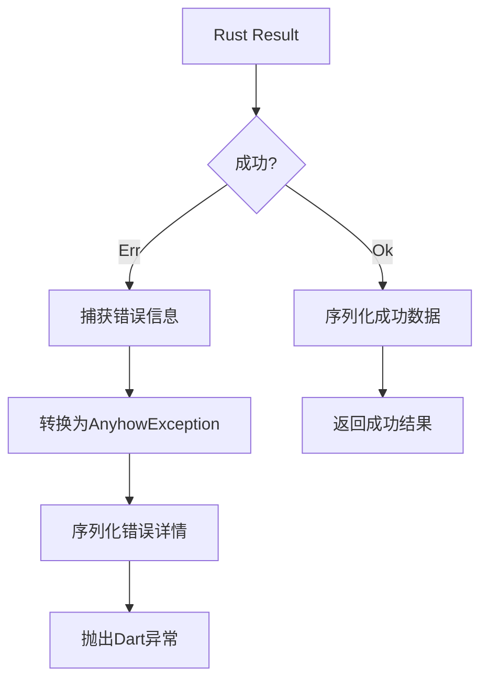
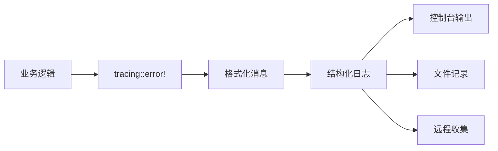
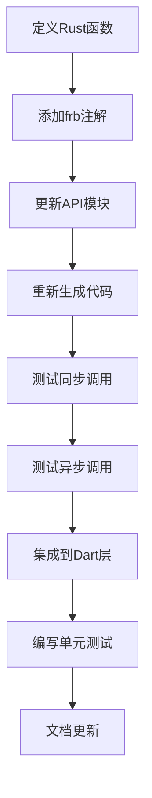
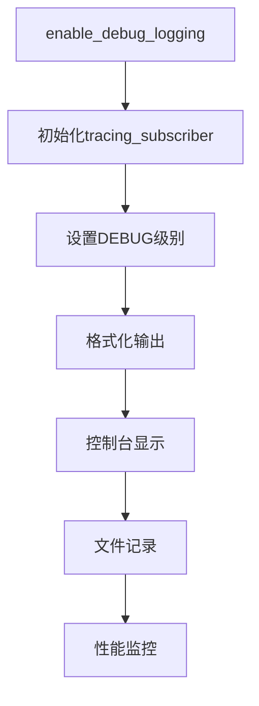

# FFI桥接机制

<cite>
**本文档引用的文件**
- [flutter_rust_bridge.yaml](file://app/flutter_rust_bridge.yaml)
- [lib.rs](file://app/rust/src/lib.rs)
- [frb_generated.rs](file://app/rust/src/frb_generated.rs)
- [frb_generated.dart](file://app/lib/rust/frb_generated.dart)
- [frb_generated.io.dart](file://app/lib/rust/frb_generated.io.dart)
- [webrtc.rs](file://app/rust/src/api/webrtc.rs)
- [model.rs](file://app/rust/src/api/model.rs)
- [webrtc.dart](file://app/lib/rust/api/webrtc.dart)
- [logging.rs](file://app/rust/src/api/logging.rs)
- [Cargo.toml](file://app/rust/Cargo.toml)
- [pubspec.yaml](file://app/pubspec.yaml)
</cite>

## 目录
1. [简介](#简介)
2. [项目结构概览](#项目结构概览)
3. [Flutter-Rust-Bridge配置](#flutter-rust-bridge配置)
4. [核心组件架构](#核心组件架构)
5. [类型映射机制](#类型映射机制)
6. [函数调用生成过程](#函数调用生成过程)
7. [异步调用实现](#异步调用实现)
8. [错误处理机制](#错误处理机制)
9. [添加新桥接接口](#添加新桥接接口)
10. [调试技巧](#调试技巧)
11. [最佳实践](#最佳实践)

## 简介

LocalSend项目采用Flutter-Rust-Bridge (FRB) 实现了高效的跨语言FFI桥接机制，实现了Dart与Rust之间的无缝通信。该机制支持同步和异步函数调用、流式数据传输、复杂类型映射以及完善的错误处理。

## 项目结构概览

LocalSend的FFI桥接架构采用分层设计：



**图表来源**
- [frb_generated.dart](file://app/lib/rust/frb_generated.dart#L1-L50)
- [frb_generated.rs](file://app/rust/src/frb_generated.rs#L1-L50)

**章节来源**
- [lib.rs](file://app/rust/src/lib.rs#L1-L4)
- [frb_generated.dart](file://app/lib/rust/frb_generated.dart#L1-L100)

## Flutter-Rust-Bridge配置

### 配置文件结构

Flutter-Rust-Bridge通过`flutter_rust_bridge.yaml`配置文件管理桥接设置：

| 配置项 | 值 | 说明 |
|--------|-----|------|
| rust_input | crate::api | Rust源码入口路径 |
| rust_root | rust/ | Rust项目根目录 |
| dart_output | lib/rust | Dart生成文件输出目录 |

### 核心依赖配置

项目使用特定版本的Flutter-Rust-Bridge确保兼容性：

| 组件 | 版本 | 功能 |
|------|------|------|
| flutter_rust_bridge | 2.11.1 | 主要FFI框架 |
| uuid | 1.11.1 | UUID类型支持 |
| tokio | 1.43.0 | 异步运行时支持 |

**章节来源**
- [flutter_rust_bridge.yaml](file://app/flutter_rust_bridge.yaml#L1-L4)
- [Cargo.toml](file://app/rust/Cargo.toml#L1-L18)

## 核心组件架构

### Rust端架构

Rust端采用模块化设计，主要包含：



**图表来源**
- [lib.rs](file://app/rust/src/lib.rs#L1-L4)
- [webrtc.rs](file://app/rust/src/api/webrtc.rs#L1-L50)
- [model.rs](file://app/rust/src/api/model.rs#L1-L30)

### Dart端架构

Dart端生成的代码提供了强类型的API接口：



**图表来源**
- [frb_generated.dart](file://app/lib/rust/frb_generated.dart#L20-L100)
- [webrtc.dart](file://app/lib/rust/api/webrtc.dart#L15-L80)

**章节来源**
- [frb_generated.rs](file://app/rust/src/frb_generated.rs#L1-L100)
- [frb_generated.dart](file://app/lib/rust/frb_generated.dart#L1-L200)

## 类型映射机制

### 基础类型映射

Flutter-Rust-Bridge自动处理基础类型的双向转换：

| Dart类型 | Rust类型 | 序列化格式 | 备注 |
|----------|----------|------------|------|
| String | String | UTF-8字节流 | 支持Unicode字符 |
| int | i32/u32/i64/u64 | 变长编码 | 平台相关整数类型 |
| double | f64 | IEEE 754 | 浮点数标准格式 |
| bool | bool | 单字节 | true/false值 |
| List<T> | Vec<T> | 长度前缀+元素 | 通用集合类型 |
| Map<K,V> | HashMap<K,V> | 键值对列表 | 字符串键映射 |

### 复杂类型映射

对于复杂的自定义类型，FRB使用注解进行显式映射：

```mermaid
flowchart TD
A[Dart类] --> B[frb(mirror)] 注解
B --> C[Rust结构体]
C --> D[SSE序列化]
D --> E[二进制数据]
E --> F[网络传输]
F --> G[反序列化]
G --> H[Rust结构体]
H --> I[返回给Dart]
I --> J[Dart对象]
```

**图表来源**
- [webrtc.rs](file://app/rust/src/api/webrtc.rs#L480-L515)
- [model.rs](file://app/rust/src/api/model.rs#L1-L73)

### 枚举类型处理

枚举类型通过标签和数据分离的方式进行序列化：

| 枚举变体 | 序列化格式 | 示例 |
|----------|------------|------|
| 单一值 | 标签 + 数据 | `RTCStatus.Error("timeout")` |
| 多值 | 标签 + 多个字段 | `WsServerMessage.Hello{client, peers}` |
| 无参数 | 仅标签 | `RTCStatus.Connected` |

**章节来源**
- [webrtc.rs](file://app/rust/src/api/webrtc.rs#L480-L515)
- [model.rs](file://app/rust/src/api/model.rs#L1-L73)

## 函数调用生成过程

### 同步函数生成

对于同步函数，FRB生成直接的FFI调用：



**图表来源**
- [frb_generated.dart](file://app/lib/rust/frb_generated.dart#L100-L200)
- [frb_generated.rs](file://app/rust/src/frb_generated.rs#L50-L150)

### 异步函数生成

异步函数通过Future和Stream机制实现：



**图表来源**
- [frb_generated.dart](file://app/lib/rust/frb_generated.dart#L200-L300)
- [frb_generated.rs](file://app/rust/src/frb_generated.rs#L150-L250)

**章节来源**
- [frb_generated.dart](file://app/lib/rust/frb_generated.dart#L1-L800)
- [frb_generated.rs](file://app/rust/src/frb_generated.rs#L1-L800)

## 异步调用实现

### Stream处理机制

FRB通过StreamSink实现双向流通信：


**图表来源**
- [frb_generated.dart](file://app/lib/rust/frb_generated.dart#L300-L400)
- [webrtc.rs](file://app/rust/src/api/webrtc.rs#L30-L50)

### Future处理机制

异步操作通过Future模式实现非阻塞调用：

| 步骤 | Dart端 | Rust端 | 说明 |
|------|--------|--------|------|
| 1 | 创建Future任务 | 注册异步回调 | 初始化调用上下文 |
| 2 | 参数序列化 | 接收序列化数据 | 类型安全的数据传输 |
| 3 | 异步执行 | 在Tokio运行时处理 | 避免阻塞主线程 |
| 4 | 结果序列化 | 发送完成信号 | 确保数据完整性 |
| 5 | Future完成 | 触发回调 | 返回给Dart层 |

**章节来源**
- [frb_generated.dart](file://app/lib/rust/frb_generated.dart#L400-L600)
- [webrtc.rs](file://app/rust/src/api/webrtc.rs#L60-L120)

## 错误处理机制

### Rust Result到Dart异常映射

FRB将Rust的Result类型映射为Dart的异常系统：



**图表来源**
- [frb_generated.rs](file://app/rust/src/frb_generated.rs#L100-L200)
- [frb_generated.dart](file://app/lib/rust/frb_generated.dart#L50-L100)

### 错误类型层次

| 错误级别 | Rust类型 | Dart映射 | 处理策略 |
|----------|----------|----------|----------|
| 致命错误 | anyhow::Error | AnyhowException | 应用重启 |
| 业务错误 | 自定义Error | 自定义异常 | 用户提示 |
| 网络错误 | tokio::io::Error | SocketException | 重试机制 |
| 类型错误 | serde::Error | FormatException | 数据验证 |

### 日志记录机制

项目集成了tracing库提供结构化日志：



**图表来源**
- [logging.rs](file://app/rust/src/api/logging.rs#L1-L12)

**章节来源**
- [frb_generated.rs](file://app/rust/src/frb_generated.rs#L200-L400)
- [logging.rs](file://app/rust/src/api/logging.rs#L1-L12)

## 添加新桥接接口

### 完整开发流程

添加新的FFI接口需要以下步骤：



**图表来源**
- [webrtc.rs](file://app/rust/src/api/webrtc.rs#L1-L50)
- [frb_generated.rs](file://app/rust/src/frb_generated.rs#L1-L100)

### 示例：添加新的WebRTC功能

以添加一个新的WebRTC连接状态监控为例：

1. **Rust端定义**：
   ```rust
   // 在webrtc.rs中添加
   pub async fn monitor_connection_state(
       &self,
       interval: Duration,
   ) -> anyhow::Result<Stream<ConnectionState>> {
       // 实现连接状态监控逻辑
   }
   ```

2. **Dart端生成**：
   ```dart
   // 自动生成的API
   Stream<ConnectionState> monitorConnectionState({required Duration interval});
   ```

3. **类型定义**：
   ```rust
   #[frb(mirror(ConnectionState))]
   pub enum _ConnectionState {
       New,
       Connecting,
       Connected,
       Disconnected,
       Failed,
       Closed,
   }
   ```

### 代码生成验证

每次修改后都需要验证代码生成：

| 验证项目 | 检查内容 | 工具命令 |
|----------|----------|----------|
| 编译检查 | Rust语法正确性 | `cargo build` |
| 代码生成 | FRB生成文件 | `flutter_rust_bridge_codegen` |
| 类型匹配 | Dart-Rust类型一致性 | `dart analyze` |
| 运行测试 | 功能正常性 | `flutter test` |

**章节来源**
- [webrtc.rs](file://app/rust/src/api/webrtc.rs#L1-L100)
- [frb_generated.rs](file://app/rust/src/frb_generated.rs#L1-L200)

## 调试技巧

### 日志配置

启用详细的调试日志：



**图表来源**
- [logging.rs](file://app/rust/src/api/logging.rs#L1-L12)

### 常见问题诊断

| 问题类型 | 症状 | 诊断方法 | 解决方案 |
|----------|------|----------|----------|
| 类型不匹配 | 序列化失败 | 检查类型注解 | 更新frb(mirror)注解 |
| 内存泄漏 | 内存持续增长 | 使用内存分析工具 | 检查RustOpaque生命周期 |
| 死锁 | 应用无响应 | 查看线程堆栈 | 优化异步调用顺序 |
| 性能问题 | 响应缓慢 | 性能分析器 | 优化数据传输大小 |

### 调试工具链

推荐的调试工具和技巧：


### 错误追踪最佳实践

1. **结构化错误信息**：使用`anyhow::Context`添加上下文
2. **错误边界处理**：在关键位置捕获和转换错误
3. **日志级别区分**：根据错误严重程度选择合适的日志级别
4. **错误恢复机制**：实现优雅的错误恢复和重试逻辑

**章节来源**
- [logging.rs](file://app/rust/src/api/logging.rs#L1-L12)
- [frb_generated.rs](file://app/rust/src/frb_generated.rs#L400-L600)

## 最佳实践

### 性能优化建议

1. **批量数据传输**：避免频繁的小数据传输
2. **内存管理**：合理使用RustOpaque避免内存泄漏
3. **异步优先**：所有耗时操作使用异步模式
4. **缓存策略**：对重复计算的结果进行缓存

### 安全考虑

1. **输入验证**：严格验证所有外部输入
2. **权限控制**：限制Rust层的系统访问权限
3. **数据加密**：敏感数据传输时进行加密
4. **错误信息脱敏**：避免泄露内部实现细节

### 代码组织原则

1. **模块化设计**：按功能划分API模块
2. **清晰的接口**：保持API简洁易用
3. **版本兼容**：向后兼容性保证
4. **文档完善**：提供详细的API文档

### 测试策略

1. **单元测试**：测试每个API函数
2. **集成测试**：测试跨语言调用
3. **性能测试**：验证性能指标
4. **压力测试**：测试高负载场景

通过遵循这些最佳实践，可以构建稳定、高效且易于维护的FFI桥接系统，为LocalSend项目提供可靠的跨语言通信能力。