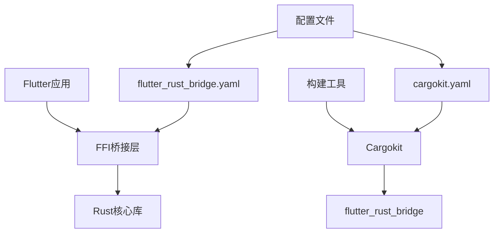
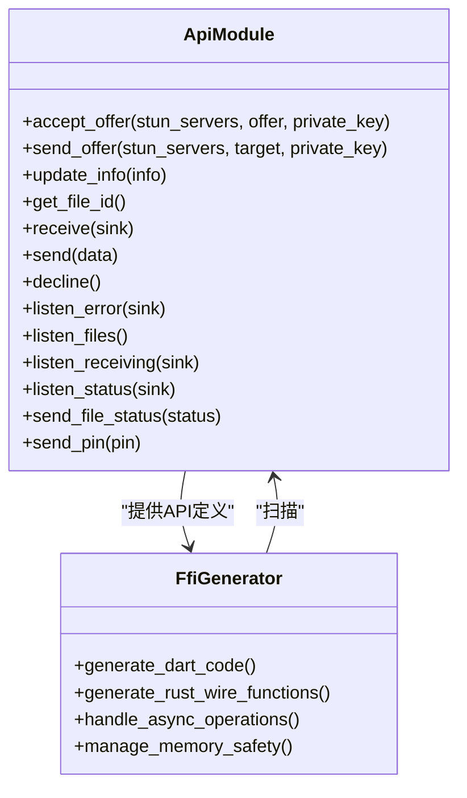
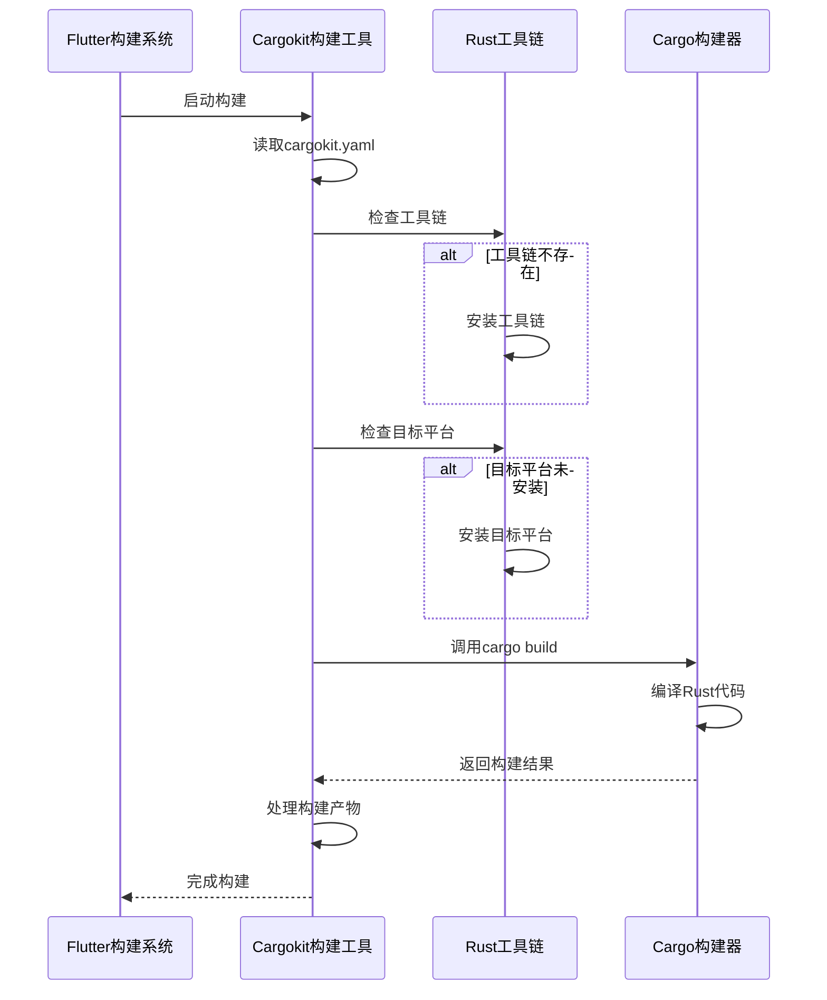
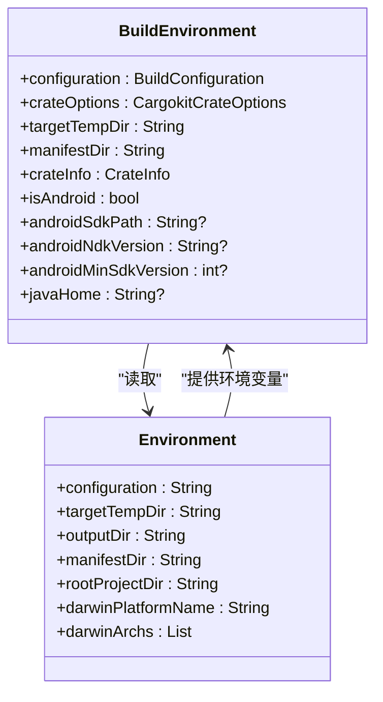
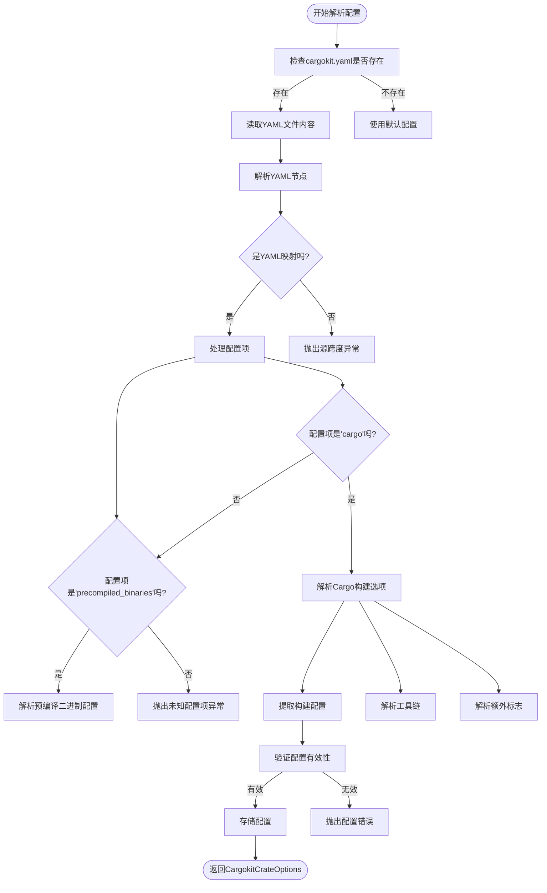
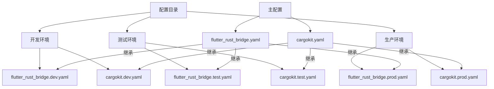
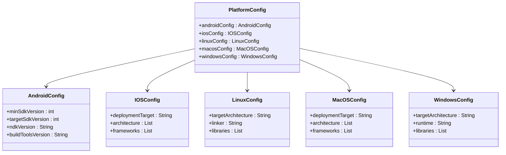
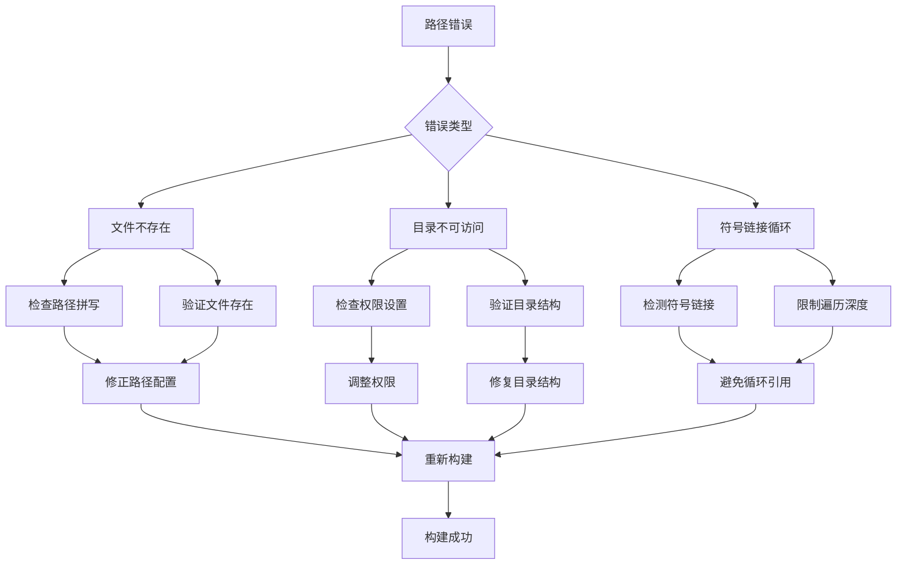
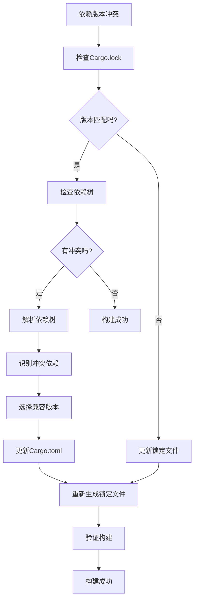

# FFI配置

<cite>
**本文档中引用的文件**  
- [flutter_rust_bridge.yaml](file://app/flutter_rust_bridge.yaml)
- [Cargo.toml](file://app/rust/Cargo.toml)
- [pubspec.yaml](file://app/rust_builder/pubspec.yaml)
- [builder.dart](file://app/rust_builder/cargokit/build_tool/lib/src/builder.dart)
- [options.dart](file://app/rust_builder/cargokit/build_tool/lib/src/options.dart)
- [environment.dart](file://app/rust_builder/cargokit/build_tool/lib/src/environment.dart)
- [lib.rs](file://app/rust/src/lib.rs)
</cite>

## 目录
1. [简介](#简介)
2. [项目结构](#项目结构)
3. [核心配置文件](#核心配置文件)
4. [构建脚本分析](#构建脚本分析)
5. [配置最佳实践](#配置最佳实践)
6. [常见配置错误及解决方案](#常见配置错误及解决方案)
7. [完整配置示例](#完整配置示例)
8. [结论](#结论)

## 简介
本项目使用Flutter Rust Bridge实现Flutter与Rust之间的FFI（外部函数接口）通信。通过`flutter_rust_bridge.yaml`配置文件定义Rust与Dart之间的桥接接口，利用Cargokit构建工具自动化处理跨平台编译和集成。该配置系统支持多平台构建，包括Android、iOS、Linux、macOS和Windows，并通过YAML配置文件管理构建选项和依赖关系。

## 项目结构
项目采用模块化结构，将Rust代码与Flutter应用分离，通过FFI进行通信。核心Rust库位于`app/rust`目录，而构建工具和插件位于`app/rust_builder`目录。这种分离设计使得Rust代码可以独立开发和测试，同时通过标准化的接口与Flutter应用集成。



**Diagram sources**
- [flutter_rust_bridge.yaml](file://app/flutter_rust_bridge.yaml)
- [pubspec.yaml](file://app/rust_builder/pubspec.yaml)

**Section sources**
- [flutter_rust_bridge.yaml](file://app/flutter_rust_bridge.yaml)
- [pubspec.yaml](file://app/rust_builder/pubspec.yaml)

## 核心配置文件
`flutter_rust_bridge.yaml`是FFI配置的核心文件，定义了Rust与Dart之间的接口映射关系。该文件包含三个主要配置项：`rust_input`、`rust_root`和`dart_output`。

```yaml
rust_input: crate::api
rust_root: rust/
dart_output: lib/rust
```

**Section sources**
- [flutter_rust_bridge.yaml](file://app/flutter_rust_bridge.yaml)

### rust_input配置
`rust_input`指定Rust端的API入口模块，本项目中为`crate::api`。这个配置项告诉FFI生成器从哪个Rust模块开始扫描公共API函数。API模块通常包含异步函数、数据结构和枚举定义，这些都将被自动转换为Dart可调用的接口。



**Diagram sources**
- [lib.rs](file://app/rust/src/lib.rs)
- [flutter_rust_bridge.yaml](file://app/flutter_rust_bridge.yaml)

### rust_root配置
`rust_root`指定Rust项目的根目录路径，相对于配置文件的位置。本项目中设置为`rust/`，这意味着Rust代码位于`app/rust`目录下。这个路径配置对于构建系统正确找到Cargo.toml文件和源代码至关重要。

### dart_output配置
`dart_output`定义生成的Dart代码的输出目录，本项目中为`lib/rust`。所有由FFI生成器创建的Dart桥接代码都将放置在此目录下，包括接口类、数据模型和异步操作处理器。

## 构建脚本分析
构建过程由Cargokit驱动，通过`builder.dart`中的`RustBuilder`类处理。构建脚本读取环境变量和配置文件，准备构建环境，然后调用Rust编译器生成目标平台的二进制文件。



**Diagram sources**
- [builder.dart](file://app/rust_builder/cargokit/build_tool/lib/src/builder.dart)
- [environment.dart](file://app/rust_builder/cargokit/build_tool/lib/src/environment.dart)

**Section sources**
- [builder.dart](file://app/rust_builder/cargokit/build_tool/lib/src/builder.dart)
- [options.dart](file://app/rust_builder/cargokit/build_tool/lib/src/options.dart)

### 构建环境配置
构建环境通过`BuildEnvironment`类管理，该类从环境变量中读取关键配置参数。这些参数包括构建配置（debug/release）、临时目录、清单目录和目标平台信息。



**Diagram sources**
- [environment.dart](file://app/rust_builder/cargokit/build_tool/lib/src/environment.dart)
- [builder.dart](file://app/rust_builder/cargokit/build_tool/lib/src/builder.dart)

### 构建选项解析
`CargokitCrateOptions`类负责解析`cargokit.yaml`配置文件，支持为不同构建配置（debug、release、profile）指定不同的编译选项。这使得开发者可以为不同环境定制编译参数。



**Diagram sources**
- [options.dart](file://app/rust_builder/cargokit/build_tool/lib/src/options.dart)

## 配置最佳实践
为了确保FFI配置的可维护性和可靠性，建议遵循以下最佳实践：

### 大型项目配置组织
对于大型项目，建议将配置文件按功能模块分离，使用统一的命名约定和目录结构。可以创建专门的配置目录，将不同环境的配置文件分开管理。



### 平台特定配置处理
不同平台可能需要不同的构建参数和依赖项。建议使用条件配置或平台特定的配置文件来管理这些差异，避免在单一配置文件中积累过多的条件逻辑。



**Diagram sources**
- [options.dart](file://app/rust_builder/cargokit/build_tool/lib/src/options.dart)

## 常见配置错误及解决方案
在配置FFI时，可能会遇到各种错误。以下是常见问题及其解决方案：

### 路径错误
路径错误是最常见的配置问题，通常由于相对路径计算错误或符号链接处理不当引起。确保所有路径配置都使用绝对路径或正确的相对路径。



### 依赖版本冲突
依赖版本冲突可能导致构建失败或运行时错误。建议使用锁定文件（如Cargo.lock）来固定依赖版本，并定期更新依赖以保持安全性。



**Diagram sources**
- [Cargo.toml](file://app/rust/Cargo.toml)

## 完整配置示例
以下是一个完整的FFI配置示例，展示了如何组织和配置各个组件：

```yaml
# flutter_rust_bridge.yaml
rust_input: crate::api
rust_root: rust/
dart_output: lib/rust

# cargokit.yaml
cargo:
  debug:
    toolchain: stable
    extra_flags:
      - --cfg=debug_assertions
  release:
    toolchain: stable
    extra_flags:
      - --release
      - --cfg=optimize
  profile:
    toolchain: nightly
    extra_flags:
      - --profile=dev
precompiled_binaries:
  url_prefix: https://example.com/binaries/
  public_key: 1234567890abcdef1234567890abcdef1234567890abcdef1234567890abcdef
```

**Section sources**
- [flutter_rust_bridge.yaml](file://app/flutter_rust_bridge.yaml)
- [cargokit.yaml](file://app/rust/cargokit.yaml)

## 结论
本项目的FFI配置系统通过`flutter_rust_bridge.yaml`和`cargokit.yaml`文件实现了Rust与Flutter之间的高效集成。构建脚本自动化处理了跨平台编译的复杂性，使得开发者可以专注于业务逻辑的实现。通过遵循最佳实践和正确处理常见错误，可以确保FFI配置的稳定性和可维护性。