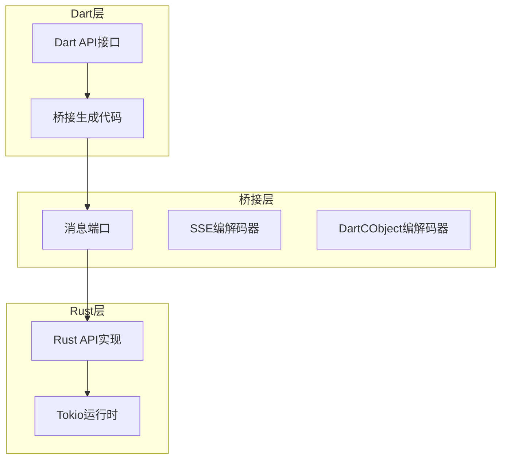
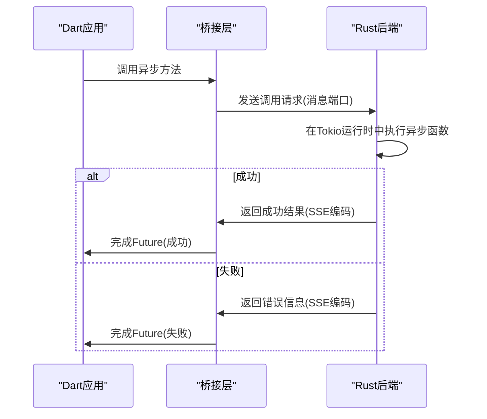
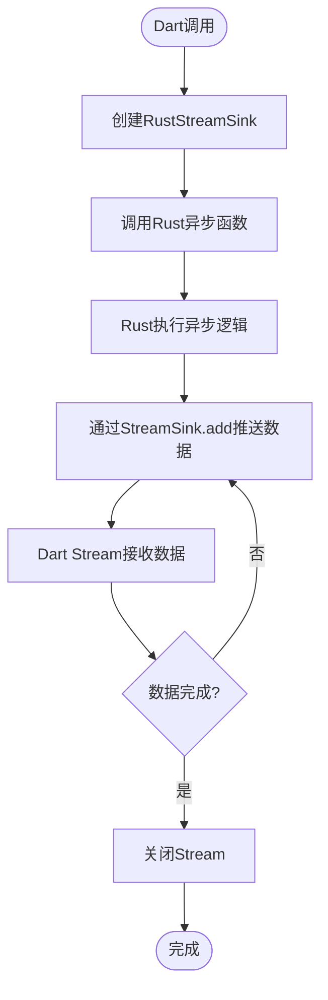
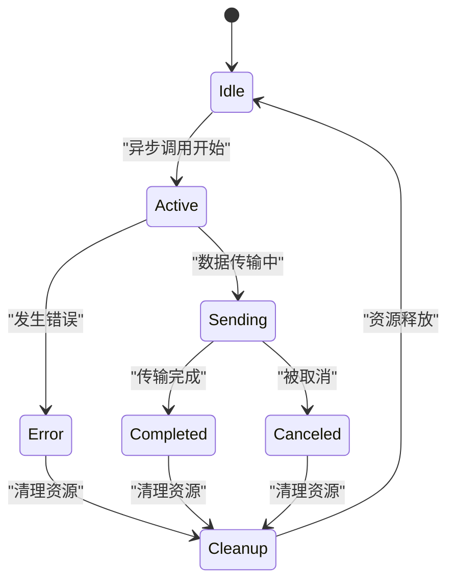
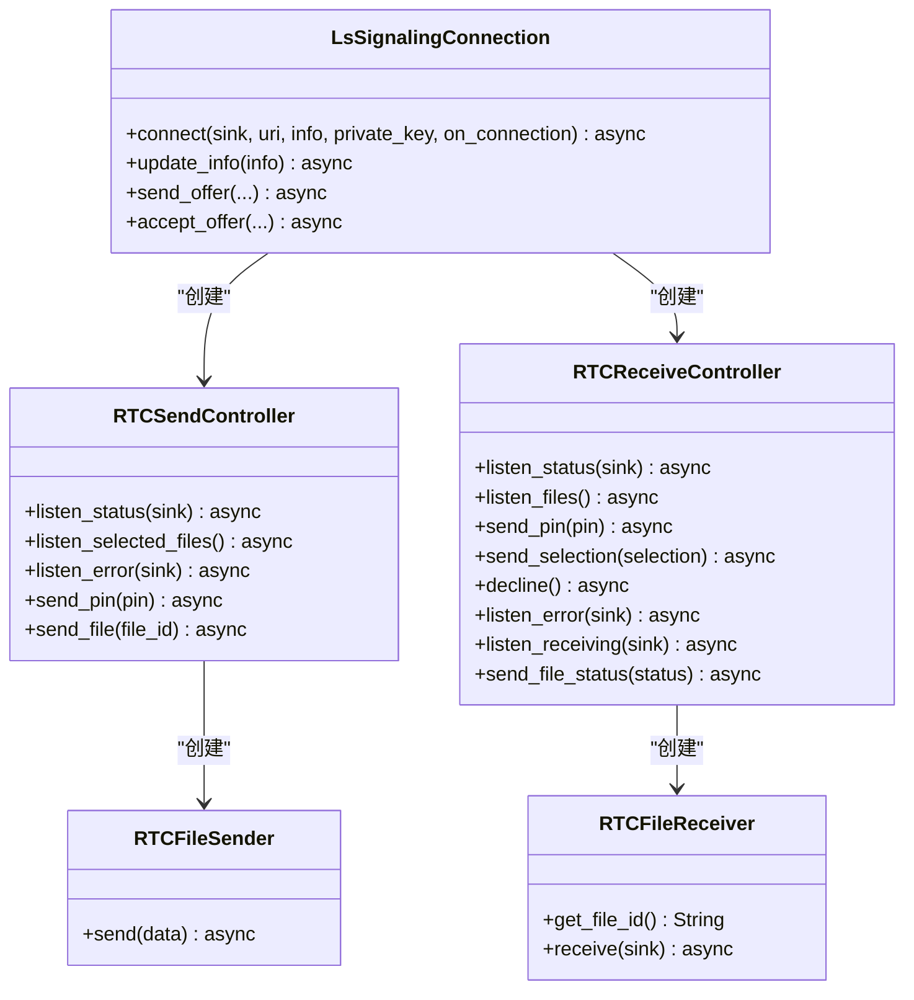

# 异步桥接

<cite>
**本文档引用的文件**
- [flutter_rust_bridge.yaml](file://app/flutter_rust_bridge.yaml)
- [webrtc.rs](file://app/rust/src/api/webrtc.rs)
- [frb_generated.rs](file://app/rust/src/frb_generated.rs)
- [frb_generated.dart](file://app/lib/rust/frb_generated.dart)
- [bytes.rs](file://app/rust/src/util/bytes.rs)
- [stream.dart](file://common/lib/util/stream.dart)
- [sleep.dart](file://common/lib/util/sleep.dart)
</cite>

## 目录
1. [引言](#引言)
2. [异步桥接机制概述](#异步桥接机制概述)
3. [Future桥接实现原理](#future桥接实现原理)
4. [Stream桥接实现原理](#stream桥接实现原理)
5. [异步调用生命周期管理](#异步调用生命周期管理)
6. [性能优化建议](#性能优化建议)
7. [错误处理最佳实践](#错误处理最佳实践)
8. [实际应用示例](#实际应用示例)
9. [结论](#结论)

## 引言

本文档详细阐述了Flutter-Rust-Bridge在Localsend项目中的异步桥接机制。通过分析Rust与Dart之间的异步通信，本文深入探讨了Future和Stream的桥接实现原理，包括异步调用的生命周期管理、资源清理、取消机制以及性能优化策略。文档还涵盖了错误处理的最佳实践，并通过实际代码示例展示了从Rust异步函数定义到Dart中调用的完整流程。

**Section sources**
- [flutter_rust_bridge.yaml](file://app/flutter_rust_bridge.yaml)

## 异步桥接机制概述

Flutter-Rust-Bridge提供了一套完整的异步桥接机制，使得Rust中的异步函数能够无缝映射到Dart的Future，同时Rust的Stream也能转换为Dart的Stream。该机制基于SSE（Server-Sent Events）编解码器和DartCObject编解码器，通过消息端口在Dart和Rust之间传递异步调用的结果和流数据。

系统架构采用分层设计，包括：
- Dart侧的API接口层
- 桥接生成代码层
- Rust侧的异步处理层
- 底层的Tokio运行时

这种设计确保了异步调用的高效性和可靠性，同时提供了良好的错误处理和资源管理机制。



**Diagram sources**
- [flutter_rust_bridge.yaml](file://app/flutter_rust_bridge.yaml)
- [frb_generated.dart](file://app/lib/rust/frb_generated.dart)
- [frb_generated.rs](file://app/rust/src/frb_generated.rs)

**Section sources**
- [flutter_rust_bridge.yaml](file://app/flutter_rust_bridge.yaml)
- [frb_generated.dart](file://app/lib/rust/frb_generated.dart)
- [frb_generated.rs](file://app/rust/src/frb_generated.rs)

## Future桥接实现原理

### Rust异步函数到Dart Future的映射

Rust中的异步函数通过`#[frb]`宏标记，被Flutter-Rust-Bridge工具自动生成桥接代码。这些异步函数使用`async`关键字定义，并返回`Result<T, E>`类型，其中T是成功时的返回值，E是错误类型。

在桥接过程中，Rust的`Future`被转换为Dart的`Future`，具体实现如下：

1. **调用流程**：Dart侧调用生成的桥接方法，该方法通过消息端口将调用信息发送到Rust侧
2. **执行处理**：Rust侧接收到调用请求后，在Tokio运行时中执行异步函数
3. **结果返回**：异步函数执行完成后，将结果通过SSE编解码器序列化并返回给Dart侧
4. **Future完成**：Dart侧接收到结果后，完成对应的Future



**Diagram sources**
- [frb_generated.dart](file://app/lib/rust/frb_generated.dart)
- [frb_generated.rs](file://app/rust/src/frb_generated.rs)

**Section sources**
- [frb_generated.dart](file://app/lib/rust/frb_generated.dart)
- [frb_generated.rs](file://app/rust/src/frb_generated.rs)

### 异步调用的执行机制

在Rust侧，异步调用的执行依赖于Tokio运行时。每个异步函数都在Tokio的任务调度器中运行，确保了非阻塞的I/O操作和高效的并发处理。

关键实现细节包括：
- 使用`tokio::spawn`创建异步任务
- 通过`mpsc`通道进行跨任务通信
- 利用`oneshot`通道实现一次性结果传递
- 采用`Arc<Mutex<T>>`进行线程安全的数据共享

例如，在`LsSignalingConnection::send_offer`方法中，通过`tokio::spawn`启动异步任务来处理WebRTC信令连接，同时使用多个通道来管理状态、错误和文件传输。

**Section sources**
- [webrtc.rs](file://app/rust/src/api/webrtc.rs)
- [frb_generated.rs](file://app/rust/src/frb_generated.rs)

## Stream桥接实现原理

### Rust Stream到Dart Stream的转换

Rust的Stream通过`StreamSink`机制转换为Dart的Stream。`StreamSink`是一个特殊的桥接类型，用于在Rust和Dart之间传递流式数据。

转换过程如下：
1. **创建StreamSink**：在Dart侧创建`RustStreamSink<T>`实例
2. **传递Sink**：将StreamSink作为参数传递给Rust异步函数
3. **数据推送**：Rust侧通过StreamSink的`add`方法推送数据
4. **流式接收**：Dart侧通过Stream的监听器接收数据



**Diagram sources**
- [frb_generated.dart](file://app/lib/rust/frb_generated.dart)
- [webrtc.rs](file://app/rust/src/api/webrtc.rs)

**Section sources**
- [frb_generated.dart](file://app/lib/rust/frb_generated.dart)
- [webrtc.rs](file://app/rust/src/api/webrtc.rs)

### StreamSink的实现细节

`RustStreamSink<T>`是桥接Stream的核心组件，它实现了Dart的`StreamController`接口，同时提供了与Rust侧通信的机制。

关键特性包括：
- **编解码器支持**：使用SSE编解码器序列化数据
- **错误处理**：支持通过`add_error`方法传递错误
- **生命周期管理**：自动处理Stream的开启、暂停、恢复和关闭
- **类型安全**：泛型设计确保类型安全的流数据传递

在生成的桥接代码中，`sse_encode_StreamSink_*`系列方法负责将不同类型的StreamSink序列化为SSE格式，确保数据能够正确传输。

**Section sources**
- [frb_generated.dart](file://app/lib/rust/frb_generated.dart)
- [frb_generated.rs](file://app/rust/src/frb_generated.rs)

## 异步调用生命周期管理

### 资源清理机制

异步调用的资源清理是确保系统稳定性的关键。Flutter-Rust-Bridge通过引用计数和自动清理机制来管理资源。

主要机制包括：
- **Arc智能指针**：在Rust侧使用`Arc<T>`管理共享资源的生命周期
- **弱引用**：使用`Weak<T>`避免循环引用
- **Drop trait**：实现资源的自动清理
- **消息端口管理**：确保消息端口在调用完成后正确关闭

在桥接层，通过`rust_arc_increment_strong_count`和`rust_arc_decrement_strong_count`函数来管理Rust对象的引用计数，确保对象在不再需要时能够被正确释放。



**Diagram sources**
- [frb_generated.dart](file://app/lib/rust/frb_generated.dart)
- [frb_generated.rs](file://app/rust/src/frb_generated.rs)

**Section sources**
- [frb_generated.dart](file://app/lib/rust/frb_generated.dart)
- [frb_generated.rs](file://app/rust/src/frb_generated.rs)

### 取消机制

异步调用的取消机制确保了用户能够及时终止长时间运行的操作。系统提供了多种取消方式：

1. **显式取消**：通过调用取消方法主动终止操作
2. **超时取消**：设置超时时间，超时后自动取消
3. **上下文取消**：通过`CancellationToken`传播取消信号
4. **资源释放取消**：当相关资源被释放时自动取消

在WebRTC文件传输场景中，通过`cancelSession`方法实现会话取消，该方法会：
- 终止所有正在运行的请求
- 通知接收方会话已取消
- 本地关闭会话并清理资源

**Section sources**
- [send_provider.dart](file://app/lib/provider/network/send_provider.dart)
- [webrtc.rs](file://app/rust/src/api/webrtc.rs)

## 性能优化建议

### 避免不必要的异步调用

过度使用异步调用会导致性能下降和资源浪费。优化建议包括：

1. **批量处理**：将多个小的异步操作合并为批量操作
2. **缓存结果**：对频繁访问的数据进行缓存
3. **延迟加载**：按需加载数据，避免一次性加载过多内容
4. **连接复用**：复用已建立的连接，减少连接开销

例如，在文件传输过程中，通过缓冲接收器减少消息传递次数：

```dart
/// Converts a stream of Bytes into a stream of Vec<u8>.
/// Also buffers the incoming data to reduce the number of
/// messages sent to the receiver.
pub(crate) async fn buffer_receiver(
    mut rx_input: mpsc::Receiver<Bytes>,
) -> mpsc::Receiver<Vec<u8>> {
    const BUFFER_SIZE: usize = 1024 * 1024; // 1 MB
    let mut buffer = BytesMut::with_capacity(BUFFER_SIZE);
    // ... 实现细节
}
```

**Section sources**
- [bytes.rs](file://app/rust/src/util/bytes.rs)

### 合理使用Stream

Stream的合理使用对性能有重要影响。最佳实践包括：

1. **流控机制**：实现适当的流控，避免生产者过快导致消费者积压
2. **背压处理**：当消费者处理不过来时，通知生产者减缓速度
3. **资源限制**：限制同时运行的Stream数量，避免资源耗尽
4. **错误恢复**：实现Stream的错误恢复机制，确保系统的健壮性

在Localsend项目中，通过`StreamExt.digested()`扩展方法实现了流的精细化控制：

```dart
extension StreamExt<T> on Stream<T> {
  (StreamController<T>, StreamSubscription<T>) digested() {
    late StreamSubscription<T> subscription;
    final streamController = StreamController<T>(
      onListen: () => subscription.resume(),
      onPause: () => subscription.pause(),
      onResume: () => subscription.resume(),
      onCancel: () async => await subscription.cancel(),
    );
    // ... 实现细节
  }
}
```

**Section sources**
- [stream.dart](file://common/lib/util/stream.dart)
- [bytes.rs](file://app/rust/src/util/bytes.rs)

## 错误处理最佳实践

### 异步上下文中的错误传递

在异步桥接中，错误处理需要特别关注。系统采用以下策略：

1. **统一错误类型**：使用`anyhow::Result<T, E>`作为统一的错误返回类型
2. **错误包装**：将底层错误包装为高层错误，提供上下文信息
3. **错误序列化**：通过SSE编解码器将错误信息序列化传输
4. **错误转换**：在Dart侧将Rust错误转换为Dart异常

在桥接层，通过`AnyhowException`类处理Rust侧的错误：

```dart
Box<void>? rawOutput;
Box<AnyhowException>? rawError;
try {
    rawOutput = Box(await raw(arg0));
} catch (e, s) {
    rawError = Box(AnyhowException('$e\n\n$s'));
}
```

**Section sources**
- [frb_generated.dart](file://app/lib/rust/frb_generated.dart)

### 错误处理模式

推荐的错误处理模式包括：

1. **防御性编程**：在关键路径上添加输入验证
2. **优雅降级**：当发生错误时，提供替代方案或降级功能
3. **用户友好**：将技术性错误转换为用户可理解的提示
4. **日志记录**：记录详细的错误日志，便于问题排查

在实际应用中，通过`humanErrorMessage`扩展方法提供用户友好的错误信息：

```dart
extension on Object {
  String get humanErrorMessage {
    final e = this;
    final (statusCode, message) = switch (this) {
      RhttpStatusCodeException(:final statusCode, :final body) => (statusCode, _parseErrorMessage(body)),
      _ => (null, e.toString()),
    };
    // ... 实现细节
  }
}
```

**Section sources**
- [send_provider.dart](file://app/lib/provider/network/send_provider.dart)

## 实际应用示例

### WebRTC文件传输流程

以WebRTC文件传输为例，展示从Rust异步函数定义到Dart调用的完整流程：

1. **Rust侧定义**：在`webrtc.rs`中定义异步API
2. **桥接生成**：Flutter-Rust-Bridge生成桥接代码
3. **Dart调用**：在Dart中调用生成的API
4. **结果处理**：处理异步结果和流数据



**Diagram sources**
- [webrtc.rs](file://app/rust/src/api/webrtc.rs)

**Section sources**
- [webrtc.rs](file://app/rust/src/api/webrtc.rs)
- [frb_generated.dart](file://app/lib/rust/frb_generated.dart)

### 异步调用完整流程

完整的异步调用流程包括：

1. **初始化**：建立Rust-Dart桥接
2. **连接**：建立WebRTC信令连接
3. **协商**：交换SDP信息，建立P2P连接
4. **传输**：通过DataChannel传输文件数据
5. **完成**：关闭连接，清理资源

该流程充分利用了异步桥接机制，确保了文件传输的高效性和可靠性。

**Section sources**
- [webrtc.rs](file://app/rust/src/api/webrtc.rs)

## 结论

Flutter-Rust-Bridge的异步桥接机制为Localsend项目提供了强大的跨语言异步通信能力。通过深入理解Future和Stream的桥接实现原理，开发者能够更好地利用这一机制构建高性能、高可靠性的应用程序。

关键要点总结：
- **无缝映射**：Rust异步函数与Dart Future的无缝映射
- **高效流式**：Rust Stream到Dart Stream的高效转换
- **完整生命周期**：完善的资源管理和取消机制
- **健壮错误处理**：统一的错误处理和传递机制
- **性能优化**：合理的性能优化策略和最佳实践

通过遵循本文档中的最佳实践，开发者可以充分发挥异步桥接的优势，构建出更加优秀的跨平台应用。