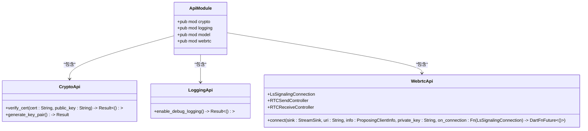

# 接口扩展

<cite>
**本文档中引用的文件**  
- [flutter_rust_bridge.yaml](file://app/flutter_rust_bridge.yaml)
- [lib.rs](file://app/rust/src/lib.rs)
- [mod.rs](file://app/rust/src/api/mod.rs)
- [model.rs](file://app/rust/src/api/model.rs)
- [crypto.rs](file://app/rust/src/api/crypto.rs)
- [logging.rs](file://app/rust/src/api/logging.rs)
- [webrtc.rs](file://app/rust/src/api/webrtc.rs)
- [frb_generated.rs](file://app/rust/src/frb_generated.rs)
- [Cargo.toml](file://app/rust/Cargo.toml)
- [frb_generated.dart](file://app/lib/rust/frb_generated.dart)
</cite>

## 目录
1. [介绍](#介绍)
2. [项目结构](#项目结构)
3. [核心组件](#核心组件)
4. [架构概述](#架构概述)
5. [详细组件分析](#详细组件分析)
6. [依赖分析](#依赖分析)
7. [性能考虑](#性能考虑)
8. [故障排除指南](#故障排除指南)
9. [结论](#结论)

## 介绍
本指南详细介绍了在LocalSend项目中扩展接口的完整流程。文档涵盖了从零开始添加新的桥接接口的完整步骤，包括在Rust中定义函数签名、更新flutter_rust_bridge.yaml配置、生成桥接代码等。详细说明了如何处理复杂参数和返回值，包括结构体、枚举和集合类型。阐述了版本控制策略，以及如何安全地修改现有接口而不破坏向后兼容性。提供了代码组织建议，并包含常见问题的解决方案。

**Section sources**
- [flutter_rust_bridge.yaml](file://app/flutter_rust_bridge.yaml)
- [lib.rs](file://app/rust/src/lib.rs)

## 项目结构
LocalSend项目采用模块化架构，将Rust后端与Flutter前端通过flutter_rust_bridge进行桥接。Rust代码位于app/rust/src目录下，主要API接口定义在api子模块中。桥接配置文件flutter_rust_bridge.yaml定义了Rust输入路径、Rust根目录和Dart输出路径。生成的桥接代码会自动创建在指定的Dart输出目录中。

**Diagram sources**
- [flutter_rust_bridge.yaml](file://app/flutter_rust_bridge.yaml)
- [lib.rs](file://app/rust/src/lib.rs)

**Section sources**
- [flutter_rust_bridge.yaml](file://app/flutter_rust_bridge.yaml)
- [lib.rs](file://app/rust/src/lib.rs)

## 核心组件
项目的核心组件包括API接口层、桥接层和核心功能模块。API接口层封装了所有需要暴露给Flutter前端的功能，通过flutter_rust_bridge进行桥接。核心功能模块包括加密、日志记录、WebRTC通信等。桥接层自动生成，负责在Rust和Dart之间传递数据和调用。

**Section sources**
- [mod.rs](file://app/rust/src/api/mod.rs)
- [frb_generated.rs](file://app/rust/src/frb_generated.rs)
- [frb_generated.dart](file://app/lib/rust/frb_generated.dart)

## 架构概述
系统架构采用分层设计，Flutter前端通过桥接层与Rust后端通信。Rust后端又分为API层和核心功能层。API层负责暴露接口，核心功能层实现具体业务逻辑。这种设计使得前端可以专注于UI交互，后端专注于性能和安全。

**Diagram sources**
- [frb_generated.dart](file://app/lib/rust/frb_generated.dart)
- [frb_generated.rs](file://app/rust/src/frb_generated.rs)

## 详细组件分析

### API接口分析
API接口通过模块化方式组织，每个功能模块对应一个Rust文件。使用`pub mod`声明公共模块，通过`pub use`重新导出核心数据结构。接口函数使用`pub fn`声明，确保可以被桥接层访问。

**Diagram sources**
- [mod.rs](file://app/rust/src/api/mod.rs)
- [crypto.rs](file://app/rust/src/api/crypto.rs)
- [logging.rs](file://app/rust/src/api/logging.rs)
- [webrtc.rs](file://app/rust/src/api/webrtc.rs)

### 数据模型分析
数据模型通过`#[frb(mirror(...))]`属性标记，将核心模块的数据结构镜像到API层。这包括结构体和枚举类型，确保前后端数据结构的一致性。复杂类型如HashMap和Option也被正确处理。

**Diagram sources**
- [model.rs](file://app/rust/src/api/model.rs)

### 桥接机制分析
桥接机制基于flutter_rust_bridge实现，通过自动生成的代码在Rust和Dart之间建立通信。桥接层处理数据序列化、异步调用和错误传递。使用SseCodec进行数据编码，支持复杂数据类型的传输。

**Diagram sources**
- [frb_generated.rs](file://app/rust/src/frb_generated.rs)
- [frb_generated.dart](file://app/lib/rust/frb_generated.dart)

**Section sources**
- [frb_generated.rs](file://app/rust/src/frb_generated.rs)
- [frb_generated.dart](file://app/lib/rust/frb_generated.dart)

## 依赖分析
项目依赖关系清晰，Rust后端依赖核心模块实现具体功能，桥接层依赖flutter_rust_bridge库。前端通过生成的Dart代码与后端通信，形成松耦合的架构。

**Diagram sources**
- [Cargo.toml](file://app/rust/Cargo.toml)
- [lib.rs](file://app/rust/src/lib.rs)

**Section sources**
- [Cargo.toml](file://app/rust/Cargo.toml)

## 性能考虑
桥接层的性能主要受数据序列化和跨语言调用开销影响。建议：
1. 减少频繁的小数据量调用
2. 批量处理相关操作
3. 避免在UI线程中执行耗时的桥接调用
4. 使用异步调用处理长时间运行的操作

## 故障排除指南
常见问题及解决方案：

1. **接口生成失败**：检查函数签名是否符合桥接要求，确保所有类型都可序列化
2. **类型不匹配**：确认Rust和Dart端的数据结构定义一致
3. **异步调用问题**：确保正确处理Future和Stream
4. **内存泄漏**：注意Rust对象的生命周期管理，及时释放资源

**Section sources**
- [frb_generated.rs](file://app/rust/src/frb_generated.rs)
- [frb_generated.dart](file://app/lib/rust/frb_generated.dart)

## 结论
LocalSend项目的接口扩展流程设计合理，通过flutter_rust_bridge实现了Rust和Flutter之间的高效通信。遵循模块化设计原则，使得代码结构清晰，易于维护和扩展。通过合理的数据模型设计和桥接机制，确保了前后端数据的一致性和通信的可靠性。