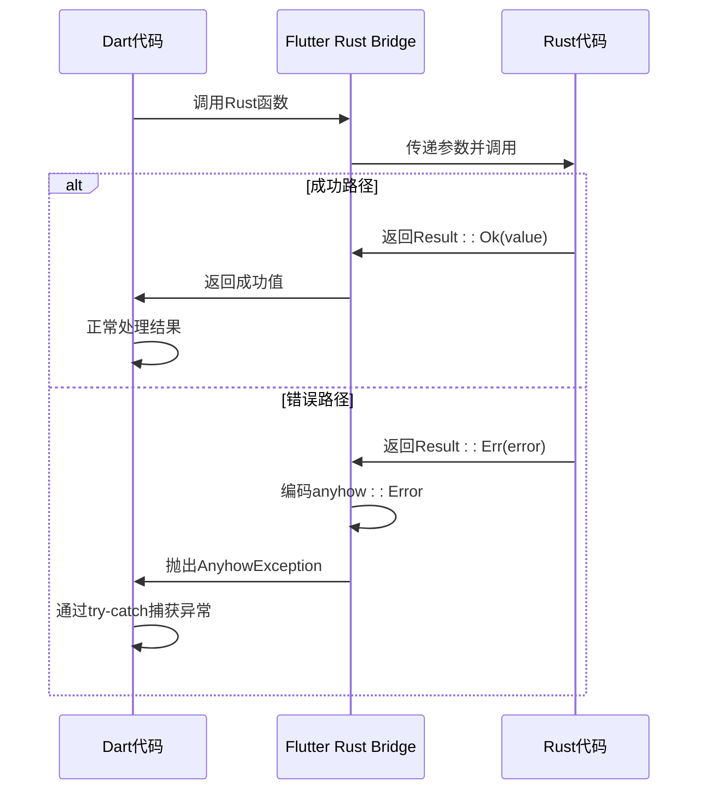
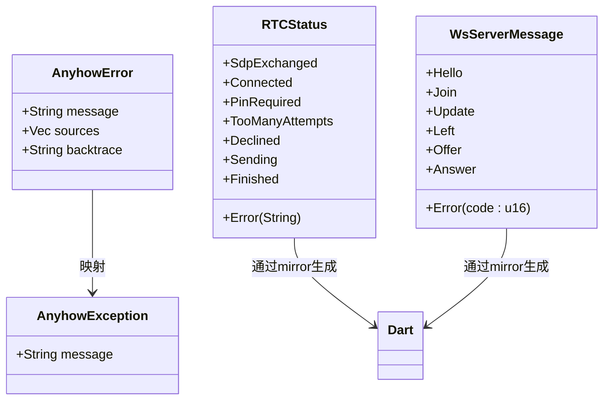
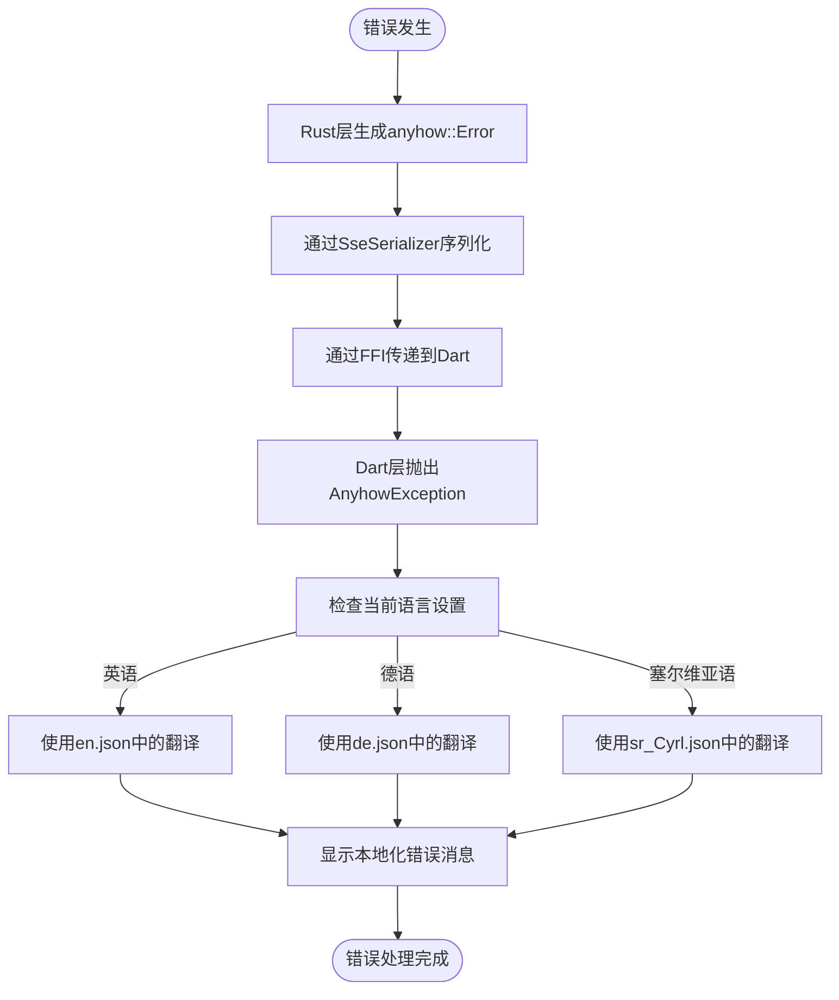
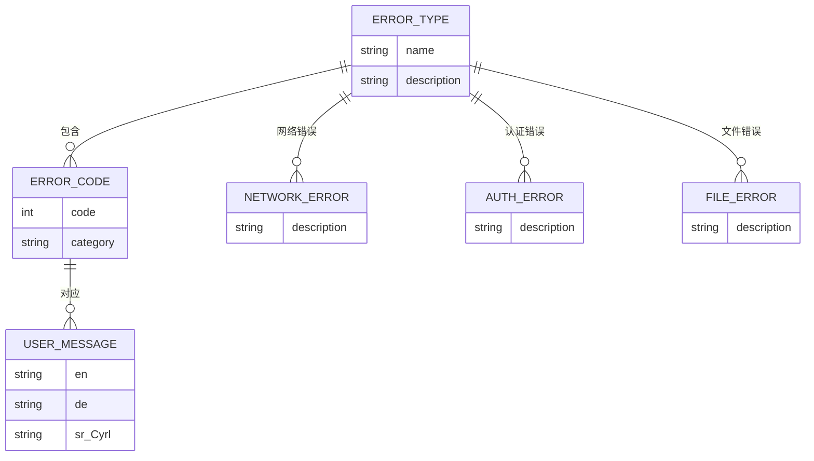
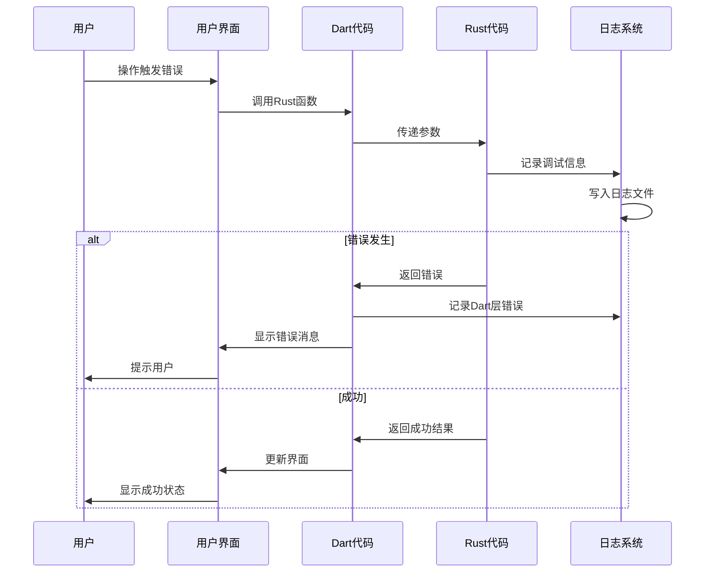
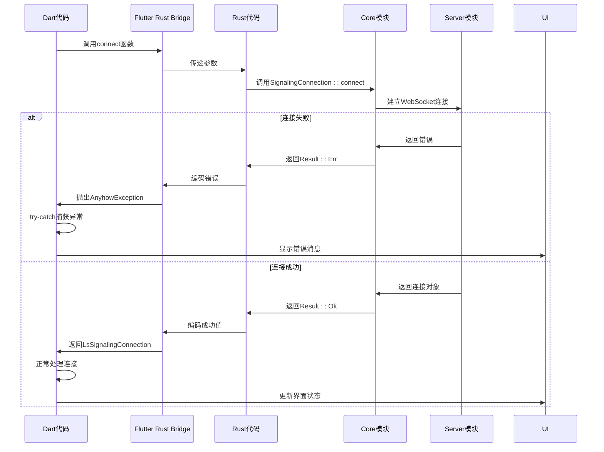

# 错误处理

<cite>
**本文档引用的文件**   
- [frb_generated.dart](file://app/lib/rust/frb_generated.dart)
- [frb_generated.rs](file://app/rust/src/frb_generated.rs)
- [logging.rs](file://app/rust/src/api/logging.rs)
- [webrtc.rs](file://app/rust/src/api/webrtc.rs)
- [crypto.rs](file://app/rust/src/api/crypto.rs)
- [mod.rs](file://core/src/http/mod.rs)
- [error.rs](file://core/src/http/server/error.rs)
- [send_provider.dart](file://app/lib/provider/network/send_provider.dart)
- [strings_en.g.dart](file://app/lib/gen/strings_en.g.dart)
- [strings_de.g.dart](file://app/lib/gen/strings_de.g.dart)
- [strings_sr_Cyrl.g.dart](file://app/lib/gen/strings_sr_Cyrl.g.dart)
</cite>

## 目录
1. [介绍](#介绍)
2. [Rust Result<T, E> 与 Dart 异常系统的映射](#rust-resultt-e-与-dart-异常系统的映射)
3. [自定义错误类型的桥接方式](#自定义错误类型的桥接方式)
4. [错误信息的传递与本地化处理](#错误信息的传递与本地化处理)
5. [错误处理最佳实践](#错误处理最佳实践)
6. [调试错误传递问题的实用技巧](#调试错误传递问题的实用技巧)
7. [完整的错误处理流程示例](#完整的错误处理流程示例)

## 介绍

LocalSend 项目采用了一套完整的跨语言错误处理机制，通过 Flutter Rust Bridge (FRB) 在 Rust 和 Dart 之间进行错误传递。该系统利用 Rust 的 `Result<T, E>` 类型和 `anyhow` 库来处理错误，并将其映射到 Dart 的异常系统中。整个错误处理框架设计考虑了错误分类、错误码设计、用户友好的错误消息展示以及调试支持。

**Section sources**
- [frb_generated.dart](file://app/lib/rust/frb_generated.dart)
- [frb_generated.rs](file://app/rust/src/frb_generated.rs)

## Rust Result<T, E> 与 Dart 异常系统的映射

在 LocalSend 项目中，Rust 的 `Result<T, E>` 类型通过 Flutter Rust Bridge 被映射到 Dart 的异常系统。当 Rust 函数返回 `Result<T, E>` 时，成功值 `T` 会被传递给 Dart 作为正常返回值，而错误值 `E` 会被转换为 Dart 异常并抛出。

具体实现中，Rust 使用 `anyhow::Result<T>` 类型来表示可能出错的操作。在 FRB 生成的代码中，当 Rust 函数执行失败时，会将 `anyhow::Error` 编码并通过 FFI 传递到 Dart 层。Dart 层接收到错误后，会将其包装为 `AnyhowException` 类并抛出。

**Diagram sources**
- [frb_generated.dart](file://app/lib/rust/frb_generated.dart)
- [frb_generated.rs](file://app/rust/src/frb_generated.rs)

**Section sources**
- [frb_generated.dart](file://app/lib/rust/frb_generated.dart)
- [frb_generated.rs](file://app/rust/src/frb_generated.rs)

## 自定义错误类型的桥接方式

LocalSend 项目通过多种方式实现了自定义错误类型的桥接。首先，在 Rust 层使用 `thiserror` 库定义了各种错误类型，这些错误类型实现了 `std::error::Error` trait，可以被 `anyhow` 库包装和处理。

对于需要在 Dart 层直接处理的特定错误类型，项目使用了 FRB 的 `mirror` 属性来生成对应的 Dart 类。例如，在 `webrtc.rs` 文件中，`RTCStatus` 枚举被标记为 `#[frb(mirror(RTCStatus))]`，这会生成对应的 Dart 枚举，使得 Dart 代码可以直接处理这些特定的错误状态。

**Diagram sources**
- [webrtc.rs](file://app/rust/src/api/webrtc.rs)
- [frb_generated.dart](file://app/lib/rust/frb_generated.dart)

**Section sources**
- [webrtc.rs](file://app/rust/src/api/webrtc.rs)
- [frb_generated.dart](file://app/lib/rust/frb_generated.dart)

## 错误信息的传递与本地化处理

错误信息的传递在 LocalSend 项目中通过结构化的方式实现。当错误发生时，Rust 层的 `anyhow::Error` 包含详细的错误消息和上下文信息。这些信息通过 SseSerializer 进行序列化，然后通过 FFI 传递到 Dart 层。

在 Dart 层，错误消息会根据用户的语言设置进行本地化处理。项目使用 `flutter_gen/gen_l10n` 工具从 JSON 文件生成本地化字符串类。当需要显示错误消息时，系统会根据当前语言环境选择相应的翻译。

**Diagram sources**
- [frb_generated.dart](file://app/lib/rust/frb_generated.dart)
- [strings_en.g.dart](file://app/lib/gen/strings_en.g.dart)
- [strings_de.g.dart](file://app/lib/gen/strings_de.g.dart)
- [strings_sr_Cyrl.g.dart](file://app/lib/gen/strings_sr_Cyrl.g.dart)

**Section sources**
- [frb_generated.dart](file://app/lib/rust/frb_generated.dart)
- [strings_en.g.dart](file://app/lib/gen/strings_en.g.dart)
- [strings_de.g.dart](file://app/lib/gen/strings_de.g.dart)
- [strings_sr_Cyrl.g.dart](file://app/lib/gen/strings_sr_Cyrl.g.dart)

## 错误处理最佳实践

LocalSend 项目的错误处理遵循了一系列最佳实践：

1. **错误分类**: 项目将错误分为不同类别，如网络错误、认证错误、文件传输错误等，便于针对性处理。
2. **错误码设计**: 对于 HTTP 相关的错误，使用标准的 HTTP 状态码，如 401 表示未授权，403 表示拒绝访问等。
3. **用户友好的错误消息**: 错误消息设计简洁明了，避免技术术语，让用户容易理解问题所在。
4. **错误上下文**: 在错误传递过程中保留足够的上下文信息，便于调试和问题定位。

**Diagram sources**
- [send_provider.dart](file://app/lib/provider/network/send_provider.dart)
- [error.rs](file://core/src/http/server/error.rs)

**Section sources**
- [send_provider.dart](file://app/lib/provider/network/send_provider.dart)
- [error.rs](file://core/src/http/server/error.rs)

## 调试错误传递问题的实用技巧

为了便于调试错误传递问题，LocalSend 项目提供了多种实用技巧：

1. **日志记录**: 使用 `tracing` 库在 Rust 层记录详细的错误堆栈，使用 `logging` 库在 Dart 层记录错误信息。
2. **调试模式**: 可以通过调用 `enable_debug_logging()` 函数启用调试日志，获取更详细的运行时信息。
3. **跨线程错误传递**: 使用 `mpsc` 通道在不同线程间安全地传递错误信息。

**Diagram sources**
- [logging.rs](file://app/rust/src/api/logging.rs)
- [send_provider.dart](file://app/lib/provider/network/send_provider.dart)

**Section sources**
- [logging.rs](file://app/rust/src/api/logging.rs)
- [send_provider.dart](file://app/lib/provider/network/send_provider.dart)

## 完整的错误处理流程示例

以下是一个完整的错误处理流程示例，展示了从 Rust 层错误发生到 Dart 层处理的全过程：

**Diagram sources**
- [webrtc.rs](file://app/rust/src/api/webrtc.rs)
- [frb_generated.dart](file://app/lib/rust/frb_generated.dart)
- [mod.rs](file://core/src/http/mod.rs)

**Section sources**
- [webrtc.rs](file://app/rust/src/api/webrtc.rs)
- [frb_generated.dart](file://app/lib/rust/frb_generated.dart)
- [mod.rs](file://core/src/http/mod.rs)