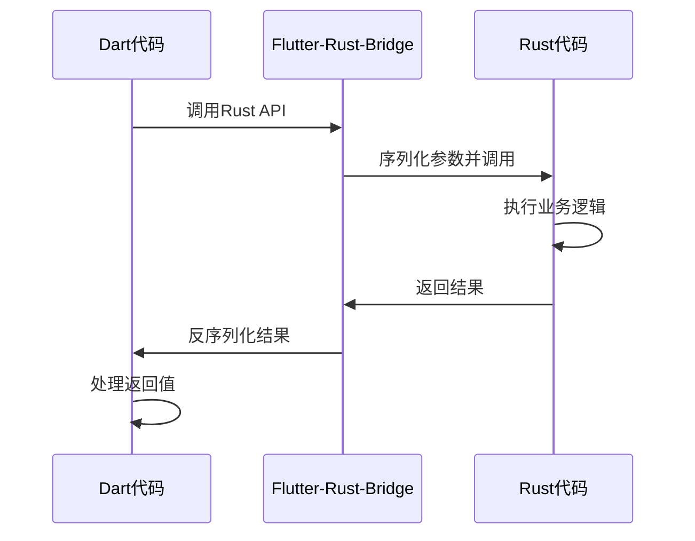
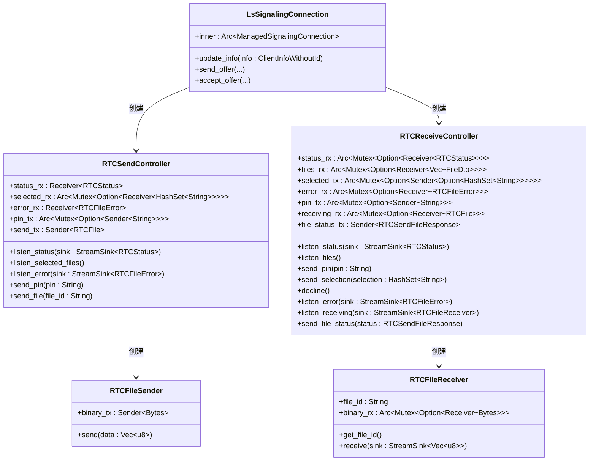
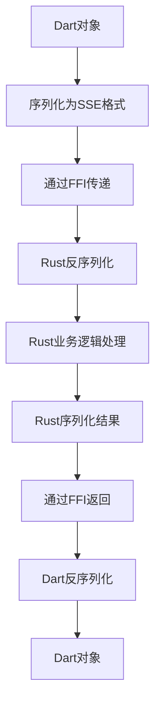
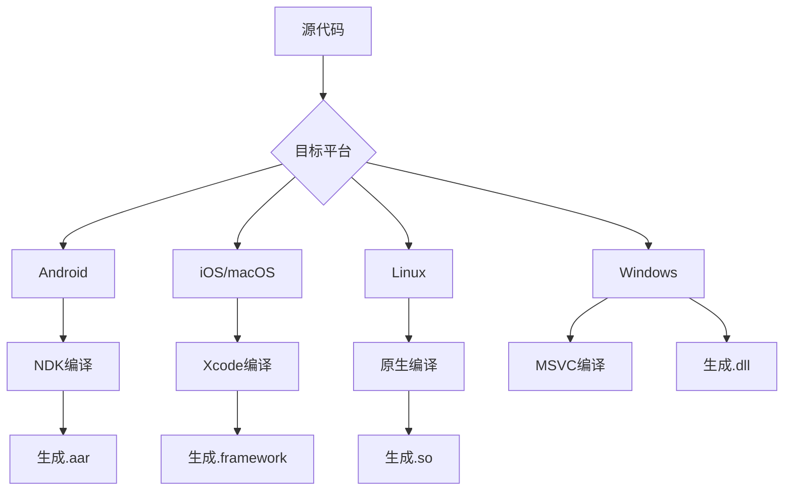
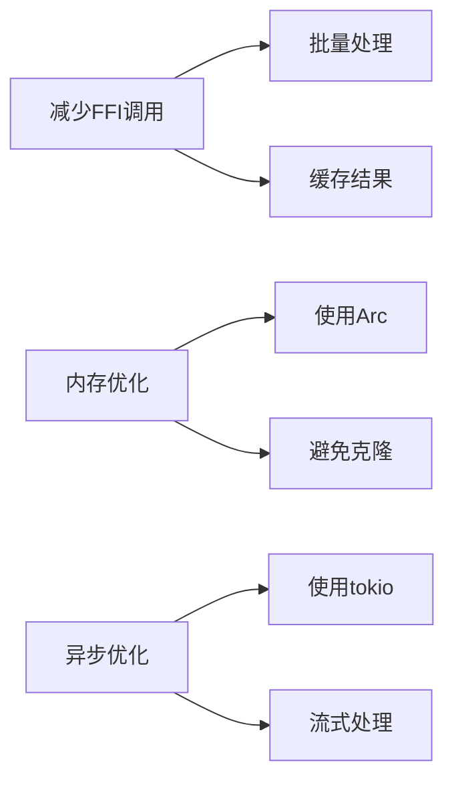

# Rust集成

<cite>
**本文档中引用的文件**  
- [flutter_rust_bridge.yaml](file://app/flutter_rust_bridge.yaml)
- [Cargo.toml](file://app/rust/Cargo.toml)
- [lib.rs](file://app/rust/src/lib.rs)
- [frb_generated.rs](file://app/rust/src/frb_generated.rs)
- [frb_generated.dart](file://app/rust/src/frb_generated.dart)
- [webrtc.rs](file://app/rust/src/api/webrtc.rs)
- [model.rs](file://app/rust/src/api/model.rs)
- [lib.rs](file://core/src/lib.rs)
- [Cargo.toml](file://core/Cargo.toml)
- [mod.rs](file://core/src/webrtc/mod.rs)
- [security_helper.dart](file://app/lib/util/security_helper.dart)
</cite>

## 目录
1. [介绍](#介绍)
2. [Flutter-Rust桥接机制](#flutter-rust桥接机制)
3. [Rust核心库架构](#rust核心库架构)
4. [数据序列化与反序列化](#数据序列化与反序列化)
5. [Rust代码构建与交叉编译](#rust代码构建与交叉编译)
6. [性能优化技巧](#性能优化技巧)
7. [错误处理策略](#错误处理策略)
8. [调试指南](#调试指南)
9. [扩展Rust功能](#扩展rust功能)

## 介绍

本项目通过Flutter-Rust-Bridge实现了Flutter与Rust之间的高效集成，利用Rust的高性能特性来处理加密、HTTP服务器和WebRTC等关键功能。这种架构设计使得应用能够在保持Flutter跨平台UI优势的同时，获得Rust在系统级编程方面的强大能力。项目采用模块化设计，将Rust代码分为核心库（core）和应用特定库（app/rust），并通过FFI（外部函数接口）桥接实现安全高效的数据交换。

**Section sources**
- [lib.rs](file://core/src/lib.rs#L1-L8)
- [Cargo.toml](file://core/Cargo.toml#L1-L44)

## Flutter-Rust桥接机制

项目使用Flutter-Rust-Bridge工具实现Flutter与Rust之间的桥接。该工具通过代码生成方式自动创建必要的绑定代码，简化了跨语言调用的复杂性。配置文件`flutter_rust_bridge.yaml`定义了Rust输入模块、Rust根目录和Dart输出目录，确保了代码生成的正确性。

桥接机制的核心是`frb_generated`系列文件，这些文件由工具自动生成，包含了Rust和Dart之间的双向通信接口。在Rust端，`frb_generated.rs`文件包含了FFI函数的实现，负责处理来自Dart的调用请求。在Dart端，`frb_generated.dart`文件提供了类型安全的API接口，使得Dart代码可以像调用本地方法一样调用Rust函数。



**Diagram sources**
- [flutter_rust_bridge.yaml](file://app/flutter_rust_bridge.yaml#L1-L4)
- [frb_generated.rs](file://app/rust/src/frb_generated.rs#L1-L800)
- [frb_generated.dart](file://app/lib/rust/frb_generated.dart#L1-L800)

**Section sources**
- [flutter_rust_bridge.yaml](file://app/flutter_rust_bridge.yaml#L1-L4)
- [frb_generated.rs](file://app/rust/src/frb_generated.rs#L1-L800)
- [frb_generated.dart](file://app/lib/rust/frb_generated.dart#L1-L800)

## Rust核心库架构

Rust核心库分为多个功能模块，包括加密、HTTP服务器和WebRTC功能。核心库位于`core`目录，通过Cargo.toml中的feature机制实现功能的灵活配置。`app/rust`目录中的库依赖于核心库，并通过FFI暴露必要的接口给Dart层。

加密模块提供了密钥生成、证书验证等功能，基于`ed25519-dalek`、`rsa`等成熟库实现。HTTP服务器模块基于`hyper`和`tokio`构建，支持HTTP/HTTPS协议。WebRTC模块实现了完整的信令协议，支持点对点文件传输。



**Diagram sources**
- [webrtc.rs](file://app/rust/src/api/webrtc.rs#L1-L515)
- [mod.rs](file://core/src/webrtc/mod.rs#L1-L4)

**Section sources**
- [webrtc.rs](file://app/rust/src/api/webrtc.rs#L1-L515)
- [model.rs](file://app/rust/src/api/model.rs#L1-L73)
- [lib.rs](file://core/src/lib.rs#L1-L8)

## 数据序列化与反序列化

数据在Dart和Rust之间传递时，通过SSE（Server-Sent Events）编码格式进行序列化和反序列化。Flutter-Rust-Bridge工具自动生成了必要的编解码函数，确保了数据类型的正确转换。对于复杂的数据结构，如枚举和嵌套对象，工具会生成相应的镜像结构（mirror）来保持类型一致性。

在Rust端，使用`#[frb(mirror(...))]`宏标记需要暴露给Dart的类型，工具会自动生成对应的Dart类。对于集合类型，如`Vec<T>`和`HashMap<K,V>`，工具会生成相应的编解码逻辑。对于异步流数据，使用`StreamSink`类型来实现双向流式通信。



**Diagram sources**
- [frb_generated.rs](file://app/rust/src/frb_generated.rs#L1-L800)
- [frb_generated.dart](file://app/lib/rust/frb_generated.dart#L1-L800)

**Section sources**
- [frb_generated.rs](file://app/rust/src/frb_generated.rs#L1-L800)
- [frb_generated.dart](file://app/lib/rust/frb_generated.dart#L1-L800)

## Rust代码构建与交叉编译

Rust代码的构建过程通过`rust_builder`目录中的Cargokit工具链实现，支持针对不同平台的交叉编译。构建配置在`Cargo.toml`文件中定义，指定了crate类型为`cdylib`和`staticlib`，以便生成动态和静态链接库。

对于Android平台，构建脚本会设置适当的NDK环境变量和编译器标志。对于iOS和macOS平台，使用Xcode工具链进行编译。Linux和Windows平台则使用原生工具链。构建过程自动化处理了依赖解析、编译和链接，确保生成的库可以在目标平台上正确加载。



**Diagram sources**
- [Cargo.toml](file://app/rust/Cargo.toml#L1-L18)
- [android_environment.dart](file://app/rust_builder/cargokit/build_tool/lib/src/android_environment.dart#L98-L166)

**Section sources**
- [Cargo.toml](file://app/rust/Cargo.toml#L1-L18)
- [android_environment.dart](file://app/rust_builder/cargokit/build_tool/lib/src/android_environment.dart#L98-L166)

## 性能优化技巧

为了减少跨语言调用的开销，项目采用了多种性能优化策略。首先，尽量减少频繁的小数据量调用，而是通过批量处理来降低FFI调用次数。其次，对于大数据传输，使用共享内存或直接内存访问来避免数据复制。

内存管理方面，使用`Arc`（原子引用计数）来安全地共享数据，避免不必要的克隆。对于异步操作，使用`tokio`运行时来高效处理并发任务。在WebRTC文件传输场景中，使用流式传输而不是一次性加载整个文件，有效降低了内存占用。



**Section sources**
- [webrtc.rs](file://app/rust/src/api/webrtc.rs#L1-L515)
- [lib.rs](file://app/rust/src/lib.rs#L1-L4)

## 错误处理策略

错误处理通过将Rust的`Result`类型映射到Dart的异常处理机制来实现。当Rust函数返回`Err`时，会被转换为Dart端的异常；当返回`Ok`时，则返回相应的值。对于异步流中的错误，使用`StreamSink`的`add_error`方法来传递错误信息。

在WebRTC模块中，定义了专门的错误类型`RTCFileError`来表示文件传输过程中的各种错误情况。这些错误信息会被序列化并通过流传递给Dart端，以便进行适当的用户界面反馈。

```mermaid
stateDiagram-v2
[*] --> Success
[*] --> Error
Success --> [*]
Error --> [*]
note right of Error
错误信息通过StreamSink
传递给Dart端
end
```

**Section sources**
- [webrtc.rs](file://app/rust/src/api/webrtc.rs#L1-L515)
- [frb_generated.rs](file://app/rust/src/frb_generated.rs#L1-L800)

## 调试指南

调试Rust代码需要使用特定的工具和方法。对于本地调试，可以使用`rust-analyzer`配合VS Code进行断点调试。对于跨语言调用问题，建议在关键位置添加详细的日志记录，使用`tracing`库来跟踪函数调用和数据流。

分析跨语言调用问题时，可以启用Flutter-Rust-Bridge的调试日志，查看序列化/反序列化的详细过程。对于内存泄漏问题，可以使用`valgrind`或`AddressSanitizer`等工具进行检测。在发布版本中，建议保留关键的错误日志记录，以便于问题排查。

**Section sources**
- [lib.rs](file://core/src/lib.rs#L1-L8)
- [Cargo.toml](file://core/Cargo.toml#L1-L44)

## 扩展Rust功能

扩展Rust功能需要遵循一定的步骤。首先，在`core`库中实现新的功能模块，确保其具有良好的测试覆盖率。然后，在`app/rust`库中创建FFI接口，使用`#[frb]`宏标记需要暴露的函数和类型。

在添加新的FFI接口时，需要注意数据类型的兼容性，避免使用Rust特有的类型（如`Cow`、`Rc`等）。对于复杂的数据结构，应该设计简洁的API接口，避免过度暴露内部实现细节。最后，更新`flutter_rust_bridge.yaml`配置并重新生成绑定代码。

**Section sources**
- [flutter_rust_bridge.yaml](file://app/flutter_rust_bridge.yaml#L1-L4)
- [lib.rs](file://app/rust/src/lib.rs#L1-L4)
- [webrtc.rs](file://app/rust/src/api/webrtc.rs#L1-L515)