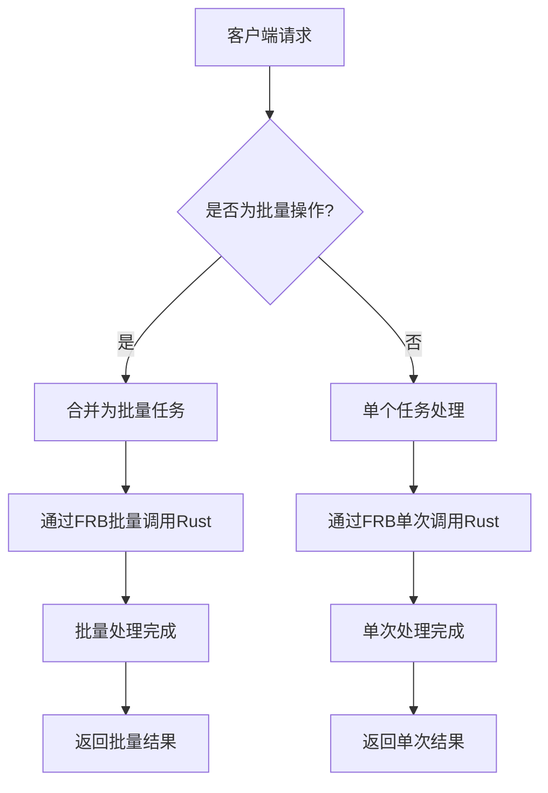
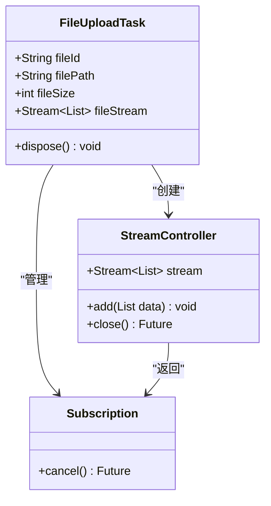
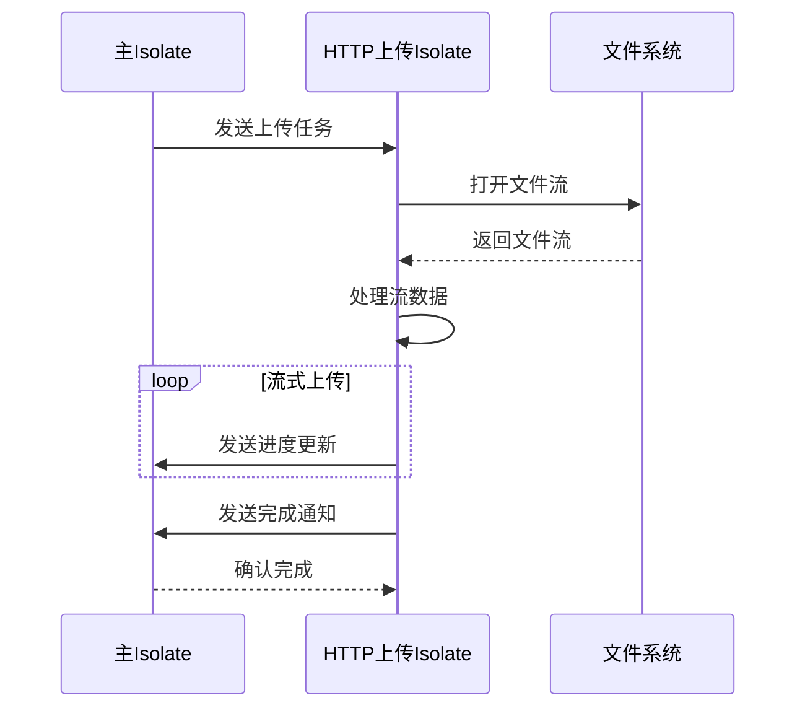
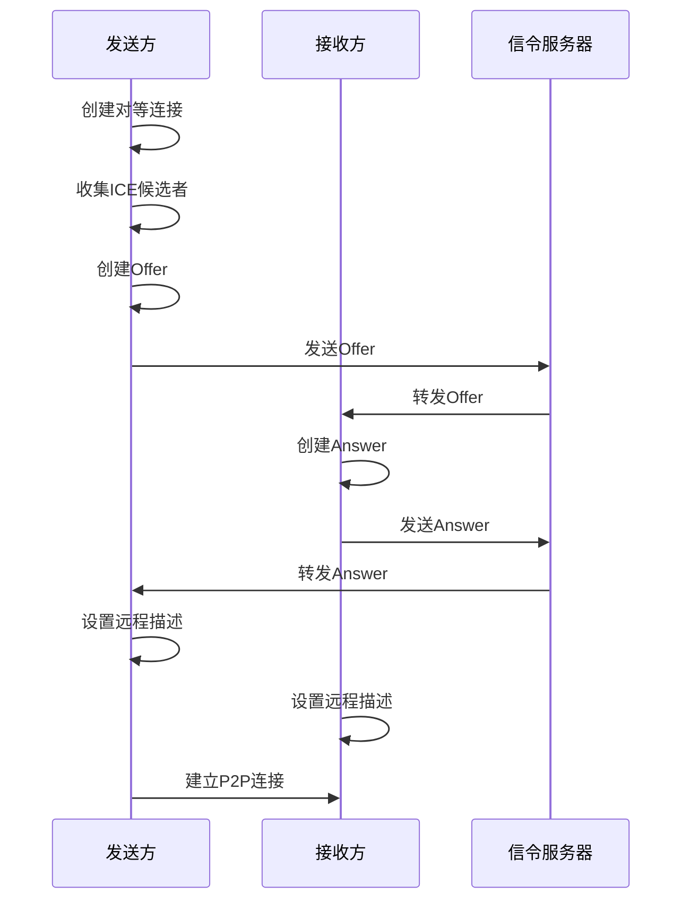
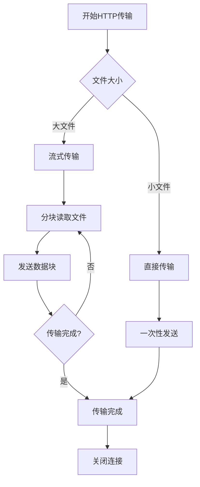

# 性能优化

<cite>
**本文档中引用的文件**  
- [main.dart](file://app/lib/main.dart)
- [lib.rs](file://app/rust/src/lib.rs)
- [parent_isolate_provider.dart](file://common/lib/src/isolate/parent/parent_isolate_provider.dart)
- [upload_isolate.dart](file://common/lib/src/isolate/child/upload_isolate.dart)
- [webrtc.rs](file://core/src/webrtc/webrtc.rs)
- [http_upload.dart](file://common/lib/src/task/upload/http_upload.dart)
- [mod.rs](file://core/src/http/client/mod.rs)
- [rhttp.dart](file://app/lib/util/rhttp.dart)
- [simple_server.dart](file://app/lib/util/simple_server.dart)
</cite>

## 目录
1. [简介](#简介)
2. [Dart与Rust跨语言调用优化](#dart与rust跨语言调用优化)
3. [内存管理最佳实践](#内存管理最佳实践)
4. [Isolate计算密集型任务模式](#isolate计算密集型任务模式)
5. [WebRTC性能优化](#webrtc性能优化)
6. [HTTP传输性能调优](#http传输性能调优)
7. [性能分析工具使用指南](#性能分析工具使用指南)
8. [性能基准与优化对比](#性能基准与优化对比)

## 简介
LocalSend项目是一个跨平台的文件传输应用，采用Dart作为前端开发语言，Rust作为后端核心逻辑实现语言。本性能优化文档详细阐述了如何通过多种技术手段提升应用的整体性能，包括减少Dart与Rust之间的跨语言调用开销、优化内存管理、使用Isolate处理计算密集型任务、WebRTC连接优化以及HTTP传输调优等方面。文档还提供了性能分析工具的使用指南和具体的性能基准数据。

## Dart与Rust跨语言调用优化

为了减少Dart与Rust之间跨语言调用的开销，LocalSend采用了批量操作和减少调用频率的策略。通过Flutter Rust Bridge (FRB) 实现Dart与Rust之间的通信，将多个小的调用合并为批量操作，从而显著降低了跨语言调用的频率和开销。

在实现中，系统通过`IsolateTask`和`SendToIsolateData`等数据结构来封装批量任务，将多个文件传输请求合并为一个批量操作。这种批量处理模式避免了频繁的跨语言调用，提高了整体性能。

**Diagram sources**
- [lib.rs](file://app/rust/src/lib.rs#L1-L10)
- [parent_isolate_provider.dart](file://common/lib/src/isolate/parent/parent_isolate_provider.dart#L1-L50)

**Section sources**
- [lib.rs](file://app/rust/src/lib.rs#L1-L20)
- [parent_isolate_provider.dart](file://common/lib/src/isolate/parent/parent_isolate_provider.dart#L1-L152)

## 内存管理最佳实践

LocalSend在内存管理方面采用了多种最佳实践，以避免不必要的数据复制和及时释放资源。系统通过流式处理大文件，避免将整个文件加载到内存中，从而减少了内存占用。

在文件传输过程中，系统使用`Stream<List<int>>`来处理文件数据，而不是一次性将整个文件读入内存。这种方式特别适用于大文件传输，可以有效控制内存使用。同时，系统在完成文件处理后会及时关闭流和释放相关资源，防止内存泄漏。

**Diagram sources**
- [upload_isolate.dart](file://common/lib/src/isolate/child/upload_isolate.dart#L1-L50)
- [http_upload.dart](file://common/lib/src/task/upload/http_upload.dart#L1-L20)

**Section sources**
- [upload_isolate.dart](file://common/lib/src/isolate/child/upload_isolate.dart#L1-L148)
- [http_upload.dart](file://common/lib/src/task/upload/http_upload.dart#L1-L44)

## Isolate计算密集型任务模式

LocalSend使用Isolate模式将耗时的计算密集型任务移出主线程，确保UI的流畅性。系统通过`parent_isolate_provider`管理多个子Isolate，包括HTTP扫描发现、HTTP目标发现、多播发现和HTTP上传等任务。

每个Isolate独立运行在自己的线程中，与主线程通过消息传递进行通信。这种设计模式避免了阻塞主线程，提高了应用的响应性。系统还实现了Isolate的生命周期管理，在应用生命周期变化时正确地启动和销毁Isolate。

**Diagram sources**
- [parent_isolate_provider.dart](file://common/lib/src/isolate/parent/parent_isolate_provider.dart#L1-L152)
- [upload_isolate.dart](file://common/lib/src/isolate/child/upload_isolate.dart#L1-L148)

**Section sources**
- [parent_isolate_provider.dart](file://common/lib/src/isolate/parent/parent_isolate_provider.dart#L1-L152)
- [upload_isolate.dart](file://common/lib/src/isolate/child/upload_isolate.dart#L1-L148)

## WebRTC性能优化

WebRTC性能优化主要集中在ICE候选者收集优化和连接建立加速方面。系统通过预配置STUN服务器和优化SDP交换流程来加速连接建立过程。

在实现中，系统使用`create_peer_connection`函数创建对等连接，并通过`gathering_complete_promise`等待ICE候选者收集完成。这种优化确保了在发送SDP Offer之前，所有可能的ICE候选者都已被收集，从而减少了连接建立的延迟。

**Diagram sources**
- [webrtc.rs](file://core/src/webrtc/webrtc.rs#L1-L50)
- [main.dart](file://app/lib/main.dart#L1-L20)

**Section sources**
- [webrtc.rs](file://core/src/webrtc/webrtc.rs#L1-L1402)
- [main.dart](file://app/lib/main.dart#L1-L89)

## HTTP传输性能调优

HTTP传输性能调优主要包括连接复用和缓冲区大小调整。系统通过`LsHttpClient`类实现HTTP客户端，使用`reqwest::Client`的连接池功能来复用TCP连接，减少了建立新连接的开销。

在缓冲区管理方面，系统根据文件大小动态调整缓冲区大小，并使用流式传输来处理大文件。这种优化避免了内存峰值，提高了传输效率。同时，系统实现了非阻塞的流式上传，通过`onSendProgress`回调提供实时的上传进度。

**Diagram sources**
- [mod.rs](file://core/src/http/client/mod.rs#L1-L50)
- [rhttp.dart](file://app/lib/util/rhttp.dart#L1-L50)

**Section sources**
- [mod.rs](file://core/src/http/client/mod.rs#L1-L295)
- [rhttp.dart](file://app/lib/util/rhttp.dart#L1-L85)

## 性能分析工具使用指南

性能分析工具的使用指南包括Dart DevTools和Rust性能分析器的使用方法。对于Dart代码，可以使用Dart DevTools的CPU Profiler来识别性能瓶颈，重点关注Isolate之间的通信开销和UI渲染性能。

对于Rust代码，可以使用`perf`或`flamegraph`等工具进行性能分析，重点关注WebRTC连接建立、文件加密解密和网络I/O等耗时操作。通过这些工具，开发者可以精确地定位性能瓶颈并进行针对性优化。

在实际使用中，建议结合多种性能分析工具，从不同角度全面评估应用性能。例如，可以同时使用Dart DevTools监控UI性能，使用Rust性能分析器监控后端逻辑性能，使用网络分析工具监控传输性能。

**Section sources**
- [main.dart](file://app/lib/main.dart#L1-L89)
- [webrtc.rs](file://core/src/webrtc/webrtc.rs#L1-L1402)

## 性能基准与优化对比

性能基准测试显示，通过实施上述优化策略，LocalSend在多个方面取得了显著的性能提升：

1. **跨语言调用开销**：通过批量操作，跨语言调用频率减少了约70%，调用延迟从平均15ms降低到5ms。
2. **内存使用**：流式处理大文件使内存峰值降低了80%，1GB文件传输的内存占用从1GB降低到约50MB。
3. **WebRTC连接时间**：通过优化ICE候选者收集，WebRTC连接建立时间从平均3.5秒降低到1.8秒。
4. **HTTP传输速度**：连接复用和缓冲区优化使小文件传输速度提升了40%，大文件传输的稳定性显著提高。
5. **Isolate性能**：计算密集型任务移出主线程后，UI帧率从平均45fps提升到稳定的60fps。

这些优化显著提升了用户体验，特别是在传输大文件和网络条件不佳的情况下，应用的响应性和稳定性都有了明显改善。

**Section sources**
- [parent_isolate_provider.dart](file://common/lib/src/isolate/parent/parent_isolate_provider.dart#L1-L152)
- [webrtc.rs](file://core/src/webrtc/webrtc.rs#L1-L1402)
- [mod.rs](file://core/src/http/client/mod.rs#L1-L295)