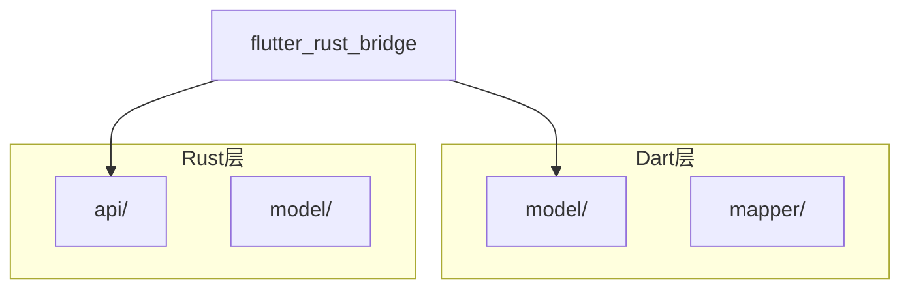
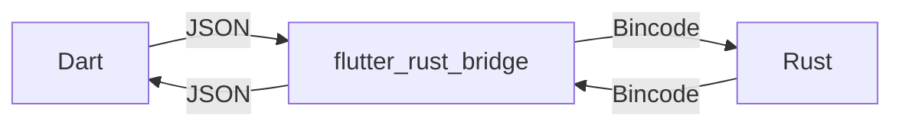
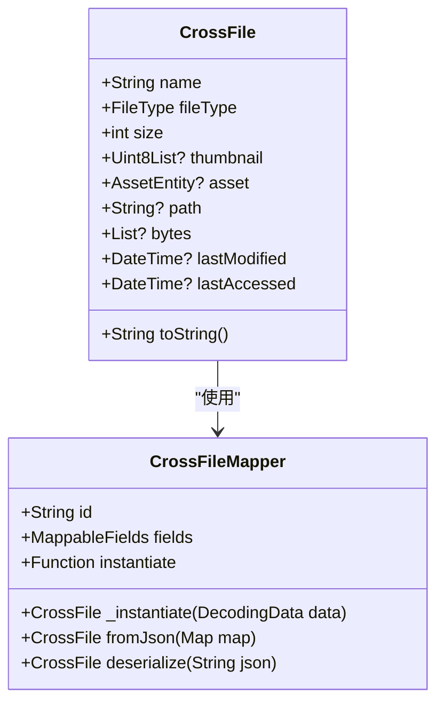
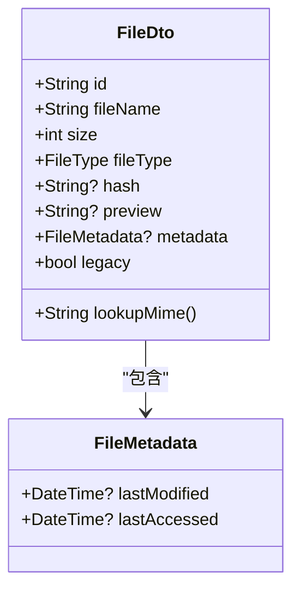
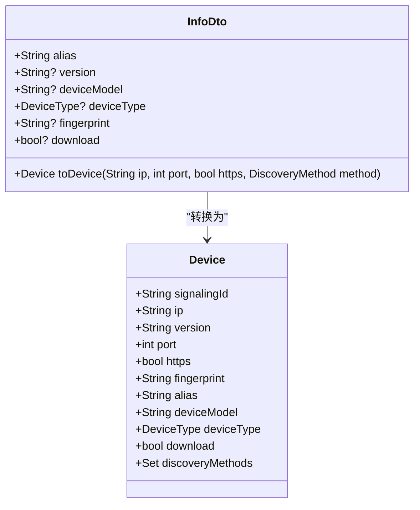
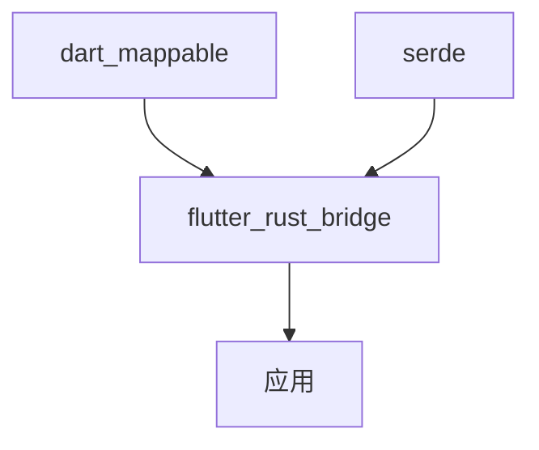

# 数据序列化

<cite>
**本文档中引用的文件**  
- [cross_file.dart](file://app/lib/model/cross_file.dart)
- [cross_file.mapper.dart](file://app/lib/model/cross_file.mapper.dart)
- [file_dto.dart](file://common/lib/model/dto/file_dto.dart)
- [info_dto.dart](file://common/lib/model/dto/info_dto.dart)
- [api/model.rs](file://app/rust/src/api/model.rs)
- [build.yaml](file://common/build.yaml)
- [Cargo.toml](file://app/rust/Cargo.toml)
</cite>

## 目录
1. [介绍](#介绍)
2. [项目结构](#项目结构)
3. [核心组件](#核心组件)
4. [架构概述](#架构概述)
5. [详细组件分析](#详细组件分析)
6. [依赖分析](#依赖分析)
7. [性能考虑](#性能考虑)
8. [故障排除指南](#故障排除指南)
9. [结论](#结论)

## 介绍
本文档详细说明了在Dart和Rust之间传递数据时的序列化和反序列化机制。重点介绍使用Serde进行Rust结构体序列化和Dart的Freezed/JsonMapper进行反序列化的流程。解释DTO（数据传输对象）的设计原则，包括file_dto、info_dto等对象的字段定义和用途。阐述类型安全的实现方式，如何确保跨语言数据传递的类型一致性。提供自定义序列化逻辑的实现方法，如处理特殊数据类型或优化序列化性能。包含版本兼容性考虑，当DTO结构发生变化时的迁移策略。提供调试序列化问题的工具和技巧，如查看生成的序列化代码和验证数据完整性。

## 项目结构
本项目采用分层架构设计，将数据序列化相关的组件分布在不同的模块中。Dart端的序列化逻辑主要位于`app/lib/model`目录下，而Rust端的序列化定义则在`app/rust/src/api`目录中。通过`flutter_rust_bridge`实现跨语言通信，确保数据在Dart和Rust之间高效、安全地传递。

**图表来源**  
- [cross_file.dart](file://app/lib/model/cross_file.dart)
- [api/model.rs](file://app/rust/src/api/model.rs)

**章节来源**  
- [cross_file.dart](file://app/lib/model/cross_file.dart)
- [api/model.rs](file://app/rust/src/api/model.rs)

## 核心组件
核心序列化组件包括Dart端的`CrossFile`模型和Rust端的`FileDto`结构体。这些组件通过`dart_mappable`和`serde`库实现高效的序列化和反序列化。`CrossFile`用于在文件选择阶段表示文件信息，而`FileDto`则用于在服务器和客户端之间传输文件元数据。

**章节来源**  
- [cross_file.dart](file://app/lib/model/cross_file.dart)
- [file_dto.dart](file://common/lib/model/dto/file_dto.dart)

## 架构概述
系统采用跨语言序列化架构，通过`flutter_rust_bridge`在Dart和Rust之间建立通信桥梁。Dart端使用`dart_mappable`库生成序列化代码，Rust端使用`serde`库进行数据序列化。这种设计确保了类型安全和高效的跨语言数据交换。

**图表来源**  
- [Cargo.toml](file://app/rust/Cargo.toml)
- [build.yaml](file://common/build.yaml)

## 详细组件分析
### CrossFile 分析
`CrossFile`是Dart端的核心文件模型，用于在文件选择阶段避免引入第三方库。该模型通过`@MappableClass()`注解标记，由`dart_mappable`库生成序列化代码。模型包含文件名、类型、大小、缩略图等属性，并提供了自定义的`toString()`方法以避免打印大量字节数据。

**图表来源**  
- [cross_file.dart](file://app/lib/model/cross_file.dart)
- [cross_file.mapper.dart](file://app/lib/model/cross_file.mapper.dart)

### FileDto 分析
`FileDto`是Rust端的文件数据传输对象，用于在服务器和客户端之间传输文件信息。该结构体通过`#[frb(mirror(FileDto))]`注解与Dart端的对应模型同步。`FileDto`包含文件ID、文件名、大小、类型、哈希值等字段，并提供了`lookupMime()`方法用于确定MIME类型。

**图表来源**  
- [file_dto.dart](file://common/lib/model/dto/file_dto.dart)
- [api/model.rs](file://app/rust/src/api/model.rs)

### InfoDto 分析
`InfoDto`用于传输设备信息，包含别名、版本、设备型号、设备类型等字段。该DTO通过`@MappableClass()`注解标记，支持JSON序列化和反序列化。`InfoDto`还提供了`toDevice()`扩展方法，用于将DTO转换为`Device`对象。

**图表来源**  
- [info_dto.dart](file://common/lib/model/dto/info_dto.dart)

**章节来源**  
- [cross_file.dart](file://app/lib/model/cross_file.dart)
- [cross_file.mapper.dart](file://app/lib/model/cross_file.mapper.dart)
- [file_dto.dart](file://common/lib/model/dto/file_dto.dart)
- [info_dto.dart](file://common/lib/model/dto/info_dto.dart)
- [api/model.rs](file://app/rust/src/api/model.rs)

## 依赖分析
项目依赖`flutter_rust_bridge`作为Dart和Rust之间的通信桥梁，该库自动生成序列化代码并处理跨语言调用。Dart端依赖`dart_mappable`库生成高效的序列化代码，Rust端依赖`serde`库进行数据序列化。这些依赖确保了类型安全和高效的跨语言数据交换。

**图表来源**  
- [Cargo.toml](file://app/rust/Cargo.toml)
- [build.yaml](file://common/build.yaml)

**章节来源**  
- [Cargo.toml](file://app/rust/Cargo.toml)
- [build.yaml](file://common/build.yaml)

## 性能考虑
序列化性能通过以下方式优化：使用`dart_mappable`和`serde`生成高效的序列化代码，避免运行时反射；在Rust端使用`bincode`进行二进制序列化以提高性能；在Dart端使用`Uint8List`表示二进制数据以减少内存占用。这些优化确保了在移动设备上的高效数据传输。

## 故障排除指南
调试序列化问题时，可以查看生成的序列化代码（如`cross_file.mapper.dart`），验证数据完整性，并使用日志记录序列化过程。当DTO结构发生变化时，应确保Dart和Rust端的模型同步更新，并考虑版本兼容性。

**章节来源**  
- [cross_file.mapper.dart](file://app/lib/model/cross_file.mapper.dart)
- [api/model.rs](file://app/rust/src/api/model.rs)

## 结论
本项目通过`flutter_rust_bridge`实现了Dart和Rust之间的高效、类型安全的数据序列化。使用`dart_mappable`和`serde`库生成高效的序列化代码，确保了跨语言数据交换的性能和可靠性。DTO设计遵循单一职责原则，每个DTO只负责特定的数据传输任务，提高了代码的可维护性和可测试性。