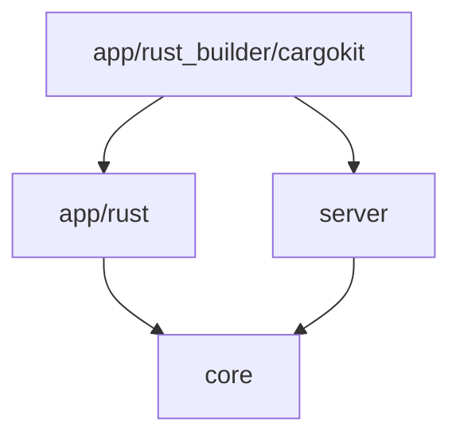
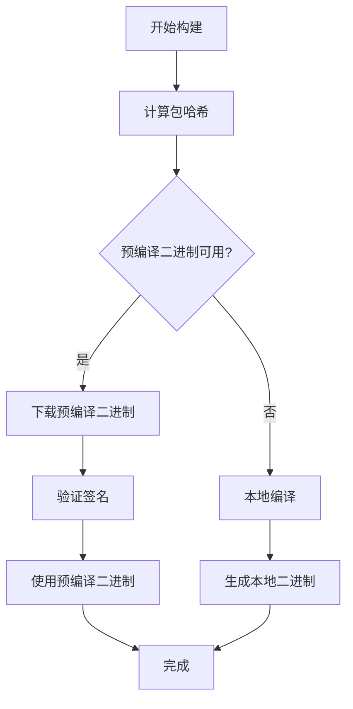
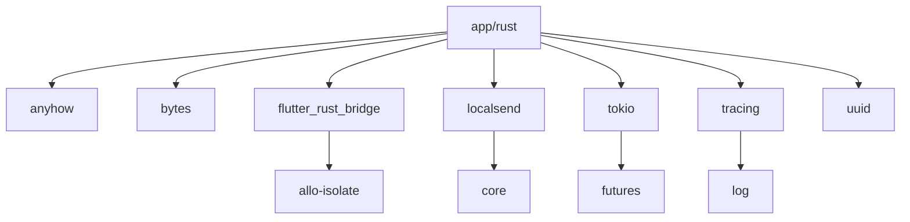

# 依赖管理

<cite>
**本文档中引用的文件**  
- [Cargo.toml](file://app/rust/Cargo.toml)
- [Cargo.lock](file://app/rust/Cargo.lock)
- [artifacts_provider.dart](file://app/rust_builder/cargokit/build_tool/lib/src/artifacts_provider.dart)
- [crate_hash.dart](file://app/rust_builder/cargokit/build_tool/lib/src/crate_hash.dart)
- [build_pod.sh](file://app/rust_builder/cargokit/build_pod.sh)
- [run_build_tool.sh](file://app/rust_builder/cargokit/run_build_tool.sh)
- [run_build_tool.cmd](file://app/rust_builder/cargokit/run_build_tool.cmd)
- [core/Cargo.toml](file://core/Cargo.toml)
- [server/Cargo.toml](file://server/Cargo.toml)
</cite>

## 目录
1. [项目结构](#项目结构)
2. [Cargo.toml文件结构](#cargotoml文件结构)
3. [依赖声明方式](#依赖声明方式)
4. [依赖管理工具](#依赖管理工具)
5. [依赖下载与验证](#依赖下载与验证)
6. [依赖缓存机制](#依赖缓存机制)
7. [最佳实践指南](#最佳实践指南)
8. [依赖冲突解决](#依赖冲突解决)
9. [安全审计方法](#安全审计方法)
10. [依赖树分析](#依赖树分析)

## 项目结构

本项目采用多模块Rust代码库结构，包含多个独立的Rust组件，通过Cargo进行依赖管理。主要结构包括：

- **app/rust**: 应用层Rust代码，包含Flutter桥接
- **core**: 核心功能库，被其他模块依赖
- **server**: 服务器端实现
- **app/rust_builder/cargokit**: 构建工具和依赖管理组件



**Diagram sources**
- [app/rust/Cargo.toml](file://app/rust/Cargo.toml)
- [core/Cargo.toml](file://core/Cargo.toml)
- [server/Cargo.toml](file://server/Cargo.toml)

**Section sources**
- [app/rust/Cargo.toml](file://app/rust/Cargo.toml)
- [core/Cargo.toml](file://core/Cargo.toml)
- [server/Cargo.toml](file://server/Cargo.toml)

## Cargo.toml文件结构

Cargo.toml是Rust项目的依赖管理配置文件，采用TOML格式。文件主要包含以下几个部分：

### 包信息
```toml
[package]
name = "rust_lib_localsend_app"
version = "0.1.0"
edition = "2021"
```

### 库配置
```toml
[lib]
crate-type = ["cdylib", "staticlib"]
```

### 依赖声明
```toml
[dependencies]
anyhow = "1.0.95"
bytes = "1.9.0"
flutter_rust_bridge = { version = "=2.11.1", features = ["uuid"] }
localsend = { path = "../../core", features = ["full"] }
tokio = { version = "1.43.0", features = ["full"] }
```

### 特性(features)配置
```toml
[features]
default = []
crypto = ["ed25519-dalek", "rsa", "sha2"]
http = ["crypto", "http-body-util", "hyper", "hyper-util", "pem", "reqwest", "rustls", "tokio-rustls", "x509-parser"]
full = ["crypto", "http", "webrtc"]
```

**Section sources**
- [app/rust/Cargo.toml](file://app/rust/Cargo.toml)
- [core/Cargo.toml](file://core/Cargo.toml)
- [server/Cargo.toml](file://server/Cargo.toml)

## 依赖声明方式

Rust项目支持多种依赖声明方式，包括本地依赖、远程Git仓库依赖和crates.io依赖。

### 本地依赖
通过`path`字段指定本地文件系统路径：
```toml
localsend = { path = "../../core", features = ["full"] }
```

### crates.io依赖
直接指定版本号或版本范围：
```toml
anyhow = "1.0.95"
tokio = { version = "1.43.0", features = ["full"] }
```

### 版本锁定
使用等号实现精确版本锁定：
```toml
flutter_rust_bridge = { version = "=2.11.1", features = ["uuid"] }
```

### 特性(features)启用
通过features字段启用特定功能模块：
```toml
tokio = { version = "1.43.0", features = ["full"] }
uuid = { version = "1.11.1", features = ["v4"] }
```

**Section sources**
- [app/rust/Cargo.toml](file://app/rust/Cargo.toml)
- [core/Cargo.toml](file://core/Cargo.toml)

## 依赖管理工具

项目使用cargokit作为构建和依赖管理工具，包含多个组件协同工作。

### 构建工具链
- **artifacts_provider.dart**: 负责预编译二进制文件的下载和验证
- **crate_hash.dart**: 计算包内容哈希值
- **build_pod.sh**: iOS平台构建脚本
- **run_build_tool.sh**: 跨平台构建工具运行器

### 构建流程


**Diagram sources**
- [artifacts_provider.dart](file://app/rust_builder/cargokit/build_tool/lib/src/artifacts_provider.dart)
- [build_pod.sh](file://app/rust_builder/cargokit/build_pod.sh)
- [run_build_tool.sh](file://app/rust_builder/cargokit/run_build_tool.sh)

**Section sources**
- [artifacts_provider.dart](file://app/rust_builder/cargokit/build_tool/lib/src/artifacts_provider.dart)
- [build_pod.sh](file://app/rust_builder/cargokit/build_pod.sh)
- [run_build_tool.sh](file://app/rust_builder/cargokit/run_build_tool.sh)

## 依赖下载与验证

依赖管理工具实现了安全的依赖下载和验证机制。

### 下载流程
1. 计算包内容哈希值
2. 构建下载URL
3. 下载签名文件
4. 验证签名
5. 下载二进制文件

### 签名验证
使用公钥加密技术验证二进制文件完整性：
```dart
if (verify(
    precompiledBinaries.publicKey, 
    res.bodyBytes, 
    signature.bodyBytes)) {
  File(finalPath).writeAsBytesSync(res.bodyBytes);
} else {
  _log.shout('Signature verification failed! Ignoring binary.');
}
```

### 错误处理
实现重试机制处理网络问题：
```dart
if (attempt++ < maxAttempts &&
    (e.osError?.errorCode == 54 || e.osError?.errorCode == 10054)) {
  _log.severe(
      'Failed to download $url: $e, attempt $attempt of $maxAttempts, will retry...');
  await Future.delayed(Duration(seconds: 1));
  continue;
}
```

**Section sources**
- [artifacts_provider.dart](file://app/rust_builder/cargokit/build_tool/lib/src/artifacts_provider.dart)

## 依赖缓存机制

项目实现了多层缓存机制以提高构建效率。

### 哈希计算
CrateHash类计算包内容的唯一标识：
```dart
class CrateHash {
  static String compute(String manifestDir, {String? tempStorage}) {
    return CrateHash._(
      manifestDir: manifestDir,
      tempStorage: tempStorage,
    )._compute();
  }
}
```

### 快速哈希
首先计算基于文件元数据的快速哈希：
```dart
String _computeQuickHash(List<File> files) {
  final output = AccumulatorSink<Digest>();
  final input = sha256.startChunkedConversion(output);
  
  final data = ByteData(8);
  for (final file in files) {
    input.add(utf8.encode(file.path));
    final stat = file.statSync();
    data.setUint64(0, stat.size);
    input.add(data.buffer.asUint8List());
    data.setUint64(0, stat.modified.millisecondsSinceEpoch);
    input.add(data.buffer.asUint8List());
  }
  
  input.close();
  return base64Url.encode(output.events.single.bytes);
}
```

### 内容哈希
对文件内容进行精确哈希计算：
```dart
String _computeHash(List<File> files) {
  final output = AccumulatorSink<Digest>();
  final input = sha256.startChunkedConversion(output);
  
  void addTextFile(File file) {
    final splitter = LineSplitter();
    if (file.existsSync()) {
      final data = file.readAsStringSync();
      final lines = splitter.convert(data);
      for (final line in lines) {
        input.add(utf8.encode(line));
      }
    }
  }
  
  for (final file in files) {
    addTextFile(file);
  }
  
  input.close();
  final res = output.events.single;
  final hash = res.bytes.sublist(0, 16);
  return hex.encode(hash);
}
```

### 缓存存储
哈希值存储在临时目录中供后续使用：
```dart
final quickHashFolder = Directory(path.join(tempStorage, 'crate_hash'));
quickHashFolder.createSync(recursive: true);
final quickHashFile = File(path.join(quickHashFolder.path, quickHash));
```

**Section sources**
- [crate_hash.dart](file://app/rust_builder/cargokit/build_tool/lib/src/crate_hash.dart)

## 最佳实践指南

### 添加依赖
1. 在Cargo.toml中添加依赖声明
2. 指定适当的版本范围
3. 启用必要的特性(features)
4. 运行`cargo build`验证

### 更新依赖
1. 修改Cargo.toml中的版本号
2. 或使用`cargo update`命令
3. 检查依赖树变化
4. 运行测试确保兼容性

### 删除依赖
1. 从Cargo.toml中移除依赖声明
2. 清理相关代码引用
3. 运行`cargo build`验证
4. 提交更改

### 构建配置
在cargokit.yaml中配置构建选项：
```yaml
cargo:
  toolchain: stable
  extra_flags: []
precompiled_binaries:
  uri_prefix: "https://example.com/binaries/"
  public_key: "base64_encoded_public_key"
```

**Section sources**
- [Cargo.toml](file://app/rust/Cargo.toml)
- [cargokit.yaml](file://app/rust_builder/cargokit/cargokit.yaml)

## 依赖冲突解决

### 版本冲突
当不同依赖要求同一包的不同版本时，Cargo会尝试找到兼容版本。

### 冲突检测
使用`cargo tree`命令分析依赖树：
```bash
cargo tree -p package_name
```

### 解决策略
1. **版本统一**: 协调依赖版本要求
2. **特性禁用**: 禁用不必要的特性以减少依赖
3. **依赖替换**: 使用`[replace]`或`[patch]`段落
4. **本地构建**: 对于关键依赖，考虑本地构建和缓存

### 特性冲突
通过特性(features)配置避免不必要的依赖引入：
```toml
[features]
default = []
minimal = []
full = ["crypto", "http", "webrtc"]
```

**Section sources**
- [Cargo.toml](file://app/rust/Cargo.toml)
- [Cargo.lock](file://app/rust/Cargo.lock)

## 安全审计方法

### 依赖审查
1. 定期审查Cargo.toml中的依赖
2. 检查依赖的维护状态
3. 评估依赖的安全记录

### 漏洞扫描
使用工具扫描已知漏洞：
```bash
cargo audit
```

### 供应链安全
1. 验证预编译二进制的签名
2. 使用可信的依赖源
3. 监控依赖更新

### 最小权限原则
只启用必要的特性(features)：
```toml
reqwest = { version = "0.12.23", features = ["charset", "http2", "system-proxy", "json", "rustls-tls-webpki-roots-no-provider", "stream"], default-features = false, optional = true }
```

**Section sources**
- [artifacts_provider.dart](file://app/rust_builder/cargokit/build_tool/lib/src/artifacts_provider.dart)
- [Cargo.toml](file://app/rust/Cargo.toml)

## 依赖树分析

### 分析工具
使用`cargo tree`命令可视化依赖关系：
```bash
cargo tree --depth 3
```

### 优化策略
1. **减少传递依赖**: 选择轻量级依赖
2. **共享依赖**: 统一依赖版本
3. **按需加载**: 使用可选特性(features)

### 依赖树示例


**Diagram sources**
- [Cargo.toml](file://app/rust/Cargo.toml)
- [Cargo.lock](file://app/rust/Cargo.lock)

**Section sources**
- [Cargo.toml](file://app/rust/Cargo.toml)
- [Cargo.lock](file://app/rust/Cargo.lock)