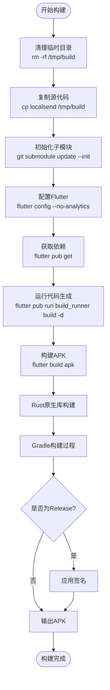

# Android构建

<cite>
**本文档中引用的文件**
- [compile_android_apk.sh](file://scripts/compile_android_apk.sh)
- [app/build.gradle](file://app/android/app/build.gradle)
- [build.gradle](file://app/android/build.gradle)
- [settings.gradle](file://app/android/settings.gradle)
- [gradle.properties](file://app/android/gradle.properties)
- [rust_builder/android/build.gradle](file://app/rust_builder/android/build.gradle)
- [rust_builder/cargokit/gradle/plugin.gradle](file://app/rust_builder/cargokit/gradle/plugin.gradle)
- [pubspec.yaml](file://app/pubspec.yaml)
- [rust_builder/pubspec.yaml](file://app/rust_builder/pubspec.yaml)
- [rust/Cargo.toml](file://app/rust/Cargo.toml)
</cite>

## 目录
1. [简介](#简介)
2. [项目结构概览](#项目结构概览)
3. [核心构建组件](#核心构建组件)
4. [架构概览](#架构概览)
5. [详细组件分析](#详细组件分析)
6. [构建环境配置](#构建环境配置)
7. [构建流程详解](#构建流程详解)
8. [性能优化与最佳实践](#性能优化与最佳实践)
9. [故障排除指南](#故障排除指南)
10. [总结](#总结)

## 简介

LocalSend是一个开源的跨平台文件传输应用，支持在不同设备间快速传输文件。本文档详细介绍了其Android平台的构建系统，包括Gradle配置、Rust交叉编译、APK打包等关键步骤，为开发者提供完整的Android构建指南。

## 项目结构概览

LocalSend的Android构建系统采用模块化设计，主要包含以下关键目录：


**图表来源**
- [compile_android_apk.sh](file://scripts/compile_android_apk.sh#L1-L32)
- [app/build.gradle](file://app/android/app/build.gradle#L1-L103)
- [rust_builder/android/build.gradle](file://app/rust_builder/android/build.gradle#L1-L57)

**章节来源**
- [compile_android_apk.sh](file://scripts/compile_android_apk.sh#L1-L32)
- [app/android/app/build.gradle](file://app/android/app/build.gradle#L1-L103)

## 核心构建组件

### 主要构建文件

LocalSend的Android构建系统由以下核心组件构成：

1. **主构建脚本**：`scripts/compile_android_apk.sh`
2. **Flutter应用配置**：`app/android/app/build.gradle`
3. **项目级配置**：`app/android/build.gradle`
4. **Rust模块集成**：`app/rust_builder/android/build.gradle`
5. **Cargokit插件**：`app/rust_builder/cargokit/gradle/plugin.gradle`

### 构建变体管理

系统支持多种构建变体：
- **Debug模式**：用于开发和测试，包含调试信息
- **Release模式**：用于生产发布，经过优化和签名
- **多架构支持**：支持ARM、ARM64、x86、x86_64架构

**章节来源**
- [app/android/app/build.gradle](file://app/android/app/build.gradle#L60-L85)
- [rust_builder/android/build.gradle](file://app/rust_builder/android/build.gradle#L47-L57)

## 架构概览

### 整体构建架构


**图表来源**
- [compile_android_apk.sh](file://scripts/compile_android_apk.sh#L15-L30)
- [app/android/app/build.gradle](file://app/android/app/build.gradle#L85-L103)

### Rust模块集成架构


**图表来源**
- [rust_builder/cargokit/gradle/plugin.gradle](file://app/rust_builder/cargokit/gradle/plugin.gradle#L15-L50)
- [rust_builder/android/build.gradle](file://app/rust_builder/android/build.gradle#L40-L57)

## 详细组件分析

### 主构建脚本分析

#### compile_android_apk.sh

该脚本实现了可重现构建（Reproducible Builds），确保每次构建的结果完全一致。

**关键特性：**
- 支持F-Droid可重现构建标准
- 自动处理Flutter子模块更新
- 提供完整的构建环境检查

**执行流程：**
1. 清理临时构建目录
2. 复制源代码到临时目录
3. 初始化Git子模块
4. 配置Flutter环境
5. 执行构建命令

**章节来源**
- [compile_android_apk.sh](file://scripts/compile_android_apk.sh#L1-L32)

### Flutter应用构建配置

#### app/build.gradle

这是Android应用的主要构建配置文件，定义了应用的核心属性和构建规则。

**编译配置：**
- **编译SDK版本**：34
- **目标SDK版本**：34  
- **最小SDK版本**：由Flutter配置决定
- **Java版本**：17

**签名配置：**
- 支持release版本签名
- 使用key.properties文件存储密钥信息
- debug版本自动添加`.debug`后缀

**ABI版本码管理：**
- x86_64: ABI代码1
- armeabi-v7a: ABI代码2  
- arm64-v8a: ABI代码3

**章节来源**
- [app/android/app/build.gradle](file://app/android/app/build.gradle#L26-L85)

### 项目级构建配置

#### build.gradle

项目级配置文件，定义了全局构建设置和仓库配置。

**关键设置：**
- 全局仓库：Google Maven和Maven Central
- 构建目录：`../build`
- 临时修复：解决device_apps兼容性问题
- 清理任务：统一的构建目录清理

**章节来源**
- [app/android/build.gradle](file://app/android/build.gradle#L1-L35)

### Rust模块构建配置

#### rust_builder/android/build.gradle

专门用于Rust模块的Android构建配置。

**编译设置：**
- **编译SDK版本**：33
- **NDK版本**：继承自Flutter配置
- **最小SDK版本**：19

**Cargokit集成：**
- 指定Rust源码路径
- 设置库名称
- 自动处理原生库构建

**章节来源**
- [rust_builder/android/build.gradle](file://app/rust_builder/android/build.gradle#L1-L57)

### Cargokit插件系统

#### gradle/plugin.gradle

Cargokit是Flutter Rust Bridge提供的官方解决方案，用于在Android上构建Rust原生库。

**核心功能：**
- 自动检测Flutter插件
- 动态创建构建任务
- 管理多架构构建
- 处理环境变量传递

**构建任务创建：**
- 根据构建类型（debug/release）创建对应任务
- 自动添加JNI库依赖
- 处理平台特定的构建需求

**章节来源**
- [rust_builder/cargokit/gradle/plugin.gradle](file://app/rust_builder/cargokit/gradle/plugin.gradle#L15-L180)

### Rust依赖管理

#### rust/Cargo.toml

Rust模块的依赖配置，包含核心功能所需的库。

**主要依赖：**
- **flutter_rust_bridge**：与Flutter的桥接
- **localsend**：核心业务逻辑
- **tokio**：异步运行时
- **uuid**：唯一标识符生成

**编译类型：**
- `cdylib`：动态链接库
- `staticlib`：静态链接库

**章节来源**
- [rust/Cargo.toml](file://app/rust/Cargo.toml#L1-L18)

## 构建环境配置

### 必需软件包

根据构建脚本要求，需要安装以下软件包：

| 组件 | 版本要求 | 安装命令 |
|------|----------|----------|
| OpenJDK | 11+ | `sudo apt install openjdk-11-jdk` |
| sdkmanager | 最新 | 包含Android SDK |
| Flutter | 3.25.0+ | 从子模块获取 |

### Android SDK配置

**必需组件：**
- platform-tools
- platforms;android-33
- 构建工具：34.0.0

**安装命令：**
```bash
sdkmanager "platform-tools" "platforms;android-33"
sdkmanager --licenses
```

### 目录权限

**重要路径：**
- `/opt/android-sdk`：Android SDK根目录
- 用户对SDK目录具有写权限

**权限设置：**
```bash
sudo chown -R <user> /opt/android-sdk
```

### 环境变量配置

构建过程中会使用以下环境变量：

| 变量名 | 描述 | 来源 |
|--------|------|------|
| CARGOKIT_SDK_DIR | Android SDK路径 | Gradle构建系统 |
| CARGOKIT_NDK_VERSION | NDK版本 | Flutter配置 |
| CARGOKIT_JAVA_HOME | Java安装路径 | 系统环境 |
| JAVA_HOME | Java环境变量 | 系统配置 |

**章节来源**
- [compile_android_apk.sh](file://scripts/compile_android_apk.sh#L8-L12)
- [rust_builder/cargokit/build_tool/lib/src/android_environment.dart](file://app/rust_builder/cargokit/build_tool/lib/src/android_environment.dart#L50-L101)

## 构建流程详解

### 完整构建流程



**图表来源**
- [compile_android_apk.sh](file://scripts/compile_android_apk.sh#L15-L30)

### Rust交叉编译流程


**图表来源**
- [rust_builder/cargokit/gradle/plugin.gradle](file://app/rust_builder/cargokit/gradle/plugin.gradle#L40-L80)
- [rust_builder/cargokit/build_tool/lib/src/builder.dart](file://app/rust_builder/cargokit/build_tool/lib/src/builder.dart#L168-L197)

### 依赖解析流程

**Flutter依赖树：**


**图表来源**
- [pubspec.yaml](file://app/pubspec.yaml#L15-L80)
- [rust/Cargo.toml](file://app/rust/Cargo.toml#L8-L17)

**章节来源**
- [compile_android_apk.sh](file://scripts/compile_android_apk.sh#L15-L30)
- [app/android/app/build.gradle](file://app/android/app/build.gradle#L85-L103)

## 性能优化与最佳实践

### 构建性能优化

**内存配置：**
- Gradle JVM堆内存：最大4GB，最小1GB
- 通过`gradle.properties`配置

**并行构建：**
- 利用多核CPU进行并行编译
- Rust编译器启用并行构建

**缓存策略：**
- Gradle构建缓存
- Rust增量编译
- Flutter依赖缓存

### 签名配置最佳实践

**Release版本签名：**
- 使用专用密钥库文件
- 安全存储密钥信息
- 避免硬编码敏感信息

**Debug版本配置：**
- 自动添加调试后缀
- 不需要签名配置

### 多架构支持

**支持的架构：**
- ARM64-v8a（主要）
- ARMv7a（兼容性）
- x86_64（模拟器）
- x86（兼容性）

**ABI版本码分配：**
- 确保每个架构有唯一的版本码
- 符合F-Droid版本规范

**章节来源**
- [app/android/gradle.properties](file://app/android/gradle.properties#L1-L4)
- [app/android/app/build.gradle](file://app/android/app/build.gradle#L87-L103)

## 故障排除指南

### 常见构建错误

**1. NDK相关错误**
- **症状**：找不到NDK或版本不匹配
- **解决方案**：检查`android.ndkVersion`配置，确保NDK已安装

**2. Java版本不兼容**
- **症状**：编译失败，提示Java版本错误
- **解决方案**：确保使用OpenJDK 11或更高版本

**3. Rust依赖问题**
- **症状**：Rust编译失败或依赖冲突
- **解决方案**：检查`rust/Cargo.toml`配置，清理Cargo缓存

**4. Flutter环境问题**
- **症状**：Flutter命令不可用
- **解决方案**：检查Flutter子模块状态，重新初始化

### 调试技巧

**启用详细日志：**
```bash
flutter build apk --verbose
```

**清理构建缓存：**
```bash
flutter clean
rm -rf ~/.gradle/caches/
```

**检查依赖状态：**
```bash
flutter pub deps
cargo tree
```

**章节来源**
- [rust_builder/cargokit/build_tool/lib/src/android_environment.dart](file://app/rust_builder/cargokit/build_tool/lib/src/android_environment.dart#L50-L101)
- [rust_builder/cargokit/gradle/plugin.gradle](file://app/rust_builder/cargokit/gradle/plugin.gradle#L151-L152)

## 总结

LocalSend的Android构建系统展现了现代移动应用开发的最佳实践：

1. **模块化设计**：清晰分离Flutter应用层和Rust原生层
2. **自动化程度高**：完整的CI/CD支持和可重现构建
3. **多平台兼容**：支持多种架构和Android版本
4. **性能优化**：充分利用并行构建和增量编译
5. **安全考虑**：完善的签名机制和密钥管理

该构建系统为开发者提供了可靠、高效的Android应用构建解决方案，同时保持了良好的可维护性和扩展性。通过遵循本文档的指导，开发者可以成功构建、部署和维护LocalSend的Android版本。