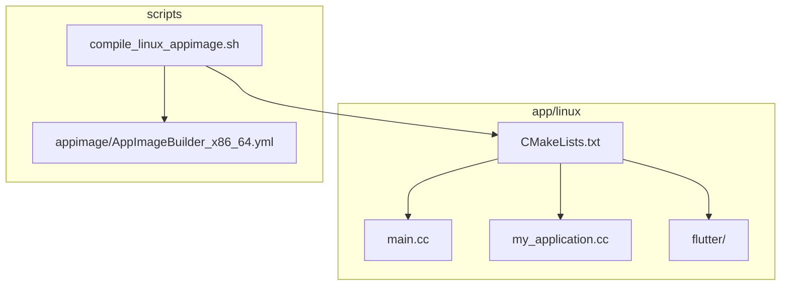
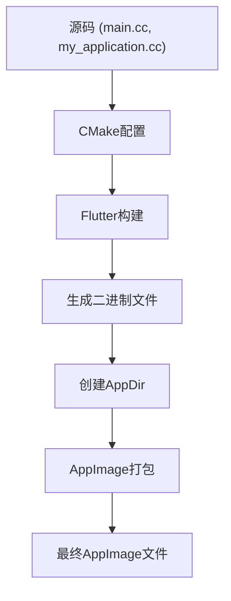
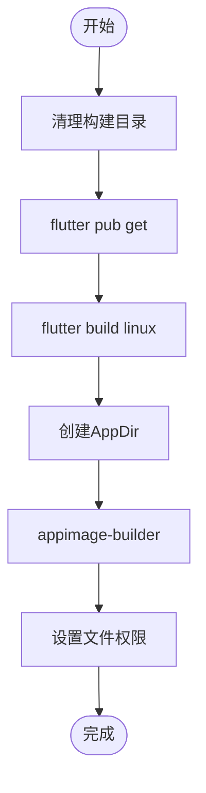
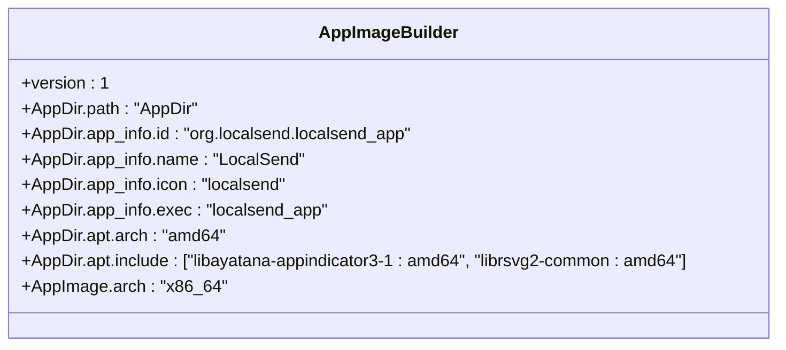
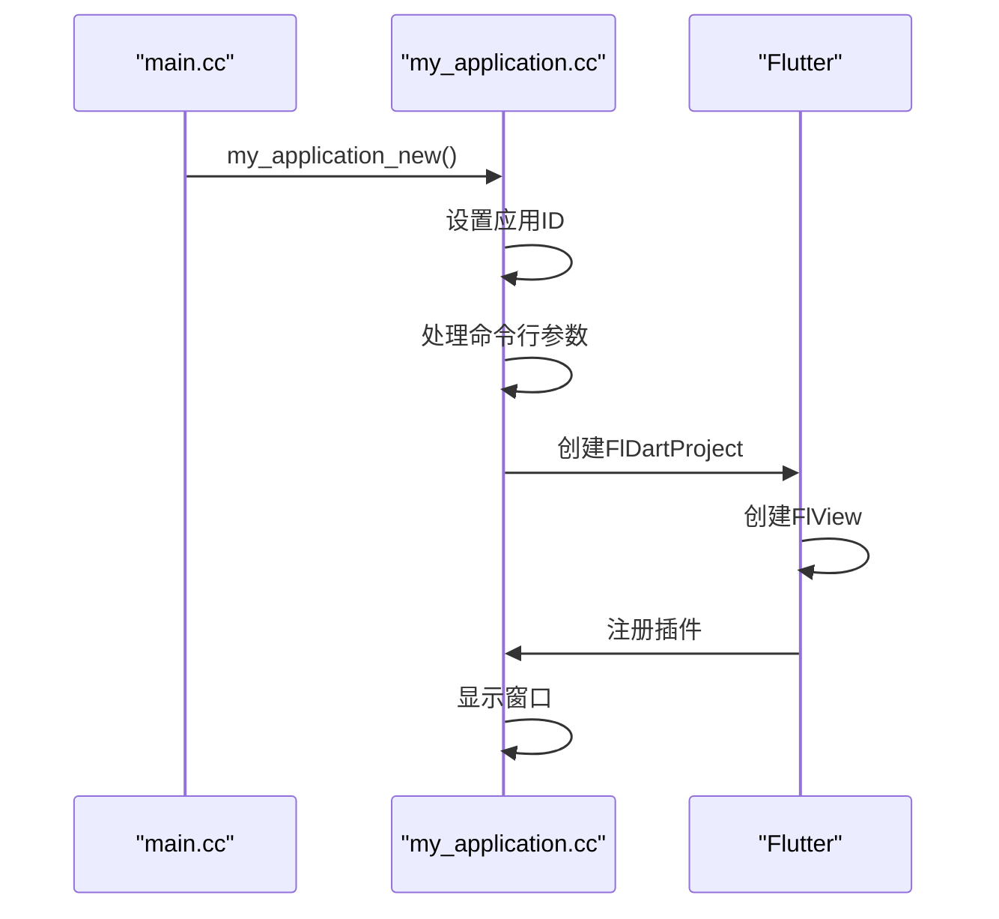
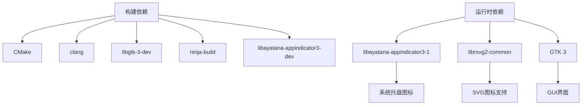

# Linux构建

<cite>
**本文档中引用的文件**  
- [compile_linux_appimage.sh](file://scripts/compile_linux_appimage.sh)
- [CMakeLists.txt](file://app/linux/CMakeLists.txt)
- [AppImageBuilder_x86_64.yml](file://scripts/appimage/AppImageBuilder_x86_64.yml)
- [AppImageBuilder_arm_64.yml](file://scripts/appimage/AppImageBuilder_arm_64.yml)
- [main.cc](file://app/linux/main.cc)
- [my_application.cc](file://app/linux/my_application.cc)
- [my_application.h](file://app/linux/my_application.h)
- [flutter/CMakeLists.txt](file://app/linux/flutter/CMakeLists.txt)
- [pubspec.yaml](file://app/pubspec.yaml)
- [README.md](file://README.md)
</cite>

## 目录
1. [简介](#简介)
2. [项目结构](#项目结构)
3. [核心组件](#核心组件)
4. [架构概述](#架构概述)
5. [详细组件分析](#详细组件分析)
6. [依赖分析](#依赖分析)
7. [性能考虑](#性能考虑)
8. [故障排除指南](#故障排除指南)
9. [结论](#结论)

## 简介
LocalSend是一个开源的跨平台文件共享应用，支持在局域网内安全地传输文件和消息，无需互联网连接。本文档详细阐述了Linux平台上的构建流程，包括CMake配置、AppImage打包等关键步骤，以及构建环境的完整设置指南。

## 项目结构
LocalSend项目的Linux构建相关文件主要位于`app/linux`和`scripts`目录下。`app/linux`目录包含CMake构建配置和主应用程序源码，而`scripts`目录包含构建脚本和AppImage打包配置。



**图示来源**
- [CMakeLists.txt](file://app/linux/CMakeLists.txt)
- [compile_linux_appimage.sh](file://scripts/compile_linux_appimage.sh)
- [AppImageBuilder_x86_64.yml](file://scripts/appimage/AppImageBuilder_x86_64.yml)

**章节来源**
- [README.md](file://README.md)

## 核心组件
Linux构建的核心组件包括CMake构建系统、Flutter集成、AppImage打包工具和桌面集成。CMakeLists.txt文件定义了应用程序的构建配置，compile_linux_appimage.sh脚本协调整个构建流程，AppImageBuilder配置文件定义了AppImage的打包细节。

**章节来源**
- [CMakeLists.txt](file://app/linux/CMakeLists.txt)
- [compile_linux_appimage.sh](file://scripts/compile_linux_appimage.sh)
- [AppImageBuilder_x86_64.yml](file://scripts/appimage/AppImageBuilder_x86_64.yml)

## 架构概述
LocalSend的Linux构建架构采用分层设计，从源码编译到最终的AppImage打包。构建流程始于Flutter的`flutter build linux`命令，生成原生二进制文件，然后通过AppImageBuilder创建可移植的AppImage包。



**图示来源**
- [compile_linux_appimage.sh](file://scripts/compile_linux_appimage.sh)
- [CMakeLists.txt](file://app/linux/CMakeLists.txt)

## 详细组件分析

### CMake构建配置分析
app/linux/CMakeLists.txt文件定义了Linux平台的构建配置，包括项目设置、编译选项和依赖管理。该文件配置了应用程序名称、GTK应用标识符，并设置了标准的编译选项。

```mermaid
classDiagram
class CMakeLists {
+cmake_minimum_required(VERSION 3.10)
+project(runner LANGUAGES CXX)
+set(BINARY_NAME "localsend_app")
+set(APPLICATION_ID "org.localsend.localsend_app")
+add_executable(${BINARY_NAME} ...)
+target_link_libraries(${BINARY_NAME} PRIVATE flutter)
}
CMakeLists --> Flutter : "集成"
CMakeLists --> GTK : "依赖"
```

**图示来源**
- [CMakeLists.txt](file://app/linux/CMakeLists.txt)

### 构建脚本流程分析
compile_linux_appimage.sh脚本实现了完整的Linux AppImage构建流程，从清理工作目录到最终生成AppImage文件。该脚本首先执行Flutter构建，然后使用AppImageBuilder创建可分发的包。



**图示来源**
- [compile_linux_appimage.sh](file://scripts/compile_linux_appimage.sh)

### AppImage打包配置分析
AppImageBuilder_x86_64.yml文件定义了AppImage的打包配置，包括应用元数据、APT依赖和运行时环境。该配置确保生成的AppImage在不同Linux发行版上具有良好的兼容性。



**图示来源**
- [AppImageBuilder_x86_64.yml](file://scripts/appimage/AppImageBuilder_x86_64.yml)

**章节来源**
- [AppImageBuilder_x86_64.yml](file://scripts/appimage/AppImageBuilder_x86_64.yml)
- [AppImageBuilder_arm_64.yml](file://scripts/appimage/AppImageBuilder_arm_64.yml)

### 主应用程序分析
main.cc和my_application.cc文件构成了Linux平台的主应用程序入口。main.cc包含程序的主函数，而my_application.cc实现了GtkApplication的子类，处理应用程序的激活和命令行参数。



**图示来源**
- [main.cc](file://app/linux/main.cc)
- [my_application.cc](file://app/linux/my_application.cc)
- [my_application.h](file://app/linux/my_application.h)

**章节来源**
- [main.cc](file://app/linux/main.cc)
- [my_application.cc](file://app/linux/my_application.cc)
- [my_application.h](file://app/linux/my_application.h)

## 依赖分析
LocalSend的Linux构建依赖于多个系统级组件和Flutter插件。构建依赖包括CMake、clang、libgtk-3-dev等，而运行时依赖通过AppImageBuilder的APT配置管理。



**图示来源**
- [compile_linux_appimage.sh](file://scripts/compile_linux_appimage.sh)
- [AppImageBuilder_x86_64.yml](file://scripts/appimage/AppImageBuilder_x86_64.yml)

**章节来源**
- [compile_linux_appimage.sh](file://scripts/compile_linux_appimage.sh)
- [AppImageBuilder_x86_64.yml](file://scripts/appimage/AppImageBuilder_x86_64.yml)

## 性能考虑
Linux构建的性能优化主要体现在编译选项和打包策略上。CMakeLists.txt中为非调试版本设置了-O3优化级别，而AppImage打包时排除了不必要的文档文件以减小包体积。

## 故障排除指南
常见的Linux构建问题包括缺少系统依赖、权限问题和桌面集成问题。确保安装了所有必需的构建工具，并正确配置了AppImageBuilder的权限。

**章节来源**
- [compile_linux_appimage.sh](file://scripts/compile_linux_appimage.sh)
- [README.md](file://README.md)

## 结论
LocalSend的Linux构建系统采用现代化的CMake和AppImage技术，实现了跨发行版的兼容性和易用性。通过清晰的构建脚本和详细的配置文件，开发者可以轻松地为Linux平台构建和分发应用程序。