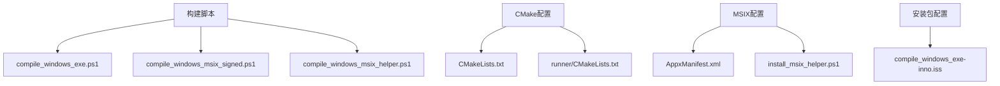
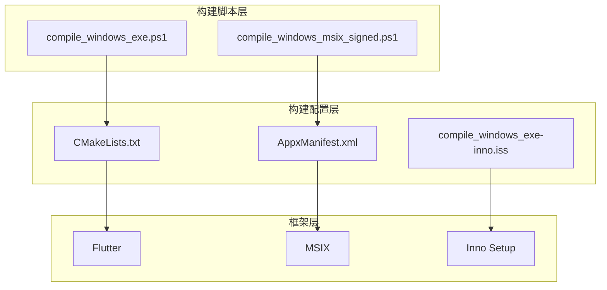
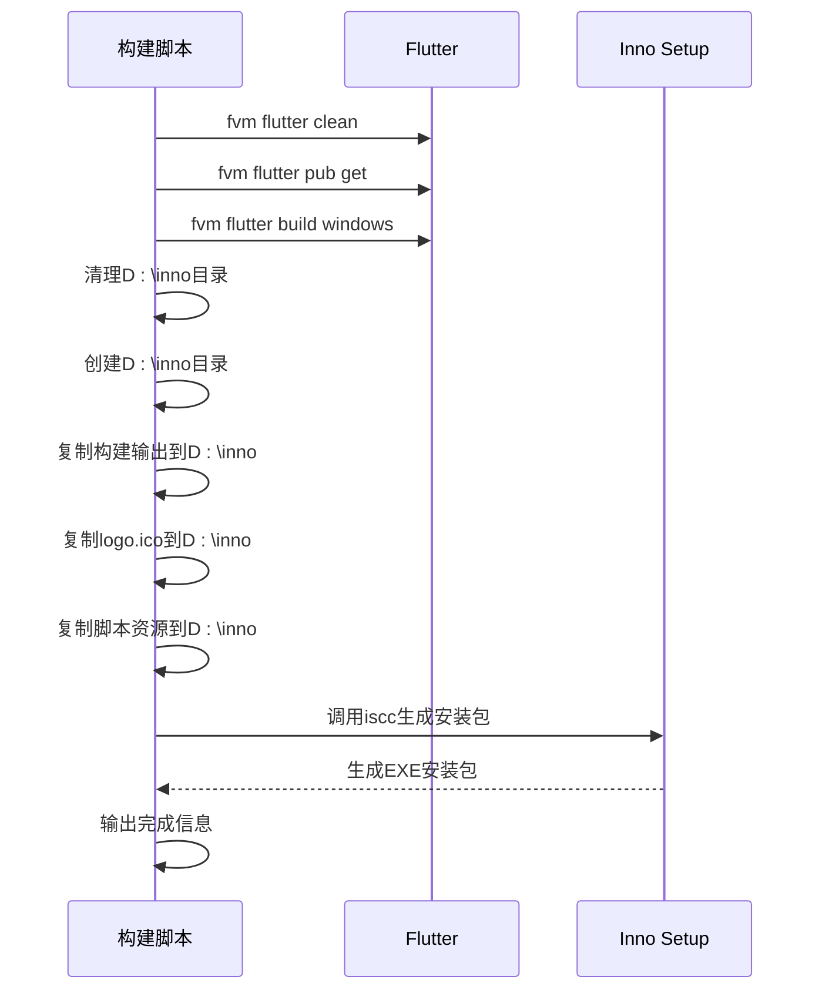
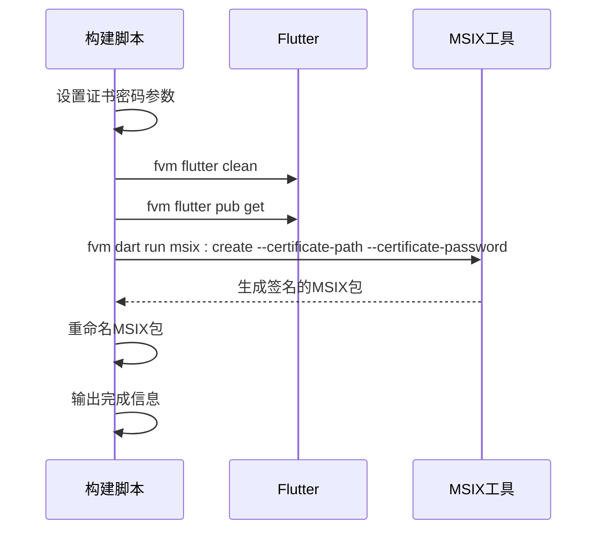
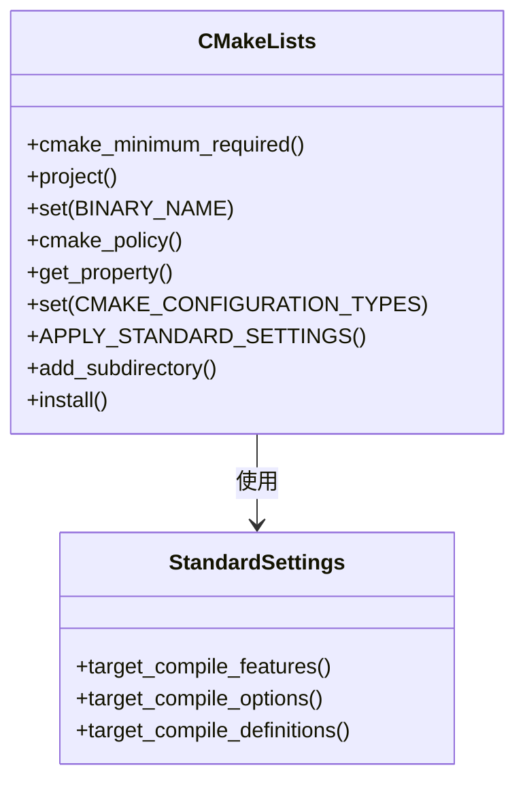
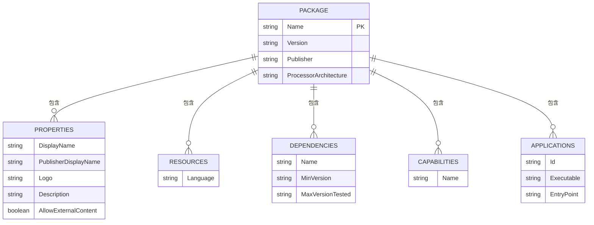
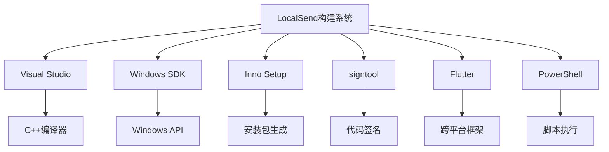

# Windows构建

<cite>
**本文档中引用的文件**  
- [compile_windows_exe.ps1](file://scripts/compile_windows_exe.ps1)
- [compile_windows_msix_signed.ps1](file://scripts/compile_windows_msix_signed.ps1)
- [CMakeLists.txt](file://app/windows/CMakeLists.txt)
- [AppxManifest.xml](file://msix/AppxManifest.xml)
- [compile_windows_exe-inno.iss](file://scripts/compile_windows_exe-inno.iss)
- [install_msix_helper.ps1](file://app/windows/install_msix_helper.ps1)
- [compile_windows_msix_helper.ps1](file://scripts/compile_windows_msix_helper.ps1)
- [pubspec.yaml](file://app/pubspec.yaml)
- [runner/CMakeLists.txt](file://app/windows/runner/CMakeLists.txt)
- [main.cpp](file://app/windows/runner/main.cpp)
- [utils.cpp](file://app/windows/runner/utils.cpp)
- [verify_exe_signature.ps1](file://scripts/verify_exe_signature.ps1)
</cite>

## 目录
1. [简介](#简介)
2. [项目结构](#项目结构)
3. [核心组件](#核心组件)
4. [架构概述](#架构概述)
5. [详细组件分析](#详细组件分析)
6. [依赖分析](#依赖分析)
7. [性能考虑](#性能考虑)
8. [故障排除指南](#故障排除指南)
9. [结论](#结论)

## 简介
LocalSend是一个开源的跨平台文件传输工具，提供类似AirDrop的体验。本文档深入分析其Windows平台的构建流程，涵盖EXE和MSIX两种安装包的生成过程、构建配置、代码签名等关键环节。通过详细解析构建脚本和配置文件，为开发者提供完整的Windows构建指南。

## 项目结构
LocalSend项目的Windows构建相关文件分布在多个目录中，主要包含构建脚本、CMake配置、MSIX清单文件等。构建系统采用Flutter框架，结合PowerShell脚本实现自动化构建和打包。

**图示来源**  
- [compile_windows_exe.ps1](file://scripts/compile_windows_exe.ps1)
- [compile_windows_msix_signed.ps1](file://scripts/compile_windows_msix_signed.ps1)
- [CMakeLists.txt](file://app/windows/CMakeLists.txt)
- [AppxManifest.xml](file://msix/AppxManifest.xml)
- [compile_windows_exe-inno.iss](file://scripts/compile_windows_exe-inno.iss)

**本节来源**  
- [scripts](file://scripts)
- [app/windows](file://app/windows)
- [msix](file://msix)

## 核心组件
Windows构建系统的核心组件包括PowerShell构建脚本、CMake构建配置、MSIX包配置和Inno Setup安装包配置。这些组件协同工作，完成从源码编译到最终安装包生成的完整流程。

**本节来源**  
- [compile_windows_exe.ps1](file://scripts/compile_windows_exe.ps1#L1-L20)
- [compile_windows_msix_signed.ps1](file://scripts/compile_windows_msix_signed.ps1#L1-L20)
- [CMakeLists.txt](file://app/windows/CMakeLists.txt#L1-L109)
- [AppxManifest.xml](file://msix/AppxManifest.xml#L1-L75)

## 架构概述
LocalSend的Windows构建架构采用分层设计，上层为构建脚本，中层为构建配置，底层为Flutter框架。构建脚本调用Flutter命令进行编译，然后使用Inno Setup和MSIX工具生成安装包。

**图示来源**  
- [compile_windows_exe.ps1](file://scripts/compile_windows_exe.ps1)
- [compile_windows_msix_signed.ps1](file://scripts/compile_windows_msix_signed.ps1)
- [CMakeLists.txt](file://app/windows/CMakeLists.txt)
- [AppxManifest.xml](file://msix/AppxManifest.xml)
- [compile_windows_exe-inno.iss](file://scripts/compile_windows_exe-inno.iss)

## 详细组件分析

### EXE构建流程分析
EXE构建流程通过`compile_windows_exe.ps1`脚本实现，包含Flutter编译、文件复制和Inno Setup打包三个主要阶段。

#### 构建流程序列图

**图示来源**  
- [compile_windows_exe.ps1](file://scripts/compile_windows_exe.ps1#L1-L20)

**本节来源**  
- [compile_windows_exe.ps1](file://scripts/compile_windows_exe.ps1#L1-L20)
- [compile_windows_exe-inno.iss](file://scripts/compile_windows_exe-inno.iss#L1-L90)

### MSIX构建流程分析
MSIX构建流程通过`compile_windows_msix_signed.ps1`脚本实现，包含代码签名和包生成两个关键步骤。

#### MSIX构建流程序列图

**图示来源**  
- [compile_windows_msix_signed.ps1](file://scripts/compile_windows_msix_signed.ps1#L1-L20)

**本节来源**  
- [compile_windows_msix_signed.ps1](file://scripts/compile_windows_msix_signed.ps1#L1-L20)
- [AppxManifest.xml](file://msix/AppxManifest.xml#L1-L75)

### CMake构建配置分析
`app/windows/CMakeLists.txt`文件定义了Windows平台的构建配置，包括项目设置、编译选项和安装规则。

#### CMake配置类图

**图示来源**  
- [CMakeLists.txt](file://app/windows/CMakeLists.txt#L1-L109)

**本节来源**  
- [CMakeLists.txt](file://app/windows/CMakeLists.txt#L1-L109)
- [runner/CMakeLists.txt](file://app/windows/runner/CMakeLists.txt#L1-L42)

### MSIX包配置分析
`msix/AppxManifest.xml`文件定义了MSIX包的元数据、功能和应用配置。

#### MSIX配置数据模型

**图示来源**  
- [AppxManifest.xml](file://msix/AppxManifest.xml#L1-L75)

**本节来源**  
- [AppxManifest.xml](file://msix/AppxManifest.xml#L1-L75)
- [install_msix_helper.ps1](file://app/windows/install_msix_helper.ps1#L1-L1)

## 依赖分析
Windows构建系统依赖多个外部工具和配置，包括Visual Studio、Windows SDK、Inno Setup、signtool等。这些依赖通过构建脚本进行协调和调用。

**图示来源**  
- [compile_windows_exe.ps1](file://scripts/compile_windows_exe.ps1)
- [compile_windows_msix_signed.ps1](file://scripts/compile_windows_msix_signed.ps1)
- [verify_exe_signature.ps1](file://scripts/verify_exe_signature.ps1)

**本节来源**  
- [compile_windows_exe.ps1](file://scripts/compile_windows_exe.ps1#L1-L20)
- [compile_windows_msix_signed.ps1](file://scripts/compile_windows_msix_signed.ps1#L1-L20)
- [verify_exe_signature.ps1](file://scripts/verify_exe_signature.ps1#L1-L2)

## 性能考虑
Windows构建过程中的性能优化主要体现在构建脚本的执行效率和构建产物的优化。通过合理配置CMake和使用适当的编译选项，可以提高构建速度和运行时性能。

## 故障排除指南
构建过程中可能遇到的问题包括依赖缺失、路径错误和签名失败等。通过检查构建脚本中的路径配置和依赖工具的安装状态，可以解决大部分构建问题。

**本节来源**  
- [compile_windows_exe.ps1](file://scripts/compile_windows_exe.ps1#L5-L10)
- [compile_windows_msix_signed.ps1](file://scripts/compile_windows_msix_signed.ps1#L5-L10)
- [verify_exe_signature.ps1](file://scripts/verify_exe_signature.ps1#L1-L2)

## 结论
LocalSend的Windows构建系统设计合理，通过PowerShell脚本自动化了从编译到打包的完整流程。EXE和MSIX两种安装包格式满足了不同用户的需求，CMake和MSIX配置文件提供了灵活的构建选项。该构建系统为开发者提供了清晰的构建指南和可扩展的架构。