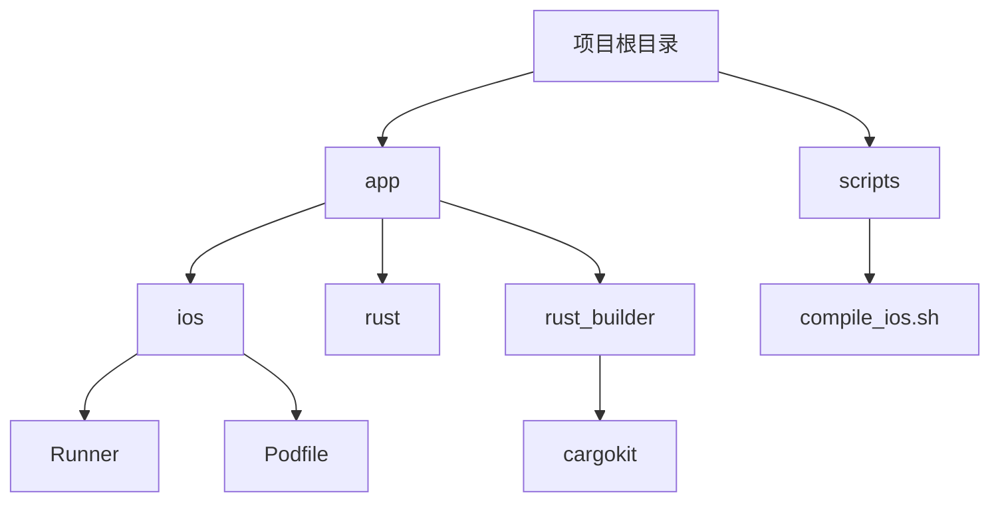
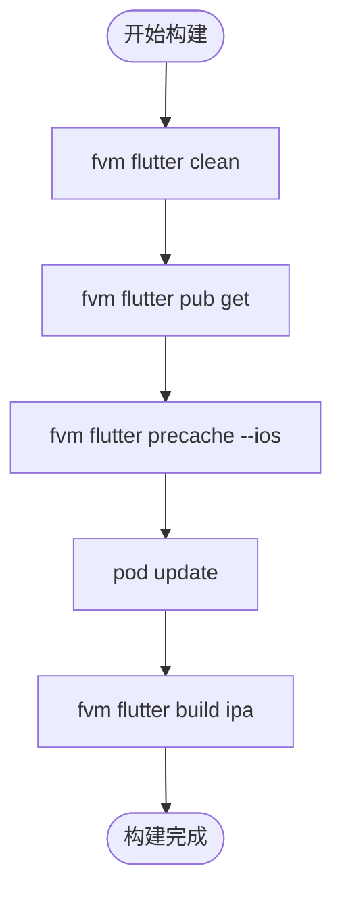
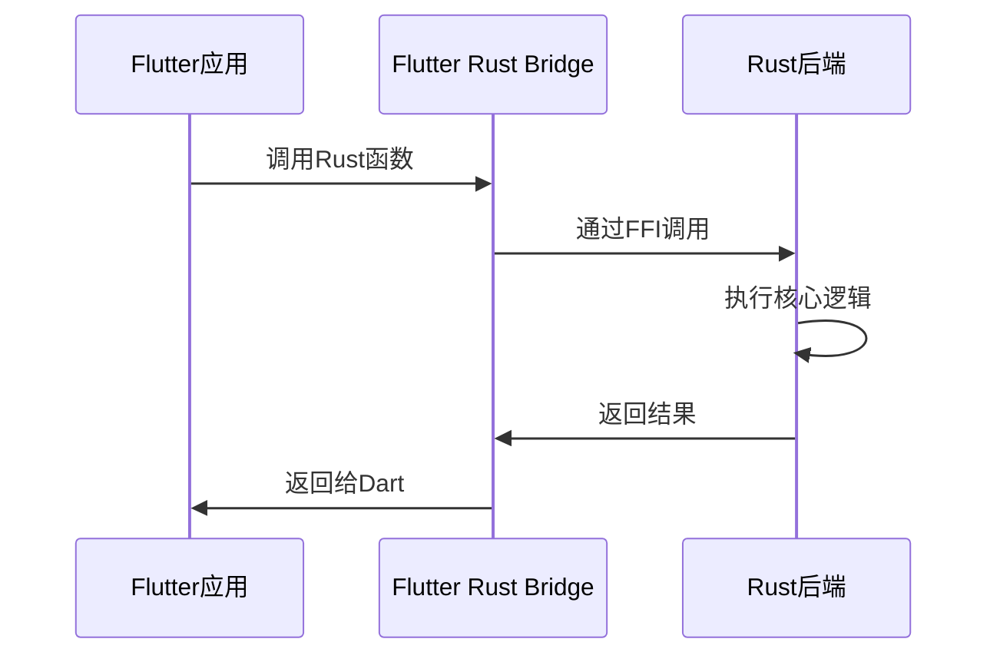
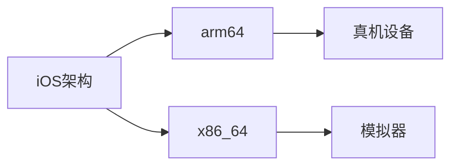

# iOS构建

<cite>
**本文档中引用的文件**  
- [compile_ios.sh](file://scripts/compile_ios.sh)
- [Podfile](file://app/ios/Podfile)
- [Cargo.toml](file://app/rust/Cargo.toml)
- [pubspec.yaml](file://app/pubspec.yaml)
- [rust-toolchain.toml](file://app/rust-toolchain.toml)
- [build_pod.sh](file://app/rust_builder/cargokit/build_pod.sh)
- [Info.plist](file://app/ios/Runner/Info.plist)
- [Runner.entitlements](file://app/ios/Runner/Runner.entitlements)
- [Runner-Bridging-Header.h](file://app/ios/Runner/Runner-Bridging-Header.h)
</cite>

## 目录
1. [简介](#简介)
2. [项目结构](#项目结构)
3. [核心构建流程](#核心构建流程)
4. [Xcode项目配置](#xcode项目配置)
5. [CocoaPods依赖管理](#cocoapods依赖管理)
6. [Rust交叉编译](#rust交叉编译)
7. [iOS架构要求](#ios架构要求)
8. [构建环境设置](#构建环境设置)
9. [模拟器与真机构建](#模拟器与真机构建)
10. [代码签名与发布](#代码签名与发布)
11. [性能优化建议](#性能优化建议)

## 简介
本文件详细说明了LocalSend项目在iOS平台上的构建流程，涵盖了从环境设置到最终发布的完整过程。文档重点分析了`compile_ios.sh`脚本中的构建步骤，包括Xcode项目配置、CocoaPods依赖管理、Rust交叉编译等关键技术环节。

## 项目结构
项目结构显示了iOS相关文件的组织方式，包括Flutter应用、Rust后端和构建脚本的集成。



**图表来源**  
- [Podfile](file://app/ios/Podfile#L1-L49)
- [compile_ios.sh](file://scripts/compile_ios.sh#L1-L14)

## 核心构建流程
`compile_ios.sh`脚本定义了iOS构建的主要流程，包括清理、依赖获取、预缓存和最终构建。



**图表来源**  
- [compile_ios.sh](file://scripts/compile_ios.sh#L1-L14)

**本节来源**  
- [compile_ios.sh](file://scripts/compile_ios.sh#L1-L14)

## Xcode项目配置
iOS应用的Xcode配置通过`Info.plist`和`Runner.entitlements`文件进行管理，确保应用具有正确的权限和功能。

**本节来源**  
- [Info.plist](file://app/ios/Runner/Info.plist)
- [Runner.entitlements](file://app/ios/Runner/Runner.entitlements)

## CocoaPods依赖管理
`Podfile`文件定义了iOS项目的原生依赖关系，包括平台版本要求和插件集成。

```ruby
platform :ios, '12.0'

project 'Runner', {
  'Debug' => :debug,
  'Profile' => :release,
  'Release' => :release,
}

flutter_ios_podfile_setup

target 'Runner' do
  use_frameworks!
  use_modular_headers!
  flutter_install_all_ios_pods File.dirname(File.realpath(__FILE__))
  
  target 'ShareExtension' do
    inherit! :search_paths
    pod "share_handler_ios_models", :path => ".symlinks/plugins/share_handler_ios/ios/Models"
  end
end
```

**图表来源**  
- [Podfile](file://app/ios/Podfile#L1-L49)

**本节来源**  
- [Podfile](file://app/ios/Podfile#L1-L49)

## Rust交叉编译
Rust后端通过`flutter_rust_bridge`与Flutter集成，使用Cargokit进行交叉编译。



**图表来源**  
- [Cargo.toml](file://app/rust/Cargo.toml#L1-L18)
- [pubspec.yaml](file://app/pubspec.yaml#L1-L124)

**本节来源**  
- [Cargo.toml](file://app/rust/Cargo.toml#L1-L18)
- [pubspec.yaml](file://app/pubspec.yaml#L1-L124)

## iOS架构要求
项目支持arm64和x86_64架构，满足iOS设备和模拟器的构建需求。



**图表来源**  
- [rust-toolchain.toml](file://app/rust-toolchain.toml#L1-L4)
- [build_pod.sh](file://app/rust_builder/cargokit/build_pod.sh#L1-L42)

**本节来源**  
- [rust-toolchain.toml](file://app/rust-toolchain.toml#L1-L4)

## 构建环境设置
iOS构建需要配置Xcode、Command Line Tools和Apple开发者账号。

**本节来源**  
- [compile_ios.sh](file://scripts/compile_ios.sh#L1-L14)
- [Podfile](file://app/ios/Podfile#L1-L49)

## 模拟器与真机构建
构建流程需要区分模拟器和真机环境，使用不同的架构和配置。

**本节来源**  
- [build_pod.sh](file://app/rust_builder/cargokit/build_pod.sh#L1-L42)
- [Podfile](file://app/ios/Podfile#L1-L49)

## 代码签名与发布
发布到App Store需要正确的代码签名配置和发布流程。

**本节来源**  
- [Runner.entitlements](file://app/ios/Runner/Runner.entitlements)
- [compile_ios.sh](file://scripts/compile_ios.sh#L1-L14)

## 性能优化建议
通过静态库链接和架构优化提高应用性能。

**本节来源**  
- [build_pod.sh](file://app/rust_builder/cargokit/build_pod.sh#L1-L42)
- [Cargo.toml](file://app/rust/Cargo.toml#L1-L18)