# macOS构建

<cite>
**本文档中引用的文件**
- [scripts/compile_mac_dmg.sh](file://scripts/compile_mac_dmg.sh)
- [scripts/compile_mac_appstore.sh](file://scripts/compile_mac_appstore.sh)
- [app/macos/Podfile](file://app/macos/Podfile)
- [app/macos/Runner/Info.plist](file://app/macos/Runner/Info.plist)
- [app/macos/Runner/Release.entitlements](file://app/macos/Runner/Release.entitlements)
- [app/pubspec.yaml](file://app/pubspec.yaml)
- [.fvmrc](file://.fvmrc)
- [app/rust_builder/pubspec.yaml](file://app/rust_builder/pubspec.yaml)
- [app/rust_builder/cargokit/build_pod.sh](file://app/rust_builder/cargokit/build_pod.sh)
- [README.md](file://README.md)
</cite>

## 目录
1. [简介](#简介)
2. [项目结构概览](#项目结构概览)
3. [核心构建组件](#核心构建组件)
4. [架构概览](#架构概览)
5. [详细组件分析](#详细组件分析)
6. [依赖关系分析](#依赖关系分析)
7. [性能考虑](#性能考虑)
8. [故障排除指南](#故障排除指南)
9. [结论](#结论)

## 简介

LocalSend是一个跨平台的文件传输应用，支持macOS平台的构建和分发。本文档详细介绍了macOS平台的构建流程，包括DMG打包、App Store发布、代码签名、公证（notarization）等关键步骤。该应用使用Flutter框架开发，结合Rust原生代码实现高性能的网络通信功能。

## 项目结构概览

LocalSend项目采用模块化架构，macOS相关文件主要分布在以下目录：

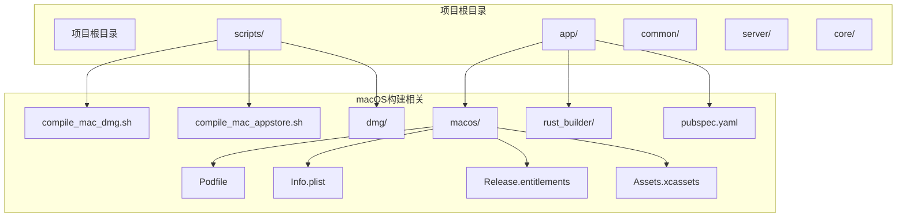

**图表来源**
- [scripts/compile_mac_dmg.sh](file://scripts/compile_mac_dmg.sh#L1-L54)
- [scripts/compile_mac_appstore.sh](file://scripts/compile_mac_appstore.sh#L1-L9)
- [app/macos/Podfile](file://app/macos/Podfile#L1-L46)

**章节来源**
- [README.md](file://README.md#L1-L50)

## 核心构建组件

### 构建脚本系统

LocalSend提供了两个主要的macOS构建脚本：

1. **compile_mac_dmg.sh**: 用于创建标准DMG安装包
2. **compile_mac_appstore.sh**: 用于App Store版本构建

这两个脚本都基于Flutter的构建系统，但针对不同的分发渠道进行了优化。

### 原生依赖管理

应用使用CocoaPods进行原生依赖管理，主要依赖包括：

- **Defaults**: 用于应用程序设置管理
- **Flutter框架**: 提供跨平台支持
- **Rust绑定**: 集成高性能网络通信库

**章节来源**
- [scripts/compile_mac_dmg.sh](file://scripts/compile_mac_dmg.sh#L1-L10)
- [scripts/compile_mac_appstore.sh](file://scripts/compile_mac_appstore.sh#L1-L9)
- [app/macos/Podfile](file://app/macos/Podfile#L30-L35)

## 架构概览

macOS构建架构采用多层设计，从源码到最终分发包的完整流程：

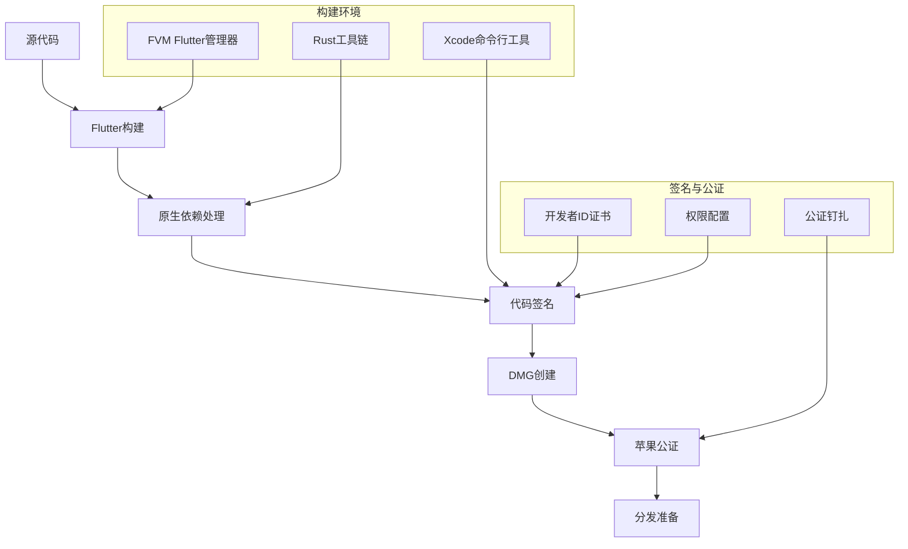

**图表来源**
- [scripts/compile_mac_dmg.sh](file://scripts/compile_mac_dmg.sh#L8-L54)
- [app/macos/Podfile](file://app/macos/Podfile#L1-L46)

## 详细组件分析

### compile_mac_dmg.sh 脚本分析

该脚本是macOS构建的核心，实现了完整的构建-签名-打包流程：

#### 构建阶段
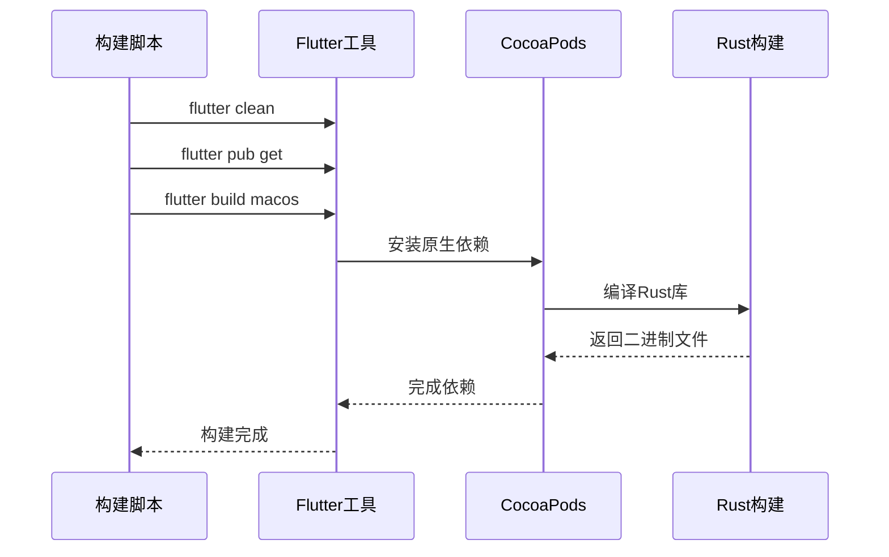

**图表来源**
- [scripts/compile_mac_dmg.sh](file://scripts/compile_mac_dmg.sh#L6-L10)

#### 代码签名流程
脚本使用Apple的代码签名工具对应用进行签名：

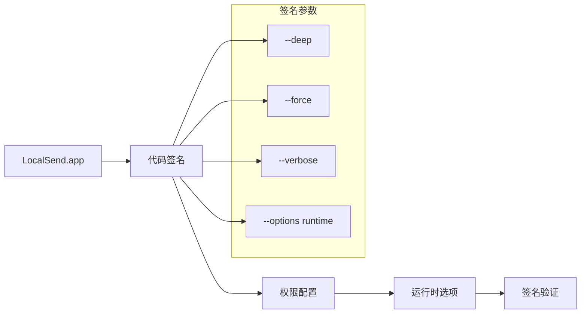

**图表来源**
- [scripts/compile_mac_dmg.sh](file://scripts/compile_mac_dmg.sh#L12-L15)

#### DMG创建过程
使用create-dmg工具创建安装镜像：

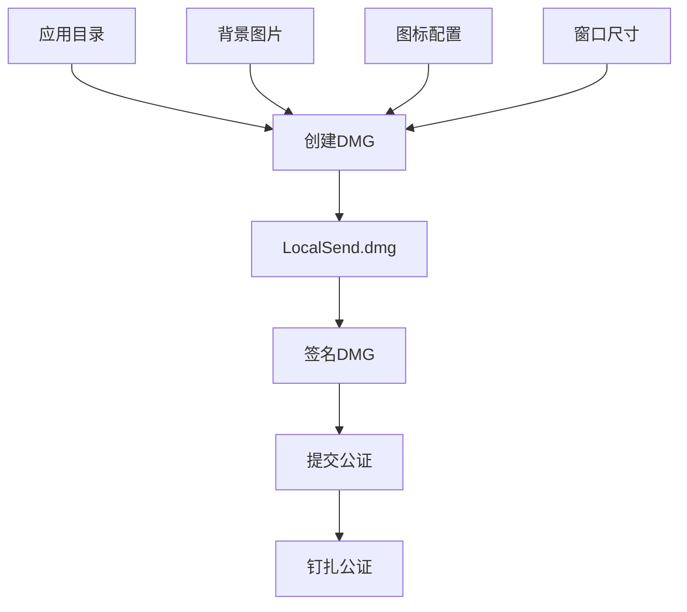

**图表来源**
- [scripts/compile_mac_dmg.sh](file://scripts/compile_mac_dmg.sh#L18-L28)

**章节来源**
- [scripts/compile_mac_dmg.sh](file://scripts/compile_mac_dmg.sh#L1-L54)

### compile_mac_appstore.sh 脚本分析

该脚本专门用于App Store版本的构建，流程相对简化：

#### 构建流程
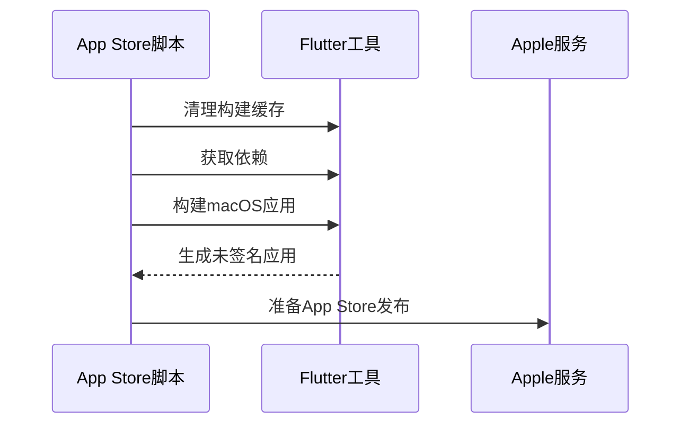

**图表来源**
- [scripts/compile_mac_appstore.sh](file://scripts/compile_mac_appstore.sh#L6-L10)

**章节来源**
- [scripts/compile_mac_appstore.sh](file://scripts/compile_mac_appstore.sh#L1-L9)

### Podfile配置分析

CocoaPods配置文件定义了macOS平台的构建要求和依赖管理：

#### 平台要求
- **最低系统版本**: macOS 11.0 (Big Sur)
- **部署目标**: 11.0
- **架构支持**: 支持x86_64和ARM64

#### 依赖管理策略
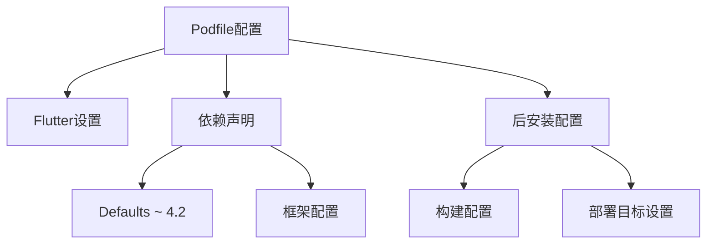

**图表来源**
- [app/macos/Podfile](file://app/macos/Podfile#L1-L46)

**章节来源**
- [app/macos/Podfile](file://app/macos/Podfile#L1-L46)

### Info.plist配置分析

应用信息配置文件定义了应用的基本属性和权限需求：

#### 应用基本信息
- **显示名称**: LocalSend
- **Bundle标识符**: $(PRODUCT_BUNDLE_IDENTIFIER)
- **版本信息**: 基于Flutter构建变量

#### 权限配置
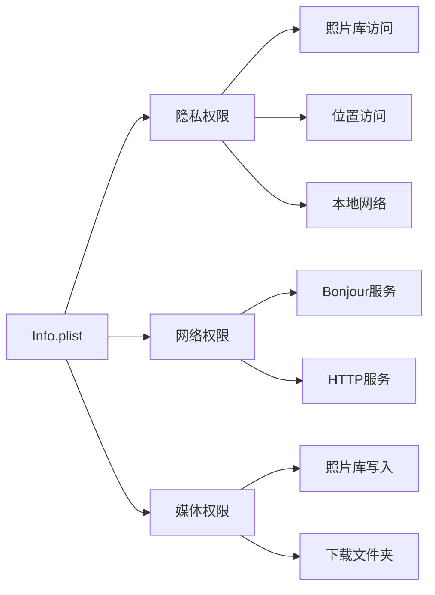

**图表来源**
- [app/macos/Runner/Info.plist](file://app/macos/Runner/Info.plist#L1-L159)

**章节来源**
- [app/macos/Runner/Info.plist](file://app/macos/Runner/Info.plist#L1-L159)

### Release.entitlements权限配置

沙盒权限配置确保应用在安全环境中运行：

#### 沙盒权限类型
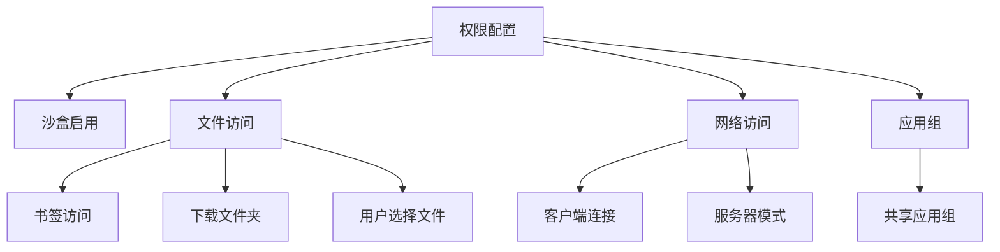

**图表来源**
- [app/macos/Runner/Release.entitlements](file://app/macos/Runner/Release.entitlements#L1-L23)

**章节来源**
- [app/macos/Runner/Release.entitlements](file://app/macos/Runner/Release.entitlements#L1-L23)

### Rust集成架构

应用集成了Rust原生代码以实现高性能的网络通信：

#### 构建工具链
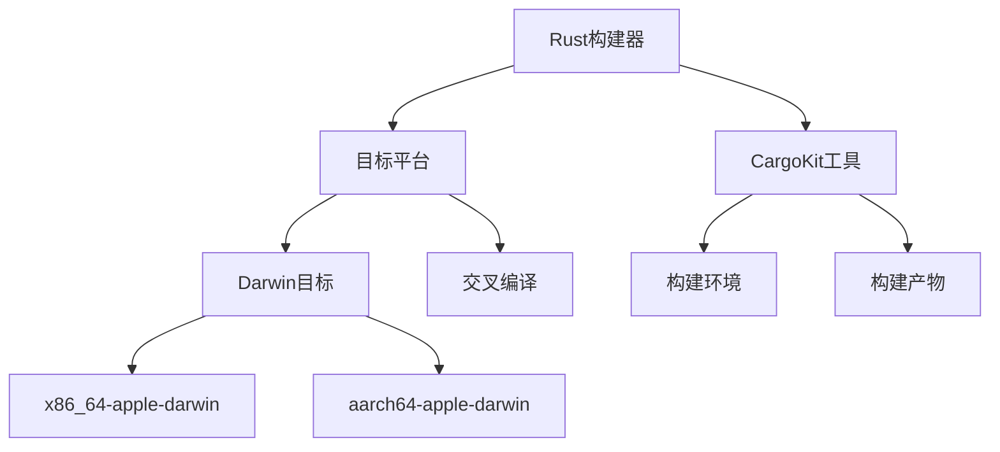

**图表来源**
- [app/rust_builder/cargokit/build_pod.sh](file://app/rust_builder/cargokit/build_pod.sh#L1-L57)

**章节来源**
- [app/rust_builder/cargokit/build_pod.sh](file://app/rust_builder/cargokit/build_pod.sh#L1-L57)

## 依赖关系分析

### 构建环境依赖

macOS构建需要多个工具和环境的协同工作：

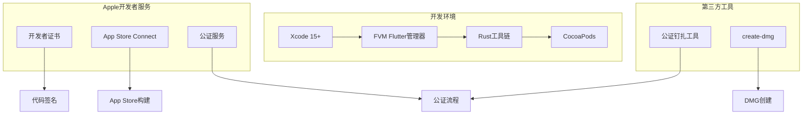

**图表来源**
- [.fvmrc](file://.fvmrc#L1-L3)
- [app/pubspec.yaml](file://app/pubspec.yaml#L1-L20)

### 版本兼容性

#### Flutter版本要求
- **当前版本**: 3.35.6
- **SDK要求**: Dart >=3.9.0
- **平台支持**: macOS 11.0+

#### Rust版本管理
应用使用Cargokit工具自动管理Rust工具链，支持：
- 多架构交叉编译
- 工具链版本管理
- 依赖缓存优化

**章节来源**
- [.fvmrc](file://.fvmrc#L1-L3)
- [app/pubspec.yaml](file://app/pubspec.yaml#L1-L20)

## 性能考虑

### 构建性能优化

1. **增量构建**: 利用Flutter的增量构建机制
2. **并行编译**: Rust构建支持多线程编译
3. **缓存策略**: CocoaPods和Rust构建缓存
4. **符号链接**: 使用符号链接避免重复复制

### 运行时性能

1. **原生代码集成**: Rust实现高性能网络功能
2. **沙盒优化**: 合理的权限配置减少性能开销
3. **内存管理**: Flutter和Rust的内存协调
4. **网络优化**: 基于WebSocket的实时通信

### 包大小优化

1. **资源压缩**: 图标和资源文件优化
2. **依赖精简**: 移除不必要的依赖项
3. **代码分割**: 按需加载功能模块
4. **静态链接**: Rust库的静态链接优化

## 故障排除指南

### 常见构建问题

#### 代码签名失败
**症状**: codesign命令返回错误
**解决方案**:
1. 检查开发者证书是否有效
2. 验证权限配置文件
3. 确认签名ID正确性

#### CocoaPods依赖冲突
**症状**: pod install失败或构建错误
**解决方案**:
1. 更新CocoaPods版本
2. 清理Pods缓存
3. 检查平台版本兼容性

#### Rust构建失败
**症状**: Rust库编译错误
**解决方案**:
1. 检查Rust工具链版本
2. 验证目标平台支持
3. 清理Cargo缓存

### 公证问题

#### 公证提交失败
**症状**: notarytool提交被拒绝
**解决方案**:
1. 检查开发者凭据
2. 验证应用签名完整性
3. 确认公证权限

#### 公证钉扎失败
**症状**: stapler命令执行失败
**解决方案**:
1. 检查网络连接
2. 验证公证状态
3. 重新尝试钉扎操作

**章节来源**
- [scripts/compile_mac_dmg.sh](file://scripts/compile_mac_dmg.sh#L35-L54)

## 结论

LocalSend的macOS构建系统展现了现代跨平台应用开发的最佳实践。通过Flutter框架结合Rust原生代码，实现了高性能的文件传输功能。完善的构建脚本自动化了从源码到分发包的整个流程，包括代码签名、公证和打包等关键步骤。

该构建系统的成功实施证明了：
1. **模块化架构的有效性**: 清晰的职责分离和组件化设计
2. **自动化的重要性**: 减少人为错误，提高构建效率
3. **安全性考虑**: 完善的代码签名和沙盒配置
4. **用户体验优先**: 简化的构建流程和清晰的错误处理

对于希望在macOS平台上部署类似应用的开发者，这套构建系统提供了完整的参考实现，涵盖了从开发环境配置到最终产品发布的所有关键环节。