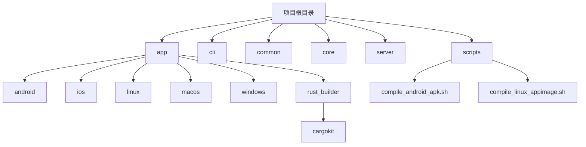
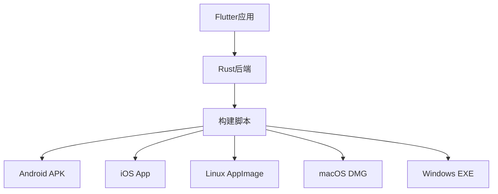
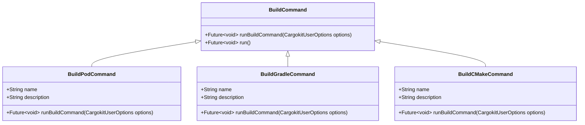
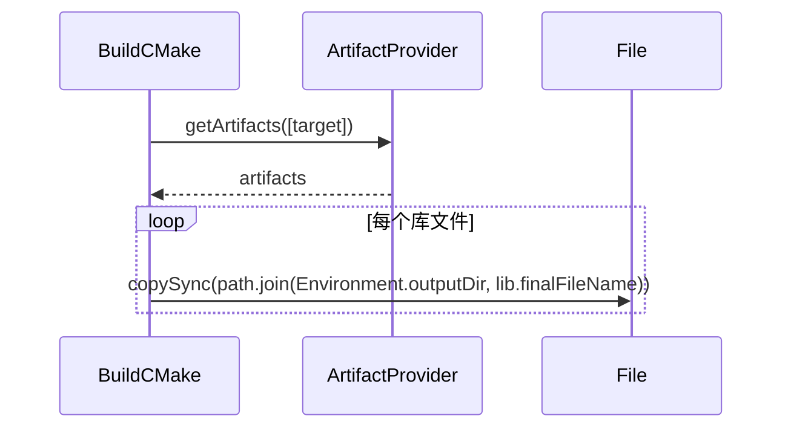
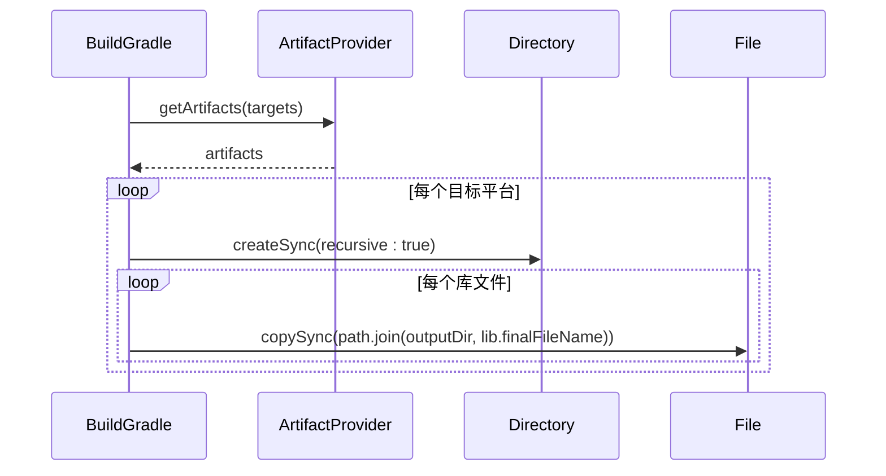
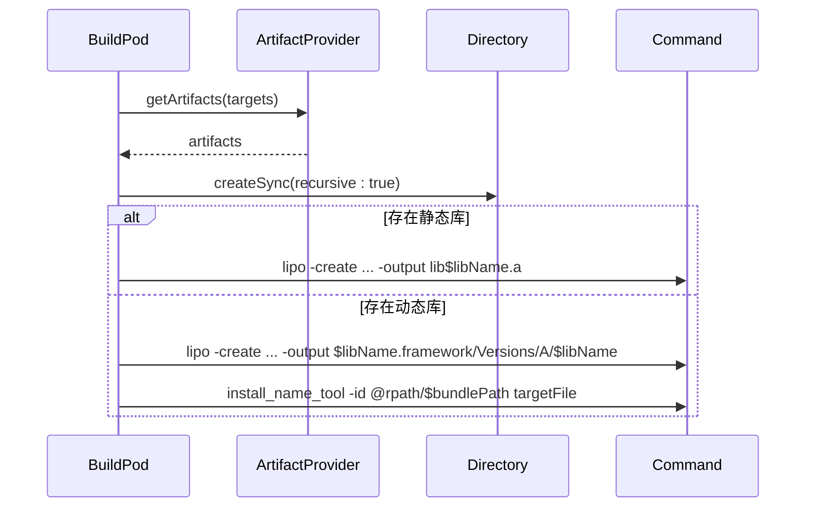
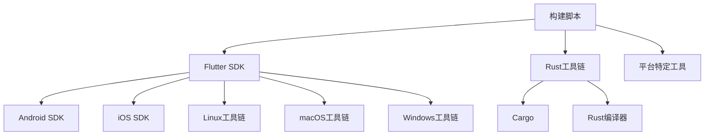

# 多平台构建

<cite>
**本文档中引用的文件**   
- [compile_android_apk.sh](file://scripts/compile_android_apk.sh)
- [compile_linux_appimage.sh](file://scripts/compile_linux_appimage.sh)
- [target.dart](file://app/rust_builder/cargokit/build_tool/lib/src/target.dart)
- [build_tool.dart](file://app/rust_builder/cargokit/build_tool/lib/src/build_tool.dart)
- [build_cmake.dart](file://app/rust_builder/cargokit/build_tool/lib/src/build_cmake.dart)
- [build_gradle.dart](file://app/rust_builder/cargokit/build_tool/lib/src/build_gradle.dart)
- [build_pod.dart](file://app/rust_builder/cargokit/build_tool/lib/src/build_pod.dart)
- [pubspec.yaml](file://app/rust_builder/pubspec.yaml)
</cite>

## 目录
1. [简介](#简介)
2. [项目结构](#项目结构)
3. [核心组件](#核心组件)
4. [架构概述](#架构概述)
5. [详细组件分析](#详细组件分析)
6. [依赖分析](#依赖分析)
7. [性能考虑](#性能考虑)
8. [故障排除指南](#故障排除指南)
9. [结论](#结论)
10. [附录](#附录)（如有必要）

## 简介
本文档深入解释了针对Android、iOS、Linux、macOS和Windows平台的多平台构建流程。文档详细说明了各个平台特定的构建脚本中的关键步骤，包括`compile_android_apk.sh`和`compile_linux_appimage.sh`等脚本。同时，文档详细阐述了`rust_builder/cargokit`中`target.dart`如何管理不同平台的目标三元组和编译配置。此外，文档还提供了各平台构建环境的设置指南，包括必要的依赖项和工具链配置，以及平台特定的构建参数和优化选项。

## 项目结构
本项目采用模块化结构，主要分为以下几个部分：`app`、`cli`、`common`、`core`、`server`等。其中，`app`目录包含了Flutter应用的源代码和资源文件，`rust_builder`目录包含了Rust构建工具和配置文件，`scripts`目录包含了各个平台的构建脚本。



**图示来源**
- [compile_android_apk.sh](file://scripts/compile_android_apk.sh)
- [compile_linux_appimage.sh](file://scripts/compile_linux_appimage.sh)

**本节来源**
- [compile_android_apk.sh](file://scripts/compile_android_apk.sh)
- [compile_linux_appimage.sh](file://scripts/compile_linux_appimage.sh)

## 核心组件
本项目的核心组件包括Flutter应用、Rust后端、构建脚本和配置文件。这些组件共同协作，实现了跨平台的应用构建和部署。

**本节来源**
- [pubspec.yaml](file://app/rust_builder/pubspec.yaml)
- [target.dart](file://app/rust_builder/cargokit/build_tool/lib/src/target.dart)

## 架构概述
本项目的架构采用了Flutter与Rust结合的方式，通过Flutter实现跨平台的UI界面，通过Rust实现高性能的后端逻辑。构建流程通过一系列脚本和工具链实现自动化。



**图示来源**
- [build_tool.dart](file://app/rust_builder/cargokit/build_tool/lib/src/build_tool.dart)
- [target.dart](file://app/rust_builder/cargokit/build_tool/lib/src/target.dart)

## 详细组件分析
### Android构建分析
Android平台的构建通过`compile_android_apk.sh`脚本实现。该脚本首先检查必要的依赖项，然后执行Flutter构建命令生成APK文件。

**本节来源**
- [compile_android_apk.sh](file://scripts/compile_android_apk.sh)

### Linux构建分析
Linux平台的构建通过`compile_linux_appimage.sh`脚本实现。该脚本首先检查必要的依赖项，然后执行Flutter构建命令生成Linux应用，最后使用AppImage工具打包成AppImage文件。

**本节来源**
- [compile_linux_appimage.sh](file://scripts/compile_linux_appimage.sh)

### Rust构建工具分析
Rust构建工具通过`cargokit`实现，其中`target.dart`文件定义了各个平台的目标三元组和编译配置。

```mermaid
classDiagram
class Target {
+String rust
+String? flutter
+String? android
+int? androidMinSdkVersion
+String? darwinPlatform
+String? darwinArch
+static Target[] all
+static Target? forFlutterName(String flutterName)
+static Target? forDarwin({required String platformName, required String darwinAarch})
+static Target? forRustTriple(String triple)
+static Target[] androidTargets()
+static Target[] buildableTargets()
}
```

**图示来源**
- [target.dart](file://app/rust_builder/cargokit/build_tool/lib/src/target.dart)

### 构建命令分析
构建命令通过`build_tool.dart`文件实现，支持多种构建命令，包括`build-pod`、`build-gradle`、`build-cmake`等。



**图示来源**
- [build_tool.dart](file://app/rust_builder/cargokit/build_tool/lib/src/build_tool.dart)

### CMake构建分析
CMake构建通过`build_cmake.dart`文件实现，主要用于Linux和Windows平台的构建。



**图示来源**
- [build_cmake.dart](file://app/rust_builder/cargokit/build_tool/lib/src/build_cmake.dart)

### Gradle构建分析
Gradle构建通过`build_gradle.dart`文件实现，主要用于Android平台的构建。



**图示来源**
- [build_gradle.dart](file://app/rust_builder/cargokit/build_tool/lib/src/build_gradle.dart)

### Pod构建分析
Pod构建通过`build_pod.dart`文件实现，主要用于iOS和macOS平台的构建。



**图示来源**
- [build_pod.dart](file://app/rust_builder/cargokit/build_tool/lib/src/build_pod.dart)

## 依赖分析
本项目的依赖关系主要体现在构建脚本与平台工具链之间，以及Flutter应用与Rust后端之间。



**图示来源**
- [compile_android_apk.sh](file://scripts/compile_android_apk.sh)
- [compile_linux_appimage.sh](file://scripts/compile_linux_appimage.sh)

**本节来源**
- [compile_android_apk.sh](file://scripts/compile_android_apk.sh)
- [compile_linux_appimage.sh](file://scripts/compile_linux_appimage.sh)

## 性能考虑
在多平台构建过程中，性能优化主要体现在以下几个方面：
1. 使用缓存机制减少重复编译
2. 并行执行构建任务
3. 优化Rust代码以提高运行效率
4. 减少Flutter应用的启动时间

## 故障排除指南
在构建过程中可能遇到的问题及解决方案：
1. **依赖项缺失**：确保所有必要的依赖项都已正确安装
2. **权限问题**：检查文件和目录的权限设置
3. **网络问题**：确保网络连接正常，能够访问必要的资源
4. **版本冲突**：确保使用的工具链版本与项目要求一致

**本节来源**
- [compile_android_apk.sh](file://scripts/compile_android_apk.sh)
- [compile_linux_appimage.sh](file://scripts/compile_linux_appimage.sh)

## 结论
本文档详细介绍了多平台构建的各个方面，包括构建流程、工具链配置、平台特定的构建参数等。通过这些信息，开发者可以更好地理解和实施跨平台应用的构建。

## 附录
### 构建环境设置指南
#### Android
1. 安装Android SDK
2. 配置环境变量
3. 接受许可证

#### Linux
1. 安装必要的依赖项
2. 配置AppImage工具

#### macOS
1. 安装Xcode
2. 配置CocoaPods

#### Windows
1. 安装Visual Studio
2. 配置Windows SDK