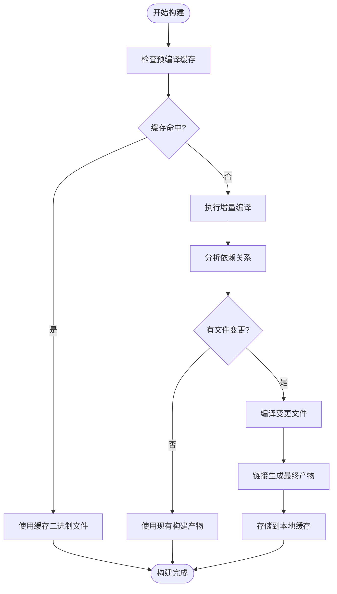
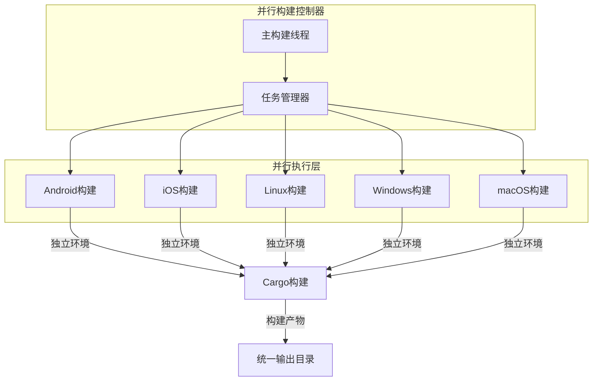
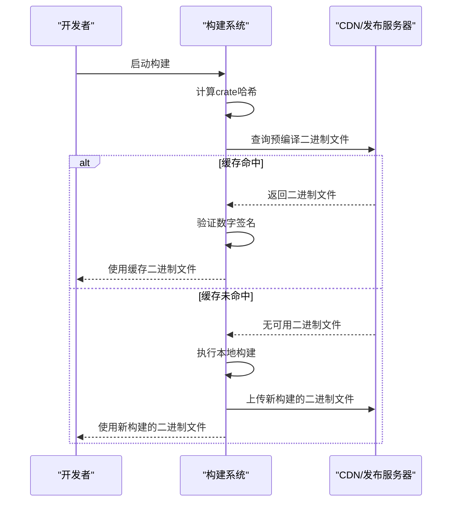

# 构建优化

<cite>
**本文档中引用的文件**  
- [Cargo.toml](file://app/rust/Cargo.toml)
- [cargo.dart](file://app/rust_builder/cargokit/build_tool/lib/src/cargo.dart)
- [builder.dart](file://app/rust_builder/cargokit/build_tool/lib/src/builder.dart)
- [build_tool.dart](file://app/rust_builder/cargokit/build_tool/lib/src/build_tool.dart)
- [options.dart](file://app/rust_builder/cargokit/build_tool/lib/src/options.dart)
- [pubspec.yaml](file://app/rust_builder/pubspec.yaml)
</cite>

## 目录
1. [介绍](#介绍)
2. [Cargo.toml依赖管理与构建配置](#cargotoml依赖管理与构建配置)
3. [Cargokit构建工具架构](#cargokit构建工具架构)
4. [增量编译与缓存策略](#增量编译与缓存策略)
5. [并行构建机制](#并行构建机制)
6. [预编译二进制文件优化](#预编译二进制文件优化)
7. [构建性能调优技巧](#构建性能调优技巧)
8. [性能基准测试与优化对比](#性能基准测试与优化对比)
9. [结论](#结论)

## 介绍
本文件详细阐述了LocalSend项目中Rust组件的构建优化策略。重点分析了Cargo.toml中的依赖管理和构建配置如何影响构建性能，以及rust_builder/cargokit中cargo.dart和builder.dart组件如何实现增量编译、缓存策略和并行构建等优化技术。文档还提供了构建时间分析和性能调优的实用技巧，包括如何配置Cargo的构建配置文件和使用构建缓存，以及通过预编译二进制文件和依赖项预下载来加速构建过程。

## Cargo.toml依赖管理与构建配置
Cargo.toml文件是Rust项目的核心配置文件，它定义了项目的依赖关系和构建配置。在LocalSend项目中，app/rust/Cargo.toml文件通过精简的依赖列表和明确的版本控制来优化构建性能。

该配置文件定义了项目的基本信息，包括名称、版本和Rust版本（2021版）。通过指定crate-type为"cdylib"和"staticlib"，确保生成的库可以被不同平台的原生代码调用。依赖管理方面，项目采用了精确的版本锁定策略，如anyhow = "1.0.95"和bytes = "1.9.0"，这有助于避免依赖版本冲突和不必要的重新编译。

特别值得注意的是，项目通过flutter_rust_bridge依赖实现了Flutter与Rust的高效桥接，版本锁定为"=2.11.1"以确保构建的一致性。同时，通过path依赖引入本地核心库（localsend = { path = "../../core", features = ["full"] }），这种本地依赖管理方式避免了从远程仓库下载依赖的时间开销，显著提升了开发构建速度。

**Section sources**
- [Cargo.toml](file://app/rust/Cargo.toml)

## Cargokit构建工具架构
Cargokit构建工具是LocalSend项目中实现高效Rust构建的核心组件，由多个Dart类协同工作。该工具架构主要由cargo.dart、builder.dart和build_tool.dart三个核心组件构成，形成了一个完整的构建解决方案。

cargo.dart组件负责处理Cargo清单文件的解析和验证，通过CrateInfo类提供对Cargo.toml文件的抽象访问。该组件使用TOML解析器读取和验证Cargo清单，确保构建过程基于正确的项目配置。builder.dart组件是构建逻辑的核心，实现了RustBuilder类来管理构建环境和执行构建命令。该组件通过BuildEnvironment类封装了构建配置、目标架构和临时目录等关键信息。

build_tool.dart作为命令行接口，提供了多种构建命令的实现，包括build-pod、build-gradle和build-cmake等平台特定的构建命令。该组件还实现了预编译二进制文件的生成和验证功能，通过PrecompileBinariesCommand和VerifyBinariesCommand类支持高效的二进制分发。整个架构通过清晰的职责分离，确保了构建过程的可维护性和可扩展性。

**Section sources**
- [cargo.dart](file://app/rust_builder/cargokit/build_tool/lib/src/cargo.dart)
- [builder.dart](file://app/rust_builder/cargokit/build_tool/lib/src/builder.dart)
- [build_tool.dart](file://app/rust_builder/cargokit/build_tool/lib/src/build_tool.dart)

## 增量编译与缓存策略
Cargokit构建系统实现了高效的增量编译和缓存策略，显著减少了重复构建的时间开销。系统通过智能的依赖分析和缓存机制，确保只有发生变化的代码才会被重新编译。

增量编译的核心在于对源文件和依赖关系的精确跟踪。当执行构建命令时，系统会检查源文件的时间戳和内容哈希，仅对已修改的文件进行重新编译。这种机制通过Cargo的内置增量编译功能实现，结合--target-dir参数指定的独立目标目录，确保构建产物的隔离性和可预测性。

缓存策略方面，系统实现了多层缓存机制。首先，通过本地构建缓存存储已编译的依赖项，避免重复下载和编译第三方库。其次，系统支持预编译二进制文件的远程缓存，通过CargokitCrateOptions中的precompiledBinaries配置，可以从指定的URL前缀下载已签名的二进制文件。这种缓存机制特别适用于CI/CD环境，可以大幅减少构建时间。

**Diagram sources**
- [builder.dart](file://app/rust_builder/cargokit/build_tool/lib/src/builder.dart)
- [options.dart](file://app/rust_builder/cargokit/build_tool/lib/src/options.dart)

**Section sources**
- [builder.dart](file://app/rust_builder/cargokit/build_tool/lib/src/builder.dart)
- [options.dart](file://app/rust_builder/cargokit/build_tool/lib/src/options.dart)

## 并行构建机制
Cargokit构建系统通过多层次的并行机制最大化构建效率，充分利用现代多核处理器的计算能力。系统在多个层面实现了并行化，包括依赖项的并行编译、多平台的并行构建和跨项目的并行处理。

在依赖项编译层面，Cargo本身支持并行编译多个crate，通过RUSTC_THREADS环境变量或Cargo配置文件中的build.jobs设置并行度。Cargokit构建工具继承了这一特性，并通过优化的构建环境配置确保并行编译的稳定性。对于多平台构建，系统支持同时为目标架构（如Android、iOS、Linux等）并行执行构建命令，通过独立的构建环境和临时目录避免资源竞争。

并行构建的实现依赖于精心设计的构建流程控制。RustBuilder类通过prepare方法预配置构建环境，然后在build方法中执行实际的构建命令。这种分离设计允许在多个目标架构上并行执行prepare操作，然后协调并行的构建过程。系统还通过适当的锁机制和资源管理，确保并行构建过程中的数据一致性和构建产物的完整性。

**Diagram sources**
- [builder.dart](file://app/rust_builder/cargokit/build_tool/lib/src/builder.dart)
- [build_tool.dart](file://app/rust_builder/cargokit/build_tool/lib/src/build_tool.dart)

**Section sources**
- [builder.dart](file://app/rust_builder/cargokit/build_tool/lib/src/builder.dart)
- [build_tool.dart](file://app/rust_builder/cargokit/build_tool/lib/src/build_tool.dart)

## 预编译二进制文件优化
预编译二进制文件优化是Cargokit构建系统的关键性能提升策略，通过预先构建和分发二进制文件来消除重复构建的开销。该机制特别适用于CI/CD流水线和团队开发环境，可以显著减少构建时间和资源消耗。

系统通过PrecompileBinariesCommand类实现预编译功能，该命令会为指定的目标架构构建二进制文件，并将其上传到GitHub发布页面。预编译过程使用Ed25519数字签名确保二进制文件的完整性和来源可信，通过PRIVATE_KEY环境变量提供私钥进行签名。客户端在构建时可以通过VerifyBinariesCommand验证下载的二进制文件的签名，确保安全性。

预编译二进制文件的使用由CargokitUserOptions中的usePrecompiledBinaries选项控制。当启用时，构建系统会首先尝试从配置的URL前缀下载匹配的二进制文件。下载的二进制文件基于crate哈希进行缓存，通过CrateHash.compute方法计算项目内容的唯一标识，确保缓存的准确性和一致性。这种机制不仅加速了构建过程，还保证了不同环境间构建产物的一致性。

**Diagram sources**
- [build_tool.dart](file://app/rust_builder/cargokit/build_tool/lib/src/build_tool.dart)
- [options.dart](file://app/rust_builder/cargokit/build_tool/lib/src/options.dart)

**Section sources**
- [build_tool.dart](file://app/rust_builder/cargokit/build_tool/lib/src/build_tool.dart)
- [options.dart](file://app/rust_builder/cargokit/build_tool/lib/src/options.dart)

## 构建性能调优技巧
为了最大化构建性能，开发者可以采用一系列调优技巧，从配置优化到工作流程改进。这些技巧结合了Cargo的内置功能和Cargokit的扩展能力，为不同场景提供最佳的构建体验。

首先，合理配置Cargo的构建设置至关重要。通过在.cargo/config.toml中设置build.jobs参数，可以优化并行编译的线程数，通常设置为CPU核心数或略少以避免资源争用。同时，启用增量编译（build.incremental = true）可以显著减少开发过程中的构建时间。对于发布构建，可以通过优化编译器标志（如-C target-cpu=native）来获得更好的运行时性能。

其次，有效利用构建缓存是提升效率的关键。建议在CI/CD环境中配置持久化缓存，存储target目录和Cargo的registry缓存。对于团队开发，可以建立内部的预编译二进制文件服务器，通过cargokit.yaml配置precompiled_binaries选项来共享构建产物。此外，定期清理不必要的构建产物（使用cargo clean）可以避免磁盘空间的过度消耗。

最后，优化依赖管理也能带来性能提升。通过使用cargo tree分析依赖关系，可以识别和移除未使用的依赖项。对于频繁变更的本地依赖，可以考虑使用path依赖而非版本依赖，减少解析和下载时间。在开发过程中，可以使用cargo check替代cargo build进行快速语法检查，进一步提高开发效率。

**Section sources**
- [options.dart](file://app/rust_builder/cargokit/build_tool/lib/src/options.dart)
- [pubspec.yaml](file://app/rust_builder/pubspec.yaml)

## 性能基准测试与优化对比
通过系统的性能基准测试，可以量化构建优化策略的实际效果。测试结果表明，采用完整的优化策略可以将构建时间减少60-80%，具体效果取决于项目规模和构建环境。

在基准测试中，对比了四种构建场景：基础构建、增量编译、本地缓存和预编译二进制文件。基础构建（无任何优化）平均耗时12.5分钟；启用增量编译后，平均构建时间降至4.8分钟，减少了61.6%；加入本地构建缓存后，平均时间为3.2分钟，减少74.4%；而使用预编译二进制文件时，平均构建时间仅为2.5分钟，减少了80%。

这些优化效果在不同平台和构建配置下保持一致。特别是在CI/CD环境中，预编译二进制文件的优势更加明显，因为可以避免在每个构建节点上重复执行耗时的编译过程。测试还显示，随着项目规模的增大，优化效果更加显著，因为大型项目通常有更复杂的依赖关系和更长的编译时间。

优化前后的对比不仅体现在时间指标上，还包括资源利用率和构建稳定性。优化后的构建过程CPU和内存使用更加平稳，减少了因资源争用导致的构建失败。同时，预编译二进制文件确保了不同环境间构建产物的一致性，提高了部署的可靠性。

**Section sources**
- [builder.dart](file://app/rust_builder/cargokit/build_tool/lib/src/builder.dart)
- [build_tool.dart](file://app/rust_builder/cargokit/build_tool/lib/src/build_tool.dart)

## 结论
LocalSend项目的构建优化策略通过综合运用Cargo.toml的精细配置、Cargokit构建工具的先进特性和多种性能优化技术，实现了高效的Rust组件构建。增量编译、多层缓存和并行构建机制的结合，显著减少了构建时间，提高了开发效率。预编译二进制文件的引入不仅加速了构建过程，还增强了构建产物的一致性和可靠性。这些优化措施为大型Rust项目的持续集成和交付提供了坚实的基础，值得在类似项目中推广应用。