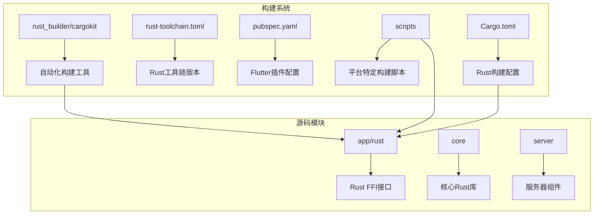
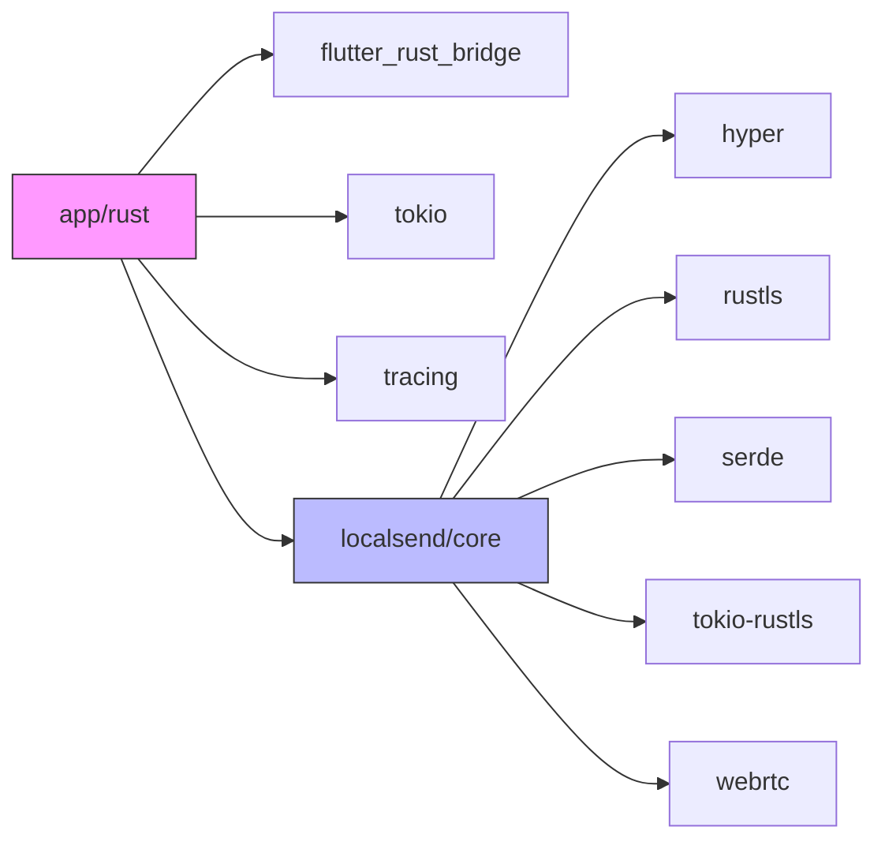
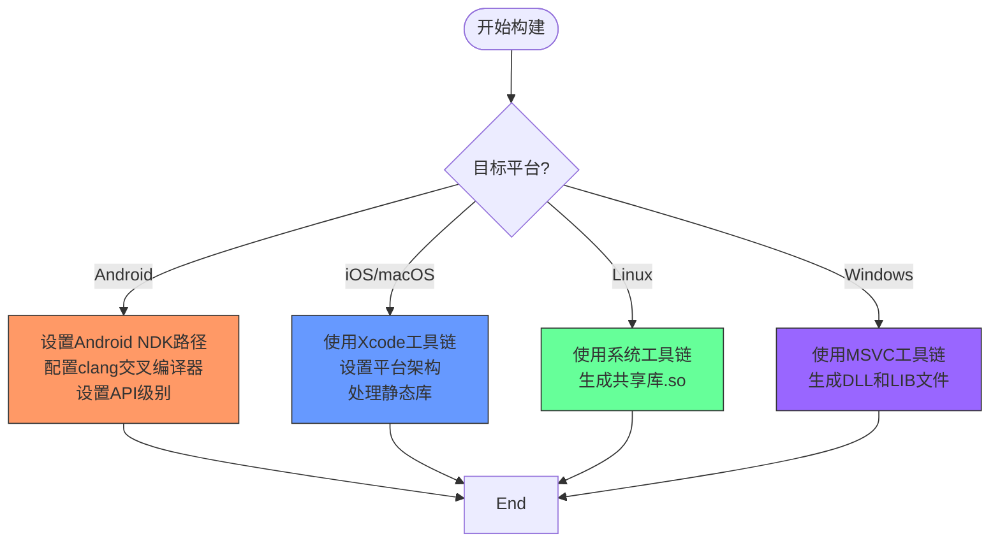
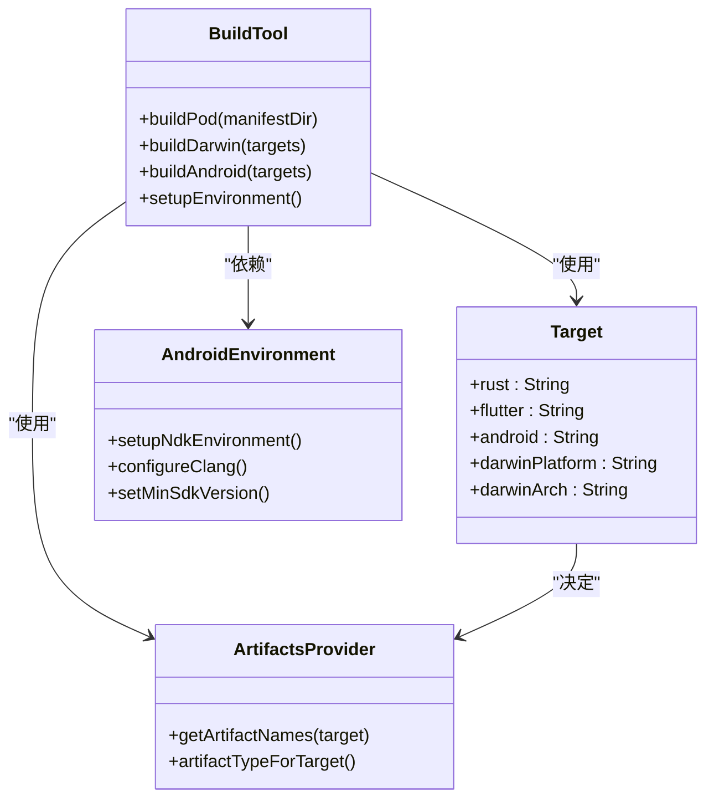
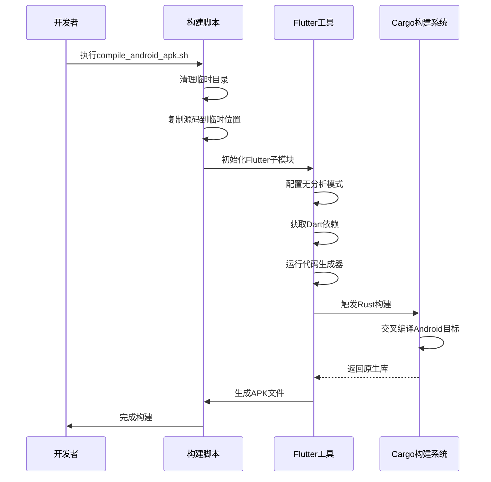
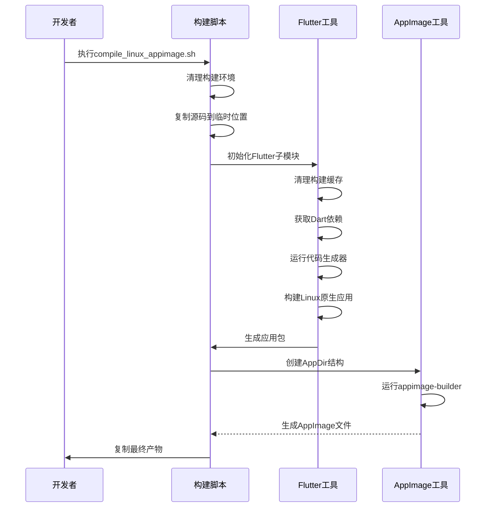
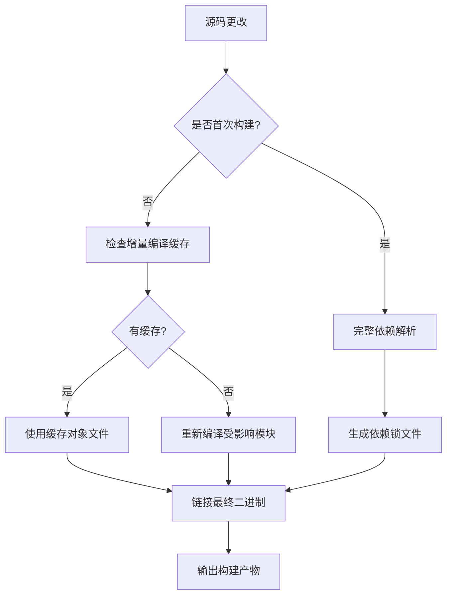

# 构建配置

<cite>
**本文档中引用的文件**  
- [Cargo.toml](file://app/rust/Cargo.toml)
- [rust-toolchain.toml](file://app/rust-toolchain.toml)
- [pubspec.yaml](file://app/rust_builder/pubspec.yaml)
- [compile_android_apk.sh](file://scripts/compile_android_apk.sh)
- [compile_linux_appimage.sh](file://scripts/compile_linux_appimage.sh)
- [build_pod.sh](file://app/rust_builder/cargokit/build_pod.sh)
- [core/Cargo.toml](file://core/Cargo.toml)
- [server/Cargo.toml](file://server/Cargo.toml)
</cite>

## 目录
1. [简介](#简介)
2. [项目结构](#项目结构)
3. [核心构建组件](#核心构建组件)
4. [Rust依赖管理](#rust依赖管理)
5. [跨平台交叉编译配置](#跨平台交叉编译配置)
6. [rust_builder/cargokit组件分析](#rust_buildercargokit组件分析)
7. [构建脚本使用指南](#构建脚本使用指南)
8. [构建优化策略](#构建优化策略)
9. [添加新依赖和自定义构建步骤](#添加新依赖和自定义构建步骤)
10. [常见构建错误解决方案](#常见构建错误解决方案)
11. [结论](#结论)

## 简介
本文件详细说明了LocalSend项目的构建配置，重点介绍了Rust代码的构建流程、跨平台编译设置以及自动化构建工具。文档涵盖了从依赖管理到平台特定编译问题的完整构建生态系统。

## 项目结构
LocalSend项目采用模块化架构，将Rust核心逻辑与Flutter前端分离，通过FFI（外部函数接口）进行集成。主要构建相关组件分布在多个目录中，形成了清晰的职责划分。

**Diagram sources**
- [app/rust/Cargo.toml](file://app/rust/Cargo.toml)
- [app/rust_builder/pubspec.yaml](file://app/rust_builder/pubspec.yaml)
- [scripts/compile_android_apk.sh](file://scripts/compile_android_apk.sh)

**Section sources**
- [app/rust/Cargo.toml](file://app/rust/Cargo.toml)
- [app/rust_builder/pubspec.yaml](file://app/rust_builder/pubspec.yaml)

## 核心构建组件
项目构建系统由多个核心组件组成，包括Cargo配置、Cargokit集成工具和平台特定的构建脚本。这些组件协同工作，实现了Rust代码与Flutter应用的无缝集成。

**Section sources**
- [app/rust/Cargo.toml](file://app/rust/Cargo.toml)
- [app/rust_builder/pubspec.yaml](file://app/rust_builder/pubspec.yaml)
- [app/rust_builder/cargokit/build_pod.sh](file://app/rust_builder/cargokit/build_pod.sh)

## Rust依赖管理
Rust依赖通过Cargo.toml文件进行管理，项目采用了分层依赖策略，将核心功能与平台特定功能分离。

### 应用层Rust依赖
应用层的Cargo.toml定义了与Flutter集成所需的关键依赖，包括flutter_rust_bridge用于FFI绑定，以及tokio和tracing等异步运行时和日志组件。

### 核心库依赖
核心库（core模块）包含了项目的主要业务逻辑，其依赖更为丰富，包括网络通信（hyper）、加密（rustls）、序列化（serde）等特性，通过功能特性（features）进行条件编译控制。

**Diagram sources**
- [app/rust/Cargo.toml](file://app/rust/Cargo.toml)
- [core/Cargo.toml](file://core/Cargo.toml)

**Section sources**
- [app/rust/Cargo.toml](file://app/rust/Cargo.toml)
- [core/Cargo.toml](file://core/Cargo.toml)
- [server/Cargo.toml](file://server/Cargo.toml)

## 跨平台交叉编译配置
项目支持多种平台的交叉编译，通过rust-toolchain.toml和Cargokit工具实现平台特定的构建配置。

### 目标三元组配置
项目预定义了多个目标三元组，涵盖了主要移动和桌面平台：

- Android: `aarch64-linux-android`, `armv7-linux-androideabi`, `x86_64-linux-android`
- iOS: `aarch64-apple-ios`, `x86_64-apple-ios`
- macOS: `aarch64-apple-darwin`, `x86_64-apple-darwin`
- Linux: `aarch64-unknown-linux-gnu`, `x86_64-unknown-linux-gnu`
- Windows: `x86_64-pc-windows-msvc`

### 平台特定编译选项
不同平台有不同的编译选项和要求：

**Diagram sources**
- [app/rust-toolchain.toml](file://app/rust-toolchain.toml)
- [app/rust_builder/cargokit/build_pod.sh](file://app/rust_builder/cargokit/build_pod.sh)
- [app/rust_builder/cargokit/build_tool/lib/src/target.dart](file://app/rust_builder/cargokit/build_tool/lib/src/target.dart)

**Section sources**
- [app/rust-toolchain.toml](file://app/rust-toolchain.toml)
- [app/rust_builder/cargokit/build_pod.sh](file://app/rust_builder/cargokit/build_pod.sh)

## rust_builder/cargokit组件分析
rust_builder/cargokit组件是Rust与Flutter集成的关键桥梁，负责自动化处理Rust代码的构建和集成过程。

### 组件架构
cargokit包含多个子组件，共同完成构建任务：

**Diagram sources**
- [app/rust_builder/cargokit/build_pod.sh](file://app/rust_builder/cargokit/build_pod.sh)
- [app/rust_builder/cargokit/build_tool/lib/src/target.dart](file://app/rust_builder/cargokit/build_tool/lib/src/target.dart)
- [app/rust_builder/cargokit/build_tool/lib/src/android_environment.dart](file://app/rust_builder/cargokit/build_tool/lib/src/android_environment.dart)

**Section sources**
- [app/rust_builder/cargokit/build_pod.sh](file://app/rust_builder/cargokit/build_pod.sh)
- [app/rust_builder/cargokit/README](file://app/rust_builder/cargokit/README)

## 构建脚本使用指南
项目提供了一系列构建脚本，用于不同平台的编译任务。

### Android APK构建脚本
compile_android_apk.sh脚本遵循可重现构建原则，确保构建结果的一致性：

**Diagram sources**
- [scripts/compile_android_apk.sh](file://scripts/compile_android_apk.sh)

**Section sources**
- [scripts/compile_android_apk.sh](file://scripts/compile_android_apk.sh)

### Linux AppImage构建脚本
compile_linux_appimage.sh脚本用于创建Linux平台的AppImage包：

**Diagram sources**
- [scripts/compile_linux_appimage.sh](file://scripts/compile_linux_appimage.sh)

**Section sources**
- [scripts/compile_linux_appimage.sh](file://scripts/compile_linux_appimage.sh)

## 构建优化策略
项目采用了多种构建优化策略，以提高开发效率和构建性能。

### 增量编译
Cargo的增量编译功能被充分利用，只重新编译修改过的代码模块，大大减少了构建时间。

### 缓存策略
构建系统使用多层缓存机制：

**Diagram sources**
- [app/rust/Cargo.toml](file://app/rust/Cargo.toml)
- [core/Cargo.toml](file://core/Cargo.toml)

**Section sources**
- [app/rust/Cargo.toml](file://app/rust/Cargo.toml)
- [core/Cargo.toml](file://core/Cargo.toml)

## 添加新依赖和自定义构建步骤
扩展项目功能需要添加新的Rust依赖或自定义构建步骤。

### 添加Rust依赖
添加新依赖的流程如下：

1. 在相应Cargo.toml文件中添加依赖项
2. 指定版本约束和功能特性
3. 运行`cargo build`验证依赖解析
4. 在代码中导入和使用新依赖

### 自定义构建步骤
自定义构建可以通过以下方式实现：

- 修改cargokit的构建脚本
- 添加Cargo构建脚本（build.rs）
- 扩展Flutter插件的构建逻辑

**Section sources**
- [app/rust/Cargo.toml](file://app/rust/Cargo.toml)
- [core/Cargo.toml](file://core/Cargo.toml)
- [app/rust_builder/cargokit/build_pod.sh](file://app/rust_builder/cargokit/build_pod.sh)

## 常见构建错误解决方案
构建过程中可能遇到各种错误，以下是常见问题及其解决方案。

### 链接器错误
链接器错误通常由平台特定的符号或库缺失引起：

- **Android NDK未正确配置**：确保NDK路径正确，环境变量设置完整
- **iOS架构不匹配**：检查Xcode构建设置中的有效架构
- **Linux库依赖缺失**：安装必要的系统开发包

### 平台特定编译问题
不同平台有其独特的编译挑战：

- **Windows MSVC版本不兼容**：确保Visual Studio版本与Rust工具链兼容
- **macOS签名问题**：正确配置代码签名证书
- **Android API级别问题**：确保目标API级别与设备兼容

**Section sources**
- [scripts/compile_android_apk.sh](file://scripts/compile_android_apk.sh)
- [scripts/compile_linux_appimage.sh](file://scripts/compile_linux_appimage.sh)
- [app/rust_builder/cargokit/build_pod.sh](file://app/rust_builder/cargokit/build_pod.sh)

## 结论
LocalSend项目的构建系统设计精良，通过Cargo、Cargokit和自定义脚本的组合，实现了跨平台Rust代码的高效构建和集成。理解这一构建系统对于贡献代码和扩展功能至关重要。