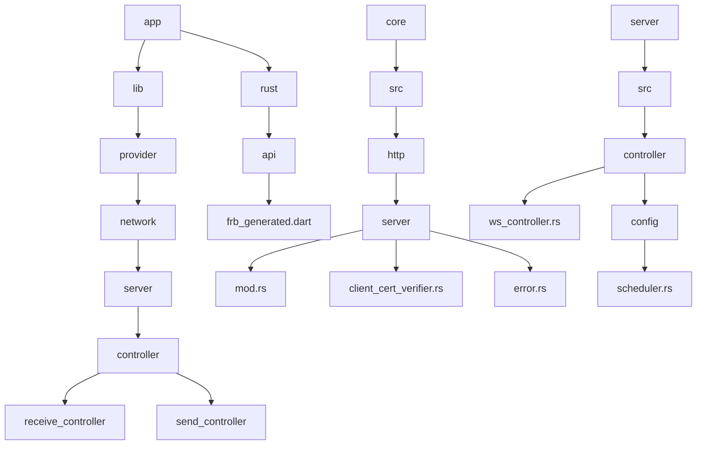
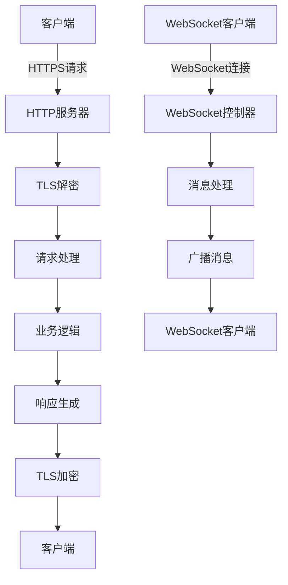
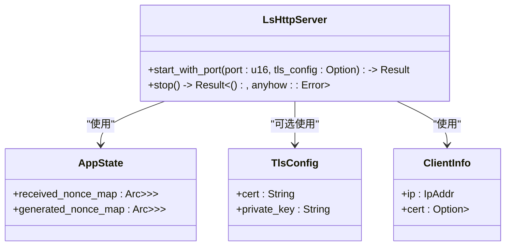
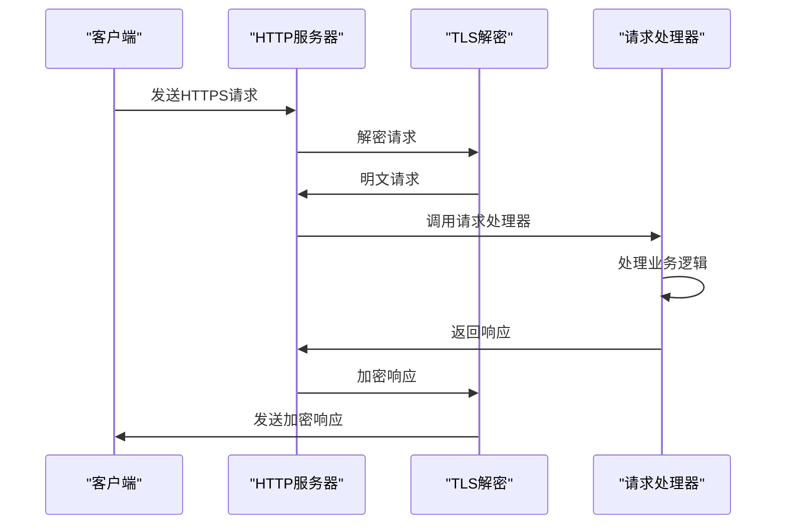
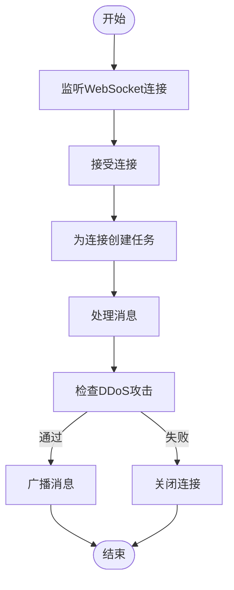
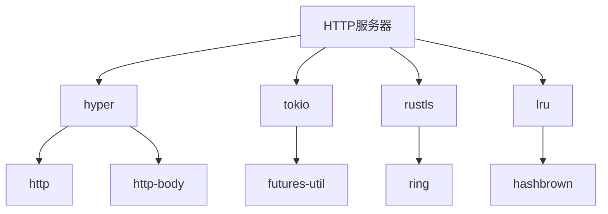

# HTTP服务器实现

<cite>
**本文档引用的文件**   
- [mod.rs](file://core/src/http/server/mod.rs)
- [client_cert_verifier.rs](file://core/src/http/server/client_cert_verifier.rs)
- [error.rs](file://core/src/http/server/error.rs)
- [dto.rs](file://core/src/http/dto.rs)
- [cert.rs](file://core/src/crypto/cert.rs)
- [ws_controller.rs](file://server/src/controller/ws_controller.rs)
- [scheduler.rs](file://server/src/config/scheduler.rs)
</cite>

## 目录
1. [介绍](#介绍)
2. [项目结构](#项目结构)
3. [核心组件](#核心组件)
4. [架构概述](#架构概述)
5. [详细组件分析](#详细组件分析)
6. [依赖分析](#依赖分析)
7. [性能考虑](#性能考虑)
8. [故障排除指南](#故障排除指南)
9. [结论](#结论)

## 介绍
本项目实现了一个基于Rust的HTTP服务器，用于处理文件传输、设备注册和状态查询等请求。服务器使用hyper框架进行异步I/O处理，并通过TLS加密确保通信安全。客户端证书验证机制用于验证连接的客户端身份，确保只有授权设备可以访问服务器。服务器还实现了DDoS防护策略，通过限制每个IP地址的连接数和请求频率来防止恶意攻击。

## 项目结构
该项目的结构清晰，主要分为以下几个部分：
- `app`：包含应用程序的前端代码，使用Flutter框架开发。
- `core`：包含核心逻辑，包括HTTP服务器、客户端、数据传输对象（DTO）等。
- `server`：包含服务器端的配置和控制器，用于处理WebSocket连接和调度任务。
- `common`：包含通用模型和工具，如设备信息、发现方法等。

**图表来源**
- [mod.rs](file://core/src/http/server/mod.rs)
- [ws_controller.rs](file://server/src/controller/ws_controller.rs)

**章节来源**
- [mod.rs](file://core/src/http/server/mod.rs)
- [ws_controller.rs](file://server/src/controller/ws_controller.rs)

## 核心组件
HTTP服务器的核心组件包括：
- `LsHttpServer`：负责启动和停止HTTP服务器。
- `TlsConfig`：配置TLS证书和私钥。
- `AppState`：管理应用状态，包括接收到的nonce和生成的nonce。
- `ClientInfo`：存储客户端信息，如IP地址和证书。
- `AppError`：定义应用错误类型。
- `JsonResponse`：用于构建JSON响应。

**章节来源**
- [mod.rs](file://core/src/http/server/mod.rs)
- [error.rs](file://core/src/http/server/error.rs)

## 架构概述
HTTP服务器的架构基于Rust的异步编程模型，使用Tokio作为运行时。服务器通过hyper框架处理HTTP请求，并使用rustls进行TLS加密。客户端证书验证通过自定义的`CustomClientCertVerifier`实现，确保只有持有有效证书的客户端可以连接。服务器还实现了WebSocket控制器，用于处理实时通信。

**图表来源**
- [mod.rs](file://core/src/http/server/mod.rs)
- [ws_controller.rs](file://server/src/controller/ws_controller.rs)

## 详细组件分析

### HTTP服务器分析
HTTP服务器使用`hyper`框架处理HTTP请求，支持异步I/O操作。服务器通过`tokio::net::TcpListener`监听指定端口，并为每个连接创建一个新的任务来处理请求。TLS配置通过`rustls`库实现，支持客户端证书验证。

#### 对于对象导向组件：

**图表来源**
- [mod.rs](file://core/src/http/server/mod.rs)

#### 对于API/服务组件：

**图表来源**
- [mod.rs](file://core/src/http/server/mod.rs)

### WebSocket控制器分析
WebSocket控制器负责处理WebSocket连接，支持实时通信。控制器通过`tokio_tungstenite`库处理WebSocket协议，并使用`mpsc`通道进行消息传递。每个连接的客户端都有一个独立的任务来处理消息，确保高并发性能。

#### 对于复杂逻辑组件：

**图表来源**
- [ws_controller.rs](file://server/src/controller/ws_controller.rs)

**章节来源**
- [ws_controller.rs](file://server/src/controller/ws_controller.rs)

## 依赖分析
HTTP服务器依赖于多个Rust库，包括`hyper`、`tokio`、`rustls`等。这些库提供了异步I/O、TLS加密、HTTP协议处理等功能。服务器还依赖于`lru`库实现LRU缓存，用于存储nonce等临时数据。

**图表来源**
- [Cargo.toml](file://core/Cargo.toml)
- [Cargo.toml](file://server/Cargo.toml)

**章节来源**
- [Cargo.toml](file://core/Cargo.toml)
- [Cargo.toml](file://server/Cargo.toml)

## 性能考虑
HTTP服务器通过异步I/O和多任务处理实现高并发性能。服务器使用`tokio`运行时，支持数千个并发连接。为了防止DDoS攻击，服务器限制了每个IP地址的连接数和请求频率。此外，服务器使用LRU缓存存储nonce等临时数据，减少数据库查询开销。

**章节来源**
- [ws_controller.rs](file://server/src/controller/ws_controller.rs)
- [scheduler.rs](file://server/src/config/scheduler.rs)

## 故障排除指南
如果遇到连接问题，首先检查服务器是否正在运行，并确保端口未被占用。如果使用TLS，确保证书和私钥文件正确无误。对于WebSocket连接问题，检查客户端是否正确处理了WebSocket协议。如果遇到性能问题，可以增加服务器的资源，如CPU和内存。

**章节来源**
- [mod.rs](file://core/src/http/server/mod.rs)
- [ws_controller.rs](file://server/src/controller/ws_controller.rs)

## 结论
本项目实现了一个功能完整、安全可靠的HTTP服务器，支持文件传输、设备注册和状态查询等功能。服务器使用Rust语言开发，具有高性能和高安全性。通过异步I/O和多任务处理，服务器能够处理大量并发连接。客户端证书验证和DDoS防护策略确保了通信的安全性。未来可以进一步优化性能，支持更多功能，如文件分片上传、断点续传等。