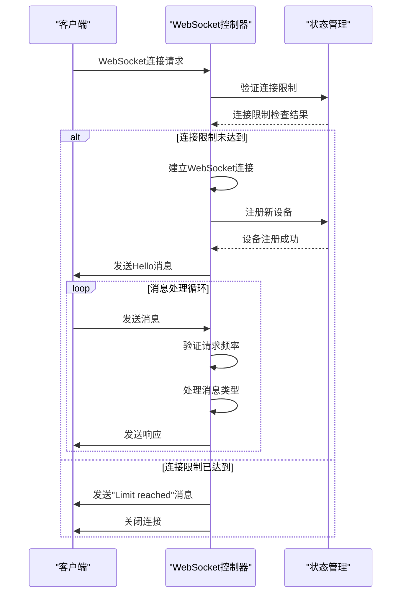
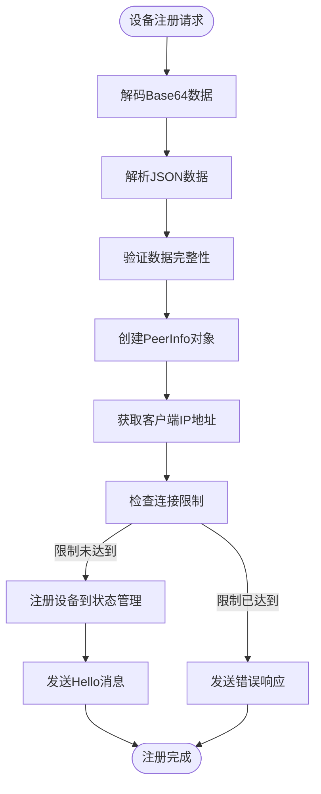
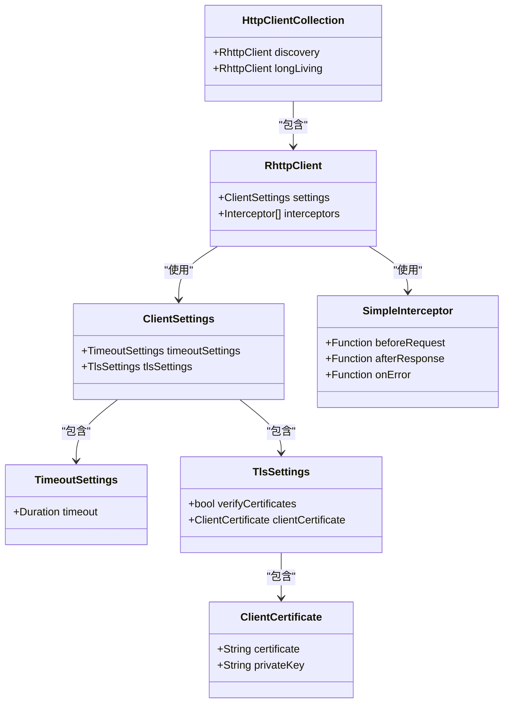
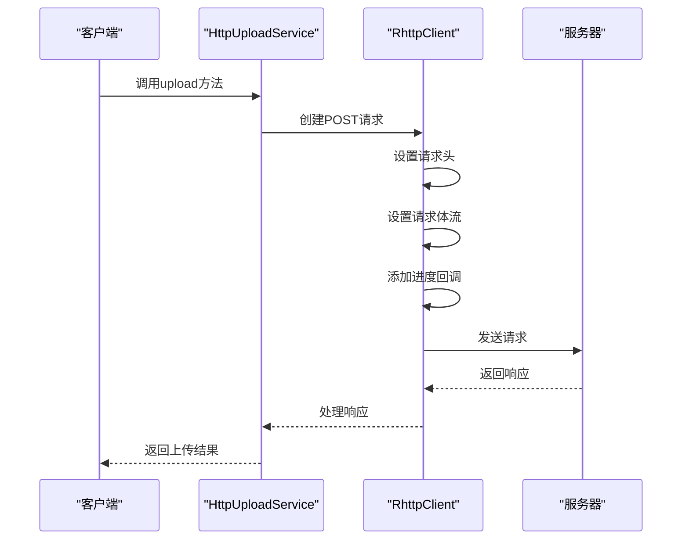
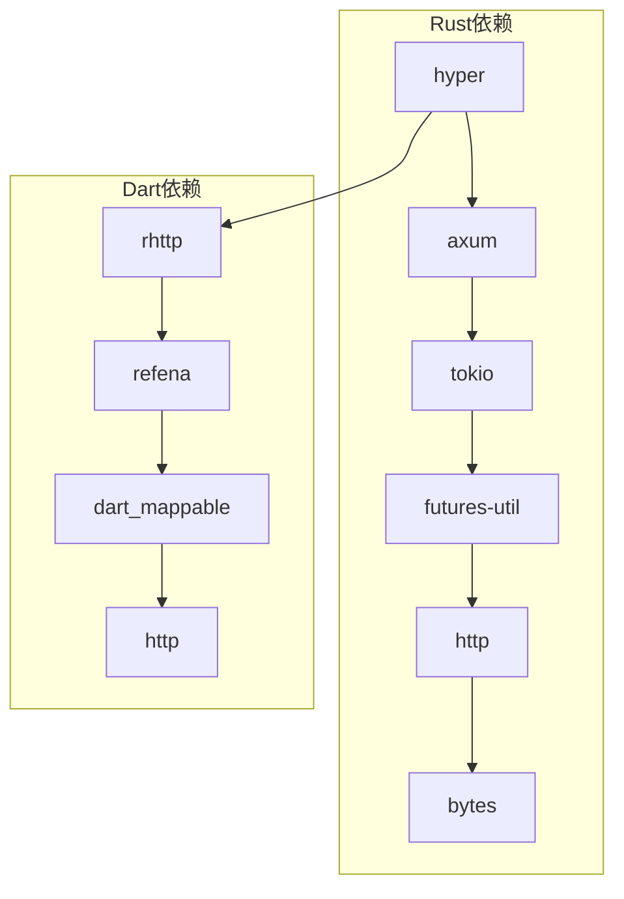

# HTTP请求处理

<cite>
**本文档引用的文件**
- [main.rs](file://server/src/main.rs)
- [ws_controller.rs](file://server/src/controller/ws_controller.rs)
- [state.rs](file://server/src/config/state.rs)
- [init.rs](file://server/src/config/init.rs)
- [error.rs](file://server/src/config/error.rs)
- [mod.rs](file://core/src/http/server/mod.rs)
- [collect_to_json.rs](file://core/src/http/server/collect_to_json.rs)
- [http_upload.dart](file://common/lib/src/task/upload/http_upload.dart)
- [http_provider.dart](file://app/lib/provider/http_provider.dart)
- [api_route_builder.dart](file://common/lib/api_route_builder.dart)
- [rhttp.dart](file://app/lib/util/rhttp.dart)
- [register_dto.dart](file://common/lib/model/dto/register_dto.dart)
- [discovery.rs](file://core/src/model/discovery.rs)
</cite>

## 目录
1. [项目结构](#项目结构)
2. [核心组件](#核心组件)
3. [架构概述](#架构概述)
4. [详细组件分析](#详细组件分析)
5. [依赖分析](#依赖分析)
6. [性能考虑](#性能考虑)
7. [故障排除指南](#故障排除指南)
8. [结论](#结论)

## 项目结构

LocalSend项目的HTTP请求处理机制主要由Rust后端服务器和Flutter前端应用共同实现。服务器端使用`hyper`框架处理HTTP请求，而客户端通过`rhttp`库进行HTTP通信。

```mermaid
graph TB
subgraph "服务器端"
A[main.rs] --> B[ws_controller.rs]
B --> C[state.rs]
B --> D[init.rs]
B --> E[error.rs]
end
subgraph "客户端"
F[http_upload.dart] --> G[http_provider.dart]
G --> H[rhttp.dart]
F --> I[api_route_builder.dart]
end
A < --> F
```

**图表来源**
- [main.rs](file://server/src/main.rs#L1-L32)
- [ws_controller.rs](file://server/src/controller/ws_controller.rs#L1-L370)
- [http_upload.dart](file://common/lib/src/task/upload/http_upload.dart#L1-L42)

**本节来源**
- [main.rs](file://server/src/main.rs#L1-L32)
- [ws_controller.rs](file://server/src/controller/ws_controller.rs#L1-L370)

## 核心组件

LocalSend的HTTP请求处理机制主要包含以下几个核心组件：

1. **WebSocket控制器**：处理设备注册、状态查询和文件传输等核心请求
2. **路由系统**：基于`axum`框架实现的端点映射
3. **状态管理**：维护连接设备的状态和请求计数
4. **错误处理**：统一的错误响应机制
5. **客户端HTTP提供者**：管理HTTP客户端实例和配置

这些组件共同构成了LocalSend的HTTP请求处理管道，实现了设备间的文件传输和状态同步功能。

**本节来源**
- [main.rs](file://server/src/main.rs#L1-L32)
- [ws_controller.rs](file://server/src/controller/ws_controller.rs#L1-L370)
- [http_provider.dart](file://app/lib/provider/http_provider.dart#L1-L52)

## 架构概述

LocalSend的HTTP请求处理架构采用分层设计，从底层的`hyper`服务器到上层的`axum`路由系统，再到应用层的WebSocket控制器，形成了一个完整的请求处理管道。

```mermaid
graph TB
subgraph "HTTP服务器层"
A[hyper] --> B[axum]
end
subgraph "应用层"
B --> C[WebSocket控制器]
C --> D[状态管理]
C --> E[错误处理]
end
subgraph "客户端层"
F[HTTP客户端] --> G[请求构建器]
G --> H[API路由]
end
C < --> F
```

**图表来源**
- [main.rs](file://server/src/main.rs#L1-L32)
- [mod.rs](file://core/src/http/server/mod.rs#L1-L366)
- [http_provider.dart](file://app/lib/provider/http_provider.dart#L1-L52)

**本节来源**
- [main.rs](file://server/src/main.rs#L1-L32)
- [mod.rs](file://core/src/http/server/mod.rs#L1-L366)

## 详细组件分析

### WebSocket控制器分析

WebSocket控制器是LocalSend HTTP请求处理的核心组件，负责处理设备注册、状态查询和文件传输等核心请求。

#### WebSocket处理流程


**图表来源**
- [ws_controller.rs](file://server/src/controller/ws_controller.rs#L1-L370)
- [state.rs](file://server/src/config/state.rs#L1-L33)

#### 设备注册流程


**图表来源**
- [ws_controller.rs](file://server/src/controller/ws_controller.rs#L1-L370)
- [register_dto.dart](file://common/lib/model/dto/register_dto.dart#L1-L48)

**本节来源**
- [ws_controller.rs](file://server/src/controller/ws_controller.rs#L1-L370)
- [register_dto.dart](file://common/lib/model/dto/register_dto.dart#L1-L48)

### 客户端HTTP提供者分析

客户端HTTP提供者负责管理HTTP客户端实例和配置，为文件上传和下载提供支持。

#### HTTP客户端配置


**图表来源**
- [http_provider.dart](file://app/lib/provider/http_provider.dart#L1-L52)
- [rhttp.dart](file://app/lib/util/rhttp.dart#L1-L85)

#### 文件上传流程


**图表来源**
- [http_upload.dart](file://common/lib/src/task/upload/http_upload.dart#L1-L42)
- [rhttp.dart](file://app/lib/util/rhttp.dart#L1-L85)

**本节来源**
- [http_provider.dart](file://app/lib/provider/http_provider.dart#L1-L52)
- [http_upload.dart](file://common/lib/src/task/upload/http_upload.dart#L1-L42)

## 依赖分析

LocalSend的HTTP请求处理机制依赖于多个关键的Rust和Dart库，这些库共同构成了系统的基础设施。



**图表来源**
- [Cargo.toml](file://server/Cargo.toml)
- [pubspec.yaml](file://app/pubspec.yaml)

**本节来源**
- [Cargo.toml](file://server/Cargo.toml)
- [pubspec.yaml](file://app/pubspec.yaml)

## 性能考虑

LocalSend在HTTP请求处理方面进行了多项性能优化，以确保文件传输的高效性和稳定性。

1. **连接限制**：通过`MAX_CONNECTIONS`常量限制每个IP地址的最大连接数，防止资源耗尽
2. **请求频率限制**：通过`MAX_REQUESTS_PER_IP_PER_HOUR`环境变量限制每个IP地址每小时的请求数量，防止DDoS攻击
3. **异步处理**：使用`tokio`运行时和`async/await`语法实现非阻塞I/O操作，提高并发处理能力
4. **状态管理**：使用`Arc<Mutex<HashMap>>`数据结构高效管理连接状态，减少锁竞争
5. **内存优化**：使用`LruCache`缓存最近使用的nonce，避免内存无限增长

这些性能优化措施确保了LocalSend在高并发场景下的稳定性和响应速度。

**本节来源**
- [ws_controller.rs](file://server/src/controller/ws_controller.rs#L1-L370)
- [mod.rs](file://core/src/http/server/mod.rs#L1-L366)

## 故障排除指南

在使用LocalSend的HTTP请求处理功能时，可能会遇到以下常见问题：

1. **连接被拒绝**：检查服务器IP和端口配置，确保防火墙允许相应端口的通信
2. **文件上传失败**：检查网络连接稳定性，确保客户端和服务器之间的网络通畅
3. **设备无法发现**：确认设备在同一网络中，检查多播设置是否正确
4. **性能下降**：监控系统资源使用情况，检查是否有过多的并发连接
5. **安全证书错误**：确保客户端和服务器使用相同的证书配置

通过监控日志和系统状态，可以快速定位和解决这些问题。

**本节来源**
- [ws_controller.rs](file://server/src/controller/ws_controller.rs#L1-L370)
- [error.rs](file://server/src/config/error.rs#L1-L58)

## 结论

LocalSend的HTTP请求处理机制通过`hyper`和`axum`框架实现了高效、安全的设备间通信。系统采用分层架构，将底层的HTTP服务器与上层的应用逻辑分离，提高了代码的可维护性和可扩展性。WebSocket控制器作为核心组件，处理设备注册、状态查询和文件传输等关键功能，而客户端HTTP提供者则确保了文件上传和下载的可靠性。通过连接限制、请求频率控制和异步处理等性能优化措施，系统能够在高并发场景下保持稳定运行。整体设计充分考虑了安全性、性能和用户体验，为设备间的文件传输提供了可靠的解决方案。