# 安全验证

<cite>
**本文档引用的文件**
- [cert.rs](file://core/src/crypto/cert.rs)
- [token.rs](file://core/src/crypto/token.rs)
- [nonce.rs](file://core/src/crypto/nonce.rs)
- [client_cert_verifier.rs](file://core/src/http/server/client_cert_verifier.rs)
- [server/mod.rs](file://core/src/http/server/mod.rs)
- [client/mod.rs](file://core/src/http/client/mod.rs)
- [security_provider.dart](file://app/lib/provider/security_provider.dart)
- [stored_security_context.dart](file://common/lib/model/stored_security_context.dart)
- [security_helper.dart](file://app/lib/util/security_helper.dart)
- [logger.dart](file://common/lib/util/logger.dart)
</cite>

## 目录
1. [简介](#简介)
2. [项目结构](#项目结构)
3. [核心安全组件](#核心安全组件)
4. [架构概览](#架构概览)
5. [详细组件分析](#详细组件分析)
6. [依赖关系分析](#依赖关系分析)
7. [性能考虑](#性能考虑)
8. [故障排除指南](#故障排除指南)
9. [结论](#结论)

## 简介

LocalSend是一个跨平台的文件传输应用程序，采用基于TLS的双向认证机制确保通信安全。该系统实现了完整的安全验证流程，包括客户端证书验证、安全令牌生成与验证、防重放攻击保护以及会话固定攻击防护。本文档全面阐述了LocalSend的安全验证机制，为开发者和安全专家提供深入的技术参考。

## 项目结构

LocalSend的安全验证系统采用分层架构设计，主要分为以下几个层次：

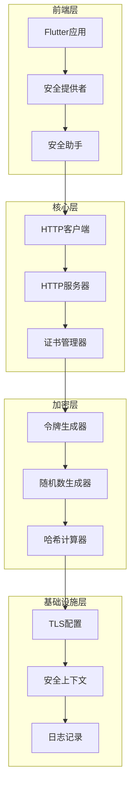

**图表来源**
- [security_provider.dart](file://app/lib/provider/security_provider.dart#L1-L35)
- [client/mod.rs](file://core/src/http/client/mod.rs#L1-L50)
- [server/mod.rs](file://core/src/http/server/mod.rs#L1-L50)

**章节来源**
- [security_provider.dart](file://app/lib/provider/security_provider.dart#L1-L35)
- [stored_security_context.dart](file://common/lib/model/stored_security_context.dart#L1-L26)

## 核心安全组件

### 证书验证系统

LocalSend实现了基于X.509标准的证书验证机制，支持自签名证书和公钥验证：

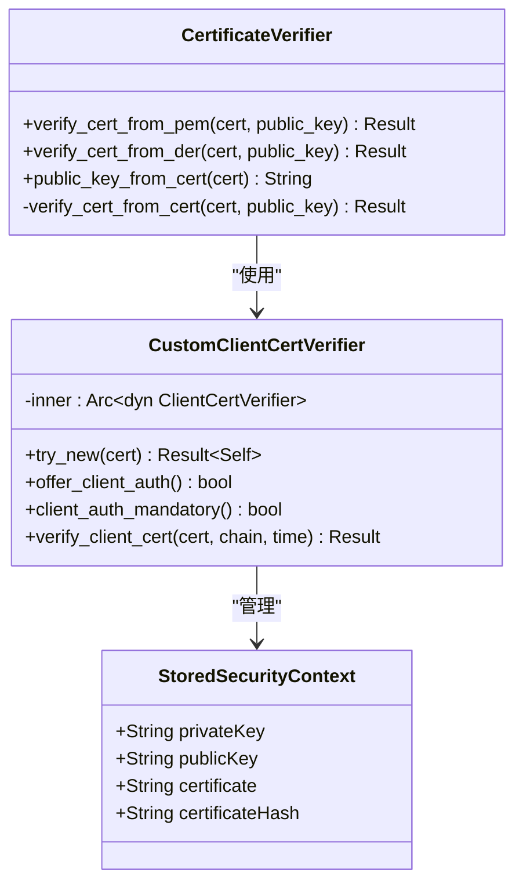

**图表来源**
- [cert.rs](file://core/src/crypto/cert.rs#L1-L50)
- [client_cert_verifier.rs](file://core/src/http/server/client_cert_verifier.rs#L1-L40)
- [stored_security_context.dart](file://common/lib/model/stored_security_context.dart#L1-L26)

### 安全令牌系统

安全令牌采用多部分结构，包含哈希方法、哈希值、盐值、签名方法和签名：

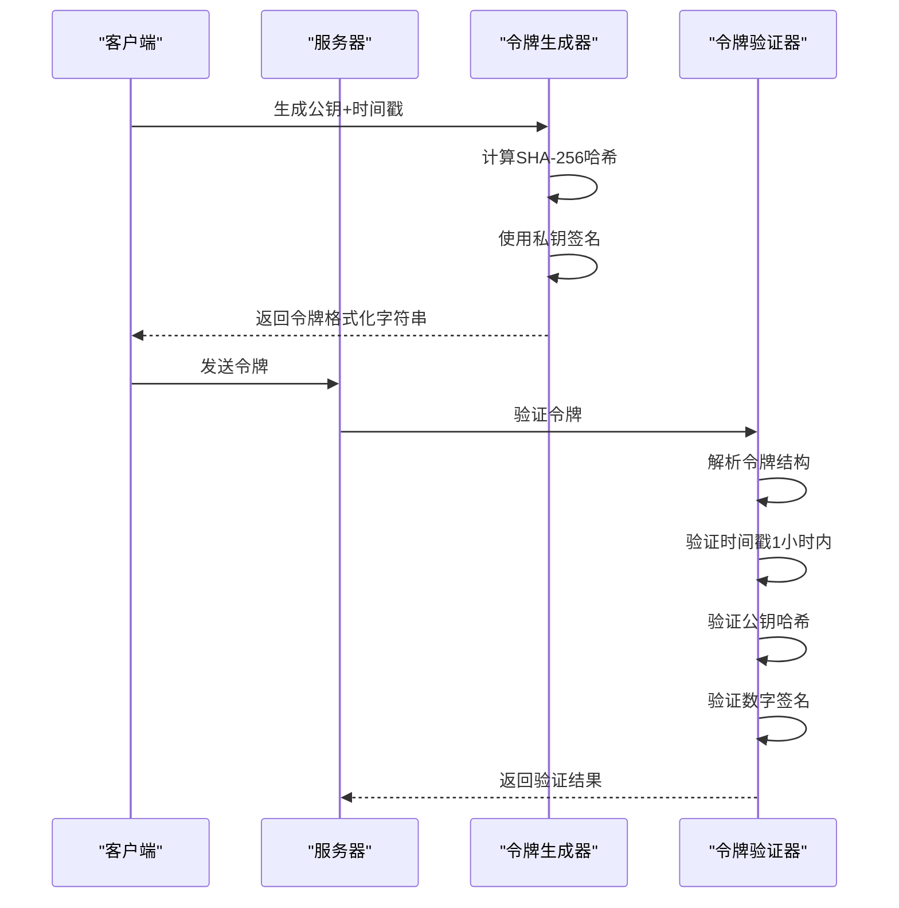

**图表来源**
- [token.rs](file://core/src/crypto/token.rs#L130-L180)
- [server/mod.rs](file://core/src/http/server/mod.rs#L310-L350)

**章节来源**
- [cert.rs](file://core/src/crypto/cert.rs#L1-L187)
- [token.rs](file://core/src/crypto/token.rs#L1-L255)
- [client_cert_verifier.rs](file://core/src/http/server/client_cert_verifier.rs#L1-L84)

## 架构概览

LocalSend的安全架构采用多层次防护策略，确保端到端的安全通信：

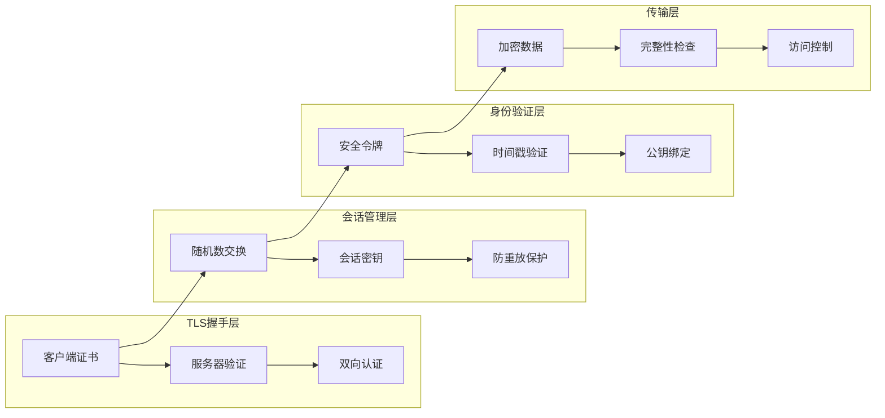

**图表来源**
- [server/mod.rs](file://core/src/http/server/mod.rs#L185-L230)
- [client/mod.rs](file://core/src/http/client/mod.rs#L42-L80)

## 详细组件分析

### 证书颁发与验证机制

#### 自签名证书生成

LocalSend使用自签名证书进行设备间认证，每个设备都拥有唯一的证书对：

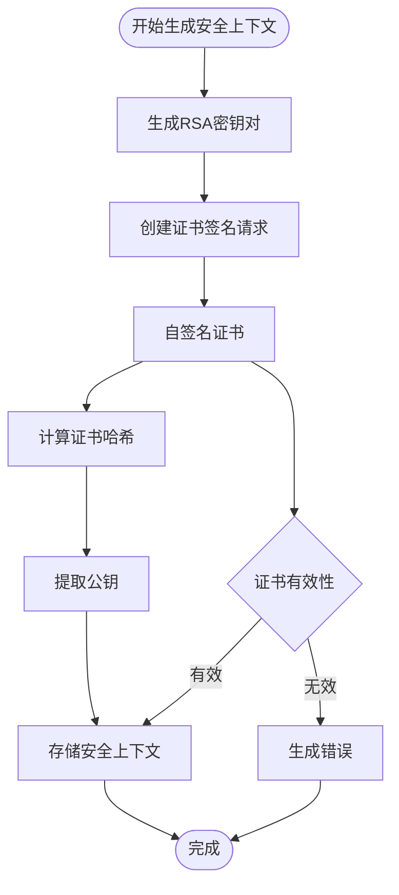

**图表来源**
- [security_helper.dart](file://app/lib/util/security_helper.dart#L10-L30)
- [stored_security_context.dart](file://common/lib/model/stored_security_context.dart#L1-L26)

#### 证书验证流程

证书验证过程包含多个安全检查点：

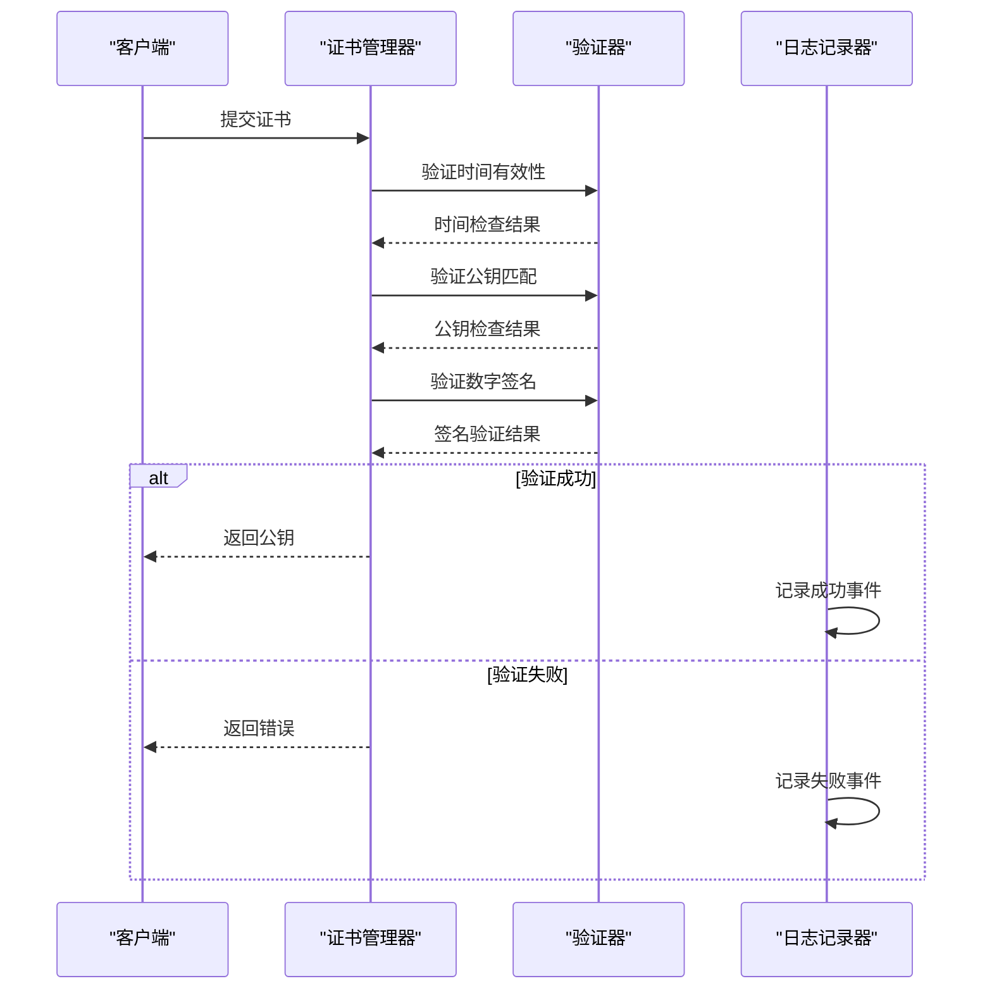

**图表来源**
- [cert.rs](file://core/src/crypto/cert.rs#L25-L50)
- [client_cert_verifier.rs](file://core/src/http/server/client_cert_verifier.rs#L45-L65)

**章节来源**
- [cert.rs](file://core/src/crypto/cert.rs#L1-L187)
- [security_helper.dart](file://app/lib/util/security_helper.dart#L1-L72)

### 双向TLS认证实现

#### 服务器端证书验证

服务器端实现了严格的客户端证书验证机制：

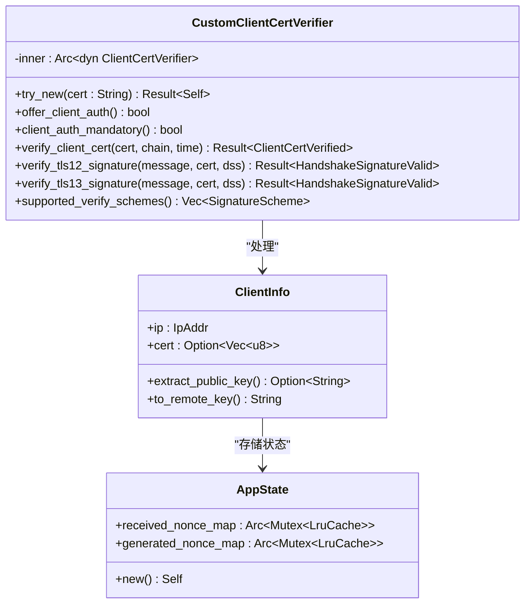

**图表来源**
- [client_cert_verifier.rs](file://core/src/http/server/client_cert_verifier.rs#L10-L84)
- [server/mod.rs](file://core/src/http/server/mod.rs#L200-L250)

#### 客户端证书验证

客户端通过TLS连接建立时自动验证服务器证书：

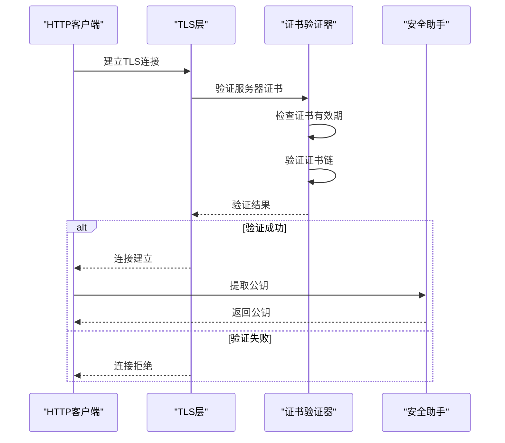

**图表来源**
- [client/mod.rs](file://core/src/http/client/mod.rs#L268-L293)
- [server/mod.rs](file://core/src/http/server/mod.rs#L140-L180)

**章节来源**
- [client_cert_verifier.rs](file://core/src/http/server/client_cert_verifier.rs#L1-L84)
- [server/mod.rs](file://core/src/http/server/mod.rs#L185-L233)
- [client/mod.rs](file://core/src/http/client/mod.rs#L42-L80)

### 安全令牌生成与验证

#### 令牌结构设计

安全令牌采用标准化的分隔符格式，确保跨平台兼容性：

| 组件 | 描述 | 示例值 |
|------|------|--------|
| 哈希方法 | 使用的哈希算法 | `sha256` |
| 哈希值 | 公钥和时间戳的SHA-256哈希 | Base64编码的32字节 |
| 盐值 | Unix时间戳的小端表示 | Base64编码的8字节 |
| 签名方法 | 数字签名算法 | `ed25519` |
| 签名 | 使用私钥对哈希值的签名 | Base64编码的64字节 |

#### 时间戳验证机制

令牌包含内置的时间戳验证，防止重放攻击：

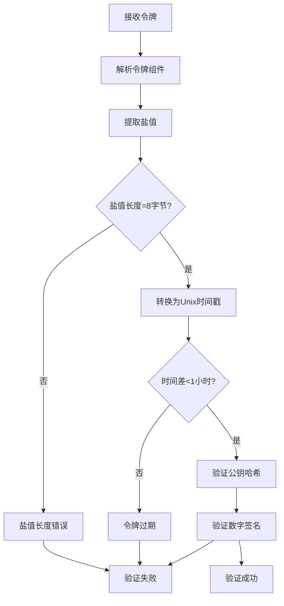

**图表来源**
- [token.rs](file://core/src/crypto/token.rs#L140-L170)

#### 随机数管理

系统使用LRU缓存管理随机数，防止重放攻击：

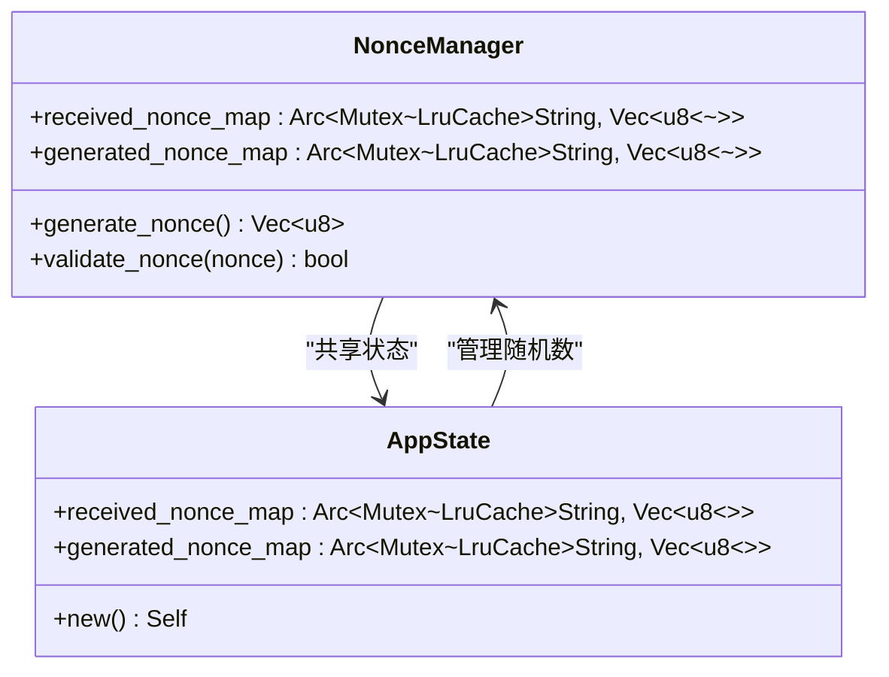

**图表来源**
- [server/mod.rs](file://core/src/http/server/mod.rs#L25-L40)
- [nonce.rs](file://core/src/crypto/nonce.rs#L1-L12)

**章节来源**
- [token.rs](file://core/src/crypto/token.rs#L130-L200)
- [nonce.rs](file://core/src/crypto/nonce.rs#L1-L12)
- [server/mod.rs](file://core/src/http/server/mod.rs#L310-L350)

### 防重放攻击和会话固定攻击

#### 随机数交换协议

系统实现了双向随机数交换机制，确保每次会话的唯一性：

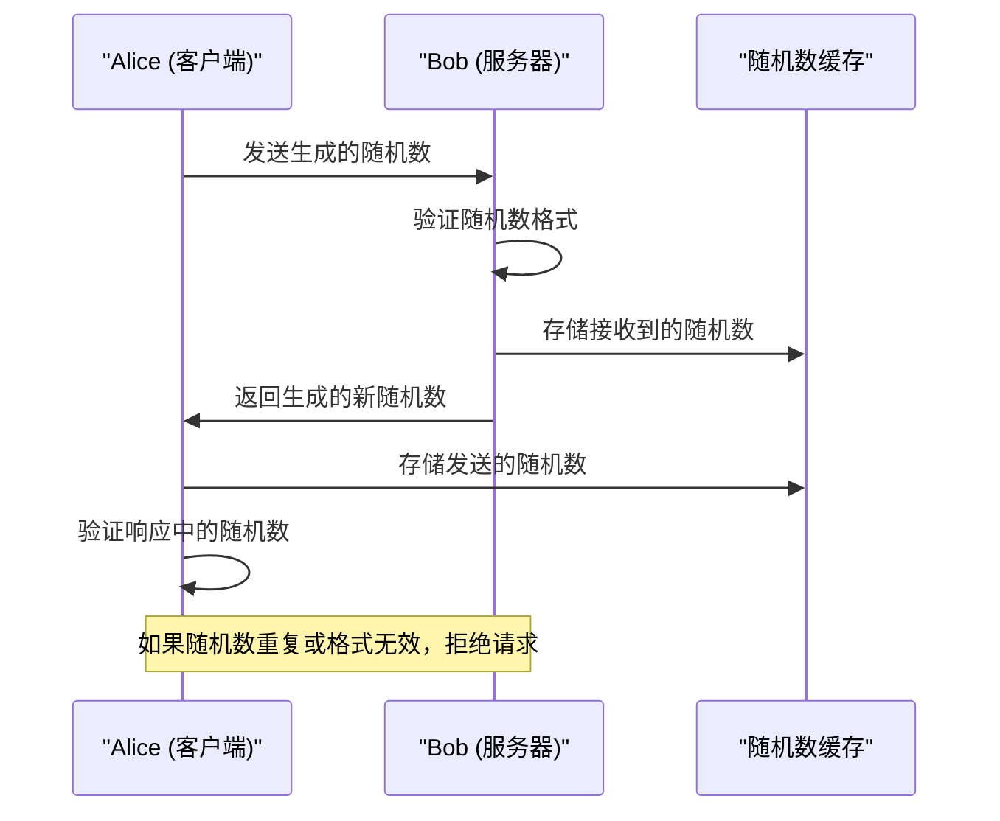

**图表来源**
- [server/mod.rs](file://core/src/http/server/mod.rs#L310-L350)
- [client/mod.rs](file://core/src/http/client/mod.rs#L60-L100)

#### 会话固定攻击防护

通过以下机制防止会话固定攻击：

1. **动态随机数生成**：每次会话使用32字节的强随机数
2. **LRU缓存限制**：最多缓存200个随机数，防止内存耗尽
3. **即时验证**：接收到随机数后立即验证并存储
4. **双向确认**：客户端和服务器各自生成和验证随机数

**章节来源**
- [server/mod.rs](file://core/src/http/server/mod.rs#L310-L350)
- [client/mod.rs](file://core/src/http/client/mod.rs#L60-L100)

### 安全上下文管理

#### 上下文生命周期

安全上下文在整个应用生命周期中持续存在：

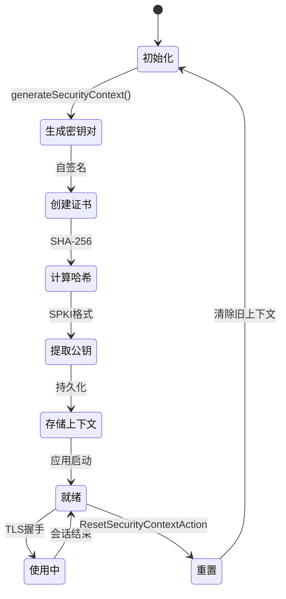

**图表来源**
- [security_provider.dart](file://app/lib/provider/security_provider.dart#L25-L35)
- [stored_security_context.dart](file://common/lib/model/stored_security_context.dart#L1-L26)

#### 密钥轮换策略

虽然当前版本不支持自动密钥轮换，但系统设计支持未来的扩展：

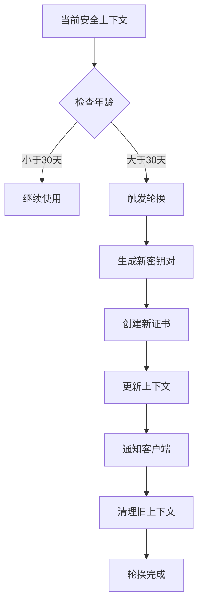

**章节来源**
- [security_provider.dart](file://app/lib/provider/security_provider.dart#L1-L35)
- [stored_security_context.dart](file://common/lib/model/stored_security_context.dart#L1-L26)

### 请求处理管道中的安全验证

#### 中间件架构

所有HTTP请求都经过严格的安全验证：

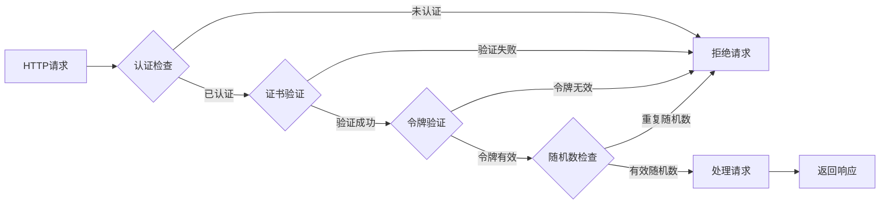

**图表来源**
- [server/mod.rs](file://core/src/http/server/mod.rs#L280-L320)

#### 扩展机制

系统通过Rust的扩展机制提供安全功能：

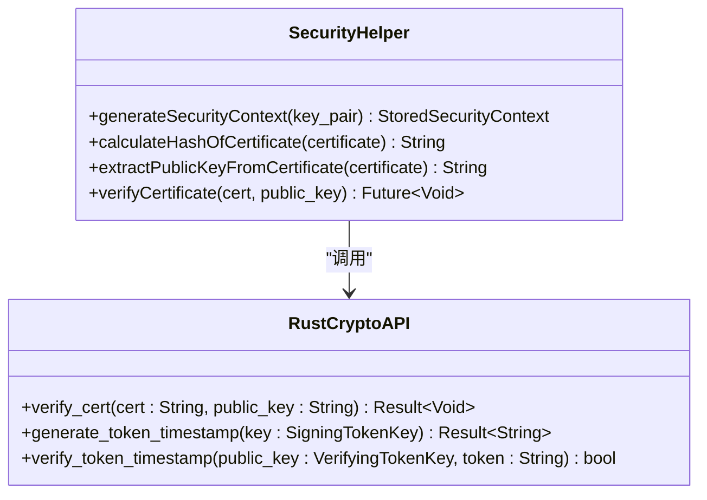

**图表来源**
- [security_helper.dart](file://app/lib/util/security_helper.dart#L55-L71)

**章节来源**
- [server/mod.rs](file://core/src/http/server/mod.rs#L280-L320)
- [security_helper.dart](file://app/lib/util/security_helper.dart#L1-L72)

## 依赖关系分析

### 核心依赖图

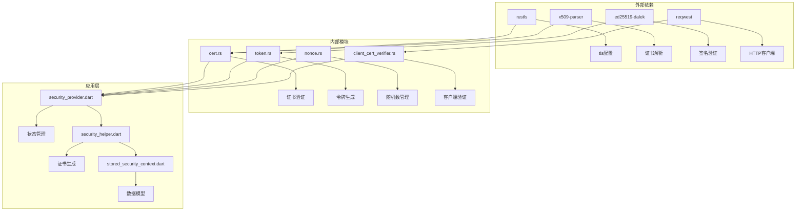

**图表来源**
- [cert.rs](file://core/src/crypto/cert.rs#L1-L10)
- [token.rs](file://core/src/crypto/token.rs#L1-L10)
- [client_cert_verifier.rs](file://core/src/http/server/client_cert_verifier.rs#L1-L10)

### 模块耦合度分析

| 模块 | 耦合类型 | 依赖数量 | 复杂度评分 |
|------|----------|----------|------------|
| cert.rs | 内聚高 | 3个外部库 | ⭐⭐⭐ |
| token.rs | 内聚中 | 2个外部库 | ⭐⭐⭐ |
| nonce.rs | 内聚高 | 1个外部库 | ⭐⭐ |
| client_cert_verifier.rs | 内聚低 | 4个外部库 | ⭐⭐⭐⭐ |
| security_provider.dart | 内聚中 | 3个内部模块 | ⭐⭐⭐ |

**章节来源**
- [cert.rs](file://core/src/crypto/cert.rs#L1-L187)
- [token.rs](file://core/src/crypto/token.rs#L1-L255)
- [client_cert_verifier.rs](file://core/src/http/server/client_cert_verifier.rs#L1-L84)

## 性能考虑

### 缓存策略优化

系统采用LRU缓存策略优化性能：

- **缓存大小**：200个条目，平衡内存使用和性能
- **过期策略**：基于访问频率自动淘汰旧条目
- **并发安全**：使用Mutex保护缓存访问
- **内存限制**：单个随机数占用约32字节，200个约6KB

### 加密操作优化

- **异步处理**：所有加密操作使用异步模式
- **硬件加速**：利用rustls的硬件加速支持
- **内存安全**：使用Zeroizing防止敏感数据残留
- **算法选择**：优先使用高性能的Ed25519签名算法

### 并发性能

- **无锁设计**：大部分操作避免使用锁
- **原子操作**：使用原子类型保证线程安全
- **连接池**：HTTP客户端复用连接
- **流式处理**：大文件传输使用流式处理

## 故障排除指南

### 常见安全问题诊断

#### 证书验证失败

**症状**：客户端无法连接服务器
**可能原因**：
1. 证书过期
2. 证书被篡改
3. 时间同步问题
4. 证书链不完整

**解决方案**：
1. 检查系统时间是否正确
2. 验证证书哈希是否匹配
3. 重新生成安全上下文
4. 检查防火墙设置

#### 随机数验证失败

**症状**：会话建立失败
**可能原因**：
1. 网络延迟导致随机数重复
2. 缓存溢出
3. 并发冲突

**解决方案**：
1. 增加随机数长度
2. 调整缓存大小
3. 实现重试机制

#### 令牌过期错误

**症状**：认证请求被拒绝
**可能原因**：
1. 时间不同步
2. 令牌被截获
3. 系统负载过高

**解决方案**：
1. 同步系统时间
2. 增加时间窗口容差
3. 优化系统性能

**章节来源**
- [cert.rs](file://core/src/crypto/cert.rs#L80-L185)
- [token.rs](file://core/src/crypto/token.rs#L140-L170)
- [server/mod.rs](file://core/src/http/server/mod.rs#L310-L350)

### 安全审计日志记录

系统提供了完整的审计日志记录机制：

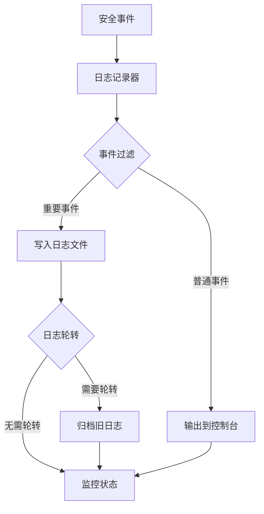

**图表来源**
- [logger.dart](file://common/lib/util/logger.dart#L1-L18)

### 合规性考虑

#### 数据保护要求

- **最小权限原则**：只收集必要的证书信息
- **数据最小化**：仅存储证书哈希和公钥
- **访问控制**：本地文件系统权限保护
- **传输安全**：所有通信均使用TLS加密

#### 隐私保护措施

- **本地存储**：证书和密钥仅存储在本地设备
- **无远程收集**：不向服务器发送任何敏感信息
- **用户控制**：用户可随时重置安全上下文
- **透明操作**：所有安全操作均可调试查看

## 结论

LocalSend的安全验证系统采用了多层次的防护策略，从TLS握手到应用层验证，形成了完整的安全防护体系。系统的主要优势包括：

1. **强认证机制**：基于X.509证书的双向认证
2. **防重放保护**：完善的随机数管理和时间戳验证
3. **会话安全**：防止会话固定和中间人攻击
4. **易于维护**：清晰的模块化设计和完善的测试覆盖
5. **性能优化**：高效的缓存策略和异步处理

该系统为文件传输应用提供了企业级的安全保障，同时保持了良好的用户体验和开发可维护性。未来可以考虑添加自动密钥轮换、证书透明度日志等高级安全特性，进一步提升系统的安全性。