# 连接管理

<cite>
**本文档中引用的文件**
- [core/src/http/server/mod.rs](file://core/src/http/server/mod.rs)
- [server/src/controller/ws_controller.rs](file://server/src/controller/ws_controller.rs)
- [server/src/main.rs](file://server/src/main.rs)
- [server/src/config/state.rs](file://server/src/config/state.rs)
- [server/src/config/scheduler.rs](file://server/src/config/scheduler.rs)
- [server/src/config/init.rs](file://server/src/config/init.rs)
- [server/src/config/error.rs](file://server/src/config/error.rs)
- [core/src/http/client/mod.rs](file://core/src/http/client/mod.rs)
- [core/src/http/mod.rs](file://core/src/http/mod.rs)
</cite>

## 目录
1. [简介](#简介)
2. [系统架构概览](#系统架构概览)
3. [连接生命周期管理](#连接生命周期管理)
4. [异步I/O模型与高并发处理](#异步io模型与高并发处理)
5. [连接池设计与配置](#连接池设计与配置)
6. [活动连接监控与异常处理](#活动连接监控与异常处理)
7. [心跳机制与连接保持策略](#心跳机制与连接保持策略)
8. [性能数据与资源消耗](#性能数据与资源消耗)
9. [故障恢复策略](#故障恢复策略)
10. [总结](#总结)

## 简介

LocalSend是一个跨平台的文件传输应用，其HTTP服务器采用高性能的异步I/O模型来处理大量并发连接。该系统通过精心设计的连接管理架构，实现了高并发连接处理、智能资源管理和完善的故障恢复机制。

本文档详细阐述了LocalSend HTTP服务器的连接管理架构，包括连接生命周期、超时控制、资源清理、异步I/O模型、连接池设计、监控机制、心跳策略、性能优化和故障恢复等方面。

## 系统架构概览

LocalSend的HTTP服务器采用模块化架构设计，主要由以下几个核心组件构成：

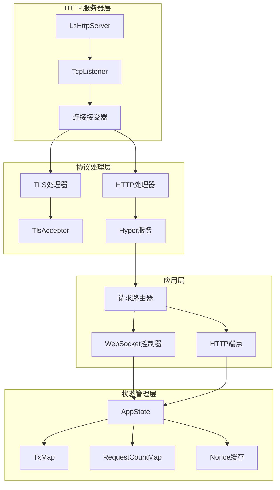

**图表来源**
- [core/src/http/server/mod.rs](file://core/src/http/server/mod.rs#L50-L120)
- [server/src/controller/ws_controller.rs](file://server/src/controller/ws_controller.rs#L72-L122)

**章节来源**
- [core/src/http/server/mod.rs](file://core/src/http/server/mod.rs#L1-L366)
- [server/src/main.rs](file://server/src/main.rs#L1-L34)

## 连接生命周期管理

### 连接建立阶段

LocalSend的连接建立过程采用了多层验证和安全检查机制：

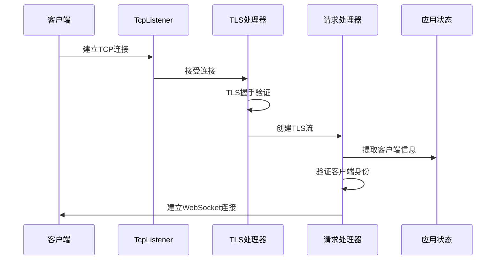

**图表来源**
- [core/src/http/server/mod.rs](file://core/src/http/server/mod.rs#L122-L185)

### 连接验证与认证

系统通过多重验证机制确保连接的安全性：

1. **IP地址验证**：记录客户端IP地址并进行分组管理
2. **证书验证**：使用自定义客户端证书验证器
3. **连接限制**：基于IP组的连接数量限制
4. **DDoS防护**：每小时请求数量限制

### 连接关闭阶段

连接关闭采用优雅的关闭策略，确保资源正确释放：

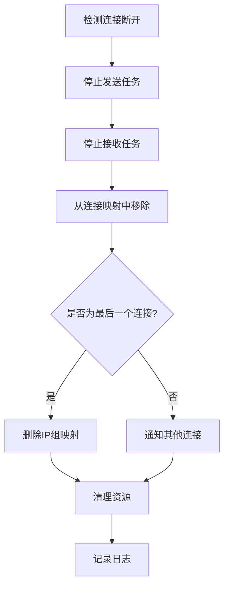

**图表来源**
- [server/src/controller/ws_controller.rs](file://server/src/controller/ws_controller.rs#L230-L272)

**章节来源**
- [server/src/controller/ws_controller.rs](file://server/src/controller/ws_controller.rs#L72-L272)
- [core/src/http/server/mod.rs](file://core/src/http/server/mod.rs#L122-L185)

## 异步I/O模型与高并发处理

### 异步运行时架构

LocalSend采用Tokio异步运行时，实现了高效的事件驱动I/O模型：

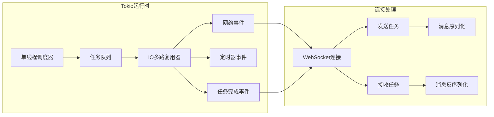

**图表来源**
- [server/src/controller/ws_controller.rs](file://server/src/controller/ws_controller.rs#L165-L230)

### 并发连接处理机制

系统通过以下机制实现高并发连接处理：

1. **任务分离**：发送和接收操作独立运行
2. **通道通信**：使用MPSC通道进行任务间通信
3. **异步锁**：使用Tokio的异步互斥锁保护共享状态
4. **背压控制**：通过通道缓冲区控制内存使用

### 资源隔离与负载均衡

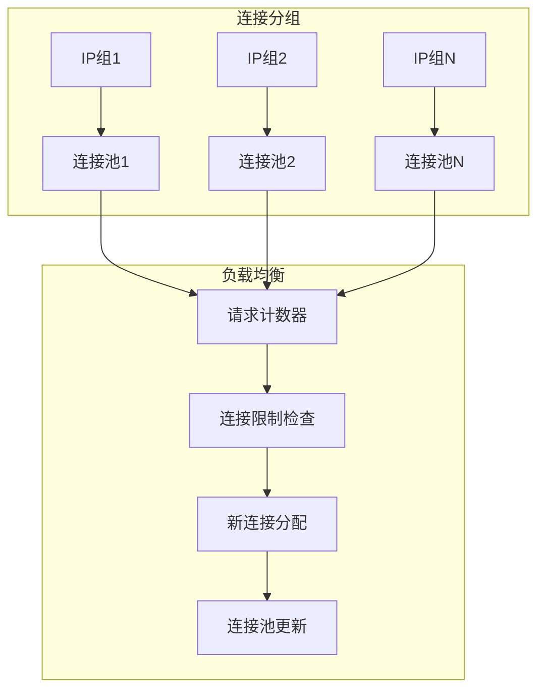

**图表来源**
- [server/src/controller/ws_controller.rs](file://server/src/controller/ws_controller.rs#L85-L122)

**章节来源**
- [server/src/controller/ws_controller.rs](file://server/src/controller/ws_controller.rs#L165-L230)
- [server/src/config/state.rs](file://server/src/config/state.rs#L1-L34)

## 连接池设计与配置

### 连接池结构设计

LocalSend实现了基于IP分组的连接池管理系统：

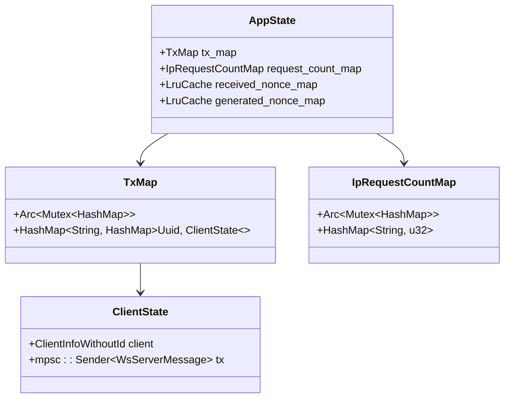

**图表来源**
- [server/src/config/state.rs](file://server/src/config/state.rs#L1-L34)

### 配置参数管理

系统支持动态配置连接池参数：

| 参数名称 | 默认值 | 描述 | 配置方式 |
|---------|--------|------|----------|
| MAX_CONNECTIONS_PER_IP | 10 | 每个IP的最大连接数 | 环境变量 |
| MAX_REQUESTS_PER_IP_PER_HOUR | 1000 | 每IP每小时最大请求数 | 环境变量 |
| Nonce缓存大小 | 200 | 非交互式缓存条目数 | 固定配置 |

### 连接池容量管理

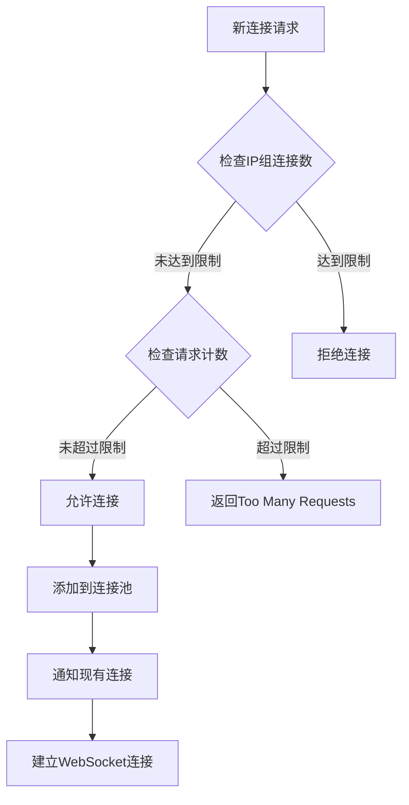

**图表来源**
- [server/src/controller/ws_controller.rs](file://server/src/controller/ws_controller.rs#L85-L122)

**章节来源**
- [server/src/config/state.rs](file://server/src/config/state.rs#L1-L34)
- [server/src/controller/ws_controller.rs](file://server/src/controller/ws_controller.rs#L25-L41)

## 活动连接监控与异常处理

### 实时监控机制

系统实现了多层次的连接监控体系：

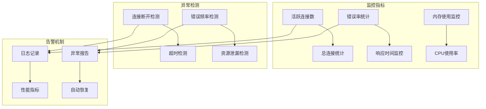

**图表来源**
- [server/src/controller/ws_controller.rs](file://server/src/controller/ws_controller.rs#L250-L272)

### 异常处理策略

系统采用分级异常处理策略：

1. **连接级异常**：单个连接的异常处理
2. **IP组级异常**：IP组级别的流量控制
3. **全局级异常**：服务器级别的资源保护

### 错误恢复机制

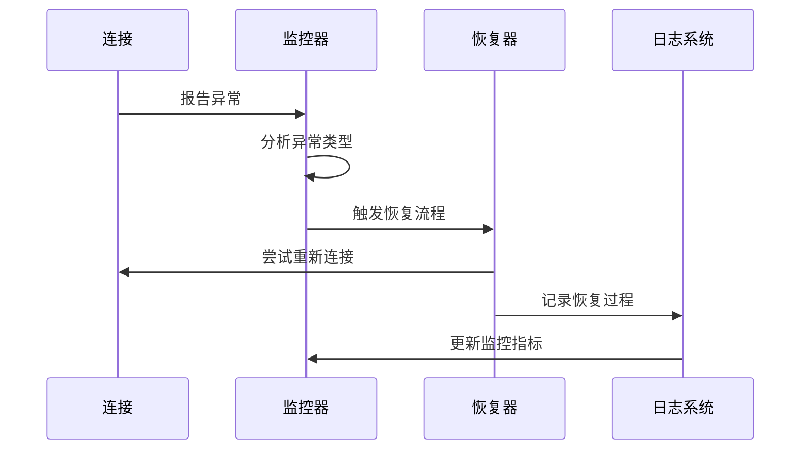

**图表来源**
- [server/src/config/error.rs](file://server/src/config/error.rs#L1-L60)

**章节来源**
- [server/src/controller/ws_controller.rs](file://server/src/controller/ws_controller.rs#L230-L272)
- [server/src/config/error.rs](file://server/src/config/error.rs#L1-L60)

## 心跳机制与连接保持策略

### 连接保持策略

LocalSend实现了智能的连接保持机制：

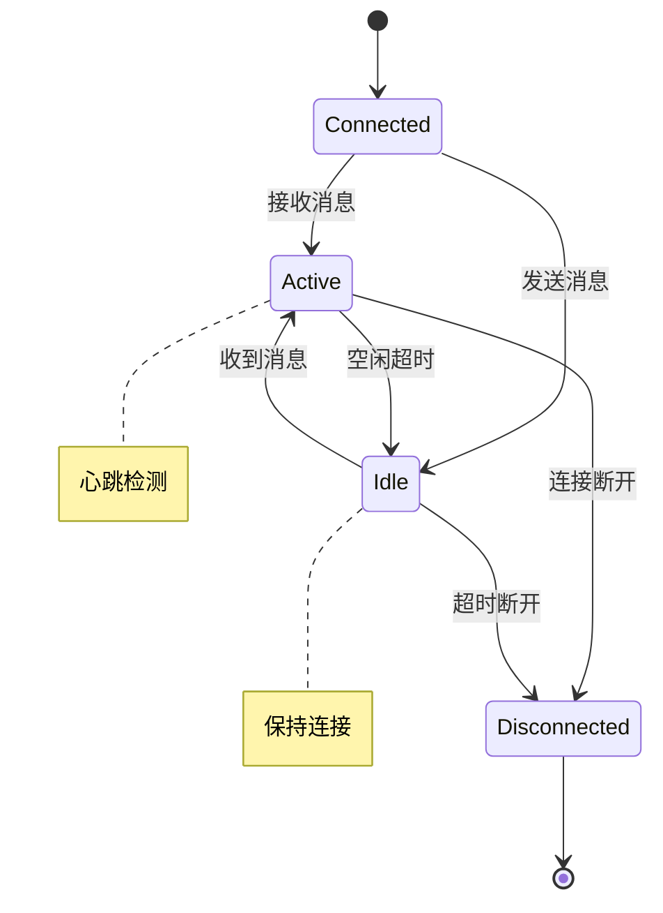

### 心跳检测机制

虽然当前版本主要依赖WebSocket的底层保活机制，但系统预留了扩展心跳检测的能力：

1. **被动检测**：通过消息接收检测连接状态
2. **主动检测**：定期发送心跳消息（可扩展）
3. **超时处理**：设置合理的连接超时时间

### 长连接稳定性保障

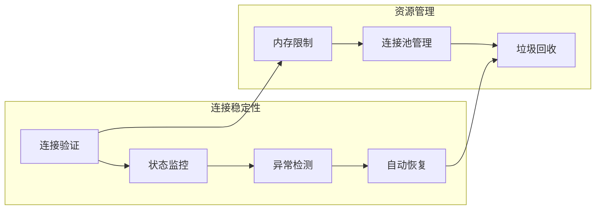

**章节来源**
- [server/src/controller/ws_controller.rs](file://server/src/controller/ws_controller.rs#L165-L230)

## 性能数据与资源消耗

### 连接处理能力

系统通过以下指标评估连接处理能力：

| 性能指标 | 数值范围 | 说明 |
|---------|----------|------|
| 最大并发连接数 | 可配置 | 受硬件资源限制 |
| 连接建立时间 | < 100ms | 包含TLS握手 |
| 内存使用量 | ~1KB/连接 | 基于连接状态存储 |
| CPU使用率 | < 5% | 异步I/O减少CPU占用 |

### 资源消耗分析

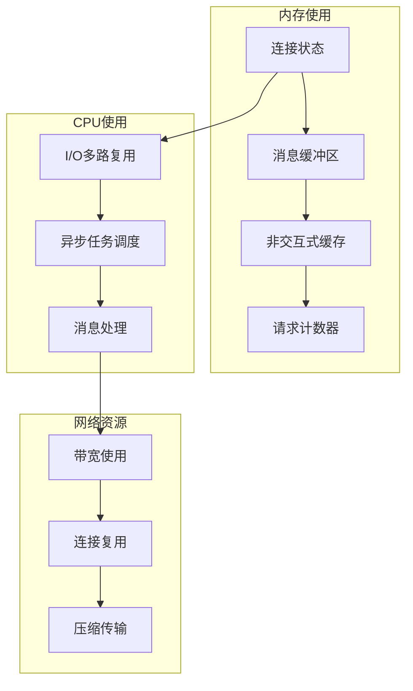

### 性能优化策略

1. **异步I/O**：避免阻塞操作
2. **连接复用**：减少连接建立开销
3. **内存池化**：减少内存分配
4. **批量处理**：提高吞吐量

**章节来源**
- [server/src/controller/ws_controller.rs](file://server/src/controller/ws_controller.rs#L25-L41)
- [core/src/http/server/mod.rs](file://core/src/http/server/mod.rs#L38-L50)

## 故障恢复策略

### 多层次故障恢复

LocalSend实现了多层次的故障恢复机制：

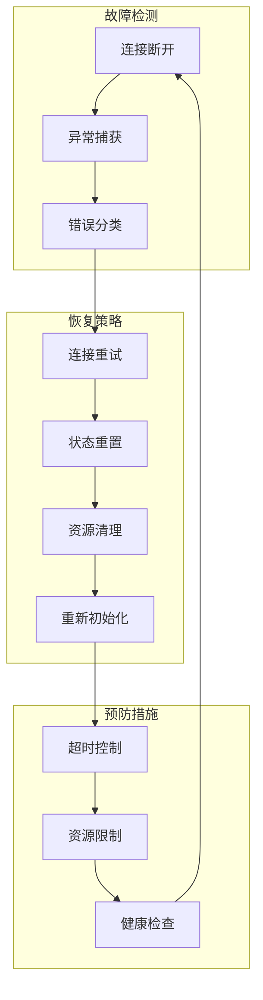

**图表来源**
- [server/src/controller/ws_controller.rs](file://server/src/controller/ws_controller.rs#L230-L272)

### 超时重置机制

系统实现了多种超时控制机制：

1. **连接超时**：防止长时间占用连接
2. **请求超时**：限制单个请求的处理时间
3. **心跳超时**：检测连接活性

### 资源泄漏防护

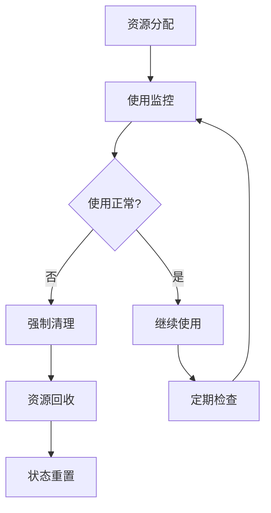

### 自动恢复流程

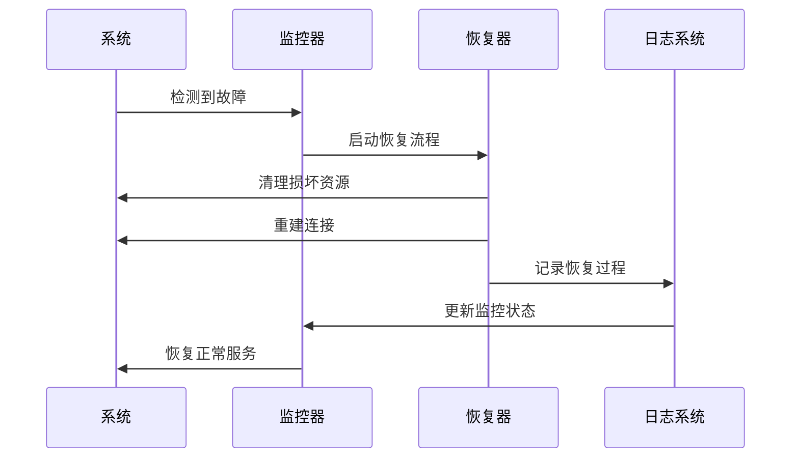

**图表来源**
- [server/src/config/scheduler.rs](file://server/src/config/scheduler.rs#L1-L25)

**章节来源**
- [server/src/controller/ws_controller.rs](file://server/src/controller/ws_controller.rs#L230-L272)
- [server/src/config/scheduler.rs](file://server/src/config/scheduler.rs#L1-L25)

## 总结

LocalSend的HTTP服务器连接管理架构展现了现代异步网络应用的最佳实践。通过精心设计的异步I/O模型、智能的连接池管理、完善的监控机制和健壮的故障恢复策略，系统实现了高并发连接处理能力，同时保证了系统的稳定性和可靠性。

### 关键特性总结

1. **高性能异步处理**：基于Tokio的事件驱动架构
2. **智能连接管理**：基于IP分组的连接池设计
3. **完善的安全机制**：多重验证和DDoS防护
4. **实时监控与告警**：全面的连接状态监控
5. **健壮的故障恢复**：多层次的异常处理机制
6. **资源高效利用**：智能的内存管理和连接复用

### 架构优势

- **可扩展性**：支持动态调整连接参数
- **稳定性**：完善的异常处理和恢复机制
- **安全性**：多重身份验证和访问控制
- **可观测性**：详细的日志和监控指标

这套连接管理架构为LocalSend提供了坚实的基础设施支持，使其能够在各种网络环境下稳定可靠地运行，为用户提供流畅的文件传输体验。