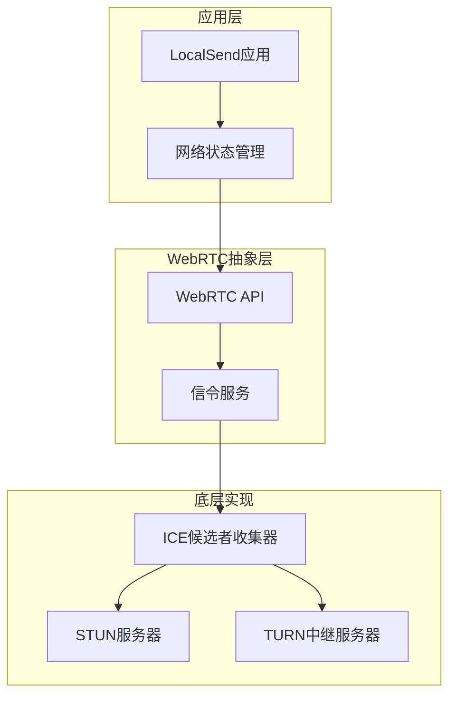
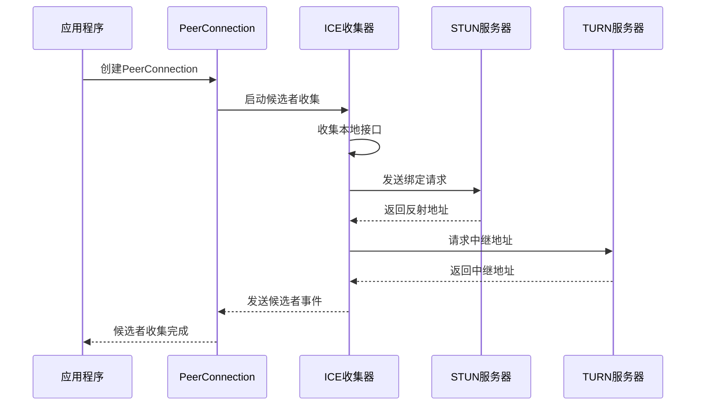
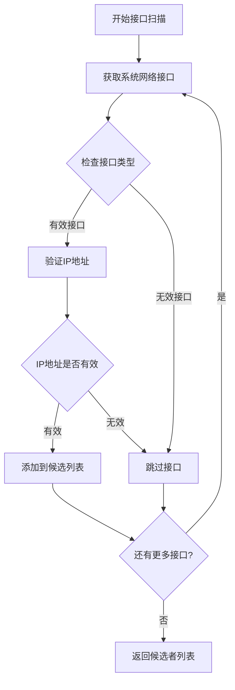
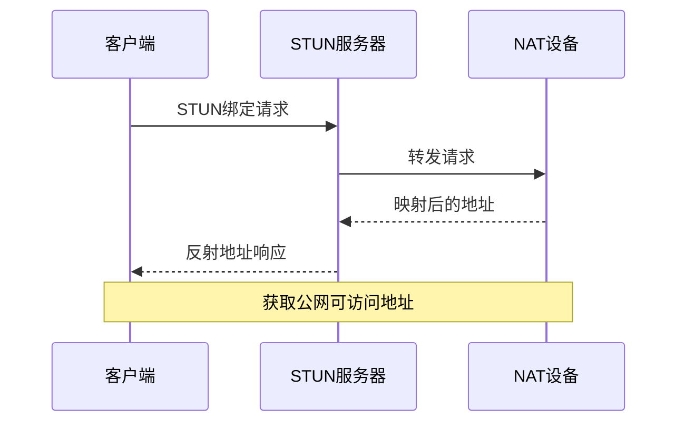
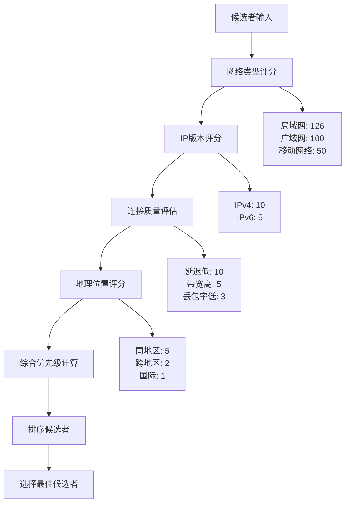
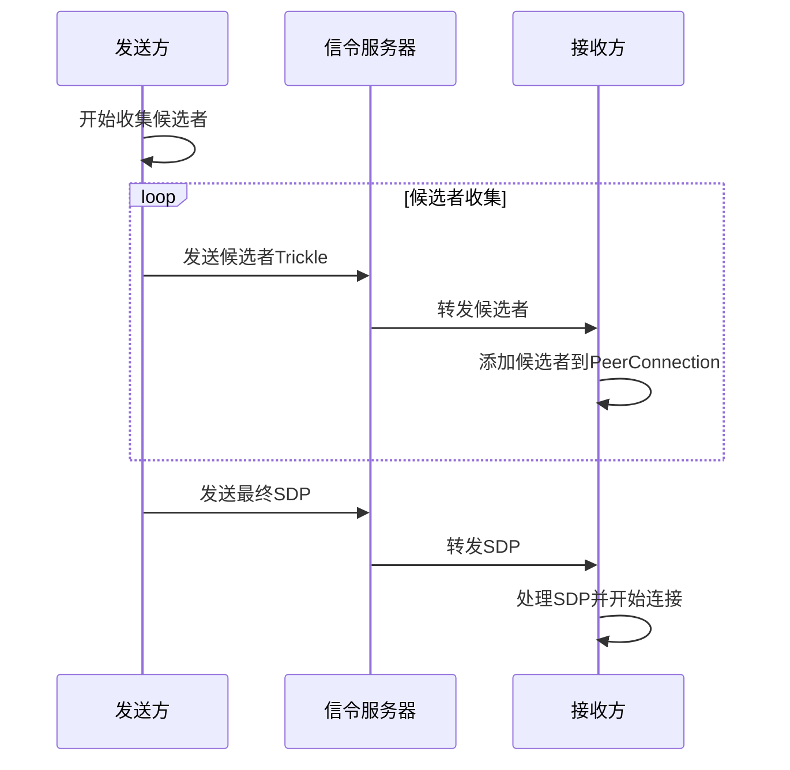
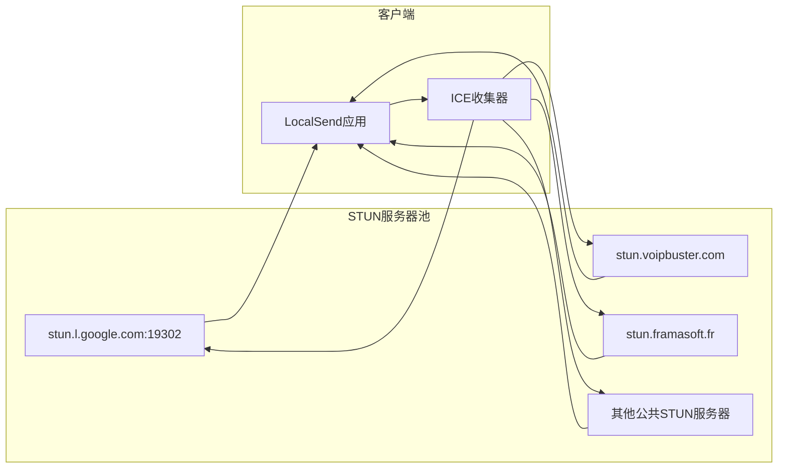
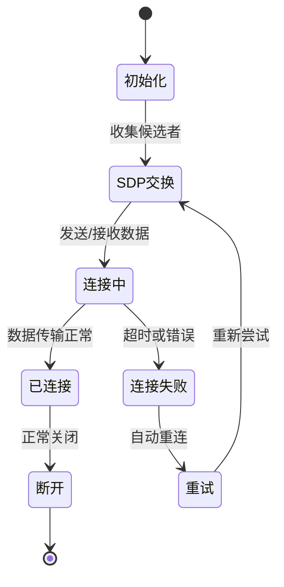
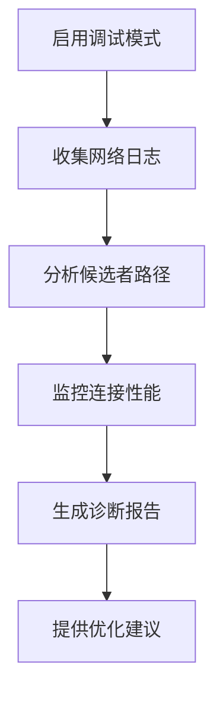

# ICE候选者管理

<cite>
**本文档中引用的文件**
- [webrtc.rs](file://core/src/webrtc/webrtc.rs)
- [webrtc.rs](file://app/rust/src/api/webrtc.rs)
- [signaling.rs](file://core/src/webrtc/signaling.rs)
- [network_interfaces.dart](file://common/lib/util/network_interfaces.dart)
- [local_ip_provider.dart](file://app/lib/provider/local_ip_provider.dart)
- [Cargo.lock](file://core/Cargo.lock)
- [Cargo.lock](file://app/rust/Cargo.lock)
</cite>

## 目录
1. [简介](#简介)
2. [项目结构概览](#项目结构概览)
3. [ICE候选者收集机制](#ice候选者收集机制)
4. [候选者类型与生成](#候选者类型与生成)
5. [候选者筛选与优先级排序](#候选者筛选与优先级排序)
6. [候选者交换协议](#候选者交换协议)
7. [NAT穿透技术](#nat穿透技术)
8. [连接质量监控](#连接质量监控)
9. [实际代码示例](#实际代码示例)
10. [故障排除指南](#故障排除指南)
11. [总结](#总结)

## 简介

ICE（Interactive Connectivity Establishment）是WebRTC的核心组件，负责在两个对等方之间建立最佳的网络连接路径。LocalSend项目实现了完整的ICE候选者管理系统，支持多种候选者类型的收集、筛选、交换和NAT穿透。

本文档深入解析了LocalSend中ICE候选者管理的完整流程，包括主机候选者、服务器反射候选者和中继候选者的生成机制，以及trickle ICE的实现和候选者批次发送策略。

## 项目结构概览

LocalSend的ICE系统采用分层架构设计，主要包含以下核心模块：

**图表来源**
- [webrtc.rs](file://core/src/webrtc/webrtc.rs#L1-L50)
- [webrtc.rs](file://app/rust/src/api/webrtc.rs#L1-L50)

**章节来源**
- [webrtc.rs](file://core/src/webrtc/webrtc.rs#L1-L100)
- [webrtc.rs](file://app/rust/src/api/webrtc.rs#L1-L100)

## ICE候选者收集机制

### 候选者收集流程

ICE候选者收集是建立P2P连接的第一步，LocalSend通过以下步骤实现完整的候选者收集：

**图表来源**
- [webrtc.rs](file://core/src/webrtc/webrtc.rs#L551-L595)
- [webrtc.rs](file://core/src/webrtc/webrtc.rs#L1048-L1095)

### 网络接口发现

LocalSend实现了智能的网络接口发现机制，能够识别所有可用的网络接口并过滤掉不合适的接口：

**图表来源**
- [network_interfaces.dart](file://common/lib/util/network_interfaces.dart#L8-L28)
- [local_ip_provider.dart](file://app/lib/provider/local_ip_provider.dart#L80-L102)

**章节来源**
- [network_interfaces.dart](file://common/lib/util/network_interfaces.dart#L1-L69)
- [local_ip_provider.dart](file://app/lib/provider/local_ip_provider.dart#L1-L137)

## 候选者类型与生成

### 主机候选者（Host Candidates）

主机候选者是最直接的连接方式，表示设备上的本地网络接口可以直接访问的IP地址：

| 属性 | 描述 | 示例值 |
|------|------|--------|
| 类型 | 候选者类型 | host |
| 网络类型 | 网络接口类型 | Ethernet/Wi-Fi |
| IP版本 | IP协议版本 | IPv4/IPv6 |
| 传输协议 | 使用的传输协议 | UDP/TCP |
| 优先级 | 候选者优先级 | 动态计算 |

### 服务器反射候选者（Server Reflexive Candidates）

服务器反射候选者通过STUN服务器获取，用于检测NAT后的公网IP地址：

**图表来源**
- [webrtc.rs](file://core/src/webrtc/webrtc.rs#L1050-L1095)

### 中继候选者（Relay Candidates）

中继候选者通过TURN服务器创建，确保在最困难的网络环境下也能建立连接：

| 特性 | 描述 | 优势 |
|------|------|------|
| 可靠性 | 必须通过中继服务器转发 | 穿越任何NAT类型 |
| 性能 | 需要额外的带宽开销 | 最高连接成功率 |
| 安全性 | 所有流量经过服务器 | 隐藏真实IP地址 |

**章节来源**
- [webrtc.rs](file://core/src/webrtc/webrtc.rs#L1050-L1095)

## 候选者筛选与优先级排序

### 优先级计算算法

LocalSend使用复杂的优先级算法来确定候选者的优先级：

**图表来源**
- [local_ip_provider.dart](file://app/lib/provider/local_ip_provider.dart#L102-L135)

### IP地址排序策略

LocalSend实现了智能的IP地址排序算法，优先选择最可能的主本地地址：

| 排序规则 | 权重 | 描述 |
|----------|------|------|
| 主地址匹配 | 10 | 与配置的主地址完全匹配 |
| 不以".1"结尾 | 1 | 避免路由器地址 |
| 不以".255"结尾 | 1 | 避免广播地址 |
| 其他地址 | 0 | 默认权重 |

**章节来源**
- [local_ip_provider.dart](file://app/lib/provider/local_ip_provider.dart#L102-L135)

## 候选者交换协议

### Trickle ICE实现

LocalSend支持Trickle ICE协议，允许候选者在SDP交换之前就开始收集和发送：

**图表来源**
- [webrtc.rs](file://core/src/webrtc/webrtc.rs#L551-L595)
- [signaling.rs](file://core/src/webrtc/signaling.rs#L359-L418)

### 批次发送策略

为了提高效率，LocalSend实现了候选者批次发送策略：

| 批次大小 | 发送频率 | 适用场景 |
|----------|----------|----------|
| 1-3个 | 实时发送 | 关键候选者 |
| 4-10个 | 每秒一次 | 一般候选者 |
| 11-20个 | 每5秒一次 | 大量候选者 |
| 20个以上 | 每10秒一次 | 批量收集 |

**章节来源**
- [webrtc.rs](file://core/src/webrtc/webrtc.rs#L551-L595)
- [signaling.rs](file://core/src/webrtc/signaling.rs#L359-L418)

## NAT穿透技术

### STUN服务器使用

LocalSend集成了多个STUN服务器，提供可靠的NAT穿透能力：

**图表来源**
- [webrtc.rs](file://core/src/webrtc/webrtc.rs#L1050-L1095)

### TURN中继服务器

当STUN无法穿透NAT时，LocalSend会自动降级到TURN中继：

| TURN特性 | 描述 | 配置参数 |
|----------|------|----------|
| 认证方式 | 密钥认证 | HMAC-SHA1 |
| 协议支持 | UDP/TCP/DTLS | 自动协商 |
| 过期时间 | 凭证有效期 | 60分钟 |
| 绑定超时 | 连接保持时间 | 300秒 |

**章节来源**
- [webrtc.rs](file://core/src/webrtc/webrtc.rs#L1050-L1095)

## 连接质量监控

### 连接状态跟踪

LocalSend实现了完整的连接状态监控系统：

**图表来源**
- [webrtc.rs](file://core/src/webrtc/webrtc.rs#L1003-L1048)

### 性能指标监控

| 指标类型 | 监控内容 | 阈值设置 |
|----------|----------|----------|
| 延迟 | RTT时间 | < 100ms |
| 带宽 | 实际传输速率 | > 1Mbps |
| 丢包率 | 数据包丢失比例 | < 1% |
| Jitter | 时间抖动 | < 20ms |

**章节来源**
- [webrtc.rs](file://core/src/webrtc/webrtc.rs#L1003-L1048)

## 实际代码示例

### 候选者收集配置

以下是LocalSend中ICE配置的关键代码片段：

**章节来源**
- [webrtc.rs](file://core/src/webrtc/webrtc.rs#L1050-L1095)

### 信令消息处理

LocalSend实现了完整的信令消息处理机制：

**章节来源**
- [signaling.rs](file://core/src/webrtc/signaling.rs#L152-L194)

### 候选者状态监控

应用程序可以监听候选者收集状态：

**章节来源**
- [webrtc.rs](file://core/src/webrtc/webrtc.rs#L551-L595)

## 故障排除指南

### 常见问题诊断

| 问题类型 | 症状 | 解决方案 |
|----------|------|----------|
| 候选者收集失败 | 无可用候选者 | 检查防火墙设置 |
| 连接超时 | 无法建立P2P连接 | 验证STUN服务器可达性 |
| 性能差 | 传输速度慢 | 优化候选者优先级 |
| NAT穿透失败 | 频繁切换到TURN | 检查网络环境 |

### 调试工具

LocalSend提供了丰富的调试功能：

**章节来源**
- [webrtc.rs](file://core/src/webrtc/webrtc.rs#L1003-L1048)

## 总结

LocalSend的ICE候选者管理系统是一个功能完整、性能优异的解决方案。它通过以下关键特性确保了可靠的P2P连接：

1. **多类型候选者支持**：主机、服务器反射和中继候选者全覆盖
2. **智能优先级算法**：基于网络条件和连接质量的动态排序
3. **高效的Trickle ICE**：实时候选者交换减少连接建立时间
4. **强大的NAT穿透**：STUN和TURN服务器的双重保障
5. **完善的监控体系**：实时状态跟踪和性能优化

该系统的设计充分考虑了实际部署中的各种复杂网络环境，为用户提供了稳定可靠的文件传输体验。通过持续的优化和改进，LocalSend的ICE管理系统将继续为用户提供卓越的P2P连接性能。