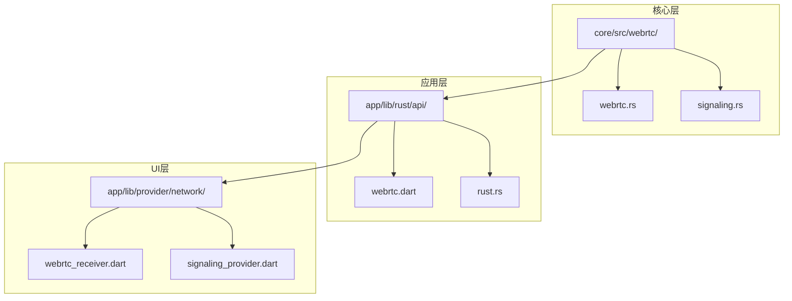
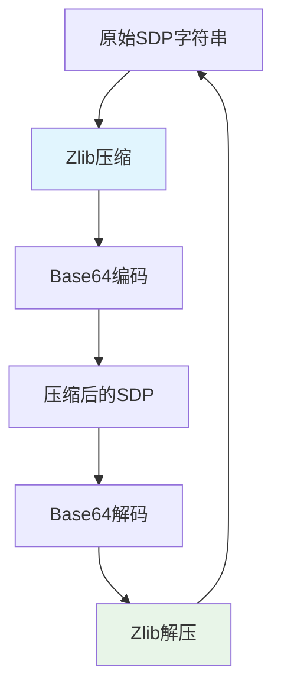
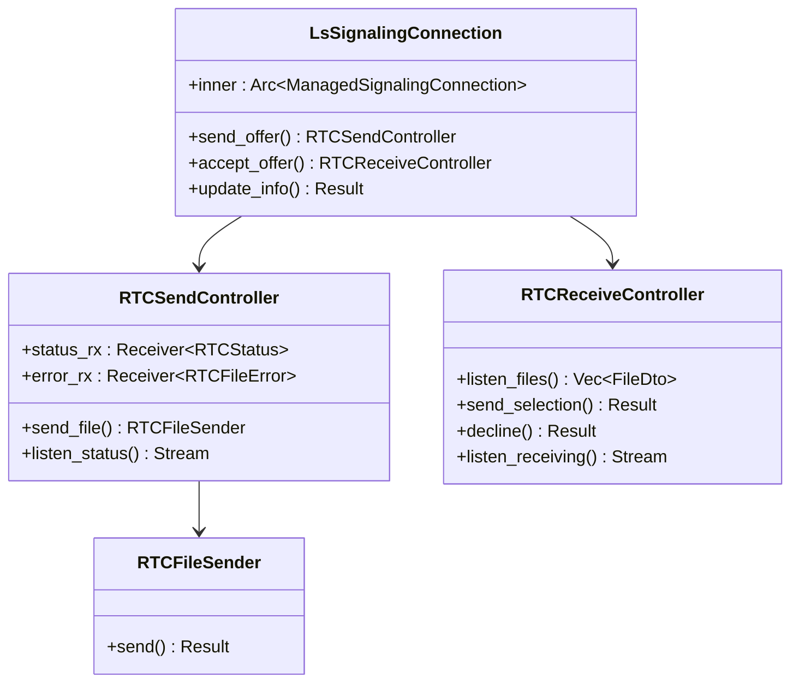
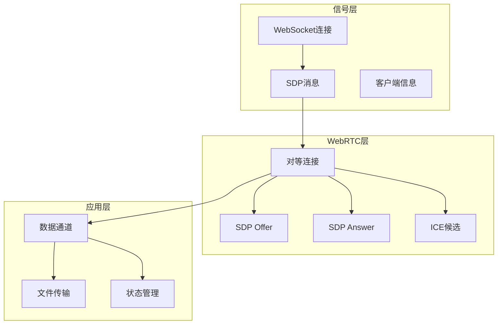
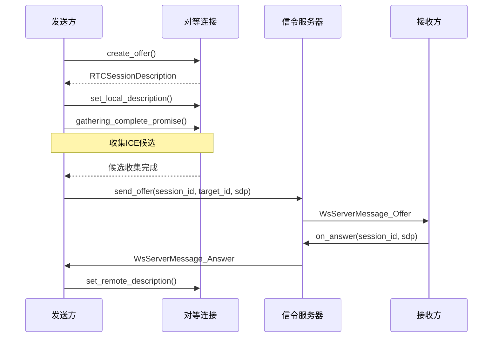
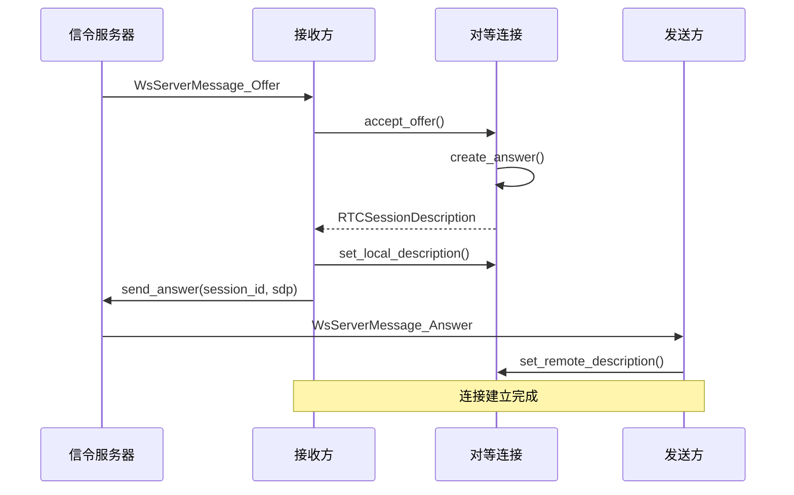
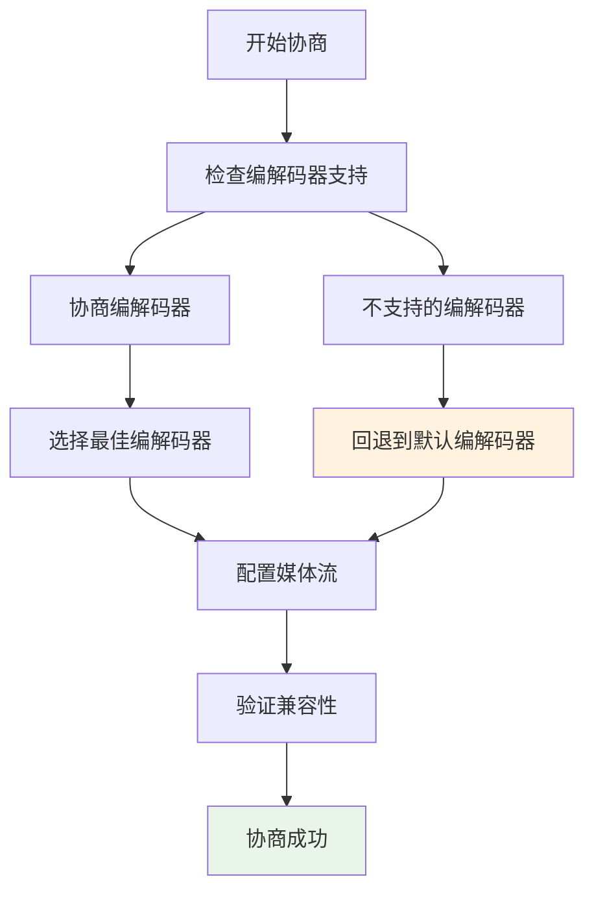
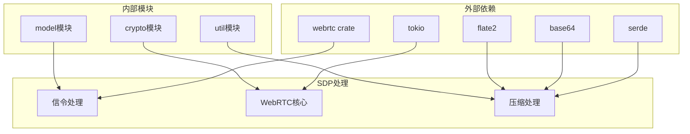
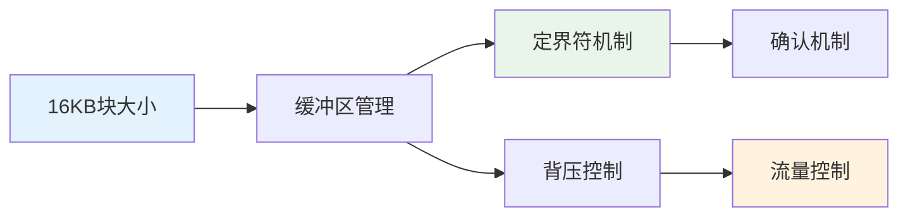
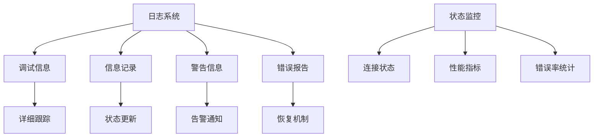

# SDP处理

<cite>
**本文档引用的文件**
- [core/src/webrtc/webrtc.rs](file://core/src/webrtc/webrtc.rs)
- [app/lib/rust/api/webrtc.dart](file://app/lib/rust/api/webrtc.dart)
- [app/rust/src/api/webrtc.rs](file://app/rust/src/api/webrtc.rs)
- [app/lib/provider/network/webrtc/webrtc_receiver.dart](file://app/lib/provider/network/webrtc/webrtc_receiver.dart)
- [app/lib/provider/network/webrtc/signaling_provider.dart](file://app/lib/provider/network/webrtc/signaling_provider.dart)
- [core/src/webrtc/signaling.rs](file://core/src/webrtc/signaling.rs)
- [app/lib/rust/frb_generated.dart](file://app/lib/rust/frb_generated.dart)
</cite>

## 目录
1. [简介](#简介)
2. [项目结构](#项目结构)
3. [核心组件](#核心组件)
4. [架构概览](#架构概览)
5. [详细组件分析](#详细组件分析)
6. [依赖关系分析](#依赖关系分析)
7. [性能考虑](#性能考虑)
8. [故障排除指南](#故障排除指南)
9. [结论](#结论)

## 简介

LocalSend是一个跨平台的文件共享应用程序，使用WebRTC技术实现设备间的直接通信。SDP（会话描述协议）处理是WebRTC通信的核心组件，负责在设备间建立连接并协商媒体流参数。本文档深入分析LocalSend中的SDP处理机制，包括生成、解析、交换和优化等各个方面。

## 项目结构

LocalSend的SDP处理功能分布在多个模块中：

**图表来源**
- [core/src/webrtc/webrtc.rs](file://core/src/webrtc/webrtc.rs#L1-L50)
- [app/lib/rust/api/webrtc.dart](file://app/lib/rust/api/webrtc.dart#L1-L30)
- [app/lib/provider/network/webrtc/webrtc_receiver.dart](file://app/lib/provider/network/webrtc/webrtc_receiver.dart#L1-L20)

## 核心组件

### SDP编码与解码

LocalSend实现了高效的SDP压缩和编码机制：

**图表来源**
- [core/src/webrtc/webrtc.rs](file://core/src/webrtc/webrtc.rs#L1222-L1240)

### WebRTC连接管理

系统维护多个WebRTC连接，支持同时进行多个文件传输：

**图表来源**
- [app/rust/src/api/webrtc.rs](file://app/rust/src/api/webrtc.rs#L80-L120)
- [app/lib/rust/api/webrtc.dart](file://app/lib/rust/api/webrtc.dart#L40-L80)

**章节来源**
- [core/src/webrtc/webrtc.rs](file://core/src/webrtc/webrtc.rs#L1222-L1240)
- [app/rust/src/api/webrtc.rs](file://app/rust/src/api/webrtc.rs#L80-L150)

## 架构概览

LocalSend的SDP处理架构采用分层设计，确保高效的数据传输和连接管理：

**图表来源**
- [core/src/webrtc/signaling.rs](file://core/src/webrtc/signaling.rs#L20-L80)
- [core/src/webrtc/webrtc.rs](file://core/src/webrtc/webrtc.rs#L550-L600)

## 详细组件分析

### SDP生成与发送

SDP生成过程包括创建offer、收集ICE候选和设置本地描述：

**图表来源**
- [core/src/webrtc/webrtc.rs](file://core/src/webrtc/webrtc.rs#L550-L600)

### SDP解析与应用

接收方处理SDP offer并生成answer：

**图表来源**
- [core/src/webrtc/webrtc.rs](file://core/src/webrtc/webrtc.rs#L600-L650)

### 编解码器协商

虽然LocalSend主要关注文件传输而非实时媒体，但WebRTC框架提供了完整的编解码器协商机制：

**图表来源**
- [core/src/webrtc/webrtc.rs](file://core/src/webrtc/webrtc.rs#L1040-L1060)

### 信令消息格式

SDP消息通过WebSocket信令服务器传输：

| 消息类型 | 描述 | 字段 |
|---------|------|------|
| Hello | 初始连接消息 | client, peers |
| Join | 设备加入消息 | peer |
| Update | 设备更新消息 | peer |
| Offer | SDP Offer消息 | peer, session_id, sdp |
| Answer | SDP Answer消息 | peer, session_id, sdp |
| Left | 设备离开消息 | peer_id |
| Error | 错误消息 | code |

**章节来源**
- [core/src/webrtc/signaling.rs](file://core/src/webrtc/signaling.rs#L20-L100)
- [core/src/webrtc/webrtc.rs](file://core/src/webrtc/webrtc.rs#L550-L650)

## 依赖关系分析

LocalSend的SDP处理依赖于多个外部库和内部模块：

**图表来源**
- [core/src/webrtc/webrtc.rs](file://core/src/webrtc/webrtc.rs#L1-L30)
- [app/rust/src/api/webrtc.rs](file://app/rust/src/api/webrtc.rs#L1-L20)

**章节来源**
- [core/src/webrtc/webrtc.rs](file://core/src/webrtc/webrtc.rs#L1-L50)
- [app/rust/src/api/webrtc.rs](file://app/rust/src/api/webrtc.rs#L1-L30)

## 性能考虑

### SDP大小优化

LocalSend实现了多种SDP大小优化策略：

1. **Zlib压缩**：使用最高压缩级别压缩SDP内容
2. **Base64编码**：确保二进制数据在网络中安全传输
3. **增量传输**：支持大文件的分块传输

### 传输优化

**图表来源**
- [core/src/webrtc/webrtc.rs](file://core/src/webrtc/webrtc.rs#L1250-L1300)

### 内存管理

系统采用异步流式处理避免大量内存占用：

- 使用`mpsc::channel`进行消息传递
- 实现背压控制防止内存溢出
- 采用流式数据处理减少缓存需求

**章节来源**
- [core/src/webrtc/webrtc.rs](file://core/src/webrtc/webrtc.rs#L1250-L1350)

## 故障排除指南

### 常见问题及解决方案

| 问题 | 可能原因 | 解决方案 |
|------|----------|----------|
| SDP交换失败 | 网络防火墙阻止 | 配置防火墙允许TCP/UDP端口53317 |
| 连接超时 | STUN服务器不可达 | 更换STUN服务器或使用TURN服务器 |
| 文件传输缓慢 | 网络带宽限制 | 使用有线连接或优化网络设置 |
| 编解码器不兼容 | 设备能力差异 | 系统自动选择兼容编解码器 |

### 调试工具

LocalSend提供了详细的日志记录和状态监控：

**章节来源**
- [core/src/webrtc/webrtc.rs](file://core/src/webrtc/webrtc.rs#L1350-L1402)

## 结论

LocalSend的SDP处理系统展现了现代WebRTC应用的最佳实践。通过高效的压缩算法、可靠的信令机制和灵活的连接管理，系统能够实现在各种网络环境下的稳定文件传输。

主要优势包括：
- **高效压缩**：Zlib压缩显著减小SDP传输大小
- **可靠传输**：多重确认机制确保消息送达
- **灵活配置**：支持多种STUN/TURN服务器
- **性能优化**：流式处理和背压控制

该系统为开发者提供了可扩展的WebRTC文件传输解决方案，适用于需要高可靠性和高性能的本地网络通信场景。