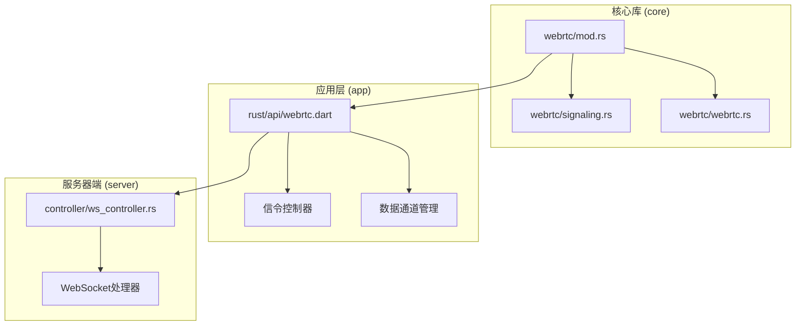
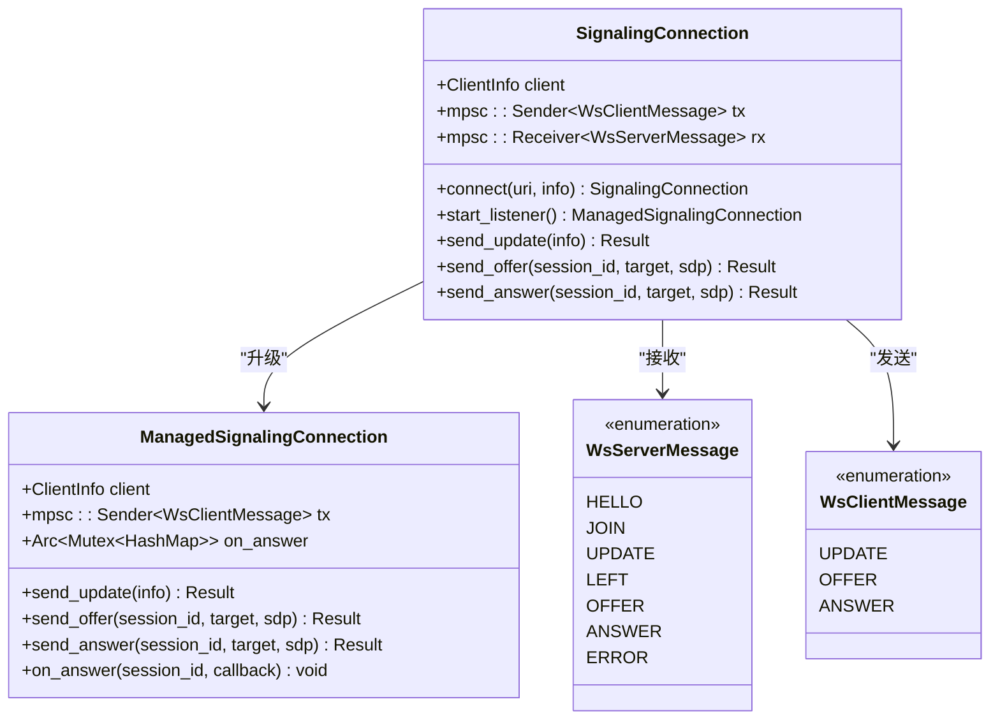
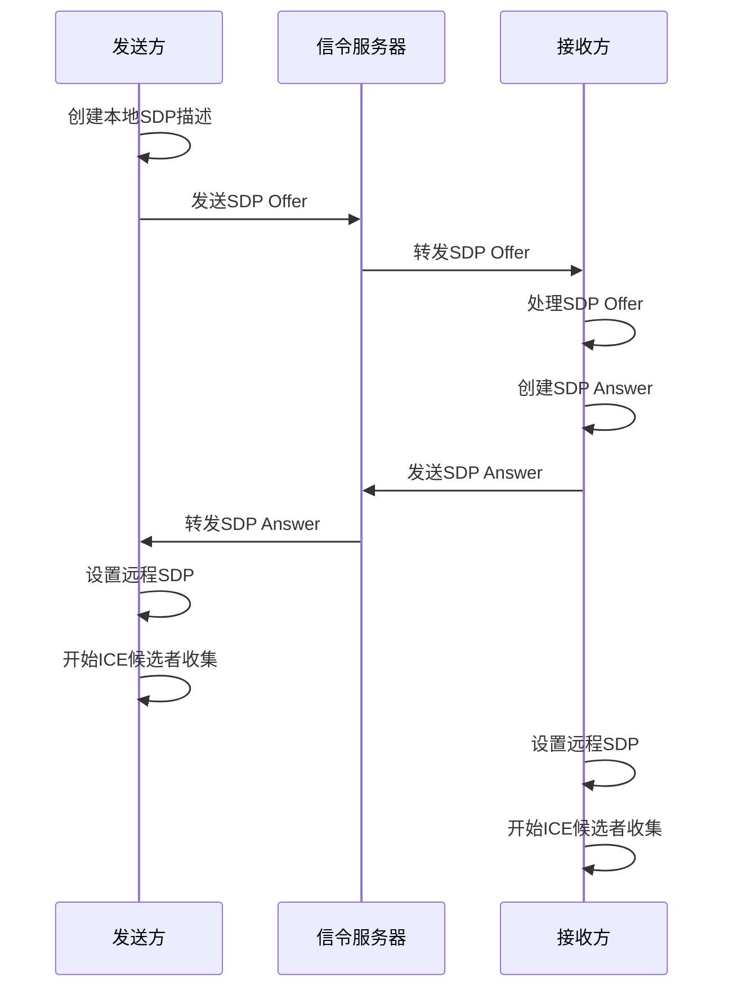
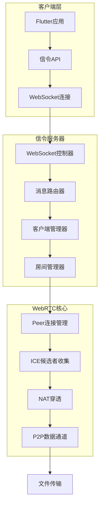
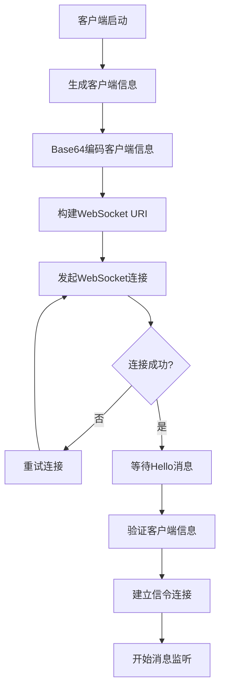
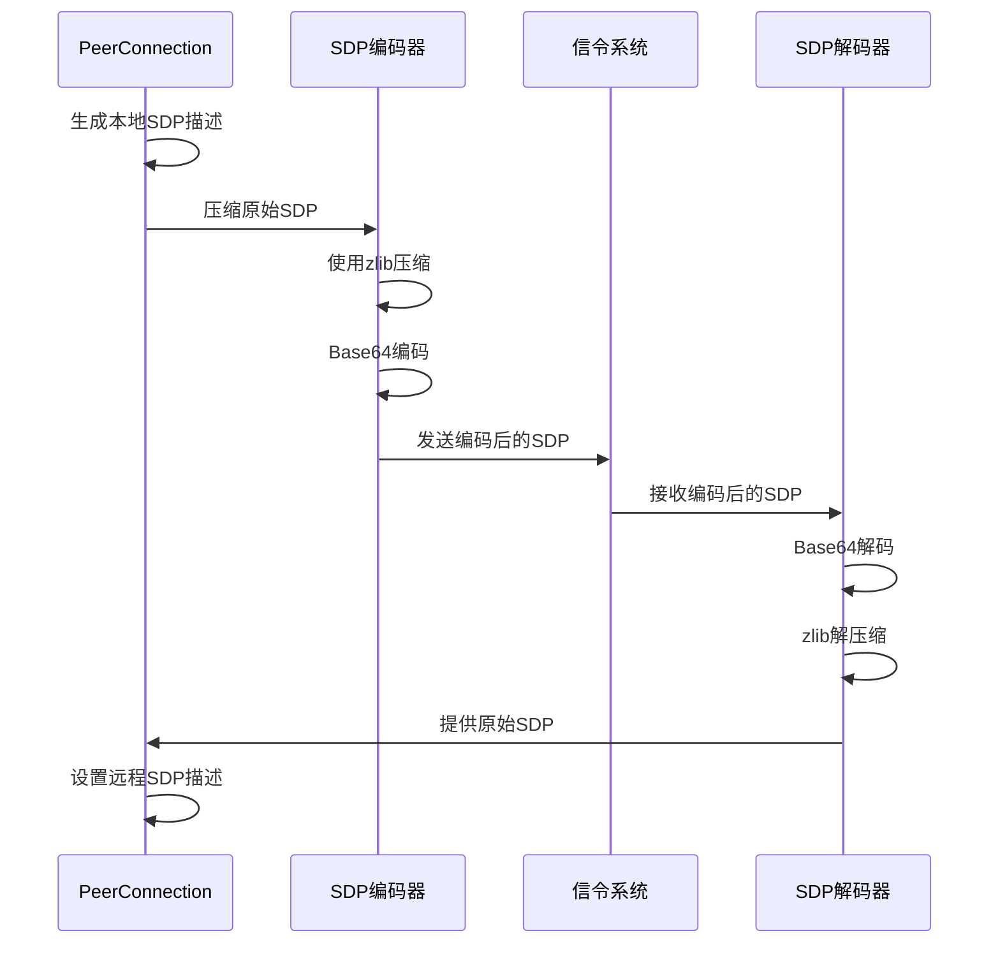
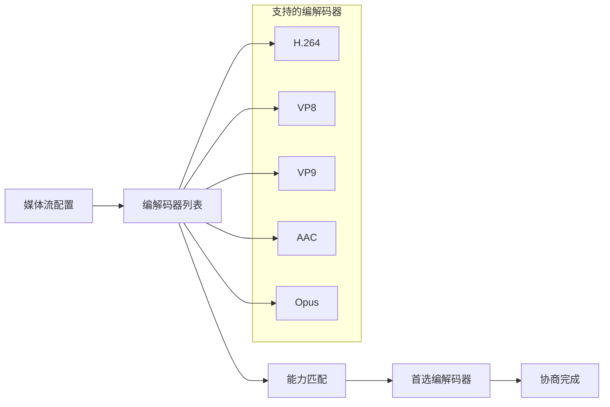
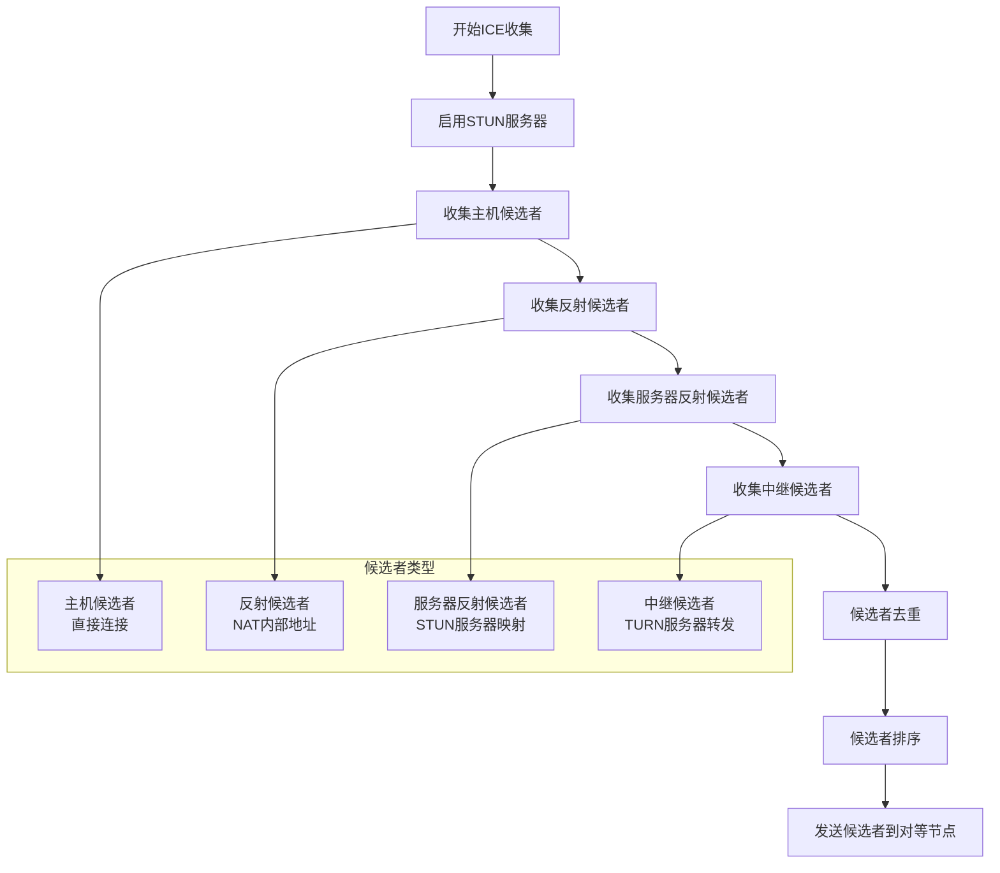
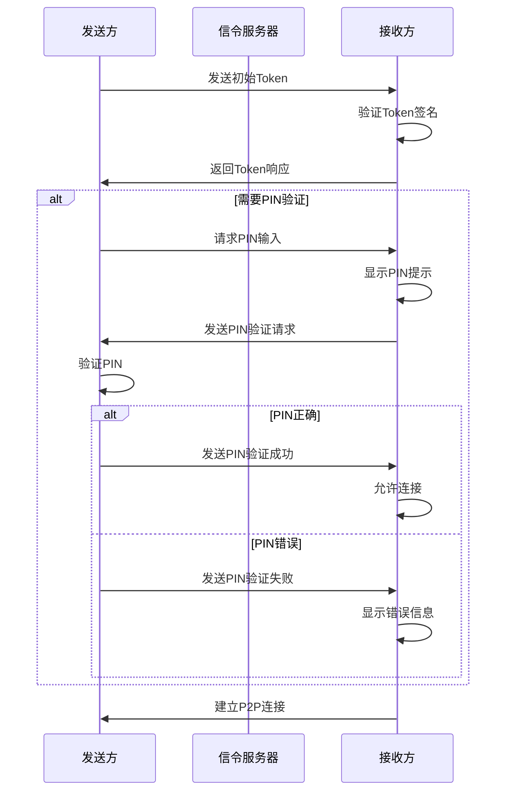
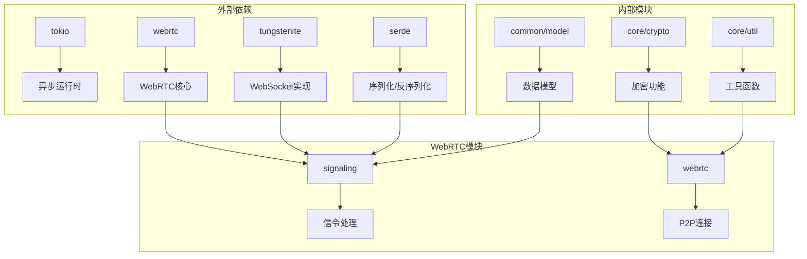

# WebRTC信令实现

<cite>
**本文档引用的文件**
- [core/src/webrtc/mod.rs](file://core/src/webrtc/mod.rs)
- [core/src/webrtc/signaling.rs](file://core/src/webrtc/signaling.rs)
- [core/src/webrtc/webrtc.rs](file://core/src/webrtc/webrtc.rs)
- [app/lib/rust/api/webrtc.dart](file://app/lib/rust/api/webrtc.dart)
- [server/src/controller/ws_controller.rs](file://server/src/controller/ws_controller.rs)
</cite>

## 目录
1. [简介](#简介)
2. [项目结构](#项目结构)
3. [核心组件](#核心组件)
4. [架构概览](#架构概览)
5. [详细组件分析](#详细组件分析)
6. [依赖关系分析](#依赖关系分析)
7. [性能考虑](#性能考虑)
8. [故障排除指南](#故障排除指南)
9. [结论](#结论)

## 简介

LocalSend项目实现了一个完整的WebRTC信令系统，用于在设备之间建立点对点(P2P)文件传输连接。该系统采用WebSocket作为信令通道，支持SDP（会话描述协议）交换和ICE（交互式连接建立）候选者处理，实现了高效的NAT穿透和P2P连接建立。

本文档深入分析了Rust核心库中WebRTC模块的架构设计，包括信令服务器、SDP交换和ICE候选者处理机制，详细描述了WebSocket信令通道的建立过程、SDP的生成解析流程以及ICE候选者的收集筛选算法。

## 项目结构

LocalSend的WebRTC实现分布在多个模块中，形成了清晰的分层架构：

**图表来源**
- [core/src/webrtc/mod.rs](file://core/src/webrtc/mod.rs#L1-L4)
- [core/src/webrtc/signaling.rs](file://core/src/webrtc/signaling.rs#L1-L50)
- [core/src/webrtc/webrtc.rs](file://core/src/webrtc/webrtc.rs#L1-L50)

**章节来源**
- [core/src/webrtc/mod.rs](file://core/src/webrtc/mod.rs#L1-L4)
- [core/src/webrtc/signaling.rs](file://core/src/webrtc/signaling.rs#L1-L529)

## 核心组件

### 信令连接管理器

信令连接管理器是整个WebRTC系统的中枢，负责维护与信令服务器的WebSocket连接并处理各种信令消息。

**图表来源**
- [core/src/webrtc/signaling.rs](file://core/src/webrtc/signaling.rs#L120-L180)
- [core/src/webrtc/signaling.rs](file://core/src/webrtc/signaling.rs#L320-L380)

### SDP消息处理

SDP（会话描述协议）消息处理模块负责SDP的编码、解码和交换，支持媒体流配置和编解码器协商。

**图表来源**
- [core/src/webrtc/webrtc.rs](file://core/src/webrtc/webrtc.rs#L200-L300)
- [core/src/webrtc/webrtc.rs](file://core/src/webrtc/webrtc.rs#L850-L950)

**章节来源**
- [core/src/webrtc/signaling.rs](file://core/src/webrtc/signaling.rs#L120-L529)
- [core/src/webrtc/webrtc.rs](file://core/src/webrtc/webrtc.rs#L200-L400)

## 架构概览

LocalSend的WebRTC信令系统采用事件驱动的异步架构，通过WebSocket实现客户端与服务器之间的双向通信。

**图表来源**
- [app/lib/rust/api/webrtc.dart](file://app/lib/rust/api/webrtc.dart#L1-L50)
- [server/src/controller/ws_controller.rs](file://server/src/controller/ws_controller.rs#L1-L100)

## 详细组件分析

### WebSocket信令通道建立

WebSocket信令通道的建立过程包括连接认证、消息格式定义和错误处理机制。

#### 连接建立流程

**图表来源**
- [core/src/webrtc/signaling.rs](file://core/src/webrtc/signaling.rs#L180-L250)

#### 消息格式定义

系统定义了多种信令消息类型，每种消息都有特定的用途和格式：

| 消息类型 | 方向 | 描述 | 数据结构 |
|---------|------|------|----------|
| HELLO | 服务器→客户端 | 初始连接确认 | 包含客户端信息和已连接的对等节点列表 |
| JOIN | 服务器→客户端 | 新对等节点加入 | 包含新加入的对等节点信息 |
| UPDATE | 服务器→客户端 | 对等节点信息更新 | 包含更新后的对等节点信息 |
| LEFT | 服务器→客户端 | 对等节点离开 | 包含离开的对等节点ID |
| OFFER | 双向 | SDP Offer交换 | 包含会话ID、目标对等节点和压缩的SDP |
| ANSWER | 双向 | SDP Answer交换 | 包含会话ID、目标对等节点和压缩的SDP |
| ERROR | 服务器→客户端 | 错误通知 | 包含错误代码 |

**章节来源**
- [core/src/webrtc/signaling.rs](file://core/src/webrtc/signaling.rs#L15-L120)

### SDP交换机制

SDP（会话描述协议）交换是WebRTC连接建立的核心环节，涉及媒体流配置和编解码器协商。

#### SDP编码解码流程

**图表来源**
- [core/src/webrtc/webrtc.rs](file://core/src/webrtc/webrtc.rs#L1220-L1240)

#### 编解码器协商

系统支持多种编解码器的自动协商，确保发送方和接收方能够正确处理媒体流：

**章节来源**
- [core/src/webrtc/webrtc.rs](file://core/src/webrtc/webrtc.rs#L1220-L1250)

### ICE候选者处理

ICE（交互式连接建立）候选者处理是实现NAT穿透的关键技术，涉及候选者的收集、筛选和优先级排序。

#### ICE候选者收集算法

**图表来源**
- [core/src/webrtc/webrtc.rs](file://core/src/webrtc/webrtc.rs#L1040-L1095)

#### NAT穿透策略

系统采用多层NAT穿透策略，提高P2P连接的成功率：

| 穿透层级 | 优先级 | 成功率 | 延迟 | 适用场景 |
|---------|------|------|------|----------|
| 主机候选者 | 最高 | 中等 | 最低 | 同一局域网内 |
| 反射候选者 | 高 | 中等 | 低 | 同一NAT后 |
| 服务器反射候选者 | 中 | 高 | 中等 | 不同NAT但支持STUN |
| 中继候选者 | 最低 | 最高 | 高 | 完全隔离的网络环境 |

**章节来源**
- [core/src/webrtc/webrtc.rs](file://core/src/webrtc/webrtc.rs#L1040-L1100)

### PIN验证机制

为了增强安全性，系统实现了PIN验证机制，在建立P2P连接前进行身份验证。

#### PIN验证流程

**图表来源**
- [core/src/webrtc/webrtc.rs](file://core/src/webrtc/webrtc.rs#L1100-L1200)

**章节来源**
- [core/src/webrtc/webrtc.rs](file://core/src/webrtc/webrtc.rs#L1100-L1300)

## 依赖关系分析

LocalSend的WebRTC模块依赖于多个外部库和内部组件，形成了复杂的依赖关系网络。

**图表来源**
- [core/src/webrtc/signaling.rs](file://core/src/webrtc/signaling.rs#L1-L15)
- [core/src/webrtc/webrtc.rs](file://core/src/webrtc/webrtc.rs#L1-L20)

**章节来源**
- [core/src/webrtc/signaling.rs](file://core/src/webrtc/signaling.rs#L1-L20)
- [core/src/webrtc/webrtc.rs](file://core/src/webrtc/webrtc.rs#L1-L30)

## 性能考虑

### 信令消息压缩

为了减少网络带宽使用，系统对SDP消息进行了压缩处理：

- **压缩算法**: 使用zlib压缩算法
- **压缩级别**: 最佳压缩级别(Compression::best())
- **编码方式**: Base64无填充编码
- **压缩效果**: 通常可减少60-80%的消息大小

### 连接复用策略

系统实现了多种连接复用策略以提高效率：

- **长连接保持**: WebSocket连接保持活跃状态
- **心跳机制**: 定期发送ping消息保持连接
- **超时处理**: 连接超时自动重连
- **错误恢复**: 连接错误自动恢复机制

### 网络适应性调整

系统根据网络条件动态调整参数：

- **带宽检测**: 自动检测可用带宽
- **缓冲区管理**: 动态调整发送缓冲区大小
- **重传机制**: 智能重传丢失的数据包
- **质量自适应**: 根据网络状况调整媒体质量

**章节来源**
- [core/src/webrtc/webrtc.rs](file://core/src/webrtc/webrtc.rs#L1220-L1250)
- [core/src/webrtc/signaling.rs](file://core/src/webrtc/signaling.rs#L200-L250)

## 故障排除指南

### 常见问题及解决方案

#### 连接建立失败

**问题症状**: WebSocket连接无法建立或频繁断开

**可能原因**:
- 网络防火墙阻止连接
- STUN服务器不可达
- 客户端时间不同步

**解决方案**:
1. 检查防火墙设置，确保WebSocket端口开放
2. 验证STUN服务器地址的可达性
3. 同步系统时间

#### SDP交换失败

**问题症状**: SDP Offer/Answer交换过程中断

**可能原因**:
- SDP格式不正确
- 编解码器不兼容
- 网络延迟过高

**解决方案**:
1. 验证SDP格式的正确性
2. 检查编解码器支持情况
3. 调整网络超时参数

#### ICE候选者收集超时

**问题症状**: ICE候选者收集过程耗时过长

**可能原因**:
- TURN服务器配置错误
- 网络环境复杂
- NAT设备限制

**解决方案**:
1. 检查TURN服务器配置
2. 优化候选者收集策略
3. 调整NAT穿透参数

**章节来源**
- [core/src/webrtc/webrtc.rs](file://core/src/webrtc/webrtc.rs#L1000-L1100)
- [core/src/webrtc/signaling.rs](file://core/src/webrtc/signaling.rs#L400-L500)

## 结论

LocalSend的WebRTC信令实现展现了现代P2P通信系统的设计精髓。通过精心设计的架构，系统实现了高效、可靠的信令交换、SDP协商和ICE候选者处理，为用户提供了流畅的文件传输体验。

系统的主要优势包括：

1. **模块化设计**: 清晰的分层架构便于维护和扩展
2. **异步处理**: 基于Tokio的异步架构提供高性能
3. **安全机制**: 多层次的安全验证确保通信安全
4. **容错能力**: 完善的错误处理和恢复机制
5. **性能优化**: 多种优化策略提升传输效率

未来的发展方向可以考虑：
- 支持更多的编解码器
- 实现更智能的网络适应算法
- 增强移动设备的兼容性
- 优化大规模并发连接的处理能力