# WebRTC信令协议详细文档

<cite>
**本文档中引用的文件**
- [signaling.rs](file://core/src/webrtc/signaling.rs)
- [ws_controller.rs](file://server/src/controller/ws_controller.rs)
- [signaling_provider.dart](file://app/lib/provider/network/webrtc/signaling_provider.dart)
- [webrtc.rs](file://core/src/webrtc/webrtc.rs)
- [token.rs](file://core/src/crypto/token.rs)
- [frb_generated.rs](file://app/rust/src/frb_generated.rs)
- [frb_generated.dart](file://app/lib/rust/frb_generated.dart)
</cite>

## 目录
1. [简介](#简介)
2. [项目架构概览](#项目架构概览)
3. [WebSocket信令通道建立](#websocket信令通道建立)
4. [消息格式定义](#消息格式定义)
5. [消息序列化与反序列化](#消息序列化与反序列化)
6. [连接状态管理](#连接状态管理)
7. [安全机制](#安全机制)
8. [错误处理策略](#错误处理策略)
9. [实际应用示例](#实际应用示例)
10. [性能优化建议](#性能优化建议)

## 简介

LocalSend的WebRTC信令协议是一个基于WebSocket的实时通信系统，用于在设备之间建立P2P连接并交换SDP（Session Description Protocol）信息。该协议采用JSON格式的消息结构，支持多种消息类型，包括连接建立、SDP交换、设备发现和文件传输准备等。

## 项目架构概览

LocalSend的信令系统采用客户端-服务器架构，主要组件包括：

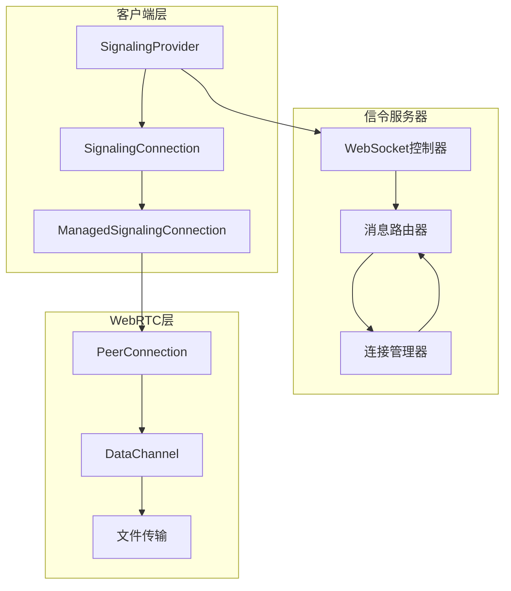

**图表来源**
- [signaling_provider.dart](file://app/lib/provider/network/webrtc/signaling_provider.dart#L1-L50)
- [ws_controller.rs](file://server/src/controller/ws_controller.rs#L1-L50)

**章节来源**
- [signaling.rs](file://core/src/webrtc/signaling.rs#L1-L100)
- [signaling_provider.dart](file://app/lib/provider/network/webrtc/signaling_provider.dart#L1-L100)

## WebSocket信令通道建立

### 连接认证机制

信令连接的建立过程包含多层认证机制：

1. **基础认证**：通过查询参数传递客户端信息
2. **令牌验证**：使用基于公钥加密的令牌系统
3. **防DDoS保护**：IP组限制和请求频率控制

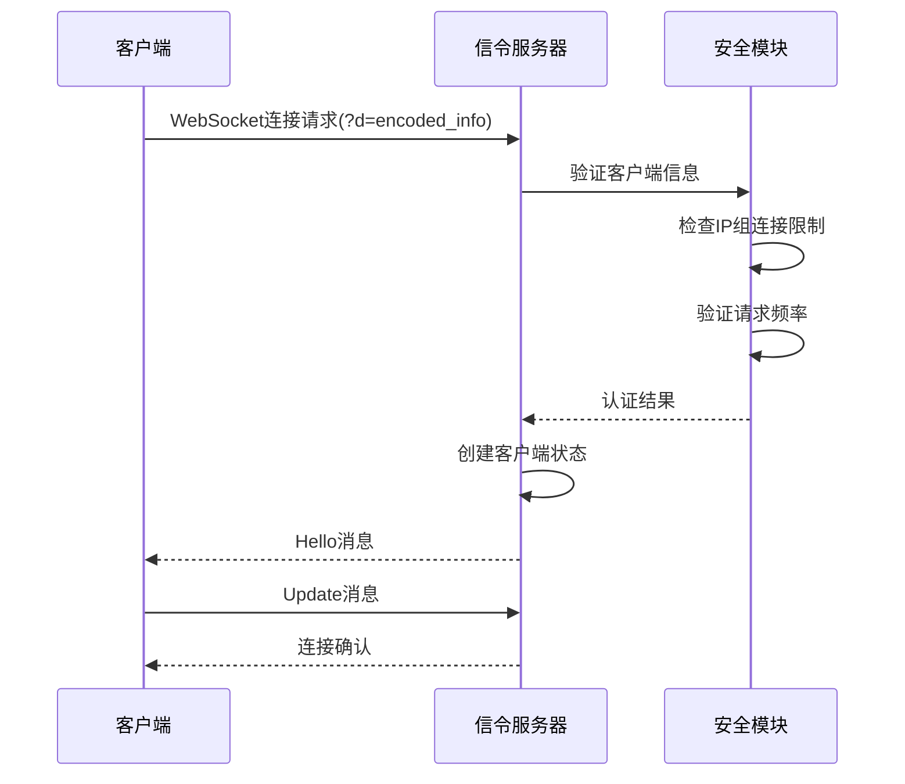

**图表来源**
- [ws_controller.rs](file://server/src/controller/ws_controller.rs#L40-L120)
- [signaling.rs](file://core/src/webrtc/signaling.rs#L170-L280)

### 连接建立流程

连接建立过程包含以下关键步骤：

1. **URI构建**：将客户端信息编码为Base64并通过查询参数传递
2. **WebSocket握手**：建立持久化的WebSocket连接
3. **Hello消息交换**：服务器发送Hello消息包含客户端信息和现有对等节点列表
4. **连接确认**：客户端发送Update消息确认连接

**章节来源**
- [signaling.rs](file://core/src/webrtc/signaling.rs#L170-L280)
- [ws_controller.rs](file://server/src/controller/ws_controller.rs#L40-L120)

## 消息格式定义

### 核心消息类型

信令协议定义了六种主要消息类型：

| 消息类型 | 描述 | JSON结构 | 使用场景 |
|---------|------|----------|----------|
| HELLO | 初始连接消息 | `{type: "HELLO", client: ClientInfo, peers: ClientInfo[]}` | 新客户端连接时发送 |
| JOIN | 设备加入通知 | `{type: "JOIN", peer: ClientInfo}` | 新设备加入网络时广播 |
| UPDATE | 设备信息更新 | `{type: "UPDATE", peer: ClientInfo}` | 设备信息变更时通知 |
| LEFT | 设备离开通知 | `{type: "LEFT", peerId: UUID}` | 设备断开连接时广播 |
| OFFER | SDP协商请求 | `{type: "OFFER", sessionId: String, target: UUID, sdp: String}` | 发起文件传输前的协商 |
| ANSWER | SDP协商响应 | `{type: "ANSWER", sessionId: String, target: UUID, sdp: String}` | 响应文件传输协商 |
| ERROR | 错误通知 | `{type: "ERROR", code: Number}` | 系统错误或限制触发时 |

### 数据结构定义

#### 客户端信息结构

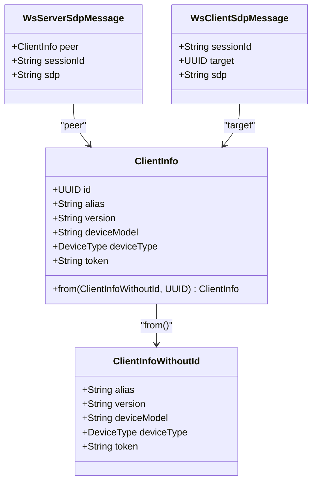

**图表来源**
- [signaling.rs](file://core/src/webrtc/signaling.rs#L70-L150)

**章节来源**
- [signaling.rs](file://core/src/webrtc/signaling.rs#L15-L150)

## 消息序列化与反序列化

### Serde配置

LocalSend使用Serde库进行JSON序列化，采用特定的命名约定：

- **服务器消息**：使用SCREAMING_SNAKE_CASE命名法
- **客户端消息**：使用camelCase命名法
- **字段重命名**：特定字段需要重命名以兼容不同平台

### 序列化过程

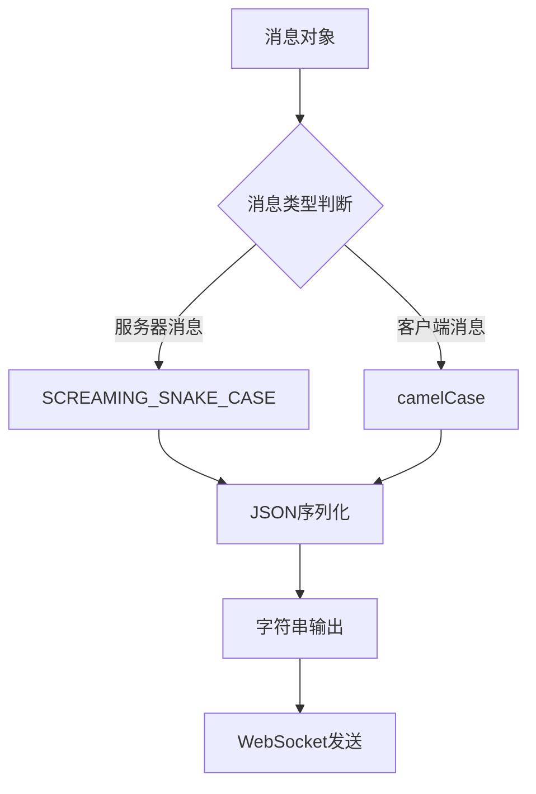

**图表来源**
- [signaling.rs](file://core/src/webrtc/signaling.rs#L15-L150)

### 反序列化过程

服务器端的反序列化包含错误处理：

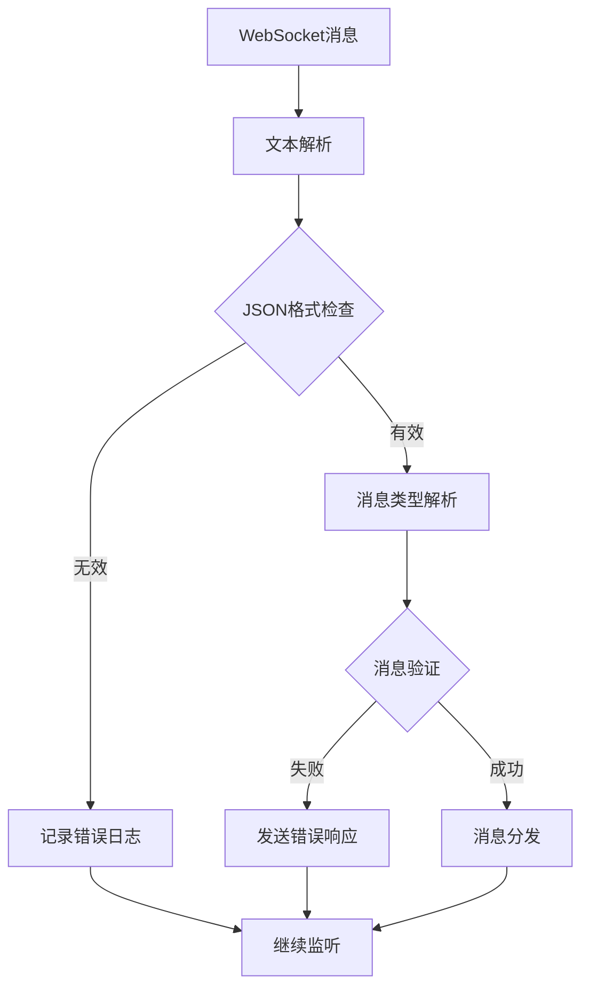

**图表来源**
- [ws_controller.rs](file://server/src/controller/ws_controller.rs#L165-L200)

**章节来源**
- [signaling.rs](file://core/src/webrtc/signaling.rs#L410-L528)
- [ws_controller.rs](file://server/src/controller/ws_controller.rs#L165-L200)

## 连接状态管理

### 连接生命周期

信令连接的生命周期包含多个阶段：

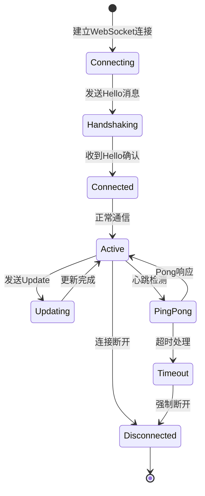

### 保活机制

系统实现了双重保活机制：

1. **主动心跳**：定期发送Ping消息
2. **被动响应**：接收Pong消息确认连接

### 优雅关闭

连接关闭时执行清理操作：

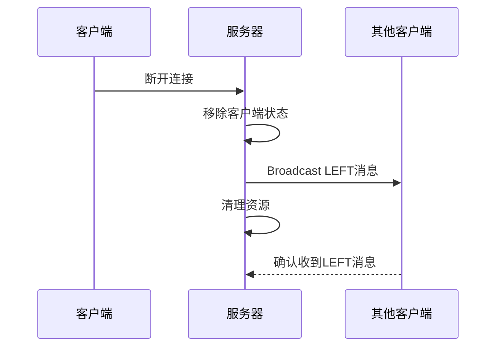

**图表来源**
- [ws_controller.rs](file://server/src/controller/ws_controller.rs#L230-L272)

**章节来源**
- [signaling.rs](file://core/src/webrtc/signaling.rs#L270-L320)
- [ws_controller.rs](file://server/src/controller/ws_controller.rs#L230-L272)

## 安全机制

### 令牌系统

LocalSend实现了基于公钥加密的令牌验证系统：

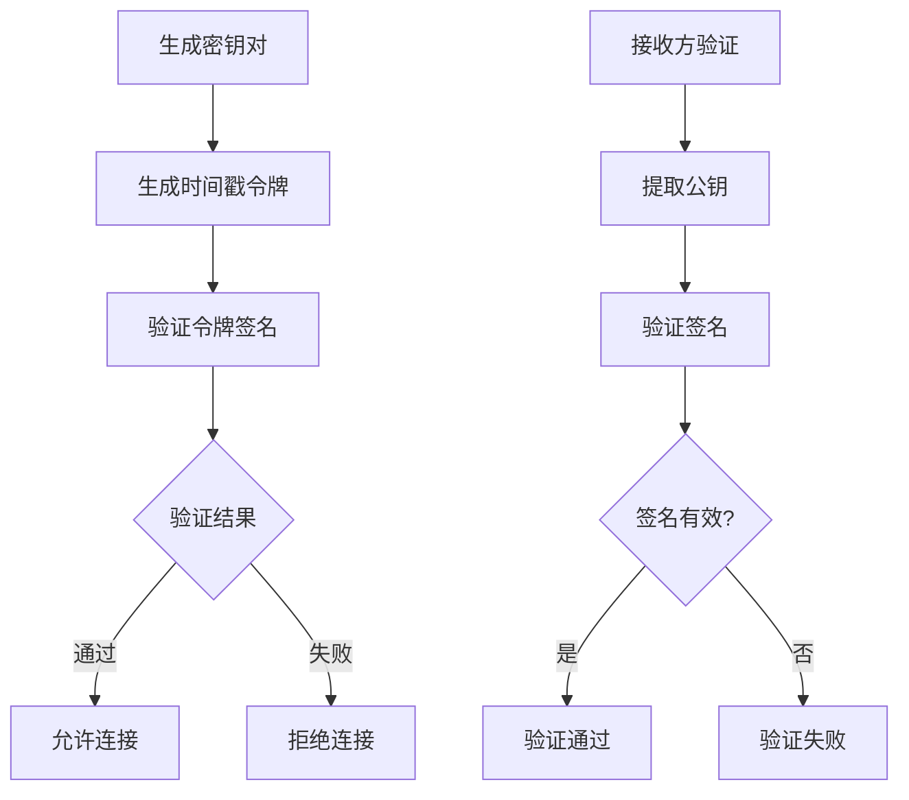

**图表来源**
- [token.rs](file://core/src/crypto/token.rs#L130-L223)

### 防重放攻击

系统通过以下机制防止重放攻击：

1. **时间戳验证**：令牌有效期限制（1小时）
2. **随机数验证**：每次连接使用不同的随机数
3. **请求频率限制**：IP级别的请求计数限制

### 连接超时处理

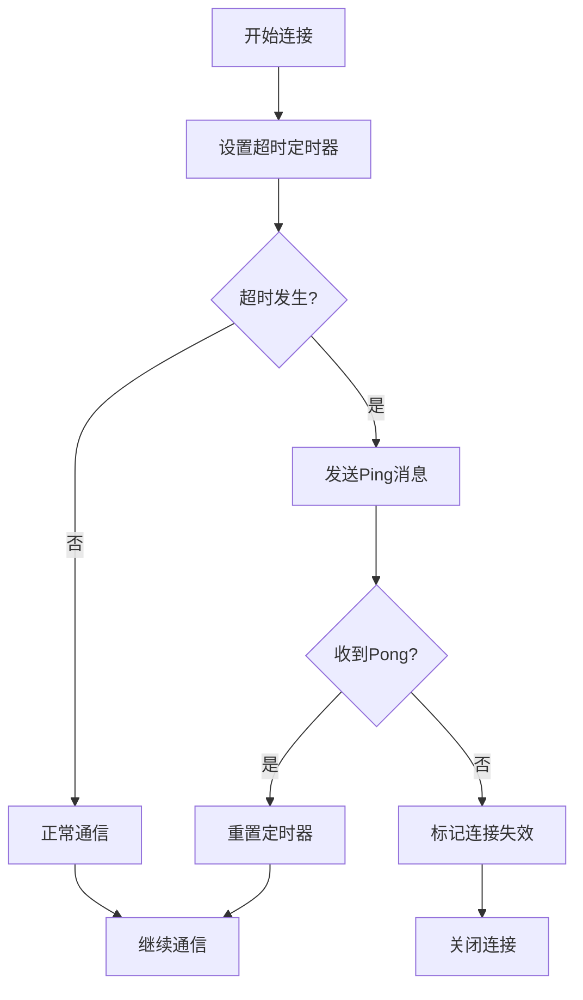

**图表来源**
- [signaling.rs](file://core/src/webrtc/signaling.rs#L200-L250)

**章节来源**
- [token.rs](file://core/src/crypto/token.rs#L130-L223)
- [ws_controller.rs](file://server/src/controller/ws_controller.rs#L340-L370)

## 错误处理策略

### 错误分类

系统定义了多种错误类型：

| 错误代码 | 错误类型 | 处理策略 | 用户反馈 |
|---------|----------|----------|----------|
| 429 | 请求过多 | 拒绝新连接 | 显示限制提示 |
| 400 | 参数错误 | 关闭连接 | 重新初始化 |
| 500 | 内部错误 | 记录日志 | 自动重试 |
| 408 | 连接超时 | 发送Ping | 继续等待 |

### 异常恢复机制

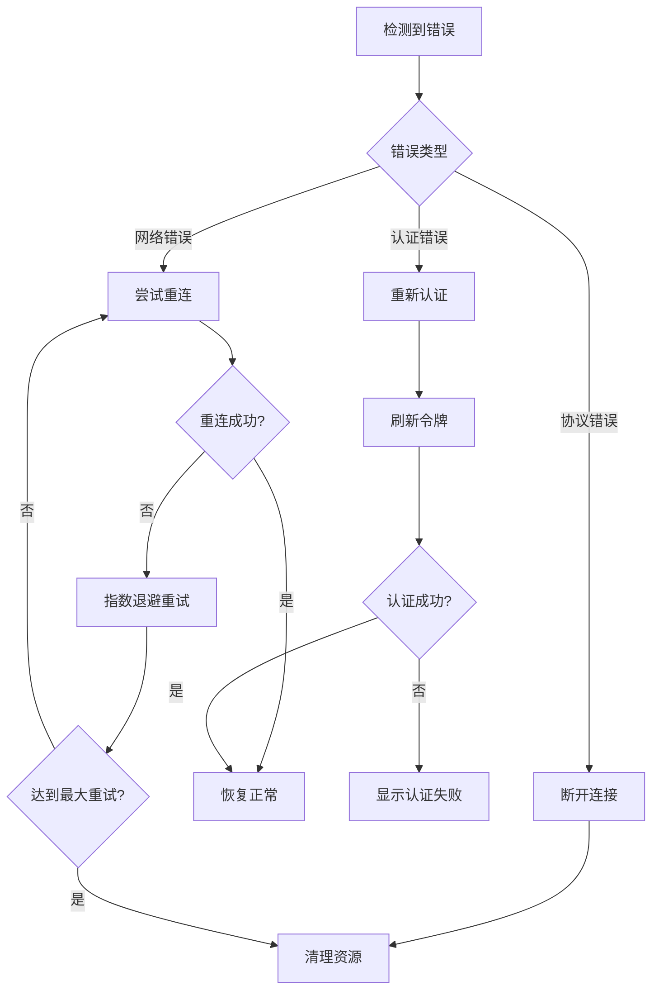

**图表来源**
- [ws_controller.rs](file://server/src/controller/ws_controller.rs#L165-L200)

### 日志记录

系统实现了分级日志记录：

- **DEBUG**：连接建立、消息发送
- **INFO**：设备加入、离开、状态变化
- **WARN**：连接异常、超时警告
- **ERROR**：认证失败、内部错误

**章节来源**
- [ws_controller.rs](file://server/src/controller/ws_controller.rs#L165-L200)
- [signaling.rs](file://core/src/webrtc/signaling.rs#L200-L250)

## 实际应用示例

### 文件传输信令流程

以下是完整的文件传输信令流程：

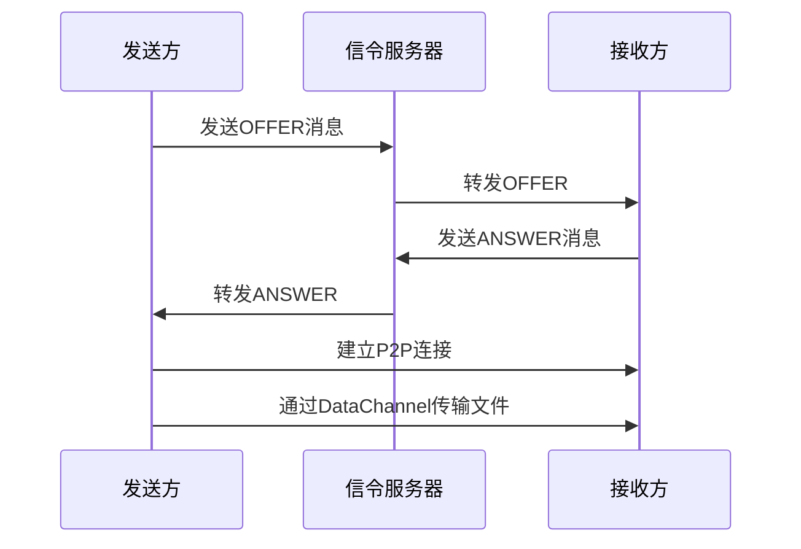

**图表来源**
- [webrtc.rs](file://core/src/webrtc/webrtc.rs#L110-L200)

### 设备发现流程

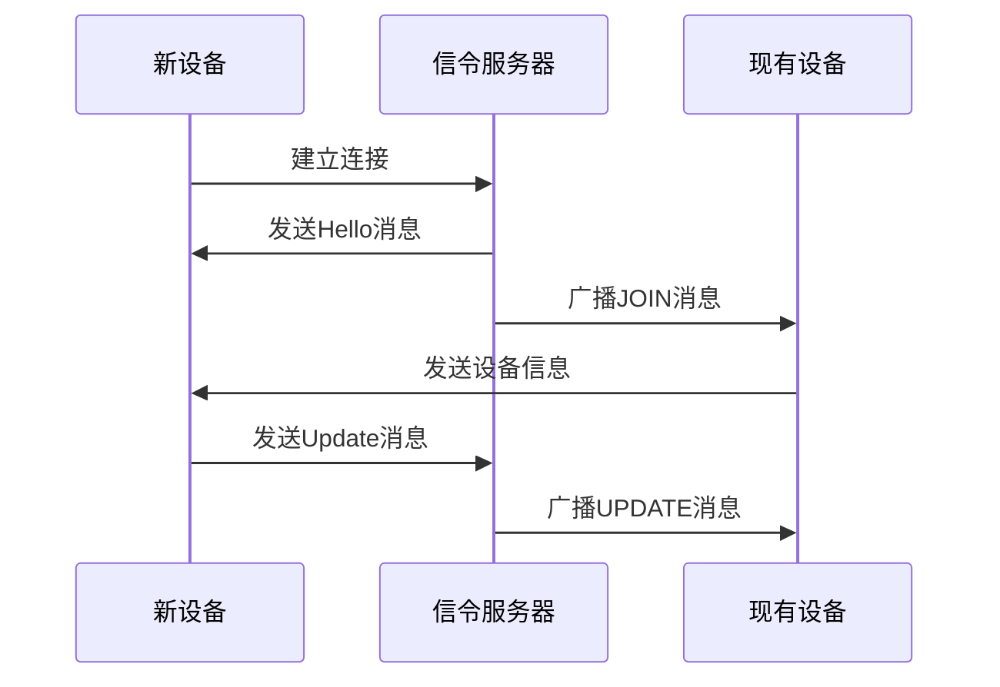

**图表来源**
- [signaling_provider.dart](file://app/lib/provider/network/webrtc/signaling_provider.dart#L80-L150)

**章节来源**
- [webrtc.rs](file://core/src/webrtc/webrtc.rs#L110-L200)
- [signaling_provider.dart](file://app/lib/provider/network/webrtc/signaling_provider.dart#L80-L150)

## 性能优化建议

### 连接池管理

1. **连接复用**：避免频繁建立和断开连接
2. **负载均衡**：在多个信令服务器间分配连接
3. **连接预热**：预先建立连接减少延迟

### 消息批处理

1. **批量发送**：将多个小消息合并为单个WebSocket消息
2. **优先级队列**：重要消息优先发送
3. **压缩传输**：对大型消息进行压缩

### 缓存策略

1. **设备信息缓存**：缓存设备元数据减少重复查询
2. **连接状态缓存**：维护连接状态的本地副本
3. **令牌缓存**：缓存已验证的令牌避免重复验证

### 监控指标

建议监控以下关键指标：

- **连接成功率**：连接建立成功的百分比
- **消息延迟**：消息从发送到接收的时间
- **错误率**：各类错误的发生频率
- **并发连接数**：同时活跃的连接数量
- **带宽使用**：信令流量的统计信息

这些优化措施能够显著提升系统的性能和可靠性，特别是在高并发场景下。