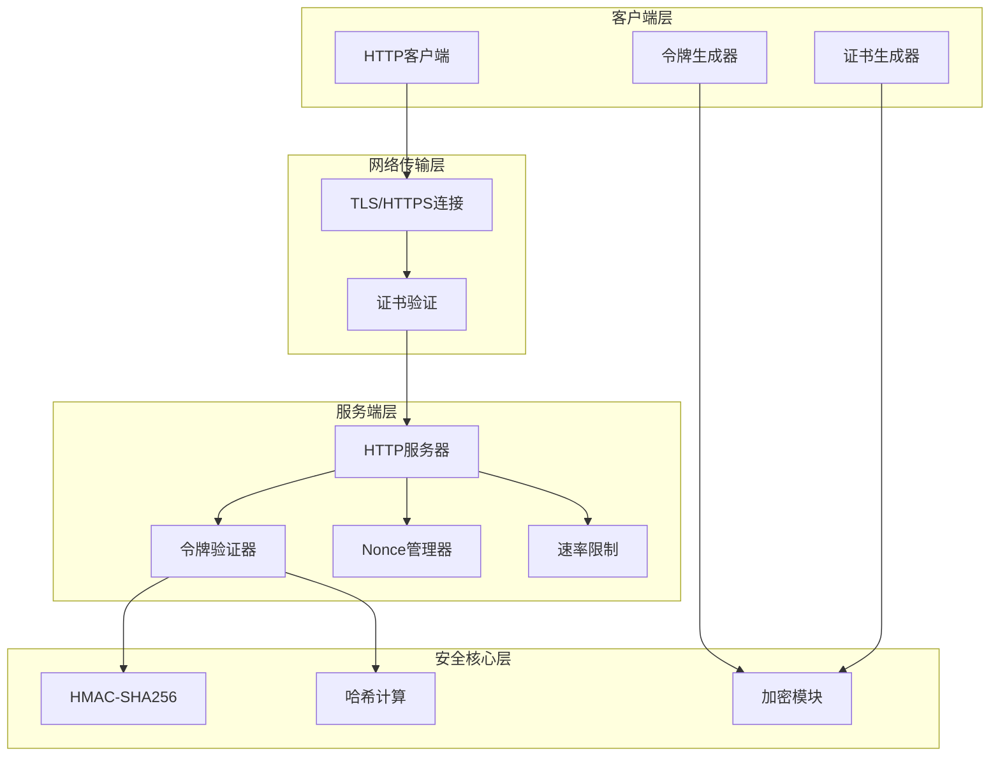
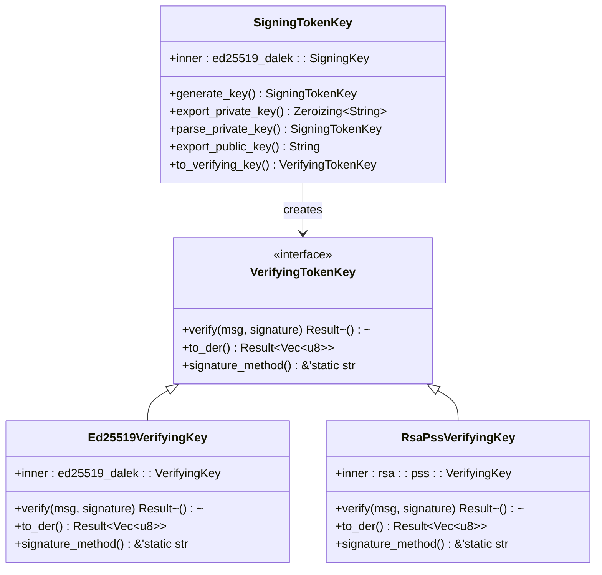
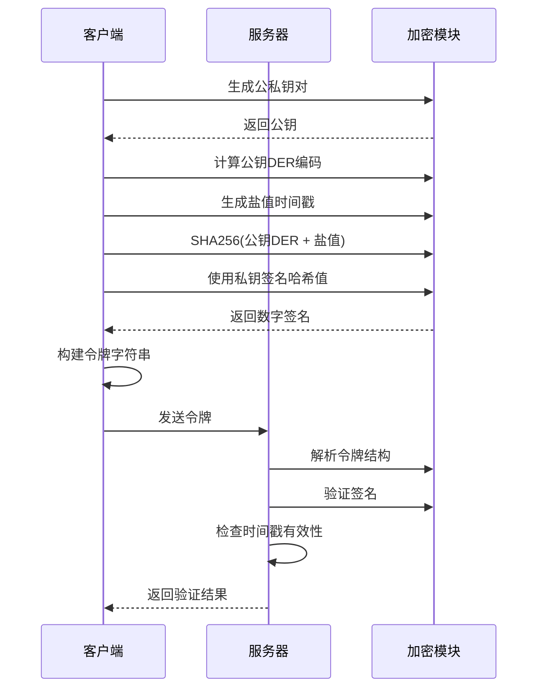
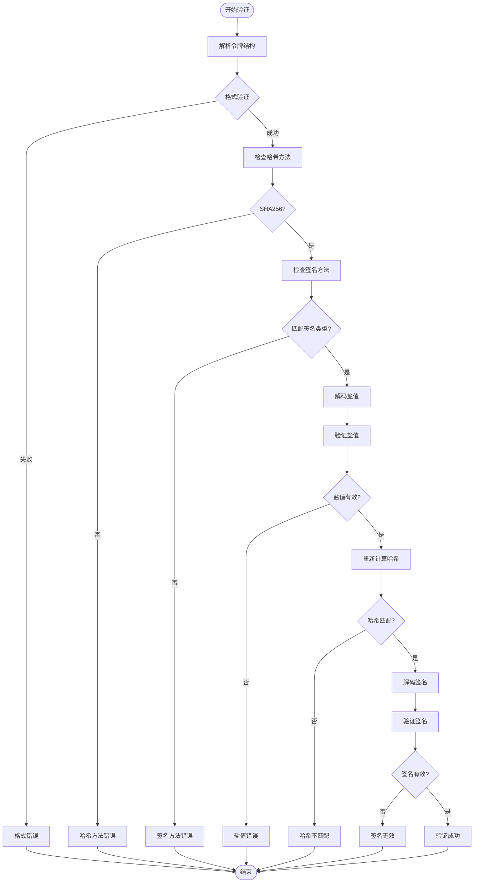
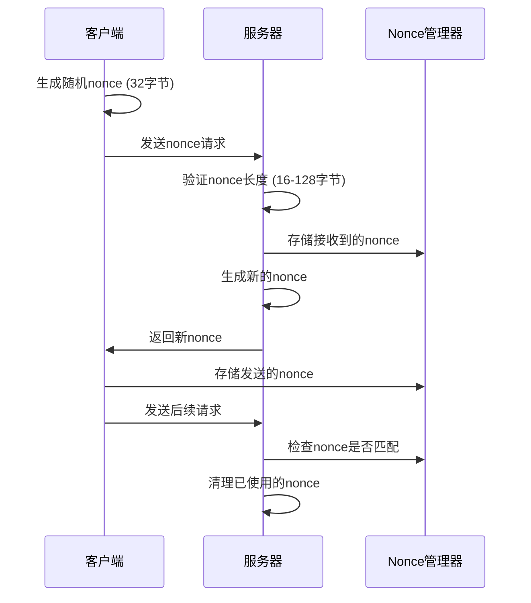
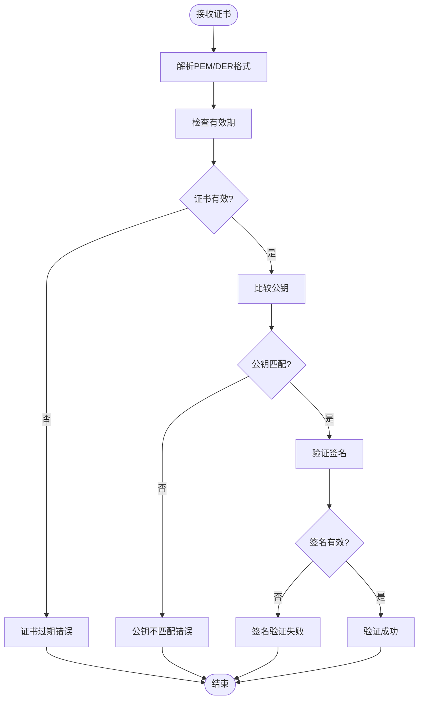
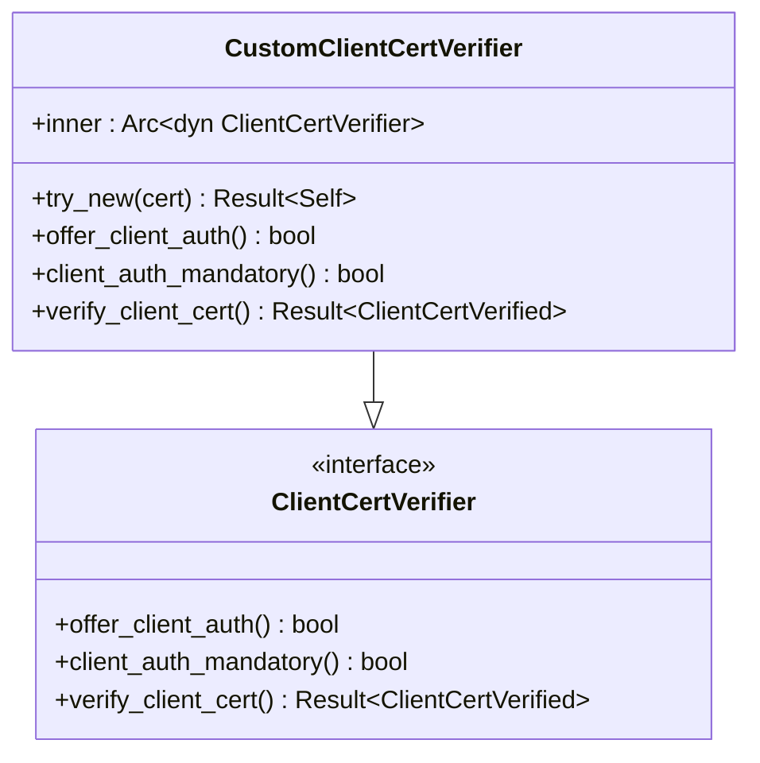
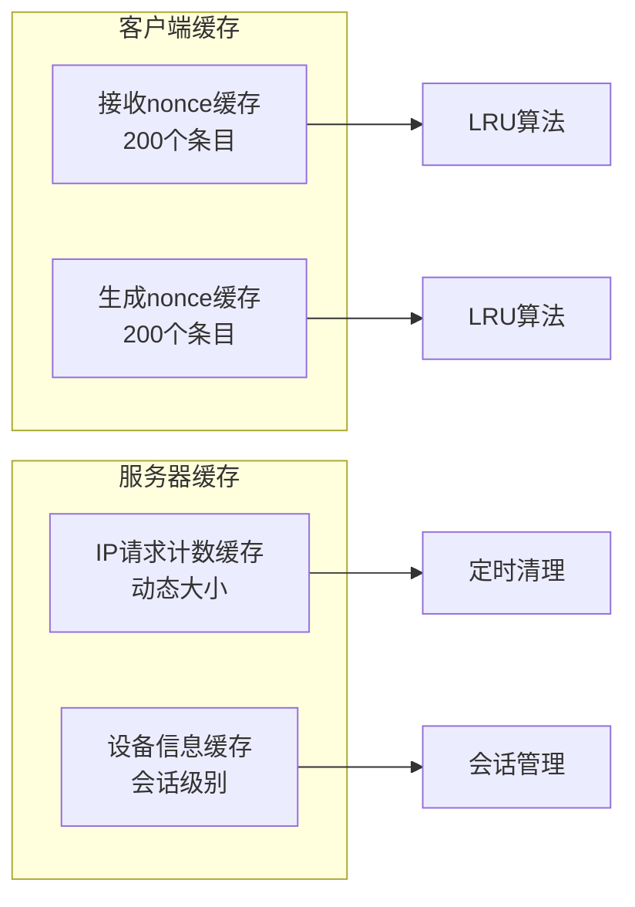
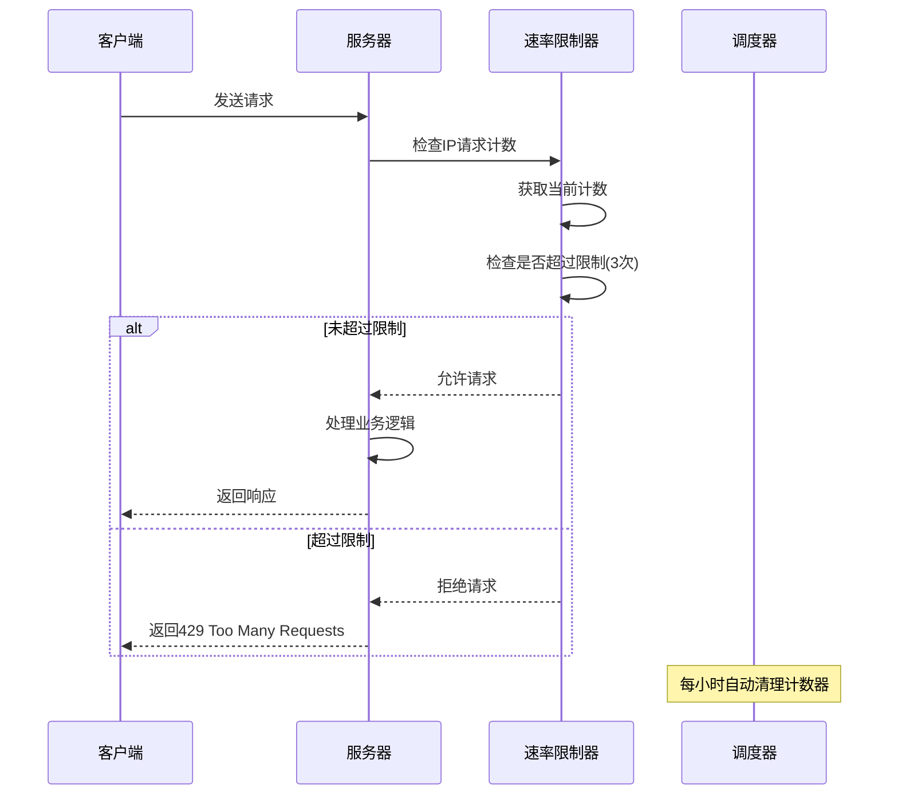

# 令牌验证功能详细文档

<cite>
**本文档中引用的文件**
- [token.rs](file://core/src/crypto/token.rs)
- [nonce.rs](file://core/src/crypto/nonce.rs)
- [hash.rs](file://core/src/crypto/hash.rs)
- [cert.rs](file://core/src/crypto/cert.rs)
- [client_cert_verifier.rs](file://core/src/http/server/client_cert_verifier.rs)
- [server/mod.rs](file://core/src/http/server/mod.rs)
- [client/mod.rs](file://core/src/http/client/mod.rs)
- [error.rs](file://core/src/http/server/error.rs)
- [scheduler.rs](file://server/src/config/scheduler.rs)
- [ws_controller.rs](file://server/src/controller/ws_controller.rs)
</cite>

## 目录
1. [简介](#简介)
2. [系统架构概览](#系统架构概览)
3. [核心组件分析](#核心组件分析)
4. [令牌生成与验证机制](#令牌生成与验证机制)
5. [防重放攻击与nonce管理](#防重放攻击与nonce管理)
6. [证书验证与TLS安全](#证书验证与tls安全)
7. [错误处理与状态码](#错误处理与状态码)
8. [性能优化与缓存策略](#性能优化与缓存策略)
9. [安全最佳实践](#安全最佳实践)
10. [故障排除指南](#故障排除指南)
11. [总结](#总结)

## 简介

LocalSend是一个跨平台的文件传输应用，采用基于令牌的安全验证机制来确保通信安全。该系统实现了完整的HMAC-SHA256算法、防重放攻击的nonce管理、时间戳验证和证书链验证等安全特性。本文档深入解析了LocalSend的令牌验证功能，包括其设计原理、实现细节和安全考虑。

## 系统架构概览

LocalSend的令牌验证系统采用分层架构设计，主要包含以下核心层次：

**图表来源**
- [client/mod.rs](file://core/src/http/client/mod.rs#L42-L77)
- [server/mod.rs](file://core/src/http/server/mod.rs#L0-L36)
- [token.rs](file://core/src/crypto/token.rs#L0-L50)

## 核心组件分析

### 令牌密钥管理系统

LocalSend实现了灵活的密钥管理系统，支持多种签名算法：

**图表来源**
- [token.rs](file://core/src/crypto/token.rs#L8-L50)

### 令牌结构设计

令牌采用标准化的五段式结构，确保完整性和可验证性：

| 组件 | 描述 | 编码方式 | 长度要求 |
|------|------|----------|----------|
| 哈希方法 | SHA256算法标识 | 字符串 | 固定："sha256" |
| 哈希值 | 公钥+盐值的SHA256哈希 | Base64 | 44字符 |
| 盐值 | 时间戳或随机数 | Base64 | 12-24字符 |
| 签名方法 | 签名算法标识 | 字符串 | "ed25519" 或 "rsa-pss" |
| 签名 | 数字签名 | Base64 | 变长 |

**节来源**
- [token.rs](file://core/src/crypto/token.rs#L115-L131)

## 令牌生成与验证机制

### HMAC-SHA256算法实现

LocalSend使用HMAC-SHA256作为核心加密算法，确保令牌的完整性和真实性：

**图表来源**
- [token.rs](file://core/src/crypto/token.rs#L115-L131)
- [token.rs](file://core/src/crypto/token.rs#L171-L223)

### 令牌验证流程

令牌验证过程包含多个安全检查步骤：

**图表来源**
- [token.rs](file://core/src/crypto/token.rs#L171-L223)

**节来源**
- [token.rs](file://core/src/crypto/token.rs#L171-L223)

## 防重放攻击与Nonce管理

### Nonce生成与验证

LocalSend实现了严格的nonce管理机制来防止重放攻击：

**图表来源**
- [nonce.rs](file://core/src/crypto/nonce.rs#L0-L10)
- [server/mod.rs](file://core/src/http/server/mod.rs#L300-L343)

### 时间戳验证机制

为了防止时间漂移攻击，LocalSend实现了严格的时间戳验证：

| 验证项 | 要求 | 错误处理 |
|--------|------|----------|
| 时间戳格式 | 8字节小端序整数 | 返回"Invalid salt length" |
| 时间差限制 | ≤ 1小时 | 返回"Timestamp expired" |
| 时钟同步 | 基于系统时间 | 支持本地时间校准 |

**节来源**
- [token.rs](file://core/src/crypto/token.rs#L139-L165)

## 证书验证与TLS安全

### 证书验证流程

LocalSend实现了完整的X.509证书验证机制：

**图表来源**
- [cert.rs](file://core/src/crypto/cert.rs#L20-L45)

### TLS客户端认证

服务器实现了强制客户端证书认证：

**图表来源**
- [client_cert_verifier.rs](file://core/src/http/server/client_cert_verifier.rs#L10-L41)

**节来源**
- [client_cert_verifier.rs](file://core/src/http/server/client_cert_verifier.rs#L10-L82)

## 错误处理与状态码

### 统一错误处理机制

LocalSend实现了统一的错误处理框架：

| 错误类型 | HTTP状态码 | 错误消息 | 处理策略 |
|----------|------------|----------|----------|
| 格式错误 | 400 | "Invalid structure" | 立即返回 |
| 哈希方法错误 | 400 | "Invalid hash method" | 立即返回 |
| 签名方法错误 | 400 | "Invalid sign method" | 立即返回 |
| 时间戳过期 | 400 | "Fingerprint timestamp expired" | 立即返回 |
| 非法nonce | 400 | "Invalid nonce" | 立即返回 |
| 签名验证失败 | 400 | "Invalid signature" | 立即返回 |
| 证书验证失败 | 400 | "Certificate verification failed" | 立即返回 |
| 请求过于频繁 | 429 | "Too many requests" | 限流处理 |

**节来源**
- [error.rs](file://core/src/http/server/error.rs#L0-L30)

## 性能优化与缓存策略

### LRU缓存机制

LocalSend使用LRU缓存来优化nonce管理和请求计数：

**图表来源**
- [client/mod.rs](file://core/src/http/client/mod.rs#L55-L65)
- [scheduler.rs](file://server/src/config/scheduler.rs#L0-L23)

### 速率限制实现

服务器实现了基于IP的请求频率限制：

**图表来源**
- [ws_controller.rs](file://server/src/controller/ws_controller.rs#L350-L368)
- [scheduler.rs](file://server/src/config/scheduler.rs#L0-L23)

**节来源**
- [ws_controller.rs](file://server/src/controller/ws_controller.rs#L350-L368)

## 安全最佳实践

### 密钥管理

1. **密钥生成**：使用操作系统提供的密码学安全随机数生成器
2. **密钥存储**：私钥以PKCS#8格式加密存储
3. **密钥轮换**：支持定期更新证书和密钥对
4. **密钥销毁**：使用Zeroizing确保敏感数据在内存中被安全清除

### 传输安全

1. **强制TLS**：所有通信必须使用TLS协议
2. **证书固定**：客户端验证服务器证书的指纹
3. **双向认证**：服务器和客户端都进行证书验证
4. **加密套件**：使用最新的TLS版本和强加密算法

### 访问控制

1. **IP白名单**：支持基于IP地址的访问控制
2. **PIN保护**：可选的PIN码保护机制
3. **会话隔离**：每个客户端建立独立的安全会话
4. **权限验证**：基于令牌的细粒度权限控制

### 监控与审计

1. **日志记录**：详细记录安全事件和异常情况
2. **性能监控**：跟踪令牌验证的性能指标
3. **异常检测**：自动检测和报告可疑活动
4. **合规性**：符合相关安全标准和法规要求

## 故障排除指南

### 常见问题诊断

| 问题症状 | 可能原因 | 解决方案 |
|----------|----------|----------|
| 令牌验证失败 | 时间戳过期 | 检查系统时钟同步 |
| 证书验证错误 | 证书过期或损坏 | 更新证书文件 |
| 非法nonce错误 | 网络传输损坏 | 重试请求 |
| 连接超时 | 网络配置问题 | 检查防火墙设置 |
| 权限拒绝 | PIN码错误 | 输入正确的PIN码 |

### 调试工具

1. **日志分析**：启用详细日志记录
2. **网络抓包**：使用Wireshark分析TLS握手
3. **证书检查**：验证证书链完整性
4. **时间同步**：确保系统时间准确

**节来源**
- [error.rs](file://core/src/http/server/error.rs#L0-L30)

## 总结

LocalSend的令牌验证功能体现了现代网络安全的最佳实践，通过多层次的安全机制确保了系统的安全性。其设计特点包括：

1. **算法安全性**：采用经过验证的加密算法（Ed25519、SHA256、HMAC）
2. **防护机制**：有效防止重放攻击、时钟漂移攻击和中间人攻击
3. **性能优化**：通过缓存和LRU算法提升验证效率
4. **错误处理**：完善的错误分类和处理机制
5. **可扩展性**：支持多种签名算法和证书格式

该系统为LocalSend提供了强大的安全保障，确保用户数据在传输过程中的机密性、完整性和可用性。通过持续的安全审计和更新，该令牌验证系统能够适应不断变化的安全威胁环境。