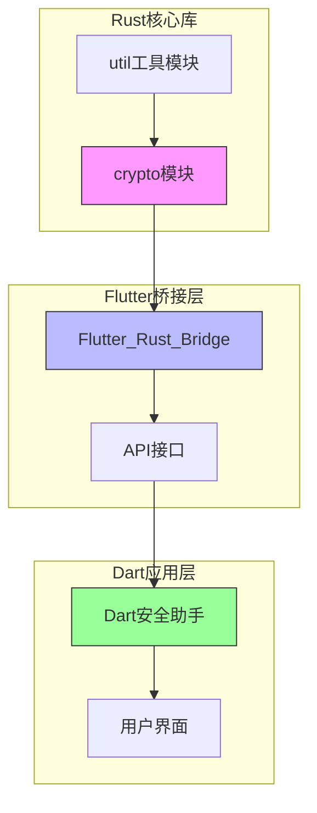
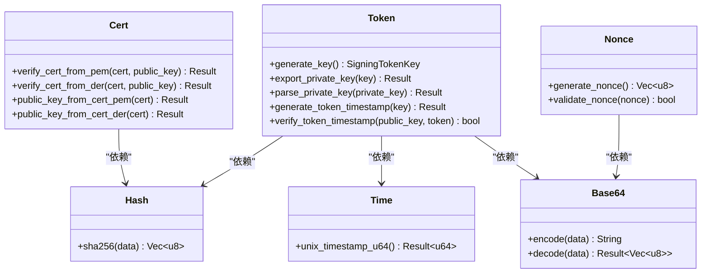
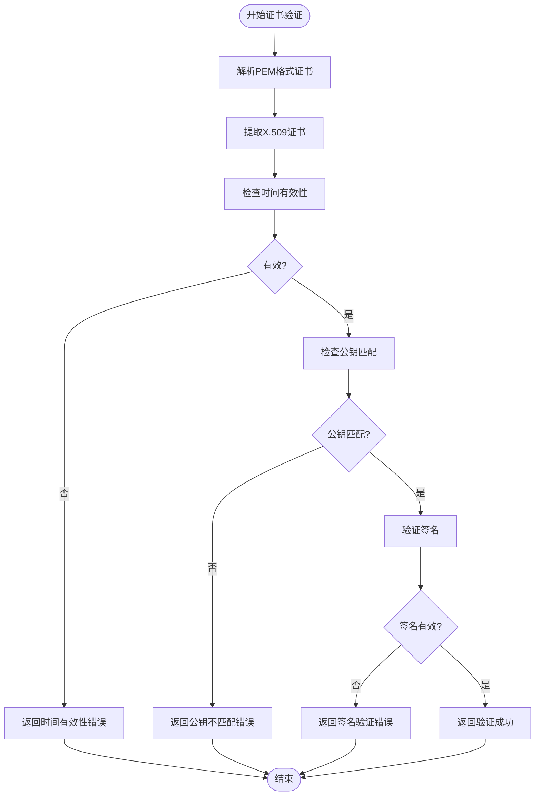
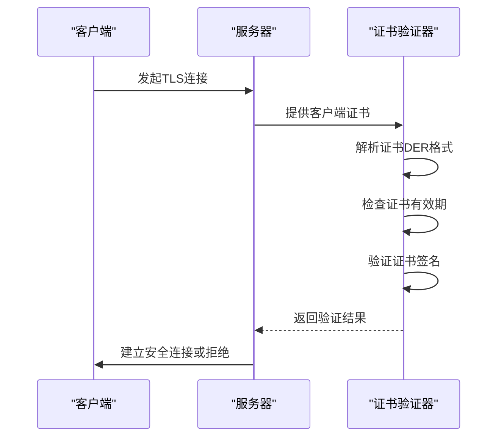
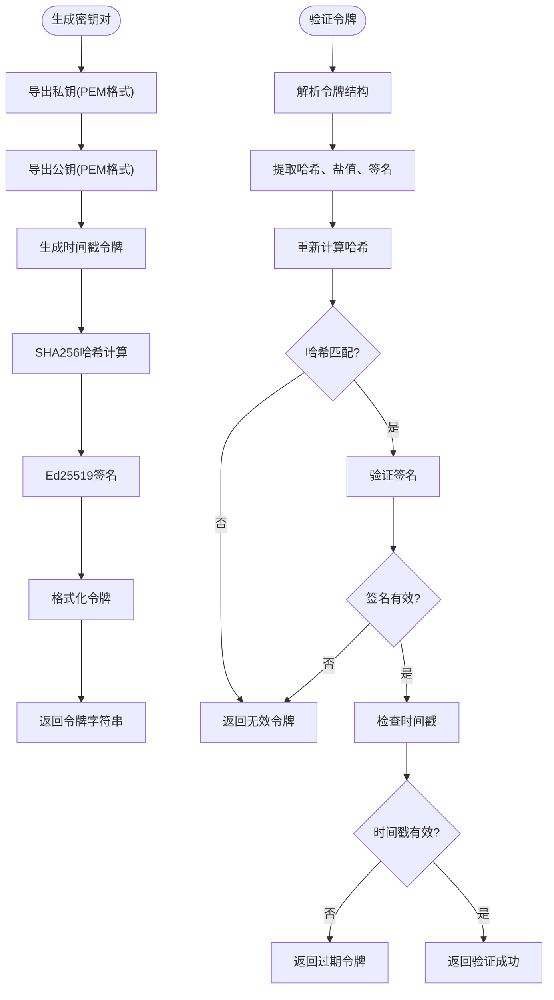
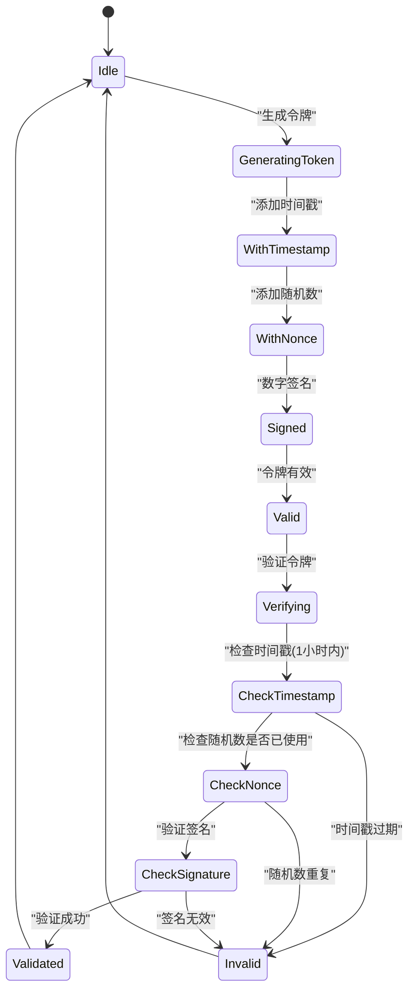
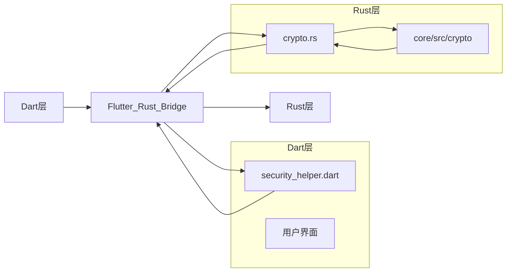
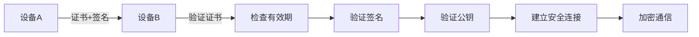
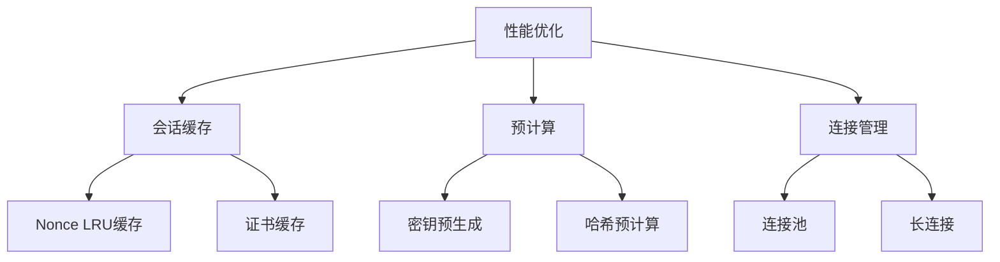

# 加密功能实现

<cite>
**本文档引用的文件**  
- [cert.rs](file://core/src/crypto/cert.rs)
- [token.rs](file://core/src/crypto/token.rs)
- [hash.rs](file://core/src/crypto/hash.rs)
- [nonce.rs](file://core/src/crypto/nonce.rs)
- [crypto.rs](file://app/rust/src/api/crypto.rs)
- [client_cert_verifier.rs](file://core/src/http/server/client_cert_verifier.rs)
- [mod.rs](file://core/src/crypto/mod.rs)
- [time.rs](file://core/src/util/time.rs)
- [base64.rs](file://core/src/util/base64.rs)
- [security_helper.dart](file://app/lib/util/security_helper.dart)
- [frb_generated.rs](file://app/rust/src/frb_generated.rs)
- [frb_generated.dart](file://app/lib/rust/frb_generated.dart)
</cite>

## 目录
1. [项目结构](#项目结构)
2. [核心加密组件](#核心加密组件)
3. [X.509证书实现](#x509证书实现)
4. [安全令牌机制](#安全令牌机制)
5. [Flutter_Rust_Bridge集成](#flutter_rust_bridge集成)
6. [安全最佳实践](#安全最佳实践)
7. [性能优化](#性能优化)

## 项目结构

LocalSend项目的加密功能主要分布在`core/src/crypto`目录中，通过Flutter_Rust_Bridge与Dart层集成。核心加密模块包括证书验证、安全令牌生成、哈希计算和随机数生成等功能。



**图源**  
- [mod.rs](file://core/src/crypto/mod.rs)
- [frb_generated.rs](file://app/rust/src/frb_generated.rs)
- [security_helper.dart](file://app/lib/util/security_helper.dart)

**本节来源**  
- [project_structure](file://project_structure)

## 核心加密组件

LocalSend的加密功能基于Rust核心库实现，主要包含证书验证、安全令牌、哈希计算和随机数生成四个核心组件。这些组件通过清晰的模块化设计，确保了加密功能的可维护性和安全性。



**图源**  
- [cert.rs](file://core/src/crypto/cert.rs)
- [token.rs](file://core/src/crypto/token.rs)
- [hash.rs](file://core/src/crypto/hash.rs)
- [nonce.rs](file://core/src/crypto/nonce.rs)
- [time.rs](file://core/src/util/time.rs)
- [base64.rs](file://core/src/util/base64.rs)

**本节来源**  
- [cert.rs](file://core/src/crypto/cert.rs#L1-L187)
- [token.rs](file://core/src/crypto/token.rs#L1-L255)
- [hash.rs](file://core/src/crypto/hash.rs#L1-L8)
- [nonce.rs](file://core/src/crypto/nonce.rs#L1-L12)

## X.509证书实现

LocalSend使用X.509证书进行设备间安全通信的身份验证。证书验证功能确保通信双方的身份合法性，防止中间人攻击。

### 证书验证流程



**图源**  
- [cert.rs](file://core/src/crypto/cert.rs#L15-L78)

### 证书验证实现

证书验证功能通过`verify_cert_from_pem`和`verify_cert_from_der`两个主要函数实现，支持PEM和DER两种格式的证书验证。验证过程包括三个关键步骤：

1. **时间有效性检查**：确保证书在有效期内
2. **公钥匹配验证**：确认证书中的公钥与提供的公钥一致
3. **签名验证**：验证证书的数字签名

```rust
fn verify_cert_from_cert(cert: X509Certificate, public_key: Option<String>) -> anyhow::Result<()> {
    if !cert.validity.is_valid() {
        return Err(anyhow::anyhow!("Time validity error"));
    }

    if let Some(public_key) = public_key {
        let cert_public_key = cert.tbs_certificate.subject_pki.parsed()?;
        
        let (public_key_pem, _) = Pem::read(Cursor::new(public_key.into_bytes()))?;
        let (_, public_key_spki) = SubjectPublicKeyInfo::from_der(&public_key_pem.contents)?;
        let expected_public_key = public_key_spki.parsed()?;

        if cert_public_key != expected_public_key {
            return Err(anyhow::anyhow!("Public key mismatch"));
        }
    }

    cert.verify_signature(None)?;
    Ok(())
}
```

**本节来源**  
- [cert.rs](file://core/src/crypto/cert.rs#L35-L78)

### 服务器端证书验证

在HTTP服务器端，LocalSend实现了自定义的客户端证书验证器，确保只有持有有效证书的客户端才能建立连接。



**图源**  
- [client_cert_verifier.rs](file://core/src/http/server/client_cert_verifier.rs#L39-L82)

**本节来源**  
- [client_cert_verifier.rs](file://core/src/http/server/client_cert_verifier.rs#L0-L82)

## 安全令牌机制

LocalSend使用基于Ed25519的数字签名机制实现安全令牌，确保通信的完整性和身份验证。

### 令牌生成与验证



**图源**  
- [token.rs](file://core/src/crypto/token.rs#L100-L200)

### 令牌实现细节

安全令牌的生成和验证基于Ed25519椭圆曲线签名算法，结合SHA256哈希函数，确保了高安全性和性能。

```rust
pub fn generate_token_timestamp(key: &SigningTokenKey) -> anyhow::Result<String> {
    let salt = util::time::unix_timestamp_u64()?.to_le_bytes();
    let result = generate_token_nonce(key, &salt)?;
    Ok(result)
}

pub fn verify_token_timestamp(public_key: &dyn VerifyingTokenKey, token: &str) -> bool {
    verify_token_with_result(public_key, token, |salt| {
        let salt = {
            if salt.len() != 8 {
                return Err(anyhow::anyhow!("Invalid salt length"));
            }
            u64::from_le_bytes(
                salt.try_into()
                    .map_err(|_| anyhow::anyhow!("Invalid salt"))?,
            )
        };

        let now_seconds = util::time::unix_timestamp_u64()?;
        if now_seconds - salt > 60 * 60 {
            return Err(anyhow::anyhow!("Fingerprint timestamp expired"));
        }

        Ok(())
    })
    .is_ok()
}
```

**本节来源**  
- [token.rs](file://core/src/crypto/token.rs#L100-L150)

### 防重放攻击机制

LocalSend通过时间戳和随机数机制防止重放攻击，确保每个令牌只能使用一次且在有效期内。



**图源**  
- [token.rs](file://core/src/crypto/token.rs#L150-L200)
- [nonce.rs](file://core/src/crypto/nonce.rs#L1-L12)

**本节来源**  
- [token.rs](file://core/src/crypto/token.rs#L150-L255)
- [nonce.rs](file://core/src/crypto/nonce.rs#L1-L12)

## Flutter_Rust_Bridge集成

LocalSend使用Flutter_Rust_Bridge实现Rust加密功能与Dart层的安全集成，确保加密操作在高性能的Rust环境中执行。

### 桥接架构



**图源**  
- [frb_generated.rs](file://app/rust/src/frb_generated.rs)
- [frb_generated.dart](file://app/lib/rust/frb_generated.dart)
- [crypto.rs](file://app/rust/src/api/crypto.rs)

### API接口实现

Rust层通过清晰的API接口暴露加密功能给Dart层，确保类型安全和错误处理的一致性。

```rust
pub fn verify_cert(cert: String, public_key: String) -> anyhow::Result<()> {
    localsend::crypto::cert::verify_cert_from_pem(cert, Some(public_key))
}

pub fn generate_key_pair() -> anyhow::Result<KeyPair> {
    let signing_key = localsend::crypto::token::generate_key();
    let private_key = localsend::crypto::token::export_private_key(&signing_key)?;
    let public_key = localsend::crypto::token::export_public_key(&signing_key)?;

    Ok(
        KeyPair {
            private_key: private_key.to_string(),
            public_key,
        }
    )
}

pub struct KeyPair {
    pub private_key: String,
    pub public_key: String,
}
```

**本节来源**  
- [crypto.rs](file://app/rust/src/api/crypto.rs#L1-L22)

### Dart层调用

Dart层通过安全助手类调用Rust加密功能，提供简洁的API接口。

```dart
Future<void> verifyCertificate({
  required String cert,
  required String publicKey,
}) async {
  await rust.verifyCert(cert: cert, publicKey: publicKey);
}
```

**本节来源**  
- [security_helper.dart](file://app/lib/util/security_helper.dart#L41-L70)

## 安全最佳实践

LocalSend遵循多项安全最佳实践，确保加密功能的安全性和可靠性。

### 密钥管理

- **密钥生成**：使用Ed25519椭圆曲线算法生成高强度密钥对
- **密钥存储**：私钥以PKCS#8 PEM格式存储，确保安全性和兼容性
- **密钥轮换**：支持定期生成新的密钥对，降低密钥泄露风险

### 证书安全

- **有效期管理**：严格检查证书的有效期，防止使用过期证书
- **公钥验证**：不仅验证证书签名，还验证公钥匹配，防止证书替换攻击
- **吊销检查**：虽然当前未实现CRL检查，但架构支持未来扩展

### 防中间人攻击

- **双向认证**：服务器验证客户端证书，客户端验证服务器证书
- **证书固定**：在设备配对时验证证书指纹，防止中间人攻击
- **安全通道**：所有通信通过TLS加密，确保数据机密性



**图源**  
- [cert.rs](file://core/src/crypto/cert.rs)
- [client_cert_verifier.rs](file://core/src/http/server/client_cert_verifier.rs)

**本节来源**  
- [cert.rs](file://core/src/crypto/cert.rs#L1-L187)
- [client_cert_verifier.rs](file://core/src/http/server/client_cert_verifier.rs#L0-L82)

## 性能优化

LocalSend在保证安全性的同时，也考虑了性能优化，确保加密操作不会成为性能瓶颈。

### 会话缓存

- **Nonce缓存**：使用LRU缓存存储已使用的随机数，防止重放攻击
- **连接复用**：保持长连接，减少TLS握手开销
- **证书缓存**：缓存已验证的证书，避免重复验证

### 预计算技术

- **密钥预生成**：在应用启动时预生成密钥对，减少运行时开销
- **哈希预计算**：对常用数据进行哈希预计算，提高验证速度
- **连接池**：维护HTTP连接池，减少连接建立时间



**图源**  
- [client.rs](file://core/src/http/client/mod.rs)
- [token.rs](file://core/src/crypto/token.rs)

**本节来源**  
- [client.rs](file://core/src/http/client/mod.rs#L42-L77)
- [token.rs](file://core/src/crypto/token.rs#L1-L255)