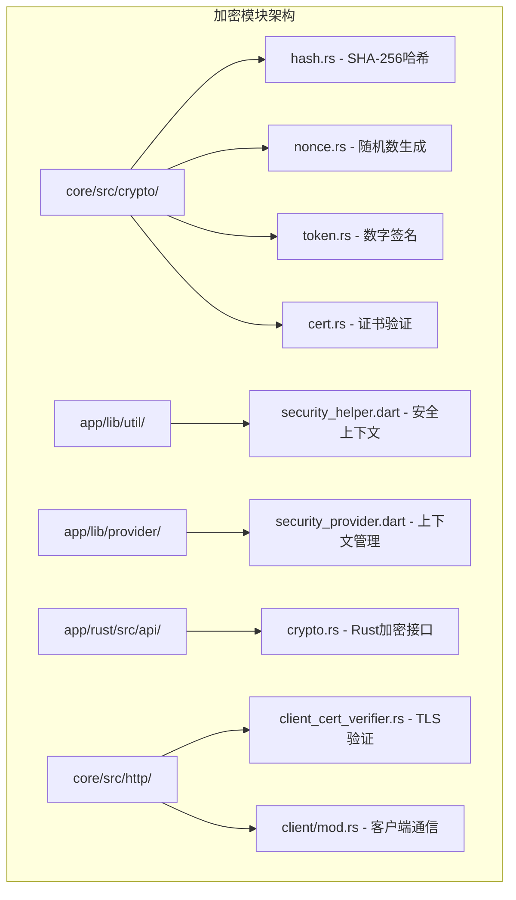
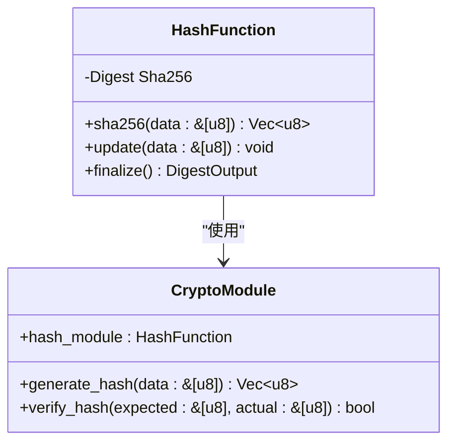
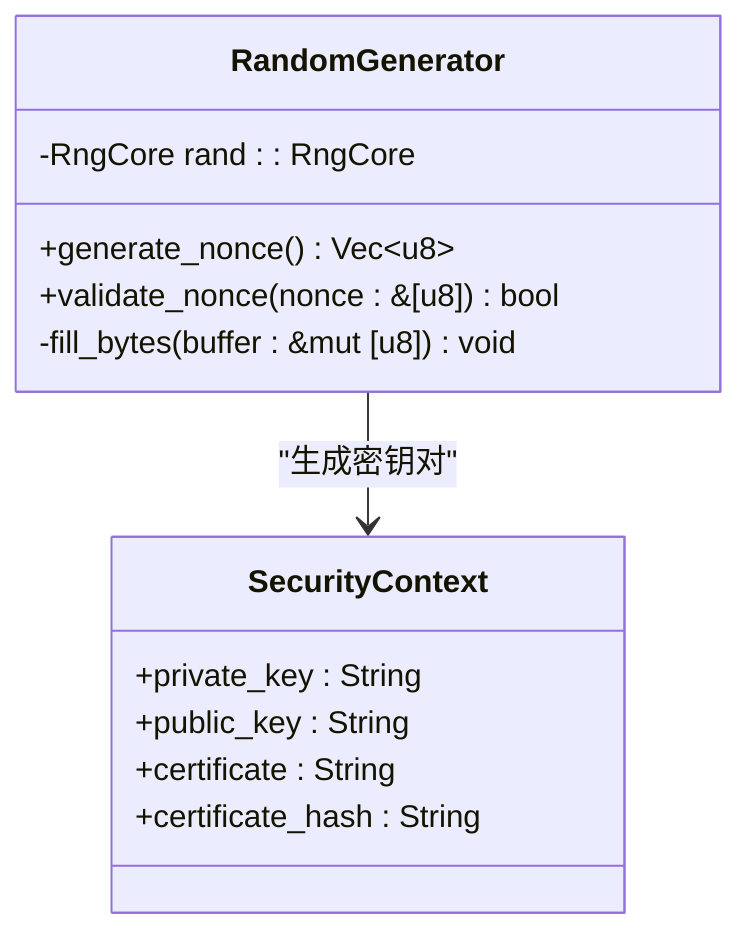
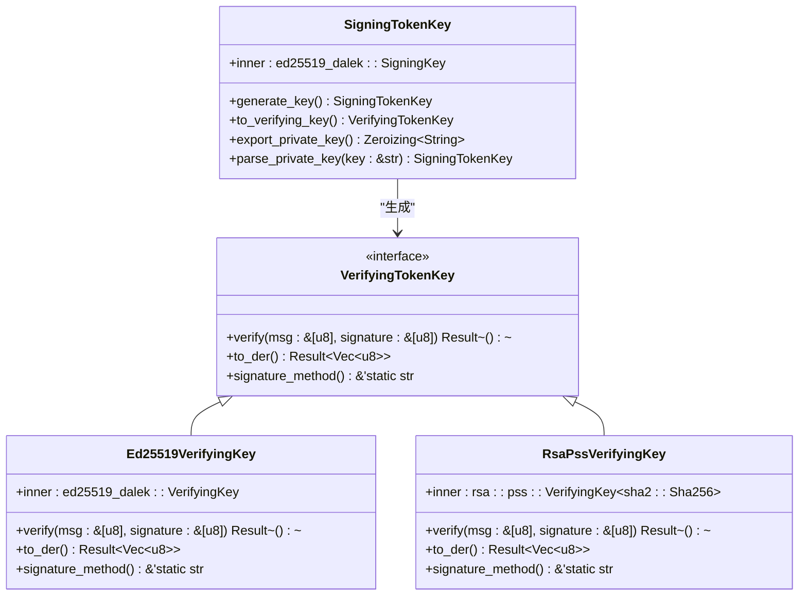
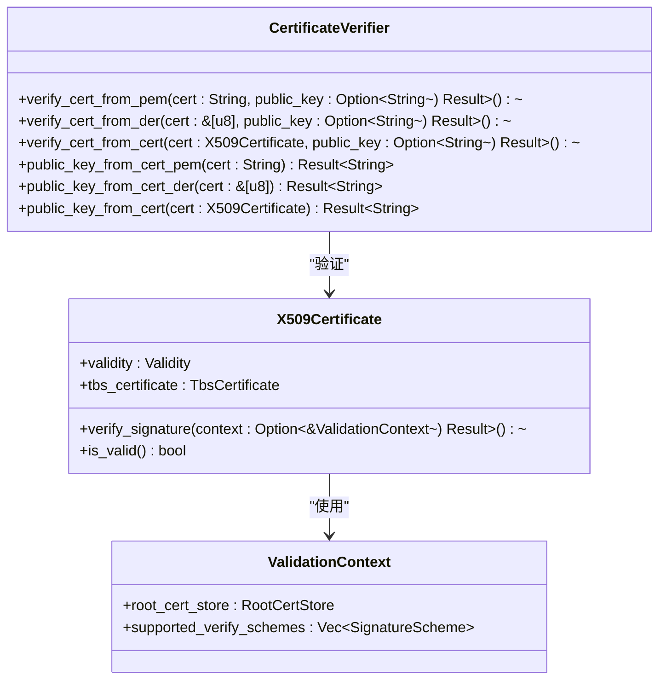
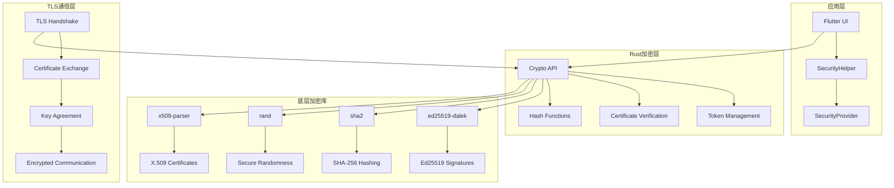
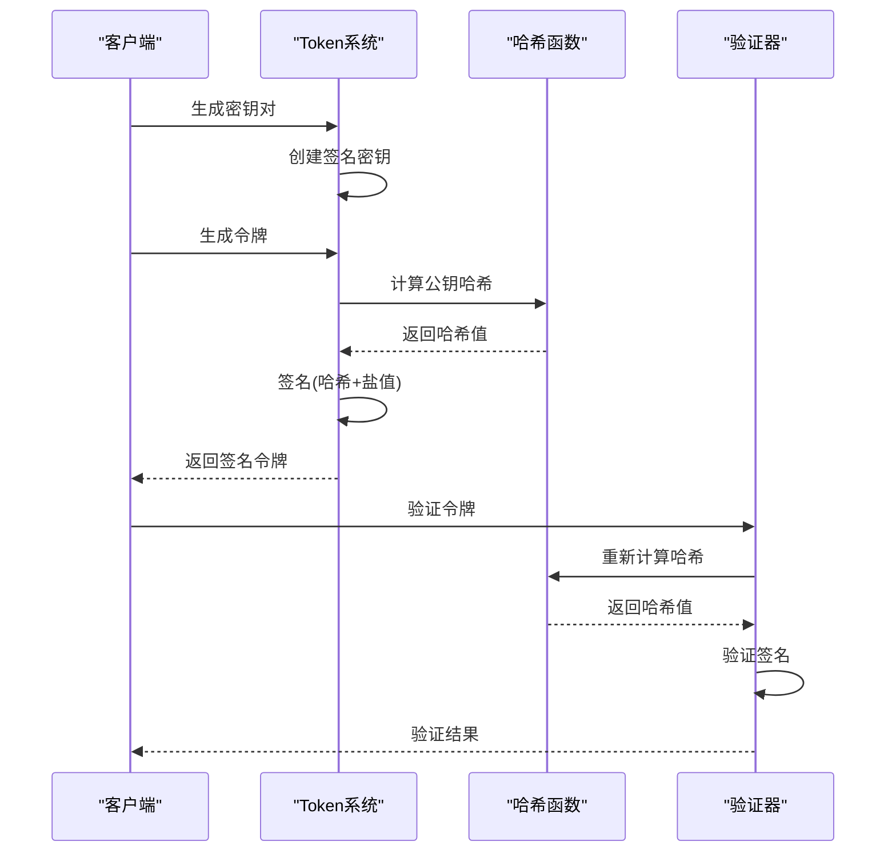
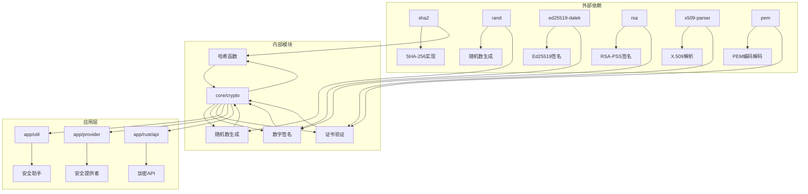

# 加密算法实现详细文档

<cite>
**本文档中引用的文件**
- [core/src/crypto/mod.rs](file://core/src/crypto/mod.rs)
- [core/src/crypto/hash.rs](file://core/src/crypto/hash.rs)
- [core/src/crypto/nonce.rs](file://core/src/crypto/nonce.rs)
- [core/src/crypto/token.rs](file://core/src/crypto/token.rs)
- [core/src/crypto/cert.rs](file://core/src/crypto/cert.rs)
- [common/lib/model/stored_security_context.dart](file://common/lib/model/stored_security_context.dart)
- [app/lib/provider/security_provider.dart](file://app/lib/provider/security_provider.dart)
- [app/lib/util/security_helper.dart](file://app/lib/util/security_helper.dart)
- [app/rust/src/api/crypto.rs](file://app/rust/src/api/crypto.rs)
- [core/src/http/server/client_cert_verifier.rs](file://core/src/http/server/client_cert_verifier.rs)
- [core/src/http/client/mod.rs](file://core/src/http/client/mod.rs)
</cite>

## 目录
1. [简介](#简介)
2. [项目结构概览](#项目结构概览)
3. [核心加密组件](#核心加密组件)
4. [架构概览](#架构概览)
5. [详细组件分析](#详细组件分析)
6. [依赖关系分析](#依赖关系分析)
7. [性能考虑](#性能考虑)
8. [故障排除指南](#故障排除指南)
9. [结论](#结论)

## 简介

LocalSend是一个跨平台的文件传输应用程序，采用端到端加密来保护用户数据。该系统实现了多层次的加密机制，包括安全随机数生成、密码学哈希函数、数字签名验证和证书管理。本文档深入分析了这些加密算法的实现细节、安全特性和性能特征。

## 项目结构概览

LocalSend的加密功能主要分布在以下模块中：



**图表来源**
- [core/src/crypto/mod.rs](file://core/src/crypto/mod.rs#L1-L5)
- [app/lib/util/security_helper.dart](file://app/lib/util/security_helper.dart#L1-L39)

**章节来源**
- [core/src/crypto/mod.rs](file://core/src/crypto/mod.rs#L1-L5)
- [app/lib/util/security_helper.dart](file://app/lib/util/security_helper.dart#L1-L39)

## 核心加密组件

### 哈希函数实现

LocalSend使用SHA-256作为主要的密码学哈希函数：



**图表来源**
- [core/src/crypto/hash.rs](file://core/src/crypto/hash.rs#L1-L8)

### 随机数生成器

系统实现了安全的随机数生成机制：



**图表来源**
- [core/src/crypto/nonce.rs](file://core/src/crypto/nonce.rs#L1-L12)
- [common/lib/model/stored_security_context.dart](file://common/lib/model/stored_security_context.dart#L1-L26)

### 数字签名系统

实现了基于Ed25519和RSA-PSS的数字签名：



**图表来源**
- [core/src/crypto/token.rs](file://core/src/crypto/token.rs#L1-L255)

### 证书管理系统

提供了完整的X.509证书验证功能：



**图表来源**
- [core/src/crypto/cert.rs](file://core/src/crypto/cert.rs#L1-L187)

**章节来源**
- [core/src/crypto/hash.rs](file://core/src/crypto/hash.rs#L1-L8)
- [core/src/crypto/nonce.rs](file://core/src/crypto/nonce.rs#L1-L12)
- [core/src/crypto/token.rs](file://core/src/crypto/token.rs#L1-L255)
- [core/src/crypto/cert.rs](file://core/src/crypto/cert.rs#L1-L187)

## 架构概览

LocalSend的加密架构采用了分层设计，确保了安全性和可维护性：



**图表来源**
- [app/lib/util/security_helper.dart](file://app/lib/util/security_helper.dart#L1-L39)
- [app/rust/src/api/crypto.rs](file://app/rust/src/api/crypto.rs#L1-L22)
- [core/src/http/server/client_cert_verifier.rs](file://core/src/http/server/client_cert_verifier.rs#L1-L84)

## 详细组件分析

### SHA-256哈希函数

SHA-256是LocalSend的核心哈希算法，用于数据完整性验证和数字签名：

#### 实现特点：
- 使用`sha2` crate提供的标准SHA-256实现
- 单向哈希函数，不可逆计算
- 输出固定长度256位（32字节）
- 抗碰撞性和抗原像攻击

#### 输入输出格式：
- **输入**: 任意长度的字节数组
- **输出**: 32字节的哈希值数组

#### 性能特征：
- 计算速度快，适合大量数据处理
- 内存占用低，算法简单高效
- 支持流式处理大文件

#### 安全特性：
- 抗碰撞攻击
- 抗原像攻击
- 抗第二原像攻击
- 抗长度扩展攻击

### 安全随机数生成

随机数生成器是加密系统的基础，LocalSend使用了经过验证的安全随机数生成机制：

#### 实现原理：
- 基于`rand` crate的ChaCha20随机数生成器
- 使用操作系统提供的熵源（如`/dev/random`或Windows Crypto API）
- 32字节的随机数长度，满足现代加密需求

#### 验证机制：
- 长度验证：16-128字节范围内
- 质量保证：使用加密安全的随机数生成器

#### 应用场景：
- 一次性令牌生成
- 密钥材料生成
- 初始化向量创建

### 数字签名系统

LocalSend实现了基于Ed25519的数字签名系统，支持多种签名算法：

#### Ed25519签名：
- 基于椭圆曲线密码学
- 高安全性，小密钥大小
- 快速签名和验证
- 抗量子计算攻击

#### RSA-PSS签名：
- 兼容传统RSA系统
- 支持可变长度密钥
- 符合PKCS#1标准

#### 签名流程：


**图表来源**
- [core/src/crypto/token.rs](file://core/src/crypto/token.rs#L120-L180)

#### 令牌格式：
```
格式: {hash_method}.{hash_base64}.{salt_base64}.{sign_method}.{signature_base64}
示例: sha256.ABCDEF...==.YWJjZA==.ed25519.ABCDEF...
```

### 证书验证系统

X.509证书验证是TLS通信安全的重要组成部分：

#### 验证流程：
1. **时间有效性检查**：确保证书未过期
2. **公钥匹配验证**：比较证书中的公钥与预期公钥
3. **数字签名验证**：验证证书链的完整性

#### 错误处理：
- 时间有效性错误
- 公钥不匹配错误
- 数字签名验证失败

#### 安全考虑：
- 不信任任何不受信任的根证书
- 支持自签名证书验证
- 提供详细的错误信息用于调试

**章节来源**
- [core/src/crypto/hash.rs](file://core/src/crypto/hash.rs#L1-L8)
- [core/src/crypto/nonce.rs](file://core/src/crypto/nonce.rs#L1-L12)
- [core/src/crypto/token.rs](file://core/src/crypto/token.rs#L1-L255)
- [core/src/crypto/cert.rs](file://core/src/crypto/cert.rs#L1-L187)

## 依赖关系分析

LocalSend的加密系统具有清晰的依赖层次结构：



**图表来源**
- [core/src/crypto/mod.rs](file://core/src/crypto/mod.rs#L1-L5)
- [Cargo.lock](file://core/Cargo.lock#L1-L50)

### 关键依赖项

#### 密码学库：
- **sha2**: 标准SHA-256实现
- **rand**: 安全随机数生成
- **ed25519-dalek**: Ed25519椭圆曲线签名
- **rsa**: RSA-PSS签名算法

#### 证书处理库：
- **x509-parser**: X.509证书解析
- **pem**: PEM格式编码解码

#### TLS通信库：
- **rustls**: 现代TLS实现
- **reqwest**: HTTP客户端

**章节来源**
- [core/src/crypto/mod.rs](file://core/src/crypto/mod.rs#L1-L5)

## 性能考虑

### 算法选择策略

LocalSend在算法选择上遵循以下原则：

#### 哈希函数：
- **SHA-256**: 平衡安全性与性能的最佳选择
- 替代方案：SHA-512（更高安全性但性能较低）
- 适用场景：数据完整性验证、密钥派生

#### 随机数生成：
- **ChaCha20**: 高性能且安全的流密码
- 替代方案：AES-CTR（需要密钥管理）
- 适用场景：密钥生成、初始化向量

#### 数字签名：
- **Ed25519**: 当前最优的椭圆曲线签名算法
- 替代方案：RSA-4096（兼容性更好但性能较差）
- 适用场景：身份认证、数据签名

### 性能优化技术

#### 批量处理：
- 大文件传输时使用流式哈希计算
- 批量证书验证优化
- 连接池复用减少握手开销

#### 缓存机制：
- 证书哈希缓存避免重复计算
- 密钥对缓存减少生成开销
- 验证结果缓存提高响应速度

#### 硬件加速：
- 利用CPU AES-NI指令集加速加密
- 使用专用加密芯片（如TPM）
- GPU加速大数运算

### 内存管理

#### 安全内存清理：
- 使用`Zeroizing`自动清理敏感数据
- 及时释放临时缓冲区
- 防止内存转储泄露密钥

#### 内存安全：
- 避免堆栈溢出攻击
- 使用安全的字符串处理
- 防止信息泄露

## 故障排除指南

### 常见问题及解决方案

#### 证书验证失败

**症状**: 无法建立安全连接，证书验证错误

**可能原因**:
1. 证书已过期
2. 证书链不完整
3. 证书被篡改
4. 系统时间不正确

**解决步骤**:
1. 检查系统时间是否正确
2. 更新证书到最新版本
3. 验证证书链完整性
4. 检查证书是否被吊销

#### 随机数质量问题

**症状**: 密钥生成失败或重复

**可能原因**:
1. 系统熵不足
2. 权限不足访问随机数源
3. 系统资源耗尽

**解决步骤**:
1. 检查系统熵池状态
2. 增加系统负载以产生更多熵
3. 重启应用程序重新初始化随机数生成器

#### 数字签名验证失败

**症状**: 签名验证总是失败

**可能原因**:
1. 数据被篡改
2. 使用了错误的公钥
3. 签名格式不正确

**解决步骤**:
1. 验证数据完整性
2. 确认公钥匹配
3. 检查签名编码格式

### 安全最佳实践

#### 防止侧信道攻击

1. **常数时间操作**: 确保所有密码学操作执行相同的时间
2. **内存访问模式**: 避免根据秘密数据改变内存访问模式
3. **分支预测防护**: 使用条件移动指令替代条件跳转

#### 随机数质量保证

1. **熵源多样性**: 结合多个熵源提高随机性
2. **定期重置**: 定期重新初始化随机数生成器
3. **监控熵池**: 监控系统熵池状态

#### 错误处理安全

1. **信息泄露防护**: 避免在错误消息中泄露敏感信息
2. **统一错误处理**: 使用统一的错误处理机制
3. **日志安全**: 安全地记录错误信息而不泄露密钥

**章节来源**
- [core/src/crypto/cert.rs](file://core/src/crypto/cert.rs#L80-L187)
- [core/src/crypto/token.rs](file://core/src/crypto/token.rs#L220-L255)

## 结论

LocalSend的加密算法实现体现了现代密码学的最佳实践，通过分层架构和模块化设计确保了系统的安全性和可维护性。主要特点包括：

### 安全性优势
- 采用经过验证的标准密码学算法
- 实现了多层次的安全验证机制
- 提供了完善的错误处理和安全防护

### 性能优化
- 选择了平衡安全性与性能的算法组合
- 实现了有效的缓存和批处理机制
- 支持硬件加速和优化

### 可维护性
- 清晰的模块划分和依赖关系
- 完善的测试覆盖和文档
- 易于扩展和升级的设计

### 未来发展方向
1. **量子抗性**: 考虑引入后量子密码学算法
2. **零知识证明**: 在适当场景下使用零知识证明
3. **同态加密**: 探索在特定场景下的应用

通过持续的安全审计和性能优化，LocalSend的加密系统能够为用户提供可靠的数据保护，确保文件传输过程中的隐私和安全。