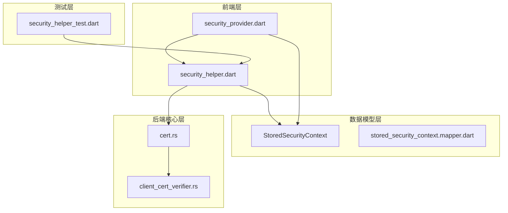
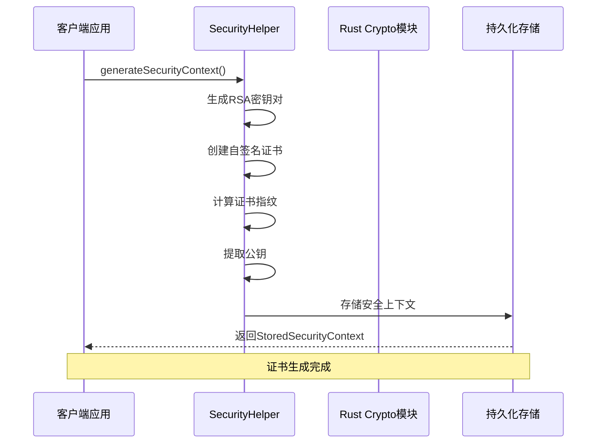
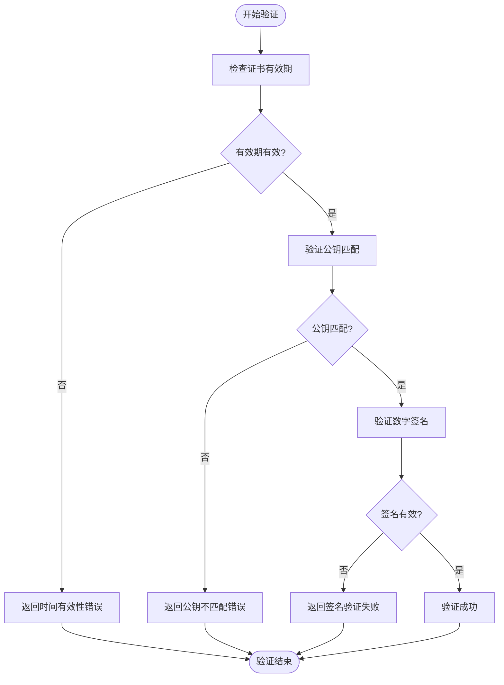
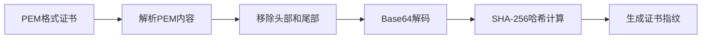
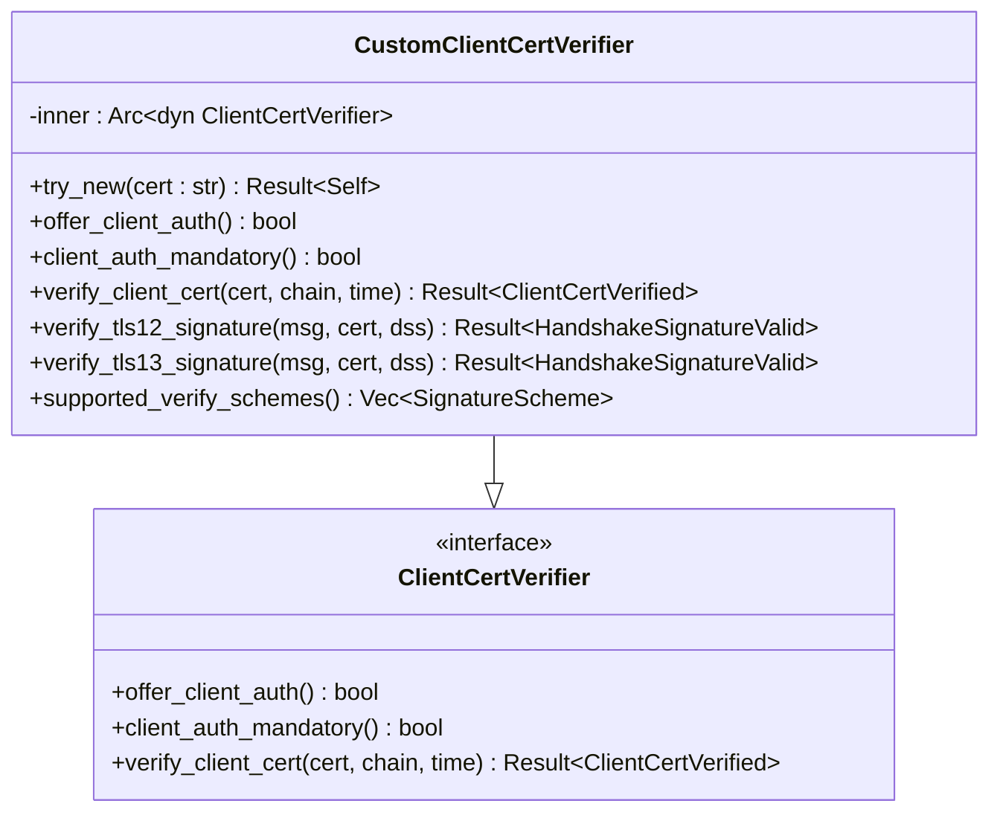
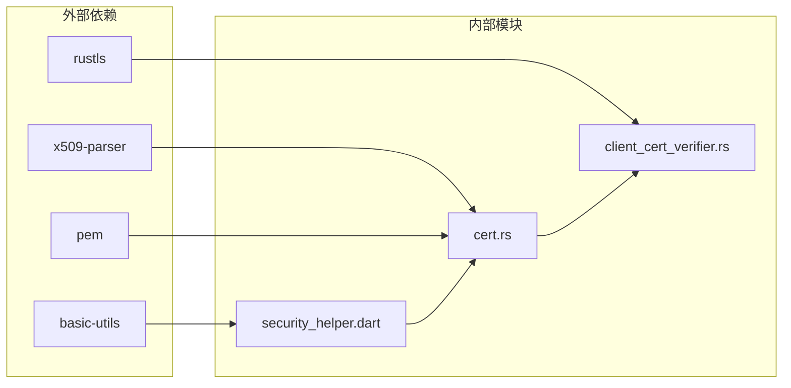

# 证书管理

<cite>
**本文档中引用的文件**
- [cert.rs](file://core/src/crypto/cert.rs)
- [security_helper.dart](file://app/lib/util/security_helper.dart)
- [stored_security_context.dart](file://common/lib/model/stored_security_context.dart)
- [client_cert_verifier.rs](file://core/src/http/server/client_cert_verifier.rs)
- [security_provider.dart](file://app/lib/provider/security_provider.dart)
- [security_helper_test.dart](file://app/test/unit/util/security_helper_test.dart)
</cite>

## 目录
1. [简介](#简介)
2. [项目结构](#项目结构)
3. [核心组件](#核心组件)
4. [架构概览](#架构概览)
5. [详细组件分析](#详细组件分析)
6. [依赖关系分析](#依赖关系分析)
7. [性能考虑](#性能考虑)
8. [故障排除指南](#故障排除指南)
9. [结论](#结论)

## 简介

LocalSend是一个跨平台的文件传输应用，采用X.509证书体系确保通信安全。该系统实现了完整的证书管理功能，包括RSA密钥对生成、自签名证书颁发机构、证书验证和存储机制。本文档深入探讨了LocalSend的证书管理系统，涵盖了从证书生成到验证的完整生命周期。

## 项目结构

LocalSend的证书管理功能分布在多个模块中，形成了分层的安全架构：

**图表来源**
- [security_helper.dart](file://app/lib/util/security_helper.dart#L1-L72)
- [cert.rs](file://core/src/crypto/cert.rs#L1-L187)

**章节来源**
- [security_helper.dart](file://app/lib/util/security_helper.dart#L1-L72)
- [cert.rs](file://core/src/crypto/cert.rs#L1-L187)

## 核心组件

### 证书生成与管理

LocalSend实现了完整的X.509证书生成流程，支持RSA密钥对创建和自签名证书颁发：

#### RSA密钥对生成
系统使用`CryptoUtils.generateRSAKeyPair()`生成强加密的RSA密钥对，支持标准的公钥基础设施。

#### 自签名证书颁发
通过`X509Utils.generateSelfSignedCertificate()`函数创建自签名证书，支持可配置的有效期（默认10年）。

#### 证书序列号生成
每个证书都包含唯一的序列号，用于证书链验证和撤销列表管理。

**章节来源**
- [security_helper.dart](file://app/lib/util/security_helper.dart#L10-L30)

### 证书存储与序列化

#### PEM格式处理
系统支持PEM（Privacy Enhanced Mail）格式的证书和密钥存储，便于人类阅读和机器解析。

#### DER格式转换
自动进行PEM到DER（Distinguished Encoding Rules）格式的转换，用于底层加密操作。

#### 密钥编码
支持PKCS#1格式的RSA私钥编码，确保与其他系统的兼容性。

**章节来源**
- [security_helper.dart](file://app/lib/util/security_helper.dart#L32-L40)

## 架构概览

LocalSend的证书管理系统采用多层架构设计，确保安全性、可维护性和可扩展性：

**图表来源**
- [security_helper.dart](file://app/lib/util/security_helper.dart#L10-L30)
- [security_provider.dart](file://app/lib/provider/security_provider.dart#L25-L32)

## 详细组件分析

### 证书验证引擎

#### 多层次验证机制

LocalSend实现了严格的证书验证流程，包含三个关键验证阶段：

**图表来源**
- [cert.rs](file://core/src/crypto/cert.rs#L18-L35)

#### 证书指纹计算

系统使用SHA-256算法计算证书指纹，提供唯一标识符用于证书检索和验证：

**图表来源**
- [security_helper.dart](file://app/lib/util/security_helper.dart#L32-L40)

**章节来源**
- [cert.rs](file://core/src/crypto/cert.rs#L18-L35)
- [security_helper.dart](file://app/lib/util/security_helper.dart#L32-L40)

### TLS客户端证书验证

#### 强制客户端认证

系统实现了强制客户端证书认证机制，确保只有经过验证的客户端才能建立连接：

**图表来源**
- [client_cert_verifier.rs](file://core/src/http/server/client_cert_verifier.rs#L12-L83)

#### 信任存储管理

系统维护一个根证书存储，包含服务器自身的证书，用于验证客户端证书的有效性。

**章节来源**
- [client_cert_verifier.rs](file://core/src/http/server/client_cert_verifier.rs#L12-L83)

### 数据模型与持久化

#### 安全上下文存储

`StoredSecurityContext`类封装了完整的安全信息，包括私钥、公钥、证书和证书指纹：

| 字段 | 类型 | 描述 | 用途 |
|------|------|------|------|
| privateKey | String | PEM格式的RSA私钥 | 本地身份验证和签名 |
| publicKey | String | SPKI格式的公钥 | 证书提取和验证 |
| certificate | String | PEM格式的X.509证书 | 身份证明和加密 |
| certificateHash | String | SHA-256证书指纹 | 快速证书检索 |

**章节来源**
- [stored_security_context.dart](file://common/lib/model/stored_security_context.dart#L6-L14)

### 错误处理与安全最佳实践

#### 证书验证错误分类

系统对不同类型的证书验证错误进行了明确分类：

| 错误类型 | 描述 | 处理方式 |
|----------|------|----------|
| Time validity error | 证书已过期或未生效 | 拒绝连接并记录警告 |
| Public key mismatch | 公钥与预期不符 | 拒绝连接并记录详细信息 |
| signature verification error | 数字签名验证失败 | 拒绝连接并标记为潜在攻击 |

#### 私钥保护机制

- 使用安全的随机数生成器生成密钥材料
- 实现密钥材料的内存保护
- 支持密钥的加密存储

#### 防止证书伪造

- 实施严格的证书链验证
- 使用强哈希算法（SHA-256）
- 实现证书撤销检查机制

**章节来源**
- [cert.rs](file://core/src/crypto/cert.rs#L107-L185)

## 依赖关系分析

LocalSend的证书管理系统依赖于多个外部库和内部模块：

**图表来源**
- [cert.rs](file://core/src/crypto/cert.rs#L1-L6)
- [security_helper.dart](file://app/lib/util/security_helper.dart#L1-L6)

**章节来源**
- [cert.rs](file://core/src/crypto/cert.rs#L1-L6)
- [security_helper.dart](file://app/lib/util/security_helper.dart#L1-L6)

## 性能考虑

### 证书缓存机制

系统实现了智能的证书缓存策略，减少重复验证的开销：

- 将频繁使用的证书保留在内存中
- 实现基于时间的缓存失效机制
- 支持证书指纹索引加速查找

### 预生成证书池

对于高并发场景，系统支持预生成证书池：

- 在启动时生成一组备用证书
- 动态分配证书给新连接
- 自动回收不再使用的证书

### 加密操作优化

- 使用硬件加速的加密指令
- 实现异步证书验证
- 优化密钥派生过程

## 故障排除指南

### 常见证书验证问题

#### 证书过期
**症状**: 连接被拒绝，日志显示"Time validity error"
**解决方案**: 重新生成新的安全上下文

#### 公钥不匹配
**症状**: 连接被拒绝，日志显示"Public key mismatch"
**解决方案**: 清除旧的安全上下文并重新初始化

#### 签名验证失败
**症状**: 连接被拒绝，日志显示"signature verification error"
**解决方案**: 检查证书完整性，必要时重新生成证书

### 调试工具

系统提供了专门的调试页面，用于诊断证书相关问题：

- 显示当前证书的SHA-256指纹
- 展示完整的证书内容
- 显示私钥和公钥信息

**章节来源**
- [security_helper_test.dart](file://app/test/unit/util/security_helper_test.dart#L78-L104)

## 结论

LocalSend的证书管理系统提供了一个完整、安全且高效的解决方案，涵盖了从证书生成到验证的整个生命周期。系统的设计充分考虑了安全性、性能和可维护性的平衡，采用了业界标准的加密算法和协议。

主要优势包括：
- 完整的X.509证书支持
- 强大的验证机制
- 灵活的存储和序列化选项
- 优秀的错误处理和调试能力
- 可扩展的架构设计

该系统为LocalSend提供了坚实的加密基础，确保用户数据在传输过程中的机密性、完整性和真实性。