# 核心功能实现

<cite>
**本文档中引用的文件**  
- [lib.rs](file://core/src/lib.rs)
- [crypto/mod.rs](file://core/src/crypto/mod.rs)
- [crypto/cert.rs](file://core/src/crypto/cert.rs)
- [crypto/hash.rs](file://core/src/crypto/hash.rs)
- [crypto/nonce.rs](file://core/src/crypto/nonce.rs)
- [crypto/token.rs](file://core/src/crypto/token.rs)
- [http/mod.rs](file://core/src/http/mod.rs)
- [http/server/mod.rs](file://core/src/http/server/mod.rs)
- [http/client/mod.rs](file://core/src/http/client/mod.rs)
- [http/dto.rs](file://core/src/http/dto.rs)
- [webrtc/mod.rs](file://core/src/webrtc/mod.rs)
- [webrtc/signaling.rs](file://core/src/webrtc/signaling.rs)
- [webrtc/webrtc.rs](file://core/src/webrtc/webrtc.rs)
- [model/discovery.rs](file://core/src/model/discovery.rs)
- [model/transfer.rs](file://core/src/model/transfer.rs)
- [util/base64.rs](file://core/src/util/base64.rs)
- [util/time.rs](file://core/src/util/time.rs)
- [Cargo.toml](file://core/Cargo.toml)
</cite>

## 目录
1. [项目结构](#项目结构)
2. [核心架构设计](#核心架构设计)
3. [加密功能实现](#加密功能实现)
4. [HTTP服务器实现](#http服务器实现)
5. [WebRTC信令实现](#webrtc信令实现)
6. [FFI接口设计](#ffi接口设计)
7. [性能基准与优化](#性能基准与优化)
8. [安全考虑](#安全考虑)

## 项目结构

LocalSend项目采用分层架构设计，核心功能由Rust实现，通过FFI暴露给Dart层。项目主要包含以下模块：

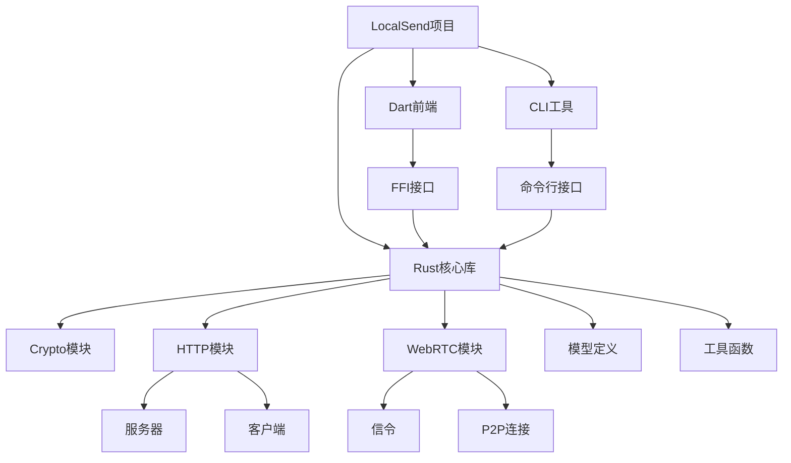

**Diagram sources**
- [lib.rs](file://core/src/lib.rs)
- [Cargo.toml](file://core/Cargo.toml)

**Section sources**
- [lib.rs](file://core/src/lib.rs)
- [Cargo.toml](file://core/Cargo.toml)

## 核心架构设计

LocalSend的核心架构采用模块化设计，各模块职责明确，通过清晰的接口进行通信。系统主要由三个核心模块组成：加密模块(crypto)、HTTP模块(http)和WebRTC模块(webrtc)。

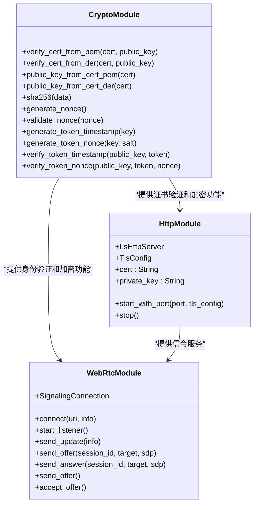

**Diagram sources**
- [lib.rs](file://core/src/lib.rs)
- [crypto/mod.rs](file://core/src/crypto/mod.rs)
- [http/mod.rs](file://core/src/http/mod.rs)
- [webrtc/mod.rs](file://core/src/webrtc/mod.rs)

**Section sources**
- [lib.rs](file://core/src/lib.rs)
- [Cargo.toml](file://core/Cargo.toml)

## 加密功能实现

### 证书验证与公钥提取

加密模块提供了完整的X.509证书验证功能，确保通信双方的身份可信。证书验证包括时间有效性检查、签名验证和公钥匹配验证。

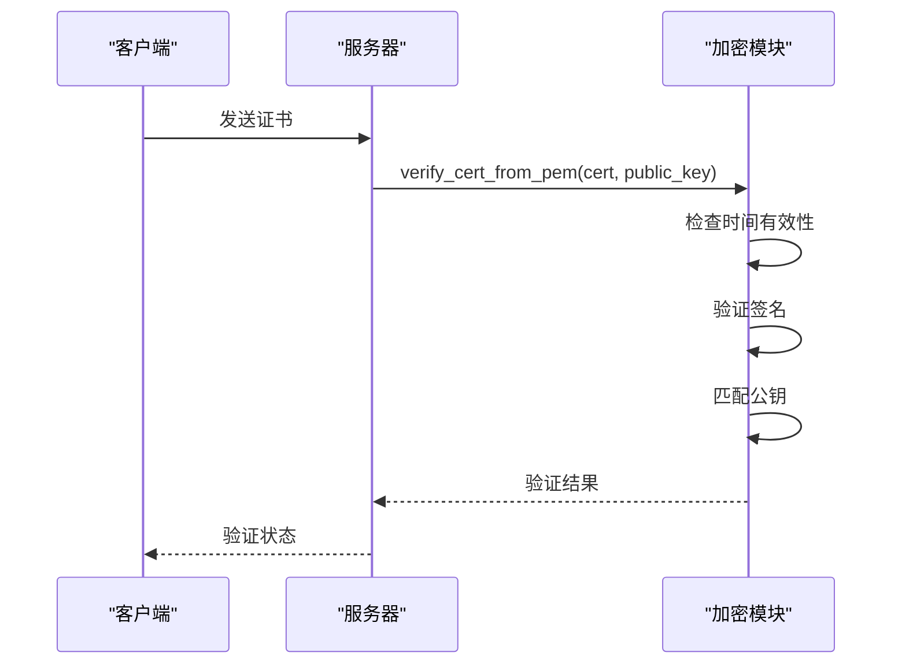

**Diagram sources**
- [crypto/cert.rs](file://core/src/crypto/cert.rs)

**Section sources**
- [crypto/cert.rs](file://core/src/crypto/cert.rs)

### 哈希与随机数生成

加密模块实现了SHA-256哈希算法和安全随机数生成器，为令牌生成和数据完整性验证提供基础支持。

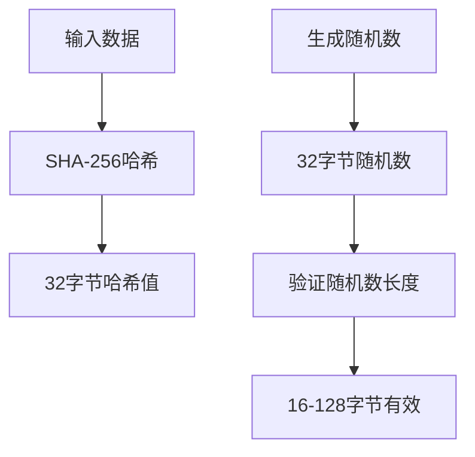

**Diagram sources**
- [crypto/hash.rs](file://core/src/crypto/hash.rs)
- [crypto/nonce.rs](file://core/src/crypto/nonce.rs)

**Section sources**
- [crypto/hash.rs](file://core/src/crypto/hash.rs)
- [crypto/nonce.rs](file://core/src/crypto/nonce.rs)

### 令牌生成与验证

令牌系统采用Ed25519数字签名算法，结合SHA-256哈希和时间戳/随机数，实现安全的身份验证机制。

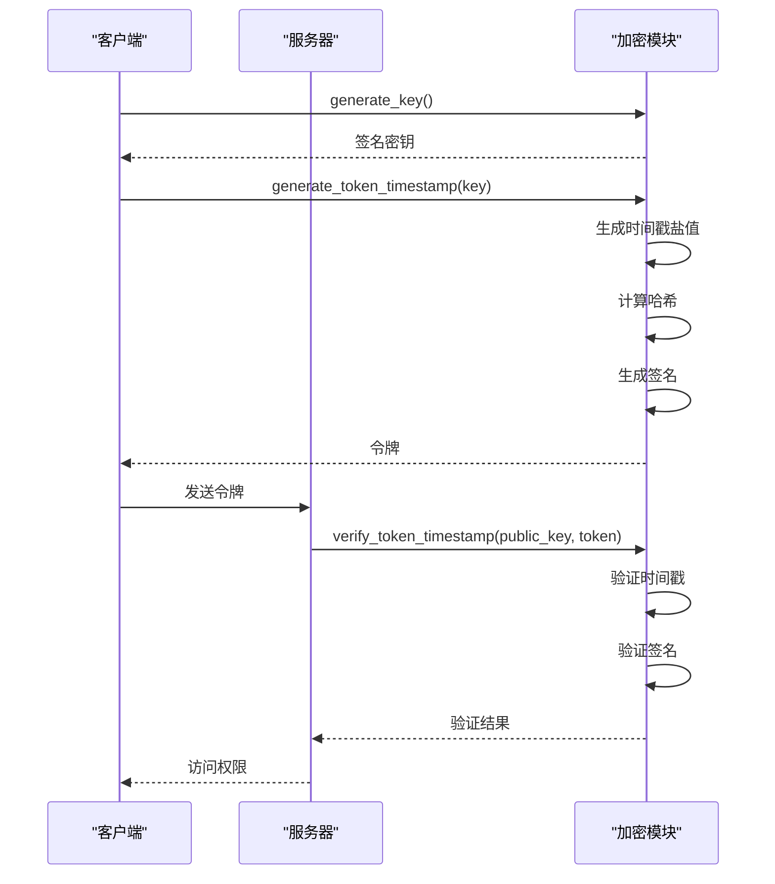

**Diagram sources**
- [crypto/token.rs](file://core/src/crypto/token.rs)

**Section sources**
- [crypto/token.rs](file://core/src/crypto/token.rs)

## HTTP服务器实现

### 服务器架构

HTTP服务器基于Hyper框架构建，支持HTTP和HTTPS协议，采用异步非阻塞I/O模型处理并发请求。

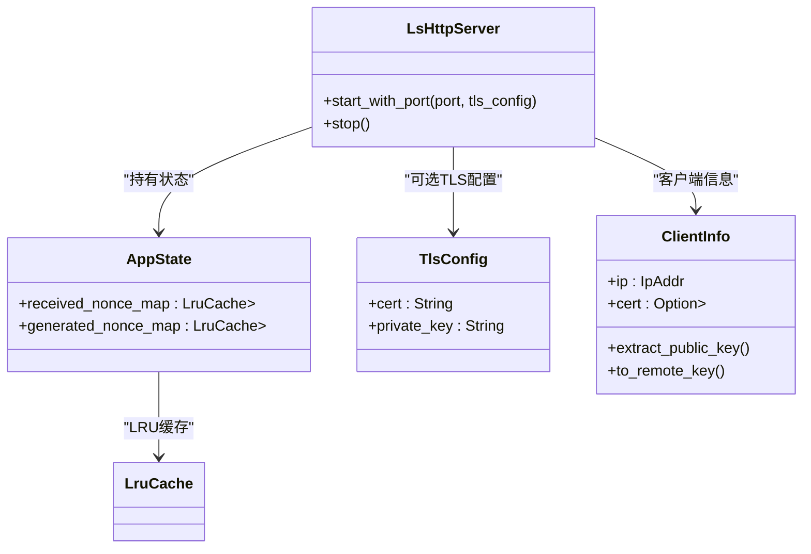

**Diagram sources**
- [http/server/mod.rs](file://core/src/http/server/mod.rs)

**Section sources**
- [http/server/mod.rs](file://core/src/http/server/mod.rs)

### 请求处理流程

HTTP服务器实现了非交互式身份验证流程，通过nonce交换机制防止重放攻击。

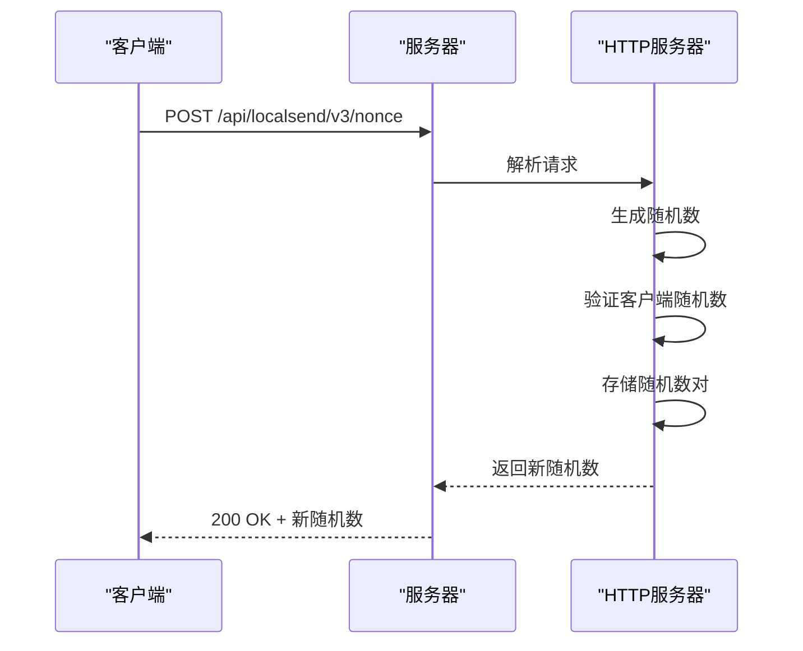

**Diagram sources**
- [http/server/mod.rs](file://core/src/http/server/mod.rs)

**Section sources**
- [http/server/mod.rs](file://core/src/http/server/mod.rs)

### HTTP客户端实现

HTTP客户端模块负责与其他LocalSend实例通信，支持HTTPS双向认证。

```mermaid
classDiagram
class LsHttpClient {
+try_new(private_key, cert)
+nonce(protocol, ip, port)
+register(protocol, ip, port, payload)
+prepare_upload(protocol, ip, port, public_key, payload)
+upload(protocol, ip, port, session_id, file_id, token, binary)
+cancel(protocol, ip, port, session_id)
}
class RegisterResult {
+public_key : Option<String>
+body : RegisterResponseDto
}
LsHttpClient --> RegisterResult : "返回注册结果"
LsHttpClient --> reqwest : : Client : "底层HTTP客户端"
```

**Diagram sources**
- [http/client/mod.rs](file://core/src/http/client/mod.rs)

**Section sources**
- [http/client/mod.rs](file://core/src/http/client/mod.rs)

## WebRTC信令实现

### 信令协议设计

WebRTC信令采用WebSocket协议，定义了清晰的消息类型和数据结构，支持设备发现和SDP交换。

```mermaid
classDiagram
class WsServerMessage {
+Hello{client, peers}
+Join{peer}
+Update{peer}
+Left{peerId}
+Offer{WsServerSdpMessage}
+Answer{WsServerSdpMessage}
+Error{code}
}
class WsClientMessage {
+Update{info}
+Offer{WsClientSdpMessage}
+Answer{WsClientSdpMessage}
}
class ClientInfo {
+id : Uuid
+alias : String
+version : String
+device_model : Option<String>
+device_type : Option<DeviceType>
+token : String
}
class WsServerSdpMessage {
+peer : ClientInfo
+session_id : String
+sdp : String
}
class WsClientSdpMessage {
+session_id : String
+target : Uuid
+sdp : String
}
WsServerMessage --> ClientInfo : "包含"
WsServerMessage --> WsServerSdpMessage : "包含"
WsClientMessage --> ClientInfo : "包含"
WsClientMessage --> WsClientSdpMessage : "包含"
```

**Diagram sources**
- [webrtc/signaling.rs](file://core/src/webrtc/signaling.rs)

**Section sources**
- [webrtc/signaling.rs](file://core/src/webrtc/signaling.rs)

### 信令连接流程

信令连接建立过程包括客户端信息编码、WebSocket连接和握手消息交换。

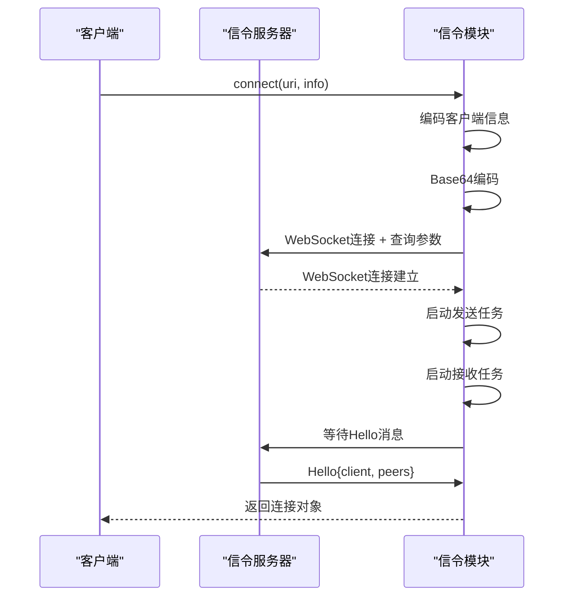

**Diagram sources**
- [webrtc/signaling.rs](file://core/src/webrtc/signaling.rs)

**Section sources**
- [webrtc/signaling.rs](file://core/src/webrtc/signaling.rs)

### P2P连接建立

P2P连接建立过程结合了信令交换和安全验证，确保连接的安全性。

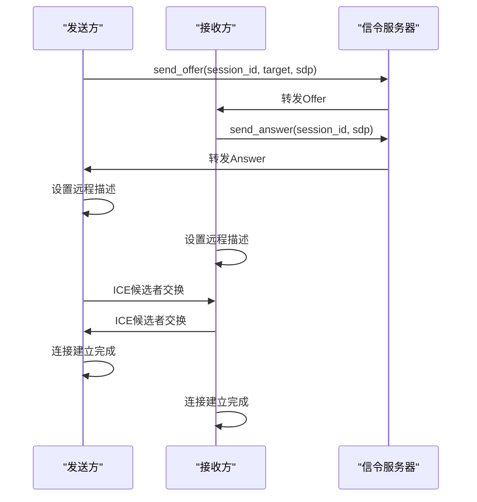

**Diagram sources**
- [webrtc/webrtc.rs](file://core/src/webrtc/webrtc.rs)

**Section sources**
- [webrtc/webrtc.rs](file://core/src/webrtc/webrtc.rs)

## FFI接口设计

### API设计模式

Rust核心库通过Flutter Rust Bridge(FLB)暴露API给Dart层，采用异步函数和通道模式处理数据流。

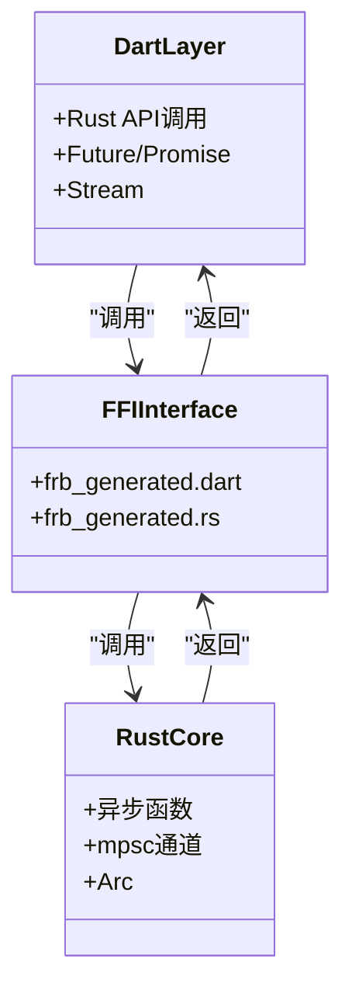

**Diagram sources**
- [app/lib/rust/api](file://app/lib/rust/api)
- [rust/src/api](file://rust/src/api)

**Section sources**
- [app/lib/rust/frb_generated.dart](file://app/lib/rust/frb_generated.dart)
- [rust/src/frb_generated.rs](file://rust/src/frb_generated.rs)

### 参数传递方式

参数传递采用序列化机制，复杂数据结构通过JSON序列化传输，二进制数据通过通道流式传输。

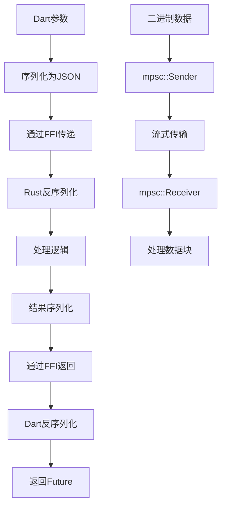

**Diagram sources**
- [core/src/model](file://core/src/model)
- [common/lib/model](file://common/lib/model)

**Section sources**
- [core/src/model](file://core/src/model)
- [common/lib/model](file://common/lib/model)

## 性能基准与优化

### 连接池管理

HTTP客户端和服务器采用LRU缓存机制管理nonce，避免重复验证，提高性能。

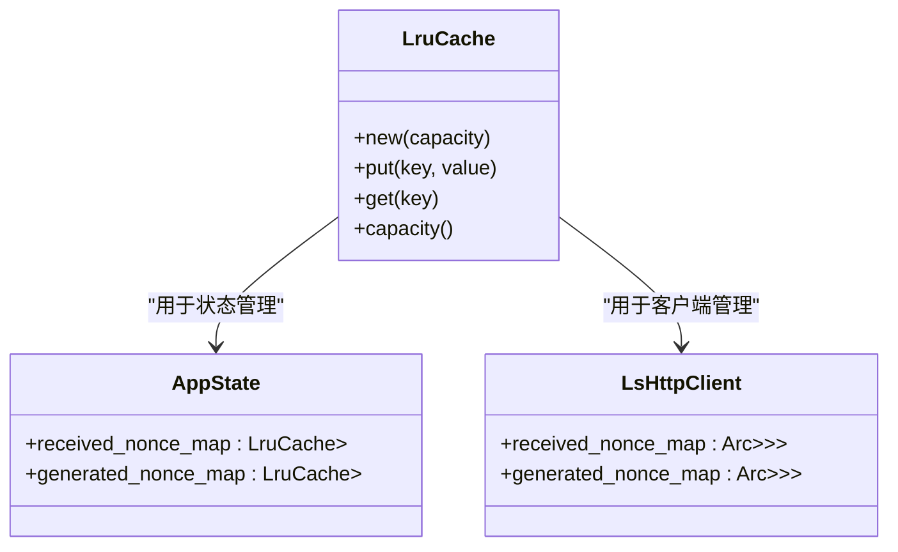

**Diagram sources**
- [http/server/mod.rs](file://core/src/http/server/mod.rs)
- [http/client/mod.rs](file://core/src/http/client/mod.rs)

**Section sources**
- [http/server/mod.rs](file://core/src/http/server/mod.rs)
- [http/client/mod.rs](file://core/src/http/client/mod.rs)

### 内存使用优化

系统采用多种内存优化策略，包括零拷贝、流式处理和对象重用。

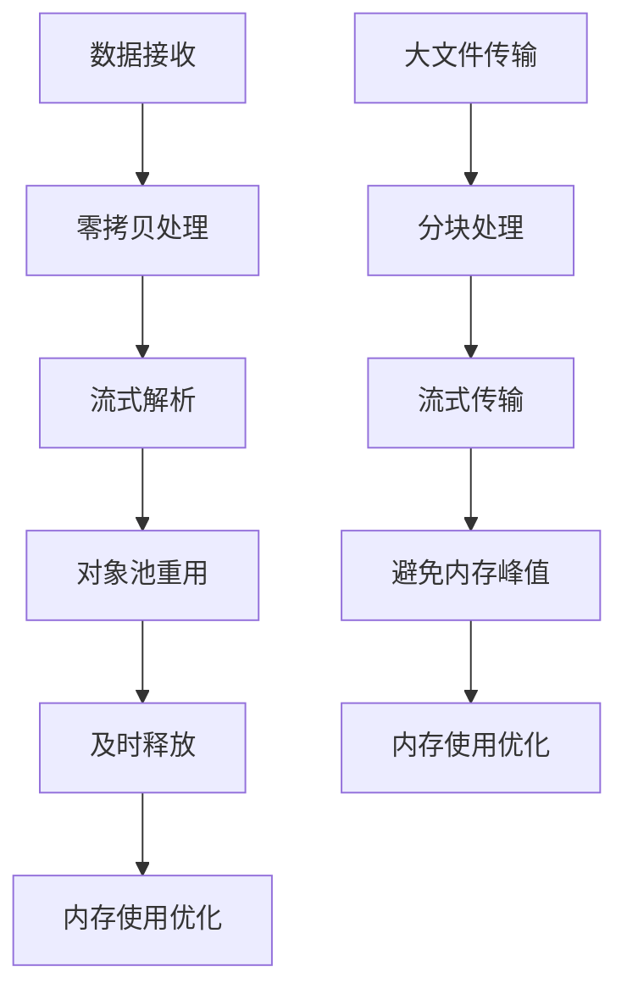

**Diagram sources**
- [webrtc/webrtc.rs](file://core/src/webrtc/webrtc.rs)
- [http/server/collect_to_json.rs](file://core/src/http/server/collect_to_json.rs)

**Section sources**
- [webrtc/webrtc.rs](file://core/src/webrtc/webrtc.rs)
- [http/server/collect_to_json.rs](file://core/src/http/server/collect_to_json.rs)

## 安全考虑

### DDoS攻击防护

系统通过多种机制防止DDoS攻击，包括连接限制、超时设置和资源回收。

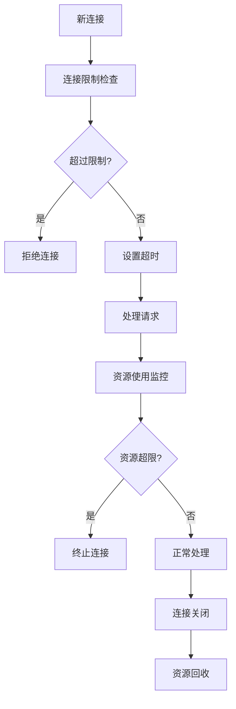

**Diagram sources**
- [http/server/mod.rs](file://core/src/http/server/mod.rs)
- [webrtc/webrtc.rs](file://core/src/webrtc/webrtc.rs)

**Section sources**
- [http/server/mod.rs](file://core/src/http/server/mod.rs)
- [webrtc/webrtc.rs](file://core/src/webrtc/webrtc.rs)

### 证书验证最佳实践

证书验证遵循最佳实践，包括完整的证书链验证、时间有效性检查和公钥匹配。

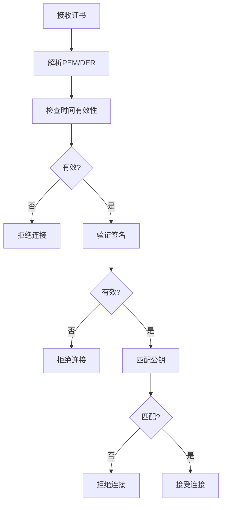

**Diagram sources**
- [crypto/cert.rs](file://core/src/crypto/cert.rs)

**Section sources**
- [crypto/cert.rs](file://core/src/crypto/cert.rs)