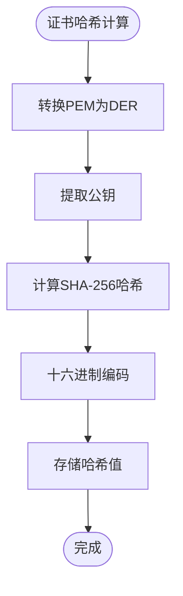

# 令牌生成

<cite>
**本文档中引用的文件**
- [token.rs](file://core/src/crypto/token.rs)
- [nonce.rs](file://core/src/crypto/nonce.rs)
- [cert.rs](file://core/src/crypto/cert.rs)
- [time.rs](file://core/src/util/time.rs)
- [mod.rs](file://core/src/http/client/mod.rs)
- [multicast_discovery.dart](file://common/lib/src/task/discovery/multicast_discovery.dart)
- [stored_security_context.dart](file://common/lib/model/stored_security_context.dart)
- [security_helper.dart](file://app/lib/util/security_helper.dart)
- [security_provider.dart](file://app/lib/provider/security_provider.dart)
- [receive_controller.dart](file://app/lib/provider/network/server/controller/receive_controller.dart)
</cite>

## 目录
1. [简介](#简介)
2. [项目结构](#项目结构)
3. [核心组件](#核心组件)
4. [架构概览](#架构概览)
5. [详细组件分析](#详细组件分析)
6. [依赖关系分析](#依赖关系分析)
7. [性能考虑](#性能考虑)
8. [故障排除指南](#故障排除指南)
9. [结论](#结论)

## 简介

LocalSend是一个本地文件传输应用程序，采用端到端加密和设备间直接通信的方式工作。为了确保通信的安全性和防止重放攻击，系统实现了复杂的令牌生成和验证机制。本文档深入解释了nonce和token在防止重放攻击中的作用机制，包括一次性令牌的生成、验证和过期策略，以及安全随机数生成器的实现。

## 项目结构

LocalSend的令牌生成系统分布在多个模块中，主要分为以下几个部分：

**图表来源**
- [token.rs](file://core/src/crypto/token.rs#L1-L255)
- [nonce.rs](file://core/src/crypto/nonce.rs#L1-L12)
- [cert.rs](file://core/src/crypto/cert.rs#L1-L187)

## 核心组件

### 令牌生成器 (Token Generator)

令牌生成器是整个安全系统的核心，负责生成基于时间戳和nonce的唯一标识符。它使用Ed25519椭圆曲线密码学算法来确保签名的安全性。

### 随机数生成器 (Nonce Generator)

随机数生成器负责创建不可预测的nonce值，这些值用于防止重放攻击并确保每次通信的独特性。

### 证书管理系统

证书管理系统处理SSL/TLS证书的生成、验证和存储，为HTTPS通信提供安全保障。

**章节来源**
- [token.rs](file://core/src/crypto/token.rs#L1-L255)
- [nonce.rs](file://core/src/crypto/nonce.rs#L1-L12)
- [cert.rs](file://core/src/crypto/cert.rs#L1-L187)

## 架构概览

LocalSend的令牌生成架构采用了多层安全设计，确保每个通信环节都受到保护：

**图表来源**
- [mod.rs](file://core/src/http/client/mod.rs#L75-L108)
- [token.rs](file://core/src/crypto/token.rs#L105-L131)

## 详细组件分析

### 令牌生成与验证系统

#### 令牌结构

LocalSend使用的令牌格式为：`{hash_method}.{hash_base64}.{salt_base64}.{sign_method}.{signature_base64}`

这种结构提供了以下优势：
- **可扩展性**：支持不同的哈希方法和签名算法
- **可验证性**：每个部分都可以独立验证
- **安全性**：混合多种加密技术

#### 时间戳令牌生成

时间戳令牌通过结合当前Unix时间戳和公钥生成，确保令牌的时效性：

**图表来源**
- [token.rs](file://core/src/crypto/token.rs#L105-L131)

#### 非对称密钥验证

系统支持两种主要的签名算法：

**图表来源**
- [token.rs](file://core/src/crypto/token.rs#L25-L92)

#### 令牌验证流程

令牌验证过程包括多个层次的安全检查：

**图表来源**
- [token.rs](file://core/src/crypto/token.rs#L176-L223)

**章节来源**
- [token.rs](file://core/src/crypto/token.rs#L105-L223)

### 随机数生成系统

#### 安全随机数生成

nonce生成器使用操作系统提供的加密安全随机数生成器：

**图表来源**
- [nonce.rs](file://core/src/crypto/nonce.rs#L3-L11)

#### 随机数验证

系统对接收到的nonce进行严格验证以防止攻击：

| 验证条件 | 描述 | 安全意义 |
|---------|------|----------|
| 长度检查 | 16 ≤ 长度 ≤ 128 字节 | 防止长度攻击 |
| 内容验证 | 非空且有效 | 确保数据完整性 |
| 类型安全 | Base64编码格式 | 防止格式攻击 |

**章节来源**
- [nonce.rs](file://core/src/crypto/nonce.rs#L3-L11)

### 证书管理系统

#### 证书验证流程

证书验证是HTTPS通信安全的基础：

**图表来源**
- [cert.rs](file://core/src/crypto/cert.rs#L25-L47)

#### 证书哈希计算

系统使用SHA-256计算证书的指纹，用于设备识别和防重放：

**图表来源**
- [security_helper.dart](file://app/lib/util/security_helper.dart#L20-L39)

**章节来源**
- [cert.rs](file://core/src/crypto/cert.rs#L25-L47)
- [security_helper.dart](file://app/lib/util/security_helper.dart#L20-L39)

### 设备发现与配对系统

#### 多播发现机制

设备发现通过多播UDP协议实现，每个设备都会广播自己的安全上下文：

**图表来源**
- [multicast_discovery.dart](file://common/lib/src/task/discovery/multicast_discovery.dart#L39-L60)

#### 安全上下文管理

每个设备维护一个完整的安全上下文，包含所有必要的加密信息：

| 组件 | 类型 | 用途 | 安全级别 |
|------|------|------|----------|
| 私钥 | RSA/Ed25519 | 数字签名 | 高 |
| 公钥 | RSA/Ed25519 | 加密验证 | 中 |
| 证书 | X.509 | 身份证明 | 高 |
| 证书哈希 | SHA-256 | 设备识别 | 中 |

**章节来源**
- [multicast_discovery.dart](file://common/lib/src/task/discovery/multicast_discovery.dart#L39-L60)
- [stored_security_context.dart](file://common/lib/model/stored_security_context.dart#L6-L24)

### HTTP客户端安全实现

#### 连接建立流程

HTTP客户端在建立连接时执行完整的安全握手：

**图表来源**
- [mod.rs](file://core/src/http/client/mod.rs#L42-L77)

#### 缓存机制

系统使用LRU缓存来管理已知设备的nonce，防止重放攻击：

**图表来源**
- [mod.rs](file://core/src/http/client/mod.rs#L18-L32)

**章节来源**
- [mod.rs](file://core/src/http/client/mod.rs#L42-L108)

## 依赖关系分析

### 核心依赖图

**图表来源**
- [token.rs](file://core/src/crypto/token.rs#L1-L10)
- [mod.rs](file://core/src/http/client/mod.rs#L1-L20)

### 外部依赖

系统依赖以下关键外部库：

| 库名称 | 版本 | 用途 | 安全特性 |
|--------|------|------|----------|
| ed25519-dalek | 最新 | Ed25519签名 | 抗量子计算 |
| rsa | 最新 | RSA-PSS签名 | 可选算法支持 |
| rand | 最新 | 随机数生成 | CSPRNG |
| x509-parser | 最新 | X.509证书解析 | 标准合规 |
| rustls | 最新 | TLS实现 | 现代TLS |

**章节来源**
- [token.rs](file://core/src/crypto/token.rs#L1-L10)
- [cert.rs](file://core/src/crypto/cert.rs#L1-L10)

## 性能考虑

### 时间戳优化

系统使用高效的Unix时间戳获取机制，避免不必要的系统调用：

**图表来源**
- [time.rs](file://core/src/util/time.rs#L3-L7)

### 内存管理

系统采用智能指针和RAII模式确保内存安全：

- **Arc<Mutex<T>>**：线程安全的共享状态
- **Zeroizing<String>**：自动清理敏感数据
- **LruCache**：有限内存使用的缓存策略

### 并发性能

HTTP客户端支持并发操作，使用异步编程模型：

- **Tokio运行时**：高效的异步任务调度
- **Mutex保护**：线程安全的状态访问
- **LRU缓存**：避免重复计算和网络请求

## 故障排除指南

### 常见问题及解决方案

#### 令牌验证失败

**症状**：`Invalid signature` 或 `Hash mismatch` 错误

**可能原因**：
1. 证书被篡改或过期
2. 系统时间不正确
3. 网络传输损坏

**解决方案**：
1. 检查系统时间和时区设置
2. 重新生成安全上下文
3. 验证网络连接稳定性

#### 非法nonce错误

**症状**：`Invalid nonce` 错误

**可能原因**：
1. 攻击者尝试重放旧nonce
2. 缓存数据损坏
3. 多线程竞争条件

**解决方案**：
1. 清理nonce缓存
2. 检查并发访问逻辑
3. 增加重试机制

#### 证书验证失败

**症状**：`Public key mismatch` 或 `Time validity error`

**可能原因**：
1. 证书被替换
2. 证书链不完整
3. 信任锚点配置错误

**解决方案**：
1. 重新生成证书
2. 检查证书链完整性
3. 更新信任存储

### 调试工具

系统提供了多种调试工具帮助诊断问题：

**章节来源**
- [token.rs](file://core/src/crypto/token.rs#L225-L255)

## 结论

LocalSend的令牌生成系统通过多层次的安全设计，提供了强大的防护能力来对抗各种网络攻击。系统的主要优势包括：

### 安全特性
- **抗重放攻击**：通过nonce和时间戳确保消息唯一性
- **前向保密**：每次会话使用不同的密钥对
- **完整性保护**：数字签名确保数据未被篡改
- **身份验证**：基于证书的强身份验证机制

### 性能优势
- **高效算法**：使用Ed25519提供高性能和高安全性
- **智能缓存**：LRU缓存减少重复计算
- **并发支持**：异步架构支持高并发场景

### 可维护性
- **模块化设计**：清晰的职责分离
- **完善的测试**：全面的单元测试覆盖
- **详细文档**：清晰的API文档和使用示例

该系统为LocalSend提供了坚实的安全基础，确保用户数据在传输过程中的机密性、完整性和可用性。通过持续的安全审计和更新，系统能够应对不断演进的网络安全威胁。