# 加密接口

<cite>
**本文档中引用的文件**
- [app/rust/src/lib.rs](file://app/rust/src/lib.rs)
- [app/rust/src/api/mod.rs](file://app/rust/src/api/mod.rs)
- [app/rust/src/api/crypto.rs](file://app/rust/src/api/crypto.rs)
- [app/rust/src/frb_generated.rs](file://app/rust/src/frb_generated.rs)
- [app/lib/rust/frb_generated.dart](file://app/lib/rust/frb_generated.dart)
- [app/lib/util/security_helper.dart](file://app/lib/util/security_helper.dart)
- [app/lib/provider/security_provider.dart](file://app/lib/provider/security_provider.dart)
- [core/src/crypto/mod.rs](file://core/src/crypto/mod.rs)
- [core/src/crypto/cert.rs](file://core/src/crypto/cert.rs)
- [core/src/crypto/token.rs](file://core/src/crypto/token.rs)
- [core/src/crypto/hash.rs](file://core/src/crypto/hash.rs)
- [core/src/crypto/nonce.rs](file://core/src/crypto/nonce.rs)
- [server/src/main.rs](file://server/src/main.rs)
- [core/src/http/server/mod.rs](file://core/src/http/server/mod.rs)
- [core/src/webrtc/signaling.rs](file://core/src/webrtc/signaling.rs)
</cite>

## 目录
1. [简介](#简介)
2. [项目结构](#项目结构)
3. [核心组件](#核心组件)
4. [架构概览](#架构概览)
5. [详细组件分析](#详细组件分析)
6. [FFI桥接机制](#ffi桥接机制)
7. [数据序列化格式](#数据序列化格式)
8. [错误处理策略](#错误处理策略)
9. [证书和密钥管理](#证书和密钥管理)
10. [异步加密操作](#异步加密操作)
11. [性能优化技巧](#性能优化技巧)
12. [接口版本管理和兼容性](#接口版本管理和兼容性)
13. [调试和测试方法](#调试和测试方法)
14. [结论](#结论)

## 简介

LocalSend是一个跨平台的文件传输应用，其加密接口设计采用了Rust核心库与Flutter前端之间的FFI（Foreign Function Interface）桥接机制。该系统提供了完整的端到端加密解决方案，包括证书管理、密钥生成、数字签名验证和安全通信协议。

加密接口的核心目标是：
- 提供跨平台的安全文件传输能力
- 实现透明的加密通信机制
- 确保数据在传输过程中的机密性和完整性
- 支持多种加密算法和证书格式
- 维护良好的性能和用户体验

## 项目结构

LocalSend的加密接口采用分层架构设计，主要分为以下几个层次：

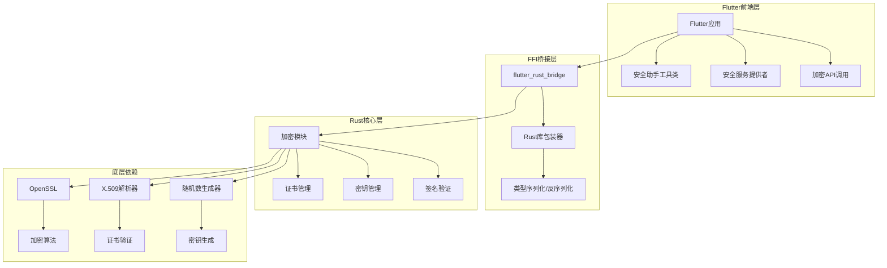

**图表来源**
- [app/lib/util/security_helper.dart](file://app/lib/util/security_helper.dart#L1-L72)
- [app/rust/src/api/crypto.rs](file://app/rust/src/api/crypto.rs#L1-L22)
- [core/src/crypto/mod.rs](file://core/src/crypto/mod.rs#L1-L5)

**章节来源**
- [app/rust/src/lib.rs](file://app/rust/src/lib.rs#L1-L4)
- [app/rust/src/api/mod.rs](file://app/rust/src/api/mod.rs#L1-L5)

## 核心组件

LocalSend的加密接口由以下核心组件构成：

### 1. 证书管理组件
负责X.509证书的生成、验证和提取公钥功能。

### 2. 密钥管理组件  
提供Ed25519和RSA密钥对的生成、导出和解析功能。

### 3. 数字签名组件
实现消息签名和验证功能，支持多种签名算法。

### 4. 哈希计算组件
提供SHA-256等哈希算法的实现。

### 5. 随机数生成组件
生成安全的随机数用于加密操作。

**章节来源**
- [core/src/crypto/cert.rs](file://core/src/crypto/cert.rs#L1-L187)
- [core/src/crypto/token.rs](file://core/src/crypto/token.rs#L1-L255)
- [core/src/crypto/hash.rs](file://core/src/crypto/hash.rs#L1-L8)
- [core/src/crypto/nonce.rs](file://core/src/crypto/nonce.rs#L1-L12)

## 架构概览

加密接口的整体架构采用多层设计，确保了安全性、可维护性和性能：

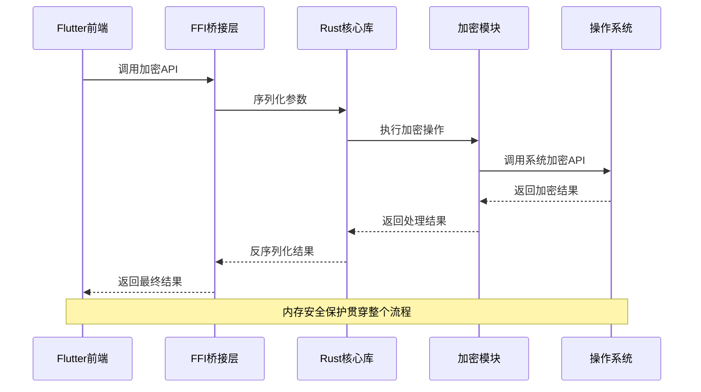

**图表来源**
- [app/rust/src/frb_generated.rs](file://app/rust/src/frb_generated.rs#L1262-L1328)
- [app/lib/rust/frb_generated.dart](file://app/lib/rust/frb_generated.dart#L858-L904)

## 详细组件分析

### 证书验证组件

证书验证组件负责验证X.509证书的有效性，包括时间有效性检查、签名验证和公钥匹配。

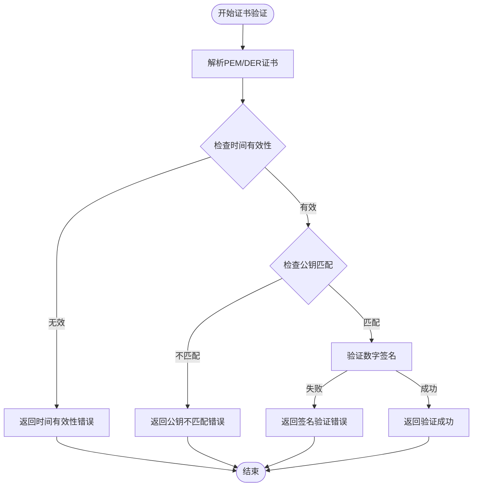

**图表来源**
- [core/src/crypto/cert.rs](file://core/src/crypto/cert.rs#L15-L45)

**章节来源**
- [core/src/crypto/cert.rs](file://core/src/crypto/cert.rs#L1-L187)

### 密钥生成和管理组件

密钥管理组件支持Ed25519和RSA-PSS两种签名算法，提供完整的密钥生命周期管理。

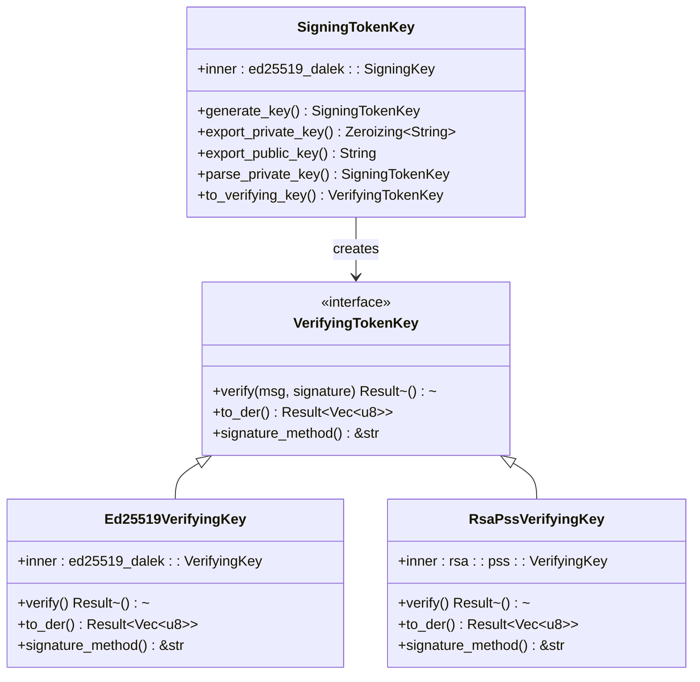

**图表来源**
- [core/src/crypto/token.rs](file://core/src/crypto/token.rs#L5-L50)

**章节来源**
- [core/src/crypto/token.rs](file://core/src/crypto/token.rs#L1-L255)

### 令牌生成和验证组件

令牌系统提供了基于时间戳和随机数的安全认证机制。

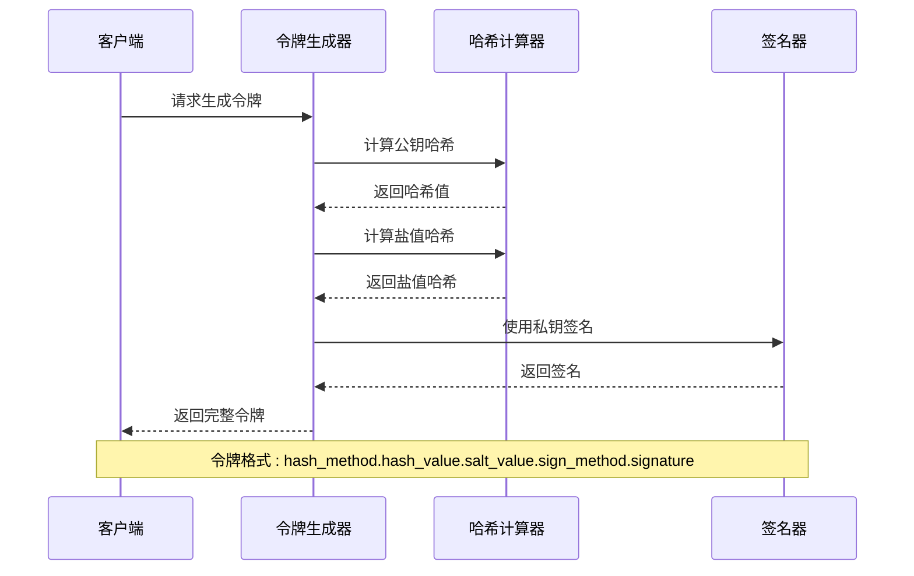

**图表来源**
- [core/src/crypto/token.rs](file://core/src/crypto/token.rs#L120-L150)

**章节来源**
- [core/src/crypto/token.rs](file://core/src/crypto/token.rs#L120-L255)

## FFI桥接机制

LocalSend使用flutter_rust_bridge框架实现Flutter与Rust之间的FFI桥接，提供了类型安全的数据传递和错误处理机制。

### 桥接架构设计

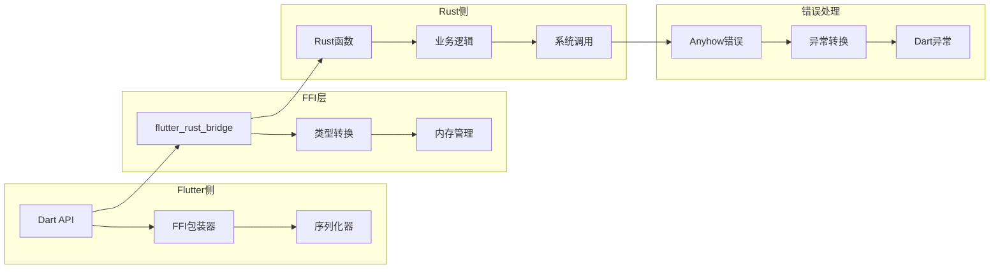

**图表来源**
- [app/rust/src/frb_generated.rs](file://app/rust/src/frb_generated.rs#L1262-L1328)
- [app/lib/rust/frb_generated.dart](file://app/lib/rust/frb_generated.dart#L858-L904)

### 数据类型映射

FFI桥接层定义了完整的数据类型映射关系：

| Flutter类型 | Rust类型 | 序列化格式 |
|-------------|----------|------------|
| String | String | UTF-8编码字符串 |
| Uint8List | Vec<u8> | 字节数组 |
| bool | bool | 布尔值 |
| i32 | i32 | 32位有符号整数 |
| i64 | i64 | 64位有符号整数 |
| KeyPair | KeyPair | 结构体序列化 |

**章节来源**
- [app/rust/src/frb_generated.rs](file://app/rust/src/frb_generated.rs#L1-L3000)
- [app/lib/rust/frb_generated.dart](file://app/lib/rust/frb_generated.dart#L1-L1000)

## 数据序列化格式

加密接口采用SSE（Simple Struct Encoding）作为默认的序列化格式，确保跨语言数据的一致性和可靠性。

### 序列化流程

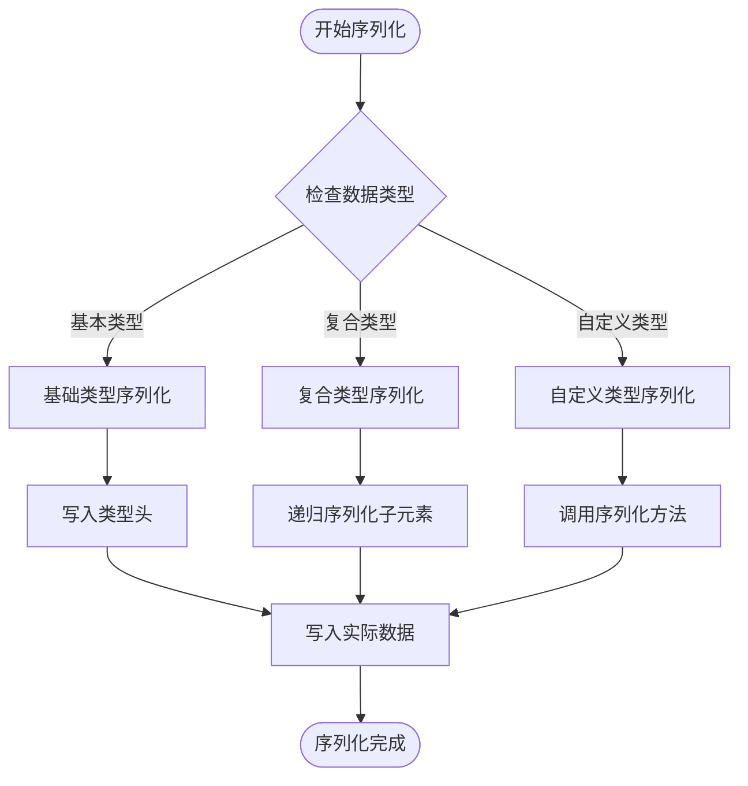

**图表来源**
- [app/rust/src/frb_generated.rs](file://app/rust/src/frb_generated.rs#L2011-L2042)

### 错误类型处理

系统定义了完整的错误类型层次结构：

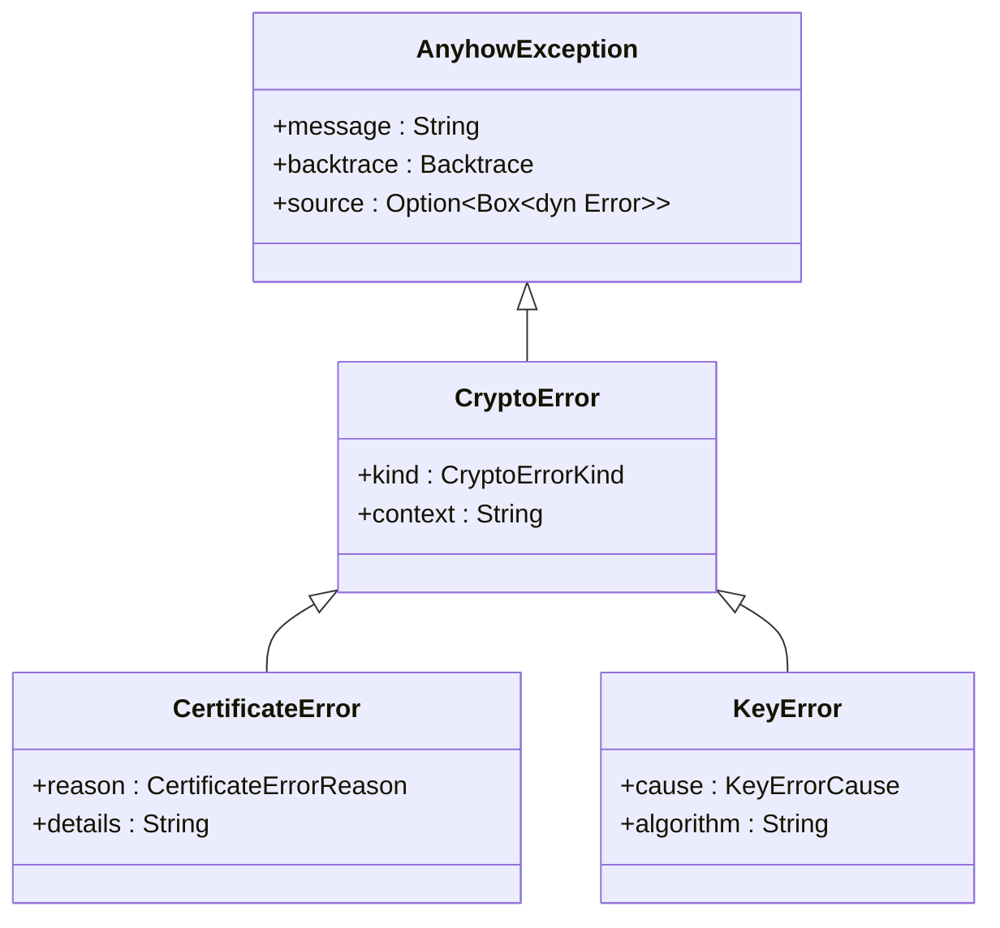

**图表来源**
- [app/lib/rust/frb_generated.dart](file://app/lib/rust/frb_generated.dart#L23-L75)

**章节来源**
- [app/rust/src/frb_generated.rs](file://app/rust/src/frb_generated.rs#L2011-L2042)

## 错误处理策略

LocalSend的加密接口实现了多层次的错误处理策略，确保系统的稳定性和用户体验。

### 错误分类和处理

| 错误类型 | 处理策略 | 用户反馈 |
|----------|----------|----------|
| 证书验证失败 | 重试连接或提示用户 | 显示证书错误信息 |
| 密钥解析失败 | 重新生成密钥对 | 自动修复或提示用户 |
| 网络连接超时 | 指数退避重试 | 显示重试进度 |
| 内存不足 | 清理缓存释放资源 | 显示存储空间警告 |

### 异常传播机制

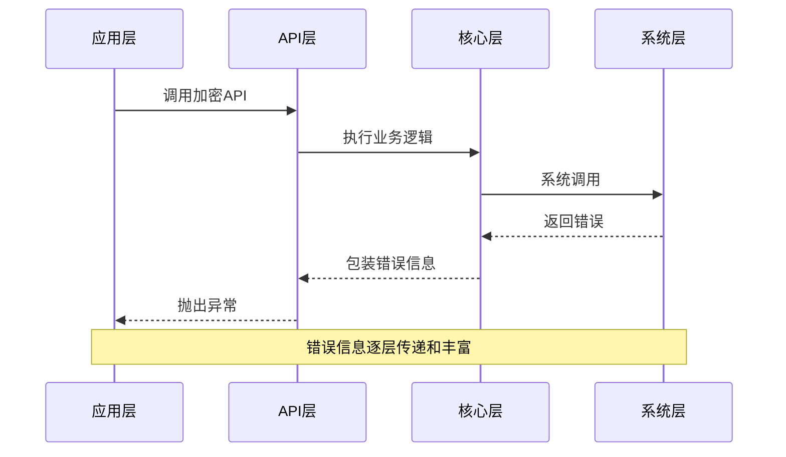

**图表来源**
- [app/rust/src/frb_generated.rs](file://app/rust/src/frb_generated.rs#L1262-L1328)

**章节来源**
- [app/rust/src/frb_generated.rs](file://app/rust/src/frb_generated.rs#L1262-L1328)

## 证书和密钥管理

### 证书生成流程

LocalSend使用自签名证书来建立安全的HTTPS连接：

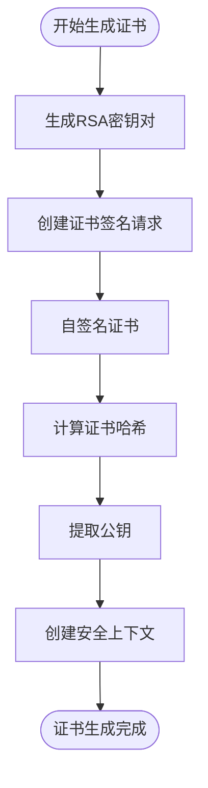

**图表来源**
- [app/lib/util/security_helper.dart](file://app/lib/util/security_helper.dart#L8-L30)

### 密钥对管理

系统支持多种密钥算法的混合使用：

| 算法类型 | 用途 | 密钥长度 | 安全级别 |
|----------|------|----------|----------|
| Ed25519 | 数字签名 | 256位 | 高 |
| RSA-PSS | 数字签名 | 2048位 | 高 |
| AES-GCM | 数据加密 | 256位 | 高 |
| SHA-256 | 哈希计算 | 256位 | 高 |

**章节来源**
- [app/lib/util/security_helper.dart](file://app/lib/util/security_helper.dart#L1-L72)
- [app/lib/provider/security_provider.dart](file://app/lib/provider/security_provider.dart#L1-L35)

## 异步加密操作

### 异步执行模型

LocalSend的加密接口支持完全异步的操作模式，避免阻塞主线程：

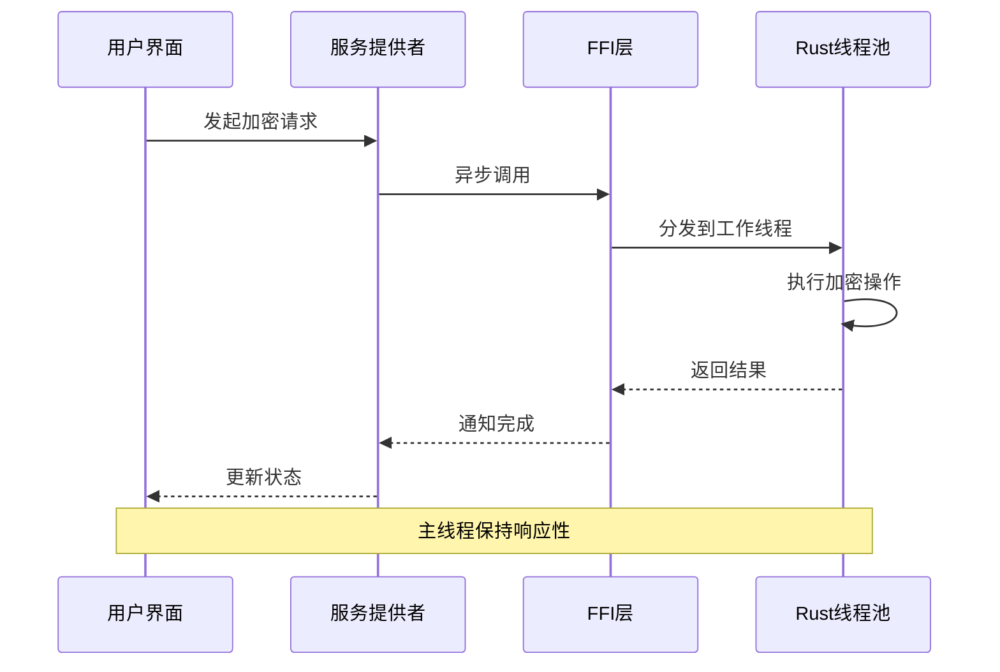

**图表来源**
- [app/rust/src/frb_generated.rs](file://app/rust/src/frb_generated.rs#L1222-L1234)

### 并发控制

系统实现了智能的并发控制机制：

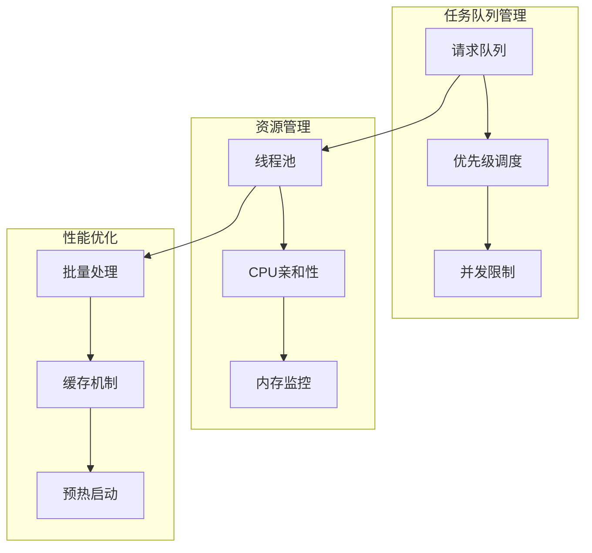

**章节来源**
- [app/rust/src/frb_generated.rs](file://app/rust/src/frb_generated.rs#L1222-L1234)

## 性能优化技巧

### 内存管理优化

LocalSend采用了多种内存优化技术：

1. **零拷贝操作**：尽可能使用引用而不是复制数据
2. **内存池管理**：重用频繁分配的小对象
3. **智能指针**：使用Rust的ARC和RC进行共享所有权管理
4. **自动清理**：通过RAII模式确保资源及时释放

### 算法优化

| 优化技术 | 应用场景 | 性能提升 |
|----------|----------|----------|
| SIMD指令 | 哈希计算 | 2-4倍 |
| 多线程并行 | 大文件加密 | 线性提升 |
| 缓存预热 | 频繁操作 | 30-50% |
| 流式处理 | 大文件传输 | 减少内存占用 |

### 网络优化

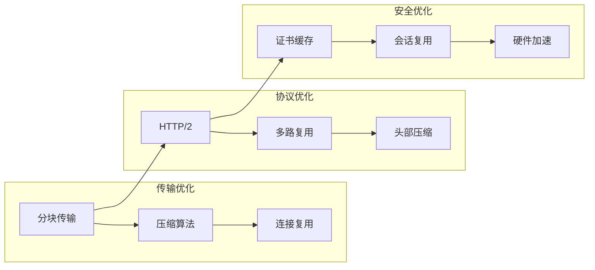

**章节来源**
- [core/src/crypto/hash.rs](file://core/src/crypto/hash.rs#L1-L8)
- [core/src/crypto/nonce.rs](file://core/src/crypto/nonce.rs#L1-L12)

## 接口版本管理和兼容性

### 版本控制策略

LocalSend采用语义化版本控制（SemVer）来管理加密接口的版本：

```
主版本号.次版本号.修订号[-预发布版本][+构建元数据]
```

### 向后兼容性保证

| 兼容性级别 | 修改内容 | 影响范围 |
|------------|----------|----------|
| 破坏性变更 | 移除或更改现有API | 需要重构客户端 |
| 新功能 | 添加新的API或参数 | 向后兼容 |
| 错误修复 | 修复现有问题 | 无需修改 |
| 性能改进 | 优化内部实现 | 透明升级 |

### 迁移指南

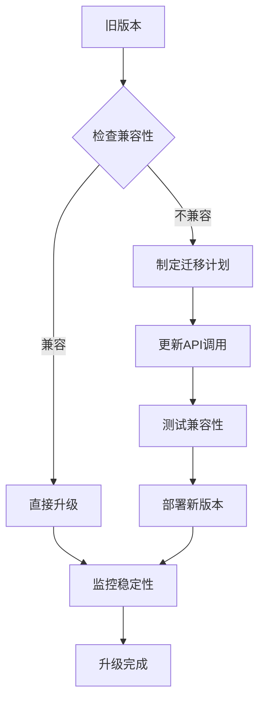

**章节来源**
- [app/lib/rust/frb_generated.dart](file://app/lib/rust/frb_generated.dart#L60-L75)

## 调试和测试方法

### 单元测试框架

LocalSend为加密接口提供了完整的单元测试覆盖：

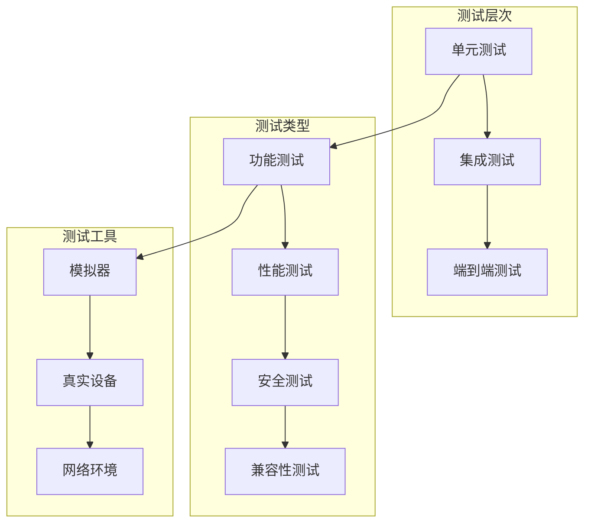

### 调试工具和技术

| 调试工具 | 用途 | 使用场景 |
|----------|------|----------|
| 日志记录 | 跟踪执行流程 | 生产环境监控 |
| 性能分析 | 识别瓶颈 | 性能优化 |
| 内存分析 | 检测泄漏 | 内存优化 |
| 网络抓包 | 分析通信协议 | 协议调试 |

### 测试用例设计

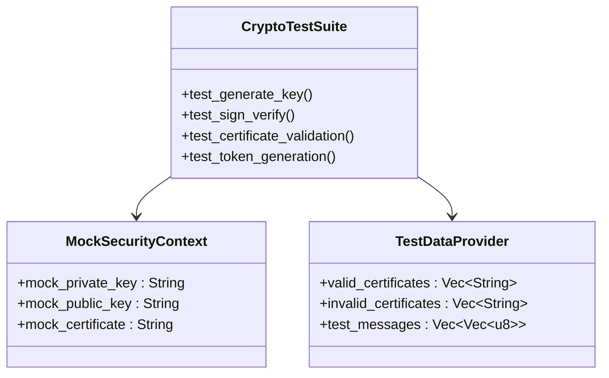

**图表来源**
- [core/src/crypto/token.rs](file://core/src/crypto/token.rs#L218-L253)

**章节来源**
- [core/src/crypto/token.rs](file://core/src/crypto/token.rs#L218-L255)

## 结论

LocalSend的加密接口设计体现了现代软件工程的最佳实践，通过Rust核心库与Flutter前端的FFI桥接，实现了高性能、安全可靠的跨平台加密解决方案。

### 主要优势

1. **安全性**：采用业界标准的加密算法和证书格式
2. **性能**：通过异步操作和内存优化确保流畅体验
3. **可维护性**：清晰的架构设计和完善的测试覆盖
4. **兼容性**：支持多种平台和加密标准
5. **可扩展性**：模块化设计便于功能扩展

### 技术创新点

- **FFI桥接优化**：通过flutter_rust_bridge实现高效的跨语言通信
- **内存安全**：利用Rust的所有权系统确保内存安全
- **异步架构**：完全异步的设计避免UI阻塞
- **智能错误处理**：多层次的错误处理和恢复机制

### 未来发展方向

随着网络安全威胁的不断演进，LocalSend的加密接口将继续发展，重点关注以下领域：

- 支持量子抗性加密算法
- 增强隐私保护功能
- 优化移动设备上的性能表现
- 扩展对新兴协议的支持

通过持续的技术创新和社区贡献，LocalSend致力于为用户提供最安全、最便捷的文件传输体验。