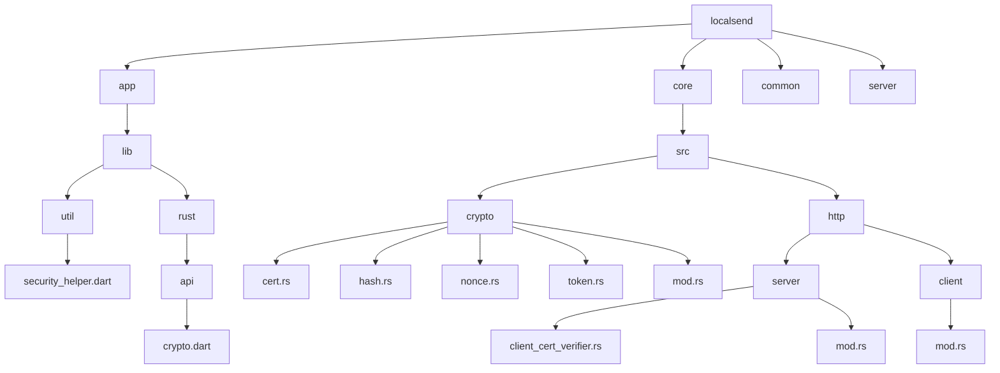
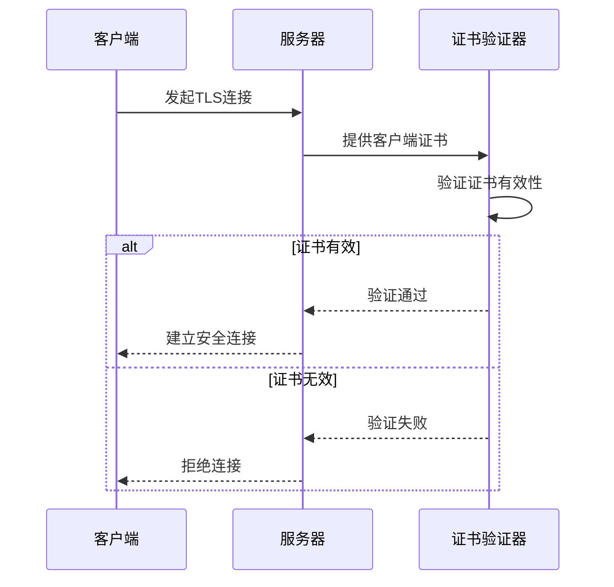
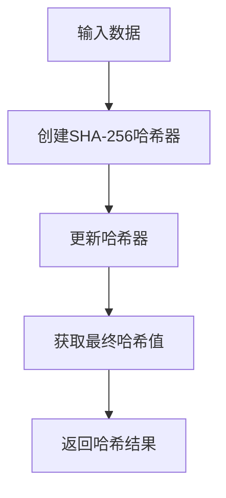
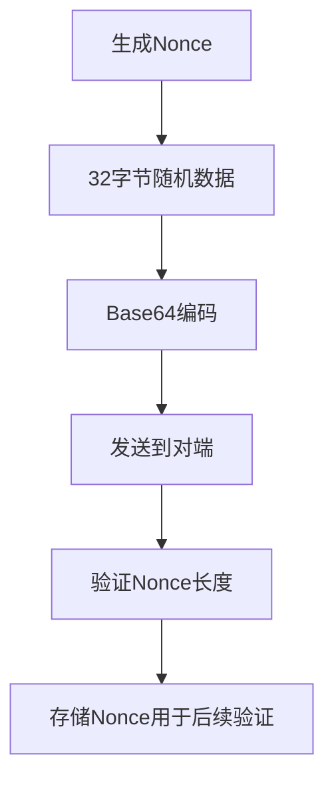
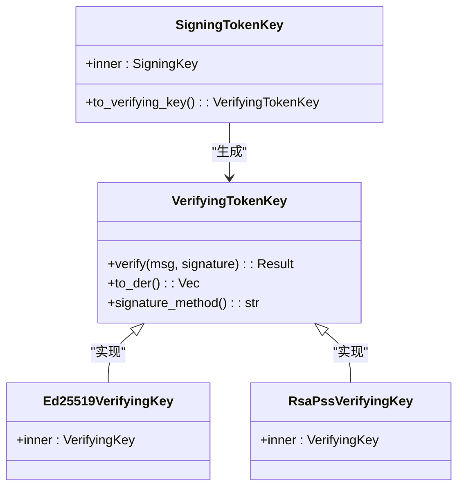
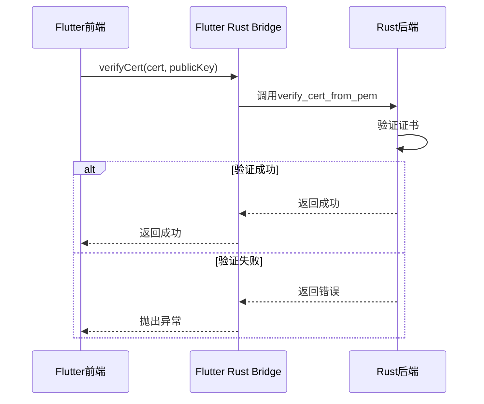
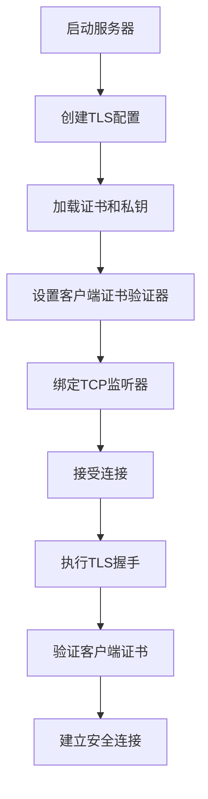

# 加密机制

<cite>
**本文档中引用的文件**  
- [cert.rs](file://core/src/crypto/cert.rs)
- [hash.rs](file://core/src/crypto/hash.rs)
- [nonce.rs](file://core/src/crypto/nonce.rs)
- [token.rs](file://core/src/crypto/token.rs)
- [mod.rs](file://core/src/crypto/mod.rs)
- [client_cert_verifier.rs](file://core/src/http/server/client_cert_verifier.rs)
- [mod.rs](file://core/src/http/server/mod.rs)
- [mod.rs](file://core/src/http/client/mod.rs)
- [security_helper.dart](file://app/lib/util/security_helper.dart)
- [crypto.dart](file://app/lib/rust/api/crypto.dart)
- [client_cert_verifier.rs](file://core/src/http/server/client_cert_verifier.rs)
</cite>

## 目录
1. [项目结构](#项目结构)
2. [核心加密组件](#核心加密组件)
3. [TLS/SSL实现](#tls/ssl实现)
4. [SHA-256哈希算法应用](#sha-256哈希算法应用)
5. [Nonce和Token机制](#nonce和token机制)
6. [Rust与Flutter接口设计](#rust与flutter接口设计)
7. [与其他模块的集成](#与其他模块的集成)
8. [性能优化与安全建议](#性能优化与安全建议)

## 项目结构

**Diagram sources**
- [cert.rs](file://core/src/crypto/cert.rs)
- [security_helper.dart](file://app/lib/util/security_helper.dart)
- [crypto.dart](file://app/lib/rust/api/crypto.dart)

## 核心加密组件

项目中的加密机制主要由Rust核心库实现，分为证书管理、哈希计算、Nonce生成和Token签名四个核心模块。这些模块通过`crypto`目录下的四个主要文件组织：`cert.rs`处理X.509证书的验证和公钥提取，`hash.rs`实现SHA-256哈希算法，`nonce.rs`负责生成和验证随机数，`token.rs`则处理基于Ed25519的数字签名和令牌生成。

加密模块的设计遵循了清晰的分层架构，`mod.rs`文件作为入口点导出了所有子模块，确保了API的整洁性和可维护性。这种模块化设计使得各个加密功能可以独立开发和测试，同时通过统一的接口对外提供服务。

**Section sources**
- [mod.rs](file://core/src/crypto/mod.rs)
- [cert.rs](file://core/src/crypto/cert.rs)
- [hash.rs](file://core/src/crypto/hash.rs)
- [nonce.rs](file://core/src/crypto/nonce.rs)
- [token.rs](file://core/src/crypto/token.rs)

## TLS/SSL实现

### 自签名证书生成与验证

项目使用自签名证书实现TLS/SSL加密通信。在服务器端，`CustomClientCertVerifier`结构体负责客户端证书的验证，它通过`WebPkiClientVerifier`构建器创建验证器，并将服务器自身的证书添加到信任的根证书存储中。这种设计确保了只有持有有效证书的客户端才能建立连接。

**Diagram sources**
- [client_cert_verifier.rs](file://core/src/http/server/client_cert_verifier.rs)
- [mod.rs](file://core/src/http/server/mod.rs)

### 证书存储与管理

证书的存储和管理通过`LsHttpServer`结构体实现。服务器在启动时会创建TLS配置，将证书和私钥从PEM格式解析为`CertificateDer`和`PrivateKeyDer`对象。`create_tls_config`函数负责构建`rustls::ServerConfig`，配置客户端证书验证器并设置单个证书和私钥。

客户端使用`reqwest::Client`进行HTTPS请求，通过`Identity::from_pem`方法将证书和私钥合并为PEM格式的身份信息。`danger_accept_invalid_certs(true)`配置允许接受无效证书，这在自签名证书场景下是必要的。

**Section sources**
- [mod.rs](file://core/src/http/server/mod.rs)
- [mod.rs](file://core/src/http/client/mod.rs)

## SHA-256哈希算法应用

SHA-256哈希算法在设备身份验证中扮演着关键角色。`hash.rs`文件提供了简洁的`sha256`函数，使用`sha2` crate创建哈希器，更新数据并返回最终的哈希值。该函数被其他加密模块广泛引用，确保了哈希计算的一致性。

**Diagram sources**
- [hash.rs](file://core/src/crypto/hash.rs)

在设备验证过程中，证书的哈希值被用作设备的唯一指纹。`calculateHashOfCertificate`函数首先将PEM格式的证书转换为DER格式，然后使用SHA-256算法计算哈希值。这个哈希值作为设备的`fingerprint`存储在`StoredSecurityContext`中，用于快速识别和验证设备身份。

**Section sources**
- [hash.rs](file://core/src/crypto/hash.rs)
- [security_helper.dart](file://app/lib/util/security_helper.dart)

## Nonce和Token机制

### Nonce生成与验证

Nonce（一次性随机数）机制用于防止重放攻击。`nonce.rs`文件中的`generate_nonce`函数使用`rand` crate生成32字节的随机数，`validate_nonce`函数则验证Nonce的长度是否在16-128字节的有效范围内。

**Diagram sources**
- [nonce.rs](file://core/src/crypto/nonce.rs)

在实际通信中，Nonce通过HTTP请求在客户端和服务器之间交换。`LsHttpClient`的`nonce`方法生成Nonce，发送到服务器，并将响应中的Nonce存储在LRU缓存中。这种双向Nonce交换机制确保了通信双方都能验证对方的身份，防止了中间人攻击。

**Section sources**
- [nonce.rs](file://core/src/crypto/nonce.rs)
- [mod.rs](file://core/src/http/client/mod.rs)

### Token签名与验证

Token机制基于Ed25519数字签名算法实现。`token.rs`文件定义了`SigningTokenKey`和`VerifyingTokenKey` trait，支持Ed25519和RSA-PSS两种签名方法。`generate_key`函数使用`OsRng`生成安全的随机数，创建Ed25519签名密钥。

**Diagram sources**
- [token.rs](file://core/src/crypto/token.rs)

Token的生成过程结合了时间戳和Nonce两种模式。`generate_token_timestamp`使用当前Unix时间戳作为salt，`generate_token_nonce`则使用提供的Nonce作为salt。生成的Token格式为`hash_method.hash_base64.salt_base64.sign_method.signature_base64`，包含了完整的验证信息。

**Section sources**
- [token.rs](file://core/src/crypto/token.rs)

## Rust与Flutter接口设计

### 加密接口设计

Rust核心库与Flutter前端通过`flutter_rust_bridge`进行通信。`crypto.dart`文件定义了`verifyCert`和`generateKeyPair`两个异步方法，这些方法通过FFI（外部函数接口）调用Rust后端的实现。`KeyPair`类封装了私钥和公钥，提供了相等性和哈希计算的重载操作。

**Diagram sources**
- [crypto.dart](file://app/lib/rust/api/crypto.dart)
- [frb_generated.rs](file://app/rust/src/frb_generated.rs)

### 证书序列化与密钥交换

证书序列化通过PEM格式实现，`pem::encode`函数将DER格式的证书编码为PEM格式的字符串。密钥交换过程在`LsHttpClient::try_new`中完成，将证书和私钥合并为PEM格式的身份信息，用于建立安全的HTTPS连接。

**Section sources**
- [crypto.dart](file://app/lib/rust/api/crypto.dart)
- [mod.rs](file://core/src/http/client/mod.rs)

## 与其他模块的集成

### 与网络服务器的集成

加密组件与网络服务器紧密集成。`LsHttpServer`在启动时创建TLS配置，将证书和私钥传递给`rustls::ServerConfig`。`CustomClientCertVerifier`确保只有持有有效证书的客户端才能建立连接，实现了双向认证的安全通信。

**Diagram sources**
- [mod.rs](file://core/src/http/server/mod.rs)
- [client_cert_verifier.rs](file://core/src/http/server/client_cert_verifier.rs)

### 与设备发现的集成

在设备发现过程中，加密机制确保了通信的安全性。当设备通过多播或HTTP发现其他设备时，会交换Nonce并验证证书。`StoredSecurityContext`中的`fingerprint`用于快速识别已知设备，避免重复发现。

**Section sources**
- [mod.rs](file://core/src/http/server/mod.rs)
- [security_helper.dart](file://app/lib/util/security_helper.dart)

## 性能优化与安全建议

### 性能优化

1. **LRU缓存**：使用`LruCache`缓存Nonce和生成的Nonce，避免重复计算和存储，提高性能。
2. **异步处理**：所有加密操作都设计为异步，避免阻塞主线程，提高响应速度。
3. **批量操作**：在可能的情况下，批量处理多个加密操作，减少系统调用开销。

### 安全漏洞防范

1. **证书验证**：始终验证客户端证书的有效性，包括签名、时间和公钥匹配。
2. **Nonce管理**：使用足够长的Nonce（32字节），并验证其长度，防止短Nonce攻击。
3. **时间戳验证**：Token的时间戳有效期限制在1小时内，防止过期Token被重放。
4. **密钥保护**：私钥在内存中使用`Zeroizing`包装，确保在释放时被清零，防止内存泄露。
5. **输入验证**：严格验证所有输入数据，防止注入攻击和缓冲区溢出。

**Section sources**
- [token.rs](file://core/src/crypto/token.rs)
- [nonce.rs](file://core/src/crypto/nonce.rs)
- [cert.rs](file://core/src/crypto/cert.rs)