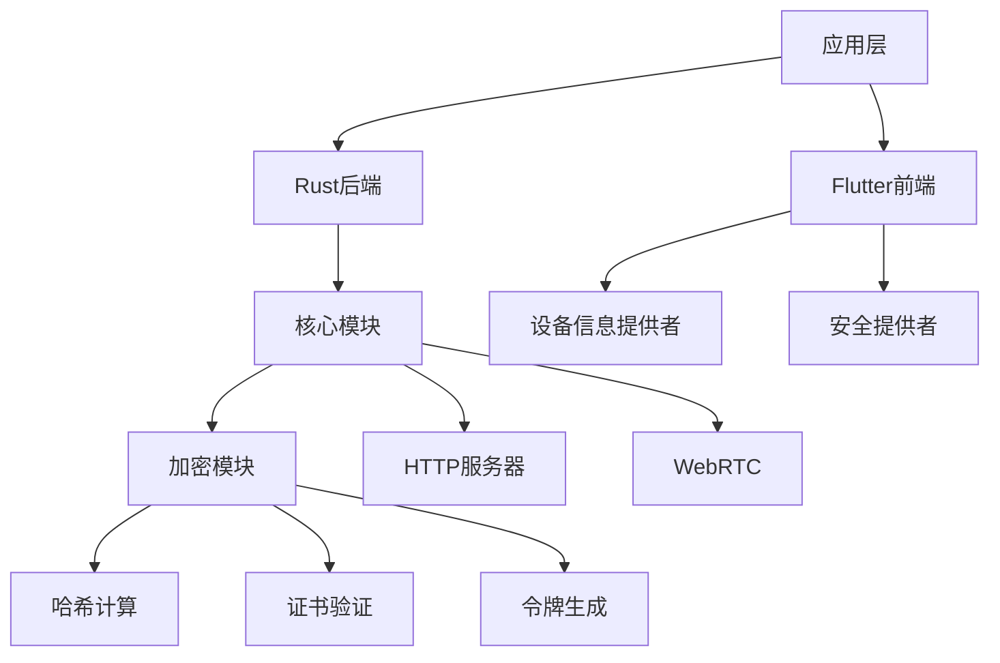
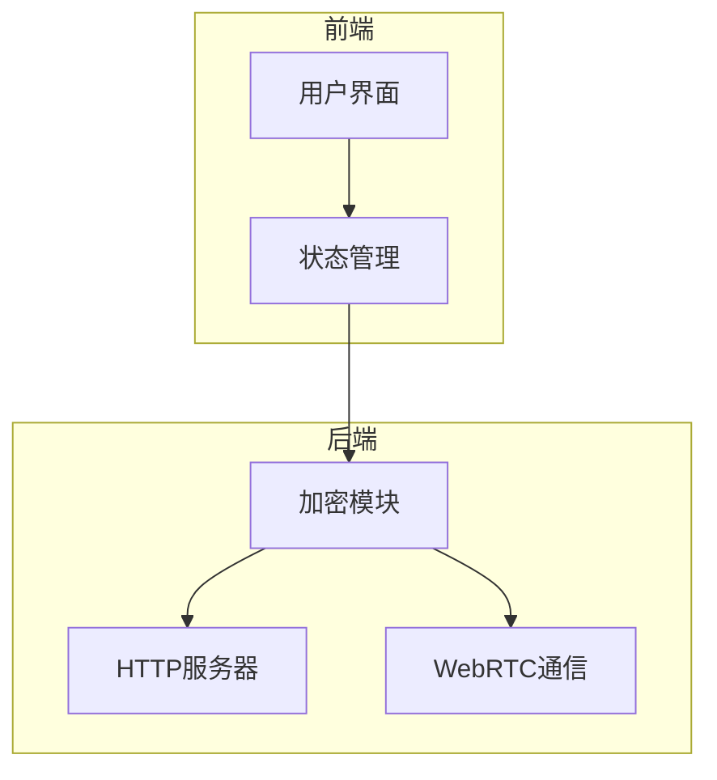
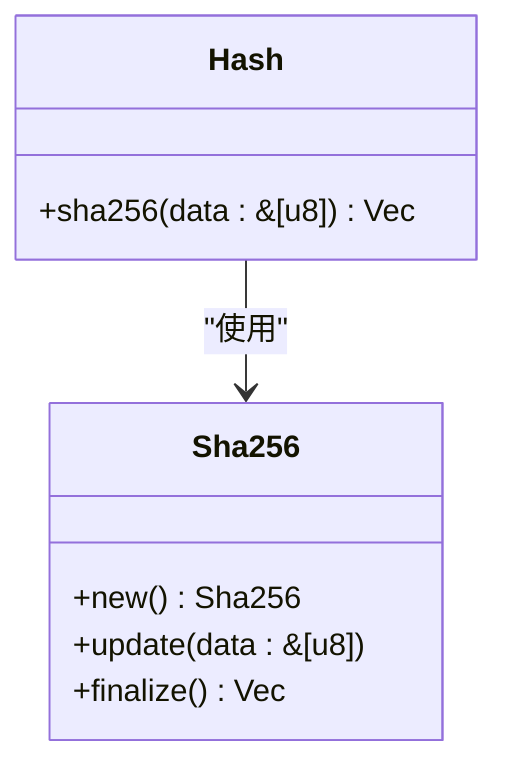
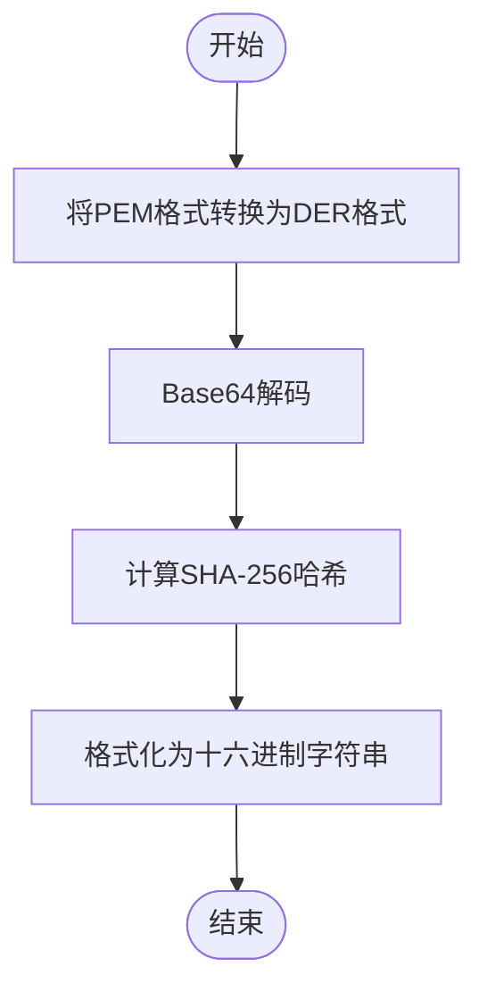
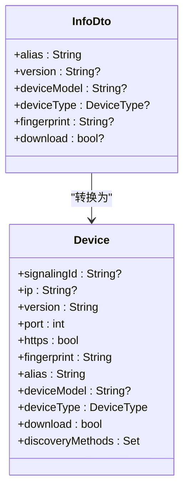
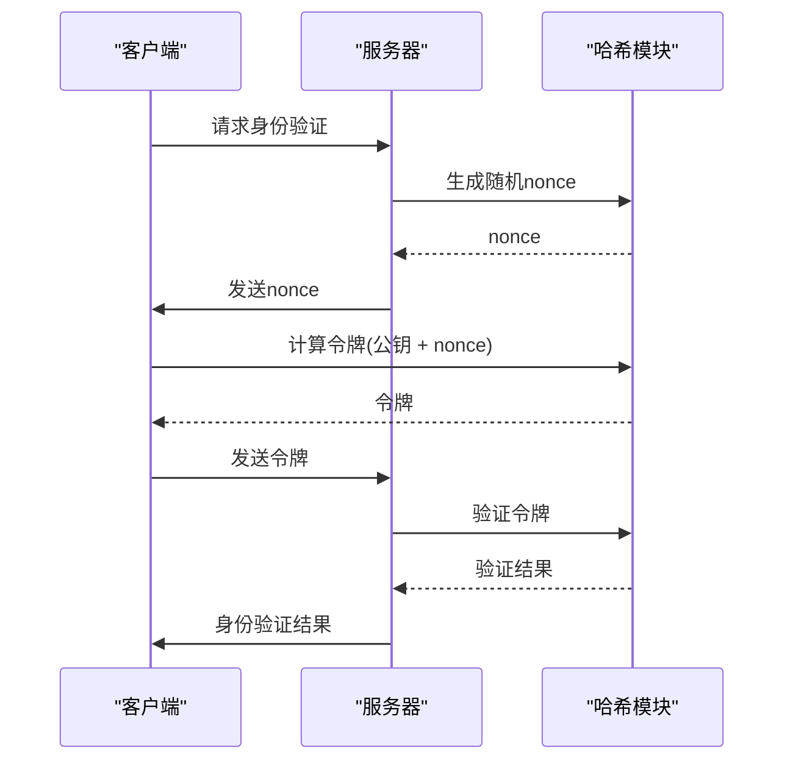
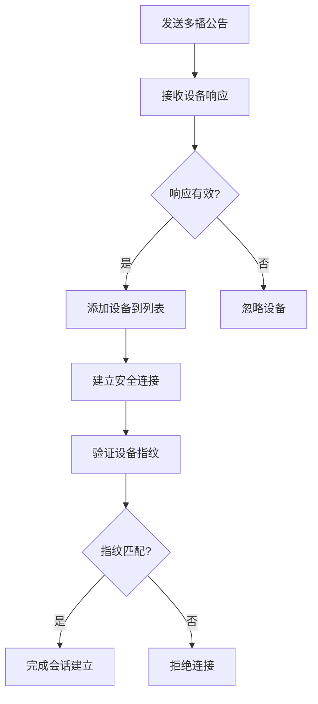
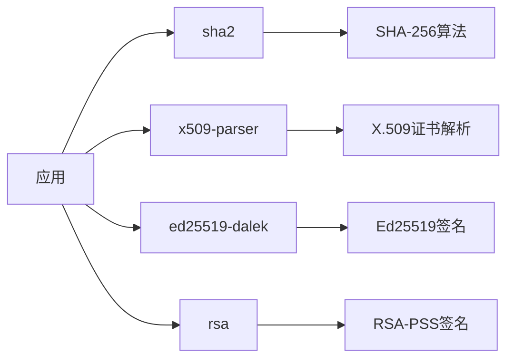

# 哈希计算

<cite>
**本文档中引用的文件**  
- [hash.rs](file://core/src/crypto/hash.rs)
- [security_helper.dart](file://app/lib/util/security_helper.dart)
- [cert.rs](file://core/src/crypto/cert.rs)
- [token.rs](file://core/src/crypto/token.rs)
- [device.dart](file://common/lib/model/device.dart)
- [device.mapper.dart](file://common/lib/model/device.mapper.dart)
- [info_dto.dart](file://common/lib/model/dto/info_dto.dart)
- [register_dto.dart](file://common/lib/model/dto/register_dto.dart)
- [info_register_dto.dart](file://common/lib/model/dto/info_register_dto.dart)
- [multicast_dto.dart](file://common/lib/model/dto/multicast_dto.dart)
- [nonce.rs](file://core/src/crypto/nonce.rs)
- [client_cert_verifier.rs](file://core/src/http/server/client_cert_verifier.rs)
- [mod.rs](file://core/src/crypto/mod.rs)
</cite>

## 目录
1. [简介](#简介)
2. [项目结构](#项目结构)
3. [核心组件](#核心组件)
4. [架构概述](#架构概述)
5. [详细组件分析](#详细组件分析)
6. [依赖分析](#依赖分析)
7. [性能考虑](#性能考虑)
8. [故障排除指南](#故障排除指南)
9. [结论](#结论)

## 简介
本文件详细阐述了SHA-256哈希算法在设备身份验证中的应用，包括设备指纹生成、数据完整性校验和密码哈希存储。文档深入解释了哈希函数的实现细节，如消息填充、分块处理和压缩函数。同时说明了哈希值在设备发现和会话建立过程中的作用，并提供了代码示例展示哈希计算的实际实现和性能优化技巧。此外，文档还解释了哈希组件与其他模块（如网络通信和用户认证）的集成方式，包含抗碰撞攻击、彩虹表防护等安全最佳实践，以及针对不同数据类型（文件、字符串、二进制流）的哈希处理策略。

## 项目结构
该项目是一个跨平台的文件传输应用，主要由Flutter前端和Rust后端组成。核心功能包括设备发现、文件传输和安全通信。哈希计算主要在Rust的core模块中实现，用于设备身份验证和数据完整性校验。

**图表来源**
- [hash.rs](file://core/src/crypto/hash.rs)
- [security_helper.dart](file://app/lib/util/security_helper.dart)
- [cert.rs](file://core/src/crypto/cert.rs)

**章节来源**
- [hash.rs](file://core/src/crypto/hash.rs)
- [security_helper.dart](file://app/lib/util/security_helper.dart)

## 核心组件
哈希计算的核心组件包括SHA-256算法实现、证书哈希计算、设备指纹生成和令牌验证。这些组件共同构成了系统的安全基础，确保设备身份的真实性和数据传输的完整性。

**章节来源**
- [hash.rs](file://core/src/crypto/hash.rs)
- [security_helper.dart](file://app/lib/util/security_helper.dart)
- [cert.rs](file://core/src/crypto/cert.rs)

## 架构概述
系统采用分层架构，前端使用Flutter构建用户界面，后端使用Rust处理核心逻辑。哈希计算作为安全模块的核心，被多个组件调用，包括设备发现、会话建立和数据传输。

**图表来源**
- [hash.rs](file://core/src/crypto/hash.rs)
- [security_helper.dart](file://app/lib/util/security_helper.dart)
- [cert.rs](file://core/src/crypto/cert.rs)

## 详细组件分析

### SHA-256哈希实现分析
SHA-256哈希算法是系统安全的基础，用于生成设备指纹、验证数据完整性和创建安全令牌。

#### 哈希算法实现

**图表来源**
- [hash.rs](file://core/src/crypto/hash.rs)

#### 证书哈希计算流程

**图表来源**
- [security_helper.dart](file://app/lib/util/security_helper.dart)
- [hash.rs](file://core/src/crypto/hash.rs)

**章节来源**
- [security_helper.dart](file://app/lib/util/security_helper.dart)
- [hash.rs](file://core/src/crypto/hash.rs)

### 设备身份验证分析
设备身份验证通过证书哈希和令牌机制实现，确保通信双方的身份真实可靠。

#### 设备模型与指纹

**图表来源**
- [device.dart](file://common/lib/model/device.dart)
- [info_dto.dart](file://common/lib/model/dto/info_dto.dart)

#### 令牌生成与验证

**图表来源**
- [token.rs](file://core/src/crypto/token.rs)
- [nonce.rs](file://core/src/crypto/nonce.rs)

**章节来源**
- [token.rs](file://core/src/crypto/token.rs)
- [nonce.rs](file://core/src/crypto/nonce.rs)

### 设备发现与会话建立分析
设备发现和会话建立过程依赖哈希值进行身份验证和安全通信。

#### 多播发现流程

**图表来源**
- [multicast_dto.dart](file://common/lib/model/dto/multicast_dto.dart)
- [register_dto.dart](file://common/lib/model/dto/register_dto.dart)

**章节来源**
- [multicast_dto.dart](file://common/lib/model/dto/multicast_dto.dart)
- [register_dto.dart](file://common/lib/model/dto/register_dto.dart)

## 依赖分析
系统依赖多个加密库来实现安全功能，其中哈希计算主要依赖sha2库。

**图表来源**
- [Cargo.toml](file://core/Cargo.toml)
- [Cargo.lock](file://core/Cargo.lock)

**章节来源**
- [Cargo.toml](file://core/Cargo.toml)
- [Cargo.lock](file://core/Cargo.lock)

## 性能考虑
哈希计算的性能优化主要体现在以下几个方面：

1. **算法选择**：使用经过广泛验证的SHA-256算法，平衡安全性和性能。
2. **内存管理**：避免不必要的数据复制，直接在原始数据上进行哈希计算。
3. **缓存机制**：对频繁计算的哈希值进行缓存，减少重复计算。
4. **并行处理**：在多文件传输场景下，可以并行计算多个文件的哈希值。

在设备发现过程中，系统通过快速哈希计算来优化性能，先计算文件的统计信息哈希，再决定是否进行完整的哈希计算。

**章节来源**
- [crate_hash.dart](file://app/rust_builder/cargokit/build_tool/lib/src/crate_hash.dart)

## 故障排除指南
### 常见问题及解决方案

1. **设备无法发现**
   - 检查网络连接是否正常
   - 确认防火墙未阻止多播通信
   - 验证设备的证书是否有效

2. **身份验证失败**
   - 检查证书哈希是否匹配
   - 确认时间同步，避免证书过期
   - 验证公钥是否正确

3. **哈希计算性能问题**
   - 检查是否有大量小文件导致频繁哈希计算
   - 确认是否启用了适当的缓存机制
   - 监控系统资源使用情况

**章节来源**
- [security_debug_page.dart](file://app/lib/pages/debug/security_debug_page.dart)
- [client_cert_verifier.rs](file://core/src/http/server/client_cert_verifier.rs)

## 结论
本系统通过SHA-256哈希算法构建了完整的设备身份验证体系，从证书哈希到设备指纹，再到安全令牌，形成了多层次的安全防护。哈希计算不仅用于身份验证，还在数据完整性校验和会话安全中发挥关键作用。通过合理的架构设计和性能优化，系统在保证安全性的同时也提供了良好的用户体验。