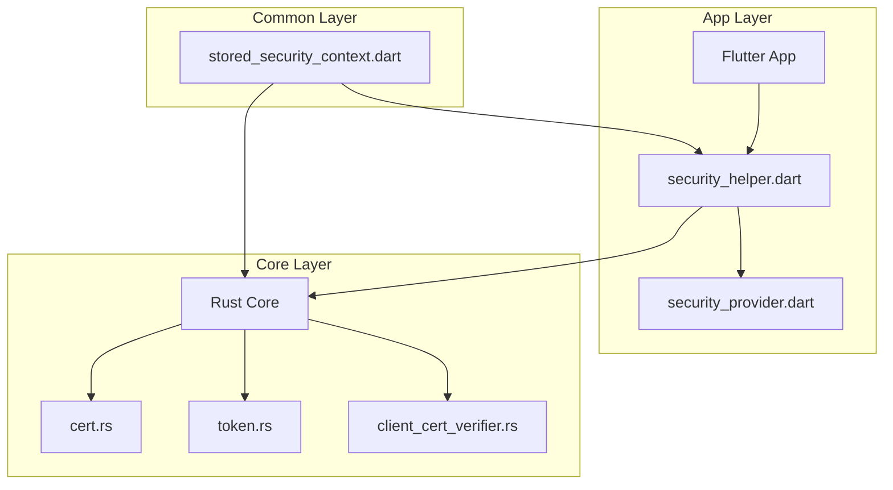
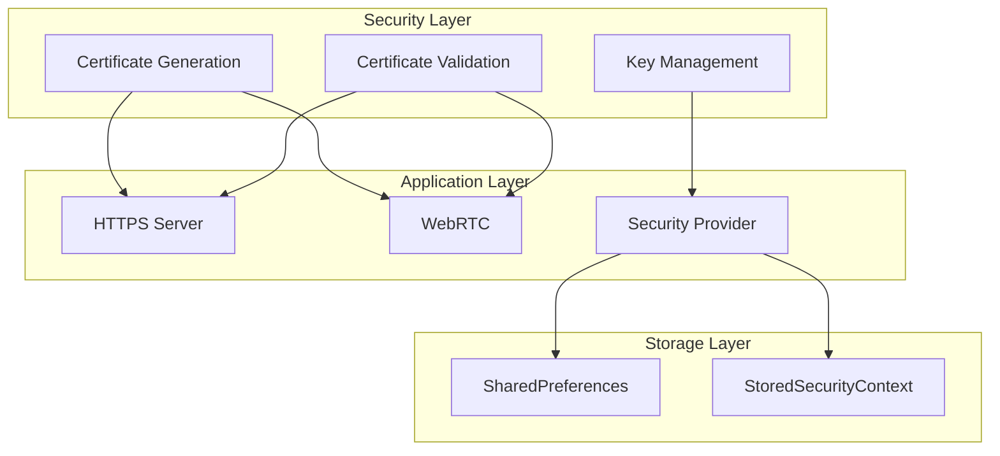
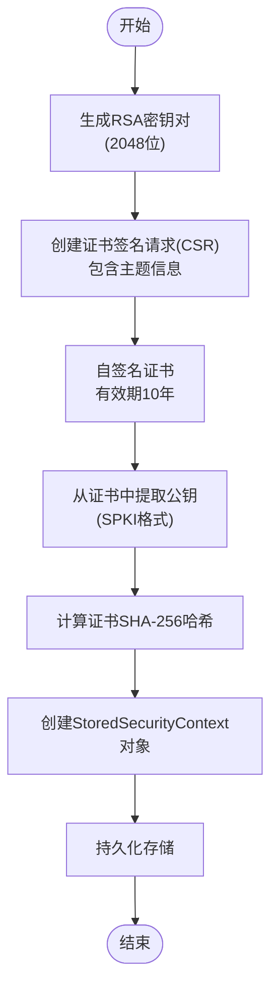
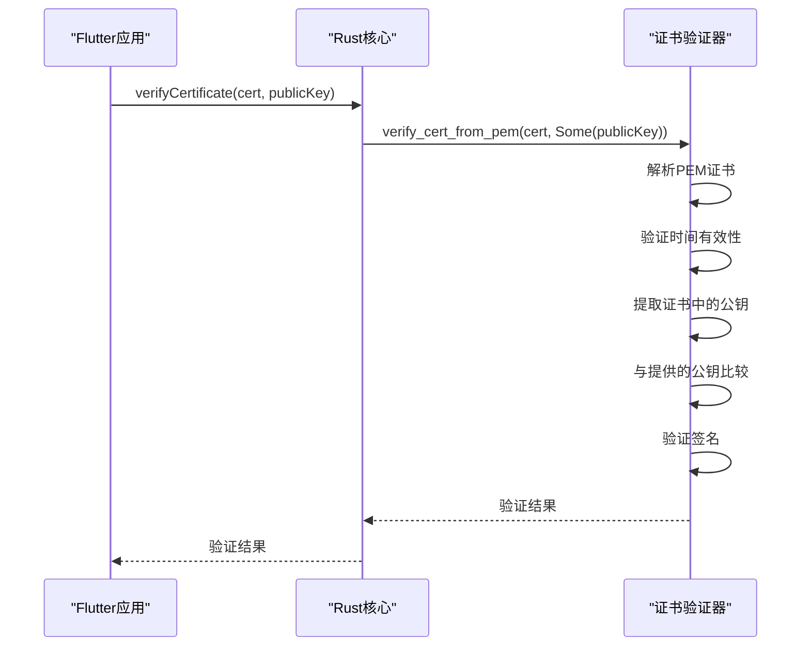
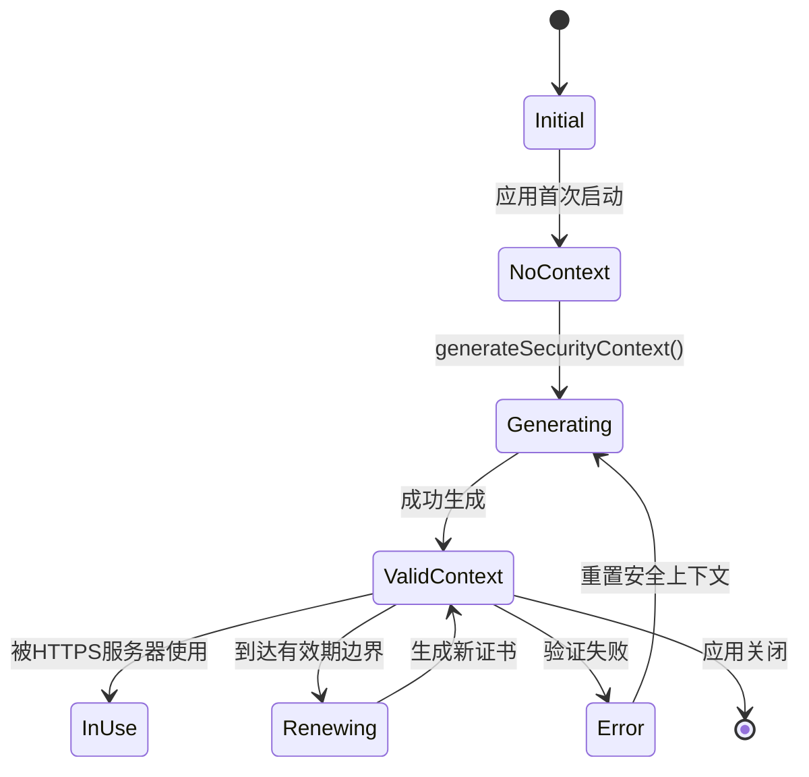
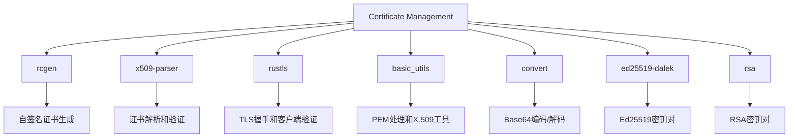

# 证书管理

<cite>
**本文档引用的文件**
- [security_helper.dart](file://app/lib/util/security_helper.dart)
- [cert.rs](file://core/src/crypto/cert.rs)
- [client_cert_verifier.rs](file://core/src/http/server/client_cert_verifier.rs)
- [server_provider.dart](file://app/lib/provider/network/server/server_provider.dart)
- [security_provider.dart](file://app/lib/provider/security_provider.dart)
- [stored_security_context.dart](file://common/lib/model/stored_security_context.dart)
- [crypto.rs](file://app/rust/src/api/crypto.rs)
- [http_server.rs](file://core/src/http/server/mod.rs)
- [webrtc.rs](file://core/src/webrtc/webrtc.rs)
- [token.rs](file://core/src/crypto/token.rs)
</cite>

## 目录
1. [引言](#引言)
2. [项目结构](#项目结构)
3. [核心组件](#核心组件)
4. [架构概述](#架构概述)
5. [详细组件分析](#详细组件分析)
6. [依赖分析](#依赖分析)
7. [性能考虑](#性能考虑)
8. [故障排除指南](#故障排除指南)
9. [结论](#结论)

## 引言
LocalSend 是一个安全的文件共享应用程序，使用自签名TLS证书来确保设备间通信的安全性。本文档详细介绍了LocalSend中的证书管理机制，包括自签名证书的生成、验证、序列化和反序列化过程，以及证书与其他安全组件（如HTTPS服务器和WebRTC）的集成方式。文档还涵盖了证书有效期管理、自动续期机制和证书吊销流程，并提供了性能优化建议和潜在安全漏洞的防范措施。

## 项目结构
LocalSend项目的证书管理功能分布在多个模块中，主要集中在`core`和`app`目录下。核心的加密功能在Rust编写的`core`模块中实现，而Flutter应用层则通过Ffi接口调用这些功能。证书相关的数据结构定义在`common`模块中，确保了跨平台的一致性。

**图表来源**
- [security_helper.dart](file://app/lib/util/security_helper.dart#L0-L71)
- [cert.rs](file://core/src/crypto/cert.rs#L0-L186)
- [stored_security_context.dart](file://common/lib/model/stored_security_context.dart#L0-L24)

**章节来源**
- [security_helper.dart](file://app/lib/util/security_helper.dart#L0-L71)
- [cert.rs](file://core/src/crypto/cert.rs#L0-L186)
- [stored_security_context.dart](file://common/lib/model/stored_security_context.dart#L0-L24)

## 核心组件
证书管理的核心组件包括自签名证书生成器、证书验证器、密钥对管理器和证书存储服务。系统使用RSA算法生成2048位密钥对，并创建有效期为10年的自签名证书。证书的公钥以SPKI格式存储，私钥以PKCS#1 PEM格式保存。每个证书都计算SHA-256哈希值用于快速验证和指纹识别。

**章节来源**
- [security_helper.dart](file://app/lib/util/security_helper.dart#L0-L71)
- [cert.rs](file://core/src/crypto/cert.rs#L0-L186)
- [token.rs](file://core/src/crypto/token.rs#L0-L254)

## 架构概述
LocalSend的证书管理架构采用分层设计，将证书生成功能与应用逻辑分离。Rust核心层提供安全的加密原语，Flutter应用层负责用户界面和持久化存储。系统使用自定义的客户端证书验证器，确保只有持有有效证书的设备才能建立连接。证书与WebRTC和HTTPS服务器紧密集成，为所有通信通道提供端到端加密。

**图表来源**
- [http_server.rs](file://core/src/http/server/mod.rs#L0-L365)
- [webrtc.rs](file://core/src/webrtc/webrtc.rs#L0-L799)
- [security_provider.dart](file://app/lib/provider/security_provider.dart#L0-L34)

## 详细组件分析

### 证书生成与验证分析
LocalSend使用RSA算法生成自签名TLS证书，确保证书的安全性和兼容性。证书生成过程包括密钥对创建、证书签名请求(CSR)生成和自签名证书创建三个主要步骤。

#### 证书生成流程

**图表来源**
- [security_helper.dart](file://app/lib/util/security_helper.dart#L0-L39)
- [cert.rs](file://core/src/crypto/cert.rs#L0-L186)

#### 证书验证流程

**图表来源**
- [security_helper.dart](file://app/lib/util/security_helper.dart#L72-L78)
- [cert.rs](file://core/src/crypto/cert.rs#L0-L186)
- [crypto.rs](file://app/rust/src/api/crypto.rs#L0-L21)

**章节来源**
- [security_helper.dart](file://app/lib/util/security_helper.dart#L0-L78)
- [cert.rs](file://core/src/crypto/cert.rs#L0-L186)

### 安全上下文管理分析
安全上下文管理负责证书的持久化存储和生命周期管理。系统使用`StoredSecurityContext`数据结构封装所有安全相关信息，并通过`SecurityProvider`进行管理。

#### 安全上下文数据结构
| 属性 | 类型 | 描述 |
|------|------|------|
| privateKey | String | PKCS#1格式的私钥PEM编码 |
| publicKey | String | SPKI格式的公钥PEM编码 |
| certificate | String | X.509格式的证书PEM编码 |
| certificateHash | String | 证书的SHA-256哈希值 |

**图表来源**
- [stored_security_context.dart](file://common/lib/model/stored_security_context.dart#L0-L24)

#### 安全上下文生命周期

**图表来源**
- [security_provider.dart](file://app/lib/provider/security_provider.dart#L0-L34)
- [stored_security_context.dart](file://common/lib/model/stored_security_context.dart#L0-L24)

**章节来源**
- [security_provider.dart](file://app/lib/provider/security_provider.dart#L0-L34)

## 依赖分析
证书管理组件依赖于多个外部库和内部模块，形成了复杂的依赖关系网络。核心加密功能依赖于Rust的`rcgen`、`x509-parser`和`rustls`库，而应用层则依赖于Dart的`basic_utils`和`convert`库。

**图表来源**
- [Cargo.toml](file://core/Cargo.toml)
- [pubspec.yaml](file://app/pubspec.yaml)

**章节来源**
- [Cargo.toml](file://core/Cargo.toml)
- [pubspec.yaml](file://app/pubspec.yaml)

## 性能考虑
证书管理在性能方面进行了多项优化，确保在移动设备上也能高效运行。系统采用缓存机制避免重复的证书解析操作，并使用高效的哈希算法进行快速验证。密钥生成和证书验证操作在Rust层执行，利用其高性能特性减少延迟。

- **内存优化**：证书和密钥以PEM格式字符串存储，避免了复杂的对象图，减少了内存占用
- **CPU优化**：耗时的加密操作在Rust中实现，利用其零成本抽象特性提高执行效率
- **I/O优化**：安全上下文一次性读取和写入，减少了文件系统访问次数
- **缓存策略**：解析后的证书信息在内存中缓存，避免重复解析开销

**章节来源**
- [cert.rs](file://core/src/crypto/cert.rs#L0-L186)
- [security_helper.dart](file://app/lib/util/security_helper.dart#L0-L71)

## 故障排除指南
证书管理相关的常见问题主要集中在证书验证失败、连接拒绝和性能瓶颈等方面。以下是一些常见问题的诊断和解决方案：

### 常见问题及解决方案
| 问题现象 | 可能原因 | 解决方案 |
|---------|--------|--------|
| 连接被拒绝 | 证书时间无效 | 检查设备系统时间是否正确 |
| 验证失败 | 公钥不匹配 | 重置安全上下文生成新证书 |
| 性能低下 | 频繁证书解析 | 确保证书解析结果被适当缓存 |
| 无法建立连接 | 客户端证书验证失败 | 检查客户端是否发送了有效证书 |
| 哈希值不匹配 | 证书内容被修改 | 重新生成安全上下文 |

### 诊断步骤
1. 检查系统日志中的证书验证错误信息
2. 验证设备间的系统时间是否同步
3. 确认安全上下文是否正确持久化
4. 检查网络连接是否稳定
5. 验证证书的PEM格式是否正确

**章节来源**
- [cert.rs](file://core/src/crypto/cert.rs#L0-L186)
- [client_cert_verifier.rs](file://core/src/http/server/client_cert_verifier.rs#L0-L83)
- [security_helper.dart](file://app/lib/util/security_helper.dart#L0-L78)

## 结论
LocalSend的证书管理机制设计合理，安全性高，性能优化良好。系统通过自签名TLS证书确保设备间通信的安全性，采用分层架构将加密逻辑与应用逻辑分离，提高了代码的可维护性和安全性。证书与HTTPS服务器和WebRTC紧密集成，为所有通信通道提供端到端加密。建议定期更新加密库依赖，监控潜在的安全漏洞，并考虑实现证书自动续期机制以进一步提升用户体验。