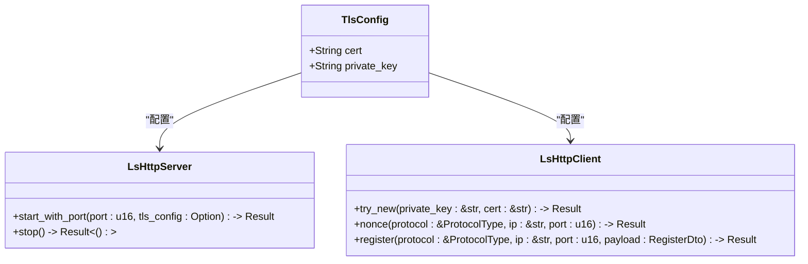
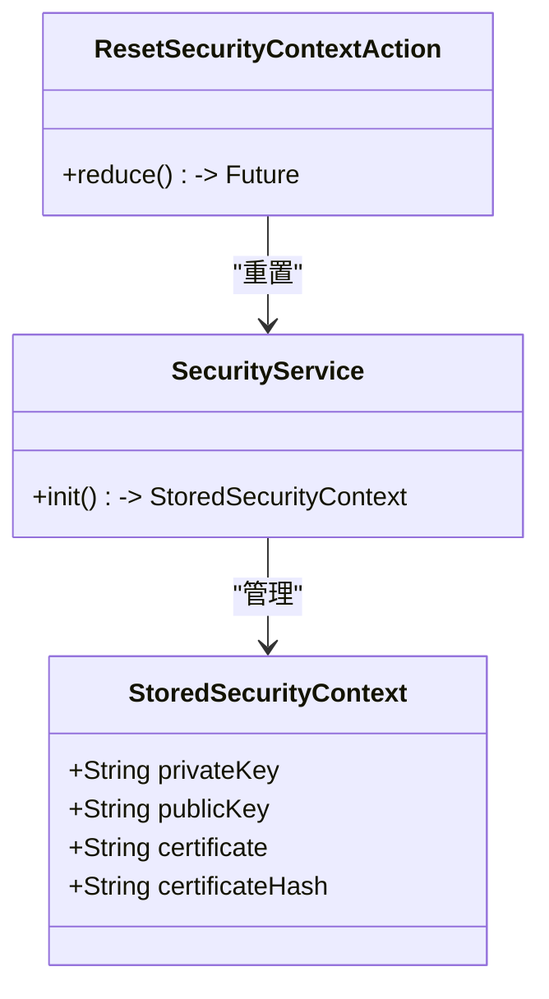
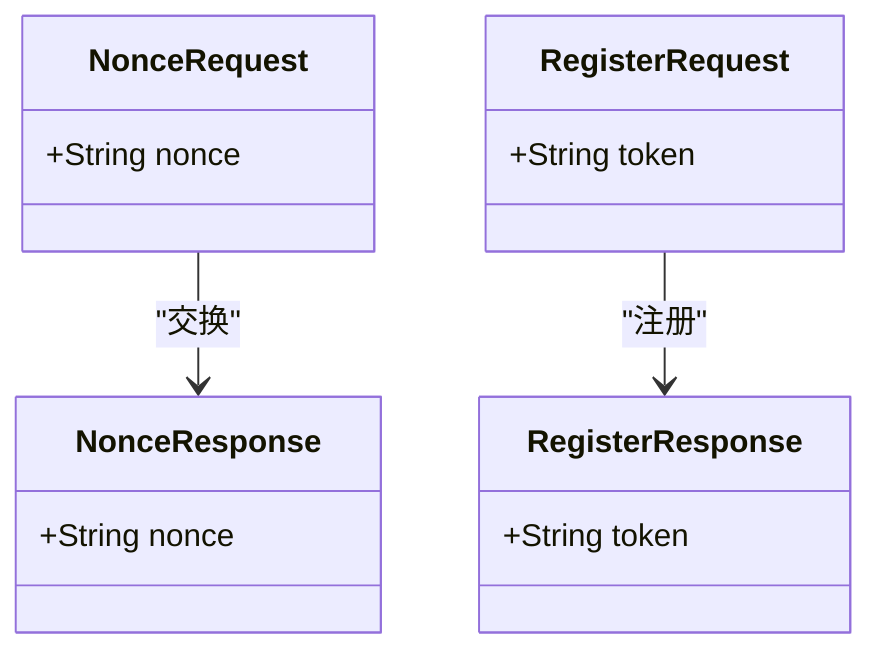
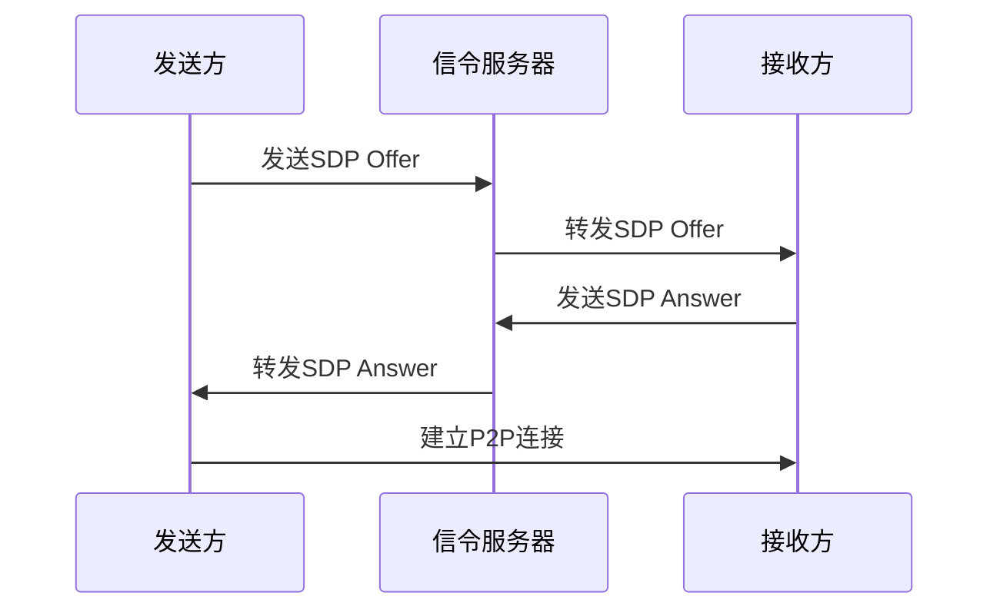
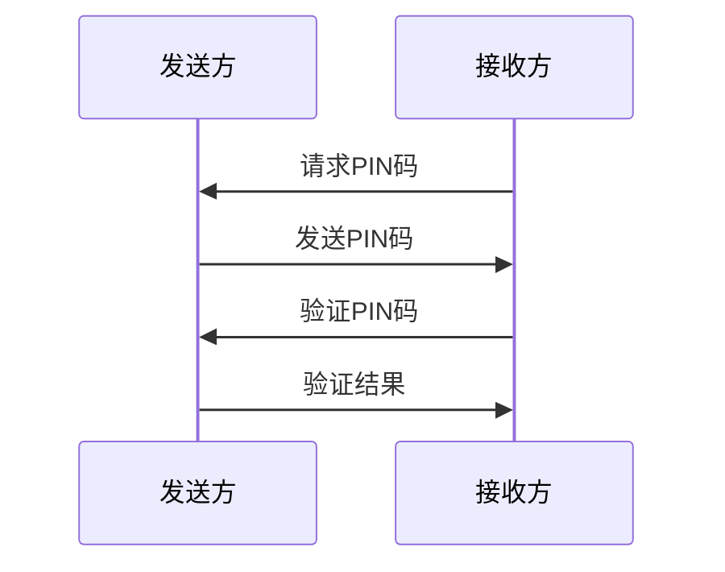
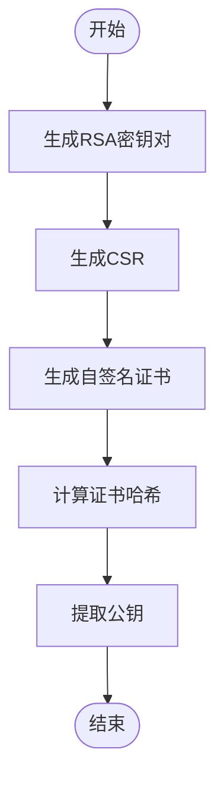
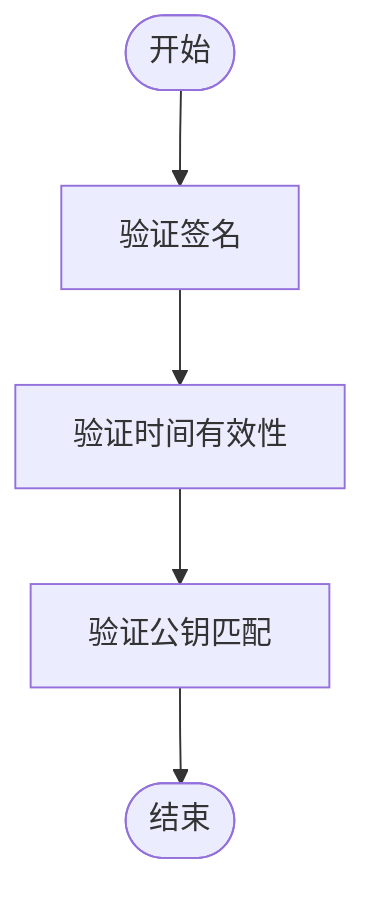
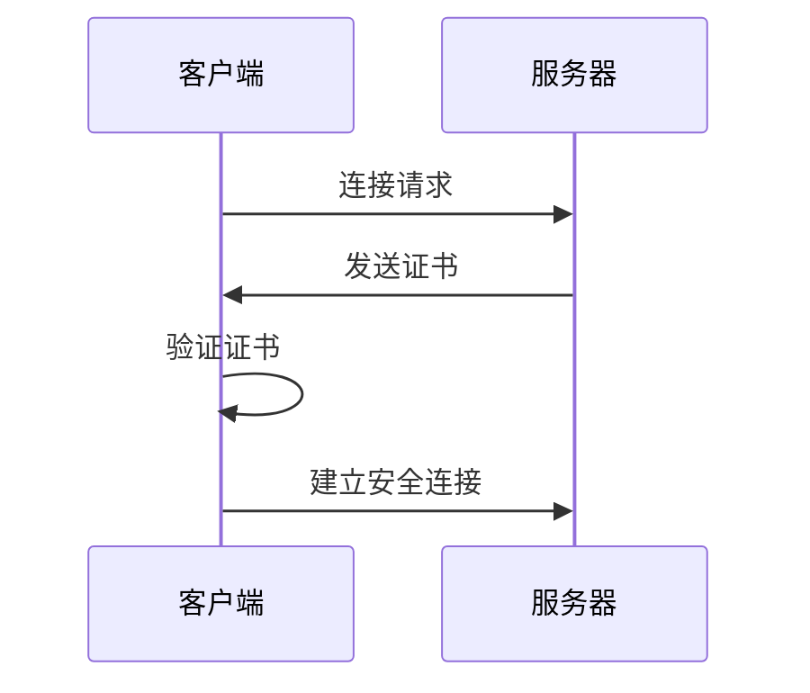
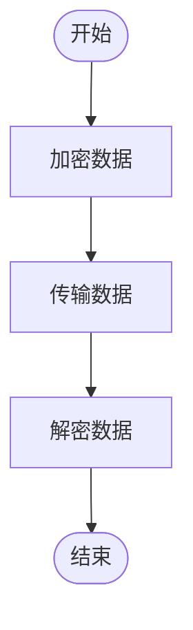
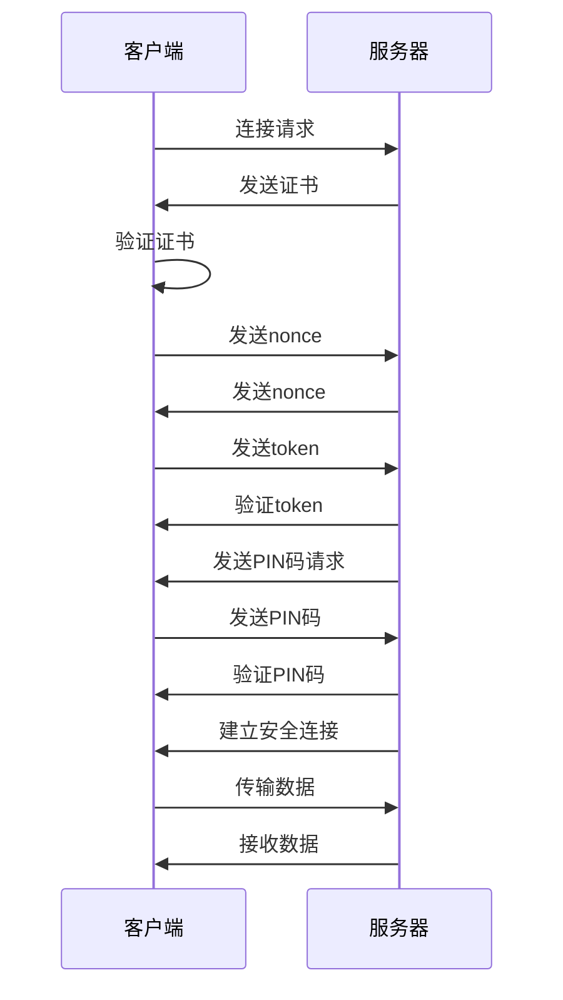

# 安全性设计

<cite>
**本文档中引用的文件**  
- [cert.rs](file://core/src/crypto/cert.rs)
- [token.rs](file://core/src/crypto/token.rs)
- [nonce.rs](file://core/src/crypto/nonce.rs)
- [mod.rs](file://core/src/crypto/mod.rs)
- [security_provider.dart](file://app/lib/provider/security_provider.dart)
- [security_helper.dart](file://app/lib/util/security_helper.dart)
- [server/mod.rs](file://core/src/http/server/mod.rs)
- [client/mod.rs](file://core/src/http/client/mod.rs)
- [client_cert_verifier.rs](file://core/src/http/server/client_cert_verifier.rs)
- [webrtc.rs](file://core/src/webrtc/webrtc.rs)
- [pin_dialog.dart](file://app/lib/widget/dialogs/pin_dialog.dart)
</cite>

## 目录
1. [引言](#引言)
2. [加密机制](#加密机制)
3. [身份验证流程](#身份验证流程)
4. [HTTPS通信实现](#https通信实现)
5. [数据传输安全措施](#数据传输安全措施)
6. [安全通信流程时序图](#安全通信流程时序图)
7. [安全最佳实践](#安全最佳实践)
8. [安全审计指南](#安全审计指南)
9. [常见安全问题解决方案](#常见安全问题解决方案)
10. [结论](#结论)

## 引言
LocalSend 是一个本地文件传输应用，其安全性设计是确保用户数据在设备间安全传输的核心。本文档详细描述了项目的加密机制、身份验证流程、HTTPS通信实现、数据传输过程中的安全措施，以及安全最佳实践。通过深入分析代码库，本文档为开发者提供了全面的安全审计指南和常见安全问题的解决方案。

## 加密机制
LocalSend 项目采用了多种加密技术来确保数据的安全性。核心加密机制包括TLS/SSL实现、证书管理和密钥交换过程。

### TLS/SSL实现
LocalSend 使用 rustls 库来实现TLS/SSL加密。在服务器端，`create_tls_config` 函数配置了TLS接受器，使用服务器的证书和私钥来建立安全连接。客户端通过 `reqwest::Client::builder()` 配置TLS，使用服务器的证书来验证其身份。

**Diagram sources**
- [server/mod.rs](file://core/src/http/server/mod.rs#L74-L120)
- [client/mod.rs](file://core/src/http/client/mod.rs#L42-L77)

### 证书管理
LocalSend 使用自签名证书进行HTTPS通信。证书的生成和验证是通过 `security_helper.dart` 文件中的 `generateSecurityContext` 函数完成的。该函数生成一个RSA密钥对，并使用该密钥对创建一个自签名证书。

**Diagram sources**
- [security_provider.dart](file://app/lib/provider/security_provider.dart#L0-L34)
- [security_helper.dart](file://app/lib/util/security_helper.dart#L0-L71)

### 密钥交换过程
密钥交换过程通过nonce和token机制实现。服务器和客户端在建立连接时交换nonce，然后使用nonce和公钥生成token，以验证对方的身份。

**Diagram sources**
- [server/mod.rs](file://core/src/http/server/mod.rs#L235-L294)
- [client/mod.rs](file://core/src/http/client/mod.rs#L100-L150)

## 身份验证流程
LocalSend 的身份验证流程包括设备间的安全配对和PIN码验证机制。

### 设备间的安全配对
设备间的安全配对通过WebRTC实现。发送方和接收方通过信令服务器交换SDP（Session Description Protocol）信息，建立P2P连接。

**Diagram sources**
- [webrtc.rs](file://core/src/webrtc/webrtc.rs#L0-L200)

### PIN码验证机制
PIN码验证机制用于在设备间建立安全连接时进行身份验证。接收方会提示用户输入PIN码，发送方将PIN码发送给接收方进行验证。

**Diagram sources**
- [webrtc.rs](file://core/src/webrtc/webrtc.rs#L1139-L1188)
- [pin_dialog.dart](file://app/lib/widget/dialogs/pin_dialog.dart#L0-L31)

## HTTPS通信实现
LocalSend 的HTTPS通信实现包括自签名证书的生成和验证。

### 自签名证书的生成
自签名证书的生成通过 `security_helper.dart` 文件中的 `generateSecurityContext` 函数完成。该函数生成一个RSA密钥对，并使用该密钥对创建一个自签名证书。

**Diagram sources**
- [security_helper.dart](file://app/lib/util/security_helper.dart#L0-L71)

### 自签名证书的验证
自签名证书的验证通过 `cert.rs` 文件中的 `verify_cert_from_pem` 函数完成。该函数验证证书的有效性，包括签名、时间有效性和公钥匹配。

**Diagram sources**
- [cert.rs](file://core/src/crypto/cert.rs#L0-L186)

## 数据传输安全措施
LocalSend 在数据传输过程中采取了多种安全措施，以防止中间人攻击和数据泄露。

### 防止中间人攻击
LocalSend 通过使用自签名证书和公钥验证来防止中间人攻击。客户端在连接服务器时会验证服务器的证书，确保其身份的真实性。

**Diagram sources**
- [client/mod.rs](file://core/src/http/client/mod.rs#L200-L250)

### 防止数据泄露
LocalSend 通过使用TLS加密和nonce机制来防止数据泄露。所有数据在传输过程中都经过加密，确保即使数据被截获也无法被解密。

**Diagram sources**
- [client/mod.rs](file://core/src/http/client/mod.rs#L150-L200)

## 安全通信流程时序图
以下是连接建立、身份验证和数据传输的完整过程的时序图。

**Diagram sources**
- [server/mod.rs](file://core/src/http/server/mod.rs#L122-L183)
- [client/mod.rs](file://core/src/http/client/mod.rs#L100-L150)

## 安全最佳实践
LocalSend 项目遵循了多项安全最佳实践，包括证书轮换、安全配置和漏洞防护。

### 证书轮换
LocalSend 定期轮换自签名证书，以减少证书被破解的风险。证书的有效期设置为10年，但在实际使用中建议定期更新。

### 安全配置
LocalSend 使用安全的TLS配置，包括禁用不安全的协议版本和加密套件。服务器和客户端都配置为只接受有效的证书。

### 漏洞防护
LocalSend 通过使用最新的加密库和定期的安全审计来防护已知漏洞。项目依赖的库都经过严格的安全审查，确保没有已知的安全漏洞。

## 安全审计指南
为开发者提供安全审计指南，帮助他们识别和修复潜在的安全问题。

### 审计步骤
1. 检查所有加密库的版本，确保使用最新版本。
2. 审查证书生成和验证代码，确保没有逻辑漏洞。
3. 检查nonce和token机制，确保其随机性和安全性。
4. 审查PIN码验证机制，确保其防暴力破解能力。

### 常见问题
- **证书过期**：确保证书的有效期设置合理，并定期更新。
- **弱加密算法**：避免使用已知不安全的加密算法，如MD5和SHA1。
- **中间人攻击**：确保客户端正确验证服务器证书，防止中间人攻击。

## 常见安全问题解决方案
### 证书验证失败
如果客户端无法验证服务器证书，检查证书的生成过程，确保公钥匹配和签名正确。

### PIN码验证失败
如果PIN码验证失败，检查PIN码的生成和传输过程，确保没有被截获或篡改。

### 数据传输中断
如果数据传输中断，检查网络连接和TLS配置，确保连接的稳定性。

## 结论
LocalSend 项目通过综合的加密机制、身份验证流程和安全通信措施，确保了用户数据在设备间的安全传输。通过遵循安全最佳实践和定期的安全审计，项目能够有效防护各种安全威胁，为用户提供可靠的安全保障。