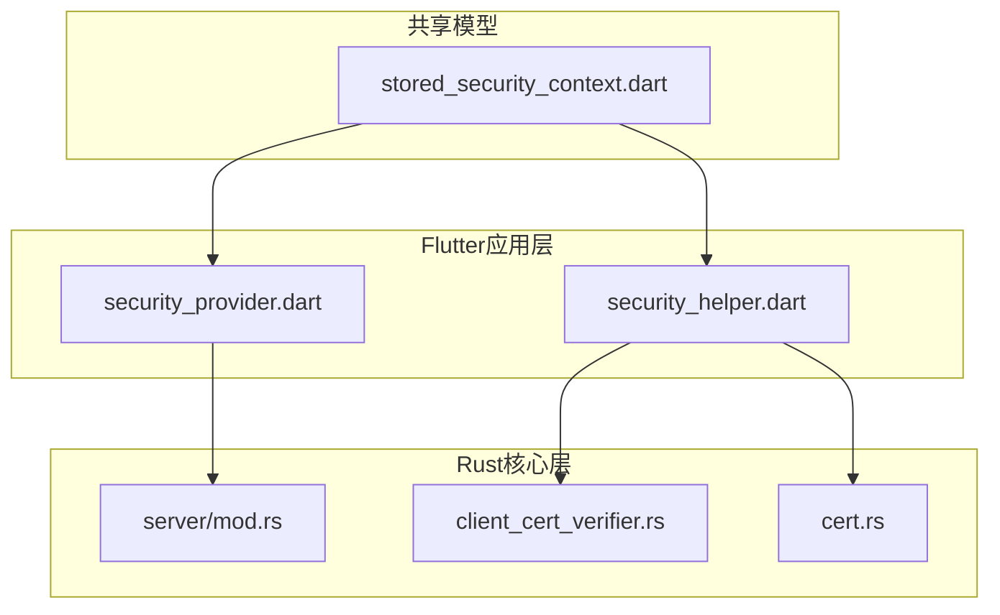
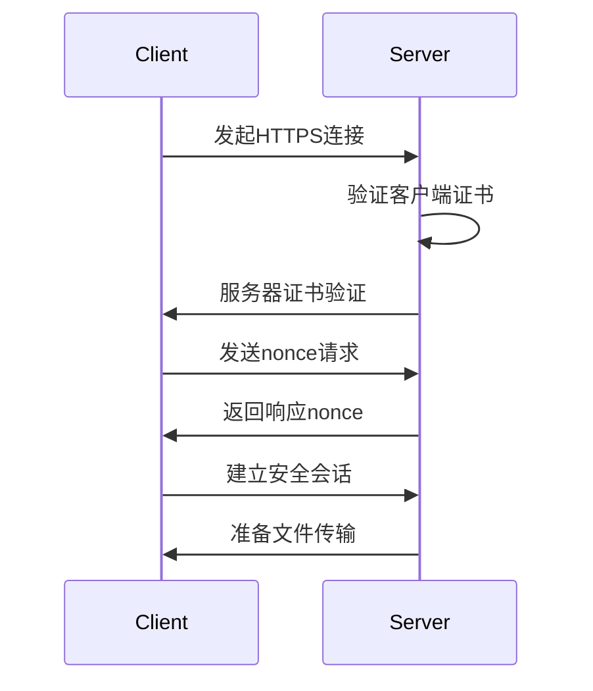
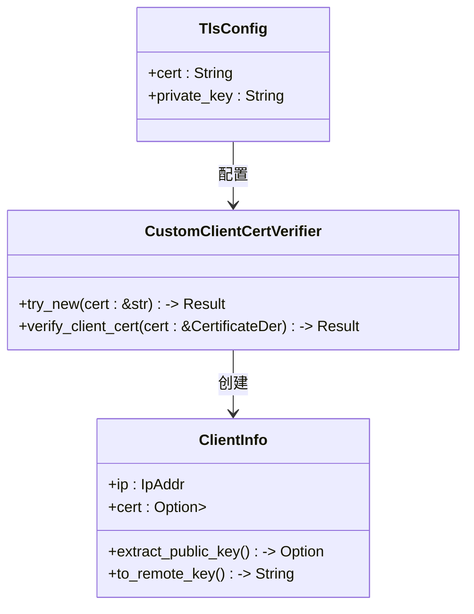
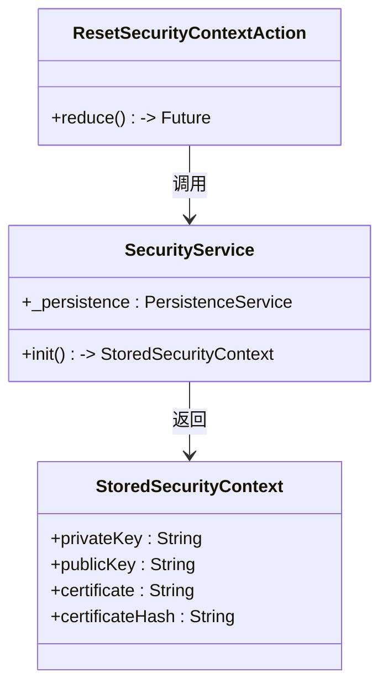
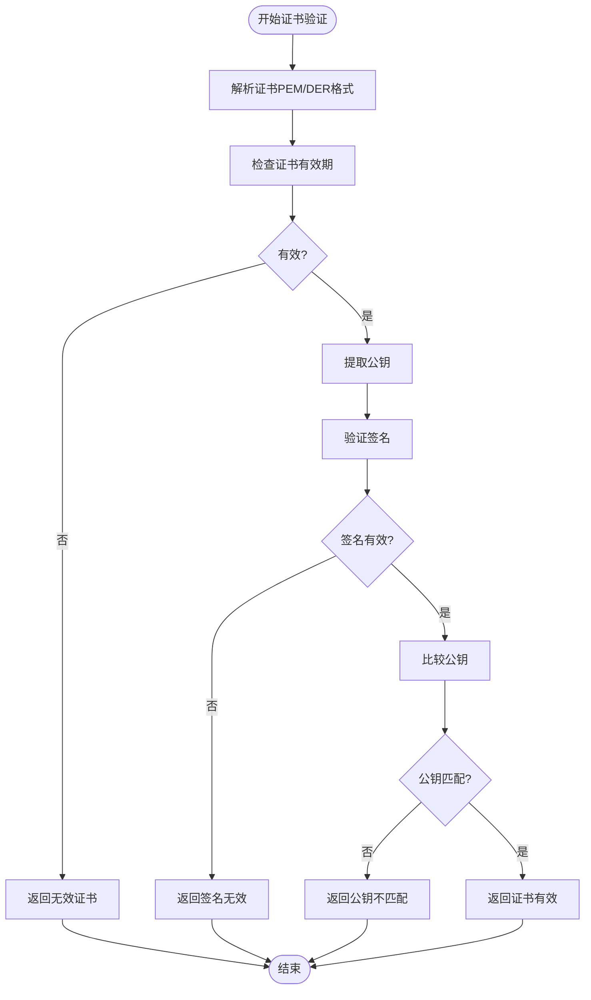
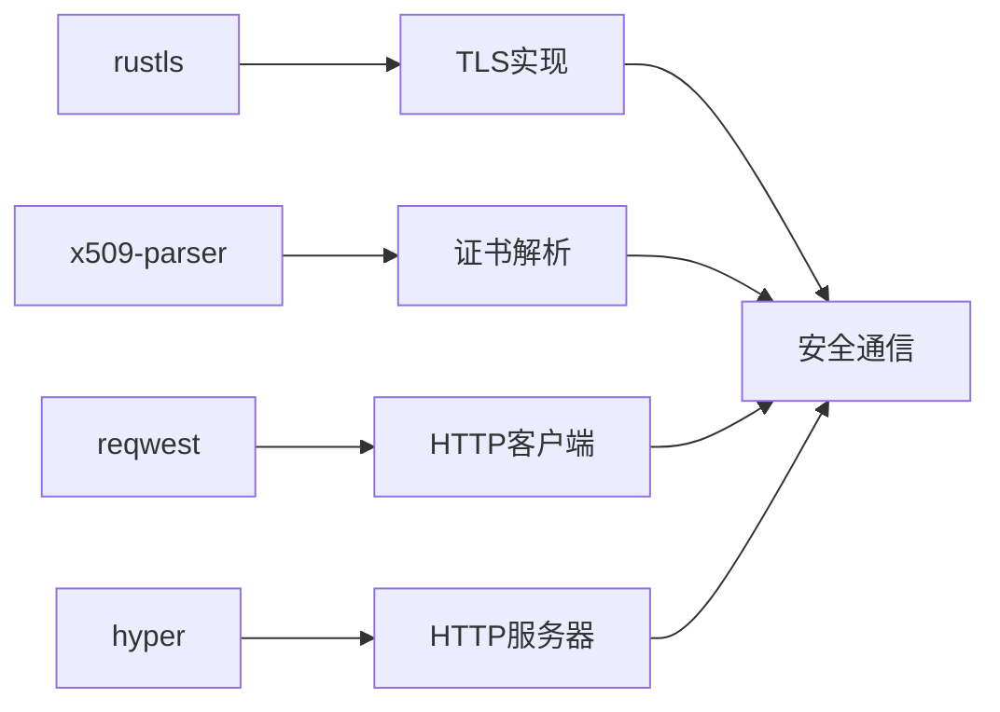

# HTTPS安全通信

<cite>
**本文档中引用的文件**  
- [mod.rs](file://core/src/http/server/mod.rs)
- [client_cert_verifier.rs](file://core/src/http/server/client_cert_verifier.rs)
- [cert.rs](file://core/src/crypto/cert.rs)
- [security_provider.dart](file://app/lib/provider/security_provider.dart)
- [security_helper.dart](file://app/lib/util/security_helper.dart)
- [stored_security_context.dart](file://common/lib/model/stored_security_context.dart)
- [mod.rs](file://core/src/http/client/mod.rs)
</cite>

## 目录
1. [简介](#简介)
2. [项目结构](#项目结构)
3. [核心组件](#核心组件)
4. [架构概述](#架构概述)
5. [详细组件分析](#详细组件分析)
6. [依赖分析](#依赖分析)
7. [性能考虑](#性能考虑)
8. [故障排除指南](#故障排除指南)
9. [结论](#结论)

## 简介
LocalSend项目实现了基于Rust和Flutter的HTTPS安全通信机制，通过TLS 1.3协议确保设备间文件传输的安全性。系统采用自签名证书进行双向认证，结合nonce交换机制防止重放攻击。服务器端使用rustls库处理TLS握手，客户端通过reqwest发起安全连接，整个通信过程实现了端到端加密。安全上下文由StoredSecurityContext管理，包含私钥、证书和公钥等关键信息。

## 项目结构
项目采用分层架构设计，核心安全功能分布在多个模块中。Rust核心层实现底层加密和HTTP服务，Flutter应用层提供用户界面和状态管理。安全相关的代码主要位于core模块的http和crypto子模块中，而证书生成和管理功能则分布在app和common模块中。

**图源**  
- [security_provider.dart](file://app/lib/provider/security_provider.dart)
- [mod.rs](file://core/src/http/server/mod.rs)
- [stored_security_context.dart](file://common/lib/model/stored_security_context.dart)

**本节源**  
- [mod.rs](file://core/src/http/server/mod.rs)
- [security_provider.dart](file://app/lib/provider/security_provider.dart)

## 核心组件
系统的核心安全组件包括TLS配置、证书验证、密钥管理和安全上下文。服务器端通过TlsConfig结构体加载证书和私钥，使用CustomClientCertVerifier实现客户端证书验证。nonce机制用于防止重放攻击，LruCache用于存储临时密钥。安全上下文由ReduxProvider管理，确保跨组件状态一致性。

**本节源**  
- [mod.rs](file://core/src/http/server/mod.rs)
- [security_provider.dart](file://app/lib/provider/security_provider.dart)
- [stored_security_context.dart](file://common/lib/model/stored_security_context.dart)

## 架构概述
系统采用客户端-服务器架构，通过HTTPS协议进行安全通信。服务器启动时创建TLS监听器，配置客户端证书验证策略。客户端发起连接时进行双向认证，交换nonce建立安全会话。所有HTTP请求和响应都经过TLS加密，关键数据通过base64编码传输。

**图源**  
- [mod.rs](file://core/src/http/server/mod.rs)
- [mod.rs](file://core/src/http/client/mod.rs)

## 详细组件分析

### TLS配置与证书管理
服务器端TLS配置通过TlsConfig结构体实现，包含证书和私钥的PEM格式字符串。系统使用rustls库创建TLS接受器，配置客户端证书验证策略。证书验证器CustomClientCertVerifier确保只有持有有效证书的客户端才能建立连接。

**图源**  
- [mod.rs](file://core/src/http/server/mod.rs)
- [client_cert_verifier.rs](file://core/src/http/server/client_cert_verifier.rs)

### 安全上下文与密钥管理
安全上下文由StoredSecurityContext类管理，包含私钥、公钥、证书和证书哈希。系统通过security_provider提供全局状态管理，使用Redux模式确保状态一致性。密钥对通过generateSecurityContext函数生成，采用RSA 2048位加密算法。

**图源**  
- [stored_security_context.dart](file://common/lib/model/stored_security_context.dart)
- [security_provider.dart](file://app/lib/provider/security_provider.dart)

### 证书验证与安全通信
证书验证通过cert.rs模块实现，支持PEM和DER格式的证书验证。系统验证证书的有效性、签名和公钥匹配性。客户端通过verifyCertificate函数验证服务器证书，服务器通过CustomClientCertVerifier验证客户端证书，实现双向认证。

**图源**  
- [cert.rs](file://core/src/crypto/cert.rs)
- [security_helper.dart](file://app/lib/util/security_helper.dart)

**本节源**  
- [mod.rs](file://core/src/http/server/mod.rs)
- [client_cert_verifier.rs](file://core/src/http/server/client_cert_verifier.rs)
- [cert.rs](file://core/src/crypto/cert.rs)
- [security_provider.dart](file://app/lib/provider/security_provider.dart)
- [security_helper.dart](file://app/lib/util/security_helper.dart)

## 依赖分析
系统依赖多个Rust和Dart库来实现安全通信功能。核心依赖包括rustls用于TLS实现，x509-parser用于证书解析，reqwest用于HTTP客户端，hyper用于HTTP服务器。这些库共同构建了安全的通信基础。

**图源**  
- [mod.rs](file://core/src/http/server/mod.rs)
- [mod.rs](file://core/src/http/client/mod.rs)

**本节源**  
- [mod.rs](file://core/src/http/server/mod.rs)
- [mod.rs](file://core/src/http/client/mod.rs)

## 性能考虑
系统通过LruCache实现nonce的高效存储和检索，设置最大容量为200个条目。TLS握手过程采用异步非阻塞模式，提高并发处理能力。证书验证结果不缓存，每次连接都进行完整验证，确保安全性。

**本节源**  
- [mod.rs](file://core/src/http/server/mod.rs)

## 故障排除指南
常见问题包括证书验证失败、TLS握手错误和连接超时。证书验证失败可能由于证书过期、签名无效或公钥不匹配。TLS握手错误通常由协议版本不兼容或密码套件不匹配引起。连接超时可能是网络问题或防火墙阻止。

**本节源**  
- [mod.rs](file://core/src/http/server/mod.rs)
- [client_cert_verifier.rs](file://core/src/http/server/client_cert_verifier.rs)

## 结论
LocalSend项目通过Rust和Flutter的结合，实现了安全可靠的HTTPS通信。系统采用自签名证书和双向认证机制，确保通信双方的身份可信。nonce交换机制有效防止重放攻击，LruCache优化了密钥存储性能。整体架构清晰，安全性高，适合局域网设备间的安全文件传输。