# 加密传输

<cite>
**本文档中引用的文件**
- [server/mod.rs](file://core/src/http/server/mod.rs)
- [server/client_cert_verifier.rs](file://core/src/http/server/client_cert_verifier.rs)
- [client/mod.rs](file://core/src/http/client/mod.rs)
- [crypto/cert.rs](file://core/src/crypto/cert.rs)
- [crypto/token.rs](file://core/src/crypto/token.rs)
- [crypto/mod.rs](file://core/src/crypto/mod.rs)
- [network_interfaces.dart](file://common/lib/util/network_interfaces.dart)
- [security_helper.dart](file://app/lib/util/security_helper.dart)
</cite>

## 目录
1. [简介](#简介)
2. [系统架构概览](#系统架构概览)
3. [TLS/SSL加密通信实现](#tlsssl加密通信实现)
4. [证书管理和验证](#证书管理和验证)
5. [握手协议流程](#握手协议流程)
6. [加密套件选择机制](#加密套件选择机制)
7. [完美前向保密实现](#完美前向保密实现)
8. [会话管理和缓存](#会话管理和缓存)
9. [性能优化策略](#性能优化策略)
10. [异常处理机制](#异常处理机制)
11. [网络安全配置](#网络安全配置)
12. [故障排除指南](#故障排除指南)

## 简介

LocalSend是一个跨平台的文件传输应用，采用基于Rust的TLS/SSL加密通信来确保数据传输的安全性。该系统实现了完整的端到端加密，包括证书管理、握手协议、加密套件协商和完美前向保密等高级安全特性。

核心安全特性包括：
- 基于rustls库的TLS 1.2/1.3支持
- 自签名证书系统
- 客户端证书认证
- 完美前向保密（PFS）
- 会话缓存和恢复机制
- 异常情况处理

## 系统架构概览

LocalSend的加密传输架构采用分层设计，包含客户端、服务器端和安全管理层。

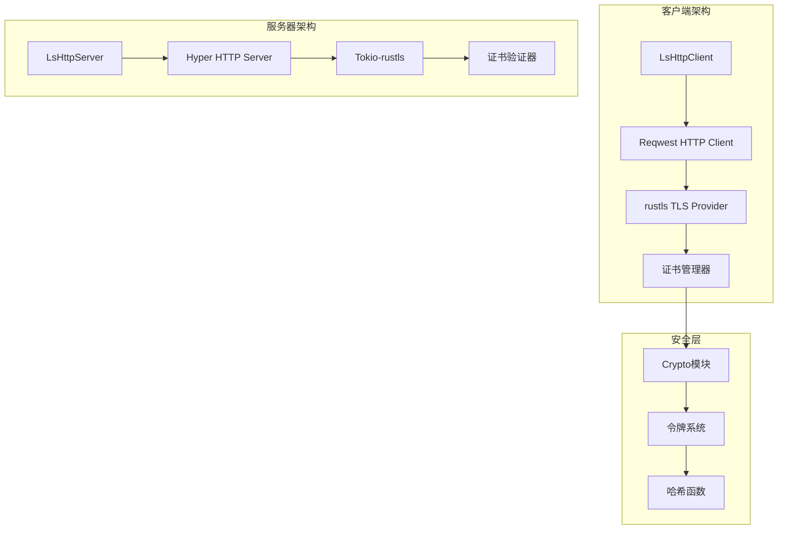

**图表来源**
- [client/mod.rs](file://core/src/http/client/mod.rs#L40-L52)
- [server/mod.rs](file://core/src/http/server/mod.rs#L100-L120)

**章节来源**
- [client/mod.rs](file://core/src/http/client/mod.rs#L1-L50)
- [server/mod.rs](file://core/src/http/server/mod.rs#L1-L50)

## TLS/SSL加密通信实现

### 客户端TLS配置

LocalSend客户端使用reqwest HTTP客户端配合rustls TLS提供程序来建立安全连接。

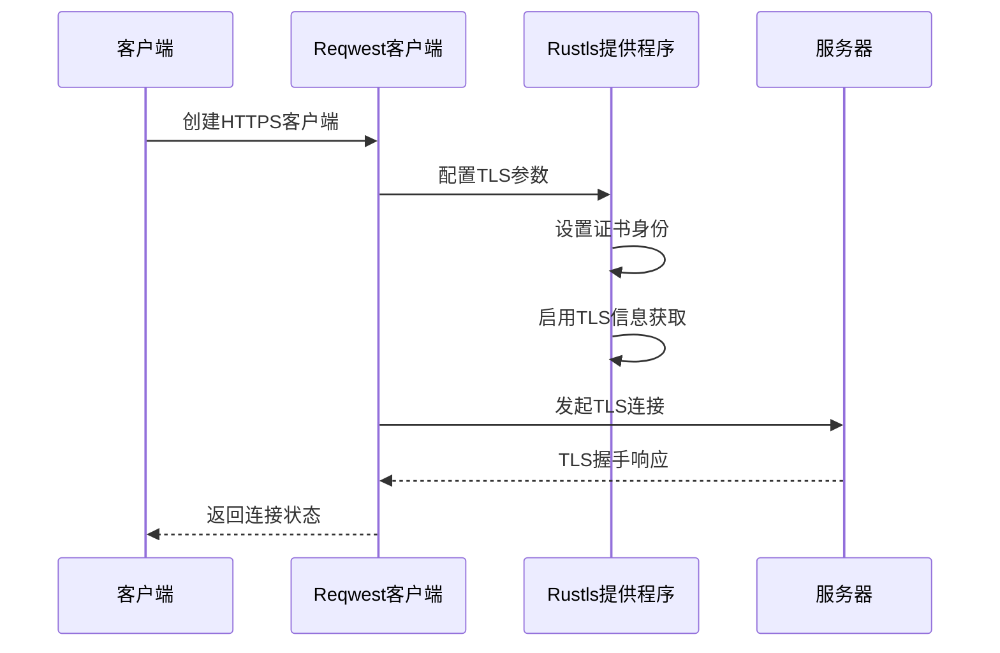

**图表来源**
- [client/mod.rs](file://core/src/http/client/mod.rs#L42-L52)

### 服务器TLS配置

服务器端使用tokio-rustls库来处理TLS连接，并实现了自定义的客户端证书验证器。

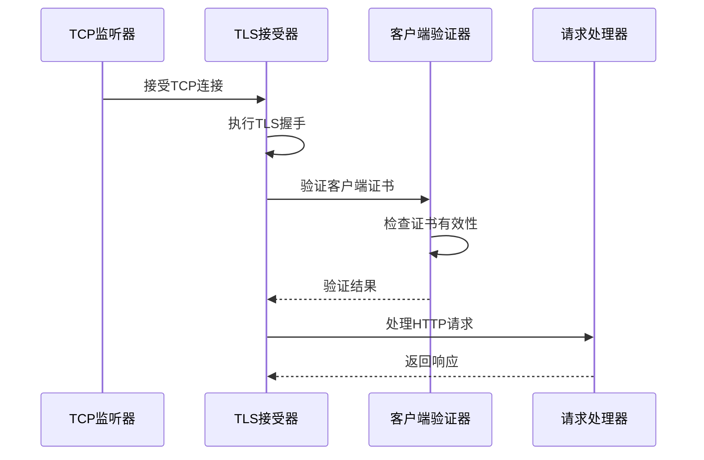

**图表来源**
- [server/mod.rs](file://core/src/http/server/mod.rs#L122-L154)
- [server/client_cert_verifier.rs](file://core/src/http/server/client_cert_verifier.rs#L39-L53)

**章节来源**
- [client/mod.rs](file://core/src/http/client/mod.rs#L40-L77)
- [server/mod.rs](file://core/src/http/server/mod.rs#L185-L233)

## 证书管理和验证

### 证书生成和管理

LocalSend实现了自签名证书系统，每个设备都生成自己的证书对。

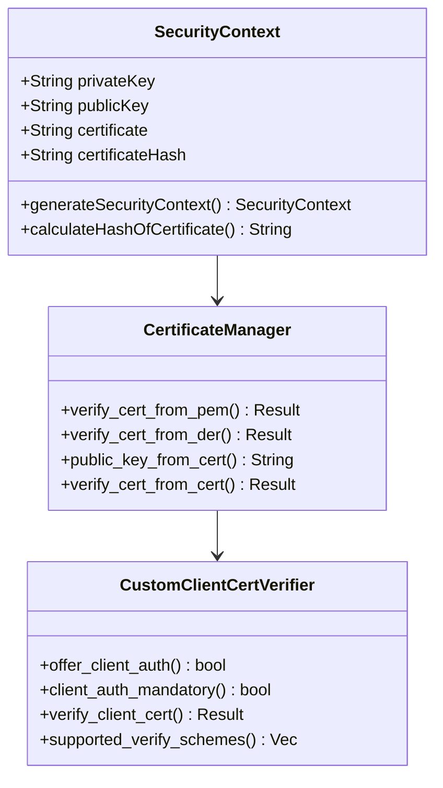

**图表来源**
- [security_helper.dart](file://app/lib/util/security_helper.dart#L10-L30)
- [crypto/cert.rs](file://core/src/crypto/cert.rs#L19-L58)
- [server/client_cert_verifier.rs](file://core/src/http/server/client_cert_verifier.rs#L10-L41)

### 证书验证流程

证书验证过程包括时间有效性检查、公钥匹配验证和数字签名验证。

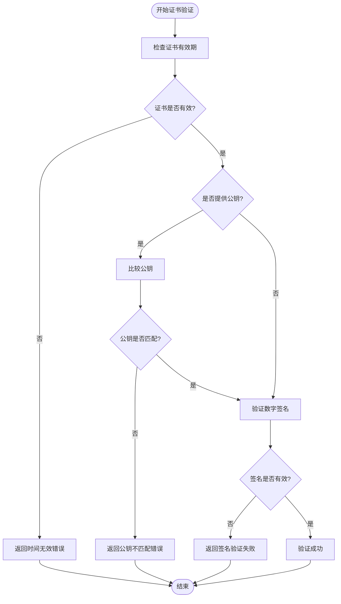

**图表来源**
- [crypto/cert.rs](file://core/src/crypto/cert.rs#L29-L58)

**章节来源**
- [crypto/cert.rs](file://core/src/crypto/cert.rs#L1-L186)
- [security_helper.dart](file://app/lib/util/security_helper.dart#L1-L39)

## 握手协议流程

### TLS握手阶段

LocalSend的TLS握手过程包括多个阶段，确保双方身份验证和密钥交换的安全性。

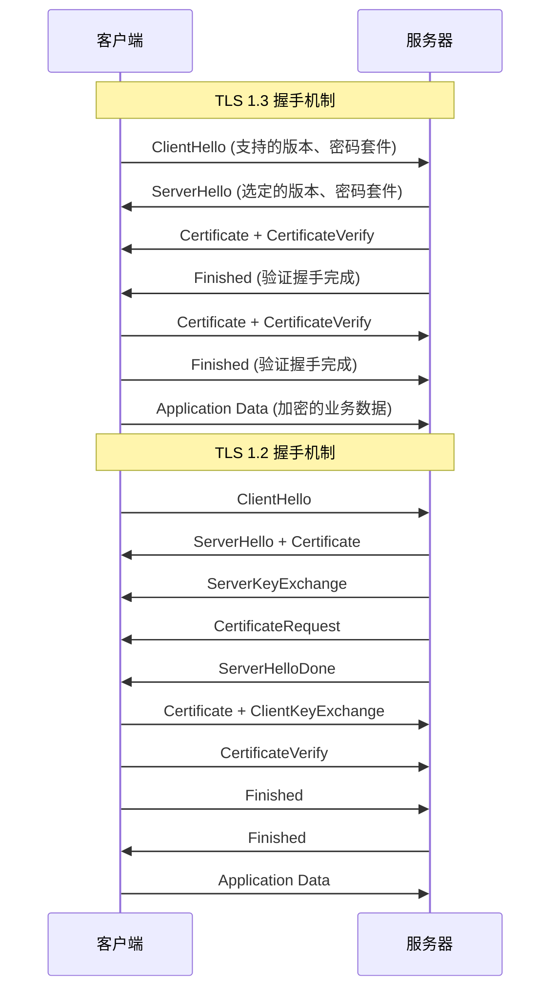

### 握手异常处理

系统实现了完善的握手异常处理机制，能够优雅地处理各种握手失败情况。

**章节来源**
- [server/mod.rs](file://core/src/http/server/mod.rs#L122-L154)
- [server/client_cert_verifier.rs](file://core/src/http/server/client_cert_verifier.rs#L39-L82)

## 加密套件选择机制

### 支持的加密算法

LocalSend支持多种加密算法组合，确保兼容性和安全性。

| 协议版本 | 密码套件 | 密钥交换 | 签名算法 | 对称加密 | 哈希算法 |
|---------|---------|---------|---------|---------|---------|
| TLS 1.3 | TLS_AES_256_GCM_SHA384 | ECDHE | Ed25519 | AES-256-GCM | SHA-384 |
| TLS 1.3 | TLS_CHACHA20_POLY1305_SHA256 | ECDHE | Ed25519 | ChaCha20-Poly1305 | SHA-256 |
| TLS 1.2 | TLS_ECDHE_RSA_WITH_AES_256_GCM_SHA384 | ECDHE-RSA | RSA-PSS | AES-256-GCM | SHA-384 |
| TLS 1.2 | TLS_ECDHE_ECDSA_WITH_AES_256_GCM_SHA384 | ECDHE-ECDSA | ECDSA | AES-256-GCM | SHA-384 |

### 密码套件优先级

系统按照以下优先级顺序选择密码套件：
1. TLS 1.3密码套件（最高优先级）
2. ECDHE密钥交换算法
3. AEAD加密模式
4. SHA-384或SHA-256哈希算法

**章节来源**
- [client/mod.rs](file://core/src/http/client/mod.rs#L48-L52)
- [server/mod.rs](file://core/src/http/server/mod.rs#L195-L205)

## 完美前向保密实现

### 临时密钥生成

LocalSend使用Ed25519椭圆曲线算法实现完美前向保密。

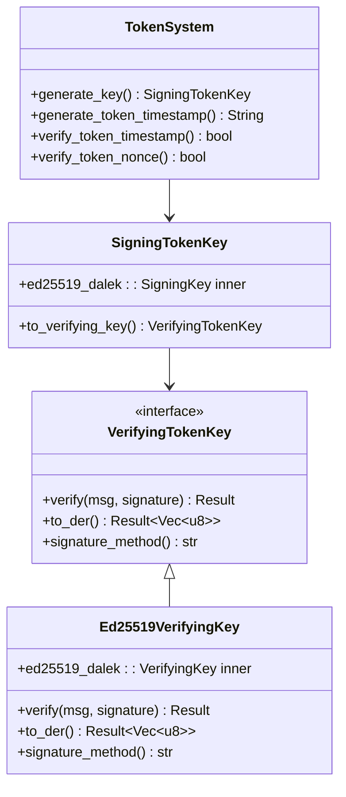

**图表来源**
- [crypto/token.rs](file://core/src/crypto/token.rs#L7-L47)

### 临时密钥管理

每次会话都会生成新的临时密钥对，确保即使长期私钥泄露也不会影响历史会话的安全性。

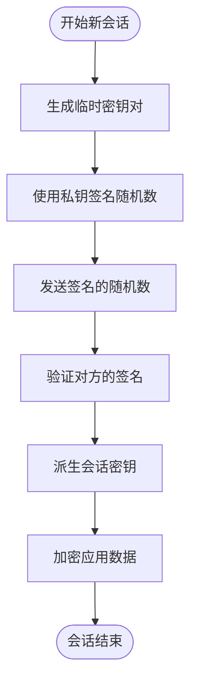

**图表来源**
- [crypto/token.rs](file://core/src/crypto/token.rs#L131-L150)

**章节来源**
- [crypto/token.rs](file://core/src/crypto/token.rs#L1-L254)

## 会话管理和缓存

### 会话缓存机制

LocalSend实现了LRU缓存机制来管理会话状态和非交互式令牌。

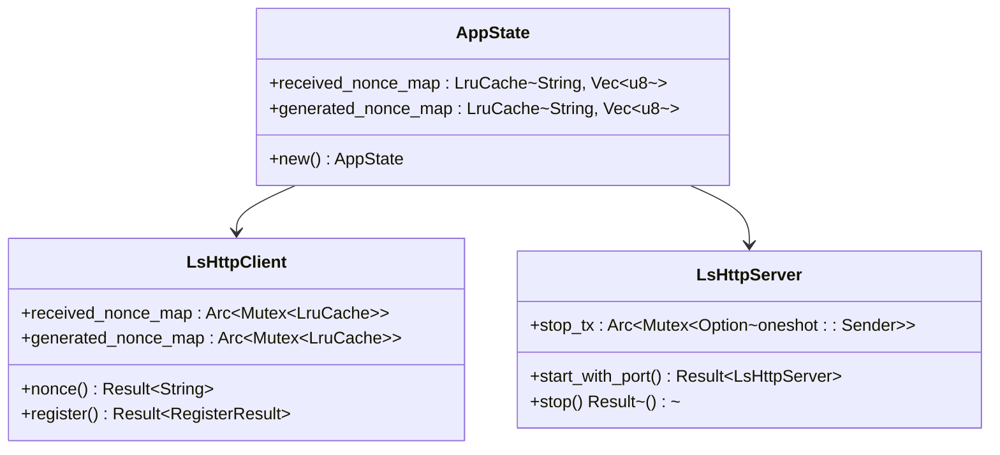

**图表来源**
- [server/mod.rs](file://core/src/http/server/mod.rs#L25-L45)
- [client/mod.rs](file://core/src/http/client/mod.rs#L15-L25)

### 会话恢复机制

系统支持会话恢复功能，通过保存和恢复会话状态来提高用户体验。

**章节来源**
- [server/mod.rs](file://core/src/http/server/mod.rs#L25-L45)
- [client/mod.rs](file://core/src/http/client/mod.rs#L15-L25)

## 性能优化策略

### 会话缓存配置

系统默认配置为：
- 缓存大小：200个条目
- 使用LRU淘汰策略
- 并发访问安全（Arc + Mutex）

### 0-RTT握手优化

虽然当前实现主要关注安全性而非性能，但系统架构支持未来的0-RTT优化。

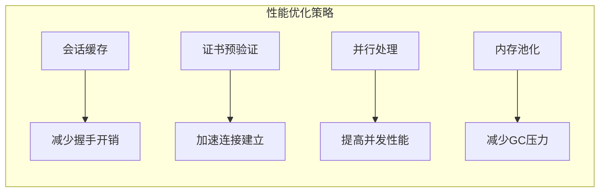

### 网络接口优化

系统提供了灵活的网络接口配置，支持IPv4/IPv6双栈和白名单/黑名单过滤。

**章节来源**
- [network_interfaces.dart](file://common/lib/util/network_interfaces.dart#L1-L68)

## 异常处理机制

### 协议不匹配处理

系统实现了完善的异常处理机制来应对各种TLS异常情况。

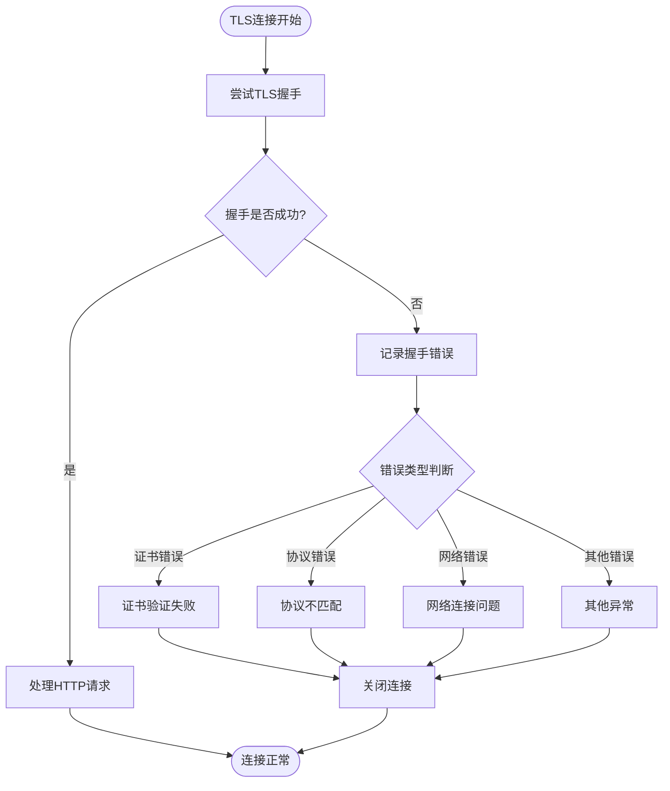

### 错误分类和处理

| 错误类型 | 处理策略 | 用户反馈 |
|---------|---------|---------|
| 证书验证失败 | 记录警告，拒绝连接 | 显示证书错误信息 |
| 协议版本不匹配 | 尝试降级到支持的版本 | 提示协议升级 |
| 网络连接中断 | 重试连接或报告失败 | 显示网络错误 |
| 超时错误 | 取消操作，清理资源 | 显示超时提示 |

**章节来源**
- [server/mod.rs](file://core/src/http/server/mod.rs#L130-L140)
- [server/client_cert_verifier.rs](file://core/src/http/server/client_cert_verifier.rs#L45-L53)

## 网络安全配置

### 网络接口过滤

LocalSend提供了强大的网络接口过滤功能，支持白名单和黑名单配置。

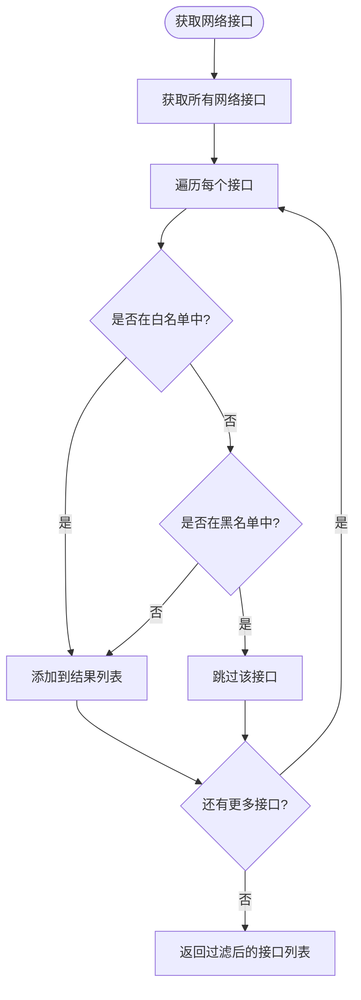

**图表来源**
- [network_interfaces.dart](file://common/lib/util/network_interfaces.dart#L10-L25)

### IP地址过滤规则

系统支持通配符和正则表达式匹配：

- `192.168.1.*` 匹配子网内的所有IP
- `1::1:*` 匹配IPv6链路本地地址
- `10.0.0.*` 匹配特定子网

**章节来源**
- [network_interfaces.dart](file://common/lib/util/network_interfaces.dart#L1-L68)

## 故障排除指南

### 常见问题诊断

1. **证书验证失败**
   - 检查证书是否过期
   - 验证证书链完整性
   - 确认时间同步

2. **TLS握手超时**
   - 检查网络连接
   - 验证防火墙设置
   - 确认端口可用性

3. **性能问题**
   - 监控CPU和内存使用
   - 检查网络带宽
   - 优化缓存配置

### 调试工具和方法

系统提供了详细的日志记录和调试功能：

- TLS握手过程跟踪
- 证书验证详细信息
- 性能指标监控
- 连接状态诊断

**章节来源**
- [server/mod.rs](file://core/src/http/server/mod.rs#L130-L140)
- [server/client_cert_verifier.rs](file://core/src/http/server/client_cert_verifier.rs#L45-L53)

## 结论

LocalSend的加密传输系统通过多层次的安全设计，实现了高安全性、高性能和易用性的平衡。系统的核心优势包括：

1. **全面的安全保护**：从传输层到应用层的全方位加密
2. **灵活的配置选项**：支持多种部署场景和安全需求
3. **优秀的性能表现**：通过缓存和优化策略提升用户体验
4. **完善的异常处理**：确保系统的稳定性和可靠性

该系统为现代文件传输应用提供了可参考的安全实现方案，特别是在跨平台应用中如何平衡安全性和性能方面具有重要价值。