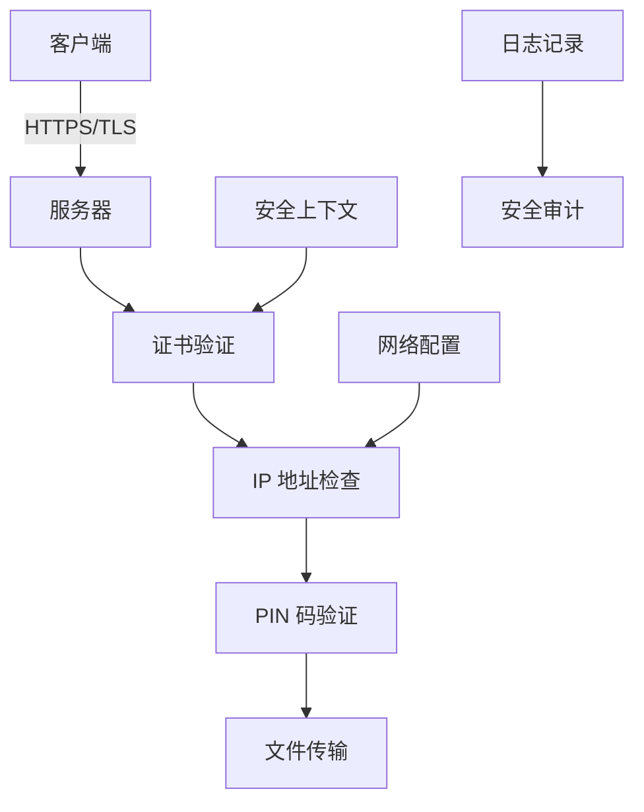
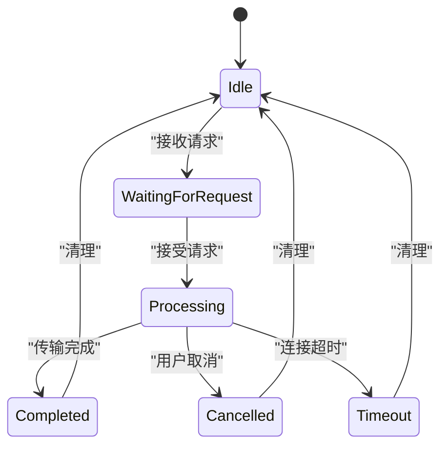

# 安全策略

<cite>
**本文档引用的文件**  
- [security_provider.dart](file://app/lib/provider/security_provider.dart)
- [security_helper.dart](file://app/lib/util/security_helper.dart)
- [server_provider.dart](file://app/lib/provider/network/server/server_provider.dart)
- [network_interfaces.dart](file://common/lib/util/network_interfaces.dart)
- [cert.rs](file://core/src/crypto/cert.rs)
- [mod.rs](file://core/src/http/client/mod.rs)
- [stored_security_context.dart](file://common/lib/model/stored_security_context.dart)
- [server_provider.dart](file://app/lib/provider/network/server/server_provider.dart)
- [common.dart](file://app/lib/provider/network/server/controller/common.dart)
- [log_entry.dart](file://app/lib/model/log_entry.dart)
</cite>

## 目录
1. [引言](#引言)
2. [安全架构概述](#安全架构概述)
3. [HTTPS与证书管理](#https与证书管理)
4. [访问控制策略](#访问控制策略)
5. [会话与身份验证](#会话与身份验证)
6. [安全日志与审计](#安全日志与审计)
7. [安全配置最佳实践](#安全配置最佳实践)
8. [结论](#结论)

## 引言

LocalSend 是一个本地文件传输应用，通过实施全面的安全策略来保护用户数据和通信安全。本文件详细阐述了应用中的各项安全措施，包括 HTTPS 加密、证书固定、IP 白名单、设备认证和安全日志记录等机制。这些安全功能共同构建了一个安全可靠的文件传输环境，防止中间人攻击（MITM）、会话劫持和其他潜在威胁。

**Section sources**
- [security_provider.dart](file://app/lib/provider/security_provider.dart#L1-L35)
- [server_provider.dart](file://app/lib/provider/network/server/server_provider.dart#L1-L259)

## 安全架构概述

LocalSend 的安全架构基于端到端加密和相互认证原则。系统使用自签名证书进行 HTTPS 通信，并通过证书固定（Certificate Pinning）机制防止中间人攻击。服务器端实施严格的访问控制，包括 IP 白名单/黑名单和 PIN 码验证。所有安全相关的数据（如私钥、证书和指纹）都存储在安全上下文中，并通过持久化机制保存。



**Diagram sources**
- [security_provider.dart](file://app/lib/provider/security_provider.dart#L1-L35)
- [server_provider.dart](file://app/lib/provider/network/server/server_provider.dart#L1-L259)
- [network_interfaces.dart](file://common/lib/util/network_interfaces.dart#L1-L69)

## HTTPS与证书管理

### 证书生成与存储

LocalSend 使用自签名证书进行 HTTPS 通信。当用户启用 HTTPS 时，系统会生成包含私钥、公钥、证书和证书指纹（SHA-256 哈希值）的安全上下文。这些信息被封装在 `StoredSecurityContext` 对象中并持久化存储。

```dart
class StoredSecurityContext with StoredSecurityContextMappable {
  final String privateKey;
  final String publicKey;
  final String certificate;
  final String certificateHash;
}
```

证书的生成过程包括：生成 RSA 密钥对、创建证书签名请求（CSR）和生成自签名证书。证书的有效期为 10 年（3650 天），确保长期可用性。

### 证书固定与验证

在客户端通信过程中，应用实施证书固定机制来防止中间人攻击。当客户端连接到服务器时，会验证服务器证书的公钥是否与预期的公钥匹配。验证过程包括检查证书的时间有效性、签名完整性和公钥一致性。

```rust
fn verify_cert_from_cert(cert: X509Certificate, public_key: Option<String>) -> anyhow::Result<()> {
    if !cert.validity.is_valid() {
        return Err(anyhow::anyhow!("Time validity error"));
    }

    if let Some(public_key) = public_key {
        let cert_public_key = cert.tbs_certificate.subject_pki.parsed()?;
        let expected_public_key = public_key_spki.parsed()?;
        
        if cert_public_key != expected_public_key {
            return Err(anyhow::anyhow!("Public key mismatch"));
        }
    }

    cert.verify_signature(None)?;
    Ok(())
}
```

### HTTPS 服务器配置

当 HTTPS 模式启用时，服务器使用 `HttpServer.bindSecure` 方法绑定到指定端口，并加载安全上下文中的私钥和证书链。这确保了所有通信都通过 TLS 加密通道进行。

```dart
if (https) {
  final securityContext = ref.read(securityProvider);
  httpServer = await HttpServer.bindSecure(
    '0.0.0.0',
    port,
    SecurityContext()
      ..usePrivateKeyBytes(securityContext.privateKey.codeUnits)
      ..useCertificateChainBytes(securityContext.certificate.codeUnits),
  );
}
```

**Section sources**
- [security_helper.dart](file://app/lib/util/security_helper.dart#L1-L72)
- [cert.rs](file://core/src/crypto/cert.rs#L1-L187)
- [server_provider.dart](file://app/lib/provider/network/server/server_provider.dart#L115-L162)

## 访问控制策略

### IP 白名单与黑名单

LocalSend 实施基于 IP 地址的访问控制策略，允许用户配置网络白名单和黑名单。系统通过正则表达式匹配 IP 地址，支持通配符（*）进行子网匹配。

```dart
bool isNetworkIgnored({
  required List<RegExp>? networkWhitelist,
  required List<RegExp>? networkBlacklist,
  required List<String> interface,
}) {
  if (networkWhitelist != null && !interface.any((a) => networkWhitelist.any((w) => w.hasMatch(a)))) {
    return true;
  }
  if (networkBlacklist != null && interface.any((a) => networkBlacklist.any((b) => b.hasMatch(a)))) {
    return true;
  }
  return false;
}
```

访问控制规则如下：
- 当白名单不为空时，只有匹配白名单规则的 IP 地址被允许访问
- 当黑名单不为空时，匹配黑名单规则的 IP 地址被拒绝访问
- 白名单优先于黑名单，即白名单中的地址即使在黑名单中也被允许

### 设备认证

除了 IP 层面的访问控制，系统还通过设备指纹进行认证。每个设备的唯一标识（fingerprint）基于其证书的 SHA-256 哈希值生成，并在设备间通信时进行验证。

```dart
final fingerprint = ref.read(securityProvider).certificateHash;
_receiveController.installRoutes(
  router: router,
  alias: alias,
  port: port,
  https: https,
  fingerprint: fingerprint,
  showToken: ref.read(settingsProvider).showToken,
);
```

**Section sources**
- [network_interfaces.dart](file://common/lib/util/network_interfaces.dart#L1-L69)
- [server_provider.dart](file://app/lib/provider/network/server/server_provider.dart#L115-L162)

## 会话与身份验证

### PIN 码验证

对于 Web 发送功能，系统支持 PIN 码验证机制。用户可以设置 6 位数字 PIN 码，接收方必须输入正确的 PIN 码才能建立连接。

```dart
Future<bool> checkPin({
  required ServerUtils server,
  required String? pin,
  required Map<String, int> pinAttempts,
  required HttpRequest request,
}) async {
  if (pin != null) {
    final attempts = pinAttempts[request.ip] ?? 0;
    if (attempts >= 3) {
      await request.respondJson(429, message: 'Too many attempts.');
      return false;
    }

    final requestPin = request.uri.queryParameters['pin'];
    if (requestPin != pin) {
      if (requestPin?.isNotEmpty ?? false) {
        pinAttempts[request.ip] = attempts + 1;
        
        if (attempts == 2) {
          await request.respondJson(429, message: 'Too many attempts.');
          return false;
        }
      }
      await request.respondJson(401, message: 'Invalid pin.');
      return false;
    }
  }
  return true;
}
```

PIN 码验证具有以下安全特性：
- 每个 IP 地址最多允许 3 次尝试
- 第 3 次失败后返回 429 状态码（请求过多）
- 使用内存映射跟踪每个 IP 的尝试次数

### 会话管理

系统维护活动会话状态，包括会话 ID、IP 地址和响应处理器。会话在以下情况下被清除：
- 文件传输完成
- 用户手动取消
- 连接超时
- 服务器停止



**Diagram sources**
- [common.dart](file://app/lib/provider/network/server/controller/common.dart#L1-L37)
- [server_provider.dart](file://app/lib/provider/network/server/server_provider.dart#L1-L259)

## 安全日志与审计

### 日志记录机制

LocalSend 实施详细的日志记录机制，用于安全审计和故障排查。所有关键操作都被记录，包括服务器启动/停止、连接尝试和文件传输事件。

```dart
class LogEntry with LogEntryMappable {
  final DateTime timestamp;
  final String log;
}
```

日志条目包含时间戳和描述性消息，便于追踪事件序列。系统使用标准的 Dart `logging` 包进行日志输出，支持不同级别的日志记录（INFO、WARNING、ERROR 等）。

### 异常行为检测

通过分析日志数据，系统可以检测潜在的异常行为：
- 频繁的连接尝试可能表明暴力破解攻击
- 来自黑名单 IP 的访问尝试
- 异常的文件传输模式
- 未知设备的连接请求

调试界面提供了安全调试页面，允许开发者查看当前的安全上下文，包括证书、私钥和公钥信息。

```dart
class SecurityDebugPage extends StatelessWidget {
  @override
  Widget build(BuildContext context) {
    final securityContext = context.ref.watch(securityProvider);
    return Scaffold(
      body: ResponsiveListView(
        children: [
          DebugEntry(
            name: 'Certificate SHA-256 (fingerprint)',
            value: securityContext.certificateHash,
          ),
          DebugEntry(
            name: 'Certificate',
            value: securityContext.certificate,
          ),
          DebugEntry(
            name: 'Private Key',
            value: securityContext.privateKey,
          ),
          DebugEntry(
            name: 'Public Key',
            value: securityContext.publicKey,
          ),
        ],
      ),
    );
  }
}
```

**Section sources**
- [log_entry.dart](file://app/lib/model/log_entry.dart#L1-L20)
- [security_debug_page.dart](file://app/lib/pages/debug/security_debug_page.dart#L1-L47)

## 安全配置最佳实践

### 最小权限原则

LocalSend 遵循最小权限原则，确保每个组件只拥有完成其功能所需的最低权限：
- 服务器绑定到特定端口而非特权端口（<1024）
- 文件访问限制在用户指定的目录内
- 网络访问限制在本地网络范围内
- 敏感数据（私钥）从不通过网络传输

### 安全配置建议

1. **启用 HTTPS**：始终使用 HTTPS 模式进行通信，避免明文传输
2. **配置 IP 白名单**：将访问限制在可信的本地网络子网内
3. **设置强 PIN 码**：为 Web 发送功能设置复杂的 PIN 码
4. **定期更新**：及时应用安全更新和补丁
5. **监控日志**：定期检查安全日志以发现异常活动

### 漏洞修复流程

当发现安全漏洞时，应遵循以下流程：
1. 立即发布安全公告
2. 提供临时缓解措施
3. 开发并测试修复补丁
4. 发布更新版本
5. 验证修复效果
6. 更新文档和最佳实践指南

## 结论

LocalSend 通过多层次的安全机制为本地文件传输提供了强大的安全保障。从 HTTPS 加密和证书固定到 IP 访问控制和 PIN 码验证，每个安全组件都经过精心设计和实现。系统的安全日志和审计功能进一步增强了可追溯性和异常检测能力。遵循最小权限原则和定期安全扫描的最佳实践，可以确保应用持续抵御新兴威胁，为用户提供安全可靠的文件传输体验。