# 证书管理

<cite>
**本文档中引用的文件**
- [core/src/crypto/cert.rs](file://core/src/crypto/cert.rs)
- [core/src/crypto/mod.rs](file://core/src/crypto/mod.rs)
- [core/src/crypto/token.rs](file://core/src/crypto/token.rs)
- [core/src/crypto/nonce.rs](file://core/src/crypto/nonce.rs)
- [core/src/http/server/mod.rs](file://core/src/http/server/mod.rs)
- [core/src/http/server/client_cert_verifier.rs](file://core/src/http/server/client_cert_verifier.rs)
- [core/src/http/client/mod.rs](file://core/src/http/client/mod.rs)
- [core/src/main.rs](file://core/src/main.rs)
- [common/lib/model/stored_security_context.dart](file://common/lib/model/stored_security_context.dart)
- [app/lib/util/security_helper.dart](file://app/lib/util/security_helper.dart)
- [app/lib/provider/security_provider.dart](file://app/lib/provider/security_provider.dart)
</cite>

## 目录
1. [简介](#简介)
2. [项目结构](#项目结构)
3. [核心组件](#核心组件)
4. [架构概览](#架构概览)
5. [详细组件分析](#详细组件分析)
6. [依赖关系分析](#依赖关系分析)
7. [性能考虑](#性能考虑)
8. [故障排除指南](#故障排除指南)
9. [结论](#结论)

## 简介

LocalSend是一个本地文件传输应用程序，它在本地网络环境中使用自签名证书来建立安全的通信通道。该系统实现了完整的证书管理功能，包括证书生成、验证、存储和生命周期管理。本文档详细描述了LocalSend中的证书管理系统，涵盖了从根证书创建到设备身份绑定的完整流程。

## 项目结构

LocalSend的证书管理功能分布在多个模块中，主要集中在以下目录结构：

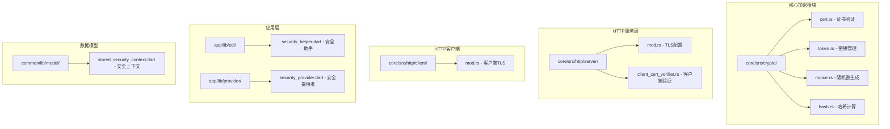

**图表来源**
- [core/src/crypto/mod.rs](file://core/src/crypto/mod.rs#L1-L5)
- [core/src/http/server/mod.rs](file://core/src/http/server/mod.rs#L1-L30)
- [core/src/http/client/mod.rs](file://core/src/http/client/mod.rs#L1-L20)

**章节来源**
- [core/src/crypto/mod.rs](file://core/src/crypto/mod.rs#L1-L5)
- [core/src/http/server/mod.rs](file://core/src/http/server/mod.rs#L1-L30)

## 核心组件

LocalSend的证书管理系统由以下核心组件构成：

### 证书验证引擎
负责验证X.509证书的有效性，包括时间有效性、签名验证和公钥匹配。

### 密钥管理系统
提供Ed25519和RSA-PSS密钥对的生成、导出和解析功能。

### TLS配置管理
管理服务器和客户端的TLS连接配置，包括证书加载和验证器设置。

### 设备身份绑定
将证书与设备身份关联，确保每个设备都有唯一的数字身份。

**章节来源**
- [core/src/crypto/cert.rs](file://core/src/crypto/cert.rs#L1-L50)
- [core/src/crypto/token.rs](file://core/src/crypto/token.rs#L1-L50)

## 架构概览

LocalSend的证书管理系统采用分层架构设计，确保了安全性、可扩展性和易维护性：

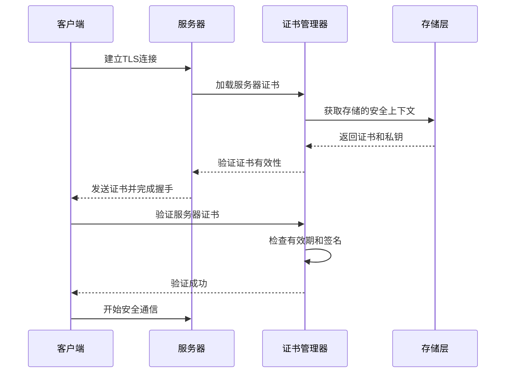

**图表来源**
- [core/src/http/server/mod.rs](file://core/src/http/server/mod.rs#L185-L233)
- [core/src/http/client/mod.rs](file://core/src/http/client/mod.rs#L42-L77)

## 详细组件分析

### 证书验证组件

证书验证是整个系统的核心安全机制，负责确保所有通信都基于有效的数字证书。

#### 证书验证流程

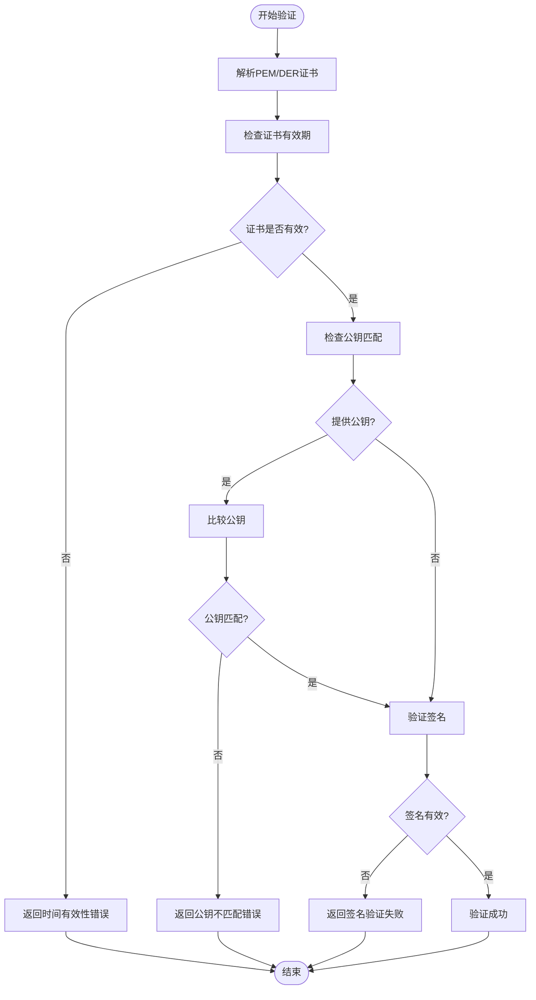

**图表来源**
- [core/src/crypto/cert.rs](file://core/src/crypto/cert.rs#L20-L45)

#### 证书序列化和反序列化

系统支持多种证书格式的转换和处理：

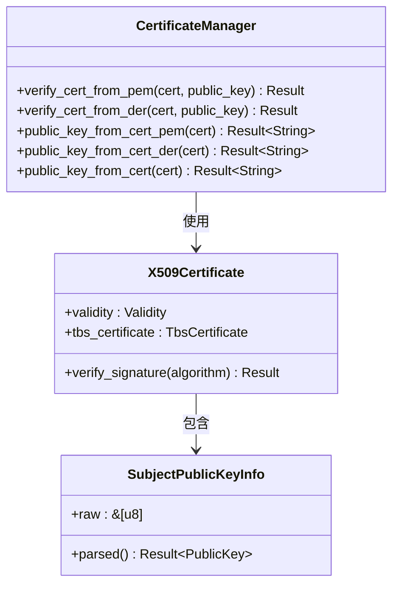

**图表来源**
- [core/src/crypto/cert.rs](file://core/src/crypto/cert.rs#L1-L50)

**章节来源**
- [core/src/crypto/cert.rs](file://core/src/crypto/cert.rs#L1-L187)

### 密钥管理系统

密钥管理系统提供了强大的加密密钥生成功能，支持Ed25519和RSA-PSS两种算法。

#### 密钥生成和管理流程

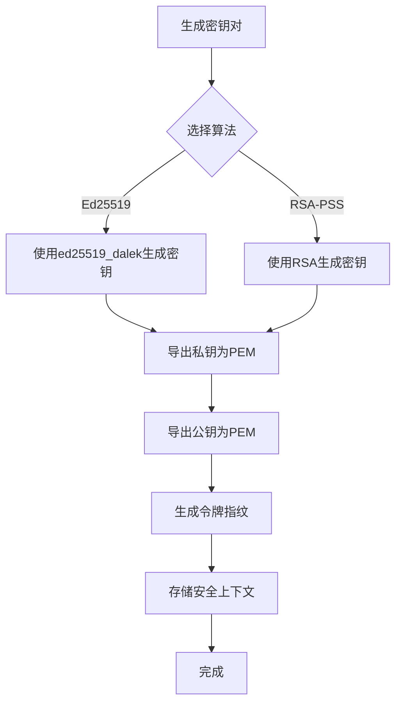

**图表来源**
- [core/src/crypto/token.rs](file://core/src/crypto/token.rs#L70-L90)

#### 令牌生成机制

系统使用基于时间戳的令牌生成机制来验证设备身份：

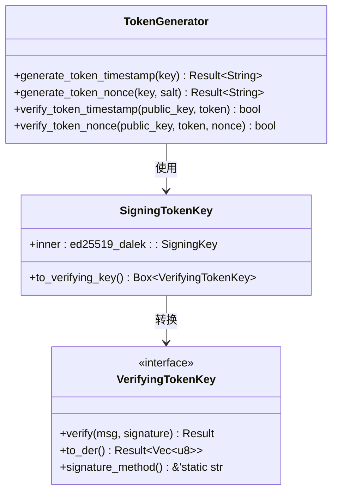

**图表来源**
- [core/src/crypto/token.rs](file://core/src/crypto/token.rs#L1-L50)

**章节来源**
- [core/src/crypto/token.rs](file://core/src/crypto/token.rs#L1-L255)

### TLS配置和连接管理

#### 服务器TLS配置

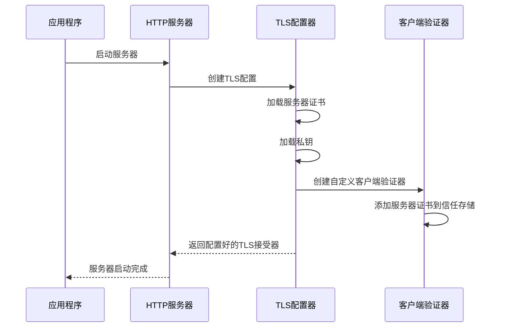

**图表来源**
- [core/src/http/server/mod.rs](file://core/src/http/server/mod.rs#L185-L200)

#### 客户端TLS配置

客户端使用相同的证书进行双向认证：

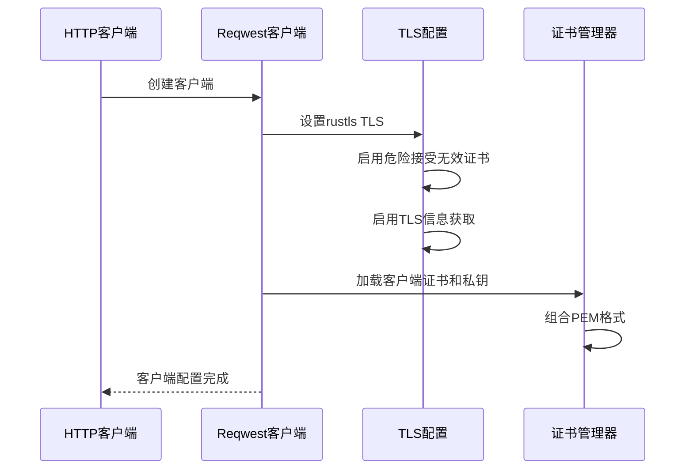

**图表来源**
- [core/src/http/client/mod.rs](file://core/src/http/client/mod.rs#L42-L55)

**章节来源**
- [core/src/http/server/mod.rs](file://core/src/http/server/mod.rs#L185-L233)
- [core/src/http/client/mod.rs](file://core/src/http/client/mod.rs#L42-L77)

### 设备身份绑定

#### 安全上下文管理

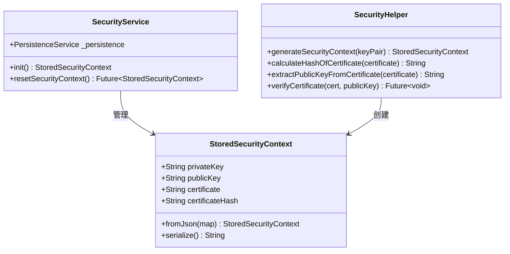

**图表来源**
- [common/lib/model/stored_security_context.dart](file://common/lib/model/stored_security_context.dart#L1-L25)
- [app/lib/provider/security_provider.dart](file://app/lib/provider/security_provider.dart#L1-L33)

#### 证书指纹验证

系统通过证书指纹来验证设备身份：

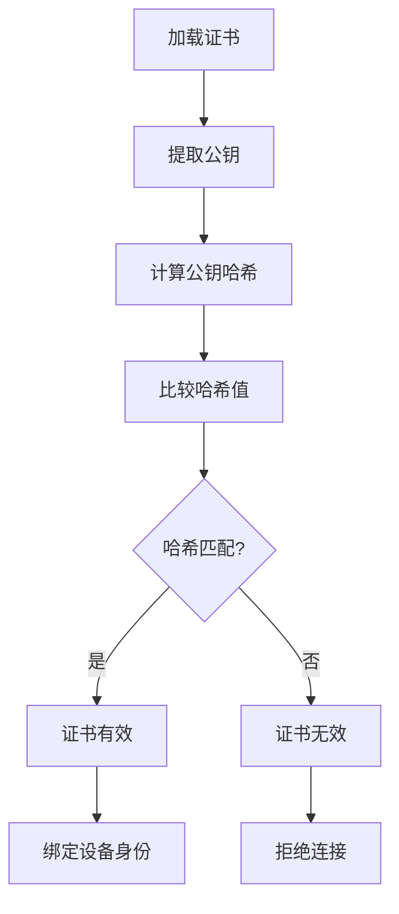

**图表来源**
- [app/lib/util/security_helper.dart](file://app/lib/util/security_helper.dart#L25-L39)

**章节来源**
- [common/lib/model/stored_security_context.dart](file://common/lib/model/stored_security_context.dart#L1-L26)
- [app/lib/util/security_helper.dart](file://app/lib/util/security_helper.dart#L1-L70)

## 依赖关系分析

LocalSend的证书管理系统具有清晰的依赖层次结构：

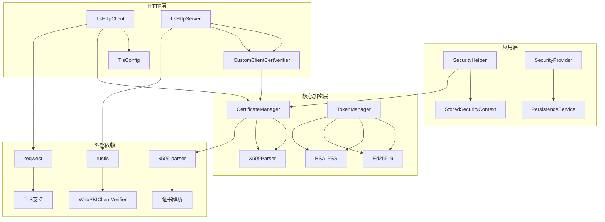

**图表来源**
- [core/src/crypto/mod.rs](file://core/src/crypto/mod.rs#L1-L5)
- [core/src/http/server/mod.rs](file://core/src/http/server/mod.rs#L1-L30)

**章节来源**
- [core/src/crypto/mod.rs](file://core/src/crypto/mod.rs#L1-L5)

## 性能考虑

### 证书缓存策略

系统实现了多级缓存机制来优化证书验证性能：

- **内存缓存**：使用LRU缓存存储最近使用的证书
- **会话缓存**：维护活跃连接的证书状态
- **指纹缓存**：缓存已验证的证书指纹以避免重复验证

### 随机数生成

非对称随机数生成使用加密安全的随机数生成器：

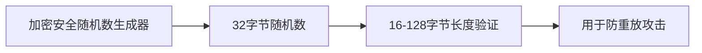

**图表来源**
- [core/src/crypto/nonce.rs](file://core/src/crypto/nonce.rs#L1-L12)

### 内存安全

系统在处理敏感数据时采用了多种内存安全措施：

- **零化敏感数据**：使用Zeroizing类型自动清理私钥
- **堆栈保护**：避免敏感数据在堆上分配
- **访问控制**：严格的权限控制防止未授权访问

## 故障排除指南

### 常见证书错误

#### 时间有效性错误
**症状**：证书显示过期或尚未生效
**原因**：证书有效期设置不当或系统时间不正确
**解决方案**：
1. 检查系统时间同步
2. 重新生成证书
3. 验证证书有效期设置

#### 公钥不匹配错误
**症状**：证书验证失败，提示公钥不匹配
**原因**：证书中的公钥与预期公钥不一致
**解决方案**：
1. 检查证书完整性
2. 验证证书生成过程
3. 重新生成密钥对

#### 签名验证失败
**症状**：证书签名验证失败
**原因**：证书被篡改或私钥不匹配
**解决方案**：
1. 重新生成证书
2. 检查私钥完整性
3. 验证证书链完整性

### 调试工具和方法

#### 证书验证测试

系统提供了完整的单元测试框架来验证证书功能：

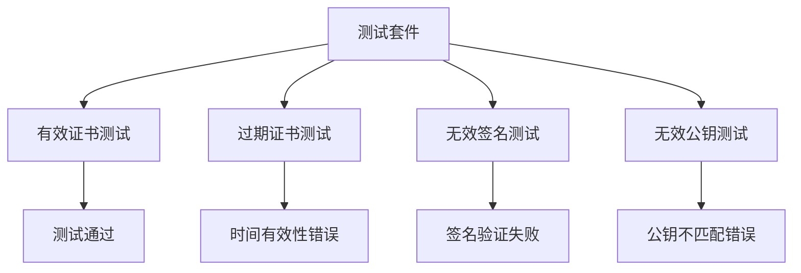

**图表来源**
- [core/src/crypto/cert.rs](file://core/src/crypto/cert.rs#L80-L185)

#### 日志记录和监控

系统集成了详细的日志记录功能：

- **警告级别**：记录证书验证失败
- **信息级别**：记录成功操作
- **错误级别**：记录严重安全事件

**章节来源**
- [core/src/crypto/cert.rs](file://core/src/crypto/cert.rs#L80-L185)

### 安全最佳实践

#### 私钥保护

1. **加密存储**：私钥使用加密算法保护
2. **访问控制**：限制私钥访问权限
3. **定期轮换**：实施证书轮换策略
4. **审计跟踪**：记录所有密钥操作

#### 证书轮换

建议的证书轮换策略：

- **定期更新**：每6个月自动轮换证书
- **紧急更新**：检测到安全威胁时立即更新
- **平滑过渡**：支持新旧证书并行验证
- **回滚机制**：保留旧证书以便回滚

#### 网络安全

- **双向认证**：要求客户端和服务端互相验证
- **加密传输**：所有通信都使用TLS加密
- **防重放攻击**：使用随机数防止重放攻击
- **访问限制**：限制可访问的IP地址范围

## 结论

LocalSend的证书管理系统提供了一个完整、安全且高效的解决方案，用于在本地网络环境中建立安全的点对点通信。该系统的主要优势包括：

### 技术优势
- **完整的证书生命周期管理**：从生成到轮换的全流程支持
- **强加密算法**：支持Ed25519和RSA-PSS等现代加密算法
- **灵活的部署模式**：支持HTTP和HTTPS协议
- **强大的验证机制**：多层次的证书验证保证安全性

### 安全特性
- **双向认证**：客户端和服务端互相验证
- **防重放攻击**：使用随机数防止重放攻击
- **内存安全**：敏感数据的安全处理
- **审计能力**：完整的操作日志记录

### 可维护性
- **模块化设计**：清晰的组件分离便于维护
- **完善的测试**：全面的单元测试覆盖
- **文档齐全**：详细的API文档和使用指南
- **错误处理**：健壮的错误处理和恢复机制

该证书管理系统为LocalSend提供了坚实的安全基础，确保用户在本地网络环境中的文件传输安全可靠。通过遵循本文档中的最佳实践和安全指南，开发者可以充分利用系统的功能并维护高安全标准。