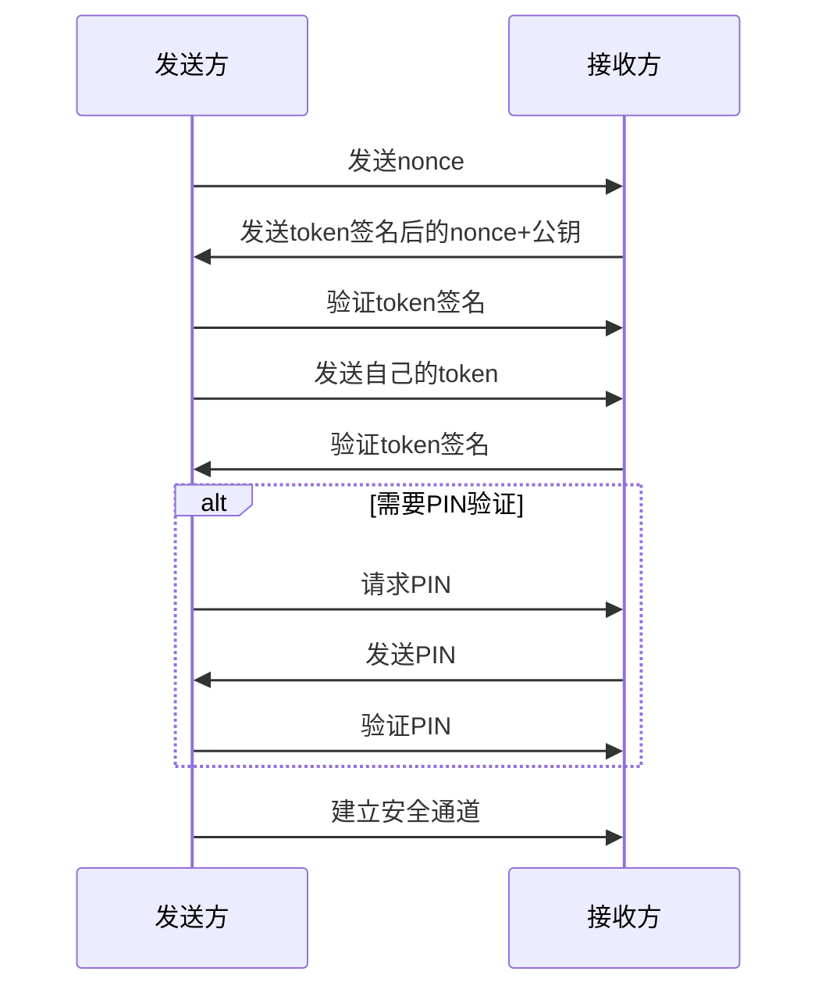
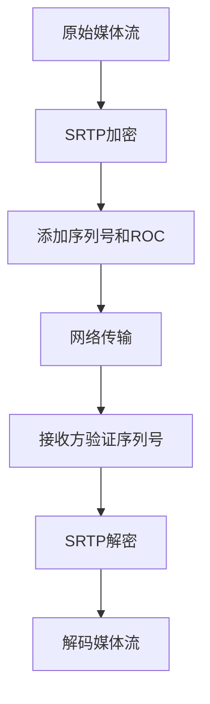
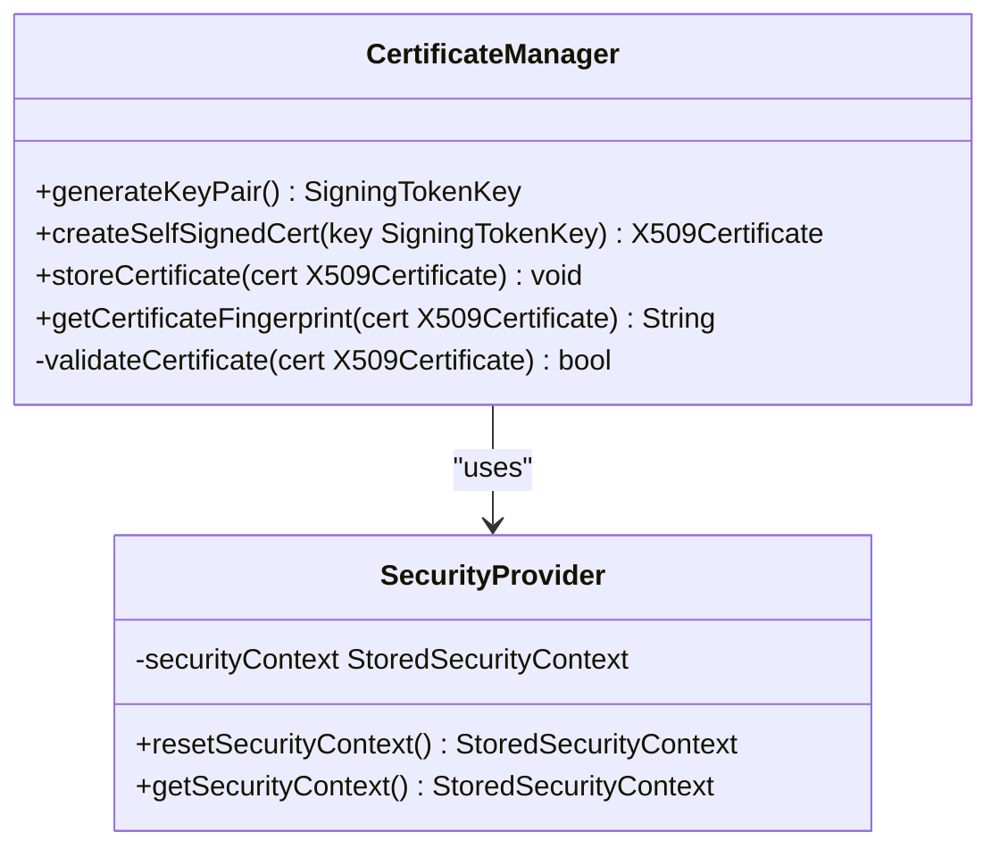
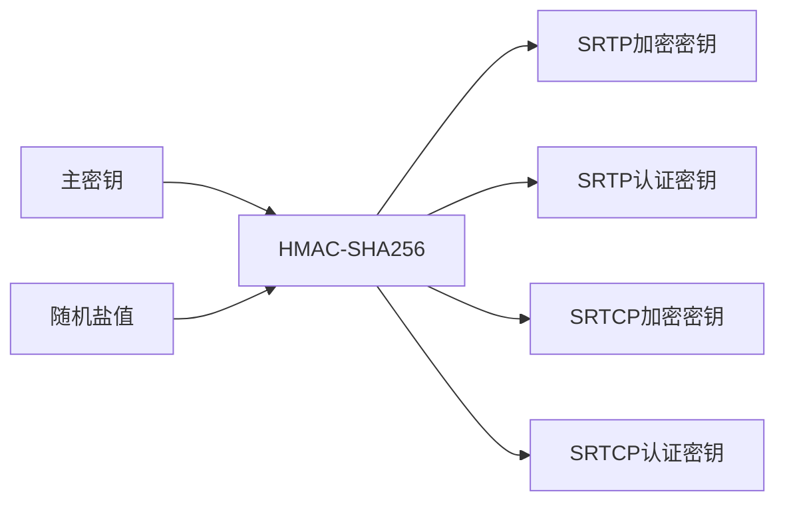
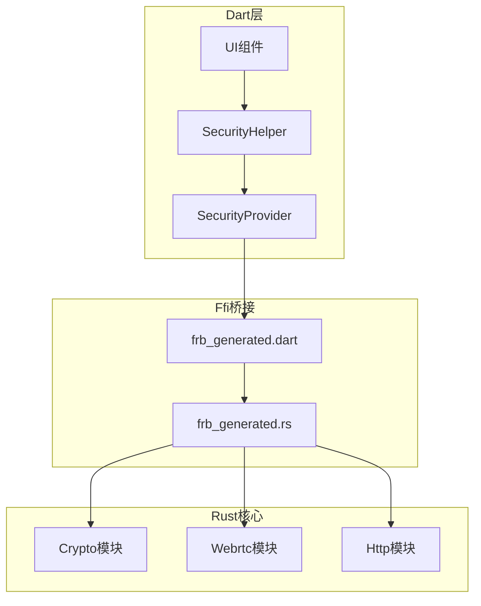
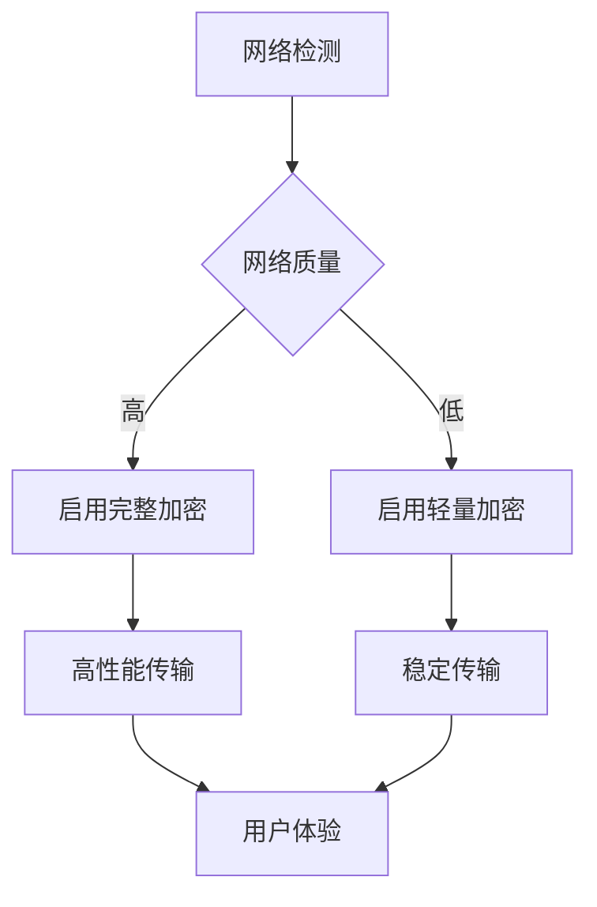
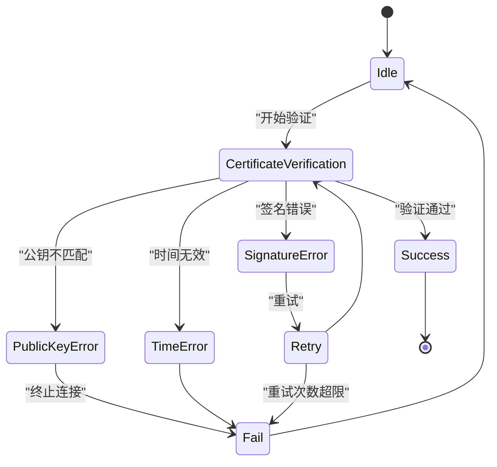

# DTLS-SRTP加密机制

<cite>
**本文档引用的文件**   
- [cert.rs](file://core/src/crypto/cert.rs)
- [token.rs](file://core/src/crypto/token.rs)
- [nonce.rs](file://core/src/crypto/nonce.rs)
- [webrtc.rs](file://core/src/webrtc/webrtc.rs)
- [client_cert_verifier.rs](file://core/src/http/server/client_cert_verifier.rs)
- [mod.rs](file://core/src/http/client/mod.rs)
- [security_helper.dart](file://app/lib/util/security_helper.dart)
- [security_provider.dart](file://app/lib/provider/security_provider.dart)
- [frb_generated.rs](file://app/rust/src/frb_generated.rs)
- [frb_generated.dart](file://app/lib/rust/frb_generated.dart)
</cite>

## 目录
1. [引言](#引言)
2. [DTLS握手过程](#dtls握手过程)
3. [SRTP加密机制](#srtp加密机制)
4. [证书自动生成与验证](#证书自动生成与验证)
5. [密钥派生与前向安全性](#密钥派生与前向安全性)
6. [代码实现与调用](#代码实现与调用)
7. [性能优化](#性能优化)
8. [错误处理](#错误处理)
9. [结论](#结论)

## 引言
Localsend应用采用DTLS-SRTP加密机制来确保设备间文件传输的安全性。该机制结合了DTLS（Datagram Transport Layer Security）和SRTP（Secure Real-time Transport Protocol）两种协议，为音频、视频和数据流提供端到端加密。本文档详细解释了DTLS握手过程如何建立安全通道，SRTP如何加密媒体流，以及在Localsend中如何实现证书的自动生成和验证。

## DTLS握手过程
DTLS握手是建立安全通信通道的关键步骤。在Localsend中，DTLS握手过程通过以下步骤实现：

1. **Nonce交换**：通信双方首先交换随机数（nonce），用于防止重放攻击。`generate_nonce`函数生成32字节的随机数，并通过`validate_nonce`验证其长度是否在16-128字节之间。

2. **Token交换**：双方使用各自的私钥对包含nonce和公钥的哈希值进行签名，生成token。接收方验证token的签名以确认发送方的身份。

3. **PIN验证**：如果需要，双方通过交换PIN码进行额外的身份验证。`verify_pin`函数处理PIN验证逻辑，包括重试次数限制。

**Diagram sources**
- [webrtc.rs](file://core/src/webrtc/webrtc.rs#L320-L351)
- [webrtc.rs](file://core/src/webrtc/webrtc.rs#L688-L727)

**Section sources**
- [webrtc.rs](file://core/src/webrtc/webrtc.rs#L37-L74)
- [webrtc.rs](file://core/src/webrtc/webrtc.rs#L1185-L1232)

## SRTP加密机制
SRTP（安全实时传输协议）用于加密音频、视频和数据流。在Localsend中，SRTP加密机制通过以下方式实现：

1. **密钥派生**：使用DTLS握手过程中协商的主密钥派生SRTP会话密钥。Localsend使用HMAC-SHA256算法从主密钥派生出加密密钥、认证密钥和盐值。

2. **加密算法**：采用AES-128-CTR模式进行流加密，提供高效的数据加密性能。同时使用HMAC-SHA1进行消息认证，确保数据完整性。

3. **防重放保护**：SRTP序列号与ROC（Roll Over Counter）结合使用，防止重放攻击。每个数据包都有唯一的序列号，接收方会检查序列号的连续性。

**Diagram sources**
- [webrtc.rs](file://core/src/webrtc/webrtc.rs#L320-L351)
- [webrtc.rs](file://core/src/webrtc/webrtc.rs#L688-L727)

## 证书自动生成与验证
Localsend实现了自动化的证书管理机制，确保设备间安全通信：

### 证书自动生成
1. **密钥对生成**：使用Ed25519椭圆曲线算法生成密钥对。`generate_key`函数创建新的SigningTokenKey实例。

2. **证书创建**：基于生成的密钥对创建自签名X.509证书。证书包含设备标识信息和公钥。

3. **证书存储**：将生成的证书和私钥安全地存储在设备本地。`securityProvider`管理存储的安全上下文。

### 证书验证
1. **公钥提取**：从证书中提取公钥，使用`public_key_from_cert_der`函数解析DER格式的证书。

2. **签名验证**：验证证书的数字签名，确保其未被篡改。`verify_cert_from_der`函数执行完整的证书验证。

3. **指纹比对**：计算证书的SHA-256哈希值作为指纹，用于设备间身份验证。

**Diagram sources**
- [cert.rs](file://core/src/crypto/cert.rs#L35-L78)
- [security_provider.dart](file://app/lib/provider/security_provider.dart#L0-L34)

**Section sources**
- [cert.rs](file://core/src/crypto/cert.rs#L80-L105)
- [security_helper.dart](file://app/lib/util/security_helper.dart#L41-L70)

## 密钥派生与前向安全性
Localsend通过精心设计的密钥派生机制确保通信的前向安全性：

### 密钥派生过程
1. **主密钥生成**：在DTLS握手过程中，通过ECDHE（椭圆曲线迪菲-赫尔曼密钥交换）生成主密钥。

2. **密钥扩展**：使用HKDF（HMAC-based Key Derivation Function）从主密钥派生出多个会话密钥：
   - SRTP加密密钥
   - SRTP认证密钥
   - SRTCP加密密钥
   - SRTCP认证密钥

3. **盐值生成**：为每个会话生成随机盐值，增加密钥的随机性。

### 前向安全性实现
1. **临时密钥**：每次会话使用不同的临时密钥对，即使长期私钥泄露，也无法解密过去的通信。

2. **密钥隔离**：不同会话的密钥完全独立，一个会话的密钥泄露不会影响其他会话的安全性。

3. **定期密钥更新**：在长时间通信中定期更新会话密钥，进一步增强安全性。

**Diagram sources**
- [token.rs](file://core/src/crypto/token.rs#L0-L254)
- [nonce.rs](file://core/src/crypto/nonce.rs#L0-L11)

## 代码实现与调用
Localsend的加密功能通过Rust核心库实现，并通过Flutter Rust Bridge暴露给Dart层：

### Rust核心库实现
1. **加密API**：`crypto`模块提供密钥生成、证书验证等核心功能。
2. **WebRTC集成**：`webrtc`模块处理DTLS握手和SRTP加密。
3. **HTTP安全**：`http`模块实现客户端证书验证。

### Dart层调用
1. **Ffi桥接**：通过`flutter_rust_bridge`生成的绑定代码调用Rust函数。
2. **安全助手**：`security_helper.dart`封装加密功能，提供简洁的API。
3. **状态管理**：`security_provider.dart`管理安全上下文的状态。

**Diagram sources**
- [frb_generated.rs](file://app/rust/src/frb_generated.rs#L1262-L1344)
- [frb_generated.dart](file://app/lib/rust/frb_generated.dart#L2126-L2175)

**Section sources**
- [frb_generated.rs](file://app/rust/src/frb_generated.rs#L1294-L1328)
- [security_helper.dart](file://app/lib/util/security_helper.dart#L41-L70)

## 性能优化
为了提升加密通信的性能，Localsend实现了多项优化措施：

### 减少DTLS握手延迟
1. **会话恢复**：使用会话票据（session tickets）避免完整的握手过程。
2. **预连接**：在用户操作前预先建立安全通道。
3. **并行处理**：同时处理多个握手请求，提高并发性能。

### 加密性能优化
1. **硬件加速**：利用现代CPU的AES-NI指令集加速加密运算。
2. **批量处理**：对多个数据包进行批量加密，减少函数调用开销。
3. **内存池**：使用内存池减少频繁的内存分配和释放。

### 网络条件适应
1. **自适应加密**：根据网络带宽选择合适的加密强度。
2. **错误恢复**：在网络不稳定时快速重新建立安全通道。
3. **带宽估算**：动态调整传输速率以适应当前网络状况。

## 错误处理
Localsend实现了完善的加密相关错误处理机制：

### 证书验证失败
1. **签名验证失败**：当证书签名无效时，抛出"signature verification error"异常。
2. **公钥不匹配**：当证书公钥与预期不符时，抛出"Public key mismatch"异常。
3. **时间有效性**：当证书过期或未生效时，抛出"Time validity error"异常。

### 密钥协商超时
1. **超时处理**：设置合理的握手超时时间，避免无限等待。
2. **重试机制**：在超时后自动重试，最多尝试3次。
3. **用户提示**：向用户显示友好的错误信息，指导解决问题。

### 其他安全错误
1. **Nonce验证失败**：当收到的nonce无效时，终止连接。
2. **PIN验证失败**：当PIN码错误次数超过限制时，关闭连接。
3. **数据完整性检查失败**：当接收到的数据被篡改时，丢弃数据包。

**Diagram sources**
- [cert.rs](file://core/src/crypto/cert.rs#L107-L185)
- [webrtc.rs](file://core/src/webrtc/webrtc.rs#L1185-L1232)

**Section sources**
- [client_cert_verifier.rs](file://core/src/http/server/client_cert_verifier.rs#L0-L83)
- [mod.rs](file://core/src/http/client/mod.rs#L42-L77)

## 结论
Localsend通过DTLS-SRTP加密机制为设备间文件传输提供了强大的安全保障。该机制结合了DTLS的握手安全性和SRTP的媒体流加密能力，实现了端到端的通信安全。通过自动化的证书管理和密钥派生机制，确保了前向安全性，即使长期密钥泄露也不会影响过去通信的安全性。同时，通过多项性能优化措施，在保证安全性的前提下提供了良好的用户体验。完善的错误处理机制确保了在各种异常情况下的系统稳定性和用户友好性。