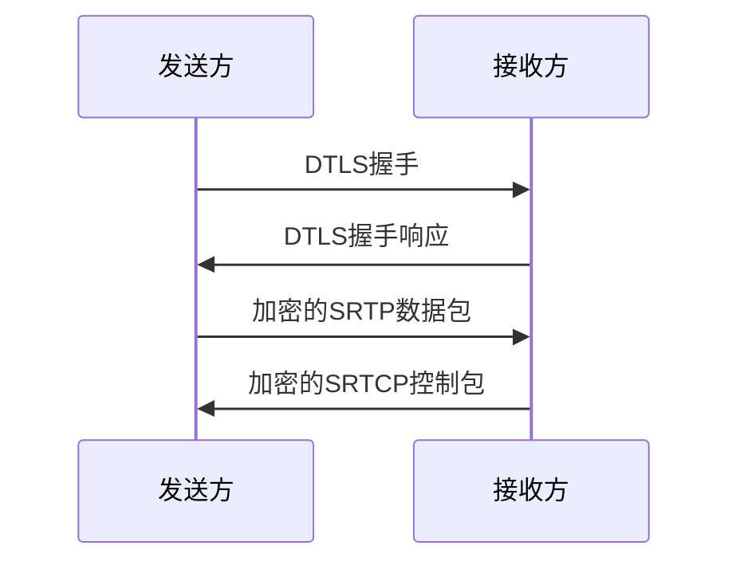
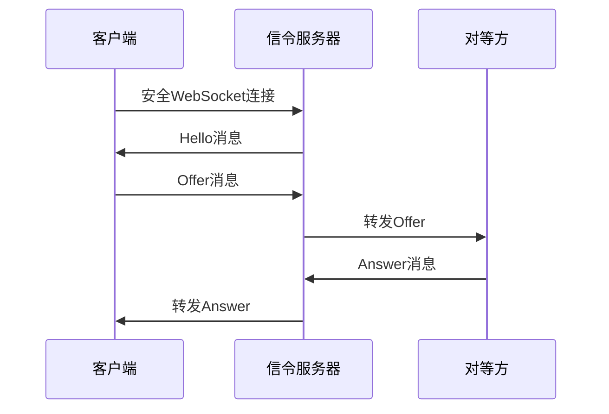
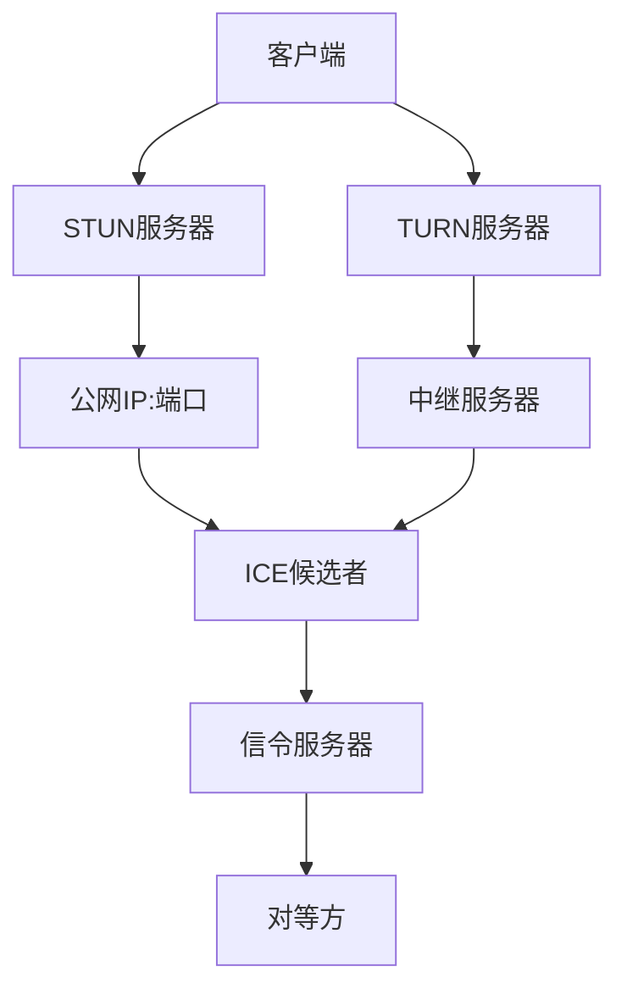
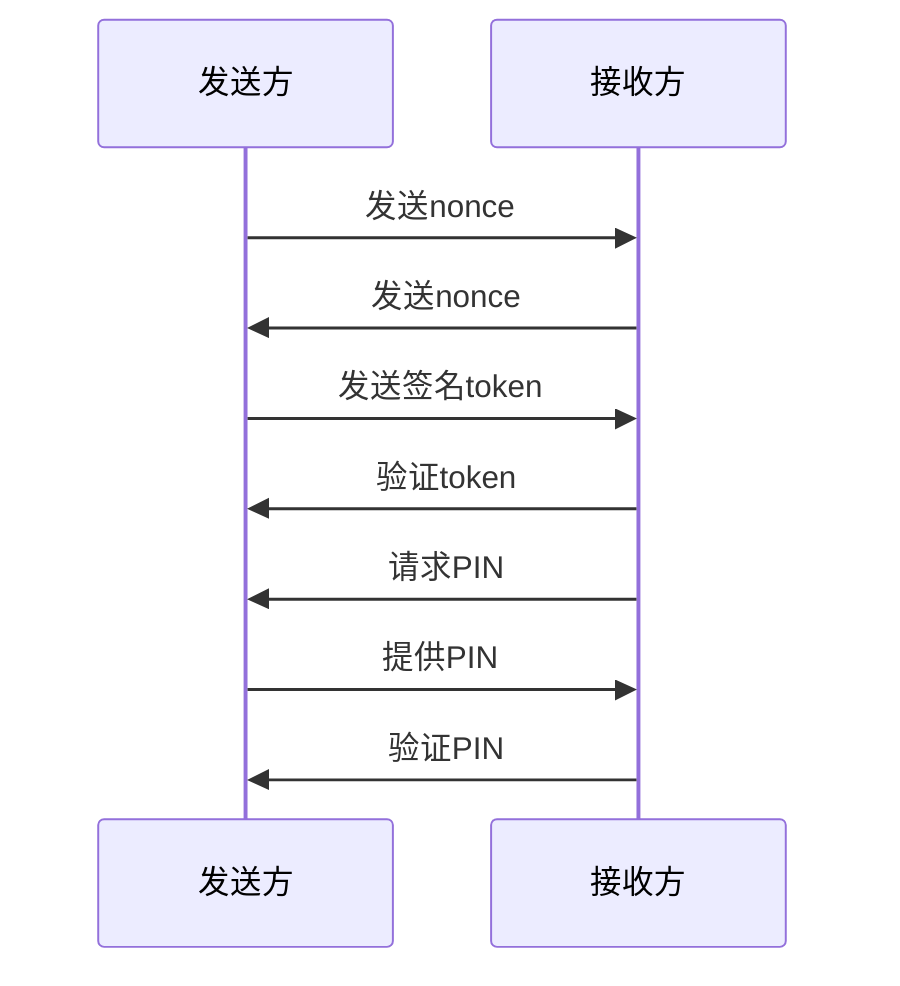
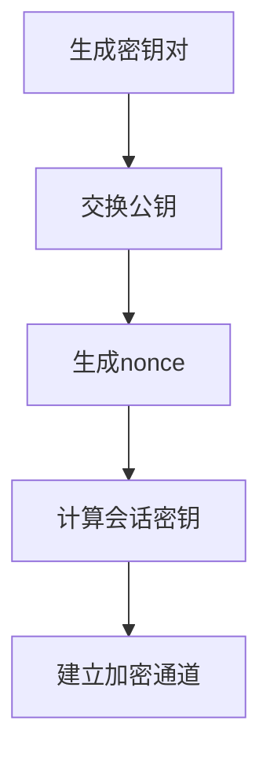
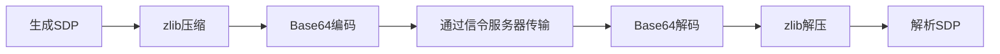

# WebRTC安全通信

<cite>
**本文档引用的文件**   
- [webrtc.rs](file://core/src/webrtc/webrtc.rs)
- [signaling.rs](file://core/src/webrtc/signaling.rs)
- [token.rs](file://core/src/crypto/token.rs)
- [cert.rs](file://core/src/crypto/cert.rs)
- [security_helper.dart](file://app/lib/util/security_helper.dart)
- [stored_security_context.dart](file://common/lib/model/stored_security_context.dart)
</cite>

## 目录
1. [引言](#引言)
2. [WebRTC安全架构概述](#webrtc安全架构概述)
3. [DTLS-SRTP加密机制](#dtls-srtp加密机制)
4. [信令服务器安全角色](#信令服务器安全角色)
5. [ICE候选者安全传输](#ice候选者安全传输)
6. [对等方身份验证](#对等方身份验证)
7. [加密密钥协商过程](#加密密钥协商过程)
8. [SDP安全参数配置](#sdp安全参数配置)
9. [安全最佳实践](#安全最佳实践)
10. [安全调试工具指南](#安全调试工具指南)

## 引言
WebRTC（Web Real-Time Communication）是一种支持浏览器和移动应用之间实时音视频通信的技术。在LocalSend项目中，WebRTC被用于实现设备间的文件传输。本文档详细描述了WebRTC连接的安全架构，包括DTLS-SRTP协议如何加密音频、视频和数据通道，信令服务器的安全角色，ICE候选者的安全传输机制，以及对等方身份验证过程。文档还阐述了加密密钥的协商过程，包括身份证书的生成、交换和验证，并提供了实际代码示例展示SDP offer/answer中的安全参数配置。

## WebRTC安全架构概述
LocalSend项目中的WebRTC安全架构基于端到端加密原则，确保数据在传输过程中的机密性和完整性。系统采用DTLS-SRTP协议进行媒体流加密，通过信令服务器协调连接建立，同时使用STUN服务器辅助NAT穿透。安全架构的核心包括身份验证、密钥协商、数据加密和完整性保护等组件，共同构建了一个安全的P2P通信环境。

**Section sources**
- [webrtc.rs](file://core/src/webrtc/webrtc.rs#L37-L74)
- [signaling.rs](file://core/src/webrtc/signaling.rs#L1-L528)

## DTLS-SRTP加密机制
DTLS-SRTP（Datagram Transport Layer Security - Secure Real-time Transport Protocol）是WebRTC中用于加密音视频和数据通道的核心协议。在LocalSend项目中，DTLS-SRTP协议通过以下方式实现加密：

1. **DTLS握手**：在建立连接时，双方通过DTLS握手协议协商加密参数，包括加密算法、密钥长度等。
2. **SRTP加密**：使用协商的密钥对SRTP（Secure Real-time Transport Protocol）数据包进行加密，确保媒体流的机密性。
3. **SRTCP加密**：同样对SRTCP（Secure RTCP）控制包进行加密，保护控制信息的安全。

系统使用`webrtc-dtls`和`webrtc-srtp`库实现DTLS-SRTP功能，确保音频、视频和数据通道的端到端加密。

**Diagram sources **
- [webrtc.rs](file://core/src/webrtc/webrtc.rs#L1050-L1095)
- [webrtc-dtls](file://core/Cargo.lock#L2771-L2844)
- [webrtc-srtp](file://core/Cargo.lock#L2846-L2919)

## 信令服务器安全角色
信令服务器在WebRTC连接建立过程中扮演着关键角色，负责交换SDP offer/answer和ICE候选者信息。在LocalSend项目中，信令服务器的安全机制包括：

1. **WebSocket安全连接**：使用`tokio-tungstenite`和`rustls`库建立安全的WebSocket连接，防止信令消息被窃听或篡改。
2. **消息验证**：对所有信令消息进行验证，确保消息来源的合法性。
3. **会话管理**：通过会话ID管理连接状态，防止会话劫持。

信令服务器处理的消息类型包括Hello、Join、Update、Left、Offer、Answer和Error，所有消息都经过加密传输。

**Diagram sources **
- [signaling.rs](file://core/src/webrtc/signaling.rs#L1-L528)
- [tungstenite](file://app/rust/Cargo.lock#L2704-L2764)

## ICE候选者安全传输
ICE（Interactive Connectivity Establishment）候选者是WebRTC连接建立过程中的关键信息，包含用于NAT穿透的网络地址。在LocalSend项目中，ICE候选者的安全传输机制包括：

1. **STUN服务器**：使用STUN（Session Traversal Utilities for NAT）服务器获取公网IP地址和端口，辅助NAT穿透。
2. **TURN服务器**：在必要时使用TURN（Traversal Using Relays around NAT）服务器作为中继，确保连接的可靠性。
3. **加密传输**：所有ICE候选者信息通过安全的信令通道传输，防止被中间人攻击。

系统通过配置STUN服务器URL来实现ICE候选者的发现和交换。

**Diagram sources **
- [webrtc.rs](file://core/src/webrtc/webrtc.rs#L1050-L1095)
- [webrtc-ice](file://core/Cargo.lock#L2771-L2844)
- [turn](file://app/rust/Cargo.lock#L2704-L2764)

## 对等方身份验证
对等方身份验证是确保通信安全的关键步骤。在LocalSend项目中，身份验证通过以下机制实现：

1. **数字签名**：使用Ed25519或RSA-PSS算法对通信数据进行数字签名，验证对等方身份。
2. **PIN验证**：通过用户输入的PIN码进行二次验证，防止未授权访问。
3. **证书验证**：验证对等方的X.509证书，确保其合法性和有效性。

身份验证过程包括nonce交换、token生成和验证、PIN挑战等步骤，确保只有授权设备才能建立连接。

**Diagram sources **
- [webrtc.rs](file://core/src/webrtc/webrtc.rs#L1185-L1232)
- [token.rs](file://core/src/crypto/token.rs#L1-L254)

## 加密密钥协商过程
加密密钥的协商是建立安全通信的基础。在LocalSend项目中，密钥协商过程包括以下步骤：

1. **密钥生成**：使用`ed25519-dalek`库生成Ed25519密钥对，或使用`rsa`库生成RSA密钥对。
2. **公钥交换**：通过安全通道交换公钥，用于后续的加密和签名操作。
3. **会话密钥生成**：基于nonce和公钥生成会话密钥，用于SRTP加密。

密钥协商过程确保了每次连接都使用唯一的加密密钥，提高了安全性。

**Diagram sources **
- [token.rs](file://core/src/crypto/token.rs#L1-L254)
- [cert.rs](file://core/src/crypto/cert.rs#L1-L186)

## SDP安全参数配置
SDP（Session Description Protocol）是WebRTC中描述媒体会话的协议。在LocalSend项目中，SDP的安全参数配置包括：

1. **SDP压缩**：使用zlib压缩SDP内容，减少传输数据量。
2. **Base64编码**：将压缩后的SDP进行Base64编码，确保安全传输。
3. **安全传输**：通过安全的信令通道传输编码后的SDP。

SDP offer/answer中的安全参数配置确保了会话描述的完整性和机密性。

**Section sources**
- [webrtc.rs](file://core/src/webrtc/webrtc.rs#L1185-L1232)
- [signaling.rs](file://core/src/webrtc/signaling.rs#L1-L528)

## 安全最佳实践
为确保WebRTC通信的安全性，LocalSend项目遵循以下安全最佳实践：

1. **强制加密**：所有通信必须使用DTLS-SRTP加密，禁止明文传输。
2. **防止媒体流劫持**：通过身份验证和密钥协商防止未授权设备接入。
3. **信令通道保护**：使用TLS加密信令通道，防止消息被窃听或篡改。
4. **定期更新密钥**：定期更换加密密钥，降低密钥泄露风险。
5. **最小权限原则**：只授予必要的权限，减少攻击面。

这些最佳实践确保了WebRTC通信的整体安全性。

**Section sources**
- [webrtc.rs](file://core/src/webrtc/webrtc.rs#L37-L74)
- [token.rs](file://core/src/crypto/token.rs#L1-L254)

## 安全调试工具指南
为帮助开发者调试WebRTC安全功能，LocalSend项目提供了以下工具：

1. **WebRTC内部监控**：通过日志记录连接状态、加密状态等信息，便于问题排查。
2. **加密状态检查**：提供API检查当前连接的加密状态，确保安全通道已建立。
3. **证书验证工具**：提供工具验证X.509证书的有效性，确保证书链完整。

开发者可以使用这些工具监控和验证WebRTC连接的安全性。

**Section sources**
- [webrtc.rs](file://core/src/webrtc/webrtc.rs#L1185-L1232)
- [security_helper.dart](file://app/lib/util/security_helper.dart#L1-L71)