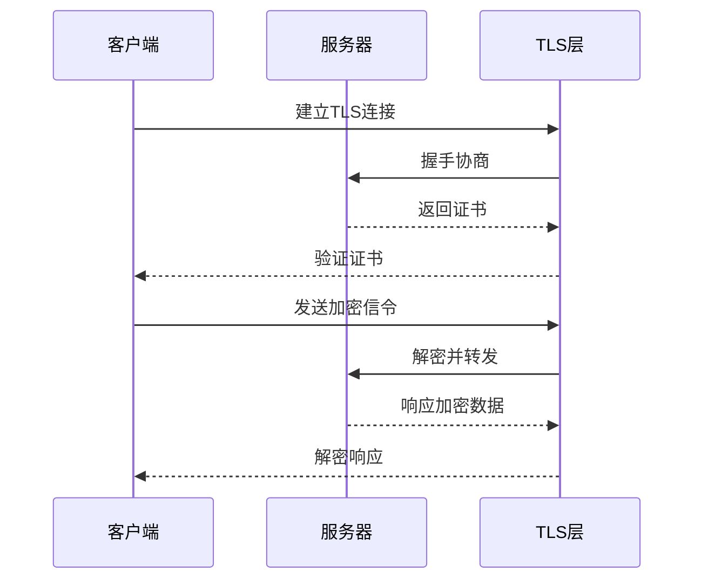
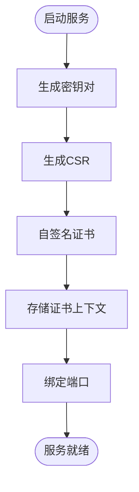
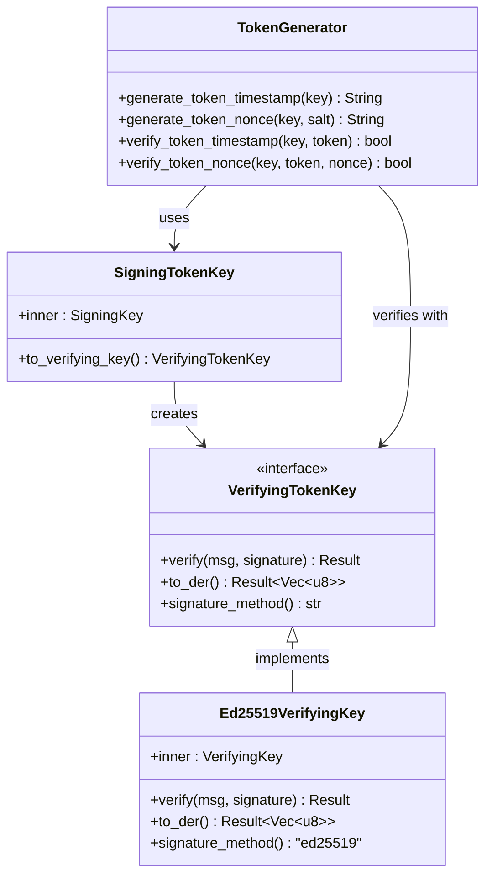
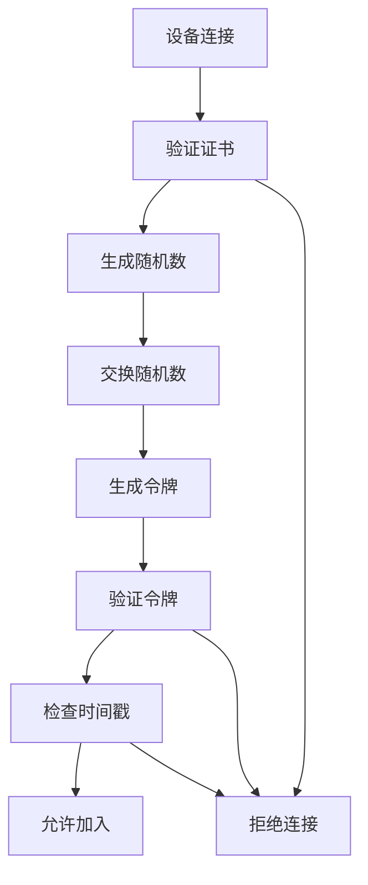
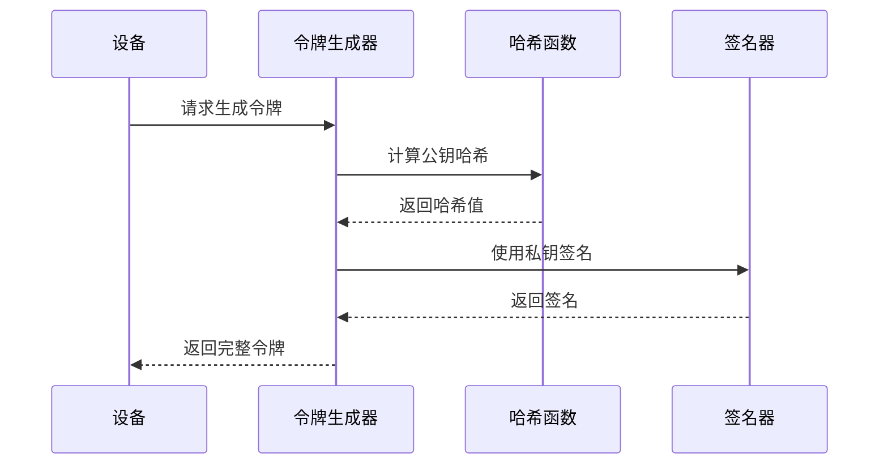
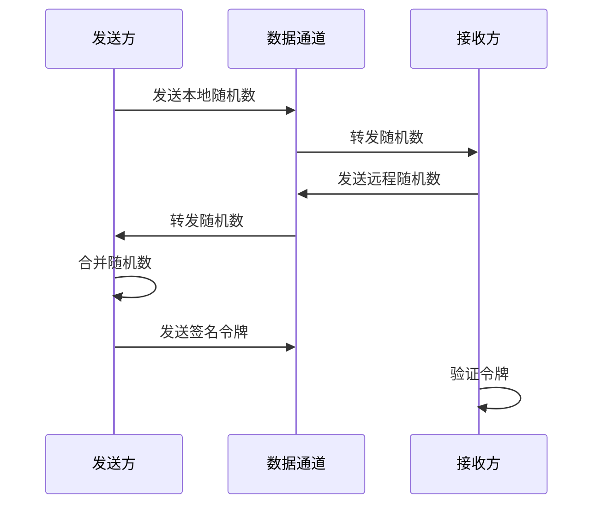
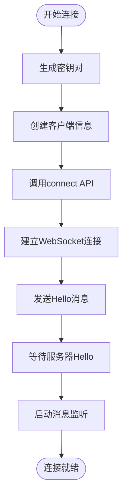
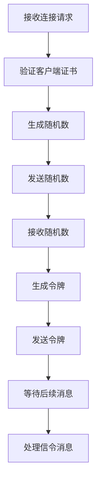
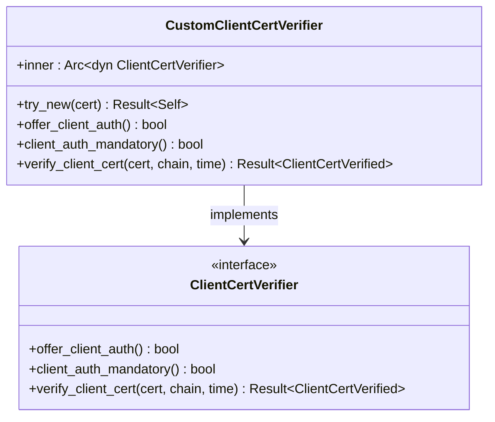
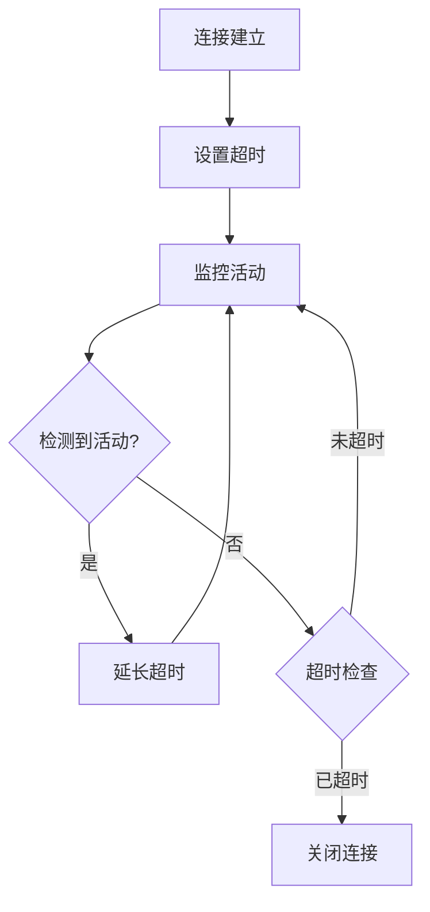

# 信令安全

<cite>
**本文档引用的文件**
- [signaling_provider.dart](file://app/lib/provider/network/webrtc/signaling_provider.dart)
- [signaling.rs](file://core/src/webrtc/signaling.rs)
- [token.rs](file://core/src/crypto/token.rs)
- [webrtc.rs](file://core/src/webrtc/webrtc.rs)
- [nonce.rs](file://core/src/crypto/nonce.rs)
- [client/mod.rs](file://core/src/http/client/mod.rs)
- [server/mod.rs](file://core/src/http/server/mod.rs)
- [security_helper.dart](file://app/lib/util/security_helper.dart)
- [stored_security_context.dart](file://common/lib/model/stored_security_context.dart)
- [client_cert_verifier.rs](file://core/src/http/server/client_cert_verifier.rs)
</cite>

## 目录
1. [简介](#简介)
2. [WebSocket信令通道加密](#websocket信令通道加密)
3. [消息完整性保护机制](#消息完整性保护机制)
4. [信令注入攻击防护](#信令注入攻击防护)
5. [会话令牌安全](#会话令牌安全)
6. [重放攻击防护](#重放攻击防护)
7. [安全连接建立过程](#安全连接建立过程)
8. [Rust后端安全验证](#rust后端安全验证)
9. [安全最佳实践](#安全最佳实践)
10. [故障排除指南](#故障排除指南)

## 简介

LocalSend采用多层安全架构来保护信令通信，确保设备间的安全文件传输。本文档详细阐述了WebSocket信令通道的安全机制，包括TLS加密、消息签名验证、会话令牌管理等核心安全特性。

## WebSocket信令通道加密

### TLS加密保护

LocalSend使用WebSocket Secure (WSS) 协议来保护信令通信通道，防止中间人攻击。

**图表来源**
- [signaling.rs](file://core/src/webrtc/signaling.rs#L196-L236)
- [signaling_provider.dart](file://app/lib/provider/network/webrtc/signaling_provider.dart#L85-L95)

### 证书管理

系统为每个设备动态生成自签名证书，确保证书的唯一性和安全性：

**图表来源**
- [security_helper.dart](file://app/lib/util/security_helper.dart#L10-L39)
- [stored_security_context.dart](file://common/lib/model/stored_security_context.dart#L1-L24)

**章节来源**
- [security_helper.dart](file://app/lib/util/security_helper.dart#L10-L39)
- [stored_security_context.dart](file://common/lib/model/stored_security_context.dart#L1-L24)

## 消息完整性保护机制

### 消息签名与验证

LocalSend使用Ed25519数字签名算法来保护信令消息的完整性：

**图表来源**
- [token.rs](file://core/src/crypto/token.rs#L10-L50)
- [token.rs](file://core/src/crypto/token.rs#L93-L129)

### 签名格式

令牌采用标准化格式：`哈希方法.哈希值.盐值.签名方法.签名`

**章节来源**
- [token.rs](file://core/src/crypto/token.rs#L131-L174)
- [token.rs](file://core/src/crypto/token.rs#L171-L223)

## 信令注入攻击防护

### 设备身份验证

系统通过多重验证机制确保只有授权设备可以加入通信会话：

**图表来源**
- [webrtc.rs](file://core/src/webrtc/webrtc.rs#L217-L253)
- [webrtc.rs](file://core/src/webrtc/webrtc.rs#L688-L727)

### 随机数验证

系统使用32字节的随机数来防止重放攻击：

**章节来源**
- [nonce.rs](file://core/src/crypto/nonce.rs#L1-L11)
- [webrtc.rs](file://core/src/webrtc/webrtc.rs#L1050-L1095)

## 会话令牌安全

### 令牌生成流程

**图表来源**
- [token.rs](file://core/src/crypto/token.rs#L115-L130)

### 令牌验证机制

系统验证令牌的多个方面：
- 哈希方法是否为SHA-256
- 签名方法是否匹配
- 时间戳有效性（1小时内）
- 随机数匹配

**章节来源**
- [token.rs](file://core/src/crypto/token.rs#L171-L223)

## 重放攻击防护

### 随机数机制

LocalSend使用双向随机数交换来防止重放攻击：

**图表来源**
- [webrtc.rs](file://core/src/webrtc/webrtc.rs#L217-L253)
- [webrtc.rs](file://core/src/webrtc/webrtc.rs#L688-L727)

### 时间戳验证

令牌包含时间戳，超过1小时的令牌将被拒绝：

**章节来源**
- [token.rs](file://core/src/crypto/token.rs#L131-L174)

## 安全连接建立过程

### Flutter前端连接流程

Flutter应用通过以下步骤建立安全信令连接：

**图表来源**
- [signaling_provider.dart](file://app/lib/provider/network/webrtc/signaling_provider.dart#L85-L95)
- [signaling_provider.dart](file://app/lib/provider/network/webrtc/signaling_provider.dart#L102-L134)

### Rust后端处理流程

Rust后端负责验证连接请求并建立安全通道：

**图表来源**
- [signaling.rs](file://core/src/webrtc/signaling.rs#L196-L236)
- [signaling.rs](file://core/src/webrtc/signaling.rs#L238-L277)

**章节来源**
- [signaling_provider.dart](file://app/lib/provider/network/webrtc/signaling_provider.dart#L85-L95)
- [signaling.rs](file://core/src/webrtc/signaling.rs#L196-L236)

## Rust后端安全验证

### 证书验证

后端使用自定义证书验证器来确保客户端证书的有效性：

**图表来源**
- [client_cert_verifier.rs](file://core/src/http/server/client_cert_verifier.rs#L10-L41)

### HTTP客户端安全

HTTP客户端配置了严格的TLS设置：

**章节来源**
- [client_cert_verifier.rs](file://core/src/http/server/client_cert_verifier.rs#L39-L82)
- [client/mod.rs](file://core/src/http/client/mod.rs#L42-L77)

## 安全最佳实践

### 信令消息最小化原则

LocalSend遵循最小化原则，只传输必要的信令信息：

| 组件 | 传输内容 | 安全措施 |
|------|----------|----------|
| 客户端信息 | 别名、版本、设备类型 | 数字签名验证 |
| 随机数 | 32字节随机数据 | 一次性使用 |
| 令牌 | 签名的哈希值 | 时间戳限制 |
| SDP消息 | 会话描述 | 加密传输 |

### 会话超时策略

系统实施多层次的超时机制：

### PIN码安全机制

对于需要PIN验证的场景，系统实施以下安全措施：

- 最大尝试次数限制（默认3次）
- 尝试失败后的延迟
- PIN码加密存储
- 会话级别的PIN验证

**章节来源**
- [common.dart](file://app/lib/provider/network/server/controller/common.dart#L10-L37)
- [webrtc.rs](file://core/src/webrtc/webrtc.rs#L1139-L1188)

## 故障排除指南

### 常见安全问题

1. **证书验证失败**
   - 检查设备时间同步
   - 验证证书链完整性
   - 确认证书未过期

2. **随机数验证错误**
   - 检查网络延迟
   - 验证随机数长度（16-128字节）
   - 确认Base64编码正确

3. **令牌验证失败**
   - 检查时间戳偏差
   - 验证签名算法匹配
   - 确认哈希计算正确

### 调试工具

系统提供了详细的日志记录功能，帮助诊断安全问题：

- 连接建立过程跟踪
- 证书验证结果
- 随机数交换记录
- 令牌生成和验证日志

**章节来源**
- [signaling.rs](file://core/src/webrtc/signaling.rs#L238-L277)
- [client/mod.rs](file://core/src/http/client/mod.rs#L75-L108)

## 结论

LocalSend通过多层次的安全机制确保信令通信的安全性。从TLS加密到数字签名验证，从随机数防重放到时间戳限制，系统构建了一个完整的安全防护体系。这些安全特性共同作用，为用户提供了可靠的文件传输安全保障。