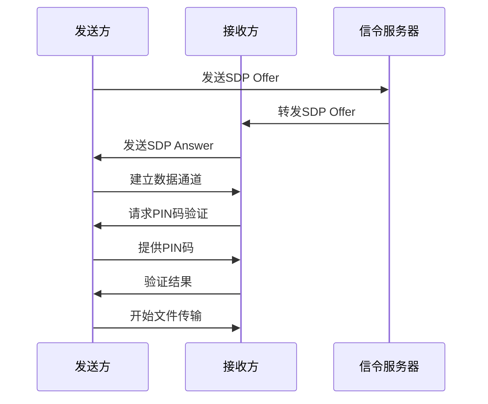
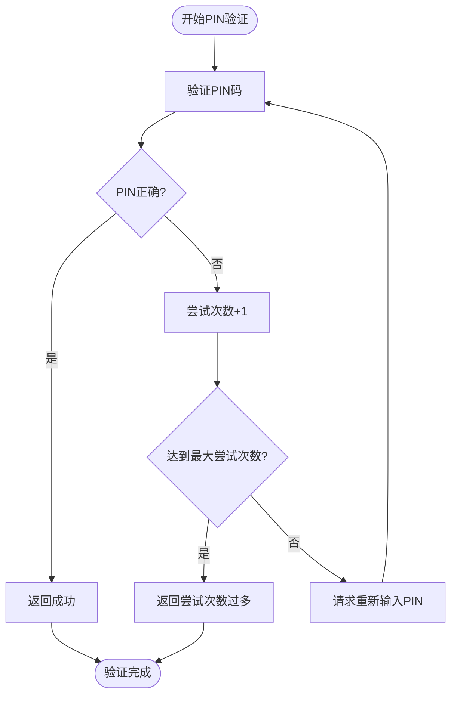
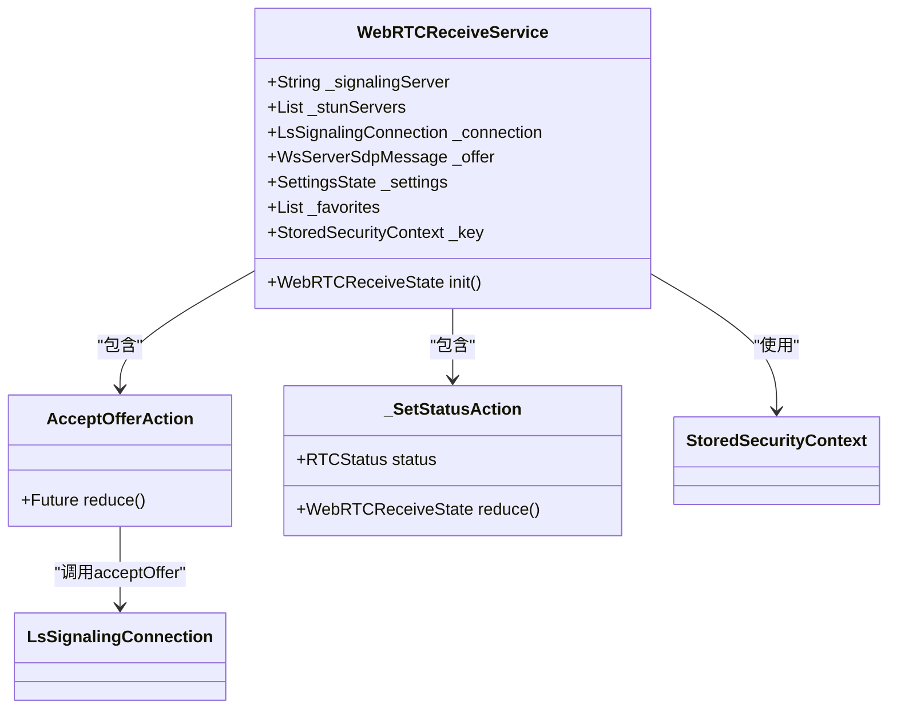
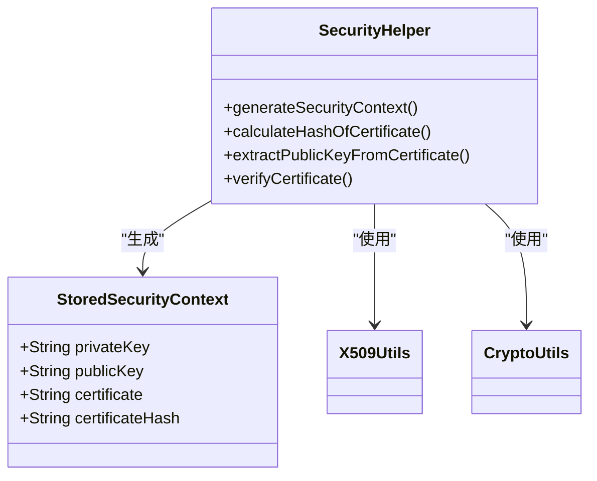

# 身份验证

<cite>
**本文档中引用的文件**  
- [webrtc_receiver.dart](file://app/lib/provider/network/webrtc/webrtc_receiver.dart)
- [security_helper.dart](file://app/lib/util/security_helper.dart)
- [webrtc.rs](file://core/src/webrtc/webrtc.rs)
- [stored_security_context.dart](file://common/lib/model/stored_security_context.dart)
- [alias_generator.dart](file://app/lib/util/alias_generator.dart)
- [favorite_device.dart](file://app/lib/model/persistence/favorite_device.dart)
</cite>

## 目录
1. [简介](#简介)
2. [设备别名生成与管理](#设备别名生成与管理)
3. [WebRTC连接中的身份验证流程](#webrtc连接中的身份验证流程)
4. [PIN码验证机制](#pin码验证机制)
5. [安全上下文与设备信任关系](#安全上下文与设备信任关系)
6. [首次连接的信任建立](#首次连接的信任建立)
7. [防止身份欺骗的措施](#防止身份欺骗的措施)
8. [代码实现示例](#代码实现示例)
9. [结论](#结论)

## 简介
本文档详细描述了LocalSend应用中WebRTC连接的身份验证流程。系统通过多层安全机制确保设备间通信的安全性，包括设备别名管理、PIN码验证、安全上下文管理和设备指纹验证等。文档将深入分析这些安全组件的实现原理和交互流程。

## 设备别名生成与管理

设备别名是用户识别设备的重要标识。系统通过随机组合形容词和水果名称来生成独特的设备别名，确保每个设备都有易于记忆且独特的标识。

别名管理支持两种模式：
- **自定义别名**：用户手动设置的别名，标记为`customAlias = true`
- **派生别名**：基于设备原始别名生成，当原始别名变化时会自动更新

别名信息存储在`FavoriteDevice`模型中，包含设备的指纹、IP地址、端口和别名等关键信息。

**Section sources**
- [alias_generator.dart](file://app/lib/util/alias_generator.dart#L1-L15)
- [favorite_device.dart](file://app/lib/model/persistence/favorite_device.dart#L1-L47)

## WebRTC连接中的身份验证流程

WebRTC连接的身份验证采用多阶段挑战-响应机制，确保通信双方的身份真实性。流程主要包括SDP交换、令牌验证和PIN码验证三个阶段。

**Diagram sources**
- [webrtc.rs](file://core/src/webrtc/webrtc.rs#L37-L74)
- [webrtc_receiver.dart](file://app/lib/provider/network/webrtc/webrtc_receiver.dart#L36-L80)

## PIN码验证机制

PIN码验证是WebRTC连接中的关键安全环节，采用双向验证机制确保通信双方的身份真实性。

### PIN码生成
PIN码由系统随机生成，长度和复杂度可配置。`PinConfig`结构包含PIN码值和最大尝试次数。

### 验证流程
1. 接收方发起PIN码挑战
2. 发送方提供PIN码
3. 接收方验证PIN码正确性
4. 双向确认验证结果

系统实施了防暴力破解机制，当尝试次数超过`maxTries`限制时，连接将被终止。

**Diagram sources**
- [webrtc.rs](file://core/src/webrtc/webrtc.rs#L1139-L1232)
- [webrtc.rs](file://core/src/webrtc/webrtc.rs#L729-L764)

**Section sources**
- [webrtc.rs](file://core/src/webrtc/webrtc.rs#L1139-L1232)
- [webrtc.rs](file://core/src/webrtc/webrtc.rs#L729-L764)

## 安全上下文与设备信任关系

`StoredSecurityContext`是管理设备信任关系的核心组件，包含设备的私钥、公钥、证书和证书哈希等安全信息。

### 安全上下文结构
- **privateKey**：设备的私钥，用于数字签名
- **publicKey**：设备的公钥，用于验证签名
- **certificate**：设备的X.509证书
- **certificateHash**：证书的SHA-256哈希值

### 信任关系管理
系统通过证书哈希值来验证设备身份，确保只有持有正确证书的设备才能建立连接。当设备首次连接时，其证书哈希被记录并用于后续的身份验证。

**Section sources**
- [stored_security_context.dart](file://common/lib/model/stored_security_context.dart#L1-L25)
- [security_helper.dart](file://app/lib/util/security_helper.dart#L1-L71)

## 首次连接的信任建立

首次连接的信任建立采用零信任模型，通过以下步骤确保连接安全：

1. **证书验证**：验证对方设备的证书有效性
2. **指纹匹配**：比对设备证书的哈希值
3. **双向认证**：双方互相验证身份
4. **信任存储**：将可信设备信息存储到本地

首次连接成功后，设备信息会被添加到收藏设备列表中，便于后续快速连接。

**Section sources**
- [security_helper.dart](file://app/lib/util/security_helper.dart#L65-L71)
- [favorite_device.dart](file://app/lib/model/persistence/favorite_device.dart#L1-L47)

## 防止身份欺骗的措施

系统实施了多层次的安全措施来防止身份欺骗攻击：

### 设备指纹验证
每个设备都有唯一的指纹，基于其证书哈希生成。系统通过比对设备指纹来验证设备身份，防止中间人攻击。

### 连接历史记录
系统维护设备连接历史记录，包括IP地址、端口和连接时间等信息。当检测到异常连接模式时，会发出安全警告。

### 防暴力破解
PIN码验证实施了严格的尝试次数限制，超过限制后连接将被终止，防止暴力破解攻击。

### 安全通信
所有通信都通过加密通道进行，确保数据传输的机密性和完整性。

**Section sources**
- [security_helper.dart](file://app/lib/util/security_helper.dart#L1-L71)
- [favorite_device.dart](file://app/lib/model/persistence/favorite_device.dart#L1-L47)

## 代码实现示例

### WebRTC接收器身份验证检查

**Diagram sources**
- [webrtc_receiver.dart](file://app/lib/provider/network/webrtc/webrtc_receiver.dart#L36-L80)

### 安全辅助功能

**Diagram sources**
- [security_helper.dart](file://app/lib/util/security_helper.dart#L1-L71)
- [stored_security_context.dart](file://common/lib/model/stored_security_context.dart#L1-L25)

## 结论
LocalSend应用通过多层次的安全机制确保WebRTC连接的安全性。系统采用设备别名、PIN码验证、安全上下文管理和设备指纹等技术，构建了完整的身份验证体系。这些安全措施有效防止了身份欺骗、中间人攻击和暴力破解等安全威胁，为用户提供安全可靠的文件传输服务。