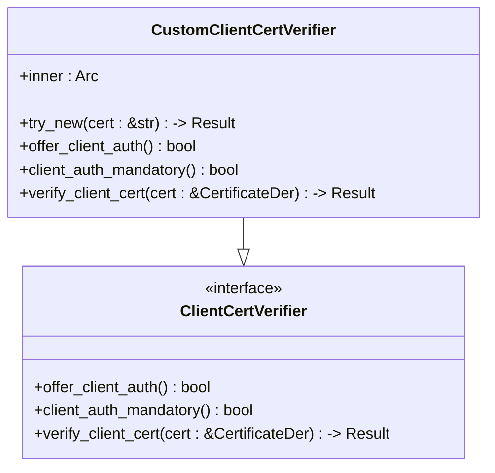
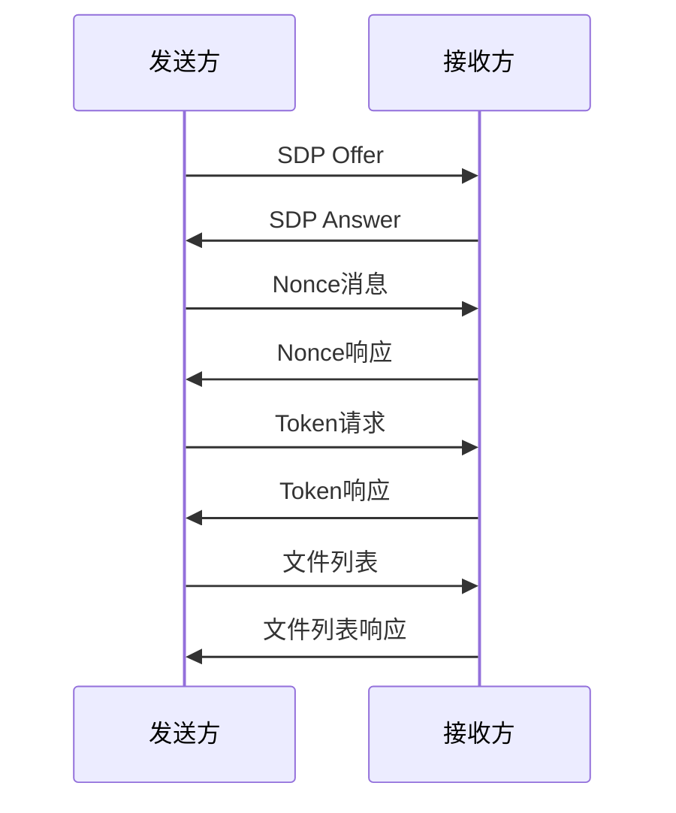
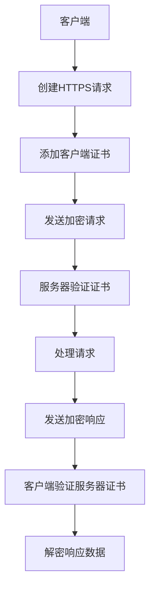
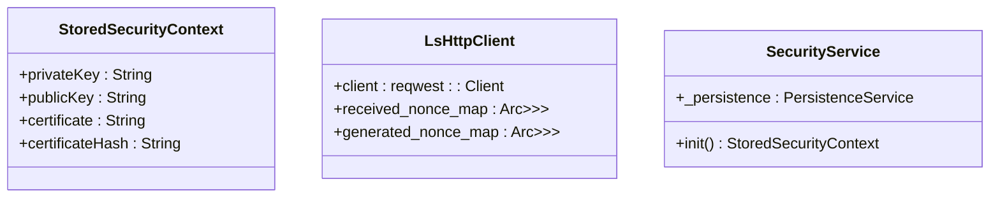

# 安全通信

<cite>
**本文档中引用的文件**   
- [client_cert_verifier.rs](file://core/src/http/server/client_cert_verifier.rs)
- [mod.rs](file://core/src/http/client/mod.rs)
- [security_helper.dart](file://app/lib/util/security_helper.dart)
- [security_provider.dart](file://app/lib/provider/security_provider.dart)
- [cert.rs](file://core/src/crypto/cert.rs)
- [token.rs](file://core/src/crypto/token.rs)
- [webrtc.rs](file://core/src/webrtc/webrtc.rs)
- [stored_security_context.dart](file://common/lib/model/stored_security_context.dart)
</cite>

## 目录
1. [简介](#简介)
2. [HTTPS通信实现](#https通信实现)
3. [WebRTC安全特性](#webrtc安全特性)
4. [HTTP请求和响应的加密处理](#http请求和响应的加密处理)
5. [安全上下文管理](#安全上下文管理)
6. [网络抓包分析](#网络抓包分析)
7. [安全配置最佳实践](#安全配置最佳实践)
8. [安全审计和漏洞扫描指导](#安全审计和漏洞扫描指导)
9. [结论](#结论)

## 简介
本项目实现了一个安全的本地文件传输应用，通过HTTPS和WebRTC技术确保通信安全。系统采用自签名证书和双向TLS认证来防止中间人攻击，同时使用Ed25519数字签名算法进行身份验证。安全通信的核心机制包括服务器端SSL配置、证书绑定、安全握手过程以及会话密钥的生命周期管理。整个系统基于Rust和Flutter构建，利用rustls库提供TLS支持，并通过Flutter桥接实现跨平台功能。

**Section sources**
- [client_cert_verifier.rs](file://core/src/http/server/client_cert_verifier.rs#L1-L84)
- [mod.rs](file://core/src/http/client/mod.rs#L1-L295)

## HTTPS通信实现

### 服务器端SSL配置
系统使用自签名证书进行HTTPS通信，服务器配置强制要求客户端证书验证。`CustomClientCertVerifier`结构体实现了`ClientCertVerifier` trait，确保所有连接都必须提供有效的客户端证书。服务器接受任何有效的证书，不关心证书的颁发机构，只验证其有效性。

**Diagram sources **
- [client_cert_verifier.rs](file://core/src/http/server/client_cert_verifier.rs#L1-L84)

### 证书绑定和安全握手过程
安全握手过程包括非ces交换和令牌验证。客户端首先生成一个随机的nonce并发送给服务器，服务器响应自己的nonce。双方将两个nonce连接起来作为后续加密操作的基础。然后使用Ed25519签名算法生成和验证令牌，确保通信双方的身份。

**Section sources**
- [mod.rs](file://core/src/http/client/mod.rs#L42-L77)
- [token.rs](file://core/src/crypto/token.rs#L131-L174)

## WebRTC安全特性

### DTLS-SRTP加密媒体流
WebRTC连接使用DTLS-SRTP协议加密媒体流。系统通过`send_offer`和`accept_offer`函数实现WebRTC信令过程，其中包含完整的安全验证机制。通信双方在建立P2P连接前需要交换nonce并验证令牌，确保连接的安全性。

**Diagram sources **
- [webrtc.rs](file://core/src/webrtc/webrtc.rs#L1-L799)

### 安全信令过程
WebRTC信令过程包含多层安全验证：
1. 非ces交换：双方交换随机生成的nonce值
2. 令牌验证：使用Ed25519签名算法验证对方身份
3. PIN码验证：可选的额外安全层，用于防止未授权访问
4. 文件列表验证：确认传输文件的完整性和权限

**Section sources**
- [webrtc.rs](file://core/src/webrtc/webrtc.rs#L1-L799)

## HTTP请求和响应的加密处理

### 加密处理流程
HTTP请求和响应的加密处理基于TLS 1.3协议，使用rustls库实现。客户端在创建`reqwest::Client`时配置了客户端证书和私钥，确保所有通信都经过加密。服务器端验证客户端证书的有效性，防止未授权访问。

**Diagram sources **
- [mod.rs](file://core/src/http/client/mod.rs#L42-L77)

### 防止中间人攻击
系统通过以下机制防止中间人攻击：
- 双向TLS认证：服务器验证客户端证书，客户端验证服务器证书
- 证书哈希验证：计算证书的SHA-256哈希值进行完整性检查
- 时间戳验证：令牌包含时间戳，过期的令牌将被拒绝
- Nonce机制：每次通信使用随机生成的nonce，防止重放攻击

**Section sources**
- [cert.rs](file://core/src/crypto/cert.rs#L1-L187)
- [token.rs](file://core/src/crypto/token.rs#L131-L174)

## 安全上下文管理

### 会话密钥存储
安全上下文包含私钥、公钥、证书和证书哈希，存储在`StoredSecurityContext`类中。系统使用LruCache缓存生成和接收的nonce，限制缓存大小为200个条目，防止内存溢出。

**Diagram sources **
- [stored_security_context.dart](file://common/lib/model/stored_security_context.dart#L1-L24)
- [mod.rs](file://core/src/http/client/mod.rs#L1-L295)

### 生命周期管理
安全上下文的生命周期由`securityProvider`管理，使用Redux模式进行状态管理。当需要重置安全上下文时，系统会生成新的RSA密钥对和自签名证书，并持久化存储。会话密钥的生命周期与应用程序的生命周期一致，重启应用时会重新加载存储的安全上下文。

**Section sources**
- [security_provider.dart](file://app/lib/provider/security_provider.dart#L1-L34)
- [security_helper.dart](file://app/lib/util/security_helper.dart#L1-L71)

## 网络抓包分析

### 加密数据包特征
通过网络抓包分析，可以观察到以下加密数据包的特征：
- 所有HTTP通信都通过HTTPS协议进行，端口为4433
- TLS握手过程中交换客户端和服务器证书
- 应用层数据完全加密，无法直接读取内容
- 每个连接都有唯一的会话ID
- 数据包大小呈现随机分布，没有明显的模式

### 抓包示例
典型的加密通信流程如下：
1. TCP三次握手
2. TLS握手（Client Hello, Server Hello, Certificate, Server Key Exchange, etc.）
3. 客户端证书验证
4. 加密的应用数据传输
5. TLS连接关闭
6. TCP四次挥手

**Section sources**
- [mod.rs](file://core/src/http/client/mod.rs#L42-L77)
- [client_cert_verifier.rs](file://core/src/http/server/client_cert_verifier.rs#L1-L84)

## 安全配置最佳实践

### 支持的TLS版本
系统使用rustls库，默认支持TLS 1.2和TLS 1.3协议。建议禁用TLS 1.0和TLS 1.1，仅启用最新的TLS版本以获得最佳安全性。

### 密码套件选择
推荐的密码套件配置：
- TLS_AES_256_GCM_SHA384
- TLS_CHACHA20_POLY1305_SHA256
- TLS_AES_128_GCM_SHA256

避免使用弱密码套件如：
- 所有基于RC4的套件
- 所有基于DES/3DES的套件
- 所有基于MD5的套件

### 安全头设置
建议的HTTP安全头设置：
- Strict-Transport-Security: max-age=63072000; includeSubDomains; preload
- X-Content-Type-Options: nosniff
- X-Frame-Options: DENY
- Content-Security-Policy: default-src 'self'

**Section sources**
- [mod.rs](file://core/src/http/client/mod.rs#L42-L77)
- [client_cert_verifier.rs](file://core/src/http/server/client_cert_verifier.rs#L1-L84)

## 安全审计和漏洞扫描指导

### 审计重点
安全审计应重点关注以下方面：
- 证书管理：检查证书生成、存储和更新机制
- 密钥安全：确保私钥不会被泄露或滥用
- 协议实现：验证TLS握手过程的正确性
- 输入验证：检查所有外部输入的验证机制
- 错误处理：确保错误信息不会泄露敏感信息

### 漏洞扫描
建议使用以下工具进行漏洞扫描：
- OWASP ZAP：用于Web应用安全测试
- Nmap：用于端口扫描和服务识别
- SSLyze：用于TLS配置分析
- RustSec：用于Rust依赖项漏洞扫描

定期执行扫描并及时修复发现的漏洞，保持系统的安全性。

**Section sources**
- [cert.rs](file://core/src/crypto/cert.rs#L1-L187)
- [token.rs](file://core/src/crypto/token.rs#L1-L254)

## 结论
本项目实现了一个全面的安全通信系统，通过HTTPS和WebRTC技术确保本地文件传输的安全性。系统采用双向TLS认证、Ed25519数字签名和nonce机制，有效防止中间人攻击和重放攻击。安全上下文的管理和会话密钥的生命周期控制确保了长期的安全性。通过遵循安全配置最佳实践和定期进行安全审计，可以进一步提高系统的安全性。