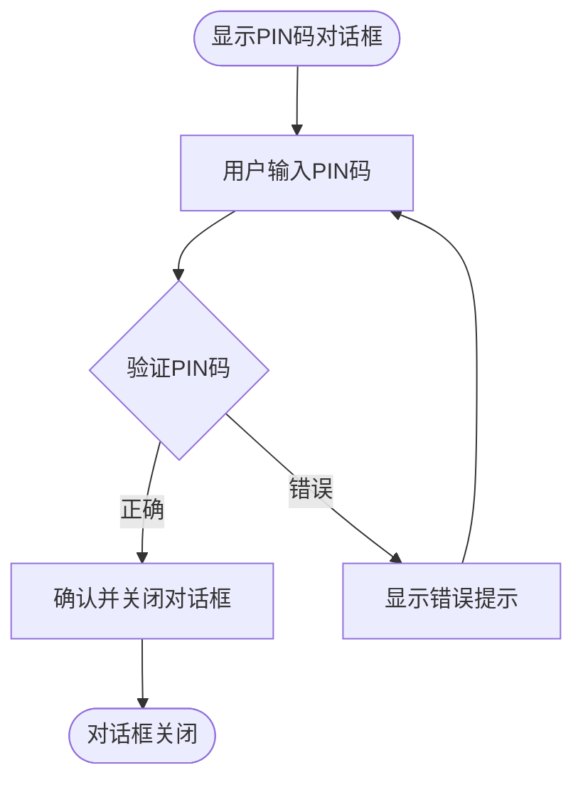
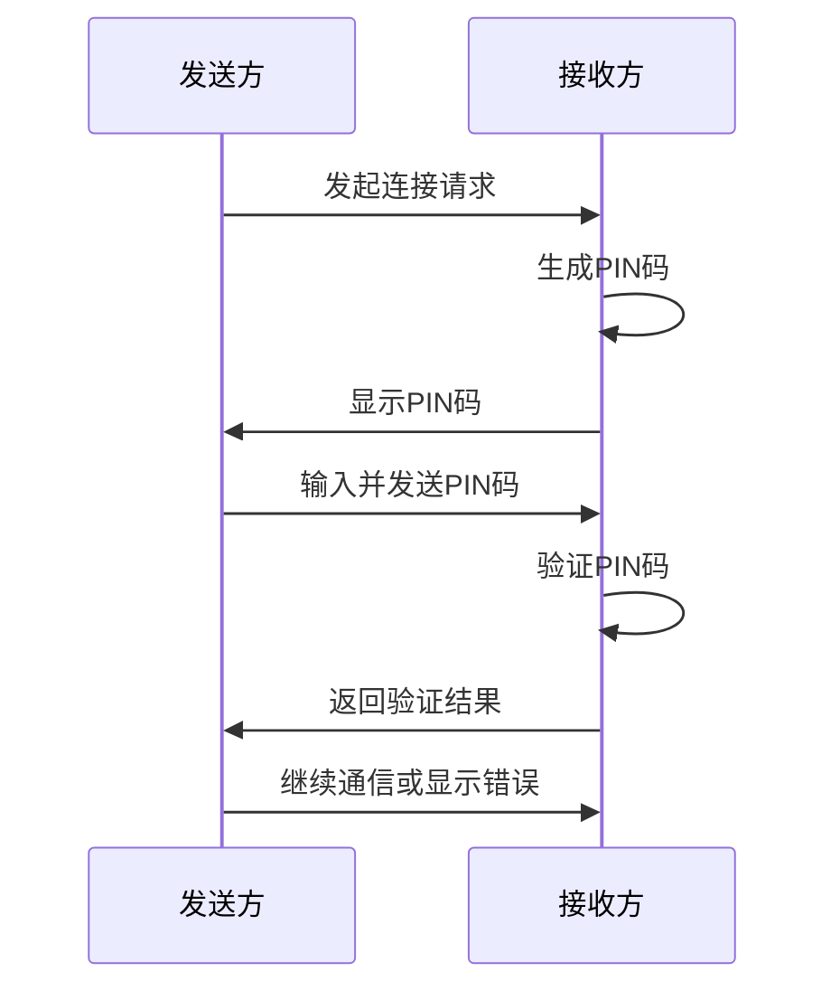

# PIN码验证

<cite>
**本文档引用的文件**  
- [pin_dialog.dart](file://app/lib/widget/dialogs/pin_dialog.dart)
- [security_provider.dart](file://app/lib/provider/security_provider.dart)
- [security_helper.dart](file://app/lib/util/security_helper.dart)
- [webrtc.dart](file://app/lib/rust/api/webrtc.dart)
- [webrtc.rs](file://core/src/webrtc/webrtc.rs)
- [send_provider.dart](file://app/lib/provider/network/send_provider.dart)
- [common.dart](file://app/lib/provider/network/server/controller/common.dart)
</cite>

## 目录
1. [引言](#引言)
2. [PIN码生成算法与显示机制](#pin码生成算法与显示机制)
3. [pin_dialog用户界面设计与交互流程](#pin_dialog用户界面设计与交互流程)
4. [security_provider的PIN码会话状态管理](#security_provider的pin码会话状态管理)
5. [security_helper的PIN码加密与比较功能](#security_helper的pin码加密与比较功能)
6. [PIN码验证交互流程](#pin码验证交互流程)
7. [错误处理策略](#错误处理策略)
8. [测试指导](#测试指导)
9. [结论](#结论)

## 引言
PIN码验证是LocalSend应用中确保设备间安全通信的关键机制。该机制通过生成和验证一次性PIN码，防止未经授权的设备访问和数据传输。本文档全面解释PIN码的生成算法、显示机制、用户界面设计、会话状态管理、加密比较功能、交互流程、错误处理策略以及测试指导，为开发者提供详细的参考。

## PIN码生成算法与显示机制
PIN码的生成算法基于`nanoid2`库，使用无歧义字符集（Alphabet.noDoppelganger）生成6位长度的随机字符串。该算法确保生成的PIN码在视觉上不易混淆，提高用户输入的准确性。PIN码的显示机制通过`PinDialog`组件实现，该组件支持显示和隐藏PIN码，以适应不同的安全需求。

**Section sources**
- [pin_dialog.dart](file://app/lib/widget/dialogs/pin_dialog.dart#L0-L31)

## pin_dialog用户界面设计与交互流程
`pin_dialog`的用户界面设计简洁直观，包含一个文本输入框、一个错误提示区域和两个操作按钮（取消和确认）。用户可以通过数字键盘输入PIN码，输入过程中支持实时验证。倒计时显示和错误状态反馈通过`showInvalidPin`属性控制，当用户输入错误PIN码时，显示相应的错误提示。

**Diagram sources**
- [pin_dialog.dart](file://app/lib/widget/dialogs/pin_dialog.dart#L33-L68)

**Section sources**
- [pin_dialog.dart](file://app/lib/widget/dialogs/pin_dialog.dart#L33-L68)

## security_provider的PIN码会话状态管理
`security_provider`负责管理PIN码会话状态，包括生成、验证和超时处理。通过`ReduxProvider`和`SecurityService`类，`security_provider`维护一个`StoredSecurityContext`对象，该对象包含所有与HTTPS通信相关的安全数据。当需要生成新的安全上下文时，`ResetSecurityContextAction`类被调用，生成新的`StoredSecurityContext`并持久化存储。

**Section sources**
- [security_provider.dart](file://app/lib/provider/security_provider.dart#L0-L34)

## security_helper的PIN码加密与比较功能
`security_helper`提供的PIN码加密和比较功能通过`generateSecurityContext`、`calculateHashOfCertificate`和`extractPublicKeyFromCertificate`等函数实现。`generateSecurityContext`函数生成一个包含私钥、公钥、证书和证书哈希的`StoredSecurityContext`对象。`calculateHashOfCertificate`函数计算证书的SHA-256哈希值，用于验证证书的完整性。`extractPublicKeyFromCertificate`函数从证书中提取公钥，用于后续的加密和验证操作。

**Section sources**
- [security_helper.dart](file://app/lib/util/security_helper.dart#L0-L71)

## PIN码验证交互流程
从发送方请求连接到接收方输入PIN码并验证的完整交互流程如下：发送方发起连接请求，接收方生成PIN码并显示在`pin_dialog`中。发送方输入PIN码后，通过`sendPin`方法发送给接收方。接收方验证PIN码，如果正确则继续通信，否则返回错误状态。整个流程通过`RtcSendController`和`RtcReceiveController`类实现，确保通信的安全性和可靠性。

**Diagram sources**
- [webrtc.dart](file://app/lib/rust/api/webrtc.dart#L130-L195)
- [webrtc.rs](file://core/src/webrtc/webrtc.rs#L1139-L1188)

**Section sources**
- [webrtc.dart](file://app/lib/rust/api/webrtc.dart#L130-L195)
- [webrtc.rs](file://core/src/webrtc/webrtc.rs#L1139-L1188)

## 错误处理策略
连续输入错误PIN码的锁定机制通过`checkPin`函数实现。该函数维护一个`pinAttempts`映射，记录每个IP地址的尝试次数。当尝试次数超过3次时，返回429状态码，表示“请求过多”。用户界面的友好提示通过`showInvalidPin`属性和`t.web.invalidPin`文本实现，当用户输入错误PIN码时，显示相应的错误信息。

**Section sources**
- [common.dart](file://app/lib/provider/network/server/controller/common.dart#L0-L38)
- [pin_dialog.dart](file://app/lib/widget/dialogs/pin_dialog.dart#L33-L68)

## 测试指导
为开发者提供模拟不同PIN码验证场景的测试指导。测试场景包括：正确PIN码验证、错误PIN码验证、连续错误PIN码锁定、PIN码超时处理等。通过单元测试和集成测试，确保PIN码验证机制的稳定性和安全性。

**Section sources**
- [send_provider.dart](file://app/lib/provider/network/send_provider.dart#L142-L173)

## 结论
PIN码验证机制是LocalSend应用中确保设备间安全通信的重要组成部分。通过详细的生成算法、用户界面设计、会话状态管理、加密比较功能、交互流程、错误处理策略和测试指导，本文档为开发者提供了全面的参考，帮助他们更好地理解和实现PIN码验证功能。